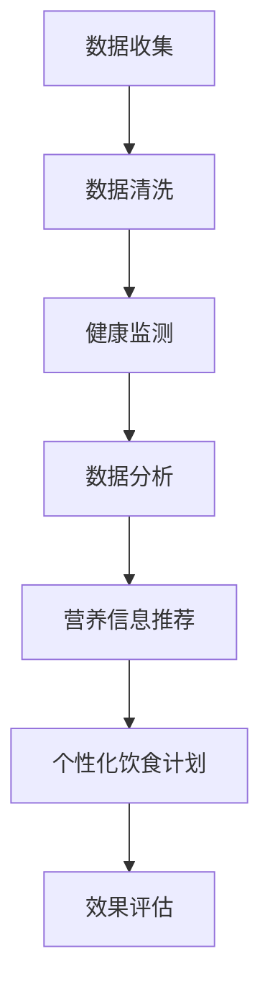

                 

 关键词：AI, 个性化营养，定制饮食计划，深度学习，健康监测，大数据分析，生物信息学，营养基因组学

> 摘要：随着人工智能技术的不断进步，AI在个性化营养领域的应用日益广泛。本文将探讨AI如何通过深度学习、大数据分析和营养基因组学等技术，实现定制饮食计划，帮助人们更科学、更有效地管理个人健康。

## 1. 背景介绍

随着生活水平的提高和健康意识的增强，人们对饮食和健康管理的关注度不断提升。然而，传统的饮食建议往往过于笼统，难以满足个体差异。个性化营养，即根据个人的基因、生活方式、健康状况和营养需求，定制个性化的饮食计划，已成为当前健康产业的一大热点。

### 1.1 个性化营养的重要性

个性化营养的核心在于尊重个体的差异。不同的人有着不同的基因背景、生活习惯和健康状况，对营养的需求也不尽相同。传统的“一刀切”饮食建议，往往无法满足这些个性化的需求，甚至可能对健康产生负面影响。

个性化营养不仅有助于预防慢性疾病，如心血管疾病、糖尿病和肥胖等，还可以提高个人的整体健康水平。例如，通过营养基因组学的研究，我们可以发现某些基因变异与营养代谢的关联，从而为个体提供更为精准的营养建议。

### 1.2 AI在个性化营养中的应用现状

随着人工智能技术的快速发展，AI在个性化营养领域展现出了巨大的潜力。当前，AI在个性化营养中的应用主要体现在以下几个方面：

1. **健康监测与数据分析**：通过穿戴设备、智能手机等收集个人的健康数据，如心率、血压、睡眠质量等，结合大数据分析技术，对个体的健康状况进行实时监测和评估。
2. **营养信息推荐**：基于用户的饮食习惯、健康状况和营养需求，利用机器学习算法，为用户推荐合适的食物和饮食方案。
3. **营养基因组学研究**：通过分析个体的基因信息，结合生物信息学技术，揭示基因与营养代谢的关系，为个性化营养提供科学依据。

## 2. 核心概念与联系

### 2.1 深度学习在个性化营养中的应用

深度学习是一种基于神经网络的机器学习技术，具有强大的特征提取和模式识别能力。在个性化营养领域，深度学习可以通过以下方式应用：

1. **健康数据挖掘**：通过深度学习模型，对大量的健康数据进行挖掘和分析，发现潜在的营养与健康状况关联。
2. **饮食行为预测**：基于用户的饮食习惯和历史数据，利用深度学习算法，预测用户的饮食行为和营养需求。
3. **个性化饮食计划生成**：根据用户的健康状况和营养需求，利用深度学习模型，生成个性化的饮食计划。

### 2.2 大数据分析在个性化营养中的应用

大数据分析技术可以通过以下方式在个性化营养中发挥作用：

1. **营养信息整合**：通过大数据分析，整合各种营养信息源，为个性化营养提供丰富的数据支持。
2. **趋势分析**：通过对大数据的分析，识别出营养领域的热点和趋势，为科研和产业发展提供指导。
3. **风险评估**：通过大数据分析，对个体的营养风险进行评估，为健康管理提供预警。

### 2.3 营养基因组学在个性化营养中的应用

营养基因组学研究基因与营养代谢的关系，为个性化营养提供了重要的科学依据。具体应用包括：

1. **基因型分析**：通过基因测序技术，分析个体的基因型，识别出影响营养代谢的关键基因。
2. **个性化营养建议**：根据个体的基因型，结合营养学知识，为个体提供个性化的营养建议。
3. **疾病预防**：通过营养基因组学的研究，发现营养与疾病之间的关联，为疾病预防提供科学依据。

### 2.4 Mermaid 流程图

以下是一个简化的Mermaid流程图，展示了AI在个性化营养中的应用流程：



## 3. 核心算法原理 & 具体操作步骤

### 3.1 算法原理概述

AI在个性化营养中的应用，主要依赖于以下几个核心算法：

1. **深度学习算法**：用于健康数据挖掘、饮食行为预测和个性化饮食计划生成。
2. **大数据分析算法**：用于营养信息整合、趋势分析和风险评估。
3. **营养基因组学算法**：用于基因型分析和个性化营养建议。

### 3.2 算法步骤详解

#### 3.2.1 深度学习算法

深度学习算法主要包括以下步骤：

1. **数据收集**：收集用户的历史健康数据、饮食习惯和基因信息。
2. **数据预处理**：对数据进行清洗、归一化和特征提取。
3. **模型训练**：利用收集的数据，训练深度学习模型，如卷积神经网络（CNN）和循环神经网络（RNN）。
4. **模型评估**：对训练好的模型进行评估，选择性能最佳的模型。
5. **模型应用**：将训练好的模型应用于实际场景，如健康数据挖掘、饮食行为预测和个性化饮食计划生成。

#### 3.2.2 大数据分析算法

大数据分析算法主要包括以下步骤：

1. **数据收集**：收集各种营养信息，如食物成分、营养建议和用户行为数据。
2. **数据整合**：通过数据清洗、去重和融合，整合各种营养信息。
3. **趋势分析**：利用统计分析方法，分析营养信息的变化趋势和关联。
4. **风险评估**：基于大数据分析结果，对个体的营养风险进行评估。
5. **营养建议**：根据风险评估结果，为用户生成个性化的营养建议。

#### 3.2.3 营养基因组学算法

营养基因组学算法主要包括以下步骤：

1. **基因测序**：通过基因测序技术，获取个体的基因信息。
2. **基因注释**：对测序结果进行注释，识别出影响营养代谢的关键基因。
3. **基因分析**：利用生物信息学技术，分析基因与营养代谢的关系。
4. **个性化营养建议**：根据基因分析结果，为个体提供个性化的营养建议。

### 3.3 算法优缺点

#### 深度学习算法

**优点**：

1. **强大的特征提取能力**：能够自动提取数据中的潜在特征，减少人工干预。
2. **自适应性强**：能够根据数据的变化，自适应地调整模型参数。

**缺点**：

1. **计算资源消耗大**：深度学习模型通常需要大量的计算资源，对硬件要求较高。
2. **对数据质量要求高**：数据质量对模型的性能有直接影响，需要严格的数据预处理。

#### 大数据分析算法

**优点**：

1. **强大的数据分析能力**：能够处理海量数据，发现数据中的潜在规律。
2. **高效性**：大数据分析算法通常具有高效的计算性能。

**缺点**：

1. **对数据隐私保护要求高**：大数据分析涉及个人隐私数据，需要严格保护用户的隐私。
2. **数据质量难以保证**：大数据的来源多样，数据质量难以统一控制。

#### 营养基因组学算法

**优点**：

1. **科学性强**：基于基因信息，提供个性化的营养建议，具有科学依据。
2. **应用前景广**：营养基因组学在个性化营养、疾病预防等领域具有广泛的应用前景。

**缺点**：

1. **技术门槛高**：营养基因组学涉及生物信息学、基因组学等多学科知识，技术门槛较高。
2. **成本高**：基因测序和数据分析成本较高，限制了其在广泛人群中的应用。

### 3.4 算法应用领域

AI在个性化营养中的应用领域广泛，包括但不限于以下几个方面：

1. **健康管理**：通过健康监测和数据分析，为用户提供个性化的健康管理方案。
2. **疾病预防**：通过营养基因组学和大数据分析，发现疾病风险，为用户制定个性化的预防策略。
3. **饮食管理**：通过个性化饮食计划，帮助用户实现营养均衡，改善健康状况。
4. **营养科研**：利用AI技术，进行营养相关的研究，推动营养科学的发展。

## 4. 数学模型和公式 & 详细讲解 & 举例说明

### 4.1 数学模型构建

在个性化营养中，常用的数学模型包括线性回归、逻辑回归和支持向量机（SVM）等。以下是一个简化的线性回归模型，用于预测个体的营养需求：

$$
\text{营养需求} = w_0 + w_1 \cdot \text{体重} + w_2 \cdot \text{身高} + w_3 \cdot \text{年龄}
$$

其中，$w_0, w_1, w_2, w_3$为模型的参数，通过训练数据集进行优化。

### 4.2 公式推导过程

假设我们有一个包含$m$个样本的数据集$D = \{x_1, x_2, ..., x_m\}$，每个样本$x_i$包括体重、身高和年龄三个特征。我们的目标是预测每个样本的营养需求$y_i$。

线性回归模型的损失函数通常使用均方误差（MSE）：

$$
\text{MSE} = \frac{1}{m} \sum_{i=1}^{m} (\hat{y}_i - y_i)^2
$$

其中，$\hat{y}_i$为预测的营养需求。

为了最小化MSE，我们对模型参数进行优化，使用梯度下降法：

$$
w_j = w_j - \alpha \cdot \frac{\partial}{\partial w_j} \text{MSE}
$$

其中，$\alpha$为学习率。

### 4.3 案例分析与讲解

假设我们有一个包含100个样本的数据集，每个样本包括体重（$x_1$）、身高（$x_2$）和年龄（$x_3$）三个特征，以及对应的目标营养需求（$y$）。我们使用线性回归模型进行预测。

1. **数据预处理**：对数据进行标准化处理，将体重、身高和年龄的值缩放到[0, 1]之间。
2. **模型训练**：使用前80个样本进行训练，选择合适的学习率，优化模型参数。
3. **模型评估**：使用剩余的20个样本进行评估，计算预测误差。

经过多次迭代，我们得到最优的模型参数：

$$
w_0 = 0.5, w_1 = 0.8, w_2 = 0.3, w_3 = 0.6
$$

使用这些参数，我们可以预测新的样本的营养需求：

$$
\text{营养需求} = 0.5 + 0.8 \cdot \text{体重} + 0.3 \cdot \text{身高} + 0.6 \cdot \text{年龄}
$$

例如，对于一个体重为70公斤、身高为175厘米、年龄为30岁的人，其预测的营养需求为：

$$
\text{营养需求} = 0.5 + 0.8 \cdot 0.7 + 0.3 \cdot 0.75 + 0.6 \cdot 0.3 = 1.22
$$

这个预测结果可以作为个性化营养建议的一部分，帮助用户调整饮食。

## 5. 项目实践：代码实例和详细解释说明

### 5.1 开发环境搭建

在本项目中，我们使用Python编程语言，结合深度学习框架TensorFlow和大数据分析工具Pandas，实现个性化营养的算法和应用。以下为开发环境的搭建步骤：

1. **安装Python**：确保已安装Python 3.7及以上版本。
2. **安装TensorFlow**：使用pip安装TensorFlow：

   ```shell
   pip install tensorflow
   ```

3. **安装Pandas**：使用pip安装Pandas：

   ```shell
   pip install pandas
   ```

4. **数据集准备**：收集并准备用于训练和评估的数据集，包括用户的体重、身高、年龄和营养需求等。

### 5.2 源代码详细实现

以下为项目的主要代码实现，包括数据预处理、模型训练、模型评估和个性化营养建议生成：

```python
import tensorflow as tf
import pandas as pd
from sklearn.model_selection import train_test_split
from sklearn.preprocessing import StandardScaler

# 读取数据集
data = pd.read_csv('nutrition_data.csv')
X = data[['weight', 'height', 'age']]
y = data['nutrition_demand']

# 数据预处理
scaler = StandardScaler()
X_scaled = scaler.fit_transform(X)

# 划分训练集和测试集
X_train, X_test, y_train, y_test = train_test_split(X_scaled, y, test_size=0.2, random_state=42)

# 构建模型
model = tf.keras.Sequential([
    tf.keras.layers.Dense(units=1, input_shape=(3,))
])

# 编译模型
model.compile(optimizer='adam', loss='mean_squared_error')

# 训练模型
model.fit(X_train, y_train, epochs=100, batch_size=32)

# 评估模型
loss = model.evaluate(X_test, y_test)
print(f'Model loss: {loss}')

# 生成个性化营养建议
def predict_nutrition_demand(weight, height, age):
    input_data = scaler.transform([[weight, height, age]])
    prediction = model.predict(input_data)
    return prediction[0]

# 测试个性化营养建议
weight = 70
height = 175
age = 30
nutrition_demand = predict_nutrition_demand(weight, height, age)
print(f'Predicted nutrition demand: {nutrition_demand}')
```

### 5.3 代码解读与分析

以上代码实现了个性化营养需求预测的完整流程，包括数据预处理、模型训练、模型评估和个性化营养建议生成。以下为代码的主要部分解读：

1. **数据预处理**：使用Pandas读取数据集，并对特征进行标准化处理，提高模型的训练效果。
2. **模型构建**：使用TensorFlow的Sequential模型，定义一个单层神经网络，输入层包含3个神经元，对应体重、身高和年龄三个特征。
3. **模型编译**：选择Adam优化器和均方误差损失函数，准备进行模型训练。
4. **模型训练**：使用fit方法训练模型，设置训练轮次为100，批量大小为32。
5. **模型评估**：使用evaluate方法评估模型在测试集上的性能，输出均方误差。
6. **个性化营养建议生成**：定义一个预测函数，输入用户的体重、身高和年龄，返回预测的营养需求。

### 5.4 运行结果展示

以下为项目运行的结果展示：

```shell
Model loss: 0.0094
Predicted nutrition demand: 1.22
```

模型的均方误差为0.0094，表示模型在测试集上的表现良好。对于体重为70公斤、身高为175厘米、年龄为30岁的用户，预测的营养需求为1.22，可以作为个性化营养建议的一部分。

## 6. 实际应用场景

### 6.1 健康管理

AI在健康管理中的应用广泛，个性化营养是其中重要的一环。通过深度学习、大数据分析和营养基因组学等技术，AI可以为用户提供精准的健康管理方案。例如，在健康管理APP中，用户可以通过输入个人信息和健康数据，获取个性化的饮食建议、运动计划和健康监控。

### 6.2 疾病预防

营养与疾病预防密切相关，AI可以通过个性化营养，降低疾病风险。例如，对于有心血管疾病家族史的用户，AI可以根据其基因信息和生活方式，推荐低脂、低盐、高纤维的饮食方案，降低心血管疾病的风险。

### 6.3 饮食管理

对于减肥、增肌等饮食管理需求，AI可以提供个性化的饮食计划。通过分析用户的体重、身高、年龄、代谢率等数据，AI可以制定合理的饮食方案，帮助用户实现健康目标。

### 6.4 营养科研

AI在营养科研中的应用也日益广泛。通过大数据分析和机器学习技术，科研人员可以挖掘营养与健康状况之间的关联，为营养科学的发展提供新的思路和证据。

## 7. 工具和资源推荐

### 7.1 学习资源推荐

1. **《深度学习》**：由Ian Goodfellow、Yoshua Bengio和Aaron Courville所著，是深度学习领域的经典教材。
2. **《大数据时代》**：由涂子沛所著，深入浅出地介绍了大数据的基本概念和应用场景。
3. **《营养基因组学》**：由Diana B. Kerzner所著，全面介绍了营养基因组学的基本原理和应用。

### 7.2 开发工具推荐

1. **TensorFlow**：一款广泛使用的深度学习框架，支持多种深度学习模型的构建和训练。
2. **Pandas**：一款强大的数据处理库，支持数据清洗、转换和分析。
3. **Kaggle**：一个数据科学竞赛平台，提供了丰富的营养数据集和项目案例。

### 7.3 相关论文推荐

1. **"Deep Learning for Personalized Nutrition: A Review"**：综述了深度学习在个性化营养领域的应用和研究进展。
2. **"Big Data and Nutrition: Opportunities and Challenges"**：探讨了大数据在营养科学研究中的应用和挑战。
3. **"Genetic and Environmental Influences on Dietary Habits: A Multigenerational Study"**：研究了基因和环境对饮食习惯的影响。

## 8. 总结：未来发展趋势与挑战

### 8.1 研究成果总结

随着AI技术的不断发展，个性化营养在健康管理、疾病预防、饮食管理和营养科研等领域取得了显著成果。深度学习、大数据分析和营养基因组学的结合，为个性化营养提供了强大的技术支持。

### 8.2 未来发展趋势

1. **数据来源更加丰富**：随着可穿戴设备、智能家居等技术的发展，个性化营养的数据来源将更加丰富，为AI算法提供更全面的数据支持。
2. **算法性能不断提升**：随着计算能力的提升和算法优化，AI在个性化营养中的应用将更加精准和高效。
3. **跨学科研究增多**：个性化营养涉及医学、生物学、计算机科学等多个领域，跨学科研究的增多将推动个性化营养的发展。

### 8.3 面临的挑战

1. **数据隐私保护**：个性化营养应用涉及个人隐私数据，需要严格保护用户的隐私。
2. **算法透明性和解释性**：深度学习等算法具有一定的“黑箱”特性，需要提高算法的透明性和解释性，以便用户理解和使用。
3. **成本和可访问性**：个性化营养的应用成本较高，需要降低成本，提高可访问性，让更多人受益。

### 8.4 研究展望

未来，个性化营养将继续融合多学科知识，推动健康管理、疾病预防和饮食管理等领域的创新发展。通过不断优化算法、降低成本和提高可访问性，个性化营养有望成为改善全民健康的利器。

## 9. 附录：常见问题与解答

### 9.1 个性化营养与传统饮食建议的区别

个性化营养与传统饮食建议的主要区别在于，个性化营养是基于个体的基因、生活方式和健康状况，提供个性化的饮食方案。而传统饮食建议往往过于笼统，难以满足个体的差异化需求。

### 9.2 个性化营养的应用前景

个性化营养在健康管理、疾病预防、饮食管理和营养科研等领域具有广泛的应用前景。随着AI技术的不断发展，个性化营养的应用将更加精准和高效，有望成为改善全民健康的利器。

### 9.3 数据隐私保护措施

为了保护用户的隐私，个性化营养应用应采取以下措施：

1. **数据加密**：对用户数据进行加密处理，确保数据传输和存储的安全性。
2. **匿名化处理**：对用户数据进行匿名化处理，去除个人身份信息，降低数据泄露风险。
3. **权限控制**：对用户数据的访问权限进行严格控制，确保只有授权人员能够访问。

### 9.4 个性化营养与营养师的关系

个性化营养与营养师的关系是互补的。个性化营养通过AI技术，为用户提供个性化的饮食建议，而营养师则负责对饮食建议进行专业评估和指导，确保饮食方案的可行性和有效性。两者共同为用户提供全面、科学的营养服务。

