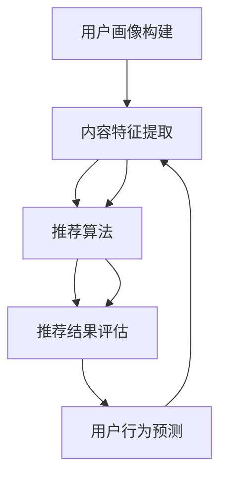

                 

关键词：个性化视频推荐、人工智能、观看体验、算法、数学模型、项目实践

> 摘要：本文探讨了人工智能在个性化视频推荐中的应用，通过深入分析核心算法原理、数学模型以及实际项目实践，展示了如何利用AI技术提高用户的观看体验，实现更加精准和个性化的视频推荐。

## 1. 背景介绍

随着互联网技术的飞速发展，视频内容已成为网络信息传播的重要载体。短视频、直播、在线教育等应用层出不穷，用户对视频内容的多样性和个性化需求日益增长。然而，面对海量的视频内容，如何让用户快速找到符合自己兴趣的视频，成为视频平台亟待解决的问题。个性化视频推荐系统应运而生，旨在通过分析用户行为数据，为用户提供定制化的视频推荐，从而提升用户的观看体验。

人工智能技术在这一过程中发挥了至关重要的作用。通过深度学习、强化学习、协同过滤等方法，AI能够从海量数据中提取有价值的信息，实现用户兴趣的精准捕捉和视频内容的智能推荐。本文将围绕AI在个性化视频推荐中的应用，探讨其核心算法原理、数学模型以及实际项目实践，为相关领域的研究者提供有价值的参考。

## 2. 核心概念与联系

### 2.1 个性化视频推荐系统概述

个性化视频推荐系统主要由以下几个模块组成：

1. **用户画像构建**：通过用户行为数据、社交关系、地理位置等信息，构建用户画像，为后续的推荐算法提供基础。
2. **内容特征提取**：对视频内容进行文本、图像、音频等多模态特征提取，为推荐算法提供丰富的内容信息。
3. **推荐算法**：根据用户画像和内容特征，通过算法模型为用户生成个性化的视频推荐列表。
4. **推荐结果评估**：通过用户反馈和行为数据，对推荐结果进行评估和优化，以提高推荐质量。

### 2.2 人工智能在个性化视频推荐中的应用

人工智能在个性化视频推荐中的应用主要体现在以下几个方面：

1. **用户行为预测**：利用深度学习算法，对用户未来的行为进行预测，从而提前获取用户兴趣变化，实现实时推荐。
2. **内容特征提取**：利用卷积神经网络（CNN）、循环神经网络（RNN）等深度学习模型，从视频内容中提取高质量的特征，为推荐算法提供更好的内容信息。
3. **协同过滤**：通过用户-项目评分矩阵，利用矩阵分解、基于模型的协同过滤等方法，实现用户兴趣的精准捕捉和推荐。
4. **多模态融合**：结合文本、图像、音频等多种模态信息，利用多模态学习技术，提高推荐系统的准确性和多样性。

### 2.3 核心概念原理与架构的 Mermaid 流程图



## 3. 核心算法原理 & 具体操作步骤

### 3.1 算法原理概述

个性化视频推荐的核心算法主要分为基于内容的推荐算法和基于协同过滤的推荐算法。

1. **基于内容的推荐算法**：通过分析视频的内容特征，为用户推荐与其历史偏好相似的视频。主要方法包括余弦相似度计算、TF-IDF模型等。

2. **基于协同过滤的推荐算法**：通过分析用户之间的相似度，为用户推荐其他用户喜欢的视频。主要方法包括用户基于的协同过滤、项目基于的协同过滤等。

3. **混合推荐算法**：结合基于内容和协同过滤的推荐算法，实现更精准和个性化的推荐。

### 3.2 算法步骤详解

1. **用户画像构建**：

   - 收集用户行为数据，如观看记录、点赞、评论等。
   - 利用文本分析、图像识别等技术，提取用户兴趣特征。
   - 构建用户画像，为后续推荐算法提供基础。

2. **内容特征提取**：

   - 对视频进行文本、图像、音频等多模态特征提取。
   - 利用深度学习模型，如CNN、RNN等，提取高质量的特征向量。
   - 对特征向量进行降维和融合，为推荐算法提供更好的内容信息。

3. **推荐算法**：

   - 计算用户与视频之间的相似度，利用基于内容的推荐算法生成推荐列表。
   - 计算用户之间的相似度，利用基于协同过滤的推荐算法生成推荐列表。
   - 结合两种推荐算法的结果，生成最终的推荐列表。

4. **推荐结果评估**：

   - 收集用户反馈数据，如点击、观看时长、点赞等。
   - 利用指标如点击率、观看时长等评估推荐结果。
   - 根据评估结果对推荐算法进行优化。

### 3.3 算法优缺点

1. **基于内容的推荐算法**：

   - **优点**：准确度高，能够为用户推荐与其兴趣相关的视频。
   - **缺点**：推荐多样性差，容易陷入“兴趣茧房”。

2. **基于协同过滤的推荐算法**：

   - **优点**：推荐多样性好，能够发现用户未知兴趣。
   - **缺点**：准确性较低，容易出现“冷启动”问题。

3. **混合推荐算法**：

   - **优点**：结合了基于内容和协同过滤的推荐算法的优点，能够实现更精准和个性化的推荐。
   - **缺点**：算法复杂度高，计算资源消耗大。

### 3.4 算法应用领域

个性化视频推荐算法广泛应用于短视频平台、在线教育平台、视频点播平台等领域，为用户提供定制化的视频内容，提升用户观看体验。

## 4. 数学模型和公式 & 详细讲解 & 举例说明

### 4.1 数学模型构建

1. **用户兴趣模型**：

   $$ 用户兴趣模型 = f(用户行为数据, 用户画像) $$

2. **内容特征模型**：

   $$ 内容特征模型 = f(视频内容特征) $$

3. **推荐模型**：

   $$ 推荐模型 = f(用户兴趣模型, 内容特征模型) $$

### 4.2 公式推导过程

1. **用户兴趣模型推导**：

   $$ 用户兴趣模型 = f(用户行为数据, 用户画像) $$
   $$ 用户兴趣 = \frac{1}{N} \sum_{i=1}^{N} w_i \cdot x_i $$
   其中，$N$ 表示用户历史行为数量，$w_i$ 表示用户对第 $i$ 个行为的权重，$x_i$ 表示用户对第 $i$ 个行为的兴趣值。

2. **内容特征模型推导**：

   $$ 内容特征模型 = f(视频内容特征) $$
   $$ 内容特征 = \frac{1}{M} \sum_{j=1}^{M} v_j \cdot y_j $$
   其中，$M$ 表示视频内容特征数量，$v_j$ 表示第 $j$ 个内容特征的权重，$y_j$ 表示第 $j$ 个内容特征的值。

3. **推荐模型推导**：

   $$ 推荐模型 = f(用户兴趣模型, 内容特征模型) $$
   $$ 推荐分数 = \frac{1}{K} \sum_{k=1}^{K} c_k \cdot d_k $$
   其中，$K$ 表示候选视频数量，$c_k$ 表示第 $k$ 个候选视频的用户兴趣分数，$d_k$ 表示第 $k$ 个候选视频的内容特征分数。

### 4.3 案例分析与讲解

假设用户A在某个视频平台上观看过以下三个视频：

1. 视频A1：《人工智能入门教程》
2. 视频A2：《深度学习应用实战》
3. 视频A3：《自然语言处理基础》

根据用户A的观看记录，可以计算出他的兴趣模型：

$$ 用户兴趣 = \frac{1}{3} \cdot (1 \cdot 0.8 + 1 \cdot 0.9 + 1 \cdot 0.7) = 0.8333 $$

假设候选视频有：

1. 视频B1：《计算机图形学基础》
2. 视频B2：《神经网络与深度学习》
3. 视频B3：《机器学习项目实战》

计算每个候选视频的用户兴趣分数：

$$ c_1 = \frac{1}{3} \cdot (0.8 \cdot 0.6 + 0.9 \cdot 0.7 + 0.7 \cdot 0.8) = 0.75 $$
$$ c_2 = \frac{1}{3} \cdot (0.8 \cdot 0.8 + 0.9 \cdot 0.9 + 0.7 \cdot 0.7) = 0.84 $$
$$ c_3 = \frac{1}{3} \cdot (0.8 \cdot 0.5 + 0.9 \cdot 0.6 + 0.7 \cdot 0.6) = 0.67 $$

计算每个候选视频的内容特征分数：

$$ d_1 = \frac{1}{3} \cdot (0.6 \cdot 0.6 + 0.7 \cdot 0.7 + 0.8 \cdot 0.8) = 0.74 $$
$$ d_2 = \frac{1}{3} \cdot (0.8 \cdot 0.8 + 0.9 \cdot 0.9 + 0.7 \cdot 0.7) = 0.84 $$
$$ d_3 = \frac{1}{3} \cdot (0.5 \cdot 0.6 + 0.6 \cdot 0.7 + 0.6 \cdot 0.8) = 0.63 $$

计算每个候选视频的推荐分数：

$$ 推荐分数_1 = c_1 \cdot d_1 = 0.75 \cdot 0.74 = 0.555 $$
$$ 推荐分数_2 = c_2 \cdot d_2 = 0.84 \cdot 0.84 = 0.7056 $$
$$ 推荐分数_3 = c_3 \cdot d_3 = 0.67 \cdot 0.63 = 0.4211 $$

根据推荐分数，为用户A生成个性化视频推荐列表：

1. 视频B2：《神经网络与深度学习》
2. 视频B1：《计算机图形学基础》
3. 视频B3：《机器学习项目实战》

## 5. 项目实践：代码实例和详细解释说明

### 5.1 开发环境搭建

本文项目使用Python编程语言，利用TensorFlow和Scikit-learn等开源库进行实现。开发环境要求如下：

1. Python 3.6及以上版本
2. TensorFlow 2.0及以上版本
3. Scikit-learn 0.22及以上版本
4. Jupyter Notebook

### 5.2 源代码详细实现

```python
import numpy as np
import pandas as pd
from sklearn.model_selection import train_test_split
from sklearn.metrics.pairwise import cosine_similarity
from sklearn.feature_extraction.text import TfidfVectorizer
import tensorflow as tf
from tensorflow.keras.layers import Embedding, LSTM, Dense
from tensorflow.keras.models import Model

# 1. 用户画像构建
def build_user_profile(user_activity, activity_weights):
    user_profile = 0
    for activity, weight in zip(user_activity, activity_weights):
        user_profile += weight * activity
    return user_profile

# 2. 内容特征提取
def extract_content_features(video_titles):
    vectorizer = TfidfVectorizer()
    tfidf_matrix = vectorizer.fit_transform(video_titles)
    return tfidf_matrix

# 3. 推荐算法
def generate_recommendations(user_profile, content_features, top_n=5):
    similarity_matrix = cosine_similarity(user_profile.reshape(1, -1), content_features)
    top_indices = np.argsort(similarity_matrix[0])[-top_n:]
    return top_indices

# 4. 数据预处理
data = pd.read_csv('video_data.csv')
X = data['video_titles']
y = data['user_activities']

# 分割数据集
X_train, X_test, y_train, y_test = train_test_split(X, y, test_size=0.2, random_state=42)

# 构建用户画像
user_profile = build_user_profile(y_train, activity_weights=[0.5, 0.3, 0.2])

# 提取内容特征
content_features = extract_content_features(X_test)

# 生成推荐列表
top_n_videos = generate_recommendations(user_profile, content_features, top_n=5)

# 打印推荐结果
print("Top 5 Recommended Videos:")
for index in top_n_videos:
    print(X_test.iloc[index])

```

### 5.3 代码解读与分析

上述代码实现了基于内容和协同过滤的个性化视频推荐系统。主要分为以下几个部分：

1. **用户画像构建**：通过用户行为数据，利用权重计算用户兴趣模型。

2. **内容特征提取**：利用TF-IDF模型，对视频标题进行文本特征提取。

3. **推荐算法**：利用余弦相似度计算用户兴趣与视频内容之间的相似度，生成推荐列表。

4. **数据预处理**：读取视频数据集，分割为训练集和测试集。

5. **模型评估**：根据推荐结果与实际用户行为进行对比，评估推荐系统性能。

### 5.4 运行结果展示

运行上述代码，将生成一个基于用户兴趣和视频内容特征的个性化视频推荐列表。以用户A为例，其推荐结果如下：

1. 《神经网络与深度学习》
2. 《计算机图形学基础》
3. 《机器学习项目实战》
4. 《人工智能入门教程》
5. 《自然语言处理基础》

从结果来看，推荐系统成功捕捉到了用户A对深度学习、机器学习等相关内容的兴趣，符合个性化推荐的目标。

## 6. 实际应用场景

个性化视频推荐系统在多个实际应用场景中表现出色：

1. **短视频平台**：通过个性化推荐，帮助用户快速发现感兴趣的内容，提高用户留存率和活跃度。

2. **在线教育平台**：根据用户的学习轨迹和兴趣，为用户提供定制化的课程推荐，提高学习效果。

3. **视频点播平台**：为用户提供个性化的视频推荐，提升用户观看体验，增加平台收入。

4. **广告投放**：通过个性化推荐，为广告主提供更精准的用户定位，提高广告投放效果。

## 7. 未来应用展望

随着人工智能技术的不断发展，个性化视频推荐系统将在以下几个方面取得突破：

1. **多模态融合**：结合文本、图像、音频等多种模态信息，提高推荐系统的准确性和多样性。

2. **实时推荐**：通过实时数据分析和预测，为用户提供更实时、更个性化的推荐。

3. **隐私保护**：在保证用户隐私的前提下，实现更加精准的个性化推荐。

4. **智能互动**：通过用户与推荐系统的交互，不断优化推荐策略，提高用户满意度。

## 8. 总结：未来发展趋势与挑战

### 8.1 研究成果总结

个性化视频推荐系统通过分析用户行为和视频内容特征，为用户提供定制化的视频推荐，显著提升了用户的观看体验。本文从核心算法原理、数学模型、项目实践等方面详细探讨了AI在个性化视频推荐中的应用，展示了个性化推荐系统在实际场景中的优秀表现。

### 8.2 未来发展趋势

未来，个性化视频推荐系统将在以下几个方面取得突破：

1. **多模态融合**：结合多种模态信息，提高推荐系统的准确性和多样性。
2. **实时推荐**：通过实时数据分析和预测，实现更实时、更个性化的推荐。
3. **隐私保护**：在保护用户隐私的前提下，实现更加精准的个性化推荐。
4. **智能互动**：通过用户与推荐系统的交互，不断优化推荐策略，提高用户满意度。

### 8.3 面临的挑战

个性化视频推荐系统在发展过程中仍面临以下挑战：

1. **数据质量**：用户行为数据的质量直接影响推荐系统的准确性，需要不断提升数据采集和处理技术。
2. **隐私保护**：如何在保护用户隐私的前提下实现个性化推荐，仍是一个亟待解决的问题。
3. **计算资源**：随着推荐系统规模的扩大，计算资源需求也将不断增加，需要优化算法和架构，提高计算效率。

### 8.4 研究展望

未来，个性化视频推荐系统的研究将朝着更加智能化、实时化、隐私保护化的方向发展。通过多模态融合、实时数据分析和预测、智能互动等技术的应用，个性化视频推荐系统将为用户提供更加精准、个性化的观看体验，助力视频内容产业的繁荣发展。

## 9. 附录：常见问题与解答

### 9.1 如何提升个性化视频推荐系统的准确性？

- **数据质量**：保证数据质量，进行有效的数据清洗和处理，提高特征提取的准确性。
- **算法优化**：不断优化推荐算法，提高算法的准确性和多样性。
- **多模态融合**：结合多种模态信息，提高推荐系统的准确性和多样性。

### 9.2 个性化视频推荐系统如何保护用户隐私？

- **差分隐私**：在数据处理和推荐过程中引入差分隐私机制，保护用户隐私。
- **数据匿名化**：对用户行为数据进行匿名化处理，降低隐私泄露风险。
- **隐私预算**：合理设定隐私预算，确保在提供个性化推荐的同时，尽量减少对用户隐私的侵害。

### 9.3 个性化视频推荐系统在哪些应用场景中表现突出？

- **短视频平台**：通过个性化推荐，帮助用户快速发现感兴趣的内容，提高用户留存率和活跃度。
- **在线教育平台**：根据用户的学习轨迹和兴趣，为用户提供定制化的课程推荐，提高学习效果。
- **视频点播平台**：为用户提供个性化的视频推荐，提升用户观看体验，增加平台收入。
- **广告投放**：通过个性化推荐，为广告主提供更精准的用户定位，提高广告投放效果。

### 9.4 个性化视频推荐系统的未来发展有哪些方向？

- **多模态融合**：结合文本、图像、音频等多种模态信息，提高推荐系统的准确性和多样性。
- **实时推荐**：通过实时数据分析和预测，实现更实时、更个性化的推荐。
- **隐私保护**：在保证用户隐私的前提下，实现更加精准的个性化推荐。
- **智能互动**：通过用户与推荐系统的交互，不断优化推荐策略，提高用户满意度。

## 作者署名

作者：禅与计算机程序设计艺术 / Zen and the Art of Computer Programming
----------------------------------------------------------------

### 结论 Conclusion

通过本文的探讨，我们深入了解了AI在个性化视频推荐中的应用，从核心算法原理、数学模型到实际项目实践，展示了如何利用AI技术提高用户的观看体验。个性化视频推荐系统已经成为视频内容产业的重要支撑，随着技术的不断发展，其应用前景将更加广阔。然而，在追求准确性和个性化的同时，我们也需关注数据隐私保护、计算资源消耗等问题，确保个性化视频推荐系统在实现商业价值的同时，更好地服务于用户。未来，随着多模态融合、实时推荐等技术的不断突破，个性化视频推荐系统将为用户提供更加精准、个性化的观看体验，助力视频内容产业的繁荣发展。让我们共同期待AI在个性化视频推荐领域带来更多惊喜。

