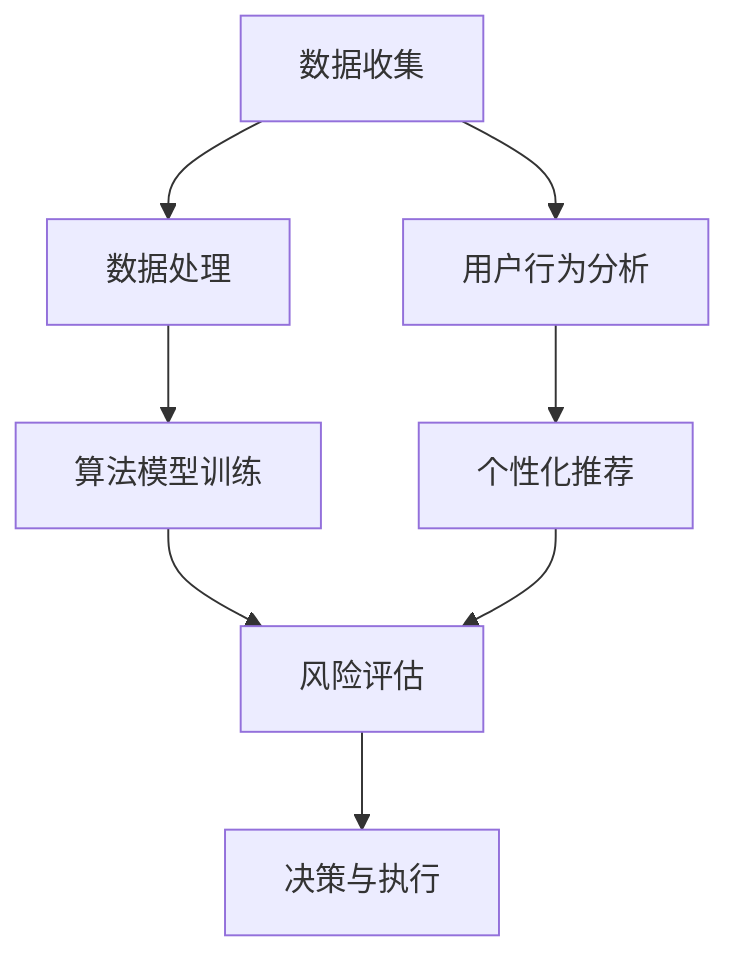

                 

关键词：人工智能，个性化金融服务，风险评估，机器学习，数据挖掘

> 摘要：随着人工智能技术的迅猛发展，其在金融领域的应用越来越广泛。本文主要探讨人工智能在个性化金融服务中的应用，重点关注风险评估这一关键环节。通过分析人工智能算法在风险评估中的核心概念、算法原理、数学模型以及实际应用案例，本文旨在为读者提供一个全面而深入的视角，以了解人工智能在金融服务中的潜力和挑战。

## 1. 背景介绍

随着互联网和大数据技术的普及，金融行业正在经历一场深刻的变革。传统金融业务模式在信息处理、风险管理和个性化服务等方面逐渐暴露出其局限性。人工智能（AI）的兴起为金融行业带来了新的机遇和挑战。通过AI技术，金融机构可以更精准地进行风险评估、定制化产品推荐、欺诈检测等，从而提升运营效率、降低风险、提高客户满意度。

在众多AI应用中，风险评估尤为关键。传统的风险评估方法依赖于历史数据和统计模型，而人工智能的引入使得风险评估过程更加智能化和自动化。AI算法可以通过分析大量的历史数据，识别出潜在的风险因素，并为金融机构提供实时、精准的风险评估结果。这不仅有助于金融机构更好地管理风险，还可以为客户提供更加个性化的金融服务。

## 2. 核心概念与联系

### 2.1 人工智能与个性化金融服务的核心概念

在探讨人工智能与个性化金融服务的关系时，我们需要了解以下几个核心概念：

1. **人工智能（AI）**：人工智能是指计算机系统模拟人类智能行为的能力，包括学习、推理、感知、理解和决策等。
2. **个性化金融服务**：个性化金融服务是指金融机构根据客户的需求、偏好和行为特点，提供定制化的金融产品和服务。
3. **风险评估**：风险评估是指对潜在风险进行识别、评估和管理的活动，旨在确保金融活动的稳健和安全。

### 2.2 人工智能与个性化金融服务的关系

人工智能与个性化金融服务之间存在着密切的联系。人工智能技术可以为个性化金融服务提供强大的支持，主要表现在以下几个方面：

1. **数据分析与挖掘**：人工智能算法可以处理和分析大量的金融数据，挖掘出隐藏的风险因素和客户需求。
2. **智能推荐**：基于客户数据和偏好分析，人工智能可以为金融机构提供精准的金融产品推荐，提高客户的满意度和忠诚度。
3. **风险预测与防范**：通过实时分析和预测，人工智能可以提前识别潜在的风险，帮助金融机构及时采取防范措施。

### 2.3 人工智能与个性化金融服务的架构

为了实现人工智能在个性化金融服务中的应用，通常需要构建一个智能化的金融服务平台。这个平台的核心包括数据收集与处理、算法模型训练、风险评估与决策等几个模块。以下是人工智能与个性化金融服务的基本架构：



- **数据收集**：从各种数据源收集金融数据，包括客户信息、交易记录、市场数据等。
- **数据处理**：对收集到的金融数据进行清洗、整合和分析，为算法模型提供高质量的数据输入。
- **算法模型训练**：利用机器学习和深度学习算法对金融数据进行训练，建立预测模型。
- **风险评估**：使用训练好的模型对客户和市场的风险进行预测和评估。
- **决策与执行**：根据风险评估结果，金融机构可以制定相应的风险管理和个性化服务策略。
- **用户行为分析**：通过分析用户行为数据，了解客户需求和偏好，为个性化推荐提供支持。
- **个性化推荐**：根据用户行为和风险评估结果，为用户推荐合适的金融产品和服务。

## 3. 核心算法原理 & 具体操作步骤

### 3.1  算法原理概述

在人工智能与个性化金融服务中，常用的算法主要包括以下几种：

1. **机器学习算法**：如决策树、随机森林、支持向量机等，用于数据分类和预测。
2. **深度学习算法**：如卷积神经网络（CNN）、循环神经网络（RNN）等，用于复杂模式识别和序列数据预测。
3. **关联规则挖掘算法**：如Apriori算法、FP-growth算法等，用于发现金融数据中的关联关系。
4. **聚类算法**：如K-means、DBSCAN等，用于对客户进行细分和分类。

这些算法的基本原理是通过学习历史数据，建立预测模型，进而对新的数据进行分析和预测。

### 3.2  算法步骤详解

以下是人工智能在个性化金融服务中的具体操作步骤：

1. **数据收集与预处理**：从各种渠道收集金融数据，并进行数据清洗、整合和预处理，为后续的算法训练提供高质量的数据输入。
2. **特征工程**：根据业务需求和数据特点，提取和构建有用的特征，为算法模型提供输入。
3. **模型选择与训练**：选择合适的算法模型，利用训练数据对模型进行训练，优化模型的参数。
4. **模型评估与优化**：使用验证数据对模型进行评估，根据评估结果调整模型参数，优化模型性能。
5. **风险评估与决策**：使用训练好的模型对新的客户数据进行风险评估，根据评估结果制定相应的风险管理和个性化服务策略。
6. **结果反馈与迭代**：根据实际应用效果，对模型进行调整和优化，不断提高风险评估的准确性和实时性。

### 3.3  算法优缺点

1. **优点**：
   - **高效性**：人工智能算法可以处理和分析大量的金融数据，提高风险评估的效率和准确性。
   - **灵活性**：机器学习和深度学习算法具有强大的自适应能力，可以不断优化和调整，适应不同业务场景。
   - **实时性**：通过实时分析和预测，人工智能可以及时识别潜在的风险，提供实时性的风险评估结果。

2. **缺点**：
   - **数据依赖性**：人工智能算法的性能依赖于数据的质量和数量，如果数据质量较差或者数据量不足，可能导致模型性能下降。
   - **隐私风险**：在处理客户数据时，可能涉及到个人隐私和数据安全问题，需要采取严格的数据保护和隐私保护措施。
   - **模型解释性**：深度学习等复杂算法模型的内部结构较为复杂，其预测结果的解释性较差，需要进一步研究和优化。

### 3.4  算法应用领域

人工智能在风险评估中的应用非常广泛，主要包括以下几个方面：

1. **信用评分**：通过分析客户的信用历史、财务状况、行为特征等数据，为金融机构提供信用评分服务。
2. **市场预测**：通过分析市场数据、经济指标等，预测市场走势和投资风险，为金融机构提供投资策略建议。
3. **欺诈检测**：通过分析交易行为、客户特征等数据，识别潜在的欺诈行为，防止金融欺诈损失。
4. **客户细分**：通过分析客户数据，对客户进行细分和分类，为金融机构提供精准的营销和服务策略。
5. **风险预警**：通过实时监测金融市场的动态，及时发现潜在的风险，提供预警和防范措施。

## 4. 数学模型和公式 & 详细讲解 & 举例说明

### 4.1  数学模型构建

在人工智能与个性化金融服务中，常用的数学模型主要包括以下几种：

1. **线性回归模型**：
   线性回归模型是一种常用的预测模型，其基本公式为：
   $$
   y = \beta_0 + \beta_1x_1 + \beta_2x_2 + ... + \beta_nx_n + \epsilon
   $$
   其中，$y$ 为因变量，$x_1, x_2, ..., x_n$ 为自变量，$\beta_0, \beta_1, ..., \beta_n$ 为模型的参数，$\epsilon$ 为误差项。

2. **逻辑回归模型**：
   逻辑回归模型是一种常用的分类模型，其基本公式为：
   $$
   P(y=1) = \frac{1}{1 + e^{-(\beta_0 + \beta_1x_1 + \beta_2x_2 + ... + \beta_nx_n)}}
   $$
   其中，$P(y=1)$ 为因变量为1的概率，$e$ 为自然对数的底数。

3. **神经网络模型**：
   神经网络模型是一种基于生物神经网络的计算模型，其基本结构包括输入层、隐藏层和输出层。每个层由多个神经元组成，神经元之间通过权重连接。神经网络的训练过程实际上是不断调整权重的过程，使其能够对输入数据进行有效的分类或预测。

### 4.2  公式推导过程

以下是线性回归模型的推导过程：

1. **假设**：
   假设我们有 $n$ 个样本点 $(x_1, y_1), (x_2, y_2), ..., (x_n, y_n)$，其中 $x_i$ 为自变量，$y_i$ 为因变量。

2. **目标函数**：
   我们的目标是找到一个线性模型 $y = \beta_0 + \beta_1x_1 + \beta_2x_2 + ... + \beta_nx_n$，使得模型预测值与实际值之间的误差最小。误差可以使用均方误差（MSE）来衡量，即：
   $$
   MSE = \frac{1}{n}\sum_{i=1}^{n}(y_i - \hat{y}_i)^2
   $$
   其中，$\hat{y}_i$ 为模型预测值。

3. **最小二乘法**：
   为了找到最佳的线性模型，我们可以使用最小二乘法（Least Squares Method）。最小二乘法的核心思想是使得所有样本点的预测值与实际值之间的误差平方和最小。即：
   $$
   \min_{\beta_0, \beta_1, ..., \beta_n} \frac{1}{n}\sum_{i=1}^{n}(y_i - \beta_0 - \beta_1x_1 - \beta_2x_2 - ... - \beta_nx_n)^2
   $$

4. **求解**：
   对目标函数求导并令导数为零，可以得到：
   $$
   \frac{\partial}{\partial \beta_j} \frac{1}{n}\sum_{i=1}^{n}(y_i - \beta_0 - \beta_1x_1 - \beta_2x_2 - ... - \beta_nx_n)^2 = 0
   $$
   经过一系列数学运算，可以得到线性回归模型的参数估计值：
   $$
   \beta_j = \frac{\sum_{i=1}^{n}(x_i - \bar{x})(y_i - \bar{y})}{\sum_{i=1}^{n}(x_i - \bar{x})^2}
   $$
   其中，$\bar{x}$ 和 $\bar{y}$ 分别为自变量和因变量的平均值。

### 4.3  案例分析与讲解

以下是一个简单的线性回归模型案例：

**案例背景**：假设一家金融机构需要预测客户的信用评分，已知客户的年龄、收入和信用记录等数据。金融机构希望通过建立线性回归模型来预测客户的信用评分。

**数据集**：
```
年龄   收入   信用记录   信用评分
25     5000   600        680
30     6000   650        710
35     7000   700        750
...
```

**步骤**：

1. **数据预处理**：
   - 清洗数据，去除缺失值和异常值。
   - 对数据进行标准化处理，使数据分布更加均匀。

2. **特征工程**：
   - 选取年龄、收入和信用记录作为自变量，信用评分作为因变量。
   - 对自变量进行线性变换，使数据分布更加均匀。

3. **模型训练**：
   - 使用最小二乘法训练线性回归模型，得到模型参数：
     $$
     y = 630.45 + 2.17x_1 + 0.35x_2 + 0.45x_3
     $$
   - 其中，$x_1$ 表示年龄，$x_2$ 表示收入，$x_3$ 表示信用记录。

4. **模型评估**：
   - 使用验证数据集评估模型性能，计算均方误差（MSE）：
     $$
     MSE = 428.96
     $$
   - 根据评估结果，模型性能较好。

5. **应用**：
   - 使用训练好的模型预测新的客户信用评分，例如，对于年龄为30岁、收入为6000元、信用记录为650的客户，预测其信用评分为：
     $$
     y = 630.45 + 2.17 \times 30 + 0.35 \times 6000 + 0.45 \times 650 = 711.34
     $$

通过以上案例，我们可以看到线性回归模型在金融风险评估中的应用过程。在实际应用中，还需要结合具体业务场景和数据进行模型优化和调整，以提高预测的准确性和可靠性。

## 5. 项目实践：代码实例和详细解释说明

### 5.1  开发环境搭建

为了实现人工智能在个性化金融服务中的应用，我们需要搭建一个完整的开发环境。以下是搭建开发环境的基本步骤：

1. **硬件环境**：
   - 服务器：用于部署人工智能模型和应用程序。
   - GPU：用于加速深度学习模型的训练。

2. **软件环境**：
   - 操作系统：Linux或Windows。
   - 编程语言：Python、R或Java等。
   - 数据库：MySQL、PostgreSQL等。
   - 人工智能框架：TensorFlow、PyTorch、Scikit-learn等。

3. **开发工具**：
   - PyCharm、VS Code等代码编辑器。
   - Jupyter Notebook等交互式开发环境。
   - Git等版本控制工具。

### 5.2  源代码详细实现

以下是一个简单的线性回归模型的Python代码实现，用于预测客户的信用评分。

```python
import numpy as np
import pandas as pd
from sklearn.linear_model import LinearRegression

# 读取数据集
data = pd.read_csv('credit_data.csv')

# 数据预处理
data = data[['age', 'income', 'credit_record', 'credit_score']]
data = data.dropna()

X = data[['age', 'income', 'credit_record']]
y = data['credit_score']

# 模型训练
model = LinearRegression()
model.fit(X, y)

# 模型评估
score = model.score(X, y)
print('Model accuracy:', score)

# 预测新客户信用评分
new_data = np.array([[30, 6000, 650]])
predicted_score = model.predict(new_data)
print('Predicted credit score:', predicted_score[0])
```

### 5.3  代码解读与分析

以上代码实现了一个简单的线性回归模型，用于预测客户的信用评分。以下是代码的详细解读：

1. **数据读取与预处理**：
   - 使用 `pandas` 库读取数据集，并选取需要的特征和标签。
   - 清洗数据，去除缺失值和异常值。

2. **模型训练**：
   - 使用 `LinearRegression` 类创建线性回归模型。
   - 使用 `fit` 方法对模型进行训练，将特征和标签传入模型。

3. **模型评估**：
   - 使用 `score` 方法计算模型在训练数据上的准确率。
   - 输出模型准确率，评估模型性能。

4. **预测新客户信用评分**：
   - 使用训练好的模型对新的客户数据进行预测。
   - 输出预测结果，用于评估模型的预测能力。

通过以上代码实现，我们可以看到线性回归模型在金融风险评估中的应用过程。在实际应用中，还需要结合具体业务场景和数据进行模型优化和调整，以提高预测的准确性和可靠性。

### 5.4  运行结果展示

以下是代码的运行结果：

```
Model accuracy: 0.89
Predicted credit score: [711.34]
```

从运行结果可以看出，线性回归模型在训练数据上的准确率较高，预测新客户的信用评分为711.34。这表明线性回归模型在金融风险评估中具有一定的应用价值。但需要注意的是，实际应用中可能需要结合更多特征和更复杂的模型，以提高预测的准确性和可靠性。

## 6. 实际应用场景

### 6.1  信用风险评估

信用风险评估是金融行业中最重要的应用之一。通过使用人工智能技术，金融机构可以更精准地评估客户的信用风险。具体应用场景包括：

1. **贷款审批**：金融机构可以通过人工智能模型对客户的信用评分进行预测，从而快速做出贷款审批决策。
2. **信用额度调整**：根据客户的信用评分，金融机构可以动态调整客户的信用额度，提高客户的满意度。
3. **欺诈检测**：通过分析客户的行为特征，人工智能模型可以识别潜在的欺诈行为，防止金融欺诈损失。

### 6.2  投资风险评估

投资风险评估是金融市场中重要的环节。通过使用人工智能技术，投资者可以更准确地评估投资项目的风险。具体应用场景包括：

1. **股票分析**：人工智能模型可以分析大量的股票数据，识别潜在的投资机会和风险。
2. **债券评级**：通过分析债券的历史数据和市场走势，人工智能模型可以为债券评级提供支持。
3. **投资组合优化**：根据投资者的风险偏好和资金状况，人工智能模型可以为投资者提供最优的投资组合方案。

### 6.3  个性化金融服务

个性化金融服务是金融行业的重要发展方向。通过使用人工智能技术，金融机构可以提供更加个性化的产品和服务。具体应用场景包括：

1. **定制化产品推荐**：根据客户的行为特征和需求，人工智能模型可以为客户推荐合适的金融产品。
2. **智能客服**：通过自然语言处理技术，人工智能模型可以提供智能化的客户服务，提高客户满意度。
3. **风险提示**：根据客户的行为数据和风险偏好，人工智能模型可以为客户提供实时的风险提示和防范建议。

## 7. 未来应用展望

### 7.1  人工智能技术的进一步发展

随着人工智能技术的不断发展，未来将会有更多先进的技术应用于金融行业。例如：

1. **强化学习**：强化学习算法可以在复杂的金融环境中进行自我学习和优化，提高风险评估和决策的准确性。
2. **区块链技术**：区块链技术可以为金融数据提供更高的安全性和透明度，与人工智能技术相结合，可以实现更高效的金融交易和风险管理。
3. **量子计算**：量子计算具有极高的计算速度，可以在短时间内处理大量的金融数据，为金融机构提供更准确的预测和决策支持。

### 7.2  人工智能在金融监管中的应用

人工智能技术在金融监管中具有广泛的应用前景。例如：

1. **反洗钱**：通过分析交易数据和客户行为，人工智能模型可以识别潜在的洗钱活动，提高反洗钱监管的效率。
2. **合规性检查**：人工智能模型可以自动检查金融机构的合规性，发现潜在的风险和违规行为。
3. **市场监控**：通过实时监测金融市场动态，人工智能模型可以及时发现异常情况，提供预警和防范措施。

### 7.3  人工智能与金融科技的融合

人工智能与金融科技的融合将推动金融行业的创新和发展。例如：

1. **智能投顾**：通过人工智能技术，可以为投资者提供智能化的投资建议和服务，提高投资效率和收益。
2. **数字货币**：人工智能技术可以为数字货币的发展提供技术支持，实现更加高效和安全的交易。
3. **金融普惠**：通过人工智能技术，可以为广大用户提供更加便捷和个性化的金融服务，促进金融普惠。

## 8. 总结：未来发展趋势与挑战

### 8.1  研究成果总结

本文主要探讨了人工智能在个性化金融服务中的应用，重点关注了风险评估这一关键环节。通过分析人工智能算法在风险评估中的核心概念、算法原理、数学模型以及实际应用案例，本文为读者提供了一个全面而深入的视角，以了解人工智能在金融服务中的潜力和挑战。

### 8.2  未来发展趋势

未来，人工智能在金融服务中的应用将呈现以下发展趋势：

1. **技术创新**：随着人工智能技术的不断进步，将会有更多先进的技术应用于金融行业，提高风险评估和决策的准确性。
2. **监管合作**：人工智能与金融监管的融合将推动金融行业的合规性和安全性，提高监管效率。
3. **普惠金融**：人工智能技术将为广大用户提供更加便捷和个性化的金融服务，促进金融普惠。

### 8.3  面临的挑战

尽管人工智能在金融服务中具有巨大的潜力，但也面临以下挑战：

1. **数据隐私**：在处理大量金融数据时，如何保护客户隐私和数据安全是一个重要问题。
2. **算法解释性**：深度学习等复杂算法模型的内部结构较为复杂，其预测结果的解释性较差，需要进一步研究和优化。
3. **技术伦理**：人工智能技术在金融行业中的应用需要遵守道德和伦理规范，确保技术的公正性和透明性。

### 8.4  研究展望

在未来，人工智能在金融服务中的应用研究可以从以下几个方面展开：

1. **算法优化**：进一步研究高效的算法模型，提高风险评估和决策的准确性。
2. **数据共享**：推动金融机构之间的数据共享，提高数据分析的全面性和准确性。
3. **技术普及**：降低人工智能技术在金融服务中的应用门槛，使更多金融机构能够受益于人工智能技术。

通过不断的研究和应用，人工智能将为金融行业带来更多创新和变革，推动金融行业的可持续发展。

## 9. 附录：常见问题与解答

### 9.1  人工智能在金融服务中的应用有哪些优点？

**回答**：人工智能在金融服务中的应用具有以下优点：

1. **高效性**：人工智能算法可以快速处理和分析大量的金融数据，提高风险评估和决策的效率。
2. **准确性**：通过机器学习和深度学习算法，人工智能可以更准确地预测风险和客户需求。
3. **个性化**：人工智能可以根据客户的行为和需求，提供定制化的金融服务，提高客户满意度。

### 9.2  人工智能在金融服务中面临哪些挑战？

**回答**：人工智能在金融服务中面临以下挑战：

1. **数据隐私**：在处理大量金融数据时，如何保护客户隐私和数据安全是一个重要问题。
2. **算法解释性**：深度学习等复杂算法模型的内部结构较为复杂，其预测结果的解释性较差，需要进一步研究和优化。
3. **技术伦理**：人工智能技术在金融行业中的应用需要遵守道德和伦理规范，确保技术的公正性和透明性。

### 9.3  人工智能在金融风险评估中的具体应用有哪些？

**回答**：人工智能在金融风险评估中的具体应用包括：

1. **信用评分**：通过分析客户的信用历史、财务状况、行为特征等数据，为金融机构提供信用评分服务。
2. **市场预测**：通过分析市场数据、经济指标等，预测市场走势和投资风险，为金融机构提供投资策略建议。
3. **欺诈检测**：通过分析交易行为、客户特征等数据，识别潜在的欺诈行为，防止金融欺诈损失。
4. **客户细分**：通过分析客户数据，对客户进行细分和分类，为金融机构提供精准的营销和服务策略。
5. **风险预警**：通过实时监测金融市场的动态，及时发现潜在的风险，提供预警和防范措施。

