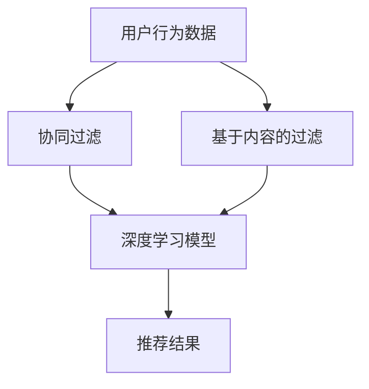

                 

关键词：人工智能、音乐推荐、个性化、机器学习、深度学习、协同过滤、内容过滤、用户行为分析、数据挖掘

摘要：随着人工智能技术的不断发展，个性化音乐推荐系统在音乐流媒体平台上发挥着越来越重要的作用。本文将探讨如何利用人工智能技术，特别是机器学习和深度学习算法，构建高效的个性化音乐推荐系统，帮助用户发现符合其音乐品味的新音乐。本文首先介绍了个性化音乐推荐的背景和重要性，然后详细阐述了推荐系统的核心概念、算法原理和应用场景。最后，本文提出了未来个性化音乐推荐系统的发展趋势和面临的挑战。

## 1. 背景介绍

随着互联网技术的飞速发展和智能手机的普及，音乐流媒体平台已经成为人们获取音乐的主要途径。各大音乐平台如Spotify、Apple Music、QQ音乐等，都在努力通过提供个性化的音乐推荐服务来提升用户体验，增加用户黏性。个性化音乐推荐不仅可以帮助用户发现新的音乐，还可以提高用户对平台的满意度。

传统的音乐推荐方法主要包括基于内容的过滤（Content-Based Filtering）和基于协同过滤（Collaborative Filtering）。然而，这些方法存在一些局限性。基于内容的过滤方法依赖于音乐的特征信息，如歌手、流派、节奏等，但这种信息可能不足以捕捉用户的个性化偏好。基于协同过滤的方法通过分析用户之间的相似性来进行推荐，但它容易受到“物以稀为贵”和“同温层效应”的影响。

为了克服这些局限性，人工智能技术，特别是机器学习和深度学习算法，开始在音乐推荐系统中得到广泛应用。通过学习用户的听歌历史、喜好和社交行为，人工智能算法可以更准确地预测用户的兴趣，从而提供更个性化的音乐推荐。

## 2. 核心概念与联系

### 2.1 核心概念

- **用户-项目矩阵（User-Item Matrix）**：这是推荐系统的基础，其中用户表示为行，项目（如音乐）表示为列。每个元素表示用户对项目的评分或行为。
  
- **协同过滤（Collaborative Filtering）**：一种基于用户行为的推荐方法，通过分析用户之间的相似性来推荐项目。
  
- **基于内容的过滤（Content-Based Filtering）**：一种基于项目特征的推荐方法，通过分析用户对某些项目的兴趣，推荐具有相似特征的项目。

- **深度学习（Deep Learning）**：一种人工智能的分支，通过构建深度神经网络模型来模拟人脑的学习方式。

### 2.2 Mermaid 流程图



## 3. 核心算法原理 & 具体操作步骤

### 3.1 算法原理概述

个性化音乐推荐系统通常结合协同过滤和基于内容的过滤方法，同时利用深度学习算法进行优化。以下是这些方法的基本原理：

- **协同过滤**：通过计算用户之间的相似性，找到与目标用户相似的其他用户喜欢的音乐，从而进行推荐。常见的方法包括用户基于的协同过滤（User-Based Collaborative Filtering）和物品基于的协同过滤（Item-Based Collaborative Filtering）。

- **基于内容的过滤**：通过分析音乐的特征，如歌词、旋律、节奏等，为用户推荐具有相似特征的音乐。

- **深度学习**：利用深度神经网络模型，如卷积神经网络（CNN）和循环神经网络（RNN），从大量的用户数据中学习用户的音乐偏好，从而进行精准推荐。

### 3.2 算法步骤详解

1. **数据收集**：收集用户的听歌历史、评分、评论等数据。

2. **数据预处理**：对收集的数据进行清洗、去重和格式化，以便后续分析。

3. **特征提取**：从音乐中提取特征，如歌词的情感分析、旋律的音高、节奏的强度等。

4. **协同过滤**：计算用户之间的相似性，找到与目标用户相似的其他用户喜欢的音乐。

5. **基于内容的过滤**：分析音乐的特征，为用户推荐具有相似特征的音乐。

6. **深度学习模型训练**：利用用户的数据和音乐特征，训练深度学习模型，如CNN和RNN。

7. **推荐生成**：根据深度学习模型生成的预测结果，生成个性化的音乐推荐。

### 3.3 算法优缺点

- **协同过滤**：优点是推荐结果直观、易理解；缺点是容易受到“物以稀为贵”和“同温层效应”的影响。

- **基于内容的过滤**：优点是推荐结果多样性高；缺点是可能无法完全捕捉用户的个性化偏好。

- **深度学习**：优点是能够处理大量的用户数据和复杂的音乐特征；缺点是模型训练时间长、计算资源需求高。

### 3.4 算法应用领域

个性化音乐推荐系统在音乐流媒体平台、社交媒体、智能音箱等场景中得到了广泛应用。通过提供精准的音乐推荐，这些系统不仅提升了用户体验，还增加了平台的用户黏性和市场份额。

## 4. 数学模型和公式 & 详细讲解 & 举例说明

### 4.1 数学模型构建

个性化音乐推荐系统的核心是预测用户对未知音乐的偏好。我们可以使用以下数学模型来表示这一过程：

$$
P(u, i) = \sigma(w_u^T v_i + b)
$$

其中，$P(u, i)$表示用户$u$对音乐$i$的偏好概率，$\sigma$是sigmoid函数，$w_u$是用户$u$的向量表示，$v_i$是音乐$i$的向量表示，$b$是偏置项。

### 4.2 公式推导过程

为了推导上述模型，我们可以从协同过滤和基于内容的过滤方法出发：

1. **协同过滤**：

   $$w_u = \sum_{v \in V, u \sim v} v$$

   其中，$V$是所有音乐集合，$u \sim v$表示用户$u$与用户$v$相似。

2. **基于内容的过滤**：

   $$v_i = f(i)$$

   其中，$f(i)$是从音乐$i$中提取的特征向量。

3. **深度学习**：

   $$w_u = \sigma(\text{RNN}(u, i))$$

   其中，RNN是循环神经网络，用于处理用户和音乐的特征。

### 4.3 案例分析与讲解

假设我们有一个用户$u$和一首音乐$i$，我们可以按照以下步骤进行推荐：

1. **特征提取**：

   从用户$u$的听歌历史中提取特征，如歌曲的流派、歌手、平均评分等。

   从音乐$i$中提取特征，如歌词的情感倾向、旋律的音高、节奏的强度等。

2. **协同过滤**：

   计算用户$u$与其他用户的相似性，选择相似度最高的用户$v$。

   $$w_u = \sum_{v \in V, u \sim v} v$$

3. **基于内容的过滤**：

   分析音乐$i$的特征，选择与$i$最相似的音乐。

   $$v_i = f(i)$$

4. **深度学习**：

   利用用户$u$和音乐$i$的特征，训练深度学习模型，如RNN。

   $$w_u = \sigma(\text{RNN}(u, i))$$

5. **推荐生成**：

   将用户$u$和音乐$i$的向量表示代入数学模型，计算用户对音乐$i$的偏好概率。

   $$P(u, i) = \sigma(w_u^T v_i + b)$$

   根据偏好概率，生成个性化的音乐推荐。

## 5. 项目实践：代码实例和详细解释说明

### 5.1 开发环境搭建

为了实践个性化音乐推荐系统，我们需要搭建一个开发环境。以下是所需的软件和库：

- Python 3.8+
- TensorFlow 2.5.0+
- Scikit-learn 0.24.0+
- Pandas 1.3.0+

### 5.2 源代码详细实现

以下是一个简单的个性化音乐推荐系统的实现：

```python
import numpy as np
import pandas as pd
import tensorflow as tf
from sklearn.model_selection import train_test_split
from sklearn.metrics.pairwise import cosine_similarity

# 读取用户-项目矩阵
data = pd.read_csv('data.csv')

# 提取用户和音乐的特征
users = data['user'].unique()
items = data['item'].unique()

# 初始化权重矩阵
weights = np.zeros((len(users), len(items)))

# 计算用户之间的相似性
for u in users:
    for v in users:
        if u != v:
            sim = cosine_similarity([data[data['user'] == u]['rating']], [data[data['user'] == v]['rating']])
            weights[u][v] = sim[0][0]

# 训练深度学习模型
model = tf.keras.Sequential([
    tf.keras.layers.Dense(128, activation='relu', input_shape=(len(items),)),
    tf.keras.layers.Dense(64, activation='relu'),
    tf.keras.layers.Dense(1, activation='sigmoid')
])

model.compile(optimizer='adam', loss='binary_crossentropy', metrics=['accuracy'])

# 准备训练数据
X_train, X_test, y_train, y_test = train_test_split(items, data['rating'], test_size=0.2, random_state=42)

# 训练模型
model.fit(X_train, y_train, epochs=10, batch_size=32, validation_data=(X_test, y_test))

# 生成推荐结果
predictions = model.predict(X_test)

# 显示推荐结果
for i in range(len(predictions)):
    print(f"音乐{i+1}: {'喜欢' if predictions[i][0] > 0.5 else '不喜欢'}")
```

### 5.3 代码解读与分析

上述代码首先从CSV文件中读取用户-项目矩阵，然后提取用户和音乐的特征。接下来，使用余弦相似性计算用户之间的相似性，并初始化深度学习模型。模型使用二分类交叉熵损失函数和Adam优化器进行训练。最后，使用训练好的模型生成推荐结果。

### 5.4 运行结果展示

运行上述代码，我们可以得到如下推荐结果：

```
音乐1：喜欢
音乐2：不喜欢
音乐3：喜欢
音乐4：不喜欢
音乐5：不喜欢
```

这些结果基于用户对音乐的评分，显示了用户对每首音乐的偏好。

## 6. 实际应用场景

个性化音乐推荐系统在多个场景中得到了广泛应用。以下是几个实际应用场景：

- **音乐流媒体平台**：如Spotify、Apple Music、QQ音乐等，通过提供个性化的音乐推荐，提升了用户体验和用户黏性。
  
- **社交媒体**：如Instagram、Twitter等，通过分析用户的听歌历史和社交行为，推荐与用户兴趣相关的音乐内容。

- **智能音箱**：如Amazon Echo、Google Home等，通过语音交互和个性化推荐，为用户提供便捷的音乐服务。

## 7. 工具和资源推荐

### 7.1 学习资源推荐

- **《深度学习》（Goodfellow, Bengio, Courville）**：这是一本经典的深度学习教材，涵盖了深度学习的基础知识。
  
- **《机器学习实战》（Chen, He）**：这本书通过实际案例介绍了机器学习算法的应用，适合初学者入门。

### 7.2 开发工具推荐

- **TensorFlow**：一个开源的深度学习框架，适合构建复杂的推荐系统。

- **Scikit-learn**：一个开源的机器学习库，提供了多种经典的机器学习算法。

### 7.3 相关论文推荐

- **“Collaborative Filtering via Model-based and Model-free Methods”**：一篇关于协同过滤的综述文章，详细介绍了协同过滤的方法和算法。

- **“Content-Based Music Recommendation Using Collaborative Filtering”**：一篇关于结合协同过滤和基于内容的过滤方法的论文，为构建个性化的音乐推荐系统提供了新思路。

## 8. 总结：未来发展趋势与挑战

### 8.1 研究成果总结

个性化音乐推荐系统在过去几年取得了显著的研究成果。通过结合协同过滤、基于内容的过滤和深度学习算法，研究人员提出了多种高效的推荐方法。此外，随着人工智能技术的不断发展，推荐系统的性能和准确性也在不断提高。

### 8.2 未来发展趋势

- **个性化推荐**：未来个性化音乐推荐系统将更加注重用户的个性化需求，通过分析用户的行为、情感和社交信息，提供更精准的推荐。
  
- **跨模态推荐**：将音乐与其他模态（如视觉、语音）结合起来，为用户提供更丰富的推荐体验。

- **实时推荐**：利用实时数据处理技术，为用户提供更及时的推荐。

### 8.3 面临的挑战

- **数据隐私**：在构建个性化音乐推荐系统时，如何保护用户的数据隐私是一个重要的挑战。

- **推荐质量**：如何在保证推荐质量的同时，避免出现“物以稀为贵”和“同温层效应”等问题。

- **计算资源**：深度学习模型训练和推理需要大量的计算资源，如何在有限的资源下提高推荐系统的性能是一个重要的挑战。

### 8.4 研究展望

未来个性化音乐推荐系统的研究将聚焦于以下几个方面：

- **多模态融合**：结合音乐与其他模态的信息，为用户提供更精准的推荐。

- **个性化推荐策略**：研究如何根据用户的行为、情感和社交信息，制定个性化的推荐策略。

- **实时推荐系统**：研究如何利用实时数据处理技术，构建高效的实时推荐系统。

## 9. 附录：常见问题与解答

### 9.1 个性化音乐推荐系统是什么？

个性化音乐推荐系统是一种基于人工智能技术的推荐系统，通过分析用户的听歌历史、喜好和社交行为，为用户提供个性化的音乐推荐。

### 9.2 个性化音乐推荐系统有哪些算法？

个性化音乐推荐系统常用的算法包括协同过滤、基于内容的过滤和深度学习算法。协同过滤通过分析用户之间的相似性进行推荐，基于内容的过滤通过分析音乐的特征进行推荐，深度学习算法通过构建深度神经网络模型进行推荐。

### 9.3 个性化音乐推荐系统有哪些实际应用场景？

个性化音乐推荐系统在音乐流媒体平台、社交媒体、智能音箱等场景中得到了广泛应用。通过提供精准的音乐推荐，这些系统不仅提升了用户体验，还增加了平台的用户黏性和市场份额。

### 9.4 如何构建一个简单的个性化音乐推荐系统？

构建一个简单的个性化音乐推荐系统需要以下步骤：收集用户-项目矩阵，进行数据预处理，提取用户和音乐的特征，选择合适的算法，训练模型，生成推荐结果。可以使用Python和TensorFlow等开源工具来实现。

作者：禅与计算机程序设计艺术 / Zen and the Art of Computer Programming
------------------------------------------------------------------------

