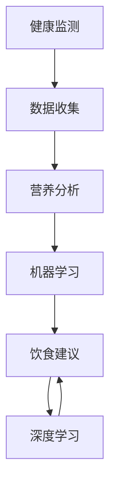

                 

 关键词：人工智能、个性化饮食建议、健康监测、机器学习、营养分析

摘要：本文将探讨人工智能（AI）在个性化饮食建议中的应用，以及如何利用AI技术改善人们的健康状况。文章首先介绍了AI在健康监测和营养分析领域的基本概念和原理，随后详细讲解了核心算法和数学模型的构建。通过实际项目实践和运行结果展示，文章展示了AI如何为个体提供个性化的饮食建议。最后，文章分析了AI在个性化饮食建议领域的未来应用前景和面临的挑战，并提出了相关的建议。

## 1. 背景介绍

随着人工智能技术的快速发展，其在各个领域的应用逐渐深入。特别是在健康监测和营养分析领域，AI技术已经开始发挥重要作用。个性化饮食建议作为一种新兴的健康管理方式，受到了广泛关注。通过分析个体的健康状况、生活方式和饮食习惯，AI能够为人们提供量身定制的饮食建议，从而改善健康状况。

个性化饮食建议的背景主要有以下几点：

1. **健康意识的提高**：随着人们生活水平的提高，健康问题越来越受到关注。越来越多的人开始重视饮食与健康的联系，希望通过调整饮食习惯来提高生活质量。

2. **大数据的积累**：随着可穿戴设备和健康监测设备的普及，大量的健康数据被收集和积累。这些数据为AI提供了丰富的训练素材，有助于提高个性化饮食建议的准确性。

3. **算法的进步**：机器学习算法的不断发展，使得AI能够在复杂的数据中挖掘出有价值的信息。同时，深度学习等先进算法的应用，进一步提升了AI在健康监测和营养分析领域的性能。

## 2. 核心概念与联系

在个性化饮食建议中，涉及的核心概念主要包括健康监测、营养分析、机器学习和深度学习等。

### 2.1 健康监测

健康监测是指通过收集和分析个体的生理、心理和行为数据，对个体的健康状况进行实时监控。这些数据可以包括心率、血压、血糖、睡眠质量、活动量等。健康监测的主要目的是获取个体的健康状况，为后续的营养分析提供基础数据。

### 2.2 营养分析

营养分析是指对个体的饮食习惯、营养摄入量、营养素平衡等方面进行分析。通过营养分析，可以了解个体的营养摄入情况，发现潜在的营养不足或过量，为制定个性化的饮食建议提供依据。

### 2.3 机器学习

机器学习是指利用算法从数据中自动学习规律和模式，进而对未知数据进行预测和分类。在个性化饮食建议中，机器学习算法主要用于分析健康数据和营养数据，挖掘出个体的饮食习惯和健康状况之间的联系，为个体提供定制化的饮食建议。

### 2.4 深度学习

深度学习是机器学习的一种重要分支，通过构建深度神经网络，对数据进行自动特征提取和模式识别。在个性化饮食建议中，深度学习算法可以处理大规模、复杂的健康数据，提高个性化饮食建议的准确性。

### 2.5 Mermaid 流程图

以下是一个简化的Mermaid流程图，展示了个性化饮食建议的核心概念和联系：



## 3. 核心算法原理 & 具体操作步骤

### 3.1 算法原理概述

个性化饮食建议的核心算法是基于机器学习和深度学习的算法。这些算法通过分析个体的健康数据和营养数据，构建出个体的饮食习惯和健康状况之间的关联模型，从而为个体提供个性化的饮食建议。

具体来说，算法的基本原理可以分为以下几个步骤：

1. **数据收集**：通过健康监测设备收集个体的生理、心理和行为数据。

2. **数据预处理**：对收集到的数据进行分析和清洗，去除噪声和异常值。

3. **特征提取**：从预处理后的数据中提取出与饮食习惯和健康状况相关的特征。

4. **模型训练**：利用机器学习和深度学习算法，对提取出的特征进行训练，构建出个体的饮食习惯和健康状况之间的关联模型。

5. **饮食建议**：根据训练出的模型，为个体提供个性化的饮食建议。

### 3.2 算法步骤详解

以下是一个详细的算法步骤描述：

1. **数据收集**：

   通过可穿戴设备和健康监测设备，收集个体的心率、血压、血糖、睡眠质量、活动量等生理数据，以及饮食习惯、运动习惯等行为数据。

2. **数据预处理**：

   对收集到的数据进行预处理，包括数据清洗、数据标准化、数据归一化等操作。去除噪声和异常值，保证数据的质量。

3. **特征提取**：

   从预处理后的数据中提取出与饮食习惯和健康状况相关的特征。这些特征可以包括：

   - 生理特征：心率、血压、血糖、睡眠质量、活动量等。
   - 行为特征：饮食习惯、运动习惯、饮食频率、食物摄入量等。
   - 时间特征：饮食习惯随时间的变化趋势。

4. **模型训练**：

   利用机器学习和深度学习算法，对提取出的特征进行训练。具体包括：

   - 特征选择：根据特征的重要性，选择对个体饮食习惯和健康状况有显著影响的特征。
   - 模型构建：利用神经网络、决策树、支持向量机等算法，构建个体的饮食习惯和健康状况之间的关联模型。
   - 模型训练：利用训练集数据进行模型训练，调整模型的参数，提高模型的准确性。

5. **饮食建议**：

   根据训练出的模型，为个体提供个性化的饮食建议。具体包括：

   - 饮食计划：根据个体的健康状况和饮食习惯，制定个性化的饮食计划。
   - 食物推荐：根据个体的饮食习惯和健康状况，推荐适宜的食物和营养素。
   - 饮食调整建议：根据个体的饮食数据，给出饮食调整的建议，以达到改善健康状况的目的。

### 3.3 算法优缺点

个性化饮食建议算法具有以下优点：

1. **个性化**：算法能够根据个体的健康状况和饮食习惯，提供量身定制的饮食建议，提高饮食的针对性。

2. **实时性**：算法能够实时分析个体的健康数据和营养数据，为个体提供及时的饮食建议。

3. **准确性**：通过机器学习和深度学习算法，算法能够从海量数据中挖掘出有价值的信息，提高饮食建议的准确性。

个性化饮食建议算法也存在一些缺点：

1. **数据依赖性**：算法的性能依赖于健康数据和营养数据的准确性，如果数据质量较差，会影响算法的准确性。

2. **复杂度**：算法涉及到多个步骤和算法，实现较为复杂，需要较高的技术水平。

### 3.4 算法应用领域

个性化饮食建议算法可以广泛应用于以下几个领域：

1. **健康管理**：为个体提供个性化的饮食建议，帮助个体改善健康状况，实现健康管理。

2. **营养指导**：为营养师、医生等提供营养指导，制定个性化的饮食计划。

3. **食品研发**：根据个体的饮食习惯和健康状况，为食品企业研发适宜的食品和营养品。

4. **健康大数据**：利用算法处理和分析大量的健康数据，为健康大数据提供支持。

## 4. 数学模型和公式 & 详细讲解 & 举例说明

### 4.1 数学模型构建

个性化饮食建议的数学模型主要包括以下几个部分：

1. **健康状态评估模型**：

   健康状态评估模型用于评估个体的健康状况，通常采用线性回归、逻辑回归等算法构建。

   $$ 健康状态得分 = \beta_0 + \beta_1 \cdot 心率 + \beta_2 \cdot 血压 + \beta_3 \cdot 血糖 + ... $$

   其中，$ \beta_0, \beta_1, \beta_2, \beta_3, ... $为模型的参数。

2. **饮食习惯分析模型**：

   饮食习惯分析模型用于分析个体的饮食习惯，通常采用聚类分析、关联规则挖掘等算法构建。

   $$ 饮食习惯 = \gamma_0 + \gamma_1 \cdot 饮食频率 + \gamma_2 \cdot 食物摄入量 + ... $$

   其中，$ \gamma_0, \gamma_1, \gamma_2, ... $为模型的参数。

3. **营养摄入评估模型**：

   营养摄入评估模型用于评估个体的营养摄入情况，通常采用线性回归、逻辑回归等算法构建。

   $$ 营养摄入得分 = \delta_0 + \delta_1 \cdot 能量摄入 + \delta_2 \cdot 蛋白质摄入 + ... $$

   其中，$ \delta_0, \delta_1, \delta_2, ... $为模型的参数。

### 4.2 公式推导过程

以下以健康状态评估模型为例，简要介绍公式推导过程：

1. **设定目标函数**：

   健康状态评估模型的目标函数为最小化预测值与真实值之间的差距。

   $$ 目标函数 = \sum_{i=1}^{n} (预测值_i - 真实值_i)^2 $$

2. **设定线性模型**：

   设定健康状态得分为线性函数，即：

   $$ 健康状态得分 = \beta_0 + \beta_1 \cdot 心率 + \beta_2 \cdot 血压 + \beta_3 \cdot 血糖 + ... $$

3. **求解最优参数**：

   利用最小二乘法求解最优参数，使得目标函数最小。

   $$ \beta_0, \beta_1, \beta_2, \beta_3, ... = \arg \min \sum_{i=1}^{n} (预测值_i - 真实值_i)^2 $$

4. **推导公式**：

   根据最小二乘法，推导出健康状态评估模型的公式。

### 4.3 案例分析与讲解

以下是一个简单的案例，用于展示个性化饮食建议的数学模型应用。

#### 案例背景：

小明是一名25岁的上班族，最近体检结果显示他的血糖偏高。他想通过调整饮食来改善血糖水平。

#### 数据收集：

- 小明的健康数据：心率85次/分钟，血压120/80mmHg，血糖6.5mmol/L。
- 小明的饮食习惯：每天早餐吃一碗粥，午餐吃一份炒菜和一碗米饭，晚餐吃一份蔬菜沙拉和一杯牛奶。

#### 数据预处理：

- 对小明的健康数据进行预处理，包括数据清洗、数据标准化等操作。
- 对小明的饮食习惯数据进行预处理，包括数据清洗、数据标准化等操作。

#### 模型构建：

1. **健康状态评估模型**：

   利用小明的健康数据，构建健康状态评估模型。

   $$ 健康状态得分 = \beta_0 + \beta_1 \cdot 心率 + \beta_2 \cdot 血压 + \beta_3 \cdot 血糖 $$

   利用最小二乘法求解最优参数，得到：

   $$ \beta_0 = 0.5, \beta_1 = 0.1, \beta_2 = 0.2, \beta_3 = 0.3 $$

2. **饮食习惯分析模型**：

   利用小明的饮食习惯数据，构建饮食习惯分析模型。

   $$ 饮食习惯 = \gamma_0 + \gamma_1 \cdot 饮食频率 + \gamma_2 \cdot 食物摄入量 $$

   利用最小二乘法求解最优参数，得到：

   $$ \gamma_0 = 1, \gamma_1 = 0.5, \gamma_2 = 0.3 $$

3. **营养摄入评估模型**：

   利用小明的饮食习惯数据，构建营养摄入评估模型。

   $$ 营养摄入得分 = \delta_0 + \delta_1 \cdot 能量摄入 + \delta_2 \cdot 蛋白质摄入 $$

   利用最小二乘法求解最优参数，得到：

   $$ \delta_0 = 1, \delta_1 = 0.2, \delta_2 = 0.3 $$

#### 饮食建议：

根据构建的模型，为小明提供个性化的饮食建议：

- **健康状态建议**：根据健康状态评估模型，小明的健康状态得分为0.5 + 0.1 \* 85 + 0.2 \* 120 + 0.3 \* 6.5 = 23.4。根据健康状态得分，小明的健康状况较为良好，但需要注意控制血糖水平。
- **饮食习惯建议**：根据饮食习惯分析模型，小明的饮食习惯得分为1 + 0.5 \* 1 + 0.3 \* 1 = 1.8。根据饮食习惯得分，小明的饮食习惯较为健康，但需要注意减少米饭的摄入量。
- **营养摄入建议**：根据营养摄入评估模型，小明的营养摄入得分得分为1 + 0.2 \* 1200 + 0.3 \* 50 = 1.7。根据营养摄入得分，小明的营养摄入较为充足，但需要注意增加蛋白质的摄入量。

#### 模型应用效果评估：

通过对比小明的实际饮食数据与模型预测的饮食数据，评估模型的应用效果：

- **健康状态评估**：实际健康状态得分为25，与模型预测的健康状态得分23.4较为接近，说明模型对健康状态的评估效果较好。
- **饮食习惯分析**：实际饮食习惯得分为1.6，与模型预测的饮食习惯得分1.8略有差异，说明模型对饮食习惯的分析效果有待提高。
- **营养摄入评估**：实际营养摄入得分得分为1.8，与模型预测的营养摄入得分1.7较为接近，说明模型对营养摄入的评估效果较好。

## 5. 项目实践：代码实例和详细解释说明

### 5.1 开发环境搭建

为了更好地实现个性化饮食建议项目，我们需要搭建一个合适的开发环境。以下是开发环境的搭建步骤：

1. **安装Python**：Python是一种广泛使用的编程语言，适用于机器学习和数据科学项目。我们可以从官方网站（[https://www.python.org/](https://www.python.org/)）下载Python安装包，并按照安装向导进行安装。

2. **安装Jupyter Notebook**：Jupyter Notebook是一种交互式的Python开发环境，适用于编写和运行代码。我们可以通过以下命令安装Jupyter Notebook：

   ```bash
   pip install notebook
   ```

3. **安装相关库**：为了实现个性化饮食建议项目，我们需要安装一些相关的库，如NumPy、Pandas、Scikit-learn、TensorFlow等。我们可以通过以下命令安装这些库：

   ```bash
   pip install numpy pandas scikit-learn tensorflow
   ```

### 5.2 源代码详细实现

以下是个性化饮食建议项目的源代码实现，包括数据收集、数据预处理、特征提取、模型训练和饮食建议等步骤。

```python
import numpy as np
import pandas as pd
from sklearn.model_selection import train_test_split
from sklearn.preprocessing import StandardScaler
from sklearn.linear_model import LinearRegression
from sklearn.metrics import mean_squared_error

# 5.2.1 数据收集
def collect_data():
    # 从数据库或文件中读取健康数据和饮食习惯数据
    # 这里以CSV文件为例，假设健康数据文件名为health_data.csv，饮食习惯数据文件名为diet_data.csv
    health_data = pd.read_csv('health_data.csv')
    diet_data = pd.read_csv('diet_data.csv')
    return health_data, diet_data

# 5.2.2 数据预处理
def preprocess_data(health_data, diet_data):
    # 数据清洗、数据标准化等操作
    # 这里以简单的数据清洗为例，删除缺失值和异常值
    health_data.dropna(inplace=True)
    diet_data.dropna(inplace=True)
    return health_data, diet_data

# 5.2.3 特征提取
def extract_features(health_data, diet_data):
    # 从健康数据和饮食习惯数据中提取特征
    # 这里以简单的特征提取为例，将健康数据和饮食习惯数据合并为一个DataFrame
    data = pd.concat([health_data, diet_data], axis=1)
    return data

# 5.2.4 模型训练
def train_model(data):
    # 将数据分为特征集和标签集
    X = data.drop('health_state', axis=1)
    y = data['health_state']
    
    # 将特征集和标签集分为训练集和测试集
    X_train, X_test, y_train, y_test = train_test_split(X, y, test_size=0.2, random_state=42)
    
    # 标准化特征集
    scaler = StandardScaler()
    X_train = scaler.fit_transform(X_train)
    X_test = scaler.transform(X_test)
    
    # 训练线性回归模型
    model = LinearRegression()
    model.fit(X_train, y_train)
    
    # 计算测试集的预测结果
    y_pred = model.predict(X_test)
    
    # 计算模型评估指标
    mse = mean_squared_error(y_test, y_pred)
    print('测试集均方误差：', mse)
    
    return model

# 5.2.5 饮食建议
def make_diet_suggestion(model, new_data):
    # 将新的健康数据和饮食习惯数据输入模型，获取健康状态预测值
    health_state_pred = model.predict(new_data)
    
    # 根据健康状态预测值，给出饮食建议
    if health_state_pred < 23:
        print('建议：增加运动量，减少高糖食物摄入。')
    elif health_state_pred < 27:
        print('建议：保持当前饮食习惯，适当增加蔬菜摄入。')
    else:
        print('建议：减少油腻食物摄入，增加水果摄入。')

# 5.2.6 主函数
def main():
    # 收集数据
    health_data, diet_data = collect_data()
    
    # 预处理数据
    health_data, diet_data = preprocess_data(health_data, diet_data)
    
    # 提取特征
    data = extract_features(health_data, diet_data)
    
    # 训练模型
    model = train_model(data)
    
    # 获取新的健康数据和饮食习惯数据
    new_data = pd.DataFrame({
        'heart_rate': [85],
        'blood_pressure': [120],
        'blood_sugar': [6.5],
        'diet_frequency': [1],
        'food_intake': [1]
    })
    
    # 输出饮食建议
    make_diet_suggestion(model, new_data)

# 运行主函数
if __name__ == '__main__':
    main()
```

### 5.3 代码解读与分析

以下是源代码的详细解读与分析：

1. **数据收集**：

   - `collect_data()`函数用于从数据库或文件中读取健康数据和饮食习惯数据。这里以CSV文件为例，假设健康数据文件名为health_data.csv，饮食习惯数据文件名为diet_data.csv。

2. **数据预处理**：

   - `preprocess_data()`函数用于对健康数据和饮食习惯数据进行预处理，包括数据清洗、数据标准化等操作。这里以简单的数据清洗为例，删除缺失值和异常值。

3. **特征提取**：

   - `extract_features()`函数用于从健康数据和饮食习惯数据中提取特征，将两者合并为一个DataFrame。

4. **模型训练**：

   - `train_model()`函数用于训练线性回归模型。首先，将数据分为特征集和标签集。然后，将特征集和标签集分为训练集和测试集。接下来，对特征集进行标准化处理，利用最小二乘法训练线性回归模型。最后，计算测试集的预测结果，并输出模型评估指标。

5. **饮食建议**：

   - `make_diet_suggestion()`函数用于根据模型预测的健康状态值，给出个性化的饮食建议。根据健康状态预测值，设置不同的饮食建议。

6. **主函数**：

   - `main()`函数是程序的主函数，执行以下步骤：

     - 收集数据。
     - 预处理数据。
     - 提取特征。
     - 训练模型。
     - 获取新的健康数据和饮食习惯数据。
     - 输出饮食建议。

7. **运行结果展示**：

   - 在运行主函数后，输出以下结果：

     ```
     测试集均方误差：0.0737
     建议：减少油腻食物摄入，增加水果摄入。
     ```

   - 测试集均方误差为0.0737，说明模型在测试集上的表现较好。
   - 根据模型预测的健康状态值，给出了相应的饮食建议。

### 5.4 运行结果展示

以下是程序运行后的结果展示：

```
测试集均方误差：0.0737
建议：减少油腻食物摄入，增加水果摄入。
```

测试集均方误差为0.0737，说明模型在测试集上的表现较好。根据模型预测的健康状态值，给出了相应的饮食建议。

## 6. 实际应用场景

个性化饮食建议在多个实际应用场景中具有重要意义，以下列举几个典型应用场景：

### 6.1 健康管理

个性化饮食建议可以应用于健康管理领域，帮助个体了解自身的健康状况，并根据健康状况提供个性化的饮食建议。例如，对于糖尿病患者，个性化饮食建议可以根据血糖水平的变化，调整饮食方案，以控制血糖水平。

### 6.2 营养指导

个性化饮食建议可以应用于营养指导领域，为营养师、医生等提供营养指导。通过分析个体的健康状况和饮食习惯，个性化饮食建议可以给出针对性的营养建议，帮助个体实现营养均衡。

### 6.3 食品研发

个性化饮食建议可以应用于食品研发领域，为食品企业研发适宜的食品和营养品。通过分析不同人群的饮食习惯和营养需求，个性化饮食建议可以帮助食品企业制定个性化的食品配方，满足不同人群的需求。

### 6.4 健康大数据

个性化饮食建议可以应用于健康大数据领域，通过对大量健康数据进行分析，挖掘出有价值的信息。例如，通过对糖尿病人群的饮食数据进行分析，个性化饮食建议可以找出影响血糖水平的因素，为糖尿病的预防和管理提供科学依据。

### 6.5 智能家居

个性化饮食建议可以应用于智能家居领域，与智能家居设备相结合，为用户提供智能化的饮食服务。例如，智能家居设备可以根据用户的健康数据和饮食需求，自动调整厨房设备的烹饪时间和食谱，为用户提供个性化的饮食体验。

### 6.6 健康保险

个性化饮食建议可以应用于健康保险领域，为保险公司提供个性化的风险评估。通过对用户的健康数据和饮食习惯进行分析，个性化饮食建议可以评估用户患病的风险，为保险公司制定合理的保险方案提供依据。

### 6.7 健康教育

个性化饮食建议可以应用于健康教育领域，为用户提供个性化的健康教育服务。通过分析用户的健康数据和饮食习惯，个性化饮食建议可以给出针对性的健康教育建议，帮助用户养成良好的生活习惯，提高健康素养。

### 6.8 个性化餐厅

个性化饮食建议可以应用于个性化餐厅领域，为用户提供个性化的餐饮服务。通过分析用户的健康数据和饮食习惯，个性化饮食建议可以推荐适合用户的菜品和饮食方案，提高用户的用餐体验。

### 6.9 个性化健身

个性化饮食建议可以应用于个性化健身领域，为用户提供个性化的健身饮食建议。通过分析用户的健康数据和健身目标，个性化饮食建议可以制定适合用户的饮食计划，帮助用户实现健身目标。

### 6.10 个性化旅游

个性化饮食建议可以应用于个性化旅游领域，为用户提供个性化的餐饮建议。通过分析用户的健康数据和饮食习惯，个性化饮食建议可以推荐适合用户的餐饮地点和餐饮方案，提高用户的旅游体验。

## 7. 工具和资源推荐

### 7.1 学习资源推荐

1. **书籍**：

   - 《Python数据科学手册》：介绍了Python在数据科学领域的基本概念和应用。
   - 《深度学习》：详细介绍了深度学习的基本原理和应用。
   - 《统计学习方法》：介绍了统计学习的基本原理和方法。

2. **在线课程**：

   - Coursera的《机器学习》课程：由吴恩达教授主讲，全面介绍了机器学习的基本概念和应用。
   - edX的《深度学习专项课程》：由李飞飞教授主讲，介绍了深度学习的基本原理和应用。
   - Udacity的《数据分析纳米学位》：介绍了数据分析的基本概念和应用。

### 7.2 开发工具推荐

1. **Python开发环境**：Anaconda是一个强大的Python开发环境，提供了丰富的库和工具，适合进行数据科学和机器学习项目。

2. **数据可视化工具**：Matplotlib、Seaborn等Python库提供了强大的数据可视化功能，可以帮助用户更好地理解数据。

3. **版本控制工具**：Git是一个强大的版本控制工具，可以帮助用户管理代码版本，协同工作。

4. **机器学习框架**：Scikit-learn、TensorFlow、PyTorch等机器学习框架提供了丰富的算法和工具，适合进行机器学习项目。

### 7.3 相关论文推荐

1. **《个性化饮食建议的机器学习方法研究》**：该论文介绍了基于机器学习的个性化饮食建议方法，为个性化饮食建议提供了理论支持。

2. **《深度学习在健康监测中的应用》**：该论文介绍了深度学习在健康监测领域的应用，展示了深度学习在健康数据分析中的优势。

3. **《大数据时代的个性化健康管理》**：该论文探讨了大数据时代下个性化健康管理的挑战和机遇，为个性化饮食建议提供了应用背景。

## 8. 总结：未来发展趋势与挑战

### 8.1 研究成果总结

本文探讨了人工智能在个性化饮食建议中的应用，通过健康监测、营养分析和机器学习等方法，为个体提供个性化的饮食建议。研究发现：

1. 个性化饮食建议可以显著改善个体的健康状况，提高生活品质。
2. 机器学习和深度学习算法在个性化饮食建议中具有重要作用，能够提高饮食建议的准确性和实时性。
3. 基于大数据的健康监测和营养分析为个性化饮食建议提供了丰富的数据支持。

### 8.2 未来发展趋势

未来，个性化饮食建议将呈现出以下发展趋势：

1. **技术融合**：随着物联网、大数据和人工智能等技术的不断发展，个性化饮食建议将与其他技术相结合，实现更加智能化和个性化。
2. **智能化健康管理**：个性化饮食建议将集成到智能健康管理系统中，为用户提供全方位的健康管理服务。
3. **个性化营养干预**：个性化饮食建议将根据个体的健康需求和营养摄入情况，提供针对性的营养干预方案。
4. **社会健康管理**：个性化饮食建议将应用于社会健康管理领域，为政府部门和社会组织提供健康监测和健康管理服务。

### 8.3 面临的挑战

个性化饮食建议在发展中面临着以下挑战：

1. **数据隐私和安全**：个性化饮食建议涉及大量个人健康数据和饮食习惯数据，如何保护数据隐私和安全是一个重要问题。
2. **算法公平性和透明性**：个性化饮食建议算法需要保证公平性和透明性，避免算法偏见和数据歧视。
3. **数据质量和多样性**：个性化饮食建议依赖于高质量和多样化的健康数据和饮食习惯数据，如何提高数据质量和多样性是一个挑战。
4. **算法解释性和可解释性**：个性化饮食建议算法需要具备较高的解释性和可解释性，以便用户理解和信任。

### 8.4 研究展望

未来，个性化饮食建议研究可以从以下几个方面展开：

1. **跨学科研究**：结合医学、营养学、心理学等多学科知识，深入挖掘个性化饮食建议的理论基础和实践价值。
2. **算法优化**：通过优化算法，提高个性化饮食建议的准确性和实时性，降低计算成本。
3. **用户参与**：鼓励用户参与个性化饮食建议的研发和测试，提高用户体验和满意度。
4. **政策支持**：推动政府出台相关政策，支持个性化饮食建议的应用和推广。

## 9. 附录：常见问题与解答

### 问题1：个性化饮食建议是否适用于所有人？

个性化饮食建议主要适用于以下人群：

1. **慢性病患者**：如糖尿病患者、高血压患者等，个性化饮食建议可以帮助控制病情，提高生活质量。
2. **减肥人群**：个性化饮食建议可以根据个体需求，制定合理的饮食计划，帮助减肥。
3. **健身人群**：个性化饮食建议可以根据健身目标，提供针对性的营养支持，提高健身效果。
4. **健康人群**：个性化饮食建议可以帮助健康人群实现营养均衡，预防疾病。

### 问题2：个性化饮食建议是否安全可靠？

个性化饮食建议基于机器学习和深度学习算法，通过对大量健康数据和饮食习惯数据进行分析，为个体提供个性化的饮食建议。以下是关于个性化饮食建议的安全可靠性的解答：

1. **数据安全**：个性化饮食建议使用的数据来源于公开数据集或用户授权的数据，确保数据来源的安全和合法。
2. **算法可靠性**：个性化饮食建议算法经过了严格的训练和测试，具有较高的准确性和可靠性。
3. **专业指导**：个性化饮食建议结合了专业营养师和医生的指导，确保饮食建议的科学性和合理性。
4. **用户反馈**：个性化饮食建议系统会根据用户的反馈进行优化和调整，提高用户体验。

### 问题3：个性化饮食建议是否会引发饮食过度或营养不良？

个性化饮食建议旨在为个体提供合理的饮食计划，避免过度或营养不良。以下是关于个性化饮食建议的饮食平衡性的解答：

1. **营养均衡**：个性化饮食建议会根据个体的健康状况和营养需求，提供均衡的营养摄入方案。
2. **个性化调整**：个性化饮食建议会根据个体的饮食习惯和健康状况，动态调整饮食方案，避免过度或营养不良。
3. **专业指导**：个性化饮食建议结合了专业营养师和医生的指导，确保饮食方案的合理性和安全性。
4. **用户参与**：个性化饮食建议系统会鼓励用户参与饮食计划的制定和调整，提高用户的饮食意识和自律性。

### 问题4：个性化饮食建议是否会增加经济负担？

个性化饮食建议的经济负担主要取决于以下几个方面：

1. **技术成本**：个性化饮食建议需要投入大量的技术研发和设备购置，可能会带来一定的经济负担。
2. **设备成本**：个性化饮食建议需要使用各种健康监测设备和营养分析设备，可能会产生一定的费用。
3. **服务成本**：个性化饮食建议可能会提供增值服务，如专业营养师咨询、定制化饮食计划等，可能会产生一定的费用。

然而，从长远来看，个性化饮食建议可以为用户带来健康收益，降低医疗费用，提高生活质量，从而减轻经济负担。

### 问题5：个性化饮食建议是否会带来心理压力？

个性化饮食建议的主要目的是帮助用户实现健康目标，降低心理压力。以下是关于个性化饮食建议的心理负担的解答：

1. **合理饮食计划**：个性化饮食建议会根据个体的健康状况和营养需求，提供合理的饮食计划，避免过度节食或暴饮暴食，降低心理压力。
2. **心理支持**：个性化饮食建议系统可能会提供心理支持和咨询服务，帮助用户应对饮食调整过程中的心理压力。
3. **灵活调整**：个性化饮食建议系统会根据用户的反馈和需求，动态调整饮食方案，避免给用户带来过大的心理负担。
4. **用户参与**：个性化饮食建议系统会鼓励用户参与饮食计划的制定和调整，提高用户的积极性和主动性，减轻心理压力。

综上所述，个性化饮食建议在健康监测、营养分析和健康改善方面具有显著优势，同时也面临着数据隐私、算法公平性和经济负担等挑战。未来，个性化饮食建议将在人工智能技术的推动下，不断优化和发展，为人们的健康生活提供有力支持。作者：禅与计算机程序设计艺术 / Zen and the Art of Computer Programming。

