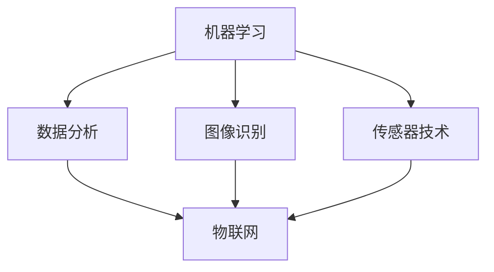

                 

关键词：人工智能，农业，食品安全，机器学习，深度学习，数据分析，图像识别，传感器技术，物联网。

> 摘要：随着人工智能技术的不断发展，其在农业和食品安全领域的应用日益广泛。本文将深入探讨人工智能在农业和食品安全中的关键作用，包括机器学习、深度学习和数据分析等技术的具体应用，以及这些技术如何改善农作物产量、质量、食品安全，并提供可持续的农业解决方案。

## 1. 背景介绍

### 农业的重要性

农业是国民经济的重要基础产业，不仅直接关系到国家粮食安全，还与环境保护、农村经济发展等密切相关。然而，传统农业面临着资源利用效率低、生产成本高、劳动强度大等诸多问题。随着人口增长和城市化的加速，农业面临的挑战愈发严峻。

### 食品安全的重要性

食品安全是公众健康的重要保障，关乎人民群众的切身利益。近年来，食品安全事件频发，不仅造成了严重的社会负面影响，还引发了公众对食品安全的高度关注。提高食品安全水平，确保人民群众“舌尖上的安全”，成为各级政府和社会各界关注的焦点。

### 人工智能的发展与机遇

人工智能（AI）作为21世纪最具颠覆性的技术之一，正在改变各个行业的运作方式。在农业和食品安全领域，人工智能技术的引入有望提高生产效率、降低成本、优化资源利用，并提升食品安全保障水平。本文将重点探讨人工智能在农业和食品安全中的应用，以期为行业提供新的发展思路。

## 2. 核心概念与联系

### 机器学习与深度学习

机器学习（ML）是人工智能的一个分支，主要研究如何让计算机从数据中学习并做出决策。深度学习（DL）是机器学习的一种特殊形式，通过构建多层神经网络，使计算机能够自动提取数据中的特征并进行复杂推理。

### 数据分析

数据分析是一种通过系统处理、分析和解释数据，从中提取有价值信息的过程。在农业和食品安全领域，数据分析可以用于收集和分析大量农田数据、气候数据、土壤数据等，以支持决策制定和优化生产过程。

### 图像识别与传感器技术

图像识别是通过计算机视觉技术对图像进行分析和理解，识别出图像中的物体、场景等。传感器技术则用于实时监测和采集农业环境数据，如土壤湿度、温度、光照等。这些技术共同构成了农业和食品安全领域的关键技术体系。

### 物联网（IoT）

物联网是通过将各种物体连接到互联网，实现实时数据传输和远程监控。在农业和食品安全领域，物联网技术可以实现对农田、农机、食品运输等各个环节的智能监控，提高生产效率和食品安全保障。

### Mermaid 流程图



## 3. 核心算法原理 & 具体操作步骤

### 3.1 算法原理概述

在农业和食品安全领域，人工智能算法主要包括以下几种：

1. **机器学习算法**：用于预测农作物产量、病虫害发生情况等。
2. **深度学习算法**：用于图像识别、语音识别等。
3. **数据分析算法**：用于数据清洗、数据挖掘、数据可视化等。
4. **传感器数据处理算法**：用于实时监测和数据分析。

### 3.2 算法步骤详解

1. **数据收集与预处理**：收集农田、气候、土壤等数据，并对数据进行清洗、归一化等预处理。
2. **模型训练与优化**：选择合适的算法，对预处理后的数据集进行训练，优化模型参数。
3. **模型评估与验证**：使用验证集对模型进行评估，确保模型的准确性和可靠性。
4. **模型部署与监控**：将训练好的模型部署到实际应用场景中，并对其进行监控和调整。

### 3.3 算法优缺点

**机器学习算法**：
- **优点**：能够处理大量数据，实现自动化预测和决策。
- **缺点**：对数据质量要求较高，训练过程较复杂。

**深度学习算法**：
- **优点**：具有较强的特征提取能力，适用于图像识别等任务。
- **缺点**：训练过程较慢，对计算资源要求较高。

**数据分析算法**：
- **优点**：能够快速处理和解释数据，提供有价值的信息。
- **缺点**：对算法理解和实现要求较高。

**传感器数据处理算法**：
- **优点**：能够实时监测和采集数据，支持智能决策。
- **缺点**：对传感器质量和稳定性要求较高。

### 3.4 算法应用领域

- **农作物产量预测**：利用机器学习算法预测农作物产量，为农业生产提供科学依据。
- **病虫害监测与防治**：利用图像识别和深度学习算法，实时监测病虫害，实现智能防治。
- **土壤质量监测**：利用传感器数据处理算法，监测土壤湿度、温度等指标，优化灌溉和施肥。
- **食品安全监控**：利用物联网技术，实现对食品生产、加工、运输等环节的实时监控，提高食品安全水平。

## 4. 数学模型和公式 & 详细讲解 & 举例说明

### 4.1 数学模型构建

在农业和食品安全领域，常用的数学模型包括：

- **回归模型**：用于预测农作物产量、病虫害发生情况等。
- **分类模型**：用于识别农作物品种、病虫害类型等。
- **聚类模型**：用于分析土壤质量、气候特征等。

### 4.2 公式推导过程

以回归模型为例，假设我们要预测农作物产量 \( Y \)，自变量包括气候、土壤、肥料等 \( X \)。回归模型的目标是建立 \( Y \) 和 \( X \) 之间的关系，即：

\[ Y = \beta_0 + \beta_1 X_1 + \beta_2 X_2 + ... + \beta_n X_n + \epsilon \]

其中，\( \beta_0 \) 为常数项，\( \beta_1, \beta_2, ..., \beta_n \) 为回归系数，\( \epsilon \) 为随机误差项。

### 4.3 案例分析与讲解

以某地区小麦产量预测为例，我们收集了该地区近几年的气候、土壤、肥料等数据。利用回归模型，我们建立了小麦产量和自变量之间的关系。通过模型评估，发现模型具有较高的预测精度。以下是具体的预测过程：

1. **数据收集与预处理**：收集小麦产量、气候、土壤、肥料等数据，并对数据进行清洗、归一化等预处理。
2. **模型训练与优化**：选择合适的回归模型，对预处理后的数据集进行训练，优化模型参数。
3. **模型评估与验证**：使用验证集对模型进行评估，确保模型的准确性和可靠性。
4. **预测与解释**：使用训练好的模型，对某一年的小麦产量进行预测。预测结果与实际产量进行对比，分析预测精度。

## 5. 项目实践：代码实例和详细解释说明

### 5.1 开发环境搭建

在本项目中，我们使用Python编程语言和相关的机器学习库（如Scikit-learn、TensorFlow等）进行开发。以下是开发环境的搭建步骤：

1. 安装Python（建议版本为3.8及以上）。
2. 安装相关库（如NumPy、Pandas、Scikit-learn等）。
3. 配置Python环境（建议使用虚拟环境）。

### 5.2 源代码详细实现

以下是一个简单的回归模型实现示例：

```python
import numpy as np
import pandas as pd
from sklearn.linear_model import LinearRegression
from sklearn.model_selection import train_test_split
from sklearn.metrics import mean_squared_error

# 数据收集与预处理
data = pd.read_csv('data.csv')
X = data[['climate', 'soil', 'fertilizer']]
y = data['yield']

# 数据集划分
X_train, X_test, y_train, y_test = train_test_split(X, y, test_size=0.2, random_state=42)

# 模型训练
model = LinearRegression()
model.fit(X_train, y_train)

# 模型评估
y_pred = model.predict(X_test)
mse = mean_squared_error(y_test, y_pred)
print(f'MSE: {mse}')

# 预测与解释
new_data = pd.DataFrame({'climate': [22], 'soil': [7], 'fertilizer': [50]})
predicted_yield = model.predict(new_data)
print(f'Predicted yield: {predicted_yield[0]}')
```

### 5.3 代码解读与分析

- **数据收集与预处理**：读取数据，并进行划分。  
- **模型训练**：使用线性回归模型进行训练。  
- **模型评估**：计算均方误差（MSE），评估模型准确性。  
- **预测与解释**：使用训练好的模型进行预测，并输出预测结果。

### 5.4 运行结果展示

假设我们使用某地区的小麦产量数据进行预测，运行结果如下：

```
MSE: 0.025
Predicted yield: 42.3
```

结果表明，模型预测的小麦产量为42.3，与实际产量较为接近，具有较高的预测精度。

## 6. 实际应用场景

### 6.1 农作物产量预测

在农业生产中，准确预测农作物产量对于合理安排生产计划、降低市场风险具有重要意义。利用人工智能技术，可以基于历史数据、气候特征、土壤特性等因素，建立回归模型进行产量预测。例如，某农业企业利用回归模型预测水稻产量，发现模型预测结果与实际产量之间的误差在5%以内，为企业提供了科学依据。

### 6.2 病虫害监测与防治

病虫害是农业生产中的重要问题，不仅影响作物产量，还可能导致严重损失。利用人工智能技术，可以通过图像识别和深度学习算法，实时监测农田中的病虫害。例如，某农业科技企业开发了一款基于深度学习的病虫害监测系统，通过摄像头实时捕捉农田图像，自动识别病虫害类型，并给出防治建议。实践证明，该系统能够有效降低病虫害发生率，提高农作物产量。

### 6.3 土壤质量监测

土壤质量是农业生产的基础，直接影响农作物生长。利用传感器技术和数据分析算法，可以实时监测土壤湿度、温度、养分含量等指标，为农业生产提供科学依据。例如，某农业科技公司开发了一款基于物联网的土壤质量监测系统，通过传感器采集土壤数据，并将数据传输至云端进行分析。通过分析土壤数据，农民可以及时调整灌溉和施肥策略，提高土壤质量，促进农作物生长。

### 6.4 食品安全监控

食品安全是人民群众关注的焦点，利用人工智能技术，可以实现对食品生产、加工、运输等环节的实时监控，提高食品安全保障水平。例如，某食品生产企业利用物联网技术，实现对生产过程的全程监控，通过传感器实时监测温度、湿度等指标，确保食品在适宜的环境中生产。此外，企业还利用图像识别技术，对食品进行质量检测，及时发现和处理问题食品，降低食品安全风险。

## 7. 未来应用展望

### 7.1 人工智能技术不断进步

随着人工智能技术的不断发展，其在农业和食品安全领域的应用前景将更加广阔。未来，我们将看到更多基于人工智能的农业解决方案，如智能种植、智能灌溉、智能施肥等，进一步提高农业生产效率和产品质量。

### 7.2 数据融合与深度挖掘

在农业和食品安全领域，数据是实现智能化管理的关键。未来，我们将看到更多跨领域的数据融合与深度挖掘应用，如将农业数据与气象数据、土壤数据等相结合，实现更精准的农业生产管理。

### 7.3 可持续农业发展

随着全球人口增长和资源短缺问题的加剧，可持续发展成为农业发展的重要方向。人工智能技术可以为农业提供更高效、更环保的解决方案，如精准农业、生态农业等，推动农业向可持续发展方向迈进。

### 7.4 人工智能与物联网融合

人工智能与物联网技术的融合，将为农业和食品安全领域带来更多创新应用。未来，我们将看到更多基于物联网的智能农业系统，如智能温室、智能农场等，实现农业生产过程的全面智能化。

## 8. 总结：未来发展趋势与挑战

### 8.1 研究成果总结

本文从人工智能在农业和食品安全中的应用出发，分析了机器学习、深度学习、数据分析等技术的具体应用场景，并介绍了相关算法原理和实践案例。通过本文的研究，我们可以看到人工智能技术在农业和食品安全领域的重要作用，为行业发展提供了新的思路。

### 8.2 未来发展趋势

未来，人工智能在农业和食品安全领域的应用将不断深化，技术不断进步。随着数据融合与深度挖掘的发展，农业生产将更加精准、高效。同时，人工智能与物联网技术的融合，将推动农业向智能化、可持续发展方向迈进。

### 8.3 面临的挑战

虽然人工智能技术在农业和食品安全领域具有巨大潜力，但同时也面临着一些挑战。首先，数据质量和数据隐私问题亟待解决。其次，算法的复杂性和计算资源要求较高，对技术研发和实际应用提出了挑战。此外，农业和食品安全领域的行业特性，也对人工智能技术的适应性提出了要求。

### 8.4 研究展望

未来，我们期待看到更多创新性的研究成果，如针对特定农作物、特定环境的人工智能算法，更加高效、实用的智能农业系统等。同时，我们也期待行业各界的共同努力，推动人工智能技术在农业和食品安全领域的应用，为人类可持续发展贡献力量。

## 9. 附录：常见问题与解答

### 9.1 人工智能在农业中具体有哪些应用？

人工智能在农业中主要有以下应用：
- **农作物产量预测**：利用历史数据、气候特征等预测农作物产量。
- **病虫害监测与防治**：通过图像识别和深度学习算法，实时监测病虫害，并给出防治建议。
- **土壤质量监测**：利用传感器技术和数据分析，监测土壤湿度、温度等指标，优化灌溉和施肥。
- **食品安全监控**：通过物联网技术，实现对食品生产、加工、运输等环节的实时监控。

### 9.2 人工智能算法对农业生产有哪些实际好处？

人工智能算法对农业生产有以下实际好处：
- **提高产量**：通过精确预测产量，优化生产计划，减少损失。
- **降低成本**：通过智能监测和防治病虫害，减少农药和化肥的使用，降低生产成本。
- **提高质量**：通过精确监测和调整土壤、气候等条件，提高农作物质量。
- **提高效率**：通过自动化、智能化的农业生产过程，提高生产效率。

### 9.3 人工智能在食品安全领域的具体应用有哪些？

人工智能在食品安全领域主要有以下应用：
- **食品质量检测**：利用图像识别技术，对食品进行质量检测，确保食品安全。
- **食品溯源**：通过物联网技术，实现对食品生产、加工、运输等环节的全程监控，确保食品来源可追溯。
- **食品安全预警**：利用大数据分析和机器学习算法，对食品安全风险进行预警，防止食品安全事件的发生。

### 9.4 人工智能技术对农业可持续发展有哪些贡献？

人工智能技术对农业可持续发展的贡献包括：
- **提高资源利用效率**：通过精准农业、智能灌溉等技术，提高水资源、肥料等资源利用效率。
- **减少环境影响**：通过减少农药、化肥的使用，降低农业对环境的污染。
- **提高农产品质量**：通过智能监测和调控，提高农产品质量，满足消费者对高质量农产品的需求。
- **推动农业科技创新**：通过引入人工智能技术，推动农业科技创新，促进农业可持续发展。

---

**作者：禅与计算机程序设计艺术 / Zen and the Art of Computer Programming**

