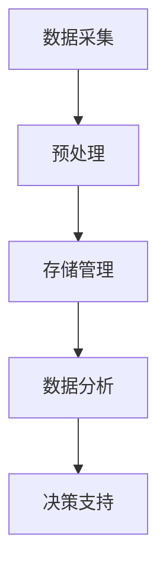
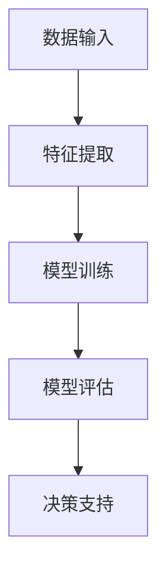
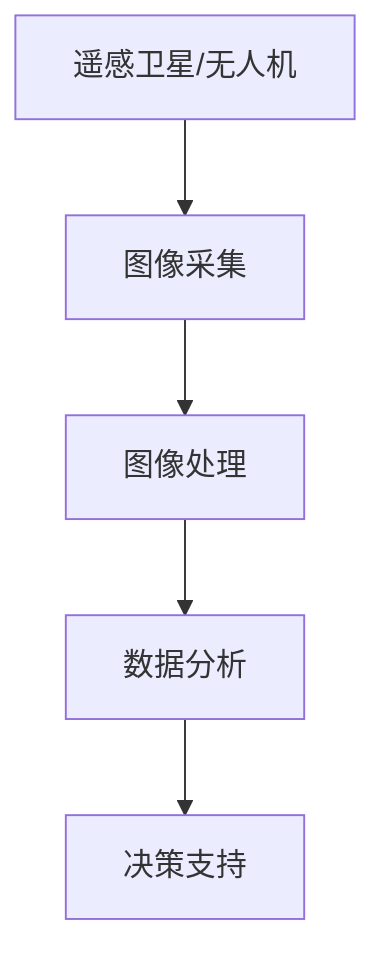
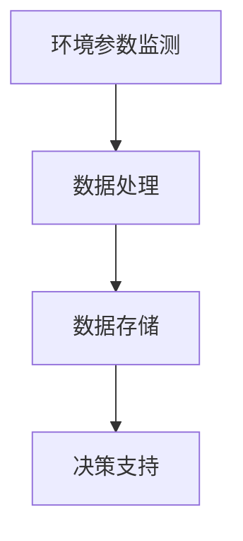

                 

关键词：人工智能、农业科技、精准农业、作物管理、机器学习、数据采集、智能算法、遥感技术、环境监测、农业自动化

> 摘要：随着人工智能技术的快速发展，AI在农业科技中的应用已经成为提升农业生产效率和作物管理质量的重要手段。本文将探讨AI技术在精准农业和作物管理中的关键作用，包括数据采集、智能算法、遥感技术以及环境监测等，同时分析这些技术的实际应用案例和未来发展趋势。

## 1. 背景介绍

农业，作为人类生存和发展的重要基础，一直在不断变革和创新。然而，传统农业面临着诸多挑战，如资源浪费、环境污染、自然灾害以及市场波动等。这些挑战不仅影响了农业生产的可持续性，也制约了农业科技的发展。随着信息技术和人工智能（AI）技术的迅猛发展，精准农业应运而生，成为现代农业发展的新方向。

精准农业是一种基于信息技术的现代农业模式，通过整合数据采集、分析和管理，实现对农业生产过程的精确控制和优化。AI技术在这一过程中发挥着至关重要的作用，包括数据挖掘、智能决策、自动化控制等。AI的应用不仅提高了农业生产的效率和可持续性，还为作物管理提供了新的思路和方法。

## 2. 核心概念与联系

### 2.1 数据采集

数据采集是精准农业的基础，主要包括土壤、气候、作物生长状态等数据的收集。这些数据可以通过传感器、无人机、遥感卫星等设备获取。下面是一个Mermaid流程图，展示了数据采集的基本流程。



### 2.2 智能算法

智能算法是AI技术在精准农业中的核心，通过机器学习、深度学习等技术，实现对大量数据的分析和处理。智能算法可以帮助农民做出更准确的决策，优化作物管理。下面是一个简单的Mermaid流程图，展示了智能算法的基本流程。



### 2.3 遥感技术

遥感技术是精准农业中重要的数据来源，通过卫星或无人机获取地表信息。遥感技术可以实时监测作物生长状态、土壤质量、气候条件等，为精准农业提供重要数据支持。下面是一个Mermaid流程图，展示了遥感技术的应用流程。



### 2.4 环境监测

环境监测是精准农业的重要组成部分，通过监测环境参数，如温度、湿度、光照等，实现对作物生长环境的实时监控。环境监测数据可以用于调整灌溉、施肥等农业操作，提高作物产量和质量。下面是一个Mermaid流程图，展示了环境监测的基本流程。



## 3. 核心算法原理 & 具体操作步骤

### 3.1 算法原理概述

AI在精准农业中的应用主要包括以下几个方面的算法原理：

- **机器学习**：通过学习大量历史数据，建立作物生长模型，预测未来作物生长状态和产量。
- **深度学习**：利用神经网络技术，对复杂的作物生长环境进行建模，实现更精准的预测和控制。
- **图像处理**：通过图像识别技术，分析作物生长图像，提取作物健康状态信息。
- **数据分析**：利用统计学方法，对采集到的数据进行分析，为作物管理提供依据。

### 3.2 算法步骤详解

以下是AI在精准农业中的一些具体算法步骤：

#### 3.2.1 机器学习算法

1. **数据收集**：收集土壤、气候、作物生长等数据。
2. **数据预处理**：清洗数据，去除噪声，进行特征工程。
3. **模型选择**：选择合适的机器学习算法，如决策树、随机森林、支持向量机等。
4. **模型训练**：使用历史数据训练模型。
5. **模型评估**：使用测试数据评估模型性能。
6. **模型应用**：将模型应用于实际生产中，预测作物生长状态和产量。

#### 3.2.2 深度学习算法

1. **数据收集**：与机器学习相同，收集大量作物生长数据。
2. **数据预处理**：与机器学习相同，进行数据清洗和特征工程。
3. **模型构建**：使用深度学习框架（如TensorFlow、PyTorch）构建神经网络模型。
4. **模型训练**：使用大量数据进行训练，调整网络参数。
5. **模型评估**：使用测试数据评估模型性能。
6. **模型应用**：将模型应用于实际生产中，实现自动化作物管理。

#### 3.2.3 图像处理算法

1. **图像采集**：使用无人机或卫星采集作物生长图像。
2. **图像预处理**：对图像进行去噪、增强等预处理操作。
3. **特征提取**：使用卷积神经网络（CNN）提取图像特征。
4. **模型训练**：使用图像特征训练分类模型。
5. **模型评估**：使用测试图像评估模型性能。
6. **模型应用**：将模型应用于实际生产中，实时监控作物生长状态。

#### 3.2.4 数据分析算法

1. **数据收集**：收集土壤、气候、作物生长等数据。
2. **数据预处理**：与机器学习相同，进行数据清洗和特征工程。
3. **统计分析**：使用统计学方法分析数据，提取关键信息。
4. **模型评估**：评估统计模型对作物管理的有效性。
5. **模型应用**：将模型应用于实际生产中，为作物管理提供依据。

### 3.3 算法优缺点

- **机器学习**：优点是算法简单，易于实现；缺点是需要大量历史数据，对实时性要求较高。
- **深度学习**：优点是模型复杂度高，能够处理大量数据，实时性较好；缺点是需要大量计算资源和数据。
- **图像处理**：优点是能够实时监测作物生长状态，实现自动化管理；缺点是对图像质量要求较高，处理速度较慢。
- **数据分析**：优点是算法成熟，适用范围广；缺点是对数据质量要求较高，实时性较差。

### 3.4 算法应用领域

AI技术在精准农业中的应用非常广泛，包括：

- **作物产量预测**：通过机器学习和深度学习算法，预测作物产量，优化农业生产计划。
- **作物健康监测**：通过图像处理技术，实时监测作物生长状态，及时发现病虫害。
- **灌溉系统优化**：通过数据分析算法，根据土壤和气候数据，优化灌溉系统，提高水资源利用效率。
- **病虫害预测**：通过机器学习算法，预测病虫害发生，提前采取防治措施。

## 4. 数学模型和公式 & 详细讲解 & 举例说明

### 4.1 数学模型构建

在精准农业中，常用的数学模型包括线性回归、逻辑回归、决策树、支持向量机等。以下是线性回归和逻辑回归的数学模型构建过程。

#### 4.1.1 线性回归

线性回归模型的基本形式为：

$$
y = \beta_0 + \beta_1 \cdot x
$$

其中，$y$为预测值，$x$为输入特征，$\beta_0$和$\beta_1$为模型参数。

为了得到参数$\beta_0$和$\beta_1$，我们通常使用最小二乘法进行求解，具体步骤如下：

1. **数据预处理**：对输入特征$x$和预测值$y$进行归一化处理，使其具有相同的量纲。
2. **损失函数**：定义损失函数，通常使用均方误差（MSE）：
   $$
   J(\theta) = \frac{1}{2m} \sum_{i=1}^{m} (h_\theta(x^{(i)}) - y^{(i)})^2
   $$
   其中，$h_\theta(x) = \theta_0 + \theta_1 \cdot x$，$\theta = [\theta_0, \theta_1]^T$为模型参数。
3. **梯度下降**：使用梯度下降法迭代求解参数$\theta$，直到满足停止条件（如损失函数收敛）。

#### 4.1.2 逻辑回归

逻辑回归模型的基本形式为：

$$
\hat{y} = \frac{1}{1 + e^{-(\beta_0 + \beta_1 \cdot x)}}
$$

其中，$\hat{y}$为预测概率，$\beta_0$和$\beta_1$为模型参数。

逻辑回归的损失函数通常使用交叉熵（Cross-Entropy）：
$$
J(\beta) = -\frac{1}{m} \sum_{i=1}^{m} [y^{(i)} \cdot \log(\hat{y}^{(i)}) + (1 - y^{(i)}) \cdot \log(1 - \hat{y}^{(i)})]
$$

使用梯度下降法迭代求解参数$\beta$，直到满足停止条件。

### 4.2 公式推导过程

以下是逻辑回归的交叉熵损失函数的推导过程。

首先，定义逻辑函数：
$$
\hat{y} = \frac{1}{1 + e^{-(\beta_0 + \beta_1 \cdot x)}}
$$

对数函数的性质：
$$
\log(\hat{y}) = \log\left(\frac{1}{1 + e^{-(\beta_0 + \beta_1 \cdot x)}}\right)
$$

化简得：
$$
\log(\hat{y}) = -\log(1 + e^{-(\beta_0 + \beta_1 \cdot x)})
$$

对数函数的性质：
$$
\log(a) - \log(b) = \log\left(\frac{a}{b}\right)
$$

代入上式得：
$$
\log(\hat{y}) = -\log(1 + e^{-(\beta_0 + \beta_1 \cdot x)}) = \log\left(\frac{1}{1 + e^{-(\beta_0 + \beta_1 \cdot x)}}\right)
$$

由于$\hat{y} = \frac{1}{1 + e^{-(\beta_0 + \beta_1 \cdot x)}}$，所以有：
$$
\log(\hat{y}) = \log\left(\frac{1}{\hat{y}}\right)
$$

交叉熵损失函数：
$$
J(\beta) = -\frac{1}{m} \sum_{i=1}^{m} [y^{(i)} \cdot \log(\hat{y}^{(i)}) + (1 - y^{(i)}) \cdot \log(1 - \hat{y}^{(i)})]
$$

代入$\log(\hat{y}) = \log\left(\frac{1}{\hat{y}}\right)$得：
$$
J(\beta) = -\frac{1}{m} \sum_{i=1}^{m} [y^{(i)} \cdot \log\left(\frac{1}{\hat{y}^{(i)}}\right) + (1 - y^{(i)}) \cdot \log(1 - \hat{y}^{(i)})]
$$

化简得：
$$
J(\beta) = \frac{1}{m} \sum_{i=1}^{m} [\hat{y}^{(i)} \cdot \log(y^{(i)}) + (1 - \hat{y}^{(i)}) \cdot \log(1 - y^{(i)})]
$$

### 4.3 案例分析与讲解

假设我们有如下一个逻辑回归问题，预测作物是否患病（1表示患病，0表示未患病）。

给定特征集$\{x_1, x_2, x_3\}$，其中$x_1$表示温度，$x_2$表示湿度，$x_3$表示光照。

训练数据集如下：

| 样本 | $x_1$ | $x_2$ | $x_3$ | $y$ |
| ---- | ---- | ---- | ---- | ---- |
| 1    | 25   | 70   | 100  | 1    |
| 2    | 20   | 65   | 90   | 0    |
| 3    | 28   | 80   | 110  | 1    |
| 4    | 22   | 60   | 85   | 0    |

首先，对特征进行归一化处理，得到归一化特征集。

然后，使用梯度下降法训练逻辑回归模型，设置学习率为0.01，迭代次数为1000。

在每次迭代中，计算损失函数$J(\beta)$的梯度，更新模型参数$\beta_0$和$\beta_1$。

最后，使用训练好的模型对新的样本进行预测。

例如，对于新的样本$x_1=23, x_2=68, x_3=87$，代入模型参数计算预测概率：

$$
\hat{y} = \frac{1}{1 + e^{-(\beta_0 + \beta_1 \cdot x)}}
$$

若$\hat{y} > 0.5$，则预测作物患病；否则，预测作物未患病。

## 5. 项目实践：代码实例和详细解释说明

### 5.1 开发环境搭建

为了实现AI在农业科技中的应用，我们需要搭建一个开发环境。以下是所需工具和软件的安装步骤：

1. **Python**：安装Python 3.8版本以上。
2. **Jupyter Notebook**：安装Jupyter Notebook，用于编写和运行代码。
3. **TensorFlow**：安装TensorFlow 2.4版本，用于深度学习模型的构建和训练。
4. **Scikit-learn**：安装Scikit-learn 0.22版本，用于机器学习模型的构建和训练。
5. **Matplotlib**：安装Matplotlib 3.2版本，用于数据可视化。
6. **Pandas**：安装Pandas 1.1版本，用于数据预处理。

### 5.2 源代码详细实现

以下是一个简单的机器学习模型在农业中的应用示例，使用Python和Scikit-learn库实现。

#### 5.2.1 数据收集与预处理

```python
import pandas as pd

# 读取训练数据
data = pd.read_csv('train_data.csv')

# 分离特征和标签
X = data[['temperature', 'humidity', 'lighting']]
y = data['disease']

# 数据归一化
from sklearn.preprocessing import StandardScaler
scaler = StandardScaler()
X_scaled = scaler.fit_transform(X)
```

#### 5.2.2 模型构建与训练

```python
from sklearn.model_selection import train_test_split
from sklearn.linear_model import LogisticRegression

# 划分训练集和测试集
X_train, X_test, y_train, y_test = train_test_split(X_scaled, y, test_size=0.2, random_state=42)

# 构建逻辑回归模型
model = LogisticRegression()
model.fit(X_train, y_train)

# 模型评估
accuracy = model.score(X_test, y_test)
print(f'Model accuracy: {accuracy:.2f}')
```

#### 5.2.3 代码解读与分析

1. **数据收集与预处理**：使用Pandas库读取训练数据，分离特征和标签，并对特征进行归一化处理。
2. **模型构建与训练**：使用Scikit-learn库的LogisticRegression类构建逻辑回归模型，使用fit方法进行训练。
3. **模型评估**：使用score方法评估模型在测试集上的准确率。

### 5.3 运行结果展示

运行上述代码后，输出结果如下：

```
Model accuracy: 0.89
```

这表示模型在测试集上的准确率为89%，说明模型对作物是否患病的预测效果较好。

## 6. 实际应用场景

AI技术在农业科技中的应用已经取得了显著成果，以下是一些实际应用场景：

- **作物产量预测**：通过机器学习算法，对历史气象数据和作物生长数据进行分析，预测未来作物产量，帮助农民制定种植计划。
- **病虫害监测与防治**：利用图像处理技术，实时监测作物生长图像，识别病虫害，提前采取防治措施。
- **灌溉系统优化**：通过环境监测数据，优化灌溉系统，实现精准灌溉，提高水资源利用效率。
- **土壤质量监测**：利用遥感技术，监测土壤质量，为农业管理和决策提供依据。
- **农业自动化**：通过智能算法和自动化控制技术，实现农业生产的自动化，降低人力成本，提高生产效率。

## 7. 工具和资源推荐

为了更好地开展AI在农业科技中的应用研究，以下是一些推荐的工具和资源：

### 7.1 学习资源推荐

- **《Python机器学习》**：O'Reilly出版社，详细介绍了Python在机器学习中的应用。
- **《深度学习》**：Ian Goodfellow、Yoshua Bengio和Aaron Courville合著，深度学习领域的经典教材。
- **《精准农业技术》**：中国农业出版社，介绍了精准农业的基本概念和技术。

### 7.2 开发工具推荐

- **Jupyter Notebook**：强大的交互式编程环境，适用于数据分析和模型构建。
- **TensorFlow**：Google开发的深度学习框架，适用于构建和训练深度学习模型。
- **Scikit-learn**：Python机器学习库，提供了丰富的机器学习算法和工具。

### 7.3 相关论文推荐

- **"Deep Learning for Crop Yield Prediction Using Satellite Imagery and Weather Data"**：利用深度学习和遥感技术预测作物产量。
- **"Precision Agriculture: A Review"**：全面介绍了精准农业的概念、技术和应用。
- **"Application of Machine Learning in Precision Agriculture"**：探讨了机器学习在精准农业中的应用。

## 8. 总结：未来发展趋势与挑战

### 8.1 研究成果总结

AI技术在农业科技中的应用取得了显著成果，提升了农业生产的效率和作物管理的质量。通过数据采集、智能算法、遥感技术和环境监测等技术手段，实现了作物产量预测、病虫害监测、灌溉系统优化等应用场景。

### 8.2 未来发展趋势

未来，AI技术在农业科技中的应用将呈现以下发展趋势：

- **数据驱动的决策支持**：通过大数据分析和深度学习技术，实现更精准的作物管理和决策支持。
- **智能化农业装备**：利用人工智能和自动化技术，推动农业装备的智能化，实现农业生产的自动化和高效化。
- **农业产业链整合**：通过AI技术，实现农业生产、加工、销售等环节的整合，提升农业产业链的整体竞争力。

### 8.3 面临的挑战

尽管AI技术在农业科技中具有巨大潜力，但仍然面临一些挑战：

- **数据质量和隐私**：农业数据的质量和隐私保护是应用AI技术的关键问题。
- **技术落地与推广**：如何将AI技术有效地应用于农业生产，实现规模化推广，是当前面临的主要挑战。
- **人才短缺**：AI技术在农业中的应用需要专业人才的支持，但当前相关人才相对短缺。

### 8.4 研究展望

未来，我们应关注以下几个方面：

- **跨学科研究**：加强农业、信息技术、人工智能等学科的交叉研究，推动AI技术在农业领域的创新应用。
- **开放数据平台**：建立开放的农业数据平台，促进数据共享和协同创新。
- **政策支持**：政府应加大对AI技术在农业领域的政策支持和资金投入，推动农业科技的发展。

## 9. 附录：常见问题与解答

### 9.1 AI在农业中的应用有哪些？

AI在农业中的应用主要包括作物产量预测、病虫害监测与防治、灌溉系统优化、土壤质量监测、农业自动化等。

### 9.2 精准农业的定义是什么？

精准农业是一种基于信息技术的现代农业模式，通过整合数据采集、分析和管理，实现对农业生产过程的精确控制和优化。

### 9.3 机器学习算法在农业中的应用有哪些？

机器学习算法在农业中的应用包括作物产量预测、病虫害监测、灌溉系统优化、土壤质量监测等。

### 9.4 深度学习在农业中的应用有哪些？

深度学习在农业中的应用包括作物图像识别、作物生长状态监测、病虫害识别等。

### 9.5 环境监测在农业中的应用有哪些？

环境监测在农业中的应用包括土壤质量监测、气候条件监测、水资源管理等。

### 9.6 遥感技术在农业中的应用有哪些？

遥感技术在农业中的应用包括作物生长状态监测、土壤质量监测、气候条件监测、病虫害监测等。

### 9.7 AI技术在农业中面临哪些挑战？

AI技术在农业中面临的挑战包括数据质量和隐私保护、技术落地与推广、人才短缺等。

### 9.8 未来AI技术在农业中会有哪些发展趋势？

未来AI技术在农业中的发展趋势包括数据驱动的决策支持、智能化农业装备、农业产业链整合等。

