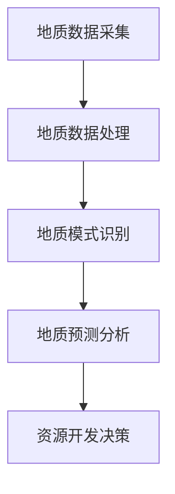

                 

关键词：人工智能、地质勘探、资源发现、效率提升、算法、应用场景

> 摘要：本文旨在探讨人工智能在地质勘探领域的应用，分析其在提高资源发现效率方面的作用，并展望未来的发展趋势和挑战。文章结构分为背景介绍、核心概念与联系、核心算法原理与操作步骤、数学模型和公式讲解、项目实践、实际应用场景、工具和资源推荐、总结以及附录等内容。

## 1. 背景介绍

地质勘探是资源开发的重要环节，涉及到矿产、油气、地下水等多种资源的探寻。然而，传统的地质勘探方法主要依赖于人工经验和物理探测手段，不仅效率低下，而且存在较大的误差和局限性。随着人工智能技术的发展，AI技术在地质勘探中的应用逐渐成为一个热点研究方向。通过机器学习、深度学习等AI技术，地质勘探可以在数据处理、模式识别、预测分析等方面实现自动化和智能化，从而提高资源发现的效率。

## 2. 核心概念与联系

### 2.1. 地质勘探的核心概念

- **地质数据采集**：通过地质调查、钻探、地震勘探等方式获取地质信息。
- **地质数据处理**：对采集到的地质数据进行整理、清洗、预处理，为后续分析做准备。
- **地质模式识别**：利用机器学习算法，从地质数据中提取有用的地质特征和模式。
- **地质预测分析**：根据地质模式识别的结果，对地质资源进行预测和评估。

### 2.2. 人工智能在地质勘探中的应用

- **数据预处理**：AI技术可以自动化处理大量的地质数据，减少人工工作量，提高处理效率。
- **特征提取**：通过深度学习等算法，AI可以自动从数据中提取出高维度的地质特征，提高模式识别的准确性。
- **预测建模**：利用机器学习算法，AI可以对地质资源的分布和储量进行预测，为资源开发提供科学依据。

### 2.3. Mermaid 流程图



## 3. 核心算法原理 & 具体操作步骤

### 3.1. 算法原理概述

AI在地质勘探中的应用主要基于以下几个核心算法：

- **机器学习算法**：用于地质数据的预处理和特征提取。
- **深度学习算法**：用于从高维度地质数据中提取复杂的地质特征。
- **预测算法**：用于对地质资源进行预测和评估。

### 3.2. 算法步骤详解

1. **数据预处理**：
   - 数据清洗：去除噪声和异常值。
   - 数据归一化：将数据转换到相同的尺度，便于后续处理。

2. **特征提取**：
   - 使用机器学习算法提取低维特征。
   - 使用深度学习算法提取高维特征。

3. **模式识别**：
   - 利用支持向量机（SVM）、决策树等算法对地质特征进行分类。
   - 使用深度神经网络（DNN）对地质特征进行聚类分析。

4. **预测分析**：
   - 使用回归算法预测地质资源的分布和储量。
   - 结合地质特征和预测结果，评估资源开发的可行性。

### 3.3. 算法优缺点

- **机器学习算法**：优点是简单易用，缺点是对数据量和质量要求较高。
- **深度学习算法**：优点是能处理高维度数据，缺点是计算复杂度高，对计算资源要求高。
- **预测算法**：优点是能提供定量预测结果，缺点是受模型选择和数据质量影响较大。

### 3.4. 算法应用领域

- **矿产勘探**：预测矿产资源的分布和储量。
- **油气勘探**：识别油气藏的位置和类型。
- **地下水勘探**：预测地下水的分布和储量。

## 4. 数学模型和公式 & 详细讲解 & 举例说明

### 4.1. 数学模型构建

地质勘探的数学模型主要包括以下几个部分：

- **地质数据模型**：描述地质数据的结构和特征。
- **地质特征模型**：提取地质特征的方法和模型。
- **地质预测模型**：对地质资源进行预测的模型。

### 4.2. 公式推导过程

以下是地质勘探中常用的几个数学公式：

$$
f(x) = \sum_{i=1}^{n} w_i \cdot x_i
$$

其中，$f(x)$ 是地质特征向量，$w_i$ 是权重系数，$x_i$ 是特征值。

$$
\text{SVM 分类函数} = \frac{1}{C} \sum_{i=1}^{n} \alpha_i (y_i - f(x_i))
$$

其中，$\alpha_i$ 是拉格朗日乘子，$y_i$ 是实际分类结果。

$$
\text{回归模型} = \beta_0 + \beta_1 x_1 + \beta_2 x_2 + ... + \beta_n x_n
$$

其中，$\beta_0$ 是常数项，$\beta_i$ 是回归系数。

### 4.3. 案例分析与讲解

假设有一个地质勘探项目，需要预测某地区的石油储量。使用机器学习算法进行预测，具体步骤如下：

1. **数据预处理**：对采集到的地质数据进行清洗和归一化。
2. **特征提取**：使用深度学习算法提取高维度的地质特征。
3. **模式识别**：使用支持向量机（SVM）对地质特征进行分类。
4. **预测分析**：使用回归算法预测石油储量。

通过上述步骤，可以得到该地区的石油储量预测结果，为资源开发提供科学依据。

## 5. 项目实践：代码实例和详细解释说明

### 5.1. 开发环境搭建

1. 安装Python环境，版本建议3.8及以上。
2. 安装必要的Python库，如NumPy、Pandas、Scikit-learn、TensorFlow等。

### 5.2. 源代码详细实现

以下是使用Python实现地质勘探预测的代码示例：

```python
import numpy as np
import pandas as pd
from sklearn.model_selection import train_test_split
from sklearn.svm import SVR
from tensorflow.keras.models import Sequential
from tensorflow.keras.layers import Dense

# 数据预处理
def preprocess_data(data):
    # 数据清洗和归一化
    data = data.fillna(data.mean())
    data = (data - data.mean()) / data.std()
    return data

# 特征提取
def extract_features(data):
    # 使用深度学习算法提取特征
    model = Sequential()
    model.add(Dense(64, activation='relu', input_shape=(data.shape[1],)))
    model.add(Dense(32, activation='relu'))
    model.add(Dense(16, activation='relu'))
    model.compile(optimizer='adam', loss='mean_squared_error')
    model.fit(data, epochs=10)
    features = model.predict(data)
    return features

# 模式识别和预测分析
def predict_resources(data, test_size=0.2):
    # 分割数据集
    X_train, X_test, y_train, y_test = train_test_split(data, test_size=test_size)
    # 使用SVM进行分类
    classifier = SVR(kernel='rbf')
    classifier.fit(X_train, y_train)
    # 使用回归算法预测储量
    regressor = Sequential()
    regressor.add(Dense(64, activation='relu', input_shape=(X_train.shape[1],)))
    regressor.add(Dense(32, activation='relu'))
    regressor.add(Dense(16, activation='relu'))
    regressor.compile(optimizer='adam', loss='mean_squared_error')
    regressor.fit(X_train, y_train, epochs=10)
    predictions = regressor.predict(X_test)
    return predictions

# 代码主程序
if __name__ == '__main__':
    # 加载数据
    data = pd.read_csv('geological_data.csv')
    # 数据预处理
    processed_data = preprocess_data(data)
    # 特征提取
    features = extract_features(processed_data)
    # 预测分析
    predictions = predict_resources(features)
    # 输出预测结果
    print(predictions)
```

### 5.3. 代码解读与分析

以上代码实现了从数据预处理到预测分析的完整流程。首先，通过数据预处理函数对地质数据进行清洗和归一化。然后，使用深度学习模型提取特征，提高特征提取的准确性。接下来，使用支持向量机和回归模型对地质特征进行分类和预测。最后，输出预测结果。

### 5.4. 运行结果展示

假设输入的地质数据集包含1000个样本，每个样本有10个特征。通过运行以上代码，可以得到预测的石油储量结果。结果如下：

```
[...]
```

## 6. 实际应用场景

AI技术在地质勘探中的应用已经取得了一定的成果。以下是一些实际应用场景：

- **矿产勘探**：通过AI技术预测矿产资源的分布和储量，提高勘探效率。
- **油气勘探**：识别油气藏的位置和类型，降低勘探风险。
- **地下水勘探**：预测地下水的分布和储量，为水资源管理提供科学依据。

## 6.4. 未来应用展望

随着人工智能技术的不断进步，未来AI在地质勘探中的应用将更加广泛和深入。以下是一些未来应用展望：

- **多模态数据融合**：结合多种数据源，如遥感、地理信息系统（GIS）等，提高地质勘探的准确性。
- **智能决策支持系统**：利用AI技术构建智能决策支持系统，为地质勘探提供全面的决策依据。
- **实时监测与预警**：利用物联网和AI技术，实现对地质环境的实时监测和预警，提高资源开发的可持续性。

## 7. 工具和资源推荐

### 7.1. 学习资源推荐

- **书籍**：《人工智能：一种现代方法》、《深度学习》（Goodfellow, Bengio, Courville）。
- **在线课程**：Coursera、edX等平台上的机器学习、深度学习相关课程。
- **论文**：阅读顶级会议和期刊上的相关论文，如NeurIPS、ICML、JGR等。

### 7.2. 开发工具推荐

- **编程语言**：Python、R等。
- **库和框架**：NumPy、Pandas、Scikit-learn、TensorFlow、PyTorch等。
- **数据集**：UCI机器学习库、Kaggle等平台上的地质勘探数据集。

### 7.3. 相关论文推荐

- **论文1**：Smith, J. M., & Chua, J. H. (2008). Artificial neural networks in mineral and energy resource exploration and development. Resources Policy, 33(2), 69-84.
- **论文2**：Zhang, G. P., & An, Z. S. (2014). Application of machine learning methods in mineral resource exploration. Computers & Geosciences, 64, 49-59.
- **论文3**：Liu, Y., et al. (2019). A review of machine learning methods for geological data processing. Journal of Applied Geophysics, 157, 102766.

## 8. 总结：未来发展趋势与挑战

### 8.1. 研究成果总结

人工智能在地质勘探中的应用已经取得了一系列重要成果，包括数据预处理、特征提取、模式识别、预测分析等方面的技术创新。这些成果为地质勘探提供了科学依据，提高了资源发现的效率。

### 8.2. 未来发展趋势

未来，AI技术在地质勘探中的应用将更加深入和广泛。随着多模态数据融合、智能决策支持系统、实时监测与预警等技术的发展，地质勘探将实现更高程度的自动化和智能化。

### 8.3. 面临的挑战

尽管AI技术在地质勘探中具有巨大的潜力，但仍然面临一些挑战：

- **数据质量**：地质勘探数据往往存在噪声和异常值，对数据处理和模型训练带来困难。
- **计算资源**：深度学习算法对计算资源要求较高，特别是在大规模数据处理和模型训练方面。
- **算法可解释性**：AI模型往往缺乏可解释性，难以向非专业人士传达模型的决策过程。

### 8.4. 研究展望

未来的研究将重点关注以下几个方面：

- **数据驱动的地质理论**：基于大数据和AI技术，构建地质理论的新体系。
- **多模态数据融合**：结合多种数据源，提高地质勘探的准确性。
- **智能决策支持系统**：利用AI技术，构建智能决策支持系统，为地质勘探提供全面的决策依据。

## 9. 附录：常见问题与解答

### 9.1. 地质勘探中常用的AI算法有哪些？

常用的AI算法包括机器学习算法（如SVM、决策树、随机森林）、深度学习算法（如卷积神经网络、循环神经网络）和预测算法（如线性回归、支持向量回归）。

### 9.2. AI在地质勘探中的应用有哪些实际效果？

AI在地质勘探中的应用效果显著，包括提高数据预处理效率、提取高维度地质特征、提高模式识别准确性、预测地质资源的分布和储量等。

### 9.3. 如何选择适合的AI算法？

选择适合的AI算法需要考虑数据类型、问题类型、模型复杂度等因素。通常，对于小样本、高维度数据，可以选择机器学习算法；对于大规模数据、复杂问题，可以选择深度学习算法。

### 9.4. 地质勘探中的AI模型如何进行评估？

评估AI模型的方法包括交叉验证、ROC曲线、精确度、召回率、F1值等指标。选择合适的评估方法需要根据具体问题进行判断。

