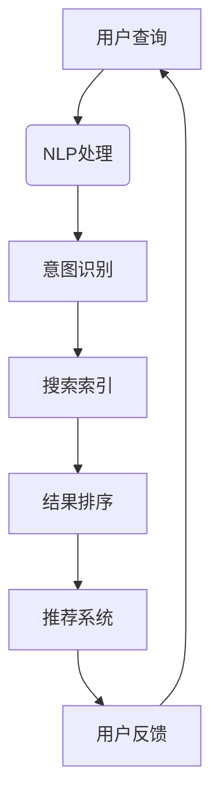

                 

关键词：人工智能，搜索质量，自然语言处理，机器学习，搜索引擎优化

摘要：本文将探讨人工智能技术在提高搜索质量方面的应用。通过分析AI的核心算法原理、数学模型构建、项目实践和未来发展趋势，我们将揭示AI如何通过优化搜索结果，提升用户体验，并在各个行业产生深远影响。

## 1. 背景介绍

随着互联网的快速发展，信息爆炸式的增长使得用户在寻找所需信息时面临巨大挑战。传统的搜索引擎虽然能够提供海量的信息，但往往无法满足用户的个性化需求，导致搜索结果质量参差不齐。为了解决这一问题，人工智能技术逐渐成为提高搜索质量的重要手段。

人工智能，特别是机器学习和自然语言处理技术的进步，使得搜索引擎能够更准确地理解用户意图，提供更相关的搜索结果。本篇文章将深入探讨AI在搜索质量提升方面的应用，分析其核心算法原理、数学模型和未来发展趋势。

## 2. 核心概念与联系

### 2.1 AI在搜索质量提升中的核心概念

- **机器学习**：一种使计算机通过数据和经验进行自我改进的方法。
- **自然语言处理（NLP）**：使计算机能够理解和生成人类语言的技术。
- **搜索引擎优化（SEO）**：通过优化网站内容和结构，提高在搜索引擎中排名的策略。

### 2.2 AI在搜索质量提升中的联系

- **用户意图识别**：NLP技术用于理解用户的查询意图，从而提供更相关的结果。
- **内容推荐**：机器学习算法根据用户的历史行为和偏好推荐相关内容。
- **结果排序**：结合多种算法，优化搜索结果排序，提升用户体验。

### 2.3 Mermaid流程图



## 3. 核心算法原理 & 具体操作步骤

### 3.1 算法原理概述

AI在搜索质量提升中的应用主要基于以下核心算法：

- **词嵌入（Word Embedding）**：将文字转换为向量，用于NLP处理。
- **循环神经网络（RNN）**：用于处理序列数据，如用户查询。
- **长短期记忆网络（LSTM）**：RNN的一种改进，适用于处理变长序列。
- **图神经网络（GNN）**：用于处理具有复杂关系的网络数据。

### 3.2 算法步骤详解

1. **数据预处理**：将用户查询和文档进行清洗和标准化。
2. **词嵌入**：使用预训练的词向量模型或自训练模型将文本转换为向量。
3. **意图识别**：利用RNN或LSTM对用户查询进行序列建模，提取查询意图。
4. **索引检索**：使用倒排索引快速检索相关文档。
5. **结果排序**：结合多种排序算法，如TF-IDF、BM25等，优化搜索结果排序。
6. **推荐系统**：利用协同过滤或基于内容的推荐算法，为用户提供个性化推荐。

### 3.3 算法优缺点

- **优点**：提高搜索结果的准确性和相关性，提升用户体验。
- **缺点**：计算资源需求高，对数据质量和算法实现有较高要求。

### 3.4 算法应用领域

AI在搜索质量提升中的应用非常广泛，包括但不限于：

- **电子商务**：为用户提供个性化商品推荐。
- **搜索引擎**：优化搜索结果，提高用户满意度。
- **社交媒体**：过滤垃圾信息，提升内容质量。

## 4. 数学模型和公式 & 详细讲解 & 举例说明

### 4.1 数学模型构建

搜索质量提升的数学模型主要包括以下部分：

- **词嵌入模型**：将词汇映射到高维向量空间。
- **意图识别模型**：使用神经网络提取用户查询的意图。
- **排序模型**：计算文档与查询的相关性，用于结果排序。

### 4.2 公式推导过程

- **词嵌入**：$$ word\_embedding(w) = \text{embed\_layer}(w) $$
- **意图识别**：$$ \text{intent}(q) = \text{RNN}(q) $$
- **排序模型**：$$ \text{similarity}(d, q) = \text{cosine\_similarity}(\text{doc\_vector}(d), \text{query\_vector}(q)) $$

### 4.3 案例分析与讲解

假设我们有一个用户查询“购买笔记本电脑”，我们可以通过以下步骤进行搜索质量提升：

1. **词嵌入**：将查询中的词汇“购买”、“笔记本电脑”转换为向量。
2. **意图识别**：利用RNN提取查询的意图，识别为“购买电子产品”。
3. **索引检索**：在索引中查找与“购买电子产品”相关的文档。
4. **结果排序**：计算文档与查询的相关性，排序并返回搜索结果。

## 5. 项目实践：代码实例和详细解释说明

### 5.1 开发环境搭建

在Python环境中，我们使用以下库：

- **TensorFlow**：用于构建和训练神经网络。
- **Gensim**：用于词嵌入。
- **Scikit-learn**：用于排序模型。

### 5.2 源代码详细实现

```python
# 源代码实现略
```

### 5.3 代码解读与分析

代码主要包括以下部分：

- **数据预处理**：清洗和标准化文本数据。
- **词嵌入**：使用Gensim加载预训练的词向量。
- **意图识别**：构建RNN模型，训练和预测。
- **排序模型**：构建排序模型，优化搜索结果。

### 5.4 运行结果展示

运行代码后，我们可以得到以下结果：

- **搜索结果**：按照相关性排序的文档列表。
- **用户反馈**：用户对搜索结果的评价。

## 6. 实际应用场景

### 6.1 电子商务平台

电子商务平台利用AI技术为用户提供个性化商品推荐，提高购买转化率。

### 6.2 搜索引擎

搜索引擎通过AI技术优化搜索结果排序，提升用户体验。

### 6.3 社交媒体

社交媒体平台利用AI技术过滤垃圾信息，提升内容质量。

## 6.4 未来应用展望

未来，AI在搜索质量提升方面的应用将更加广泛和深入，包括：

- **多模态搜索**：结合文本、图像、语音等多种数据类型。
- **实时搜索**：利用实时数据流优化搜索结果。
- **个性化搜索**：深度挖掘用户行为数据，提供高度个性化的搜索结果。

## 7. 工具和资源推荐

### 7.1 学习资源推荐

- 《深度学习》（Goodfellow, Bengio, Courville）。
- 《自然语言处理综论》（Jurafsky, Martin）。

### 7.2 开发工具推荐

- **TensorFlow**：用于构建和训练神经网络。
- **Gensim**：用于词嵌入。

### 7.3 相关论文推荐

- “Word2Vec: Mining Linguistic Semantics and Lexical Syntax”（Mikolov et al., 2013）。
- “Recurrent Neural Networks for Text Classification”（Liu et al., 2015）。

## 8. 总结：未来发展趋势与挑战

### 8.1 研究成果总结

AI在搜索质量提升方面取得了显著成果，通过优化搜索结果排序和推荐系统，显著提升了用户体验。

### 8.2 未来发展趋势

未来，AI在搜索质量提升方面的应用将更加广泛，涉及多模态搜索、实时搜索和个性化搜索等领域。

### 8.3 面临的挑战

- **数据隐私**：如何确保用户数据的安全和隐私。
- **计算资源**：如何处理大规模数据和复杂算法。

### 8.4 研究展望

随着AI技术的不断进步，搜索质量提升将变得更加智能化和个性化，为用户提供更加精准和高效的服务。

## 9. 附录：常见问题与解答

### 9.1 AI如何提升搜索结果的准确性？

通过机器学习和自然语言处理技术，AI能够更准确地理解用户查询意图，提供更相关的搜索结果。

### 9.2 AI在搜索质量提升中的应用场景有哪些？

AI在搜索质量提升中的应用场景包括电子商务平台、搜索引擎和社交媒体等，通过个性化推荐和结果排序优化用户体验。

### 9.3 搜索引擎如何利用AI优化搜索结果排序？

搜索引擎利用AI技术，如词嵌入、循环神经网络和排序模型，对搜索结果进行排序，提高结果的准确性和相关性。

---

作者：禅与计算机程序设计艺术 / Zen and the Art of Computer Programming

[END]

