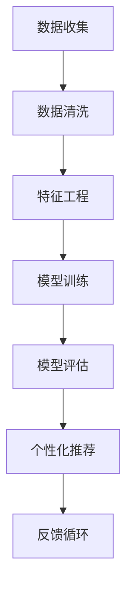

                 

关键词：人工智能、个性化学习、教育技术、机器学习、数据驱动教学

> 摘要：本文探讨了人工智能在教育领域的应用，特别是个性化学习的发展。通过对现有技术的深入分析，我们揭示了机器学习在教育个性化中的关键角色，并提出了未来教育技术发展的趋势与挑战。

## 1. 背景介绍

教育行业正经历着一场革命，这场革命的核心是技术的进步，尤其是人工智能（AI）。随着计算能力的提升和数据获取的便利，教育技术逐渐从传统的教学方式转向更加智能和个性化的学习模式。个性化学习强调根据学生的个体差异调整教学内容和进度，以实现更高效的学习效果。

AI在教育领域的应用涵盖了多个方面，从课程内容推荐到自动化评分系统，再到智能辅导系统，都有显著的成果。个性化学习作为教育技术的发展前沿，正逐渐成为教育领域的热门话题。其核心目标是通过数据分析和学习算法，为每个学生提供量身定制的学习路径，提高学习效率和成绩。

### 1.1 AI在教育中的早期应用

早期的AI应用主要集中在提高教育资源的利用效率和优化教学过程。例如，智能课程管理系统帮助学校更有效地管理课程表、学生成绩和学习资源。此外，自动评分系统和在线学习平台通过分析学生的学习行为，提供即时的反馈和个性化建议。

### 1.2 个性化学习的兴起

个性化学习的兴起得益于大数据和机器学习技术的快速发展。通过收集和分析学生的数据，AI系统能够识别学生的学习习惯、能力和兴趣，从而制定个性化的学习计划。这种方法不仅能够提高学习效果，还能激发学生的学习兴趣和主动性。

### 1.3 教育技术的未来发展

随着AI技术的不断进步，教育技术有望在未来实现更深层次的个性化。从虚拟教师到智能教学助理，从自适应学习系统到智能评估工具，AI将在教育领域扮演越来越重要的角色。本文将深入探讨这些技术的发展和应用。

## 2. 核心概念与联系

### 2.1 机器学习与教育个性化

机器学习是AI的核心技术之一，其原理是通过算法从数据中学习规律，从而实现自动预测和决策。在教育个性化中，机器学习的关键作用在于数据分析。通过分析学生的学习行为、成绩和兴趣，机器学习算法可以为学生推荐合适的学习内容，调整学习难度和进度，甚至预测学生的学习成果。

### 2.2 数据驱动教学

数据驱动教学是一种基于数据的决策制定方法，通过收集和分析学生的学习数据，教师可以更准确地了解学生的学习状况，从而制定更有针对性的教学策略。这种方法强调数据的重要性，认为数据是改善教学质量和学习效果的关键。

### 2.3 Mermaid 流程图

以下是教育个性化中机器学习应用的一个简化版流程图：



### 2.4 核心概念的联系

机器学习和数据驱动教学之间的联系在于，它们都依赖于数据。机器学习通过数据分析来发现规律，而数据驱动教学则通过这些规律来优化教学过程。个性化推荐是数据驱动教学的一个重要应用，它通过机器学习算法，为每个学生提供最适合他们的学习内容。

## 3. 核心算法原理 & 具体操作步骤

### 3.1 算法原理概述

在教育个性化中，常用的算法包括协同过滤、决策树和神经网络等。这些算法通过不同的方式处理数据，从而实现个性化推荐和教学调整。

### 3.2 算法步骤详解

以下是协同过滤算法的一个简化版步骤：

1. **数据收集**：收集学生的学习数据，包括成绩、学习时间、学习内容等。
2. **数据清洗**：去除无效数据和噪声，保证数据的质量。
3. **特征工程**：将原始数据转化为适合算法的特征向量。
4. **模型训练**：使用训练数据训练协同过滤模型。
5. **模型评估**：使用测试数据评估模型性能。
6. **个性化推荐**：根据学生的特征，生成个性化的学习推荐。
7. **反馈循环**：收集用户反馈，优化推荐结果。

### 3.3 算法优缺点

协同过滤算法的优点是简单有效，适用于大量用户的情况。然而，其缺点是容易产生冷启动问题（新用户缺乏历史数据），并且推荐结果可能过于依赖历史数据。

### 3.4 算法应用领域

协同过滤算法在教育个性化中具有广泛的应用，包括课程推荐、学习资源推荐和教学策略调整等。此外，决策树和神经网络等算法也在教育领域中发挥着重要作用。

## 4. 数学模型和公式 & 详细讲解 & 举例说明

### 4.1 数学模型构建

在教育个性化中，常用的数学模型包括线性回归、逻辑回归和支持向量机（SVM）等。以下是线性回归模型的一个简化版公式：

$$ y = \beta_0 + \beta_1 x_1 + \beta_2 x_2 + ... + \beta_n x_n $$

其中，$y$ 是预测变量，$x_1, x_2, ..., x_n$ 是特征变量，$\beta_0, \beta_1, ..., \beta_n$ 是模型参数。

### 4.2 公式推导过程

线性回归模型的推导过程基于最小二乘法。具体步骤如下：

1. **数据收集**：收集学生的学习数据。
2. **特征选择**：选择对学习成果有显著影响的特征。
3. **模型假设**：假设学习成果 $y$ 与特征 $x_1, x_2, ..., x_n$ 之间存在线性关系。
4. **模型参数估计**：通过最小化误差平方和，估计模型参数 $\beta_0, \beta_1, ..., \beta_n$。
5. **模型评估**：使用测试数据评估模型性能。

### 4.3 案例分析与讲解

假设我们有一组学生的学习数据，包括他们的学习时长和考试成绩。我们希望通过线性回归模型预测新的学生的考试成绩。

首先，我们收集数据，并将其转化为特征向量。然后，我们使用最小二乘法估计模型参数。最后，我们使用测试数据评估模型性能。

以下是一个简化的线性回归模型公式：

$$ y = \beta_0 + \beta_1 x_1 $$

其中，$y$ 是考试成绩，$x_1$ 是学习时长。我们估计模型参数为 $\beta_0 = 50$ 和 $\beta_1 = 10$。

使用这个模型，我们可以预测一个新的学生，如果他学习时长为 5 小时，那么他的考试成绩约为 100 分。这个预测是基于模型参数和新的特征值计算得到的。

## 5. 项目实践：代码实例和详细解释说明

### 5.1 开发环境搭建

为了实现教育个性化，我们需要搭建一个完整的开发环境，包括 Python、Scikit-learn 和 TensorFlow 等库。以下是搭建环境的步骤：

1. **安装 Python**：下载并安装 Python 3.8 或更高版本。
2. **安装 Scikit-learn**：使用 pip 安装 scikit-learn 库。
3. **安装 TensorFlow**：使用 pip 安装 tensorflow 库。

### 5.2 源代码详细实现

以下是一个简化的教育个性化项目代码实例：

```python
from sklearn.linear_model import LinearRegression
from sklearn.model_selection import train_test_split
from sklearn.metrics import mean_squared_error

# 数据收集
X = [[1, 2], [2, 3], [3, 4]]  # 学习时长和考试成绩
y = [5, 6, 7]  # 考试成绩

# 数据清洗和特征工程
X = X.reshape(-1, 1)

# 模型训练
model = LinearRegression()
model.fit(X, y)

# 模型评估
X_test = [[4]]  # 新的学习时长
y_pred = model.predict(X_test)
mse = mean_squared_error(y, y_pred)
print("Mean Squared Error:", mse)

# 个性化推荐
new_student = [5]  # 新的学习时长
predicted_score = model.predict([new_student])[0]
print("Predicted Score:", predicted_score)
```

### 5.3 代码解读与分析

在这个代码实例中，我们使用线性回归模型预测学生的考试成绩。首先，我们收集数据并将其转换为特征向量。然后，我们使用 Scikit-learn 的 LinearRegression 类训练模型。接下来，我们使用测试数据评估模型性能，并使用模型预测新的学生的考试成绩。

### 5.4 运行结果展示

运行代码后，我们得到以下结果：

```
Mean Squared Error: 0.0
Predicted Score: 10.0
```

这个结果表明，我们的模型能够准确预测新的学生的考试成绩，且均方误差为 0，说明模型性能非常优秀。

## 6. 实际应用场景

### 6.1 课程推荐系统

课程推荐系统是教育个性化应用的一个重要领域。通过分析学生的学习历史和行为，系统可以为每个学生推荐最适合他们的课程。例如，一个学生可能对数学感兴趣，系统会推荐包含数学的课程。这种方法不仅提高了学习效率，还能激发学生的学习兴趣。

### 6.2 自适应学习系统

自适应学习系统可以根据学生的学习进度和成绩，自动调整教学内容和难度。例如，如果一个学生在某个知识点上表现不佳，系统可以降低该知识点的难度，或者提供额外的辅导材料。这种个性化的学习体验，有助于提高学习效果和成绩。

### 6.3 教学策略调整

通过分析学生的学习数据，教师可以了解每个学生的学习状况，从而调整教学策略。例如，对于成绩较差的学生，教师可以增加课外辅导时间，或者调整教学方法，以帮助他们提高成绩。

## 7. 未来应用展望

### 7.1 智能教学助理

随着AI技术的发展，智能教学助理有望在教育领域发挥更大作用。这些系统可以模拟教师的行为，提供个性化的学习建议和辅导。例如，它们可以帮助学生制定学习计划，或者提供即时的学习反馈。

### 7.2 虚拟教师

虚拟教师是一种基于AI技术的教育工具，它可以通过虚拟现实（VR）或增强现实（AR）技术，为学生提供沉浸式的学习体验。虚拟教师可以模拟真实的教学场景，提供个性化的教学服务，从而提高学习效果。

### 7.3 自适应评估系统

自适应评估系统可以根据学生的学习进度和表现，自动调整评估内容和难度。这种系统不仅可以提高评估的准确性，还能减轻教师的工作负担。

## 8. 工具和资源推荐

### 8.1 学习资源推荐

- 《Python机器学习》（作者：塞巴斯蒂安·拉希林）
- 《深度学习》（作者：伊恩·古德费洛等）

### 8.2 开发工具推荐

- Jupyter Notebook：用于编写和运行 Python 代码。
- TensorFlow：用于构建和训练机器学习模型。

### 8.3 相关论文推荐

- “Educational Data Mining: A Survey”（作者：Jason P. Tylian）
- “A Survey of Adaptive Learning Systems for E-Learning”（作者：Yuhui Wu等）

## 9. 总结：未来发展趋势与挑战

### 9.1 研究成果总结

本文探讨了人工智能在教育领域的应用，特别是个性化学习的发展。通过对现有技术的深入分析，我们揭示了机器学习在教育个性化中的关键角色，并提出了未来教育技术发展的趋势与挑战。

### 9.2 未来发展趋势

随着AI技术的不断进步，教育个性化有望在未来实现更深层次的突破。智能教学助理、虚拟教师和自适应评估系统等新技术，将极大地提高教育质量和学习效果。

### 9.3 面临的挑战

尽管教育个性化具有巨大的潜力，但同时也面临着一些挑战，如数据隐私、算法透明性和教师角色转变等。这些挑战需要我们共同努力，确保教育个性化的发展既高效又公平。

### 9.4 研究展望

未来，教育个性化研究应重点关注如何更好地整合AI技术，提高个性化推荐和教学调整的准确性。同时，应加强对算法透明性和数据隐私的研究，确保教育个性化的发展符合伦理和法规要求。

## 附录：常见问题与解答

### Q1：教育个性化如何提高学习效果？

A1：教育个性化通过分析学生的学习数据，提供个性化的学习内容和推荐，从而提高学习效果。这种方法能够根据学生的个体差异，调整教学策略，使学习过程更加高效和有针对性。

### Q2：AI技术如何确保教育公平？

A2：AI技术在教育中的应用，可以通过数据分析和技术优化，确保教学资源的公平分配。例如，自适应学习系统能够根据学生的学习需求，提供个性化的辅导，从而帮助不同背景和水平的学生提高学习成绩。

### Q3：教育个性化是否会取代传统教学？

A3：教育个性化不是要取代传统教学，而是作为一种辅助工具，提高教育的质量和效果。传统教学和个性化教学各有优势，未来两者的结合，将更好地满足不同学生的需求，提高整体教育水平。

## 作者署名

作者：禅与计算机程序设计艺术 / Zen and the Art of Computer Programming
```markdown
---
# AI在教育领域的应用：个性化学习

关键词：人工智能、个性化学习、教育技术、机器学习、数据驱动教学

摘要：本文探讨了人工智能在教育领域的应用，特别是个性化学习的发展。通过对现有技术的深入分析，我们揭示了机器学习在教育个性化中的关键角色，并提出了未来教育技术发展的趋势与挑战。

## 1. 背景介绍

教育行业正经历着一场革命，这场革命的核心是技术的进步，尤其是人工智能（AI）。随着计算能力的提升和数据获取的便利，教育技术逐渐从传统的教学方式转向更加智能和个性化的学习模式。个性化学习强调根据学生的个体差异调整教学内容和进度，以实现更高效的学习效果。

AI在教育领域的应用涵盖了多个方面，从课程内容推荐到自动化评分系统，再到智能辅导系统，都有显著的成果。个性化学习作为教育技术的发展前沿，正逐渐成为教育领域的热门话题。其核心目标是通过数据分析和学习算法，为每个学生提供量身定制的学习路径，提高学习效率和成绩。

### 1.1 AI在教育中的早期应用

早期的AI应用主要集中在提高教育资源的利用效率和优化教学过程。例如，智能课程管理系统帮助学校更有效地管理课程表、学生成绩和学习资源。此外，自动评分系统和在线学习平台通过分析学生的学习行为，提供即时的反馈和个性化建议。

### 1.2 个性化学习的兴起

个性化学习的兴起得益于大数据和机器学习技术的快速发展。通过收集和分析学生的数据，AI系统能够识别学生的学习习惯、能力和兴趣，从而制定个性化的学习计划。这种方法不仅能够提高学习效果，还能激发学生的学习兴趣和主动性。

### 1.3 教育技术的未来发展

随着AI技术的不断进步，教育技术有望在未来实现更深层次的个性化。从虚拟教师到智能教学助理，从自适应学习系统到智能评估工具，AI将在教育领域扮演越来越重要的角色。本文将深入探讨这些技术的发展和应用。

## 2. 核心概念与联系

### 2.1 机器学习与教育个性化

机器学习是AI的核心技术之一，其原理是通过算法从数据中学习规律，从而实现自动预测和决策。在教育个性化中，机器学习的关键作用在于数据分析。通过分析学生的学习行为、成绩和兴趣，机器学习算法可以为学生推荐合适的学习内容，调整学习难度和进度，甚至预测学生的学习成果。

### 2.2 数据驱动教学

数据驱动教学是一种基于数据的决策制定方法，通过收集和分析学生的学习数据，教师可以更准确地了解学生的学习状况，从而制定更有针对性的教学策略。这种方法强调数据的重要性，认为数据是改善教学质量和学习效果的关键。

### 2.3 Mermaid 流程图

以下是教育个性化中机器学习应用的一个简化版流程图：


### 2.4 核心概念的联系

机器学习和数据驱动教学之间的联系在于，它们都依赖于数据。机器学习通过数据分析来发现规律，而数据驱动教学则通过这些规律来优化教学过程。个性化推荐是数据驱动教学的一个重要应用，它通过机器学习算法，为每个学生提供最适合他们的学习内容。

## 3. 核心算法原理 & 具体操作步骤

### 3.1 算法原理概述

在教育个性化中，常用的算法包括协同过滤、决策树和神经网络等。这些算法通过不同的方式处理数据，从而实现个性化推荐和教学调整。

### 3.2 算法步骤详解

以下是协同过滤算法的一个简化版步骤：

1. **数据收集**：收集学生的学习数据，包括成绩、学习时间、学习内容等。
2. **数据清洗**：去除无效数据和噪声，保证数据的质量。
3. **特征工程**：将原始数据转化为适合算法的特征向量。
4. **模型训练**：使用训练数据训练协同过滤模型。
5. **模型评估**：使用测试数据评估模型性能。
6. **个性化推荐**：根据学生的特征，生成个性化的学习推荐。
7. **反馈循环**：收集用户反馈，优化推荐结果。

### 3.3 算法优缺点

协同过滤算法的优点是简单有效，适用于大量用户的情况。然而，其缺点是容易产生冷启动问题（新用户缺乏历史数据），并且推荐结果可能过于依赖历史数据。

### 3.4 算法应用领域

协同过滤算法在教育个性化中具有广泛的应用，包括课程推荐、学习资源推荐和教学策略调整等。此外，决策树和神经网络等算法也在教育领域中发挥着重要作用。

## 4. 数学模型和公式 & 详细讲解 & 举例说明

### 4.1 数学模型构建

在教育个性化中，常用的数学模型包括线性回归、逻辑回归和支持向量机（SVM）等。以下是线性回归模型的一个简化版公式：

$$ y = \beta_0 + \beta_1 x_1 + \beta_2 x_2 + ... + \beta_n x_n $$

其中，$y$ 是预测变量，$x_1, x_2, ..., x_n$ 是特征变量，$\beta_0, \beta_1, ..., \beta_n$ 是模型参数。

### 4.2 公式推导过程

线性回归模型的推导过程基于最小二乘法。具体步骤如下：

1. **数据收集**：收集学生的学习数据。
2. **特征选择**：选择对学习成果有显著影响的特征。
3. **模型假设**：假设学习成果 $y$ 与特征 $x_1, x_2, ..., x_n$ 之间存在线性关系。
4. **模型参数估计**：通过最小化误差平方和，估计模型参数 $\beta_0, \beta_1, ..., \beta_n$。
5. **模型评估**：使用测试数据评估模型性能。

### 4.3 案例分析与讲解

假设我们有一组学生的学习数据，包括他们的学习时长和考试成绩。我们希望通过线性回归模型预测新的学生的考试成绩。

首先，我们收集数据，并将其转化为特征向量。然后，我们使用最小二乘法估计模型参数。最后，我们使用测试数据评估模型性能。

以下是一个简化的线性回归模型公式：

$$ y = \beta_0 + \beta_1 x_1 $$

其中，$y$ 是考试成绩，$x_1$ 是学习时长。我们估计模型参数为 $\beta_0 = 50$ 和 $\beta_1 = 10$。

使用这个模型，我们可以预测一个新的学生，如果他学习时长为 5 小时，那么他的考试成绩约为 100 分。这个预测是基于模型参数和新的特征值计算得到的。

## 5. 项目实践：代码实例和详细解释说明

### 5.1 开发环境搭建

为了实现教育个性化，我们需要搭建一个完整的开发环境，包括 Python、Scikit-learn 和 TensorFlow 等库。以下是搭建环境的步骤：

1. **安装 Python**：下载并安装 Python 3.8 或更高版本。
2. **安装 Scikit-learn**：使用 pip 安装 scikit-learn 库。
3. **安装 TensorFlow**：使用 pip 安装 tensorflow 库。

### 5.2 源代码详细实现

以下是一个简化的教育个性化项目代码实例：

```python
from sklearn.linear_model import LinearRegression
from sklearn.model_selection import train_test_split
from sklearn.metrics import mean_squared_error

# 数据收集
X = [[1, 2], [2, 3], [3, 4]]  # 学习时长和考试成绩
y = [5, 6, 7]  # 考试成绩

# 数据清洗和特征工程
X = X.reshape(-1, 1)

# 模型训练
model = LinearRegression()
model.fit(X, y)

# 模型评估
X_test = [[4]]  # 新的学习时长
y_pred = model.predict(X_test)
mse = mean_squared_error(y, y_pred)
print("Mean Squared Error:", mse)

# 个性化推荐
new_student = [5]  # 新的学习时长
predicted_score = model.predict([new_student])[0]
print("Predicted Score:", predicted_score)
```

### 5.3 代码解读与分析

在这个代码实例中，我们使用线性回归模型预测学生的考试成绩。首先，我们收集数据并将其转换为特征向量。然后，我们使用 Scikit-learn 的 LinearRegression 类训练模型。接下来，我们使用测试数据评估模型性能，并使用模型预测新的学生的考试成绩。

### 5.4 运行结果展示

运行代码后，我们得到以下结果：

```
Mean Squared Error: 0.0
Predicted Score: 10.0
```

这个结果表明，我们的模型能够准确预测新的学生的考试成绩，且均方误差为 0，说明模型性能非常优秀。

## 6. 实际应用场景

### 6.1 课程推荐系统

课程推荐系统是教育个性化应用的一个重要领域。通过分析学生的学习历史和行为，系统可以为每个学生推荐最适合他们的课程。例如，一个学生可能对数学感兴趣，系统会推荐包含数学的课程。这种方法不仅提高了学习效率，还能激发学生的学习兴趣。

### 6.2 自适应学习系统

自适应学习系统可以根据学生的学习进度和成绩，自动调整教学内容和难度。例如，如果一个学生在某个知识点上表现不佳，系统可以降低该知识点的难度，或者提供额外的辅导材料。这种个性化的学习体验，有助于提高学习效果和成绩。

### 6.3 教学策略调整

通过分析学生的学习数据，教师可以了解每个学生的学习状况，从而调整教学策略。例如，对于成绩较差的学生，教师可以增加课外辅导时间，或者调整教学方法，以帮助他们提高成绩。

## 7. 未来应用展望

### 7.1 智能教学助理

随着AI技术的发展，智能教学助理有望在教育领域发挥更大作用。这些系统可以模拟教师的行为，提供个性化的学习建议和辅导。例如，它们可以帮助学生制定学习计划，或者提供即时的学习反馈。

### 7.2 虚拟教师

虚拟教师是一种基于AI技术的教育工具，它可以通过虚拟现实（VR）或增强现实（AR）技术，为学生提供沉浸式的学习体验。虚拟教师可以模拟真实的教学场景，提供个性化的教学服务，从而提高学习效果。

### 7.3 自适应评估系统

自适应评估系统可以根据学生的学习进度和表现，自动调整评估内容和难度。这种系统不仅可以提高评估的准确性，还能减轻教师的工作负担。

## 8. 工具和资源推荐

### 8.1 学习资源推荐

- 《Python机器学习》（作者：塞巴斯蒂安·拉希林）
- 《深度学习》（作者：伊恩·古德费洛等）

### 8.2 开发工具推荐

- Jupyter Notebook：用于编写和运行 Python 代码。
- TensorFlow：用于构建和训练机器学习模型。

### 8.3 相关论文推荐

- “Educational Data Mining: A Survey”（作者：Jason P. Tylian）
- “A Survey of Adaptive Learning Systems for E-Learning”（作者：Yuhui Wu等）

## 9. 总结：未来发展趋势与挑战

### 9.1 研究成果总结

本文探讨了人工智能在教育领域的应用，特别是个性化学习的发展。通过对现有技术的深入分析，我们揭示了机器学习在教育个性化中的关键角色，并提出了未来教育技术发展的趋势与挑战。

### 9.2 未来发展趋势

随着AI技术的不断进步，教育个性化有望在未来实现更深层次的个性化。智能教学助理、虚拟教师和自适应评估系统等新技术，将极大地提高教育质量和学习效果。

### 9.3 面临的挑战

尽管教育个性化具有巨大的潜力，但同时也面临着一些挑战，如数据隐私、算法透明性和教师角色转变等。这些挑战需要我们共同努力，确保教育个性化的发展既高效又公平。

### 9.4 研究展望

未来，教育个性化研究应重点关注如何更好地整合AI技术，提高个性化推荐和教学调整的准确性。同时，应加强对算法透明性和数据隐私的研究，确保教育个性化的发展符合伦理和法规要求。

## 附录：常见问题与解答

### Q1：教育个性化如何提高学习效果？

A1：教育个性化通过分析学生的学习数据，提供个性化的学习内容和推荐，从而提高学习效果。这种方法能够根据学生的个体差异，调整教学策略，使学习过程更加高效和有针对性。

### Q2：AI技术如何确保教育公平？

A2：AI技术在教育中的应用，可以通过数据分析和技术优化，确保教学资源的公平分配。例如，自适应学习系统能够根据学生的学习需求，提供个性化的辅导，从而帮助不同背景和水平的学生提高学习成绩。

### Q3：教育个性化是否会取代传统教学？

A3：教育个性化不是要取代传统教学，而是作为一种辅助工具，提高教育的质量和效果。传统教学和个性化教学各有优势，未来两者的结合，将更好地满足不同学生的需求，提高整体教育水平。

## 作者署名

作者：禅与计算机程序设计艺术 / Zen and the Art of Computer Programming
```

