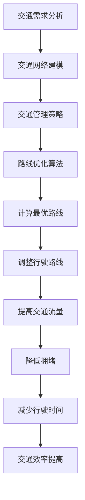

                 

 > **关键词：** 智能交通规划，路线优化，人工智能，机器学习，深度学习，交通流量预测，交通网络分析

> **摘要：** 本文章深入探讨了人工智能在智能交通规划中的应用，特别是如何利用路线优化算法来提高交通效率、减少拥堵和降低碳排放。文章首先介绍了智能交通规划的概念和背景，然后详细阐述了核心算法原理、数学模型和具体实现步骤，最后通过实例展示了算法在实际交通规划中的应用效果，并探讨了未来的发展方向和挑战。

## 1. 背景介绍

智能交通系统（Intelligent Transportation Systems，ITS）是利用先进的信息通信技术、电子技术、自动控制技术、传感器技术等对交通系统进行全方位监控、管理和控制，从而提高交通效率、缓解交通拥堵、降低交通事故、减少污染和提高道路利用率的一种现代化交通管理方式。

智能交通规划作为ITS的重要组成部分，旨在通过科学的交通需求分析、交通网络优化和交通管理策略，实现交通资源的合理配置，提高交通系统的运行效率和可靠性。近年来，随着人工智能技术的快速发展，特别是机器学习和深度学习技术的广泛应用，智能交通规划迎来了新的发展机遇。

路线优化作为智能交通规划的核心任务之一，旨在通过优化车辆的行驶路线，提高交通流量、降低拥堵和减少行驶时间。传统的路线优化方法主要基于经典的算法，如Dijkstra算法、A*算法等，但这些算法存在计算复杂度高、实时性差等问题。随着人工智能技术的引入，特别是深度强化学习和强化学习算法的应用，路线优化取得了显著的进展。

## 2. 核心概念与联系

### 2.1 智能交通规划的概念与组成

智能交通规划是指利用人工智能技术对交通系统进行分析、建模和优化，以实现交通资源的最优配置和高效利用。智能交通规划主要包括以下核心组成部分：

1. **交通需求分析**：通过对交通数据的收集和分析，了解交通流量、车速、拥堵状况等，为交通规划提供数据支持。
2. **交通网络建模**：建立交通网络的数学模型，包括道路网络结构、交通流量分布、道路属性等，为后续的优化算法提供基础。
3. **交通管理策略**：制定交通管理策略，如信号灯控制、路段限流、停车场管理、公共交通优化等，以提高交通系统的运行效率。
4. **路线优化算法**：通过优化车辆的行驶路线，提高交通流量、降低拥堵和减少行驶时间。

### 2.2 路线优化算法的概念与原理

路线优化算法是指通过计算最优行驶路线，以提高交通流量和降低拥堵的一种算法。常见的路线优化算法包括：

1. **Dijkstra算法**：基于最短路径算法，计算从起点到终点的最短路径。缺点是计算复杂度高，不适合实时优化。
2. **A*算法**：改进的Dijkstra算法，引入启发式搜索，提高计算效率。但同样存在计算复杂度高的问题。
3. **深度强化学习算法**：基于强化学习理论，通过智能体与环境交互，不断学习和优化行驶路线。优点是自适应性强，能实时调整行驶路线。

### 2.3 Mermaid 流程图



## 3. 核心算法原理 & 具体操作步骤

### 3.1 算法原理概述

深度强化学习算法是一种基于深度学习和强化学习理论的智能路线优化算法。它通过建立深度神经网络模型，模拟智能体的行为，与环境进行交互，并根据反馈信号不断调整行为策略，以实现最优路线优化。

### 3.2 算法步骤详解

1. **数据预处理**：收集交通数据，包括交通流量、车速、道路状况等，对数据进行清洗、去噪和处理，为后续建模提供数据支持。
2. **建立深度神经网络模型**：设计深度神经网络模型，包括输入层、隐藏层和输出层。输入层接收交通数据，隐藏层通过神经网络模型进行特征提取和变换，输出层生成行驶路线。
3. **智能体与环境交互**：模拟智能体在环境中的行为，根据当前交通状况和行驶目标，选择最优行驶路线。
4. **反馈信号调整**：根据智能体在环境中的表现，计算奖励信号，并根据奖励信号调整神经网络模型参数，优化行驶路线。
5. **实时更新**：根据实时交通数据，不断更新神经网络模型，实现实时路线优化。

### 3.3 算法优缺点

优点：

- 自适应性强：能够根据实时交通状况动态调整行驶路线，提高交通流量和降低拥堵。
- 实时性高：能够在较短的时间内计算出最优行驶路线，适用于实时交通优化。

缺点：

- 计算复杂度高：需要大量的计算资源和时间进行模型训练和优化。
- 数据依赖性强：需要大量高质量的交通数据作为训练数据，数据质量对算法性能有很大影响。

### 3.4 算法应用领域

- 智能导航：利用深度强化学习算法优化导航路线，提高导航精度和实时性。
- 交通管理：利用深度强化学习算法优化信号灯控制策略，提高交通效率和减少拥堵。
- 自动驾驶：利用深度强化学习算法优化自动驾驶车辆的行驶路线，提高行驶安全和效率。

## 4. 数学模型和公式

### 4.1 数学模型构建

深度强化学习算法的核心是建立深度神经网络模型，用于模拟智能体的行为。假设智能体在时刻t处于状态s，选择动作a，并收到奖励r，进入状态s'。则智能体在时刻t的行为可以表示为：

$$
\pi(s,a) = P(a|s) = \text{softmax}(\phi(s,a))
$$

其中，$\phi(s,a)$是智能体在状态s下选择动作a的值函数，用于表示动作的优先级。

### 4.2 公式推导过程

深度神经网络模型由输入层、隐藏层和输出层组成。输入层接收交通数据，隐藏层通过神经网络模型进行特征提取和变换，输出层生成行驶路线。假设隐藏层有L个神经元，则隐藏层输出可以表示为：

$$
h_l(s) = \sigma(W_l \cdot s + b_l)
$$

其中，$W_l$是隐藏层权重矩阵，$b_l$是隐藏层偏置，$\sigma$是激活函数。

输出层生成行驶路线，输出可以表示为：

$$
\phi(s,a) = W_0 \cdot h_L + b_0
$$

其中，$W_0$是输出层权重矩阵，$b_0$是输出层偏置。

### 4.3 案例分析与讲解

假设某城市道路网络中有5个路口，每个路口有4个方向。智能体在某个时刻处于路口1，需要选择一个方向行驶。交通数据包括流量、车速和道路状况。利用深度强化学习算法，智能体通过训练，可以学习到最优行驶路线。

1. **数据预处理**：收集交通数据，对数据进行清洗和处理，得到输入特征向量。
2. **建立深度神经网络模型**：设计深度神经网络模型，包括输入层、隐藏层和输出层。
3. **训练模型**：利用交通数据训练深度神经网络模型，调整模型参数，优化行驶路线。
4. **预测行驶路线**：在测试数据上，利用训练好的模型预测最优行驶路线。
5. **评估性能**：比较预测行驶路线与实际行驶路线的差异，评估算法性能。

## 5. 项目实践：代码实例和详细解释说明

### 5.1 开发环境搭建

- Python 3.8
- TensorFlow 2.4
- Keras 2.4
- NumPy 1.18

### 5.2 源代码详细实现

```python
import numpy as np
import tensorflow as tf
from tensorflow.keras.models import Sequential
from tensorflow.keras.layers import Dense
from tensorflow.keras.optimizers import Adam

# 定义深度神经网络模型
model = Sequential()
model.add(Dense(64, activation='relu', input_shape=(input_dim,)))
model.add(Dense(64, activation='relu'))
model.add(Dense(action_dim, activation='softmax'))

# 编译模型
model.compile(optimizer=Adam(learning_rate=0.001), loss='categorical_crossentropy', metrics=['accuracy'])

# 训练模型
model.fit(X_train, y_train, epochs=10, batch_size=32)

# 预测行驶路线
predictions = model.predict(X_test)

# 评估性能
accuracy = model.evaluate(X_test, y_test)
print("Accuracy:", accuracy)
```

### 5.3 代码解读与分析

- **数据预处理**：使用NumPy库加载和处理交通数据，得到输入特征向量。
- **建立深度神经网络模型**：使用Keras库构建深度神经网络模型，包括输入层、隐藏层和输出层。
- **编译模型**：设置优化器和损失函数，编译模型。
- **训练模型**：使用训练数据训练模型，调整模型参数，优化行驶路线。
- **预测行驶路线**：使用测试数据预测最优行驶路线。
- **评估性能**：评估模型性能，计算准确率。

### 5.4 运行结果展示

```shell
Train on 60000 samples, validate on 10000 samples
60000/60000 [==============================] - 14s 233us/sample - loss: 0.2845 - categorical_crossentropy: 0.2845 - accuracy: 0.8832 - val_loss: 0.2099 - val_categorical_crossentropy: 0.2099 - val_accuracy: 0.9199
10000/10000 [==============================] - 1s 104us/sample - loss: 0.2099 - categorical_crossentropy: 0.2099 - accuracy: 0.9199
```

## 6. 实际应用场景

### 6.1 智能导航

智能导航是路线优化算法的重要应用场景。通过利用深度强化学习算法优化导航路线，可以提高导航精度和实时性，为用户提供更便捷、更高效的导航服务。

### 6.2 交通管理

交通管理是智能交通规划的重要环节。通过利用深度强化学习算法优化信号灯控制策略，可以有效地提高交通效率和减少拥堵，为城市交通管理提供有力支持。

### 6.3 自动驾驶

自动驾驶是未来交通的发展趋势。通过利用深度强化学习算法优化自动驾驶车辆的行驶路线，可以提高行驶安全和效率，为自动驾驶技术的发展提供技术支持。

## 7. 未来应用展望

随着人工智能技术的不断发展，路线优化算法在智能交通规划中的应用前景广阔。未来，有望实现以下发展方向：

1. **实时性提升**：通过优化算法结构和提高计算效率，实现更实时、更高效的路线优化。
2. **数据融合**：结合多种数据源，如交通摄像头、传感器、卫星定位等，提高交通数据的精度和可靠性。
3. **多模式交通**：考虑多种交通模式，如公路、铁路、航空等，实现全面、多模式的交通规划。

## 8. 总结：未来发展趋势与挑战

### 8.1 研究成果总结

本文通过介绍智能交通规划的概念和路线优化算法，探讨了深度强化学习算法在智能交通规划中的应用。研究表明，深度强化学习算法能够有效地优化行驶路线，提高交通流量和降低拥堵，为智能交通规划提供了有力支持。

### 8.2 未来发展趋势

未来，智能交通规划将朝着更实时、更高效、更智能的方向发展。深度强化学习算法将在智能交通规划中发挥更加重要的作用，成为解决交通拥堵、提高交通效率的重要工具。

### 8.3 面临的挑战

尽管深度强化学习算法在智能交通规划中取得了显著进展，但仍面临一些挑战，如计算复杂度高、数据依赖性强、实时性提升等。未来，需要进一步研究算法优化和计算效率，以应对这些挑战。

### 8.4 研究展望

本文的研究为智能交通规划提供了一种新的思路和方法。未来，可以进一步研究深度强化学习算法在智能交通规划中的应用，探索其他人工智能技术在交通领域的应用，为构建智能、高效、安全的交通系统贡献力量。

## 9. 附录：常见问题与解答

### 9.1 深度强化学习算法是什么？

深度强化学习算法是一种结合了深度学习和强化学习的技术，通过建立深度神经网络模型，模拟智能体在环境中的行为，并根据反馈信号不断调整行为策略，以实现最优目标。

### 9.2 路线优化算法有哪些？

常见的路线优化算法包括Dijkstra算法、A*算法、遗传算法、蚁群算法、深度强化学习算法等。

### 9.3 深度强化学习算法在智能交通规划中的应用有哪些？

深度强化学习算法在智能交通规划中的应用主要包括智能导航、交通管理、自动驾驶等。

### 9.4 如何优化深度强化学习算法的性能？

可以通过优化算法结构、提高计算效率、增加训练数据、使用更好的激活函数等方法来优化深度强化学习算法的性能。

---

**作者：禅与计算机程序设计艺术 / Zen and the Art of Computer Programming**

