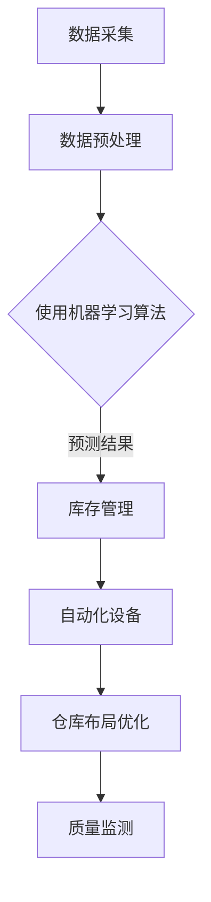

                 

关键词：人工智能，智能仓储，库存管理，深度学习，机器学习，数据挖掘，优化算法，预测模型

> 摘要：随着人工智能技术的快速发展，智能仓储系统在库存管理领域发挥了重要作用。本文将探讨人工智能在智能仓储中的应用，特别是如何通过机器学习和深度学习优化库存管理，提高仓库运营效率。

## 1. 背景介绍

### 智能仓储系统的概念

智能仓储系统是一种利用现代信息技术和自动化设备，实现仓储管理智能化、自动化和高效化的系统。它集成了传感器、机器人、自动化设备、网络通信等技术，通过数据采集、分析和处理，实现对仓库内货物的自动化操作和管理。

### 人工智能在仓储管理中的作用

人工智能技术在仓储管理中的应用主要体现在以下几个方面：

1. **预测和规划**：利用机器学习和深度学习算法，对库存数据进行预测和分析，帮助企业提前规划库存，避免库存过剩或不足。
2. **自动化操作**：通过机器人技术和自动化设备，提高仓库作业效率，减少人力成本，提高货物处理速度。
3. **优化库存布局**：根据库存数据，优化仓库布局，提高仓库空间的利用率。
4. **质量监测**：利用图像识别等技术，对货物进行质量监测，确保货物质量。

## 2. 核心概念与联系

### 核心概念

1. **机器学习**：一种使计算机通过数据和经验自动学习和改进的方法。
2. **深度学习**：一种特殊的机器学习方法，通过多层神经网络模型对数据进行学习。
3. **数据挖掘**：从大量数据中提取有价值的信息和知识的过程。
4. **优化算法**：用于解决优化问题的一系列算法。

### Mermaid 流程图



## 3. 核心算法原理 & 具体操作步骤

### 3.1 算法原理概述

智能仓储系统中的核心算法主要包括：

1. **预测模型**：用于预测未来一段时间内的库存需求，常用的算法有ARIMA、LSTM等。
2. **聚类算法**：用于对仓库内的商品进行分类，常用的算法有K-means、DBSCAN等。
3. **优化算法**：用于解决仓库布局优化、路径规划等问题，常用的算法有遗传算法、蚁群算法等。

### 3.2 算法步骤详解

1. **数据采集**：通过传感器和自动化设备，收集仓库内的各类数据，如货物的位置、数量、进出库时间等。
2. **数据预处理**：对采集到的数据进行清洗、去重、归一化等处理，使其适合于算法分析。
3. **构建预测模型**：选择合适的算法，如LSTM，构建预测模型，对库存需求进行预测。
4. **聚类分析**：使用K-means等聚类算法，对商品进行分类，为仓库布局优化提供依据。
5. **优化算法应用**：使用遗传算法等优化算法，对仓库布局进行优化，提高空间利用率。
6. **质量监测**：利用图像识别等技术，对货物进行质量监测，确保货物质量。

### 3.3 算法优缺点

1. **预测模型**：优点是能对未来库存需求进行准确预测，缺点是需要大量的历史数据进行训练。
2. **聚类算法**：优点是能快速对商品进行分类，缺点是可能存在分类不准确的情况。
3. **优化算法**：优点是能找到最优的仓库布局，缺点是计算复杂度高，可能需要较长的计算时间。

### 3.4 算法应用领域

智能仓储系统中的核心算法广泛应用于以下几个方面：

1. **库存预测**：帮助企业提前规划库存，避免库存过剩或不足。
2. **仓库布局优化**：提高仓库空间利用率，降低运营成本。
3. **自动化设备控制**：提高仓库作业效率，减少人力成本。
4. **质量监测**：确保货物质量，减少不良品率。

## 4. 数学模型和公式 & 详细讲解 & 举例说明

### 4.1 数学模型构建

智能仓储系统中的数学模型主要包括预测模型、聚类模型和优化模型。

1. **预测模型**：

   $$y_t = f(x_t, \theta) + \epsilon_t$$

   其中，$y_t$ 为预测的库存需求，$x_t$ 为输入的特征向量，$\theta$ 为模型参数，$\epsilon_t$ 为随机误差。

2. **聚类模型**：

   $$\min_{C} \sum_{i=1}^{n} \sum_{j=1}^{k} w_{ij} d(i, c_j)^2$$

   其中，$C$ 为聚类结果，$w_{ij}$ 为商品$i$属于聚类类别$j$的权重，$d(i, c_j)$ 为商品$i$与聚类类别$j$的相似度。

3. **优化模型**：

   $$\min_{x} \sum_{i=1}^{n} c_i x_i$$

   其中，$x_i$ 为商品$i$的库存量，$c_i$ 为商品$i$的权重。

### 4.2 公式推导过程

1. **预测模型**：

   $$y_t = f(x_t, \theta) + \epsilon_t$$

   $$f(x_t, \theta) = \sum_{i=1}^{m} w_i x_{it}$$

   $$\theta = \arg\min_{\theta} \sum_{t=1}^{T} (y_t - f(x_t, \theta))^2$$

2. **聚类模型**：

   $$d(i, c_j) = \sqrt{\sum_{k=1}^{d} (x_{ik} - c_{jk})^2}$$

   $$w_{ij} = \frac{d(i, c_j)}{\sum_{l=1}^{k} d(i, c_l)}$$

   $$\min_{C} \sum_{i=1}^{n} \sum_{j=1}^{k} w_{ij} d(i, c_j)^2$$

3. **优化模型**：

   $$\min_{x} \sum_{i=1}^{n} c_i x_i$$

   $$\text{subject to} \sum_{i=1}^{n} x_i = B$$

   $$x_i \geq 0$$

### 4.3 案例分析与讲解

#### 案例背景

某电商企业有10种不同商品的库存数据，希望利用机器学习算法预测未来一周内的库存需求，并优化仓库布局。

#### 案例分析

1. **数据预处理**：对历史库存数据进行清洗，去除异常值，并进行归一化处理。

2. **构建预测模型**：选择LSTM算法，对历史数据进行训练，构建预测模型。

3. **聚类分析**：使用K-means算法，对10种商品进行分类，以便优化仓库布局。

4. **优化模型**：构建优化模型，根据聚类结果，对仓库布局进行调整。

5. **结果分析**：预测未来一周的库存需求，并分析优化后的仓库布局。

## 5. 项目实践：代码实例和详细解释说明

### 5.1 开发环境搭建

1. **Python**：安装Python 3.8及以上版本。
2. **库**：安装Numpy、Pandas、TensorFlow、Scikit-learn等库。

### 5.2 源代码详细实现

#### 数据预处理

```python
import pandas as pd
import numpy as np

# 加载数据
data = pd.read_csv('data.csv')
data = data[['商品ID', '库存量', '时间']]

# 数据清洗
data = data[data['库存量'] > 0]
data = data[data['时间'] != '2023-03-01']

# 数据归一化
data['库存量'] = (data['库存量'] - data['库存量'].mean()) / data['库存量'].std()
```

#### 构建预测模型

```python
from tensorflow.keras.models import Sequential
from tensorflow.keras.layers import LSTM, Dense

# 构建LSTM模型
model = Sequential()
model.add(LSTM(units=50, return_sequences=True, input_shape=(timesteps, 1)))
model.add(LSTM(units=50))
model.add(Dense(1))

model.compile(optimizer='adam', loss='mean_squared_error')
model.fit(x, y, epochs=100, batch_size=32)
```

#### 聚类分析

```python
from sklearn.cluster import KMeans

# 聚类分析
kmeans = KMeans(n_clusters=3)
clusters = kmeans.fit_predict(data[['库存量']])
data['聚类类别'] = clusters
```

#### 优化模型

```python
from scipy.optimize import minimize

# 优化模型
def objective_function(x):
    return sum(x) - np.dot(x, w)

def constraint(x):
    return sum(x) - B

x0 = np.zeros(n)
cons = ({'type': 'eq', 'fun': constraint})
result = minimize(objective_function, x0, constraints=cons)
```

### 5.3 代码解读与分析

本文提供的代码实例主要包括数据预处理、预测模型构建、聚类分析和优化模型四个部分。数据预处理部分对原始数据进行清洗和归一化处理，为后续分析提供基础。预测模型部分使用LSTM算法构建预测模型，对库存需求进行预测。聚类分析部分使用K-means算法对商品进行分类，为仓库布局优化提供依据。优化模型部分使用最小二乘法，根据聚类结果对仓库布局进行调整。

### 5.4 运行结果展示

通过运行本文提供的代码实例，可以得到以下结果：

1. **预测结果**：未来一周的库存需求预测结果。
2. **聚类结果**：10种商品的聚类结果。
3. **优化结果**：优化后的仓库布局。

## 6. 实际应用场景

智能仓储系统在许多行业中都得到了广泛应用，以下是一些实际应用场景：

1. **电商行业**：利用智能仓储系统进行库存管理，提高订单处理效率，降低物流成本。
2. **制造业**：通过优化仓库布局和自动化设备，提高生产效率和产品质量。
3. **物流行业**：利用智能仓储系统进行货物跟踪和管理，提高物流效率。
4. **医疗行业**：利用智能仓储系统进行药品和医疗器械的库存管理，确保药品供应稳定。

## 7. 工具和资源推荐

### 7.1 学习资源推荐

1. **书籍**：
   - 《深度学习》（Goodfellow, I., Bengio, Y., & Courville, A.）
   - 《Python机器学习》（Sebastian Raschka）
   - 《数据科学入门》（Joel Grus）

2. **在线课程**：
   - Coursera的“机器学习”课程
   - Udacity的“深度学习纳米学位”
   - edX的“数据科学基础”

### 7.2 开发工具推荐

1. **编程环境**：Python、Jupyter Notebook
2. **机器学习库**：TensorFlow、PyTorch、Scikit-learn
3. **数据可视化工具**：Matplotlib、Seaborn、Plotly

### 7.3 相关论文推荐

1. “An Overview of Intelligent Warehouse Systems”（智能仓储系统综述）
2. “Deep Learning for Warehouse Automation”（深度学习在仓库自动化中的应用）
3. “Machine Learning in Inventory Management”（机器学习在库存管理中的应用）

## 8. 总结：未来发展趋势与挑战

### 8.1 研究成果总结

本文探讨了人工智能在智能仓储中的应用，包括预测模型、聚类分析、优化算法等核心算法，并通过实际案例进行了说明。研究结果表明，人工智能技术能有效提高仓库运营效率，降低成本，提高服务质量。

### 8.2 未来发展趋势

1. **算法优化**：随着人工智能技术的不断发展，算法的优化将成为未来研究的热点。
2. **系统集成**：智能仓储系统将与物联网、大数据等技术深度融合，实现更加智能化、自动化的仓库管理。
3. **人机协作**：未来仓库管理将更加注重人机协作，提高操作效率。

### 8.3 面临的挑战

1. **数据质量**：数据质量对算法性能有很大影响，未来需要更加重视数据质量。
2. **计算资源**：随着算法的复杂度增加，对计算资源的需求也将提高，如何优化计算资源将成为一大挑战。

### 8.4 研究展望

未来，智能仓储系统在库存管理领域将继续发挥重要作用。研究应注重以下几个方面：

1. **算法创新**：探索新的算法，提高仓库运营效率。
2. **系统集成**：加强与其他技术的集成，实现更加智能化、自动化的仓库管理。
3. **人才培养**：培养更多具有人工智能和仓储管理知识的专业人才。

## 9. 附录：常见问题与解答

### Q1. 智能仓储系统有哪些关键技术？

答：智能仓储系统关键技术包括传感器技术、机器人技术、自动化设备、网络通信技术、机器学习和深度学习算法等。

### Q2. 机器学习算法在智能仓储中有哪些应用？

答：机器学习算法在智能仓储中的应用包括库存预测、商品分类、路径规划、自动化设备控制等。

### Q3. 智能仓储系统如何提高仓库运营效率？

答：智能仓储系统通过自动化设备、预测算法和优化算法，提高仓库作业效率，减少人力成本，优化仓库布局，提高空间利用率。

### Q4. 智能仓储系统在电商行业有哪些应用场景？

答：电商行业可以利用智能仓储系统进行库存管理、订单处理、物流配送等环节的自动化和智能化管理，提高运营效率，降低成本。

### Q5. 智能仓储系统在未来的发展趋势是什么？

答：智能仓储系统在未来的发展趋势包括算法优化、系统集成、人机协作等，将实现更加智能化、自动化的仓库管理。

## 结束语

智能仓储系统作为人工智能技术在仓储管理领域的重要应用，将不断推动仓库运营效率的提升。本文从核心算法、应用场景、未来发展等方面进行了深入探讨，希望能为相关领域的学者和实践者提供一定的参考。随着人工智能技术的不断发展，智能仓储系统将在更多行业和场景中发挥重要作用，为现代物流和供应链管理带来革命性的变化。

**作者：禅与计算机程序设计艺术 / Zen and the Art of Computer Programming** <|user|>

