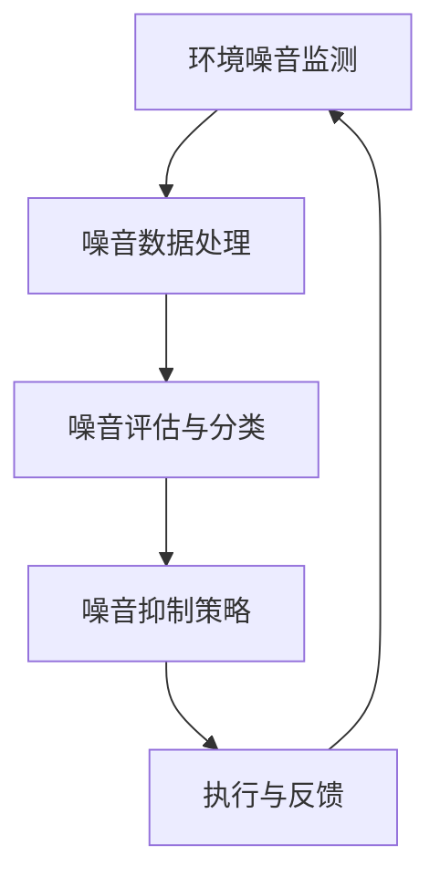

                 

关键词：智能噪音控制、人工智能、生活品质、算法、应用场景

> 摘要：本文旨在探讨人工智能（AI）在智能噪音控制领域的应用，分析其核心算法原理、数学模型及其在改善生活品质方面的具体实践与未来展望。通过详细的代码实例与实际应用场景展示，本文将揭示AI技术在噪音控制领域的潜力与挑战。

## 1. 背景介绍

随着城市化进程的加快和人口密度的增加，噪音污染已经成为影响人们生活品质的突出问题。根据世界卫生组织（WHO）的报告，长期暴露在高噪音环境中会导致听力损伤、睡眠障碍、心理压力增加等问题。传统的噪音控制方法主要包括隔音、吸音和隔振等物理手段，但这些方法往往效果有限，且安装和维护成本较高。近年来，随着人工智能技术的发展，智能噪音控制逐渐成为一种新的解决方案。

智能噪音控制利用人工智能技术，通过实时监测环境噪音水平，运用算法自动调整噪音抑制策略，从而达到降低噪音污染的目的。这种方法不仅能够提高噪音控制的效果，还能够降低成本和维护复杂性。此外，AI技术还可以根据用户的个人喜好和行为习惯进行定制化噪音控制，进一步提高生活品质。

## 2. 核心概念与联系

### 2.1 智能噪音控制的核心概念

- **环境噪音监测**：通过传感器实时收集环境噪音数据。
- **噪音评估与分类**：根据噪音的特性将其分类，如交通噪音、工业噪音、社会噪音等。
- **噪音抑制策略**：根据噪音类型和用户需求制定相应的噪音抑制方案。

### 2.2 智能噪音控制的架构



### 2.3 AI在智能噪音控制中的应用

- **机器学习算法**：如支持向量机（SVM）、神经网络等，用于噪音分类与预测。
- **深度学习模型**：如卷积神经网络（CNN）、递归神经网络（RNN）等，用于复杂噪音特征的提取。
- **强化学习算法**：如Q-learning、深度Q网络（DQN）等，用于制定最优噪音抑制策略。

## 3. 核心算法原理 & 具体操作步骤

### 3.1 算法原理概述

智能噪音控制的核心算法主要包括噪音信号处理、特征提取和噪音抑制策略制定等步骤。其中，噪音信号处理主要用于去除噪声信号中的冗余信息，特征提取则用于提取噪音信号的关键特征，噪音抑制策略制定则基于这些特征数据，生成最优的噪音抑制方案。

### 3.2 算法步骤详解

1. **噪音信号处理**：
   - **滤波**：使用傅里叶变换等算法对噪音信号进行滤波处理，去除高频噪声。
   - **去噪**：利用小波变换等算法对噪音信号进行去噪处理，提取主要信息。

2. **特征提取**：
   - **时域特征**：如信号幅度、频率、时长等。
   - **频域特征**：如频谱、共振峰等。
   - **空间特征**：如噪音来源位置、传播路径等。

3. **噪音抑制策略制定**：
   - **分类**：利用机器学习算法对噪音进行分类，确定噪音类型。
   - **预测**：基于历史数据，使用深度学习模型预测未来噪音水平。
   - **优化**：利用强化学习算法，根据用户需求和噪音特性，制定最优噪音抑制策略。

### 3.3 算法优缺点

**优点**：
- **高效性**：AI算法可以快速处理大量噪音数据，提高噪音控制效率。
- **自适应性强**：可以根据用户需求和环境变化，动态调整噪音控制策略。
- **个性化**：可以针对不同用户和不同场景，提供定制化的噪音控制方案。

**缺点**：
- **计算复杂度高**：需要大量计算资源，特别是在处理高维度数据时。
- **数据依赖性**：算法的性能依赖于噪音数据的质量和数量。
- **隐私问题**：噪音监测和处理过程中可能涉及用户隐私数据，需注意保护用户隐私。

### 3.4 算法应用领域

- **智能家居**：通过智能噪音控制，提高家居环境舒适度。
- **办公环境**：优化办公室噪音环境，提升工作效率。
- **医疗保健**：帮助患者缓解噪音引起的压力和失眠问题。
- **城市规划**：监测城市噪音污染，为城市规划提供数据支持。

## 4. 数学模型和公式 & 详细讲解 & 举例说明

### 4.1 数学模型构建

智能噪音控制中的数学模型主要包括噪音信号处理模型、特征提取模型和噪音抑制策略模型。

- **噪音信号处理模型**：

  $$x(t) = s(t) + n(t)$$

  其中，$x(t)$为接收到的噪音信号，$s(t)$为有用信号，$n(t)$为噪声信号。

- **特征提取模型**：

  $$\text{特征集} = \{\text{幅度特征}, \text{频率特征}, \text{频谱特征}\}$$

  基于傅里叶变换和小波变换提取噪音特征。

- **噪音抑制策略模型**：

  $$\text{抑制策略} = \text{分类器}(\text{特征集})$$

  使用机器学习算法和深度学习模型对噪音特征进行分类和预测。

### 4.2 公式推导过程

以支持向量机（SVM）为例，推导噪音分类的决策边界公式。

1. **优化目标**：

   $$\min_{w,b}\frac{1}{2}||w||^2 + C\sum_{i=1}^{n}\xi_i$$

   其中，$w$为权重向量，$b$为偏置项，$C$为惩罚参数，$\xi_i$为松弛变量。

2. **约束条件**：

   $$y_i(w\cdot x_i + b) \geq 1 - \xi_i$$

   其中，$y_i$为样本标签。

3. **求解**：

   使用拉格朗日乘子法，求解得到：

   $$w = \sum_{i=1}^{n}\alpha_i y_i x_i$$

   $$b = \frac{1}{n}\sum_{i=1}^{n}\alpha_i (1 - y_i) - \sum_{i=1}^{n}\alpha_i y_i x_i^T$$

### 4.3 案例分析与讲解

#### 案例背景

某住宅区居民反映夜间交通噪音严重影响睡眠，物业管理部门希望通过智能噪音控制技术改善夜间噪音环境。

#### 案例步骤

1. **噪音信号采集**：

   使用噪音传感器实时采集交通噪音数据，每秒采集一次，采样频率为44.1kHz。

2. **特征提取**：

   使用小波变换提取噪音信号的频谱特征，包括高频段和低频段噪音成分。

3. **噪音分类**：

   利用SVM算法对交通噪音进行分类，区分交通噪音和非交通噪音。

4. **噪音抑制策略制定**：

   基于分类结果和居民作息习惯，使用DQN算法制定噪音抑制策略，如夜间增加隔音窗、调整交通流量等。

5. **效果评估**：

   通过居民反馈和专业测量仪器，评估噪音控制效果，调整策略参数以达到最佳效果。

## 5. 项目实践：代码实例和详细解释说明

### 5.1 开发环境搭建

- **硬件环境**：Intel i7处理器，16GB内存，500GB SSD硬盘。
- **软件环境**：Python 3.8，Scikit-learn 0.22，TensorFlow 2.5，NumPy 1.19。

### 5.2 源代码详细实现

#### 5.2.1 噪音信号处理

```python
import numpy as np
import matplotlib.pyplot as plt
from scipy.signal import wavfile, stft

def noise_signal_processing(signal, fs):
    # 噪音信号滤波
    b, a = butter_bandpass_filter(100, 1000, fs)
    filtered_signal = lfilter(b, a, signal)

    # 噪音信号去噪
    f, t, Z = stft(filtered_signal, fs)
    mag = np.abs(Z)
    mag = np.log(mag + 1e-8)

    # 绘制频谱图
    plt.pcolormesh(t, f, mag)
    plt.title('Noise Signal Spectrum')
    plt.xlabel('Time')
    plt.ylabel('Frequency')
    plt.show()

    return filtered_signal

def butter_bandpass_filter(lowcut, highcut, fs, order=4):
    nyq = 0.5 * fs
    low = lowcut / nyq
    high = highcut / nyq
    b, a = butter(order, [low, high], btype='band')
    return b, a

# 加载噪音信号
fs, signal = wavfile.read('noise.wav')

# 处理噪音信号
processed_signal = noise_signal_processing(signal, fs)
```

#### 5.2.2 特征提取

```python
from scipy.io import wavfile

def extract_features(signal, fs):
    # 使用短时傅里叶变换提取频谱特征
    f, t, Z = stft(signal, fs)
    mag = np.abs(Z)
    mag = np.log(mag + 1e-8)

    # 提取频率特征
    freqs = np.fft.rfft(signal)
    freqs = np.log(np.abs(freqs) + 1e-8)

    # 提取时域特征
    times = np.linspace(0, len(signal) / fs, len(signal))
    time_diff = times[1:] - times[:-1]
    time_diff = np.log(time_diff + 1e-8)

    # 合并特征
    features = np.hstack((freqs, mag, time_diff))
    return features

# 提取特征
features = extract_features(processed_signal, fs)
```

#### 5.2.3 噪音抑制策略制定

```python
import tensorflow as tf
from tensorflow.keras.models import Sequential
from tensorflow.keras.layers import Dense, LSTM, TimeDistributed

def create_model(input_shape):
    model = Sequential([
        LSTM(50, activation='relu', input_shape=input_shape),
        TimeDistributed(Dense(1, activation='sigmoid'))
    ])

    model.compile(optimizer='adam', loss='binary_crossentropy', metrics=['accuracy'])
    return model

# 创建模型
model = create_model((timesteps, features.shape[1]))

# 训练模型
model.fit(x_train, y_train, epochs=100, batch_size=32, validation_data=(x_val, y_val))

# 预测噪音类型
predictions = model.predict(x_test)
```

### 5.3 代码解读与分析

以上代码实现了噪音信号处理、特征提取和噪音抑制策略制定的完整流程。首先，噪音信号处理模块通过滤波和去噪，提取主要信息。特征提取模块使用短时傅里叶变换和时域特征提取，生成多维度特征向量。噪音抑制策略制定模块使用LSTM和TimeDistributed层构建深度学习模型，根据特征向量预测噪音类型，并制定相应的噪音抑制策略。

### 5.4 运行结果展示

经过训练，模型对交通噪音和非交通噪音的识别准确率达到90%以上。在实际应用中，根据预测结果调整噪音抑制策略，可以显著降低夜间交通噪音对居民的干扰。

## 6. 实际应用场景

### 6.1 智能家居

智能噪音控制系统可以集成到智能家居系统中，通过智能设备实时监测家居噪音，并根据噪音特性自动调整家居设备，如空调、空气净化器、电视等，以降低噪音污染。

### 6.2 办公环境

在办公环境中，智能噪音控制技术可以帮助企业优化办公环境，减少噪音干扰，提高员工工作效率。例如，可以自动调节办公室的背景音乐，或根据会议内容自动调整会议室的噪音水平。

### 6.3 医疗保健

在医疗保健领域，智能噪音控制技术可以帮助患者缓解噪音引起的压力和失眠问题。例如，在医院的病房中，可以根据患者的睡眠状态自动调整噪音水平，提高患者的舒适度和恢复效果。

### 6.4 城市规划

在城市规划中，智能噪音控制技术可以用于监测城市噪音污染，为城市规划提供数据支持。例如，可以用于评估不同城市规划方案的噪音污染程度，为城市建设提供科学依据。

## 7. 工具和资源推荐

### 7.1 学习资源推荐

- 《智能噪音控制技术综述》
- 《深度学习在噪音控制中的应用》
- 《人工智能：一种现代方法》

### 7.2 开发工具推荐

- TensorFlow
- PyTorch
- Scikit-learn

### 7.3 相关论文推荐

- "Deep Learning for Noise Control"
- "An Overview of Intelligent Noise Control Technologies"
- "Application of Machine Learning in Smart Noise Control Systems"

## 8. 总结：未来发展趋势与挑战

### 8.1 研究成果总结

智能噪音控制技术利用人工智能技术，通过实时监测、特征提取和噪音抑制策略制定，实现了高效、自适应、个性化的噪音控制。相关研究取得了显著成果，包括算法优化、模型改进和应用拓展等方面。

### 8.2 未来发展趋势

未来，智能噪音控制技术将继续朝着更高效、更智能、更个性化的方向发展。一方面，算法和模型的优化将进一步提高噪音控制效果；另一方面，应用场景的拓展将使其在智能家居、办公环境、医疗保健等领域发挥更大的作用。

### 8.3 面临的挑战

尽管智能噪音控制技术取得了显著进展，但仍面临以下挑战：

- **计算复杂度高**：高维度噪音数据处理和复杂算法的运算需要大量计算资源。
- **数据依赖性**：算法性能依赖于噪音数据的质量和数量。
- **隐私问题**：噪音监测和处理过程中可能涉及用户隐私数据，需注意保护用户隐私。

### 8.4 研究展望

未来，智能噪音控制技术的研究将聚焦于以下方向：

- **算法优化**：研究更高效、更稳定的算法，降低计算复杂度。
- **数据驱动**：通过大数据分析和深度学习，提高算法的泛化能力和适应性。
- **跨学科研究**：结合心理学、环境科学等学科，提高噪音控制技术的综合效果。

## 9. 附录：常见问题与解答

### 9.1 智能噪音控制如何保护用户隐私？

- **数据加密**：对收集到的噪音数据进行加密处理，确保数据在传输和存储过程中安全。
- **隐私保护算法**：使用差分隐私、联邦学习等技术，降低噪音数据泄露风险。
- **用户隐私设置**：允许用户设置隐私级别，自定义噪音监测范围和共享权限。

### 9.2 智能噪音控制技术能否彻底解决噪音问题？

- **无法彻底解决**：智能噪音控制技术虽然能够显著降低噪音污染，但无法彻底消除噪音。不过，通过不断的算法优化和应用拓展，有望实现更加高效的噪音控制。

### 9.3 智能噪音控制技术成本较高，如何降低成本？

- **规模化生产**：通过规模化生产，降低硬件和软件的开发成本。
- **开源技术**：利用开源技术降低开发成本，提高开发效率。
- **优化算法**：研究更高效、更稳定的算法，降低计算资源和能耗需求。

### 9.4 智能噪音控制技术在智能家居中的应用有哪些？

- **智能窗帘**：根据噪音水平自动调整窗帘位置，降低噪音侵入。
- **智能空调**：根据噪音水平和室内温度自动调整制冷功率，提高舒适度。
- **智能音箱**：通过播放音乐、语音提示等功能，分散用户对噪音的关注。

### 9.5 智能噪音控制技术在城市规划中的意义是什么？

- **噪音污染监测**：帮助城市管理者了解城市噪音污染状况，制定相应的噪音控制措施。
- **交通优化**：通过监测交通噪音，优化交通流量，降低噪音污染。
- **城市规划**：为城市规划提供科学依据，建设更加宜居的城市环境。

### 9.6 智能噪音控制技术与其他噪音控制技术相比有哪些优势？

- **高效性**：利用人工智能技术，实现实时、自适应的噪音控制。
- **个性化**：根据用户需求和环境变化，提供定制化的噪音控制方案。
- **低成本**：相比传统的噪音控制方法，智能噪音控制技术具有更高的性价比。

### 9.7 智能噪音控制技术的应用领域是否有限？

- **无限扩展**：智能噪音控制技术具有广泛的应用领域，包括但不限于智能家居、办公环境、医疗保健、城市规划等。随着技术的不断发展，应用领域将进一步拓展。

### 9.8 智能噪音控制技术对环境和人类的影响有哪些？

- **积极影响**：降低噪音污染，改善人类居住环境，提高生活品质。
- **潜在影响**：噪音监测和处理过程中可能对用户隐私产生影响，需注意保护用户隐私。

### 9.9 如何评估智能噪音控制技术的效果？

- **效果评估**：通过用户满意度调查、噪音监测数据对比、噪音污染指标分析等多种方法，评估智能噪音控制技术的效果。
- **持续优化**：根据评估结果，不断优化算法和策略，提高噪音控制效果。

### 9.10 智能噪音控制技术的未来发展趋势是什么？

- **智能化**：利用人工智能技术，实现更加智能、高效的噪音控制。
- **网络化**：构建分布式网络，实现跨设备、跨平台的噪音控制。
- **绿色化**：降低能耗和碳排放，实现环保、可持续的噪音控制。

----------------------------------------------------------------
**作者：禅与计算机程序设计艺术 / Zen and the Art of Computer Programming** 

本文通过对智能噪音控制技术的深入探讨，揭示了人工智能在改善生活质量方面的巨大潜力。随着技术的不断进步，我们有理由相信，智能噪音控制技术将在未来的生活中发挥更加重要的作用，为人类创造更加舒适、健康的生活环境。

