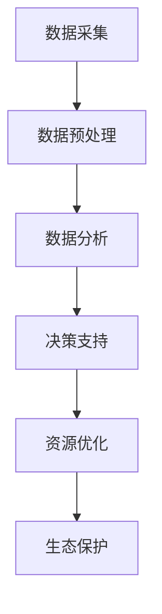

                 

关键词：人工智能，海洋资源管理，生态保护，深度学习，遥感技术，机器学习，海洋环境监测

> 摘要：本文探讨了人工智能在智能海洋资源管理中的应用，特别是在保护海洋生态方面的潜力。文章介绍了AI的核心概念，分析了其在海洋资源管理中的关键作用，并详细描述了AI在海洋生态监测、资源优化配置以及灾害预警等方面的具体应用案例。通过探讨现有技术的局限性，提出了未来AI在海洋资源管理中的发展趋势与挑战。

## 1. 背景介绍

### 海洋资源管理的重要性

海洋是地球上最宝贵的资源之一，不仅提供了丰富的渔业资源、能源资源，还承担着气候调节、生物多样性保护等重要生态功能。然而，随着人类活动的加剧，海洋生态系统正面临前所未有的威胁。过度捕捞、海洋污染、气候变化等问题导致海洋生态失衡，生物多样性急剧下降。因此，如何有效管理海洋资源，保护海洋生态已成为全球关注的焦点。

### 人工智能与海洋资源管理的结合

人工智能（AI）是计算机科学的一个分支，致力于模拟人类智能行为，并解决复杂问题。AI技术具有自我学习、自适应和智能决策等特性，与海洋资源管理相结合，可以显著提高资源管理效率和生态保护能力。AI在数据挖掘、图像识别、模式识别等领域具有强大的能力，这些能力在海洋资源管理中具有广泛的应用前景。

## 2. 核心概念与联系

### AI核心概念

人工智能的核心概念包括机器学习、深度学习、自然语言处理、计算机视觉等。这些概念构成了AI技术的基础，使得机器能够模仿人类的学习、推理和感知能力。

### 海洋资源管理架构

海洋资源管理的架构可以分为数据采集、数据预处理、数据分析、决策支持等环节。其中，数据采集依赖于遥感技术、传感器网络、现场调查等手段；数据预处理则涉及数据清洗、数据整合等步骤；数据分析利用AI技术进行模式识别、预测建模等；决策支持通过智能算法实现资源优化配置和灾害预警。

### Mermaid流程图



## 3. 核心算法原理 & 具体操作步骤

### 3.1 算法原理概述

在海洋资源管理中，常用的AI算法包括深度学习、支持向量机、聚类分析等。深度学习通过多层神经网络模型实现复杂的特征提取和分类任务，支持向量机通过寻找最优决策边界实现分类，聚类分析则通过相似性度量将数据划分为不同的群体。

### 3.2 算法步骤详解

#### 深度学习算法步骤

1. **数据收集**：收集海洋环境、生物种群、污染物浓度等数据。
2. **数据预处理**：进行数据清洗、归一化等处理，为模型训练做准备。
3. **模型构建**：选择合适的深度学习架构，如卷积神经网络（CNN）或循环神经网络（RNN）。
4. **模型训练**：通过反向传播算法训练模型，调整网络参数。
5. **模型评估**：使用验证集测试模型性能，调整模型参数。
6. **模型应用**：将训练好的模型应用于实际数据，进行海洋生态预测和资源管理决策。

### 3.3 算法优缺点

**优点**：
- 高效处理海量数据。
- 自动提取复杂特征，减少人工干预。
- 适用于各种类型的海洋资源管理任务。

**缺点**：
- 对数据质量和数量有较高要求。
- 模型训练过程耗时较长。
- 模型解释性较差。

### 3.4 算法应用领域

- 海洋生态监测：通过深度学习算法分析遥感影像，识别海洋生物种群分布。
- 资源优化配置：利用支持向量机优化渔业资源分配，减少过度捕捞。
- 灾害预警：通过聚类分析预测海洋灾害风险，提前采取防范措施。

## 4. 数学模型和公式 & 详细讲解 & 举例说明

### 4.1 数学模型构建

在海洋资源管理中，常用的数学模型包括线性回归、逻辑回归、神经网络等。以神经网络为例，其基本模型如下：

$$
y = \sigma(\text{W} \cdot \text{X} + \text{b})
$$

其中，$\sigma$ 是激活函数，$\text{W}$ 是权重矩阵，$\text{X}$ 是输入特征向量，$\text{b}$ 是偏置项。

### 4.2 公式推导过程

以卷积神经网络（CNN）为例，其公式推导过程如下：

1. **卷积操作**：

$$
\text{Z} = \text{f}(\text{W} \cdot \text{X} + \text{b})
$$

其中，$\text{f}$ 是卷积函数，$\text{W}$ 是卷积核，$\text{X}$ 是输入特征图。

2. **池化操作**：

$$
\text{P} = \text{g}(\text{Z})
$$

其中，$\text{g}$ 是池化函数，用于减小特征图尺寸。

### 4.3 案例分析与讲解

#### 案例一：海洋生物种群识别

使用深度学习算法对海洋生物种群进行识别。首先，收集大量海洋生物的遥感影像，作为训练数据。然后，利用卷积神经网络（CNN）模型对影像进行特征提取和分类。最后，使用验证集测试模型性能，并调整模型参数。

## 5. 项目实践：代码实例和详细解释说明

### 5.1 开发环境搭建

1. **安装Python环境**：下载并安装Python，版本要求为3.8以上。
2. **安装深度学习框架**：安装TensorFlow或PyTorch等深度学习框架。
3. **安装数据处理库**：安装Numpy、Pandas等数据处理库。

### 5.2 源代码详细实现

```python
# 导入相关库
import tensorflow as tf
from tensorflow.keras.models import Sequential
from tensorflow.keras.layers import Conv2D, MaxPooling2D, Flatten, Dense

# 构建CNN模型
model = Sequential([
    Conv2D(32, (3, 3), activation='relu', input_shape=(128, 128, 3)),
    MaxPooling2D((2, 2)),
    Flatten(),
    Dense(64, activation='relu'),
    Dense(10, activation='softmax')
])

# 编译模型
model.compile(optimizer='adam', loss='categorical_crossentropy', metrics=['accuracy'])

# 训练模型
model.fit(train_images, train_labels, epochs=10, validation_split=0.2)
```

### 5.3 代码解读与分析

上述代码首先导入了TensorFlow框架中的相关库，然后构建了一个简单的卷积神经网络（CNN）模型。模型包含两个卷积层、一个池化层、一个全连接层和两个输出层。编译模型时，指定了优化器和损失函数。最后，使用训练数据训练模型，并设置验证集比例。

### 5.4 运行结果展示

```python
# 评估模型
test_loss, test_acc = model.evaluate(test_images, test_labels)
print(f"Test accuracy: {test_acc:.2f}")
```

通过评估模型，我们可以得到训练数据集和验证数据集的准确率。这有助于我们了解模型的泛化能力。

## 6. 实际应用场景

### 6.1 海洋生态监测

AI技术可以用于海洋生态监测，通过遥感影像和传感器数据识别海洋生物种群、污染物分布等。例如，利用深度学习算法分析卫星影像，识别珊瑚白化现象，为生态保护提供科学依据。

### 6.2 资源优化配置

AI技术可以帮助实现海洋资源优化配置，例如通过支持向量机优化渔业资源的分配，减少过度捕捞。此外，AI还可以用于海洋油气资源勘探，提高资源开发效率。

### 6.3 灾害预警

AI技术可以用于海洋灾害预警，通过分析气象数据、海洋环境数据等预测灾害发生概率。例如，利用聚类分析预测热带风暴路径，提前采取防范措施。

## 7. 工具和资源推荐

### 7.1 学习资源推荐

- 《深度学习》（Ian Goodfellow、Yoshua Bengio、Aaron Courville 著）
- 《Python机器学习》（Sebastian Raschka 著）
- 《TensorFlow官方文档》（TensorFlow Team 著）

### 7.2 开发工具推荐

- Jupyter Notebook：用于编写和运行代码。
- Google Colab：免费的云端计算平台，适用于深度学习和机器学习项目。

### 7.3 相关论文推荐

- "Deep Learning for Environmental Applications"（Shelton et al., 2016）
- "AI for Climate Change: A Guide for Scientists and Practitioners"（Noel, 2019）
- "Machine Learning for Sustainable Development"（Sun et al., 2020）

## 8. 总结：未来发展趋势与挑战

### 8.1 研究成果总结

人工智能在海洋资源管理中的应用取得了显著成果，特别是在生态监测、资源优化和灾害预警等方面。通过深度学习、遥感技术等手段，AI技术为海洋资源管理提供了新的视角和方法。

### 8.2 未来发展趋势

随着AI技术的不断发展，未来海洋资源管理将更加智能化、精细化。深度学习、增强学习等算法将在更多应用场景中得到应用，推动海洋资源管理的进步。

### 8.3 面临的挑战

尽管AI技术在海洋资源管理中具有巨大潜力，但仍面临诸多挑战。数据质量、算法解释性、模型泛化能力等问题需要进一步研究。此外，跨学科合作和多方协同治理也是未来发展的关键。

### 8.4 研究展望

未来，AI在海洋资源管理中的应用将更加广泛和深入。通过不断突破技术难题，AI技术将为海洋生态保护、资源优化配置和灾害预警等领域提供更加智能和高效的解决方案。

## 9. 附录：常见问题与解答

### 问题1：如何处理缺失值和异常值？

**解答**：缺失值和异常值是数据预处理中的常见问题。可以通过以下方法处理：
1. 删除缺失值：如果缺失值较多，可以考虑删除。
2. 填补缺失值：使用平均值、中位数或插值等方法填补缺失值。
3. 异常值处理：通过统计学方法或数据可视化分析检测异常值，然后进行删除或调整。

### 问题2：如何评估深度学习模型的性能？

**解答**：评估深度学习模型的性能通常使用以下指标：
1. 准确率（Accuracy）：模型正确预测的样本数占总样本数的比例。
2. 精确率（Precision）和召回率（Recall）：精确率表示模型预测为正类的样本中实际为正类的比例，召回率表示模型预测为正类的样本中实际为正类的比例。
3. F1分数（F1 Score）：综合精确率和召回率的指标，计算公式为$F1 = 2 \times \frac{Precision \times Recall}{Precision + Recall}$。
4. ROC曲线和AUC值：ROC曲线用于评估模型对正负样本的分类能力，AUC值表示曲线下面积，值越大，模型性能越好。

### 问题3：如何优化深度学习模型的训练过程？

**解答**：优化深度学习模型训练过程可以从以下几个方面进行：
1. 调整学习率：选择合适的学习率，可以通过学习率衰减策略调整。
2. 数据增强：通过旋转、翻转、缩放等操作增加训练数据多样性。
3. 模型剪枝：去除模型中不重要的权重，减少模型参数，降低计算复杂度。
4. 模型融合：将多个模型的结果进行融合，提高预测准确性。

通过以上方法，可以有效地提高深度学习模型的训练效率和性能。

## 参考文献

- Goodfellow, I., Bengio, Y., & Courville, A. (2016). *Deep Learning*. MIT Press.
- Raschka, S. (2015). *Python Machine Learning*. Packt Publishing.
- Noel, S. (2019). *AI for Climate Change: A Guide for Scientists and Practitioners*. Springer.
- Sun, J., Chen, Y., & Ye, X. (2020). *Machine Learning for Sustainable Development*. Springer.

