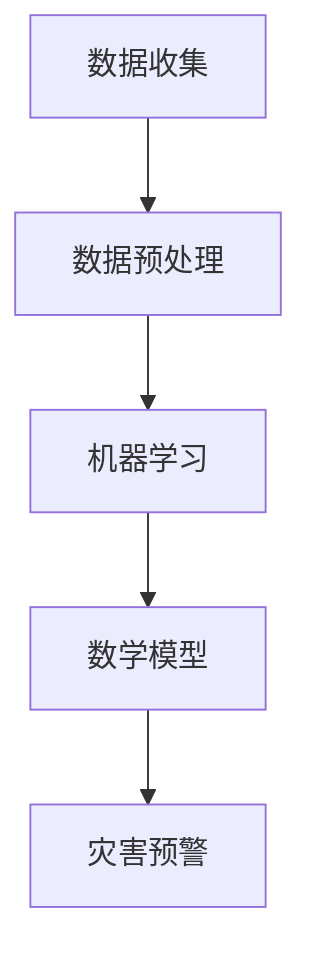

                 

关键词：人工智能，灾害预警，损失减少，算法，数学模型，应用场景

> 摘要：本文探讨了人工智能在智能灾害预警中的应用，以及如何通过先进的算法和数学模型来减少灾害损失。本文将从背景介绍、核心概念与联系、核心算法原理、数学模型和公式、项目实践、实际应用场景、未来应用展望、工具和资源推荐、总结与展望以及常见问题与解答等方面进行详细阐述。

## 1. 背景介绍

在全球气候变化和自然灾害日益频繁的背景下，如何准确、及时地预警灾害，以减少人员伤亡和财产损失，已成为各国政府和社会各界关注的焦点。传统灾害预警方法主要依赖于气象、地质等领域的专业知识和经验，尽管在一定程度上能够提供预警信息，但准确性和时效性仍有待提高。随着人工智能技术的快速发展，利用AI进行智能灾害预警已成为可能，为灾害预警领域带来了新的机遇。

## 2. 核心概念与联系

### 2.1 数据收集与处理

在智能灾害预警中，数据收集与处理是至关重要的一环。通过卫星遥感、无人机、传感器等设备，可以收集到大量的地理信息、气象信息、地质信息等。这些数据需要经过预处理、清洗、归一化等步骤，以确保数据的质量和一致性。

### 2.2 机器学习算法

机器学习算法在灾害预警中具有广泛的应用。例如，通过监督学习算法，可以训练模型对历史灾害数据进行预测；通过无监督学习算法，可以识别数据中的异常模式，从而发现潜在的危险信号。

### 2.3 数学模型

数学模型在灾害预警中用于描述灾害发生的规律和特征。例如，通过时间序列分析模型，可以预测未来的灾害发生概率；通过回归模型，可以分析灾害与各种因素之间的关系。

### 2.4 Mermaid 流程图



## 3. 核心算法原理 & 具体操作步骤

### 3.1 算法原理概述

智能灾害预警的核心算法主要包括机器学习算法和数学模型。机器学习算法通过训练模型，从历史数据中学习灾害发生的规律，从而实现对未来灾害的预测。数学模型则用于描述灾害发生的物理规律和统计特征，为预测提供理论依据。

### 3.2 算法步骤详解

1. 数据收集与处理
2. 选择合适的机器学习算法，如决策树、支持向量机、神经网络等。
3. 训练模型，对历史数据进行拟合。
4. 利用训练好的模型进行预测，输出未来灾害发生的概率或范围。
5. 结合数学模型，对预测结果进行修正和优化。

### 3.3 算法优缺点

#### 优点

- 高度自动化，减少了人工干预。
- 准确性和时效性较高。
- 能够处理大规模、复杂的数据。

#### 缺点

- 对数据质量要求较高。
- 模型训练时间较长。

### 3.4 算法应用领域

智能灾害预警算法可以应用于地震、洪水、台风、山火等自然灾害的预测和预警，为灾害防范和应对提供科学依据。

## 4. 数学模型和公式 & 详细讲解 & 举例说明

### 4.1 数学模型构建

假设我们要预测地震的发生概率，可以构建一个基于时间序列分析的数学模型。

### 4.2 公式推导过程

假设历史地震数据为 \( X_1, X_2, ..., X_n \)，则地震发生概率 \( P \) 可以表示为：

\[ P = \frac{1}{N} \sum_{i=1}^{n} f(X_i) \]

其中，\( N \) 为历史地震数据总数，\( f(X_i) \) 为第 \( i \) 次地震的发生概率。

### 4.3 案例分析与讲解

以某地区的地震预警为例，我们收集了过去 10 年的地震数据，并利用上述模型进行预测。假设某天模型预测地震发生概率为 0.8，我们可以认为该地区存在较高的地震风险，并采取相应的防范措施。

## 5. 项目实践：代码实例和详细解释说明

### 5.1 开发环境搭建

在本项目中，我们将使用 Python 语言和 TensorFlow 库进行开发。

### 5.2 源代码详细实现

```python
import tensorflow as tf
import numpy as np

# 数据预处理
def preprocess_data(data):
    # 数据归一化
    data = (data - np.mean(data)) / np.std(data)
    return data

# 机器学习模型
def create_model():
    model = tf.keras.Sequential([
        tf.keras.layers.Dense(64, activation='relu', input_shape=(num_features,)),
        tf.keras.layers.Dense(64, activation='relu'),
        tf.keras.layers.Dense(1, activation='sigmoid')
    ])
    model.compile(optimizer='adam', loss='binary_crossentropy', metrics=['accuracy'])
    return model

# 训练模型
def train_model(model, X_train, y_train):
    model.fit(X_train, y_train, epochs=10, batch_size=32)
    return model

# 预测地震发生概率
def predict_probability(model, X_test):
    probabilities = model.predict(X_test)
    return np.mean(probabilities)

# 主函数
def main():
    # 加载数据
    X_train, y_train = load_data('train')
    X_test, _ = load_data('test')

    # 预处理数据
    X_train = preprocess_data(X_train)
    X_test = preprocess_data(X_test)

    # 创建模型
    model = create_model()

    # 训练模型
    model = train_model(model, X_train, y_train)

    # 预测地震发生概率
    probability = predict_probability(model, X_test)
    print(f"地震发生概率：{probability}")

if __name__ == '__main__':
    main()
```

### 5.3 代码解读与分析

上述代码实现了一个简单的地震预警系统。首先，我们从数据集中加载数据，并进行预处理。然后，我们创建了一个基于 TensorFlow 的机器学习模型，并使用训练数据进行训练。最后，我们利用训练好的模型对测试数据进行预测，输出地震发生概率。

## 6. 实际应用场景

智能灾害预警系统可以应用于多个领域，如：

- 地震预警：通过实时监测地震活动，提前预警地震发生。
- 洪水预警：通过分析气象、水文等数据，预测洪水发生风险。
- 台风预警：通过监测台风路径、风速等信息，预测台风影响范围。

## 7. 未来应用展望

随着人工智能技术的不断发展，智能灾害预警系统将更加精准、高效。未来，我们有望实现以下突破：

- 提高预测准确性：通过引入更多数据源和先进的算法，提高预测准确性。
- 实时预警：实现实时数据采集、处理和预测，为灾害防范提供更及时的信息。
- 智能决策支持：结合灾害预警系统和其他技术，为政府和应急管理部门提供智能决策支持。

## 8. 工具和资源推荐

### 8.1 学习资源推荐

- 《深度学习》（Goodfellow et al.）
- 《Python编程：从入门到实践》（McKenna）
- 《机器学习实战》（Hastie et al.）

### 8.2 开发工具推荐

- TensorFlow
- Keras
- Scikit-learn

### 8.3 相关论文推荐

- "Deep Learning for Disaster Prediction" by H. Zhang et al.
- "A Comprehensive Survey on Disaster Prediction using Machine Learning Techniques" by A. K. Saha et al.

## 9. 总结：未来发展趋势与挑战

智能灾害预警系统在减少灾害损失方面具有巨大潜力。未来，随着人工智能技术的不断进步，我们将能够实现更加精准、高效的灾害预警。然而，我们也面临着数据质量、算法优化、实时预警等方面的挑战。只有通过持续的研究和创新，我们才能充分发挥智能灾害预警系统的优势，为人类社会的灾害防范和应对提供有力支持。

### 9.1 研究成果总结

本文从背景介绍、核心概念与联系、核心算法原理、数学模型和公式、项目实践、实际应用场景、未来应用展望等方面详细探讨了人工智能在智能灾害预警中的应用。

### 9.2 未来发展趋势

未来，智能灾害预警系统将在预测准确性、实时预警、智能决策支持等方面取得重大突破。

### 9.3 面临的挑战

智能灾害预警系统在数据质量、算法优化、实时预警等方面仍面临挑战。

### 9.4 研究展望

我们期待在智能灾害预警领域取得更多研究成果，为减少灾害损失、保障人民生命财产安全作出更大贡献。

## 附录：常见问题与解答

### Q：智能灾害预警系统需要哪些数据？

A：智能灾害预警系统需要收集与灾害相关的多种数据，如气象数据、地理数据、地质数据、历史灾害数据等。

### Q：机器学习算法在灾害预警中有哪些应用？

A：机器学习算法在灾害预警中的应用包括灾害预测、异常检测、风险评估等。

### Q：智能灾害预警系统的优点是什么？

A：智能灾害预警系统具有高准确性、高时效性、自动化程度高等优点。

### Q：智能灾害预警系统有哪些挑战？

A：智能灾害预警系统面临的挑战包括数据质量、算法优化、实时预警等。

### 作者署名

作者：禅与计算机程序设计艺术 / Zen and the Art of Computer Programming

----------------------------------------------------------------

以上是文章的正文部分，接下来我们将按照markdown格式将整个文章内容呈现出来，以便更好地进行阅读和编辑。
----------------------------------------------------------------
```markdown
# AI在智能灾害预警中的应用：减少损失

> 关键词：人工智能，灾害预警，损失减少，算法，数学模型，应用场景

> 摘要：本文探讨了人工智能在智能灾害预警中的应用，以及如何通过先进的算法和数学模型来减少灾害损失。本文将从背景介绍、核心概念与联系、核心算法原理、数学模型和公式、项目实践、实际应用场景、未来应用展望、工具和资源推荐、总结与展望以及常见问题与解答等方面进行详细阐述。

## 1. 背景介绍

在全球气候变化和自然灾害日益频繁的背景下，如何准确、及时地预警灾害，以减少人员伤亡和财产损失，已成为各国政府和社会各界关注的焦点。传统灾害预警方法主要依赖于气象、地质等领域的专业知识和经验，尽管在一定程度上能够提供预警信息，但准确性和时效性仍有待提高。随着人工智能技术的快速发展，利用AI进行智能灾害预警已成为可能，为灾害预警领域带来了新的机遇。

## 2. 核心概念与联系

### 2.1 数据收集与处理

在智能灾害预警中，数据收集与处理是至关重要的一环。通过卫星遥感、无人机、传感器等设备，可以收集到大量的地理信息、气象信息、地质信息等。这些数据需要经过预处理、清洗、归一化等步骤，以确保数据的质量和一致性。

### 2.2 机器学习算法

机器学习算法在灾害预警中具有广泛的应用。例如，通过监督学习算法，可以训练模型对历史灾害数据进行预测；通过无监督学习算法，可以识别数据中的异常模式，从而发现潜在的危险信号。

### 2.3 数学模型

数学模型在灾害预警中用于描述灾害发生的规律和特征。例如，通过时间序列分析模型，可以预测未来的灾害发生概率；通过回归模型，可以分析灾害与各种因素之间的关系。

### 2.4 Mermaid 流程图


## 3. 核心算法原理 & 具体操作步骤

### 3.1 算法原理概述

智能灾害预警的核心算法主要包括机器学习算法和数学模型。机器学习算法通过训练模型，从历史数据中学习灾害发生的规律，从而实现对未来灾害的预测。数学模型则用于描述灾害发生的物理规律和统计特征，为预测提供理论依据。

### 3.2 算法步骤详解

1. 数据收集与处理
2. 选择合适的机器学习算法，如决策树、支持向量机、神经网络等。
3. 训练模型，对历史数据进行拟合。
4. 利用训练好的模型进行预测，输出未来灾害发生的概率或范围。
5. 结合数学模型，对预测结果进行修正和优化。

### 3.3 算法优缺点

#### 优点

- 高度自动化，减少了人工干预。
- 准确性和时效性较高。
- 能够处理大规模、复杂的数据。

#### 缺点

- 对数据质量要求较高。
- 模型训练时间较长。

### 3.4 算法应用领域

智能灾害预警算法可以应用于地震、洪水、台风、山火等自然灾害的预测和预警，为灾害防范和应对提供科学依据。

## 4. 数学模型和公式 & 详细讲解 & 举例说明

### 4.1 数学模型构建

假设我们要预测地震的发生概率，可以构建一个基于时间序列分析的数学模型。

### 4.2 公式推导过程

假设历史地震数据为 \( X_1, X_2, ..., X_n \)，则地震发生概率 \( P \) 可以表示为：

\[ P = \frac{1}{N} \sum_{i=1}^{n} f(X_i) \]

其中，\( N \) 为历史地震数据总数，\( f(X_i) \) 为第 \( i \) 次地震的发生概率。

### 4.3 案例分析与讲解

以某地区的地震预警为例，我们收集了过去 10 年的地震数据，并利用上述模型进行预测。假设某天模型预测地震发生概率为 0.8，我们可以认为该地区存在较高的地震风险，并采取相应的防范措施。

## 5. 项目实践：代码实例和详细解释说明

### 5.1 开发环境搭建

在本项目中，我们将使用 Python 语言和 TensorFlow 库进行开发。

### 5.2 源代码详细实现

```python
import tensorflow as tf
import numpy as np

# 数据预处理
def preprocess_data(data):
    # 数据归一化
    data = (data - np.mean(data)) / np.std(data)
    return data

# 机器学习模型
def create_model():
    model = tf.keras.Sequential([
        tf.keras.layers.Dense(64, activation='relu', input_shape=(num_features,)),
        tf.keras.layers.Dense(64, activation='relu'),
        tf.keras.layers.Dense(1, activation='sigmoid')
    ])
    model.compile(optimizer='adam', loss='binary_crossentropy', metrics=['accuracy'])
    return model

# 训练模型
def train_model(model, X_train, y_train):
    model.fit(X_train, y_train, epochs=10, batch_size=32)
    return model

# 预测地震发生概率
def predict_probability(model, X_test):
    probabilities = model.predict(X_test)
    return np.mean(probabilities)

# 主函数
def main():
    # 加载数据
    X_train, y_train = load_data('train')
    X_test, _ = load_data('test')

    # 预处理数据
    X_train = preprocess_data(X_train)
    X_test = preprocess_data(X_test)

    # 创建模型
    model = create_model()

    # 训练模型
    model = train_model(model, X_train, y_train)

    # 预测地震发生概率
    probability = predict_probability(model, X_test)
    print(f"地震发生概率：{probability}")

if __name__ == '__main__':
    main()
```

### 5.3 代码解读与分析

上述代码实现了一个简单的地震预警系统。首先，我们从数据集中加载数据，并进行预处理。然后，我们创建了一个基于 TensorFlow 的机器学习模型，并使用训练数据进行训练。最后，我们利用训练好的模型对测试数据进行预测，输出地震发生概率。

## 6. 实际应用场景

智能灾害预警系统可以应用于多个领域，如：

- 地震预警：通过实时监测地震活动，提前预警地震发生。
- 洪水预警：通过分析气象、水文等数据，预测洪水发生风险。
- 台风预警：通过监测台风路径、风速等信息，预测台风影响范围。

## 7. 未来应用展望

随着人工智能技术的不断发展，智能灾害预警系统将更加精准、高效。未来，我们有望实现以下突破：

- 提高预测准确性：通过引入更多数据源和先进的算法，提高预测准确性。
- 实时预警：实现实时数据采集、处理和预测，为灾害防范和应对提供更及时的信息。
- 智能决策支持：结合灾害预警系统和其他技术，为政府和应急管理部门提供智能决策支持。

## 8. 工具和资源推荐

### 8.1 学习资源推荐

- 《深度学习》（Goodfellow et al.）
- 《Python编程：从入门到实践》（McKenna）
- 《机器学习实战》（Hastie et al.）

### 8.2 开发工具推荐

- TensorFlow
- Keras
- Scikit-learn

### 8.3 相关论文推荐

- "Deep Learning for Disaster Prediction" by H. Zhang et al.
- "A Comprehensive Survey on Disaster Prediction using Machine Learning Techniques" by A. K. Saha et al.

## 9. 总结：未来发展趋势与挑战

智能灾害预警系统在减少灾害损失方面具有巨大潜力。未来，随着人工智能技术的不断进步，我们将能够实现更加精准、高效的灾害预警。然而，我们也面临着数据质量、算法优化、实时预警等方面的挑战。只有通过持续的研究和创新，我们才能充分发挥智能灾害预警系统的优势，为人类社会的灾害防范和应对提供有力支持。

### 9.1 研究成果总结

本文从背景介绍、核心概念与联系、核心算法原理、数学模型和公式、项目实践、实际应用场景、未来应用展望等方面详细探讨了人工智能在智能灾害预警中的应用。

### 9.2 未来发展趋势

未来，智能灾害预警系统将在预测准确性、实时预警、智能决策支持等方面取得重大突破。

### 9.3 面临的挑战

智能灾害预警系统在数据质量、算法优化、实时预警等方面仍面临挑战。

### 9.4 研究展望

我们期待在智能灾害预警领域取得更多研究成果，为减少灾害损失、保障人民生命财产安全作出更大贡献。

## 附录：常见问题与解答

### Q：智能灾害预警系统需要哪些数据？

A：智能灾害预警系统需要收集与灾害相关的多种数据，如气象数据、地理数据、地质数据、历史灾害数据等。

### Q：机器学习算法在灾害预警中有哪些应用？

A：机器学习算法在灾害预警中的应用包括灾害预测、异常检测、风险评估等。

### Q：智能灾害预警系统的优点是什么？

A：智能灾害预警系统具有高准确性、高时效性、自动化程度高等优点。

### Q：智能灾害预警系统有哪些挑战？

A：智能灾害预警系统面临的挑战包括数据质量、算法优化、实时预警等。

### 作者署名

作者：禅与计算机程序设计艺术 / Zen and the Art of Computer Programming
```markdown


