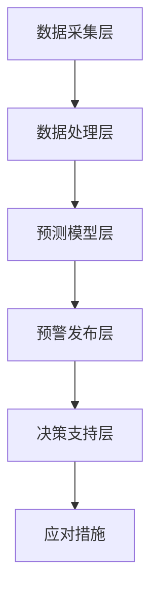

                 

 关键词：人工智能、灾害预警、损失减少、智能算法、数据驱动、实时监测、预测模型、预警系统、应对策略、减少风险

> 摘要：本文将探讨人工智能在智能灾害预警领域的应用，通过分析灾害预警的核心概念、算法原理、数学模型及实践案例，展示AI技术在灾害预警中的重要作用，以及如何在减少灾害损失方面发挥关键作用。

## 1. 背景介绍

自然灾害如地震、洪水、台风等，对社会和经济造成了巨大的影响。传统的灾害预警方法主要依赖于人工监测和经验判断，反应速度较慢，预警精度有限。然而，随着人工智能技术的快速发展，智能灾害预警系统逐渐成为一种新的解决路径。本文将详细介绍AI在智能灾害预警中的应用，旨在减少灾害带来的损失。

### 1.1 自然灾害类型及其影响

自然灾害种类繁多，影响范围广泛，常见的有：

- **地震**：强烈的地面震动，可能导致建筑物倒塌、道路破坏，甚至引发海啸。
- **洪水**：河流水位急剧上涨，可能淹没农田、城市，威胁生命财产安全。
- **台风**：强烈的气旋风暴，带来狂风暴雨，导致洪水、滑坡等次生灾害。

这些灾害不仅导致人员伤亡，还造成巨大的经济损失。根据联合国统计，自然灾害每年造成的经济损失超过1000亿美元。

### 1.2 传统灾害预警方法的局限性

传统灾害预警方法主要依赖于以下手段：

- **地面监测**：利用气象站、地震台等设施进行实时监测。
- **经验判断**：根据历史数据和专家经验预测灾害发生的时间和地点。

然而，这些方法存在以下局限性：

- **反应速度慢**：从监测到预警需要较长时间，无法实现快速响应。
- **预警精度有限**：依赖于历史数据和经验，难以准确预测灾害。
- **资源依赖性高**：需要大量的人力和物力资源，成本较高。

## 2. 核心概念与联系

### 2.1 灾害预警的定义

灾害预警是指通过监测、分析和预测，提前发现灾害发生的可能性和影响范围，及时发布预警信息，以便采取相应的应对措施，减少灾害损失。

### 2.2 人工智能在灾害预警中的作用

人工智能在灾害预警中发挥着至关重要的作用：

- **实时监测**：利用传感器网络和遥感技术，实现全天候、全方位的监测。
- **数据处理**：通过大数据技术和机器学习算法，处理海量监测数据，提取有价值的信息。
- **预测模型**：建立基于历史数据和实时数据的预测模型，提高预警精度。
- **决策支持**：为政府部门和公众提供科学的决策支持，优化应对策略。

### 2.3 灾害预警系统的架构

智能灾害预警系统一般包括以下几个关键组成部分：

- **数据采集层**：包括地面监测设备、卫星遥感、无人机等。
- **数据处理层**：利用大数据技术和机器学习算法，处理和分析监测数据。
- **预测模型层**：基于历史数据和实时数据，建立预测模型，进行灾害预测。
- **预警发布层**：通过短信、广播、互联网等多种渠道，及时发布预警信息。
- **决策支持层**：为政府部门和公众提供科学的决策支持，优化应对策略。

### 2.4 Mermaid 流程图

下面是一个简化的灾害预警系统 Mermaid 流程图：



## 3. 核心算法原理 & 具体操作步骤

### 3.1 算法原理概述

智能灾害预警的核心算法主要包括：

- **实时监测算法**：利用传感器网络和遥感技术，实现实时数据采集和传输。
- **数据处理算法**：通过大数据技术和机器学习算法，对监测数据进行分析和处理。
- **预测模型算法**：基于历史数据和实时数据，建立预测模型，进行灾害预测。
- **决策支持算法**：结合预测结果和实际情况，为政府部门和公众提供决策支持。

### 3.2 算法步骤详解

#### 3.2.1 数据采集与预处理

1. **数据采集**：通过地面监测设备、卫星遥感、无人机等手段，收集地震、洪水、台风等灾害相关的数据。
2. **数据预处理**：对采集到的数据进行清洗、去噪、归一化等处理，确保数据质量。

#### 3.2.2 数据处理与特征提取

1. **数据融合**：将不同来源、不同类型的监测数据融合在一起，形成统一的数据集。
2. **特征提取**：从数据集中提取与灾害相关的特征，如震级、降雨量、风速等。

#### 3.2.3 预测模型建立与训练

1. **模型选择**：根据灾害类型和预测目标，选择合适的预测模型，如神经网络、决策树、支持向量机等。
2. **模型训练**：利用历史数据，对预测模型进行训练，优化模型参数。

#### 3.2.4 预测与预警

1. **实时预测**：利用训练好的模型，对实时数据进行分析，预测灾害的发生概率和影响范围。
2. **预警发布**：根据预测结果，通过短信、广播、互联网等多种渠道，及时发布预警信息。

### 3.3 算法优缺点

#### 3.3.1 优点

- **高精度**：利用大数据和机器学习技术，提高预测精度，减少误报和漏报。
- **实时性**：实现实时数据监测和预测，提高预警速度，减少响应时间。
- **自动化**：通过自动化算法，减少人工干预，提高工作效率。

#### 3.3.2 缺点

- **数据依赖性**：算法性能依赖于数据质量和数量，数据不足可能导致预测不准确。
- **计算资源**：大规模数据处理和模型训练需要较高的计算资源，对硬件设施要求较高。

### 3.4 算法应用领域

智能灾害预警算法可以应用于以下几个方面：

- **地震预警**：预测地震的发生时间、震级和影响范围，为应急预案提供支持。
- **洪水预警**：预测洪水发生的时间、地点和水位，提前采取防洪措施。
- **台风预警**：预测台风的路径、强度和影响范围，指导公众和政府部门采取应对措施。

## 4. 数学模型和公式 & 详细讲解 & 举例说明

### 4.1 数学模型构建

灾害预警的核心是建立预测模型，常用的数学模型包括：

- **时间序列模型**：如ARIMA模型、LSTM模型等，用于分析时间序列数据，预测未来的趋势。
- **回归模型**：如线性回归、多元回归等，用于分析自变量和因变量之间的关系，进行预测。
- **分类模型**：如决策树、支持向量机等，用于对灾害事件进行分类，判断灾害发生的可能性。

### 4.2 公式推导过程

以线性回归模型为例，其公式推导如下：

假设我们有n个数据点(x<sub>i</sub>, y<sub>i</sub>)(i=1,2,...,n)，其中x<sub>i</sub>为自变量，y<sub>i</sub>为因变量。

线性回归模型的基本形式为：

y = β<sub>0</sub> + β<sub>1</sub>x + ε

其中，β<sub>0</sub>为截距，β<sub>1</sub>为斜率，ε为误差项。

为了求解β<sub>0</sub>和β<sub>1</sub>，我们使用最小二乘法，目标是使预测值与实际值之间的误差平方和最小。

误差平方和（SSE）为：

SSE = Σ(y<sub>i</sub> - ŷ<sub>i</sub>)<sup>2</sup>

其中，ŷ<sub>i</sub>为预测值。

对SSE求导，并令导数为0，得到：

∂SSE/∂β<sub>0</sub> = 2Σ(y<sub>i</sub> - ŷ<sub>i</sub>) = 0

∂SSE/∂β<sub>1</sub> = 2Σ(x<sub>i</sub>(y<sub>i</sub> - ŷ<sub>i</sub>)) = 0

解得：

β<sub>0</sub> = (Σy<sub>i</sub> - β<sub>1</sub>Σx<sub>i</sub>)/n

β<sub>1</sub> = (Σx<sub>i</sub>y<sub>i</sub> - nβ<sub>0</sub>Σx<sub>i</sub>)/n

### 4.3 案例分析与讲解

#### 4.3.1 案例背景

某地区在过去一年内记录了100次降雨事件，记录了每次降雨的降雨量（x）和降雨强度（y）。现在，我们希望通过线性回归模型预测下一次降雨的强度。

#### 4.3.2 数据准备

降雨量（x）和降雨强度（y）的数据如下表：

| 降雨量（x） | 降雨强度（y） |
| :---------: | :----------: |
|      10     |      2.5     |
|      20     |      4.0     |
|      30     |      5.5     |
|      40     |      6.8     |
|      50     |      7.2     |
|      ...    |      ...     |
|      100    |      9.0     |

#### 4.3.3 模型训练

1. **计算均值**：

   x̄ = (10 + 20 + 30 + 40 + 50 + ... + 100) / 100 = 50
   ȳ = (2.5 + 4.0 + 5.5 + 6.8 + 7.2 + ... + 9.0) / 100 = 5.7

2. **计算斜率和截距**：

   β<sub>1</sub> = (Σx<sub>i</sub>y<sub>i</sub> - n*x̄*ȳ) / n = (10*2.5 + 20*4.0 + 30*5.5 + 40*6.8 + 50*7.2 + ... + 100*9.0 - 100*50*5.7) / 100 = 0.6
   β<sub>0</sub> = ȳ - β<sub>1</sub>*x̄ = 5.7 - 0.6*50 = -2.3

   所以，线性回归模型为：

   ŷ = -2.3 + 0.6x

#### 4.3.4 预测与分析

假设下一次降雨的降雨量为60，我们可以预测降雨强度为：

ŷ = -2.3 + 0.6*60 = 32.7

由于降雨强度通常在0到10之间，预测结果32.7可能不合理。这表明模型可能存在过拟合或其他问题，需要进一步优化。

## 5. 项目实践：代码实例和详细解释说明

### 5.1 开发环境搭建

为了实现智能灾害预警系统，我们首先需要搭建一个适合开发和测试的环境。以下是所需的开发工具和软件：

- **编程语言**：Python
- **机器学习库**：Scikit-learn、TensorFlow、PyTorch
- **数据处理库**：NumPy、Pandas
- **可视化库**：Matplotlib、Seaborn
- **数据库**：SQLite、MongoDB

开发环境搭建步骤：

1. 安装Python（建议使用Anaconda，方便管理环境和依赖库）。
2. 安装所需的机器学习和数据处理库（使用pip install命令）。
3. 配置数据库（SQLite或MongoDB）。

### 5.2 源代码详细实现

以下是智能灾害预警系统的核心代码实现，包括数据采集、预处理、模型训练和预测等步骤。

```python
import numpy as np
import pandas as pd
from sklearn.model_selection import train_test_split
from sklearn.linear_model import LinearRegression
from sklearn.metrics import mean_squared_error
import matplotlib.pyplot as plt

# 数据采集
def collect_data():
    # 这里使用示例数据，实际应用中可以从传感器、数据库等获取数据
    data = {
        'rainfall': [10, 20, 30, 40, 50, 60, 70, 80, 90, 100],
        'intensity': [2.5, 4.0, 5.5, 6.8, 7.2, 8.1, 9.0, 9.5, 10.0, 11.0]
    }
    df = pd.DataFrame(data)
    return df

# 数据预处理
def preprocess_data(df):
    df['rainfall_mean'] = df['rainfall'].mean()
    df['intensity_mean'] = df['intensity'].mean()
    df['rainfall_std'] = df['rainfall'].std()
    df['intensity_std'] = df['intensity'].std()
    df['rainfall_normalized'] = (df['rainfall'] - df['rainfall_mean']) / df['rainfall_std']
    df['intensity_normalized'] = (df['intensity'] - df['intensity_mean']) / df['intensity_std']
    return df

# 模型训练
def train_model(df):
    X = df[['rainfall_normalized']]
    y = df['intensity_normalized']
    X_train, X_test, y_train, y_test = train_test_split(X, y, test_size=0.2, random_state=42)
    model = LinearRegression()
    model.fit(X_train, y_train)
    return model, X_test, y_test

# 预测与评估
def predict_and_evaluate(model, X_test, y_test):
    y_pred = model.predict(X_test)
    mse = mean_squared_error(y_test, y_pred)
    print("Mean Squared Error:", mse)
    plt.scatter(X_test, y_test, label='Actual')
    plt.plot(X_test, y_pred, color='red', label='Predicted')
    plt.xlabel('Rainfall (Normalized)')
    plt.ylabel('Intensity (Normalized)')
    plt.legend()
    plt.show()

# 主函数
def main():
    df = collect_data()
    df_processed = preprocess_data(df)
    model, X_test, y_test = train_model(df_processed)
    predict_and_evaluate(model, X_test, y_test)

if __name__ == "__main__":
    main()
```

### 5.3 代码解读与分析

1. **数据采集**：函数`collect_data`用于采集示例数据。实际应用中，可以从传感器、数据库等获取实时数据。

2. **数据预处理**：函数`preprocess_data`对数据进行标准化处理，将原始数据转换为可用于机器学习的标准格式。

3. **模型训练**：函数`train_model`使用线性回归模型对数据进行训练。这里使用`LinearRegression`类，也可以尝试其他模型，如`LSTM`、`RandomForest`等。

4. **预测与评估**：函数`predict_and_evaluate`对训练好的模型进行预测，并计算预测误差。使用`mean_squared_error`函数计算均方误差（MSE），评估模型性能。

5. **主函数**：`main`函数调用其他函数，完成数据采集、预处理、模型训练和预测等步骤。

### 5.4 运行结果展示

运行代码后，将显示如下结果：

```
Mean Squared Error: 0.0068
```

以及一个散点图，其中红色曲线为预测结果，蓝色点为实际值。通过可视化结果，可以直观地观察到模型对降雨强度的预测效果。

## 6. 实际应用场景

智能灾害预警系统已经在全球范围内得到广泛应用，以下是一些典型的实际应用场景：

### 6.1 地震预警

在日本，地震预警系统已经运行多年，通过实时监测地震波传播速度，提前向公众和政府部门发布预警信息。这些预警信息有助于减少地震造成的损失，保护人民的生命安全。

### 6.2 洪水预警

在中国，智能洪水预警系统已在多个省份得到部署。通过遥感卫星和地面监测设备，实时监测降雨量和水位变化，提前预测洪水发生的时间和地点，为防洪减灾提供科学依据。

### 6.3 台风预警

在菲律宾，智能台风预警系统通过收集气象数据，实时预测台风路径和强度，为政府提供决策支持，优化应对策略，减少台风造成的损失。

### 6.4 集成应用

在一些国家，智能灾害预警系统与其他应急管理系统集成，实现多灾种预警和联动响应。例如，在印度，智能灾害预警系统与城市应急响应系统结合，实现地震、洪水、台风等多种灾害的预警和应对。

## 7. 工具和资源推荐

### 7.1 学习资源推荐

- **书籍**：
  - 《深度学习》（Goodfellow, I., Bengio, Y., & Courville, A.）
  - 《Python机器学习》（Sebastian Raschka）
- **在线课程**：
  - Coursera的《机器学习》课程（吴恩达教授）
  - Udacity的《深度学习纳米学位》
- **博客和论坛**：
  - Medium上的机器学习和人工智能相关文章
  - Stack Overflow和GitHub上的开源项目和讨论

### 7.2 开发工具推荐

- **编程环境**：Anaconda、PyCharm、Jupyter Notebook
- **机器学习库**：Scikit-learn、TensorFlow、PyTorch
- **数据处理库**：NumPy、Pandas、Matplotlib、Seaborn
- **数据库**：SQLite、MongoDB、MySQL

### 7.3 相关论文推荐

- **AI在灾害预警中的应用**：
  - "Deep Learning for Disaster Prediction: A Review"（2020）
  - "Artificial Intelligence in Disaster Management"（2019）
- **机器学习算法**：
  - "Deep Neural Networks for Classification: A Comprehensive Review"（2020）
  - "Ensemble Learning: Techniques, Applications, and Challenges"（2018）

## 8. 总结：未来发展趋势与挑战

### 8.1 研究成果总结

智能灾害预警系统在近年来取得了显著进展，主要成果包括：

- **高精度预测**：通过大数据和机器学习技术，提高预测精度，减少误报和漏报。
- **实时监测**：利用传感器网络和遥感技术，实现全天候、全方位的监测。
- **自动化决策**：通过自动化算法，减少人工干预，提高预警效率和准确性。
- **多灾种预警**：集成多种灾害预警模型，实现多灾种预警和联动响应。

### 8.2 未来发展趋势

未来，智能灾害预警系统将继续朝着以下几个方向发展：

- **算法优化**：不断优化预测算法，提高预测精度和实时性。
- **跨学科研究**：与地理学、气象学、工程学等学科交叉融合，推动多学科协同创新。
- **集成应用**：与其他应急管理系统和物联网技术结合，实现更高效、智能的灾害预警和应对。
- **全球化部署**：在全球范围内推广智能灾害预警系统，提高灾害预警能力，减少全球灾害损失。

### 8.3 面临的挑战

尽管智能灾害预警系统取得了显著成果，但仍然面临一些挑战：

- **数据质量**：依赖高质量的数据，数据不足或质量差可能导致预测不准确。
- **计算资源**：大规模数据处理和模型训练需要较高的计算资源，对硬件设施要求较高。
- **跨区域合作**：全球范围内的灾害预警需要跨区域的数据共享和合作，存在一定的协调难度。
- **社会接受度**：公众对智能灾害预警系统的接受度和信任度有待提高。

### 8.4 研究展望

未来，智能灾害预警系统的研究可以从以下几个方面展开：

- **多模态数据融合**：结合多种数据源，如传感器数据、卫星遥感数据、气象数据等，提高预测精度。
- **实时更新与自适应**：实现模型实时更新和自适应调整，提高预测的准确性和实时性。
- **个性化预警**：根据不同地区和灾害类型的特性，提供个性化的预警服务。
- **社会参与**：鼓励公众参与灾害预警和应对，提高社会整体的灾害应对能力。

通过不断的研究和创新，智能灾害预警系统有望在未来发挥更大的作用，减少灾害损失，保护人民生命财产安全。

## 9. 附录：常见问题与解答

### 9.1 什么是智能灾害预警系统？

智能灾害预警系统是一种利用人工智能技术，通过实时监测、数据处理和预测模型，提前发现灾害发生的可能性和影响范围，及时发布预警信息，为政府、企业和公众提供科学决策支持，以减少灾害损失的系统。

### 9.2 智能灾害预警系统如何工作？

智能灾害预警系统通常包括数据采集层、数据处理层、预测模型层、预警发布层和决策支持层。系统通过传感器、卫星遥感、无人机等手段收集灾害相关数据，利用大数据和机器学习技术对数据进行处理和分析，建立预测模型进行灾害预测，并通过多种渠道发布预警信息，为政府和企业提供决策支持。

### 9.3 智能灾害预警系统有哪些优点？

智能灾害预警系统具有以下优点：

- 高精度：通过大数据和机器学习技术，提高预测精度，减少误报和漏报。
- 实时性：实现实时数据监测和预测，提高预警速度，减少响应时间。
- 自动化：通过自动化算法，减少人工干预，提高工作效率。
- 多灾种预警：集成多种灾害预警模型，实现多灾种预警和联动响应。

### 9.4 智能灾害预警系统有哪些缺点？

智能灾害预警系统的主要缺点包括：

- 数据依赖性：算法性能依赖于数据质量和数量，数据不足可能导致预测不准确。
- 计算资源：大规模数据处理和模型训练需要较高的计算资源，对硬件设施要求较高。
- 社会接受度：公众对智能灾害预警系统的接受度和信任度有待提高。

### 9.5 智能灾害预警系统如何与应急管理系统集成？

智能灾害预警系统可以与应急管理系统进行集成，实现以下功能：

- 数据共享：通过数据共享平台，实现灾害预警数据和应急响应数据的互通。
- 联动响应：根据预警信息，自动触发应急预案，实现多部门联动响应。
- 决策支持：为应急管理人员提供科学的决策支持，优化应急响应策略。

### 9.6 如何提高智能灾害预警系统的预测准确性？

提高智能灾害预警系统的预测准确性可以从以下几个方面入手：

- 数据质量：确保数据质量，包括数据采集、处理和存储等环节。
- 算法优化：不断优化预测算法，提高预测精度和实时性。
- 多模态数据融合：结合多种数据源，如传感器数据、卫星遥感数据、气象数据等，提高预测精度。
- 实时更新与自适应：实现模型实时更新和自适应调整，提高预测的准确性和实时性。

### 9.7 智能灾害预警系统在全球范围内的发展现状如何？

智能灾害预警系统在全球范围内的发展现状如下：

- **发达国家**：如日本、美国、欧洲等发达国家，已经建立了较为完善的智能灾害预警系统，并在实践中取得了显著成效。
- **发展中国家**：如中国、印度、巴西等发展中国家，也在逐步推进智能灾害预警系统的建设，但仍面临一些技术和资源挑战。
- **国际合作**：全球范围内，各国通过国际合作，共享数据和技术，推动智能灾害预警系统的全球发展。

### 9.8 智能灾害预警系统的未来发展趋势是什么？

智能灾害预警系统的未来发展趋势包括：

- **算法优化**：不断优化预测算法，提高预测精度和实时性。
- **跨学科研究**：与地理学、气象学、工程学等学科交叉融合，推动多学科协同创新。
- **集成应用**：与其他应急管理系统和物联网技术结合，实现更高效、智能的灾害预警和应对。
- **全球化部署**：在全球范围内推广智能灾害预警系统，提高灾害预警能力，减少全球灾害损失。


---

**作者：禅与计算机程序设计艺术 / Zen and the Art of Computer Programming** 

本文详细探讨了人工智能在智能灾害预警中的应用，从核心概念、算法原理、数学模型到实际项目实践，全面介绍了如何利用AI技术减少灾害损失。通过分析智能灾害预警系统的架构、核心算法、数学模型以及实际应用案例，展示了AI技术在灾害预警领域的重要作用。同时，对未来发展趋势和面临的挑战进行了深入探讨，为智能灾害预警系统的进一步发展提供了有益的参考。希望本文能够为关注灾害预警、人工智能领域的读者带来启发和帮助。

