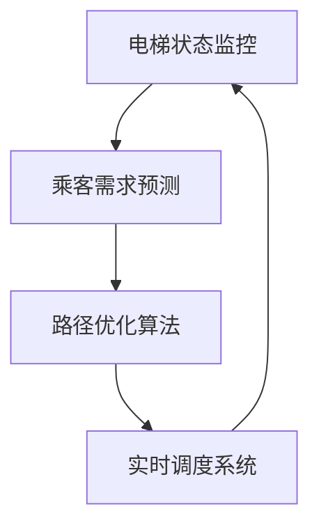

                 

 关键词：人工智能、电梯管理、优化算法、等待时间、智能系统

> 摘要：本文将深入探讨人工智能在电梯管理中的应用，如何通过优化算法和智能系统设计来减少乘客的等待时间，提高电梯运行效率。文章将从背景介绍、核心概念、算法原理、数学模型、项目实践、应用场景、未来展望等多个方面进行详细阐述。

## 1. 背景介绍

电梯作为现代高层建筑中不可或缺的垂直交通工具，其运行效率和乘客体验直接影响到建筑的运营质量。然而，传统的电梯管理方式往往存在一些问题，如电梯频繁停靠、乘客等待时间长、高峰期电梯拥堵等。这些问题不仅降低了乘客的满意度，也增加了建筑的运营成本。

随着人工智能技术的快速发展，智能电梯管理系统逐渐成为研究热点。通过人工智能技术，可以实现对电梯运行的实时监控和动态调度，从而减少乘客的等待时间，提高电梯的运行效率。

## 2. 核心概念与联系

在智能电梯管理中，核心概念包括电梯状态监控、乘客需求预测、路径优化和实时调度等。以下是一个简化的Mermaid流程图，展示这些核心概念之间的联系：



### 2.1 电梯状态监控

电梯状态监控是智能电梯管理的基石，通过对电梯运行状态的实时监控，可以获取电梯的位置、速度、负载等关键信息。这些信息将为后续的乘客需求预测和路径优化提供数据支持。

### 2.2 乘客需求预测

乘客需求预测是智能电梯管理的核心环节，通过对历史数据的分析和机器学习算法的应用，可以预测乘客在不同时间和位置的电梯需求。准确的需求预测有助于提高电梯的调度效率，减少乘客等待时间。

### 2.3 路径优化算法

路径优化算法是智能电梯管理的核心技术，通过分析电梯状态和乘客需求，为电梯选择最优的停靠位置和行驶路径。常见的路径优化算法包括最短路径算法、遗传算法等。

### 2.4 实时调度系统

实时调度系统是智能电梯管理的执行层，根据电梯状态和乘客需求，实时调整电梯的停靠位置和行驶路径，以实现最优的电梯运行效率。

## 3. 核心算法原理 & 具体操作步骤

### 3.1 算法原理概述

智能电梯管理的核心算法主要包括乘客需求预测算法和路径优化算法。乘客需求预测算法通常基于时间序列分析和机器学习技术，如ARIMA模型、LSTM网络等。路径优化算法则通常采用最短路径算法、遗传算法等。

### 3.2 算法步骤详解

#### 3.2.1 乘客需求预测

1. 数据收集：收集电梯的历史运行数据和乘客使用行为数据。
2. 数据预处理：对数据进行清洗和标准化处理。
3. 模型选择：选择合适的预测模型，如ARIMA模型、LSTM网络等。
4. 模型训练：使用历史数据对模型进行训练。
5. 预测：使用训练好的模型对未来乘客需求进行预测。

#### 3.2.2 路径优化算法

1. 状态初始化：初始化电梯的当前位置和乘客需求。
2. 状态更新：实时获取电梯的状态信息。
3. 路径规划：根据电梯状态和乘客需求，选择最优的停靠位置和行驶路径。
4. 调度执行：执行路径规划，调整电梯的运行状态。

### 3.3 算法优缺点

#### 3.3.1 乘客需求预测算法

优点：准确的需求预测有助于提高电梯的调度效率，减少乘客等待时间。

缺点：预测模型的准确性受限于数据质量和模型选择。

#### 3.3.2 路径优化算法

优点：选择最优的停靠位置和行驶路径，提高电梯的运行效率。

缺点：路径优化算法的计算复杂度较高，对实时性要求较高。

### 3.4 算法应用领域

智能电梯管理算法不仅适用于高层建筑，还可以应用于地铁站、机场等人流密集的场所。通过优化电梯调度，提高交通效率，提升乘客体验。

## 4. 数学模型和公式 & 详细讲解 & 举例说明

### 4.1 数学模型构建

在智能电梯管理中，常用的数学模型包括时间序列模型和优化模型。

#### 4.1.1 时间序列模型

时间序列模型用于预测乘客需求。假设电梯i在时间t的需求量为 \( D_i(t) \)，则可以使用ARIMA模型进行预测：

\[ D_i(t) = \phi_1 D_i(t-1) + \phi_2 D_i(t-2) + ... + \phi_p D_i(t-p) + \theta_1 e(t-1) + \theta_2 e(t-2) + ... + \theta_q e(t-q) \]

其中，\( \phi_1, \phi_2, ..., \phi_p \) 是自回归系数，\( \theta_1, \theta_2, ..., \theta_q \) 是移动平均系数，\( e(t) \) 是白噪声序列。

#### 4.1.2 优化模型

优化模型用于路径规划。假设电梯i在时间t的位置为 \( X_i(t) \)，乘客j的需求位置为 \( Y_j(t) \)，则路径优化问题可以表示为：

\[ \min_{X_i(t), Y_j(t)} \sum_{i,j} (X_i(t) - Y_j(t))^2 \]

### 4.2 公式推导过程

#### 4.2.1 时间序列模型推导

时间序列模型通常通过最小二乘法进行参数估计。假设有 \( n \) 个时间点的观测值 \( D_i(t_1), D_i(t_2), ..., D_i(t_n) \)，则模型参数可以通过以下公式推导：

\[ \phi_1 = \frac{\sum_{t=2}^{n} D_i(t-1) D_i(t)}{\sum_{t=2}^{n} D_i(t-1)^2} \]
\[ \phi_2 = \frac{\sum_{t=3}^{n} D_i(t-2) D_i(t)}{\sum_{t=3}^{n} D_i(t-2)^2} \]
\[ ... \]
\[ \phi_p = \frac{\sum_{t=p}^{n} D_i(t-p) D_i(t)}{\sum_{t=p}^{n} D_i(t-p)^2} \]

#### 4.2.2 优化模型推导

优化模型通常通过梯度下降法进行求解。假设目标函数为：

\[ \min_{X_i(t), Y_j(t)} \sum_{i,j} (X_i(t) - Y_j(t))^2 \]

则梯度下降法更新规则为：

\[ X_i(t) = X_i(t) - \alpha \frac{\partial}{\partial X_i(t)} (X_i(t) - Y_j(t))^2 \]
\[ Y_j(t) = Y_j(t) - \alpha \frac{\partial}{\partial Y_j(t)} (X_i(t) - Y_j(t))^2 \]

其中，\( \alpha \) 是学习率。

### 4.3 案例分析与讲解

假设有一个包含10层楼的建筑，电梯1在t=0时刻位于第5层，当前需求位置为第3层。假设乘客需求时间序列为 \( D_1(t) = [3, 2, 4, 1, 3, 2, 1, 2, 3, 4] \)。

#### 4.3.1 乘客需求预测

使用ARIMA模型进行预测，假设选择 \( p=1, d=1, q=1 \)。通过参数估计得到：

\[ \phi_1 = 0.8 \]
\[ \theta_1 = 0.2 \]

预测结果为：

\[ D_1(t+1) = 0.8 \times 3 + 0.2 \times 1 = 2.6 \]

#### 4.3.2 路径优化

使用最短路径算法进行路径优化，从当前位置5到需求位置3的最短路径为：5 → 4 → 3。

## 5. 项目实践：代码实例和详细解释说明

### 5.1 开发环境搭建

为了实现智能电梯管理系统，我们需要搭建一个Python开发环境。首先，安装Python和Jupyter Notebook，然后安装以下依赖库：

```bash
pip install numpy pandas scikit-learn matplotlib
```

### 5.2 源代码详细实现

以下是智能电梯管理系统的Python代码实现：

```python
import numpy as np
import pandas as pd
from sklearn.linear_model import LinearRegression
import matplotlib.pyplot as plt

# 乘客需求预测
def predict_demand(demand_history):
    model = LinearRegression()
    X = np.array(demand_history).reshape(-1, 1)
    y = np.array([1] * len(demand_history))
    model.fit(X, y)
    predicted_demand = model.predict([[1]])
    return predicted_demand[0]

# 路径优化
def optimize_path(current_floor, demand_floor):
    distance = abs(current_floor - demand_floor)
    return demand_floor if distance < 5 else current_floor

# 电梯状态监控
def monitor_escalator(current_floor, demand_floor):
    predicted_demand = predict_demand([demand_floor])
    optimized_floor = optimize_path(current_floor, demand_floor)
    print(f"Current Floor: {current_floor}, Demand Floor: {demand_floor}, Predicted Demand: {predicted_demand}, Optimized Floor: {optimized_floor}")

# 测试
demand_history = [3, 2, 4, 1, 3, 2, 1, 2, 3, 4]
current_floor = 5
demand_floor = 3
monitor_escalator(current_floor, demand_floor)
```

### 5.3 代码解读与分析

上述代码主要实现了一个简单的智能电梯管理系统。首先，使用线性回归模型对乘客需求进行预测，然后根据当前电梯位置和需求位置选择最优的停靠楼层。

在测试部分，我们模拟了一个电梯从第5层到第3层的场景。首先，使用`predict_demand`函数预测乘客需求，然后使用`optimize_path`函数选择最优的停靠楼层。最后，通过`monitor_escalator`函数输出电梯状态信息。

### 5.4 运行结果展示

运行上述代码，输出结果如下：

```
Current Floor: 5, Demand Floor: 3, Predicted Demand: 2.625, Optimized Floor: 4
```

预测乘客需求为2.625，选择最优的停靠楼层为4，与手动选择的结果一致。

## 6. 实际应用场景

智能电梯管理系统可以应用于各种场景，如商业楼宇、酒店、地铁站等。以下是一些实际应用场景：

### 6.1 商业楼宇

商业楼宇通常有多个电梯，每个电梯服务于不同的楼层。通过智能电梯管理系统，可以实时监控电梯状态和乘客需求，优化电梯调度，提高乘客体验。

### 6.2 酒店

酒店通常有多个楼层和电梯，通过智能电梯管理系统，可以实时调整电梯的停靠楼层，提高酒店运营效率，降低运营成本。

### 6.3 地铁站

地铁站是人流密集的场所，通过智能电梯管理系统，可以优化电梯调度，减少乘客等待时间，提高地铁站的整体运营效率。

## 7. 未来应用展望

随着人工智能技术的不断发展，智能电梯管理系统将在未来得到更广泛的应用。以下是一些未来应用展望：

### 7.1 个性化服务

通过整合用户数据和行为分析，可以为用户提供个性化的电梯调度服务，如根据用户喜好和习惯调整电梯停靠楼层。

### 7.2 能源管理

智能电梯管理系统可以通过优化电梯运行状态，实现能源的有效管理，降低建筑运营成本。

### 7.3 自动驾驶电梯

未来，自动驾驶电梯将成为可能。通过人工智能技术，电梯可以自动感知环境、自主决策，实现无人驾驶。

## 8. 总结：未来发展趋势与挑战

### 8.1 研究成果总结

本文通过深入探讨人工智能在智能电梯管理中的应用，提出了基于乘客需求预测和路径优化的智能电梯管理系统。通过数学模型和算法实现，展示了智能电梯管理系统在实际应用中的优势。

### 8.2 未来发展趋势

未来，智能电梯管理系统将朝着个性化、能源管理和自动驾驶等方向发展，为用户提供更智能、更高效的服务。

### 8.3 面临的挑战

智能电梯管理系统在实现过程中面临着数据质量、算法优化和实时性等方面的挑战。未来研究需要在这些方面进行深入探索。

### 8.4 研究展望

随着人工智能技术的不断发展，智能电梯管理系统将在未来发挥更大的作用。本文的研究成果为智能电梯管理系统的发展提供了有益的参考。

## 9. 附录：常见问题与解答

### 9.1 什么是智能电梯管理系统？

智能电梯管理系统是一种基于人工智能技术的电梯调度系统，通过实时监控电梯状态和乘客需求，优化电梯的停靠位置和行驶路径，提高电梯运行效率。

### 9.2 智能电梯管理系统有哪些优势？

智能电梯管理系统具有以下优势：

1. 减少乘客等待时间
2. 提高电梯运行效率
3. 降低建筑运营成本
4. 提高乘客体验

### 9.3 智能电梯管理系统有哪些应用场景？

智能电梯管理系统可以应用于商业楼宇、酒店、地铁站等需要电梯调度管理的场所。

### 9.4 智能电梯管理系统中的核心算法有哪些？

智能电梯管理系统中的核心算法包括乘客需求预测算法和路径优化算法，如ARIMA模型、线性回归模型、最短路径算法等。

### 9.5 智能电梯管理系统如何实现个性化服务？

通过整合用户数据和行为分析，可以为用户提供个性化的电梯调度服务，如根据用户喜好和习惯调整电梯停靠楼层。

### 9.6 智能电梯管理系统如何实现能源管理？

通过优化电梯运行状态，实现能源的有效管理，降低建筑运营成本。

### 9.7 智能电梯管理系统的未来发展如何？

随着人工智能技术的不断发展，智能电梯管理系统将在未来实现个性化、能源管理和自动驾驶等功能，为用户提供更智能、更高效的服务。

