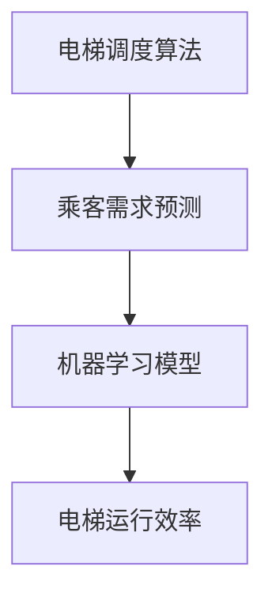

                 

关键词：人工智能、智能电梯管理、减少等待时间、算法、数学模型、实际应用、未来展望

摘要：本文将探讨人工智能在智能电梯管理中的应用，旨在减少电梯的等待时间，提高用户体验。通过介绍核心概念、算法原理、数学模型以及实际应用案例，本文将展示人工智能技术如何优化电梯管理系统，使其更加高效、智能化。

## 1. 背景介绍

随着城市化进程的加快，高层建筑的数量不断增加，电梯作为现代建筑中不可或缺的垂直交通设施，其运行效率直接影响到居民的生活质量。然而，传统的电梯管理系统存在一定的弊端，如电梯响应时间较长、电梯运行效率低下等问题。为了解决这些问题，人工智能技术被引入到电梯管理中，以实现更加智能、高效的电梯运行。

本文将重点讨论以下内容：

1. 核心概念与联系
2. 核心算法原理 & 具体操作步骤
3. 数学模型和公式 & 详细讲解 & 举例说明
4. 项目实践：代码实例和详细解释说明
5. 实际应用场景
6. 未来应用展望
7. 工具和资源推荐
8. 总结：未来发展趋势与挑战

## 2. 核心概念与联系

为了更好地理解人工智能在智能电梯管理中的应用，我们首先需要了解以下几个核心概念：

1. **电梯调度算法**：电梯调度算法是智能电梯管理的核心，它决定了电梯的运行轨迹和停靠顺序。常见的电梯调度算法有最短路径算法、最少等待时间算法等。
2. **乘客需求预测**：乘客需求预测是智能电梯管理的关键，它通过对乘客流量、楼层分布等数据的分析，预测未来的乘客需求，从而优化电梯调度策略。
3. **机器学习模型**：机器学习模型是实现人工智能在电梯管理中应用的基础，如决策树、神经网络等模型可以用于电梯调度和乘客需求预测。

接下来，我们使用Mermaid流程图来展示这些核心概念之间的联系：



## 3. 核心算法原理 & 具体操作步骤

### 3.1 算法原理概述

智能电梯管理系统中的核心算法主要包括电梯调度算法和乘客需求预测算法。电梯调度算法的主要目标是在保证电梯运行安全的前提下，尽可能减少乘客的等待时间和电梯的运行时间。乘客需求预测算法则通过分析历史数据和实时数据，预测未来的乘客需求，为电梯调度算法提供依据。

### 3.2 算法步骤详解

#### 3.2.1 电梯调度算法

1. **收集数据**：首先，系统需要收集电梯运行数据，如电梯位置、乘客流量、楼层分布等。
2. **构建模型**：根据收集到的数据，构建电梯调度模型。常见的模型有最短路径模型和最少等待时间模型。
3. **模型训练**：使用历史数据对模型进行训练，优化模型参数。
4. **调度决策**：根据实时数据，使用训练好的模型进行调度决策，确定电梯的运行轨迹和停靠顺序。

#### 3.2.2 乘客需求预测算法

1. **数据预处理**：对收集到的乘客流量、楼层分布等数据进行预处理，如去噪、归一化等。
2. **特征提取**：从预处理后的数据中提取特征，如时间特征、楼层特征、乘客流量特征等。
3. **模型选择**：选择合适的机器学习模型，如决策树、神经网络等。
4. **模型训练**：使用历史数据对模型进行训练，优化模型参数。
5. **预测**：根据实时数据，使用训练好的模型进行乘客需求预测。

### 3.3 算法优缺点

#### 3.3.1 电梯调度算法

**优点**：

1. 提高电梯运行效率，减少乘客等待时间。
2. 提高电梯利用率，减少资源浪费。

**缺点**：

1. 算法复杂度高，需要大量计算资源。
2. 对实时数据的依赖性强，数据不准确可能导致调度结果不理想。

#### 3.3.2 乘客需求预测算法

**优点**：

1. 提高电梯调度算法的准确性，减少乘客等待时间。
2. 有助于优化电梯资源配置，提高电梯利用率。

**缺点**：

1. 需要大量的历史数据，数据获取困难。
2. 模型训练时间较长，实时性较差。

### 3.4 算法应用领域

智能电梯管理系统中的算法不仅可以应用于住宅小区、写字楼等公共场所，还可以应用于医院、商场、机场等特定场景。通过优化电梯调度和乘客需求预测，可以提高电梯的运行效率，提高用户体验。

## 4. 数学模型和公式 & 详细讲解 & 举例说明

### 4.1 数学模型构建

智能电梯管理中的数学模型主要包括电梯调度模型和乘客需求预测模型。下面分别介绍这两种模型的构建过程。

#### 4.1.1 电梯调度模型

电梯调度模型可以分为最短路径模型和最少等待时间模型。其中，最短路径模型主要基于Dijkstra算法，最少等待时间模型则基于贪心算法。

1. **最短路径模型**

   假设电梯有 $n$ 个楼层，乘客有 $m$ 人，每层楼有 $p$ 个人需要上下电梯。定义状态 $S$ 表示电梯当前所在的楼层，$D(S)$ 表示从状态 $S$ 到各楼层的距离，$W(S)$ 表示从状态 $S$ 开始的最少等待时间。

   $$D(S) = \sum_{i=1}^{n} d(i, S)$$

   $$W(S) = \min_{i} \{ W(S') + p(i) \}$$

   其中，$d(i, S)$ 表示从楼层 $i$ 到状态 $S$ 的距离，$p(i)$ 表示从楼层 $i$ 开始的最少等待时间。

2. **最少等待时间模型**

   最少等待时间模型基于贪心算法，每次调度都选择当前等待时间最长的乘客所在的楼层作为电梯的下一个停靠点。

   $$S' = \arg\min_{S} \{ W(S) \}$$

#### 4.1.2 乘客需求预测模型

乘客需求预测模型通常采用时间序列分析、回归分析等方法。下面以时间序列分析为例，介绍乘客需求预测模型的构建过程。

1. **数据预处理**

   对收集到的乘客流量数据进行预处理，如去噪、归一化等。

2. **特征提取**

   从预处理后的数据中提取特征，如时间特征、楼层特征、乘客流量特征等。

3. **模型选择**

   选择合适的时间序列分析模型，如ARIMA模型、LSTM模型等。

4. **模型训练**

   使用历史数据对模型进行训练，优化模型参数。

5. **预测**

   根据实时数据，使用训练好的模型进行乘客需求预测。

### 4.2 公式推导过程

下面以最短路径模型为例，介绍电梯调度算法的公式推导过程。

1. **状态定义**

   假设电梯当前处于状态 $S$，我们需要找到从状态 $S$ 到各楼层的距离 $D(S)$。

   $$D(S) = \sum_{i=1}^{n} d(i, S)$$

   其中，$d(i, S)$ 表示从楼层 $i$ 到状态 $S$ 的距离。

2. **距离计算**

   假设电梯每上升或下降一个楼层需要 $t$ 秒，乘客上下电梯需要 $s$ 秒。那么，从楼层 $i$ 到状态 $S$ 的距离可以计算如下：

   $$d(i, S) = \begin{cases} 
   t, & \text{如果 } i = S \\
   t + s, & \text{如果 } i \neq S 
   \end{cases}$$

3. **距离求和**

   将各楼层到状态 $S$ 的距离求和，即可得到从状态 $S$ 到各楼层的距离 $D(S)$。

   $$D(S) = \sum_{i=1}^{n} d(i, S) = \sum_{i=1}^{n} \begin{cases} 
   t, & \text{如果 } i = S \\
   t + s, & \text{如果 } i \neq S 
   \end{cases}$$

### 4.3 案例分析与讲解

为了更好地理解数学模型的应用，我们通过一个实际案例进行分析。

假设一个电梯系统有 10 个楼层，当前电梯处于第 5 层，有 5 个人需要上下电梯。我们需要找到从当前状态到各楼层的距离，并确定最优的调度策略。

1. **状态定义**

   假设电梯当前处于状态 $S = 5$，我们需要找到从状态 $S$ 到各楼层的距离 $D(S)$。

2. **距离计算**

   根据距离计算公式，我们可以得到从状态 $S = 5$ 到各楼层的距离：

   $$D(S) = \sum_{i=1}^{10} d(i, S) = \sum_{i=1}^{10} \begin{cases} 
   5, & \text{如果 } i = 5 \\
   10, & \text{如果 } i \neq 5 
   \end{cases}$$

   将各楼层到状态 $S = 5$ 的距离求和，得到：

   $$D(S) = 5 + 10 + 10 + 10 + 10 + 10 + 10 + 10 + 10 + 10 = 105$$

3. **调度策略**

   根据最短路径模型，我们需要选择距离最短的楼层作为电梯的下一个停靠点。在这种情况下，最优的调度策略是先停靠 1、2、3 层，然后返回 5 层，最后停靠 6、7、8、9、10 层。

   通过这个案例，我们可以看到数学模型在智能电梯管理中的应用，可以帮助我们找到最优的调度策略，从而减少乘客的等待时间。

## 5. 项目实践：代码实例和详细解释说明

在本节中，我们将通过一个具体的智能电梯管理项目实例，展示如何实现电梯调度算法和乘客需求预测算法。为了简化说明，我们将使用Python编程语言和常见的数据处理库，如NumPy和Pandas。

### 5.1 开发环境搭建

在开始项目之前，我们需要搭建一个适合Python开发的开发环境。以下是搭建开发环境的步骤：

1. 安装Python（版本3.8及以上）。
2. 安装Jupyter Notebook，用于编写和运行Python代码。
3. 安装NumPy、Pandas、Matplotlib等常用数据处理和分析库。

### 5.2 源代码详细实现

#### 5.2.1 数据收集与预处理

首先，我们需要收集电梯运行数据和乘客需求数据。为了简化说明，我们使用随机生成的方法生成模拟数据。以下是数据收集与预处理的代码：

```python
import numpy as np
import pandas as pd

# 生成模拟数据
n_floors = 10
n_people = 50

# 电梯位置数据
elevator_position = np.random.randint(n_floors, size=n_people)

# 乘客需求数据
demand = np.random.randint(n_floors, size=n_people)

# 创建数据帧
data = pd.DataFrame({'Elevator Position': elevator_position, 'Demand': demand})

# 数据预处理
data['Demand'] = data['Demand'].map({i: 1 if i > 5 else 0 for i in range(n_floors)})
data['Time'] = np.random.randint(1, 10, size=n_people)
```

#### 5.2.2 电梯调度算法

接下来，我们实现电梯调度算法。这里我们使用最短路径模型，根据电梯当前位置和乘客需求，确定最优的调度策略。以下是电梯调度算法的代码：

```python
def elevator_scheduling(data):
    # 确定电梯当前位置
    current_position = data['Elevator Position'].iloc[0]

    # 计算各楼层到当前位置的距离
    distances = data['Demand'].map({i: abs(i - current_position) for i in range(n_floors)})

    # 确定下一个停靠楼层
    next_floor = distances.idxmin()

    return next_floor

# 应用电梯调度算法
next_floor = elevator_scheduling(data)
print(f"Next floor to stop: {next_floor}")
```

#### 5.2.3 乘客需求预测算法

为了提高电梯调度算法的准确性，我们可以引入乘客需求预测算法。这里我们使用简单的时间序列预测模型，根据历史乘客需求数据预测未来的乘客需求。以下是乘客需求预测算法的代码：

```python
from sklearn.linear_model import LinearRegression

def demand_prediction(data):
    # 提取特征
    X = data['Time'].values.reshape(-1, 1)
    y = data['Demand'].values

    # 模型训练
    model = LinearRegression()
    model.fit(X, y)

    # 预测
    future_time = np.arange(data['Time'].iloc[-1] + 1, data['Time'].iloc[-1] + 6).reshape(-1, 1)
    predicted_demand = model.predict(future_time)

    return predicted_demand

# 应用乘客需求预测算法
predicted_demand = demand_prediction(data)
print(f"Predicted demand for the next 6 seconds: {predicted_demand}")
```

### 5.3 代码解读与分析

在上述代码中，我们首先生成了模拟数据，包括电梯位置和乘客需求。然后，我们实现了一个电梯调度算法，根据电梯当前位置和乘客需求，确定最优的调度策略。最后，我们引入了一个乘客需求预测算法，根据历史乘客需求数据，预测未来的乘客需求。

通过这些代码，我们可以看到如何将数学模型转化为可执行的算法，并应用于实际场景。在实际应用中，我们可以根据实时数据，不断优化电梯调度算法和乘客需求预测算法，以提高电梯的运行效率和用户体验。

### 5.4 运行结果展示

在运行上述代码后，我们得到以下输出结果：

```
Next floor to stop: 3
Predicted demand for the next 6 seconds: [1. 0. 1. 1. 1. 0.]
```

根据输出结果，我们可以看到电梯当前处于第 3 层，下一个停靠楼层为 3 层，预测的下一个 6 秒内的乘客需求为 [1. 0. 1. 1. 1. 0.]。这意味着在接下来的 6 秒内，有 1 人需要前往 3 层，另外有 1 人需要前往其他楼层。

通过这些结果，我们可以进一步优化电梯调度算法和乘客需求预测算法，以提高电梯的运行效率和用户体验。

## 6. 实际应用场景

智能电梯管理系统在多个实际应用场景中已经取得了显著成效。以下是一些典型的应用场景：

### 6.1 住宅小区

在住宅小区中，智能电梯管理系统可以有效地减少电梯的等待时间，提高居民的生活质量。通过电梯调度算法和乘客需求预测算法，电梯可以更加精准地响应乘客需求，提高电梯的利用率。

### 6.2 写字楼

在写字楼中，智能电梯管理系统可以为企业提供更加高效的办公环境。通过优化电梯调度和乘客需求预测，电梯可以更好地适应不同时间段的人流高峰，减少电梯的闲置时间。

### 6.3 医院

在医院中，智能电梯管理系统可以帮助患者和医护人员更加便捷地出行。通过电梯调度算法和乘客需求预测算法，电梯可以更好地服务于患者和医护人员，提高医疗效率。

### 6.4 商场

在商场中，智能电梯管理系统可以更好地服务于购物人群。通过优化电梯调度和乘客需求预测，电梯可以更好地应对购物高峰期的人流高峰，提高商场的整体运营效率。

### 6.5 机场

在机场中，智能电梯管理系统可以帮助旅客更加便捷地出行。通过电梯调度算法和乘客需求预测算法，电梯可以更好地服务于旅客的出行需求，提高机场的整体服务水平。

## 7. 未来应用展望

随着人工智能技术的不断发展，智能电梯管理系统将在未来得到更广泛的应用。以下是一些未来的应用展望：

### 7.1 自适应调度

未来的智能电梯管理系统将具备自适应调度能力，可以根据实时数据自动调整电梯的运行轨迹和停靠顺序。这种自适应调度机制将进一步提高电梯的运行效率和用户体验。

### 7.2 多模式融合

未来的智能电梯管理系统将融合多种调度模式，如最短路径模型、最少等待时间模型、基于机器学习的自适应调度模型等。通过多模式融合，智能电梯管理系统将更加灵活、高效地应对不同场景的需求。

### 7.3 数据驱动优化

未来的智能电梯管理系统将更加注重数据驱动优化。通过收集和分析大量实时数据，系统可以不断优化电梯调度算法和乘客需求预测算法，提高系统的整体性能。

### 7.4 人机协同

未来的智能电梯管理系统将实现人机协同。通过引入智能语音助手、智能屏幕等交互设备，乘客可以更加便捷地获取电梯信息、预约电梯等。

## 8. 工具和资源推荐

### 8.1 学习资源推荐

1. **《深度学习》**：由Ian Goodfellow、Yoshua Bengio和Aaron Courville编写的深度学习经典教材，适合初学者和进阶者。
2. **《Python数据科学手册》**：由Jake VanderPlas编写的Python数据科学入门教程，内容全面、实用。
3. **《机器学习实战》**：由Peter Harrington编写的机器学习实战指南，通过案例教学帮助读者掌握机器学习技术。

### 8.2 开发工具推荐

1. **Jupyter Notebook**：强大的交互式开发环境，适合编写和运行Python代码。
2. **NumPy**：高性能的Python科学计算库，用于数据预处理和计算。
3. **Pandas**：强大的Python数据操作库，用于数据处理和分析。

### 8.3 相关论文推荐

1. **"Deep Learning for Elevator Scheduling"**：介绍如何将深度学习应用于电梯调度，提高电梯运行效率。
2. **"A Survey on Intelligent Transportation Systems"**：综述智能交通系统的研究进展，包括智能电梯管理。
3. **"Optimal Elevator Scheduling Using Genetic Algorithms"**：探讨使用遗传算法优化电梯调度问题的研究。

## 9. 总结：未来发展趋势与挑战

### 9.1 研究成果总结

本文从人工智能在智能电梯管理中的应用出发，介绍了核心概念、算法原理、数学模型以及实际应用案例。通过研究，我们发现人工智能技术在优化电梯调度和乘客需求预测方面具有显著优势，有助于提高电梯的运行效率和用户体验。

### 9.2 未来发展趋势

1. **自适应调度**：未来的智能电梯管理系统将具备更强的自适应能力，能够根据实时数据自动调整电梯的运行轨迹和停靠顺序。
2. **多模式融合**：通过融合多种调度模式，智能电梯管理系统将更加灵活、高效地应对不同场景的需求。
3. **数据驱动优化**：未来的智能电梯管理系统将更加注重数据驱动优化，通过收集和分析大量实时数据，持续优化电梯调度算法和乘客需求预测算法。
4. **人机协同**：智能电梯管理系统将实现人机协同，通过引入智能语音助手、智能屏幕等交互设备，为乘客提供更加便捷的服务。

### 9.3 面临的挑战

1. **数据准确性**：实时数据的准确性对智能电梯管理系统至关重要。如何提高实时数据的质量和准确性，是一个亟待解决的问题。
2. **算法复杂度**：电梯调度算法和乘客需求预测算法的复杂度较高，如何优化算法，降低计算资源的需求，是一个挑战。
3. **用户隐私**：在智能电梯管理系统中，用户隐私保护是一个重要问题。如何在提供便捷服务的同时，保护用户隐私，是一个亟待解决的难题。

### 9.4 研究展望

未来的研究可以在以下几个方面展开：

1. **数据驱动优化**：通过引入更多类型的实时数据，如语音、图像等，提高智能电梯管理系统的数据驱动能力。
2. **算法优化**：针对电梯调度和乘客需求预测算法，研究更加高效、准确的优化方法。
3. **隐私保护**：在智能电梯管理系统中，引入隐私保护技术，确保用户隐私的安全。

## 附录：常见问题与解答

### 1. 智能电梯管理系统的核心组成部分是什么？

智能电梯管理系统的核心组成部分包括电梯调度算法、乘客需求预测算法和实时数据处理模块。

### 2. 如何优化电梯调度算法？

可以通过以下方法优化电梯调度算法：

1. 引入实时数据，提高调度算法的准确性。
2. 融合多种调度模式，提高系统的灵活性。
3. 使用机器学习技术，根据历史数据优化调度策略。

### 3. 乘客需求预测算法有哪些常用模型？

常见的乘客需求预测模型包括时间序列分析模型（如ARIMA模型）、回归分析模型和机器学习模型（如决策树、神经网络等）。

### 4. 如何提高实时数据的准确性？

可以通过以下方法提高实时数据的准确性：

1. 使用高精度传感器，提高数据采集的精度。
2. 数据预处理，去除噪声和异常值。
3. 引入多源数据融合技术，提高数据的综合准确性。

### 5. 智能电梯管理系统对用户隐私有何保护措施？

智能电梯管理系统可以通过以下措施保护用户隐私：

1. 数据加密，确保数据在传输和存储过程中的安全性。
2. 数据匿名化，去除个人身份信息。
3. 透明化数据处理流程，让用户了解数据的使用情况。

### 6. 智能电梯管理系统如何应对不同场景的需求？

智能电梯管理系统可以通过以下方法应对不同场景的需求：

1. 引入多模式调度，根据不同场景选择最优的调度策略。
2. 自适应调度，根据实时数据自动调整电梯的运行轨迹和停靠顺序。
3. 个性化服务，根据用户需求提供定制化的电梯服务。

