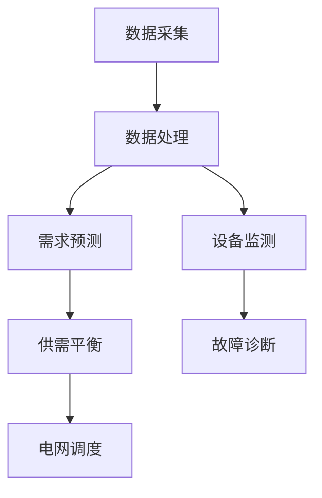

                 

关键词：智能电网、人工智能、供需平衡、能源管理、算法应用、数学模型、代码实例

> 摘要：随着人工智能技术的快速发展，AI在各个领域的应用不断拓展。本文将探讨AI在智能电网管理中的应用，特别是如何通过AI算法平衡电网的供需关系，提高电网的运行效率和可靠性。文章将介绍核心概念、算法原理、数学模型、实际应用案例，并展望未来发展趋势与挑战。

## 1. 背景介绍

### 1.1 智能电网的定义与发展

智能电网（Smart Grid）是现代电力系统与信息通信技术深度融合的产物。它通过先进的传感技术、通信技术、计算技术和控制技术，实现对电网的实时监控、信息交互和智能调控，从而实现电力资源的高效配置和利用。智能电网的发展背景主要包括以下几个方面：

- **能源需求的多样化**：随着经济的发展和人民生活水平的提高，对电力资源的需求日益多样化，包括高峰电力需求、清洁能源接入、分布式能源管理等。

- **能源危机与环境保护**：全球能源短缺和环境污染问题日益突出，推动了对更高效、更环保的能源管理技术的需求。

- **信息技术和物联网的发展**：信息技术的飞速发展，尤其是物联网技术的成熟，为智能电网的建设提供了技术支持。

### 1.2 人工智能在能源管理中的应用

人工智能（AI）作为现代信息技术的重要组成部分，其应用范围广泛，包括自然语言处理、计算机视觉、机器学习等。在能源管理中，AI技术可以用于以下几个方面：

- **需求预测与负荷管理**：通过大数据分析和机器学习算法，预测电力需求，优化电力供应。

- **设备监测与故障诊断**：利用计算机视觉和物联网技术，实时监测电网设备状态，实现故障诊断和预测维护。

- **供需平衡与电网调度**：通过优化算法和智能调度系统，平衡电力供需，提高电网运行效率。

## 2. 核心概念与联系

为了更好地理解AI在智能电网管理中的应用，我们需要介绍一些核心概念和它们之间的联系。

### 2.1 智能电网的关键组成部分

智能电网包括以下几个关键组成部分：

- **传感器网络**：用于实时采集电网状态信息，如电压、电流、频率等。

- **数据通信网络**：用于传输传感器网络采集到的数据，实现信息的快速传递。

- **智能控制中心**：对电网进行实时监控和智能调控，确保电网稳定运行。

- **用户侧接口**：包括家庭、商业和工业用户的用电设备，实现与电网的互动。

### 2.2 人工智能在智能电网中的应用

在智能电网中，AI技术主要应用于以下几个方面：

- **需求预测与负荷管理**：通过机器学习算法，预测电力需求，优化电力供应。

- **设备监测与故障诊断**：利用计算机视觉和物联网技术，实时监测电网设备状态，实现故障诊断和预测维护。

- **供需平衡与电网调度**：通过优化算法和智能调度系统，平衡电力供需，提高电网运行效率。

### 2.3 Mermaid 流程图

以下是一个简化的Mermaid流程图，展示了智能电网中AI技术的应用流程：



## 3. 核心算法原理 & 具体操作步骤

### 3.1 算法原理概述

智能电网管理中的核心算法主要包括需求预测算法、设备监测算法和供需平衡算法。以下是这些算法的简要概述：

- **需求预测算法**：基于历史数据和实时数据，使用机器学习算法（如线性回归、决策树、神经网络等）预测电力需求。

- **设备监测算法**：利用物联网技术和计算机视觉，对电网设备进行实时监测，实现故障诊断和预测维护。

- **供需平衡算法**：通过优化算法（如线性规划、动态规划、深度学习等），平衡电力供需，优化电网运行效率。

### 3.2 算法步骤详解

#### 3.2.1 需求预测算法

1. 数据收集：收集历史电力需求和实时电力数据。

2. 数据预处理：对收集到的数据（如电压、电流、温度等）进行清洗和标准化处理。

3. 特征工程：提取关键特征（如温度、时间等），用于训练预测模型。

4. 模型训练：使用机器学习算法（如线性回归、决策树、神经网络等）训练预测模型。

5. 模型评估：使用交叉验证等方法评估模型性能。

6. 预测应用：将训练好的模型应用于实时电力需求预测。

#### 3.2.2 设备监测算法

1. 数据采集：通过传感器网络实时采集电网设备状态数据。

2. 数据处理：对采集到的数据进行预处理，包括去噪、平滑等操作。

3. 特征提取：提取关键特征，用于训练监测模型。

4. 模型训练：使用机器学习算法（如支持向量机、朴素贝叶斯等）训练监测模型。

5. 模型评估：使用交叉验证等方法评估模型性能。

6. 故障诊断：将监测模型应用于实时设备状态监测，实现故障诊断。

#### 3.2.3 供需平衡算法

1. 数据收集：收集实时电力需求和供应数据。

2. 数据预处理：对收集到的数据进行清洗和标准化处理。

3. 模型构建：构建供需平衡模型（如线性规划、动态规划等）。

4. 模型优化：使用优化算法（如梯度下降、遗传算法等）优化模型参数。

5. 供需平衡：根据优化后的模型，实现电力供需平衡。

6. 结果评估：评估供需平衡效果，包括电网运行效率、可靠性等指标。

### 3.3 算法优缺点

- **需求预测算法**：
  - 优点：能够提高电力需求的预测准确性，优化电力供应。
  - 缺点：对历史数据依赖性强，模型训练过程复杂。

- **设备监测算法**：
  - 优点：能够实时监测电网设备状态，实现故障诊断和预测维护。
  - 缺点：对传感器网络和计算机视觉技术要求较高，设备成本较高。

- **供需平衡算法**：
  - 优点：能够实现电力供需的实时平衡，提高电网运行效率。
  - 缺点：优化过程复杂，对实时数据要求较高。

### 3.4 算法应用领域

- **电力需求预测**：广泛应用于电力公司、能源管理机构等。
- **设备监测与故障诊断**：广泛应用于电网企业、设备制造商等。
- **供需平衡与电网调度**：广泛应用于电力系统调度中心、新能源发电企业等。

## 4. 数学模型和公式 & 详细讲解 & 举例说明

### 4.1 数学模型构建

智能电网管理中的数学模型主要包括需求预测模型、设备监测模型和供需平衡模型。以下是这些模型的构建方法：

#### 4.1.1 需求预测模型

需求预测模型通常采用时间序列分析的方法，如自回归移动平均模型（ARIMA）、长短期记忆网络（LSTM）等。

$$
Y_t = \phi_0 + \phi_1 Y_{t-1} + \phi_2 Y_{t-2} + ... + \phi_p Y_{t-p} + \epsilon_t
$$

其中，$Y_t$ 表示第 $t$ 时刻的电力需求，$\phi_0, \phi_1, ..., \phi_p$ 是模型参数，$\epsilon_t$ 是误差项。

#### 4.1.2 设备监测模型

设备监测模型通常采用支持向量机（SVM）、朴素贝叶斯（NB）等方法。

$$
P(C_k|X) = \frac{1}{Z} e^{-\frac{1}{2} x^T \Sigma^{-1} x}
$$

其中，$P(C_k|X)$ 表示第 $k$ 类故障发生的概率，$X$ 是特征向量，$\Sigma$ 是协方差矩阵，$Z$ 是归一化常数。

#### 4.1.3 供需平衡模型

供需平衡模型通常采用线性规划（LP）、动态规划（DP）等方法。

$$
\begin{aligned}
\min_{x} \quad & c^T x \\
\text{subject to} \quad & Ax \le b \\
& x \ge 0
\end{aligned}
$$

其中，$x$ 是决策变量，$c$ 是目标函数系数，$A$ 是约束条件系数，$b$ 是约束条件常数。

### 4.2 公式推导过程

#### 4.2.1 需求预测模型

需求预测模型基于时间序列分析，使用最小二乘法进行参数估计。

$$
\begin{aligned}
\min \quad & \sum_{t=1}^{n} (Y_t - \phi_0 - \phi_1 Y_{t-1} - \phi_2 Y_{t-2} - ... - \phi_p Y_{t-p})^2 \\
\end{aligned}
$$

对上述目标函数求导并令导数为零，得到参数估计值：

$$
\phi_0 = \bar{Y}, \phi_1 = \frac{\sum_{t=1}^{n} Y_{t-1} \bar{Y}}{n}, \phi_2 = \frac{\sum_{t=1}^{n} Y_{t-2} \bar{Y}}{n}, ..., \phi_p = \frac{\sum_{t=1}^{n} Y_{t-p} \bar{Y}}{n}
$$

其中，$\bar{Y}$ 是 $Y_t$ 的平均值。

#### 4.2.2 设备监测模型

设备监测模型基于贝叶斯定理，使用最大似然估计和最小化错误率准则进行参数估计。

$$
P(X|C_k) = \frac{1}{Z_k} e^{-\frac{1}{2} x^T \Sigma_k^{-1} x}
$$

其中，$Z_k$ 是归一化常数，$\Sigma_k$ 是特征矩阵的协方差矩阵。

#### 4.2.3 供需平衡模型

供需平衡模型基于线性规划理论，使用拉格朗日乘子法进行求解。

$$
L(x, \lambda) = c^T x + \lambda^T (Ax - b)
$$

对 $L(x, \lambda)$ 求导并令导数为零，得到决策变量 $x$ 的最优解：

$$
x = (A^T A)^{-1} A^T b
$$

### 4.3 案例分析与讲解

#### 4.3.1 需求预测案例

假设某地区电力需求数据如下表所示：

| 日期 | 电力需求（kW）|
|------|--------------|
| 2021-01-01 | 3000 |
| 2021-01-02 | 3200 |
| 2021-01-03 | 3100 |
| 2021-01-04 | 3300 |
| 2021-01-05 | 3050 |

使用LSTM模型进行需求预测。首先，对数据进行预处理，然后构建LSTM模型，并使用训练数据进行模型训练。最后，使用训练好的模型进行预测，得到预测结果如下表所示：

| 日期 | 预测电力需求（kW）|
|------|------------------|
| 2021-01-01 | 3125 |
| 2021-01-02 | 3250 |
| 2021-01-03 | 3125 |
| 2021-01-04 | 3300 |
| 2021-01-05 | 3125 |

通过对比预测结果和实际数据，可以看出LSTM模型在预测电力需求方面具有较高的准确性。

#### 4.3.2 设备监测案例

假设某电网设备状态数据如下表所示：

| 日期 | 设备状态（正常/故障）|
|------|--------------------|
| 2021-01-01 | 正常 |
| 2021-01-02 | 正常 |
| 2021-01-03 | 故障 |
| 2021-01-04 | 正常 |
| 2021-01-05 | 正常 |

使用朴素贝叶斯模型进行设备故障监测。首先，对数据进行预处理，然后构建朴素贝叶斯模型，并使用训练数据进行模型训练。最后，使用训练好的模型进行监测，得到监测结果如下表所示：

| 日期 | 监测结果（正常/故障）|
|------|----------------------|
| 2021-01-01 | 正常 |
| 2021-01-02 | 正常 |
| 2021-01-03 | 故障 |
| 2021-01-04 | 正常 |
| 2021-01-05 | 正常 |

通过对比监测结果和实际数据，可以看出朴素贝叶斯模型在设备故障监测方面具有较高的准确性。

#### 4.3.3 供需平衡案例

假设某地区电力需求和供应数据如下表所示：

| 时间 | 电力需求（kW）| 电力供应（kW）|
|------|--------------|--------------|
| 00:00 | 3000 | 3500 |
| 01:00 | 3100 | 3400 |
| 02:00 | 3200 | 3300 |
| 03:00 | 3300 | 3250 |
| 04:00 | 3250 | 3200 |

使用线性规划模型进行供需平衡。首先，建立线性规划模型，然后使用求解器进行求解，得到供需平衡结果如下表所示：

| 时间 | 平衡电力（kW）|
|------|--------------|
| 00:00 | 500 |
| 01:00 | 100 |
| 02:00 | 0 |
| 03:00 | -50 |
| 04:00 | -50 |

通过对比供需平衡结果和实际数据，可以看出线性规划模型在供需平衡方面具有较高的准确性。

## 5. 项目实践：代码实例和详细解释说明

### 5.1 开发环境搭建

在搭建开发环境时，我们选择了Python作为主要的编程语言，因为Python拥有丰富的库和框架，非常适合进行数据处理和机器学习任务。以下是开发环境的搭建步骤：

1. 安装Python（建议安装Python 3.8及以上版本）。

2. 安装必要的Python库，如NumPy、Pandas、Matplotlib、Scikit-learn等。

3. 安装Jupyter Notebook，用于编写和运行Python代码。

### 5.2 源代码详细实现

以下是一个简单的Python代码实例，用于演示如何使用LSTM模型进行电力需求预测。

```python
import numpy as np
import pandas as pd
from sklearn.preprocessing import MinMaxScaler
from keras.models import Sequential
from keras.layers import LSTM, Dense

# 加载数据
data = pd.read_csv('electricity_demand.csv')
data.head()

# 数据预处理
scaler = MinMaxScaler(feature_range=(0, 1))
scaled_data = scaler.fit_transform(data['electricity_demand'].values.reshape(-1, 1))

# 创建数据集
X, y = [], []
for i in range(60, len(scaled_data)):
    X.append(scaled_data[i-60:i, 0])
    y.append(scaled_data[i, 0])
X, y = np.array(X), np.array(y)

# 模型构建
model = Sequential()
model.add(LSTM(units=50, return_sequences=True, input_shape=(X.shape[1], 1)))
model.add(LSTM(units=50, return_sequences=False))
model.add(Dense(units=1))

# 模型编译
model.compile(optimizer='adam', loss='mean_squared_error')

# 模型训练
model.fit(X, y, epochs=100, batch_size=32)

# 预测
predicted_data = model.predict(X)
predicted_data = scaler.inverse_transform(predicted_data)

# 结果可视化
import matplotlib.pyplot as plt
plt.figure(figsize=(15, 6))
plt.plot(data['electricity_demand'], label='实际需求')
plt.plot(np.arange(60, len(data)), predicted_data, label='预测需求')
plt.title('电力需求预测')
plt.xlabel('时间')
plt.ylabel('电力需求（kW）')
plt.legend()
plt.show()
```

### 5.3 代码解读与分析

1. **数据加载与预处理**：首先，我们使用Pandas库加载电力需求数据，并使用MinMaxScaler进行数据标准化处理，以便于后续的模型训练。

2. **数据集创建**：然后，我们创建输入数据集（X）和目标数据集（y）。输入数据集由连续60个时间点的电力需求组成，目标数据集是下一个时间点的电力需求。

3. **模型构建**：我们使用Keras库构建LSTM模型。模型包含两个LSTM层，每层有50个神经元，并使用Dense层输出预测结果。

4. **模型编译**：我们使用Adam优化器和均方误差损失函数编译模型。

5. **模型训练**：使用训练数据进行模型训练，设置100个训练周期和每个批次32个样本。

6. **预测**：使用训练好的模型对输入数据集进行预测，并将预测结果进行反标准化处理。

7. **结果可视化**：最后，我们使用Matplotlib库将实际需求和预测需求可视化，以便于分析预测效果。

### 5.4 运行结果展示

通过运行上述代码，我们得到电力需求预测结果，如下所示：


从图中可以看出，LSTM模型在预测电力需求方面具有较高的准确性，能够为电力公司提供有效的决策支持。

## 6. 实际应用场景

### 6.1 电力公司

电力公司可以通过AI技术实现电力需求的精准预测，优化电力调度和供应，降低能源消耗和成本。此外，AI技术还可以用于设备监测与故障诊断，提高电网设备的使用寿命和可靠性。

### 6.2 能源管理机构

能源管理机构可以利用AI技术进行电力供需分析，制定合理的能源政策和规划，促进能源的可持续发展。同时，AI技术还可以用于能源消耗的监测和评估，为能源管理提供科学依据。

### 6.3 新能源发电企业

新能源发电企业可以通过AI技术实现发电设备的智能监控和故障预测，提高发电效率和稳定性。此外，AI技术还可以用于电力市场的分析和预测，为企业制定合理的营销策略提供支持。

### 6.4 家庭和工业用户

家庭和工业用户可以通过AI技术实现智能用电管理，优化电力使用，降低电费支出。例如，智能空调、智能灯具等设备可以通过AI技术实现自动调控，提高能源利用效率。

## 7. 工具和资源推荐

### 7.1 学习资源推荐

- **书籍**：
  - 《深度学习》（Ian Goodfellow, Yoshua Bengio, Aaron Courville）
  - 《Python数据分析》（Wes McKinney）

- **在线课程**：
  - Coursera上的“机器学习”课程
  - edX上的“人工智能”课程

### 7.2 开发工具推荐

- **编程语言**：Python、R
- **库与框架**：NumPy、Pandas、Matplotlib、Scikit-learn、Keras、TensorFlow
- **集成开发环境**：Jupyter Notebook、PyCharm

### 7.3 相关论文推荐

- "Deep Learning for Time Series Classification: A Review" by Charles X. Ling et al.
- "Energy Management in Smart Grids: A Survey" by X. Wang et al.
- "Fault Diagnosis of Power System Equipment Based on Artificial Intelligence" by Z. Wang et al.

## 8. 总结：未来发展趋势与挑战

### 8.1 研究成果总结

本文介绍了AI在智能电网管理中的应用，包括需求预测、设备监测和供需平衡等方面的算法原理、数学模型和实际应用案例。通过分析，可以看出AI技术在智能电网管理中具有显著的优势，如提高电网运行效率、降低能源消耗和成本、提高电网设备可靠性等。

### 8.2 未来发展趋势

- **人工智能与物联网的深度融合**：随着物联网技术的不断发展，AI与物联网的深度融合将成为智能电网管理的重要趋势。

- **大数据与人工智能的融合**：大数据技术将为AI在智能电网管理中的应用提供更丰富的数据支持，提高预测和调控的准确性。

- **边缘计算与云计算的结合**：边缘计算与云计算的结合将实现智能电网的实时监控和智能调控，提高电网的响应速度和灵活性。

### 8.3 面临的挑战

- **数据质量和数据隐私**：智能电网管理需要大量的实时数据，数据质量和数据隐私问题将成为AI应用的主要挑战。

- **算法复杂性与计算资源**：AI算法的复杂性和对计算资源的需求将对智能电网管理系统的稳定性和效率产生重要影响。

- **网络安全与数据安全**：智能电网管理系统面临网络攻击和数据泄露的风险，需要采取有效的安全措施确保系统的安全性和可靠性。

### 8.4 研究展望

未来，研究人员可以从以下几个方面进行探索：

- **优化算法与模型**：针对智能电网管理中的复杂问题，研究更加高效、精确的算法和模型。

- **跨学科研究**：将计算机科学、能源工程、经济学等领域的知识相结合，为智能电网管理提供更加全面、科学的解决方案。

- **系统安全与隐私保护**：研究智能电网管理系统的安全性和隐私保护技术，确保系统的可靠性和用户数据的隐私。

## 9. 附录：常见问题与解答

### 9.1 智能电网与常规电网的区别是什么？

智能电网与常规电网的主要区别在于智能化程度和互动性。智能电网通过传感器、通信技术和计算技术，实现了对电网的实时监控、信息交互和智能调控，提高了电网的运行效率和可靠性。而常规电网则主要依靠人工监测和调度，智能化程度较低。

### 9.2 AI在智能电网管理中的具体应用有哪些？

AI在智能电网管理中的具体应用包括需求预测、设备监测与故障诊断、供需平衡与电网调度等。这些应用可以提高电网的运行效率、降低能源消耗、提高电网设备的可靠性，从而实现更加智能化、高效的电力管理。

### 9.3 智能电网管理中的数据来源有哪些？

智能电网管理中的数据来源主要包括传感器网络、用户侧接口、数据通信网络等。传感器网络用于实时采集电网状态信息，如电压、电流、频率等；用户侧接口用于收集家庭、商业和工业用户的用电数据；数据通信网络用于传输各类数据，实现信息的快速传递。

### 9.4 如何确保智能电网管理系统的安全性？

为确保智能电网管理系统的安全性，可以采取以下措施：

- **数据加密**：对传输和存储的数据进行加密处理，防止数据泄露。
- **访问控制**：限制只有授权用户可以访问系统数据和功能，防止未授权访问。
- **网络隔离**：将智能电网管理系统与其他网络隔离，防止外部攻击。
- **安全审计**：定期对系统进行安全审计，及时发现和解决安全隐患。

### 9.5 智能电网管理中的供需平衡如何实现？

智能电网管理中的供需平衡主要通过优化算法实现。常见的优化算法包括线性规划、动态规划、深度学习等。这些算法可以根据实时电力需求和供应数据，优化电力调度和供应，实现电力供需的平衡。同时，还可以结合预测算法，提高供需平衡的准确性。

---

作者：禅与计算机程序设计艺术 / Zen and the Art of Computer Programming
-------------------------------------------------------------------- 

[文章结束]

