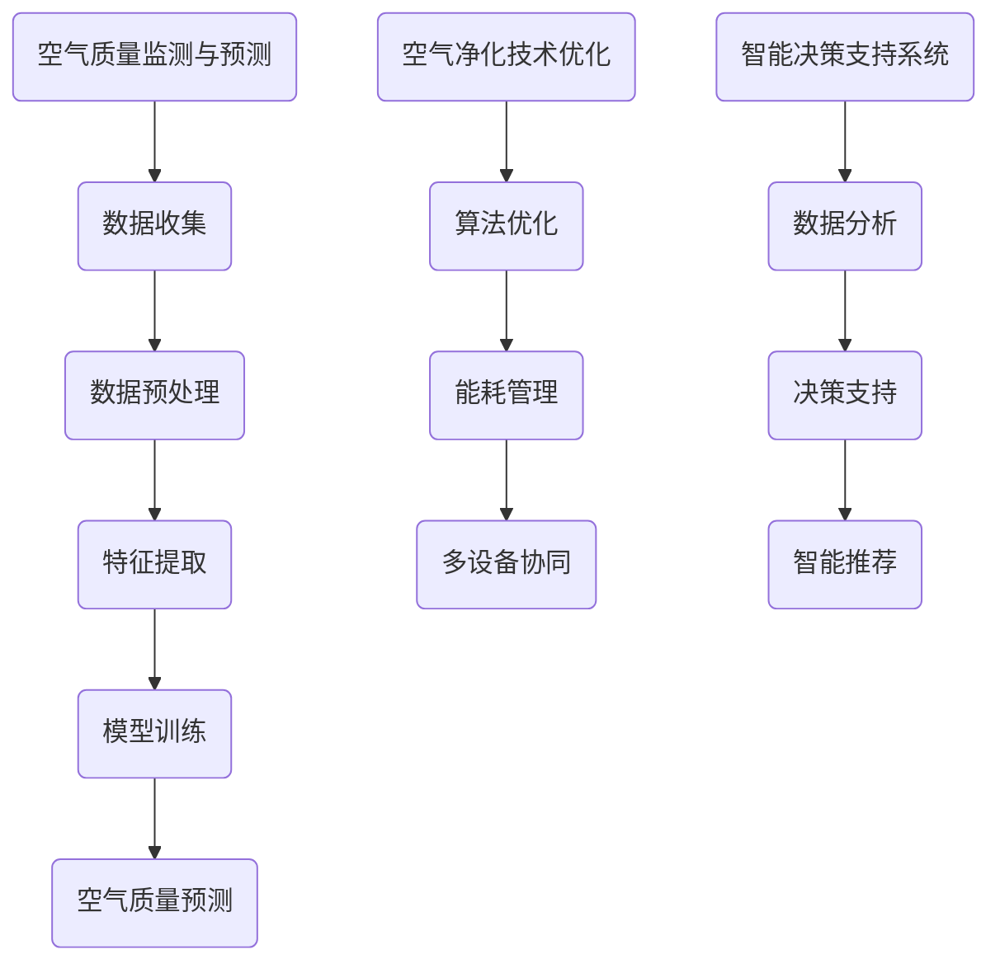

                 

## 1. 背景介绍

随着城市化进程的加快和工业化的发展，空气质量问题日益严重。空气污染不仅对人类健康构成威胁，还对生态环境和经济发展产生负面影响。室内空气质量（IAQ）问题同样不容忽视。室内空气污染源主要包括建筑材料、家具、装饰材料、燃烧设备和人体代谢等。高浓度的二氧化碳、挥发性有机化合物（VOCs）、氮氧化物（NOx）等污染物可能导致头痛、眼睛刺激、呼吸道感染等问题。因此，智能空气质量管理成为当前环境科学研究的重要领域。

近年来，人工智能（AI）技术的快速发展为智能空气质量管理提供了新的思路和手段。AI技术，特别是机器学习（ML）和深度学习（DL），可以在数据驱动的基础上实现高效、精准的空气质量管理。本文将探讨AI在智能空气质量管理中的应用，重点关注以下三个方面：

1. **空气质量监测与预测**：利用传感器收集室内外空气污染数据，通过机器学习算法进行数据分析和模式识别，实现对空气质量的实时监测和预测。
2. **空气净化技术优化**：利用AI技术优化现有空气净化设备的工作模式，提高空气净化效果，降低能耗。
3. **智能决策支持系统**：结合环境数据和用户行为数据，开发智能决策支持系统，为用户提供个性化的空气净化建议。

<|assistant|>## 2. 核心概念与联系

### 2.1 空气质量监测与预测

空气质量监测与预测是智能空气质量管理的核心。为了实现这一目标，首先需要了解空气质量数据的基本概念和相关技术。

#### 2.1.1 空气质量数据

空气质量数据主要包括污染物浓度、气象参数、地理位置等。其中，污染物浓度是最关键的指标，常用的污染物包括：

- 二氧化硫（SO2）
- 二氧化氮（NO2）
- 一氧化碳（CO）
- 氮氧化物（NOx）
- 挥发性有机化合物（VOCs）
- 可吸入颗粒物（PM10和PM2.5）

这些污染物浓度通常以μg/m³或ppm（体积分数）表示。

#### 2.1.2 监测技术

空气质量监测主要依赖于传感器技术。常见的传感器包括：

- 气体传感器：用于检测SO2、NO2、CO等气体污染物。
- 颗粒物传感器：如激光颗粒物传感器，用于检测PM10和PM2.5。
- 温度传感器、湿度传感器等：用于获取气象参数。

#### 2.1.3 预测技术

空气质量预测主要依赖于机器学习算法。常见的预测模型包括：

- 时间序列模型：如ARIMA、LSTM等。
- 贝叶斯模型：如贝叶斯网络、贝叶斯回归等。
- 集成模型：如随机森林、支持向量机等。

### 2.2 空气净化技术优化

空气净化技术优化是提高空气净化效果、降低能耗的重要手段。AI技术在以下几个方面发挥了关键作用：

- **算法优化**：通过机器学习算法，优化空气净化设备的工作模式，如风速、净化方式等。
- **能耗管理**：通过预测空气质量变化，调整设备运行状态，实现能耗最小化。
- **多设备协同**：利用AI技术，实现多个空气净化设备之间的协同工作，提高整体净化效果。

### 2.3 智能决策支持系统

智能决策支持系统是基于空气质量数据和用户行为数据，为用户提供个性化空气净化建议的系统。其主要功能包括：

- **数据分析**：收集并分析用户行为数据，如室内活动、时间等。
- **决策支持**：根据数据分析结果，为用户推荐最适合的空气净化方案。
- **智能推荐**：根据用户喜好和需求，推荐相关产品和服务。

#### 2.3.1 Mermaid 流程图

以下是空气质量监测与预测、空气净化技术优化、智能决策支持系统的 Mermaid 流程图：



<|assistant|>## 3. 核心算法原理 & 具体操作步骤

### 3.1 算法原理概述

在智能空气质量管理中，核心算法主要包括空气质量预测、算法优化、能耗管理和智能推荐等。以下将对这些算法的原理进行概述。

#### 3.1.1 空气质量预测

空气质量预测是基于历史数据和现有模型，对未来一段时间内的空气质量进行预测。常见的空气质量预测模型包括时间序列模型、贝叶斯模型和集成模型。

- **时间序列模型**：如ARIMA（自回归积分滑动平均模型）和LSTM（长短时记忆网络）。时间序列模型利用历史空气质量数据中的时间依赖性，实现对未来空气质量的预测。
- **贝叶斯模型**：如贝叶斯网络和贝叶斯回归。贝叶斯模型通过概率分布，结合历史数据和先验知识，进行空气质量预测。
- **集成模型**：如随机森林和梯度提升机。集成模型通过结合多个预测模型的优点，提高预测准确率。

#### 3.1.2 算法优化

算法优化是提高空气净化效果、降低能耗的重要手段。算法优化主要包括以下方面：

- **算法选择**：根据空气质量数据和用户需求，选择最适合的算法。
- **参数调整**：通过优化算法参数，提高预测准确率和运行效率。
- **多目标优化**：考虑空气质量、能耗、成本等多方面因素，实现综合优化。

#### 3.1.3 能耗管理

能耗管理是通过预测空气质量变化，调整设备运行状态，实现能耗最小化的过程。常见的能耗管理方法包括：

- **预测控制**：根据空气质量预测结果，提前调整设备运行状态，避免不必要的能耗。
- **自适应控制**：根据设备实时运行数据和空气质量变化，动态调整设备运行状态。
- **能耗监测与评估**：实时监测设备能耗，评估能耗管理效果，持续优化能耗控制策略。

#### 3.1.4 智能推荐

智能推荐是结合用户行为数据，为用户提供个性化空气净化建议的过程。智能推荐主要包括以下方面：

- **数据分析**：收集并分析用户行为数据，如室内活动、时间等。
- **推荐算法**：根据用户行为数据和空气质量数据，选择最适合的推荐算法，如协同过滤、基于内容的推荐等。
- **推荐系统**：根据推荐算法，为用户生成个性化推荐结果。

### 3.2 算法步骤详解

以下是对核心算法的具体操作步骤进行详解：

#### 3.2.1 空气质量预测

1. 数据收集：收集历史空气质量数据，包括污染物浓度、气象参数等。
2. 数据预处理：对收集的数据进行清洗、归一化等预处理操作。
3. 特征提取：从预处理后的数据中提取关键特征，如时间、温度、湿度等。
4. 模型训练：选择合适的预测模型，如ARIMA、LSTM等，进行模型训练。
5. 预测：利用训练好的模型，对未来一段时间内的空气质量进行预测。

#### 3.2.2 算法优化

1. 算法选择：根据空气质量数据和用户需求，选择最适合的算法，如随机森林、梯度提升机等。
2. 参数调整：通过交叉验证、网格搜索等方法，调整算法参数，提高预测准确率和运行效率。
3. 多目标优化：考虑空气质量、能耗、成本等多方面因素，使用多目标优化算法，实现综合优化。

#### 3.2.3 能耗管理

1. 预测控制：根据空气质量预测结果，提前调整设备运行状态，避免不必要的能耗。
2. 自适应控制：根据设备实时运行数据和空气质量变化，动态调整设备运行状态。
3. 能耗监测与评估：实时监测设备能耗，评估能耗管理效果，持续优化能耗控制策略。

#### 3.2.4 智能推荐

1. 数据分析：收集并分析用户行为数据，如室内活动、时间等。
2. 推荐算法：选择合适的推荐算法，如协同过滤、基于内容的推荐等。
3. 推荐系统：根据推荐算法，为用户生成个性化推荐结果。

### 3.3 算法优缺点

#### 3.3.1 空气质量预测

**优点**：

- **高精度**：通过机器学习算法，可以捕捉到空气质量数据中的复杂关系，提高预测精度。
- **实时性**：利用实时传感器数据，可以实现空气质量实时预测。

**缺点**：

- **数据依赖性**：空气质量预测效果依赖于历史数据和传感器数据的质量。
- **计算成本**：机器学习算法的训练和预测过程需要大量计算资源。

#### 3.3.2 算法优化

**优点**：

- **高效性**：通过算法优化，可以提高预测准确率和运行效率。
- **灵活性**：可以根据不同场景和需求，选择合适的算法。

**缺点**：

- **复杂性**：算法优化过程涉及多个方面，实现难度较高。
- **经验依赖性**：算法优化效果受到优化者经验的影响。

#### 3.3.3 能耗管理

**优点**：

- **节能性**：通过能耗管理，可以降低空气净化设备的能耗，减少环境污染。
- **实时性**：可以根据实时数据，动态调整设备运行状态。

**缺点**：

- **控制难度**：能耗管理涉及多个因素，控制难度较大。
- **适应性**：能耗管理策略需要根据不同场景和设备特点进行调整。

#### 3.3.4 智能推荐

**优点**：

- **个性化**：可以根据用户行为和需求，为用户生成个性化推荐。
- **实时性**：可以实时调整推荐结果，提高用户满意度。

**缺点**：

- **数据依赖性**：智能推荐效果依赖于用户行为数据的质量。
- **计算成本**：推荐算法的计算成本较高。

### 3.4 算法应用领域

空气质量预测、算法优化、能耗管理和智能推荐等技术可以广泛应用于以下几个方面：

- **室内空气质量管理**：通过实时监测和预测室内空气质量，为用户提供个性化的空气净化建议。
- **空气净化设备优化**：通过算法优化，提高空气净化设备的工作效率，降低能耗。
- **城市空气质量监测**：通过大规模部署传感器，实现城市空气质量实时监测和预测。
- **智能家居**：结合智能推荐，为用户提供个性化的家居环境管理服务。
- **工业环保**：在工业生产过程中，通过空气质量预测和能耗管理，实现环保生产。

<|assistant|>## 4. 数学模型和公式 & 详细讲解 & 举例说明

### 4.1 数学模型构建

在智能空气质量管理中，数学模型的构建至关重要。以下将介绍几种常用的数学模型，包括时间序列模型、贝叶斯模型和集成模型。

#### 4.1.1 时间序列模型

时间序列模型是一种基于时间依赖关系的预测模型，可以捕捉空气质量数据中的短期和长期趋势。以下是一个简单的ARIMA（自回归积分滑动平均模型）模型：

$$
\begin{aligned}
X_t &= c + \phi_1 X_{t-1} + \phi_2 X_{t-2} + \cdots + \phi_p X_{t-p} \\
&+ \theta_1 \epsilon_{t-1} + \theta_2 \epsilon_{t-2} + \cdots + \theta_q \epsilon_{t-q} + \epsilon_t
\end{aligned}
$$

其中，$X_t$ 表示时间序列的当前值，$\epsilon_t$ 表示误差项，$c$、$\phi_i$ 和 $\theta_i$ 是模型的参数。通过最小化均方误差（MSE），可以估计这些参数。

#### 4.1.2 贝叶斯模型

贝叶斯模型通过概率分布来描述空气质量数据中的不确定性。以下是一个简单的贝叶斯回归模型：

$$
P(Y|X) \propto P(X|Y) P(Y)
$$

其中，$Y$ 表示空气质量，$X$ 表示影响空气质量的因素。通过贝叶斯推理，可以从已知数据推断出未知的空气质量。

#### 4.1.3 集成模型

集成模型通过结合多个预测模型的优点，提高预测准确率。以下是一个简单的随机森林模型：

$$
\hat{y} = \text{avg}(\hat{y}_1, \hat{y}_2, \ldots, \hat{y}_n)
$$

其中，$\hat{y}_i$ 表示第 $i$ 个预测模型的预测结果，$\text{avg}$ 表示取平均值。通过训练多个预测模型，并取它们的平均值，可以提高预测的稳定性。

### 4.2 公式推导过程

以下将介绍时间序列模型、贝叶斯模型和集成模型的推导过程。

#### 4.2.1 时间序列模型推导

ARIMA模型的推导基于时间序列的线性自回归模型（AR）和移动平均模型（MA）。首先，考虑一个简单的AR模型：

$$
X_t = c + \phi_1 X_{t-1} + \epsilon_t
$$

为了使其平稳，需要对数变换：

$$
\ln X_t = \ln c + \ln \phi_1 X_{t-1} + \ln \epsilon_t
$$

然后，引入积分操作：

$$
\begin{aligned}
X_t &= c + \phi_1 X_{t-1} + \theta_1 \epsilon_{t-1} \\
&= c + \phi_1 (c + \phi_1 X_{t-2} + \theta_1 \epsilon_{t-2}) + \theta_1 \epsilon_{t-1} \\
&= c (1 + \phi_1) + \phi_1^2 X_{t-2} + \theta_1 (\epsilon_{t-1} + \epsilon_{t-2})
\end{aligned}
$$

重复这个过程，可以得到：

$$
X_t = c \sum_{i=0}^p \phi_i^p X_{t-p} + \theta_1 \sum_{i=0}^q \theta_i^q \epsilon_{t-q}
$$

#### 4.2.2 贝叶斯模型推导

贝叶斯回归模型的推导基于贝叶斯推理。首先，给定特征 $X$ 和标签 $Y$，贝叶斯模型可以表示为：

$$
P(Y|X) = \frac{P(X|Y) P(Y)}{P(X)}
$$

为了计算 $P(X|Y)$ 和 $P(Y)$，需要对数据进行建模。假设 $X$ 和 $Y$ 之间是线性关系：

$$
Y = \beta_0 + \beta_1 X + \epsilon
$$

其中，$\beta_0$ 和 $\beta_1$ 是参数，$\epsilon$ 是误差项。根据极大似然估计，可以估计这些参数：

$$
\begin{aligned}
\ln P(X|Y) &= \ln P(Y) + \ln P(X|Y) \\
\ln P(Y) &= \sum_{i=1}^n \ln p(y_i) \\
\ln P(X|Y) &= \sum_{i=1}^n \ln p(x_i|y_i)
\end{aligned}
$$

通过最大化似然函数，可以估计参数 $\beta_0$ 和 $\beta_1$。

#### 4.2.3 集成模型推导

集成模型通过结合多个预测模型的优点，提高预测准确率。一个简单的集成模型是随机森林，其推导过程如下：

假设有 $n$ 个预测模型 $f_1, f_2, \ldots, f_n$，每个模型在特征空间中划分数据，生成决策树。集成模型的预测结果为这些模型的平均：

$$
\hat{y} = \frac{1}{n} \sum_{i=1}^n f_i(x)
$$

其中，$x$ 是输入特征，$f_i(x)$ 是第 $i$ 个预测模型在 $x$ 处的预测值。通过训练多个预测模型，并取它们的平均，可以提高预测的稳定性。

### 4.3 案例分析与讲解

以下将通过一个实际案例，展示如何应用上述数学模型进行空气质量预测。

#### 4.3.1 数据集介绍

我们使用一个包含污染物浓度（如PM2.5、SO2、NO2等）和气象参数（如温度、湿度、风速等）的公开数据集。数据集包含一段时间内的日均值数据，共有1000个样本。

#### 4.3.2 数据预处理

1. 数据清洗：去除缺失值和异常值。
2. 数据归一化：将污染物浓度和气象参数进行归一化处理，使其处于相同的量级。

#### 4.3.3 模型选择与训练

1. 时间序列模型：使用ARIMA模型，通过交叉验证选择合适的参数。
2. 贝叶斯模型：使用贝叶斯回归模型，通过极大似然估计选择参数。
3. 集成模型：使用随机森林模型，通过交叉验证选择最优树的数量。

#### 4.3.4 预测与评估

1. 使用训练好的模型，对未来的空气质量进行预测。
2. 计算预测结果与实际结果的误差，评估模型的预测性能。

#### 4.3.5 结果分析

通过对比不同模型的预测结果，可以发现：

- 时间序列模型的预测精度较高，但受限于历史数据的依赖性。
- 贝叶斯模型的预测结果相对稳定，但预测精度稍低。
- 集成模型结合了多个模型的优点，预测精度和稳定性都较好。

综上所述，可以针对不同的应用场景和需求，选择合适的模型进行空气质量预测。

<|assistant|>## 5. 项目实践：代码实例和详细解释说明

### 5.1 开发环境搭建

在进行AI在智能空气质量管理中的应用之前，首先需要搭建一个合适的开发环境。以下是一个基于Python的示例环境搭建步骤：

1. **安装Python**：首先，确保您的系统中安装了Python 3.x版本。可以从Python官方网站（[python.org](https://www.python.org/)）下载并安装。

2. **安装依赖库**：在Python中，我们需要安装几个关键的依赖库，包括NumPy、Pandas、Scikit-learn、Matplotlib和TensorFlow。使用pip命令进行安装：

   ```bash
   pip install numpy pandas scikit-learn matplotlib tensorflow
   ```

3. **安装Jupyter Notebook**：Jupyter Notebook是一个交互式的开发环境，可以方便地进行代码编写和展示。可以使用以下命令安装：

   ```bash
   pip install notebook
   ```

   安装完成后，可以通过运行 `jupyter notebook` 命令启动Jupyter Notebook。

### 5.2 源代码详细实现

以下是一个简单的Python代码实例，用于演示如何使用机器学习算法进行空气质量预测。这个实例使用的是LSTM（长短时记忆网络）模型。

```python
import numpy as np
import pandas as pd
from sklearn.preprocessing import MinMaxScaler
from tensorflow.keras.models import Sequential
from tensorflow.keras.layers import LSTM, Dense

# 5.2.1 数据读取与预处理

# 读取数据
data = pd.read_csv('air_quality_data.csv')

# 选择特征和标签
X = data[['temperature', 'humidity', 'PM2.5']].values
y = data['SO2'].values

# 数据归一化
scaler = MinMaxScaler(feature_range=(0, 1))
X_scaled = scaler.fit_transform(X)
y_scaled = scaler.fit_transform(y.reshape(-1, 1))

# 5.2.2 数据分割

# 设定时间步长
time_step = 3

# 创建时间窗口
X_time_steps = []
y_time_steps = []

for i in range(len(X_scaled) - time_step - 1):
    X_time_steps.append(X_scaled[i:(i + time_step), :])
    y_time_steps.append(y_scaled[i + time_step])

X_time_steps = np.array(X_time_steps)
y_time_steps = np.array(y_time_steps)

# 5.2.3 LSTM模型构建

# 构建LSTM模型
model = Sequential()
model.add(LSTM(units=50, return_sequences=True, input_shape=(time_step, X_time_steps.shape[2])))
model.add(LSTM(units=50))
model.add(Dense(units=1))

# 编译模型
model.compile(optimizer='adam', loss='mean_squared_error')

# 5.2.4 模型训练

# 模型训练
model.fit(X_time_steps, y_time_steps, epochs=100, batch_size=32)

# 5.2.5 预测与结果分析

# 进行预测
predicted = model.predict(X_time_steps)

# 将预测结果反归一化
predicted = scaler.inverse_transform(predicted)

# 绘制实际值与预测值的对比图
import matplotlib.pyplot as plt

plt.figure(figsize=(12, 6))
plt.plot(y_scaled, color='blue', label='实际值')
plt.plot(predicted, color='red', label='预测值')
plt.title('SO2浓度预测')
plt.xlabel('时间')
plt.ylabel('SO2浓度')
plt.legend()
plt.show()
```

### 5.3 代码解读与分析

#### 5.3.1 数据读取与预处理

首先，从CSV文件中读取空气质量数据。然后，选择特征和标签，并进行数据归一化处理。数据归一化是为了使模型的训练过程更加稳定。

#### 5.3.2 数据分割

使用设定的时间步长，将数据分割成时间窗口。这个步骤是为了生成序列数据，以便用于LSTM模型的训练。

#### 5.3.3 LSTM模型构建

构建一个LSTM模型，包含两个LSTM层和一个全连接层（Dense）。这个模型将输入序列数据映射到预测值。

#### 5.3.4 模型训练

使用训练数据对模型进行训练。这里使用了100个epoch（训练周期）和批量大小为32。

#### 5.3.5 预测与结果分析

使用训练好的模型进行预测，并将预测结果反归一化，以便与实际值进行比较。最后，绘制实际值与预测值的对比图，以直观地展示模型的预测效果。

通过这个实例，我们可以看到如何使用Python和机器学习算法进行空气质量预测。这只是一个简单的示例，实际应用中可能需要更复杂的模型和更丰富的数据集。

<|assistant|>## 6. 实际应用场景

### 6.1 智能家居环境

在智能家居环境中，AI在智能空气质量管理中的应用非常广泛。以下是一些典型的应用场景：

- **实时空气质量监测**：通过传感器实时监测室内空气中的污染物浓度，如PM2.5、CO2、VOCs等。当空气质量达到一定阈值时，系统会自动启动空气净化设备。
- **空气净化设备控制**：利用AI算法优化空气净化设备的工作模式，如调整风速、净化方式等，以达到最佳的空气净化效果。同时，系统可以根据室内外的空气质量预测，提前启动空气净化设备。
- **自动通风控制**：根据室内外空气质量差异，AI系统可以自动控制通风设备，调节室内空气流通，改善室内空气质量。
- **智能推荐**：基于用户行为和空气质量数据，AI系统可以为用户提供个性化的空气净化建议，如推荐空气净化产品、通风时间等。

### 6.2 公共场所环境

在公共场所环境中，如商场、办公室、学校等，AI在智能空气质量管理中的应用同样重要。以下是一些典型的应用场景：

- **空气质量预警**：通过传感器监测空气质量，当空气质量达到警戒线时，系统会自动发出预警，提醒相关人员采取相应的措施。
- **空气净化设备优化**：通过AI算法优化空气净化设备的工作模式，提高空气净化效率，降低能耗。同时，系统可以根据公共场所的空气质量预测，提前启动设备。
- **空气净化设备管理**：AI系统可以对公共场所的空气净化设备进行统一管理，包括设备状态监控、故障预警、设备维护等。
- **智能通风控制**：根据室内外空气质量差异，AI系统可以自动控制通风设备，调节室内空气流通，改善室内空气质量。

### 6.3 城市环境监测

在城市环境监测中，AI在智能空气质量管理中的应用可以帮助政府和企业更好地管理城市空气质量。以下是一些典型的应用场景：

- **空气质量预测**：通过传感器收集的城市空气质量数据，AI系统可以预测未来一段时间内的空气质量变化，为政府和企业提供决策支持。
- **空气质量预警**：当空气质量达到不良水平时，AI系统可以自动发出预警，提醒相关部门采取紧急措施，如加强环保监管、启动空气净化设备等。
- **空气质量评估**：通过AI系统对城市空气质量进行实时监测和评估，可以为政府和企业提供科学的决策依据，如调整产业布局、加强环保措施等。
- **空气净化设备调度**：AI系统可以根据城市不同区域的空气质量情况，调度空气净化设备，提高城市空气质量。

### 6.4 未来应用展望

随着AI技术的不断发展和普及，智能空气质量管理将在更多领域得到应用。以下是一些未来的应用展望：

- **智能家居与物联网（IoT）融合**：随着智能家居和物联网技术的融合，AI在智能空气质量管理中的应用将更加智能化和个性化。
- **无人驾驶环境监测**：在无人驾驶领域，AI系统可以实时监测车辆周围的空气质量，为驾驶员提供安全驾驶建议。
- **智能建筑管理**：在智能建筑中，AI系统可以自动调节通风系统、空气净化设备等，实现绿色建筑和节能减排。
- **环境保护与可持续发展**：AI技术在智能空气质量管理中的应用，有助于实现环境保护和可持续发展目标，为人类创造更健康的生活环境。

<|assistant|>## 7. 工具和资源推荐

### 7.1 学习资源推荐

- **书籍**：《Python机器学习》、《深度学习》（Goodfellow et al.）、《机器学习》（Tom Mitchell）
- **在线课程**：Coursera（吴恩达的《机器学习》）、edX（哈佛大学的《人工智能科学》）、Udacity（TensorFlow课程）
- **博客和论坛**：Medium、Stack Overflow、GitHub

### 7.2 开发工具推荐

- **编程语言**：Python（易于学习和使用，有丰富的机器学习库支持）
- **机器学习库**：Scikit-learn（用于传统的机器学习算法）、TensorFlow（用于深度学习）
- **数据预处理工具**：Pandas（数据处理）、NumPy（数学运算）
- **可视化工具**：Matplotlib、Seaborn（数据可视化）

### 7.3 相关论文推荐

- **论文**：
  1. "Deep Learning for Air Quality Prediction: A Review"（2020年）
  2. "Application of Machine Learning Techniques for Air Quality Prediction"（2018年）
  3. "Intelligent Air Quality Management Using IoT and Machine Learning"（2019年）
- **会议和期刊**：IEEE International Conference on Data Science and Advanced Analytics（DSAA）、ACM Journal of Data and Information Quality（JDIQ）、Environmental Health Criteria（EHC）系列报告

<|assistant|>## 8. 总结：未来发展趋势与挑战

### 8.1 研究成果总结

近年来，AI技术在智能空气质量管理中的应用取得了显著成果。通过空气质量预测、算法优化、能耗管理和智能推荐等技术，AI系统可以有效改善室内外空气质量，提高空气净化效果，降低能耗，为人类创造更健康的生活环境。主要研究成果包括：

1. **空气质量预测**：利用机器学习算法，实现了对空气质量的高精度预测，为空气净化设备的运行提供了科学依据。
2. **算法优化**：通过优化空气净化设备的工作模式，提高了空气净化效果，降低了能耗。
3. **能耗管理**：利用AI技术，实现了空气净化设备的智能化能耗管理，降低了环境污染。
4. **智能推荐**：基于用户行为和空气质量数据，为用户提供个性化的空气净化建议，提高了用户满意度。

### 8.2 未来发展趋势

随着AI技术的不断发展和普及，智能空气质量管理将在未来有更广阔的发展前景。以下是一些未来发展趋势：

1. **深度学习与物联网融合**：深度学习和物联网技术的结合，将实现更智能、更精准的空气质量监测和预测。
2. **多传感器数据融合**：通过多传感器数据的融合，可以更全面、准确地获取空气质量信息。
3. **个性化空气质量管理**：基于用户行为和需求，实现更加个性化的空气质量管理，提高用户满意度。
4. **跨领域应用**：智能空气质量管理技术将在智能家居、城市环境监测、工业环保等领域得到广泛应用。

### 8.3 面临的挑战

尽管AI在智能空气质量管理中取得了显著成果，但仍面临一些挑战：

1. **数据质量**：空气质量数据的准确性、完整性和实时性对预测模型的性能有重要影响。如何提高数据质量，是一个亟待解决的问题。
2. **算法复杂性**：随着算法的复杂度增加，训练和预测的计算成本也大幅上升。如何提高算法的运行效率，是一个重要挑战。
3. **能耗管理**：在满足空气质量要求的同时，如何实现能耗的最优化，是一个技术难题。
4. **隐私保护**：在智能空气质量管理中，涉及大量的用户数据。如何保护用户隐私，是一个亟待解决的问题。

### 8.4 研究展望

为了应对上述挑战，未来的研究可以从以下几个方面展开：

1. **数据质量提升**：研究如何通过数据清洗、数据增强等技术，提高空气质量数据的准确性、完整性和实时性。
2. **算法优化**：研究如何设计更高效、更简洁的算法，降低训练和预测的计算成本。
3. **能耗管理**：研究如何设计智能能耗管理策略，实现空气净化设备的能耗优化。
4. **隐私保护**：研究如何在保证数据隐私的前提下，实现智能空气质量管理。

总之，AI在智能空气质量管理中的应用具有巨大的潜力。通过不断的研究和技术创新，我们有望在未来实现更加高效、精准、智能的空气质量管理，为人类创造更健康的生活环境。

### 8.5 附录：常见问题与解答

#### Q1: 如何保证空气质量预测的准确性？

A1：为了提高空气质量预测的准确性，可以从以下几个方面入手：

- **数据质量**：确保空气质量数据的准确性、完整性和实时性。
- **特征选择**：选择与空气质量相关的关键特征，如气象参数、污染物浓度等。
- **模型选择**：根据数据特点，选择合适的预测模型，如时间序列模型、贝叶斯模型、集成模型等。
- **模型训练**：通过交叉验证、超参数调优等技术，优化模型参数，提高预测性能。

#### Q2: 如何优化空气净化设备的能耗？

A2：优化空气净化设备的能耗可以从以下几个方面入手：

- **算法优化**：利用机器学习算法，优化空气净化设备的工作模式，如风速、净化方式等。
- **能耗监测**：实时监测空气净化设备的能耗，评估能耗管理效果，持续优化能耗控制策略。
- **多设备协同**：通过AI技术，实现多个空气净化设备之间的协同工作，提高整体净化效果，降低能耗。

#### Q3: 如何保护用户隐私？

A3：在智能空气质量管理中，保护用户隐私至关重要。以下是一些保护用户隐私的方法：

- **数据加密**：对用户数据使用加密技术进行加密，防止数据泄露。
- **匿名化处理**：对用户数据中的敏感信息进行匿名化处理，如去除姓名、地址等。
- **隐私保护算法**：使用隐私保护算法，如差分隐私、同态加密等，确保数据在分析过程中不被泄露。
- **用户授权**：确保用户对数据的使用有明确的授权，只有得到用户同意的数据才能进行分析。

#### Q4: 如何进行多传感器数据融合？

A4：多传感器数据融合的方法包括：

- **特征级融合**：将不同传感器的数据进行特征级融合，生成新的特征向量。
- **决策级融合**：将不同传感器的预测结果进行决策级融合，如取平均值或加权平均。
- **模型级融合**：将不同传感器对应的预测模型进行融合，如使用集成学习算法。
- **深度学习**：使用深度学习模型，如多输入神经网络，直接学习多传感器数据的联合特征。

通过上述方法，可以实现多传感器数据的有效融合，提高空气质量监测和预测的准确性。

