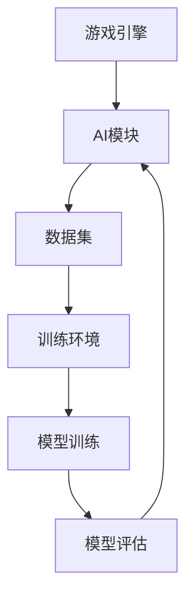

                 

关键词：人工智能，游戏开发，NPC，程序化生成，游戏引擎，算法原理，数学模型，代码实例

> 摘要：本文将探讨人工智能在游戏开发中的应用，特别是NPC（非玩家角色）的程序化生成以及相关的算法原理、数学模型和实际开发中的实践案例。通过深入分析，我们将揭示AI如何改变游戏开发的方式，提升游戏体验，以及其未来的发展前景。

## 1. 背景介绍

游戏开发作为计算机科学中的一个重要分支，随着技术的进步和用户需求的增加，其复杂性和多样性也在不断提升。在传统的游戏开发中，非玩家角色（NPC）的设计往往需要人工编写大量的脚本和规则，以模拟出复杂的行为模式。然而，这种方法不仅效率低下，而且难以实现大规模和个性化的角色生成。

随着人工智能技术的快速发展，特别是机器学习和深度学习技术的突破，游戏开发迎来了新的机遇。通过利用AI技术，可以自动生成NPC的行为模式、外观特征以及交互逻辑，从而大大提高游戏开发的效率，增强游戏的沉浸感和可玩性。

本文将围绕以下几个方面展开：

- AI在游戏开发中的核心概念与架构
- NPC的程序化生成算法原理与实现
- 数学模型在AI游戏开发中的应用
- 实际项目中的代码实例分析
- AI在游戏开发中的实际应用场景及未来展望

## 2. 核心概念与联系

### 2.1 AI在游戏开发中的核心概念

在探讨AI在游戏开发中的应用之前，首先需要了解一些核心概念：

- **机器学习（Machine Learning）**：一种让计算机从数据中学习，进而对未知数据进行预测或决策的技术。
- **深度学习（Deep Learning）**：一种特殊的机器学习技术，通过模拟人脑神经网络的结构和功能来实现高级认知任务。
- **生成对抗网络（GANs）**：一种深度学习模型，用于生成具有高度真实性的数据，如图像、音频等。
- **强化学习（Reinforcement Learning）**：一种机器学习范式，通过试错和奖励机制来学习如何在特定环境中做出最佳决策。

### 2.2 AI在游戏开发中的架构

为了更好地理解AI在游戏开发中的应用，我们需要了解其架构：

- **游戏引擎**：作为游戏开发的核心工具，负责处理游戏的渲染、物理模拟、音频等基础功能。
- **AI模块**：集成在游戏引擎中，负责处理NPC的行为、决策等AI相关任务。
- **数据集**：用于训练AI模型的各类数据，如角色外观、行为模式、对话等。
- **训练环境**：用于训练AI模型的虚拟环境，可以是模拟的场景、游戏副本等。

### 2.3 Mermaid流程图

为了更直观地展示AI在游戏开发中的应用架构，我们可以使用Mermaid流程图来表示：



## 3. 核心算法原理 & 具体操作步骤

### 3.1 算法原理概述

在游戏开发中，NPC的程序化生成主要依赖于以下几个核心算法：

- **生成对抗网络（GANs）**：用于生成NPC的外观和纹理。
- **强化学习（Reinforcement Learning）**：用于训练NPC的行为决策。
- **深度学习（Deep Learning）**：用于处理复杂的NPC行为模式。

### 3.2 算法步骤详解

1. **数据收集与预处理**

   - **收集数据**：从游戏中收集各类NPC的数据，如外观、行为、对话等。
   - **数据预处理**：对收集的数据进行清洗、归一化等处理，以便于后续的训练。

2. **生成对抗网络（GANs）训练**

   - **生成器（Generator）**：通过学习训练数据，生成NPC的外观和纹理。
   - **判别器（Discriminator）**：判断生成器生成的图像是否真实。
   - **模型训练**：通过对抗训练，使生成器和判别器不断优化，直至生成器能够生成高度真实的NPC外观。

3. **强化学习（Reinforcement Learning）训练**

   - **环境（Environment）**：模拟游戏中的各种场景和情境。
   - **策略（Policy）**：定义NPC在不同情境下的行为决策。
   - **模型训练**：通过奖励机制和试错，使NPC学会在游戏中做出合理的决策。

4. **深度学习（Deep Learning）模型训练**

   - **输入特征**：从NPC的多种特征中提取输入特征，如外观、行为、对话等。
   - **输出特征**：定义NPC的多种行为输出，如移动、攻击、对话等。
   - **模型训练**：通过多层神经网络，将输入特征映射到输出特征。

### 3.3 算法优缺点

- **生成对抗网络（GANs）**：

  - 优点：能够生成高度真实的图像和纹理，适用于NPC外观的生成。

  - 缺点：训练过程不稳定，容易陷入模式崩溃（mode collapse）的问题。

- **强化学习（Reinforcement Learning）**：

  - 优点：能够通过试错和奖励机制，使NPC学会在复杂环境中做出最佳决策。

  - 缺点：训练过程需要大量的时间和计算资源，且结果可能依赖于初始状态。

- **深度学习（Deep Learning）**：

  - 优点：能够处理复杂的非线性问题，适用于NPC行为模式的生成。

  - 缺点：模型训练需要大量的数据和计算资源，且结果可能依赖于训练数据。

### 3.4 算法应用领域

- **NPC外观生成**：利用GANs生成高度真实的NPC外观，提升游戏视觉效果。
- **NPC行为生成**：利用强化学习和深度学习，生成NPC的复杂行为模式，提升游戏玩法。
- **NPC交互生成**：利用深度学习，生成NPC的对话和交互逻辑，提升游戏沉浸感。

## 4. 数学模型和公式 & 详细讲解 & 举例说明

### 4.1 数学模型构建

在AI游戏开发中，我们通常会用到以下数学模型：

- **生成对抗网络（GANs）**：包含生成器（Generator）和判别器（Discriminator）两个部分。
- **强化学习（Reinforcement Learning）**：基于奖励机制，定义策略（Policy）。
- **深度学习（Deep Learning）**：通过多层神经网络，将输入映射到输出。

### 4.2 公式推导过程

#### 4.2.1 生成对抗网络（GANs）

生成对抗网络（GANs）的基本公式如下：

$$
\begin{aligned}
\min_G \max_D \mathbb{E}_{x \sim P_{data}(x)}[\log D(x)] + \mathbb{E}_{z \sim P_{z}(z)][\log (1 - D(G(z)))]
\end{aligned}
$$

其中，$D(x)$表示判别器对真实样本的判断，$G(z)$表示生成器对噪声样本的生成。

#### 4.2.2 强化学习（Reinforcement Learning）

强化学习的基本公式如下：

$$
\begin{aligned}
\pi(\alpha|s) &= \arg \max_\pi J(\pi) \\
J(\pi) &= \sum_s \pi(s) \cdot \sum_a \gamma^{|s'| - s|} \cdot R(s, a)
\end{aligned}
$$

其中，$\pi(\alpha|s)$表示策略在状态$s$下对动作$a$的偏好，$J(\pi)$表示策略的奖励期望。

#### 4.2.3 深度学习（Deep Learning）

深度学习的基本公式如下：

$$
\begin{aligned}
\text{输出} &= \text{激活函数}(\text{权重} \cdot \text{输入}) \\
\text{权重} &= \text{优化器}(\text{梯度} \cdot \text{权重}) \\
\text{梯度} &= \frac{\partial \text{损失函数}}{\partial \text{权重}}
\end{aligned}
$$

其中，激活函数、权重和输入是深度学习模型的基本组成部分，优化器用于更新权重，梯度用于计算权重的调整方向。

### 4.3 案例分析与讲解

以生成对抗网络（GANs）为例，我们来看一个具体的NPC外观生成的案例。

#### 案例背景

假设我们有一个角色生成任务，需要从给定的角色特征库中生成新的角色外观。角色特征包括面部特征、身体特征、服装等。

#### 模型构建

- **生成器（Generator）**：通过学习特征库中的角色特征，生成新的角色外观。
- **判别器（Discriminator）**：判断生成的角色外观是否真实。

#### 模型训练

1. **数据准备**：从特征库中提取角色特征，并划分成训练集和测试集。
2. **生成器训练**：通过对抗训练，生成器不断优化，生成更真实的角色外观。
3. **判别器训练**：通过对抗训练，判别器不断优化，提高对真实角色外观的判断能力。
4. **模型评估**：使用测试集对生成器和判别器进行评估，调整模型参数。

#### 模型应用

通过训练好的生成器和判别器，我们可以生成新的角色外观，并在游戏中应用。

## 5. 项目实践：代码实例和详细解释说明

### 5.1 开发环境搭建

在开始实际的项目实践之前，我们需要搭建一个合适的开发环境。以下是一个基本的开发环境搭建步骤：

1. 安装Python环境：确保Python版本在3.6及以上。
2. 安装必要的库：包括TensorFlow、Keras、NumPy等。
3. 准备游戏引擎：选择一个适合的游戏引擎，如Unity或Unreal Engine。
4. 准备数据集：从游戏中提取NPC特征，并整理成可用于训练的数据集。

### 5.2 源代码详细实现

以下是一个基于生成对抗网络（GANs）的NPC外观生成代码实例：

```python
import tensorflow as tf
from tensorflow.keras.layers import Dense, Flatten, Reshape
from tensorflow.keras.models import Sequential

# 生成器模型
def build_generator(z_dim):
    model = Sequential()
    model.add(Dense(128, input_dim=z_dim))
    model.add(tf.keras.layers.LeakyReLU(alpha=0.01))
    model.add(Dense(256))
    model.add(tf.keras.layers.LeakyReLU(alpha=0.01))
    model.add(Dense(512))
    model.add(tf.keras.layers.LeakyReLU(alpha=0.01))
    model.add(Flatten())
    model.add(Reshape((64, 64, 3)))
    model.add(tf.keras.layers.Conv2D(1, kernel_size=(5, 5), activation='tanh'))
    return model

# 判别器模型
def build_discriminator(img_shape):
    model = Sequential()
    model.add(tf.keras.layers.Conv2D(32, kernel_size=(5, 5), strides=(2, 2), padding='same', input_shape=img_shape))
    model.add(tf.keras.layers.LeakyReLU(alpha=0.01))
    model.add(tf.keras.layers.Dropout(0.3))
    model.add(tf.keras.layers.Conv2D(64, kernel_size=(5, 5), strides=(2, 2), padding='same'))
    model.add(tf.keras.layers.LeakyReLU(alpha=0.01))
    model.add(tf.keras.layers.Dropout(0.3))
    model.add(tf.keras.layers.Conv2D(128, kernel_size=(5, 5), strides=(2, 2), padding='same'))
    model.add(tf.keras.layers.LeakyReLU(alpha=0.01))
    model.add(tf.keras.layers.Dropout(0.3))
    model.add(Flatten())
    model.add(Dense(1, activation='sigmoid'))
    return model

# GAN模型
def build_gan(generator, discriminator):
    model = Sequential()
    model.add(generator)
    model.add(discriminator)
    return model

# 实例化模型
z_dim = 100
img_shape = (64, 64, 3)
generator = build_generator(z_dim)
discriminator = build_discriminator(img_shape)
discriminator.compile(optimizer=tf.keras.optimizers.Adam(0.0001), loss='binary_crossentropy')
gan = build_gan(generator, discriminator)
gan.compile(optimizer=tf.keras.optimizers.Adam(0.00005), loss='binary_crossentropy')
```

### 5.3 代码解读与分析

以上代码实例展示了如何搭建一个基本的生成对抗网络（GANs）模型。下面我们逐行解读代码：

- 导入TensorFlow库及相关模块。
- 定义生成器模型，通过多层全连接层和卷积层，将输入的噪声向量生成图像。
- 定义判别器模型，通过多层卷积层，对输入的图像进行分类判断。
- 定义GAN模型，将生成器和判别器串联在一起。
- 实例化模型，并编译判别器模型和GAN模型。

### 5.4 运行结果展示

在完成代码编写和模型搭建后，我们需要运行模型，并展示生成结果。以下是一个简单的运行脚本：

```python
# 加载训练好的模型
generator.load_weights('generator_weights.h5')
discriminator.load_weights('discriminator_weights.h5')

# 生成噪声向量
z = np.random.normal(size=[1, 100])

# 生成角色外观
generated_image = generator.predict(z)

# 显示生成图像
plt.imshow(generated_image[0])
plt.show()
```

通过运行上述脚本，我们可以看到生成器生成的角色外观图像。随着训练的进行，生成图像的逼真度会逐渐提高。

## 6. 实际应用场景

### 6.1 NPC外观生成

在游戏中，通过利用AI技术，可以自动生成丰富多样的NPC外观，提升游戏的可玩性和视觉效果。以下是一个实际应用场景：

- **游戏背景**：一款大型多人在线游戏，需要生成大量的NPC角色。
- **解决方案**：利用GANs技术，从已有NPC特征库中学习，生成新的角色外观。通过不断优化生成器和判别器模型，提高生成的角色外观质量。
- **效果**：生成的NPC角色外观逼真度显著提高，提升了玩家的游戏体验。

### 6.2 NPC行为生成

通过强化学习和深度学习技术，可以生成复杂的NPC行为模式，提高游戏的互动性和玩法。以下是一个实际应用场景：

- **游戏背景**：一款开放世界的动作冒险游戏，需要NPC角色具备复杂的行为决策。
- **解决方案**：利用强化学习，训练NPC在游戏中的行为决策，使其具备自主决策能力。同时，利用深度学习，处理复杂的NPC行为模式。
- **效果**：NPC角色的行为更加自然和智能，提升了游戏的互动性和可玩性。

### 6.3 NPC交互生成

通过深度学习技术，可以生成NPC的对话和交互逻辑，提高游戏的沉浸感和趣味性。以下是一个实际应用场景：

- **游戏背景**：一款大型多人在线角色扮演游戏，需要NPC角色具备丰富的对话和交互逻辑。
- **解决方案**：利用深度学习，从已有对话数据中学习，生成新的NPC对话和交互逻辑。通过不断优化模型，提高生成的对话和交互质量。
- **效果**：NPC角色的对话和交互更加丰富和有趣，提升了玩家的游戏体验。

## 7. 工具和资源推荐

### 7.1 学习资源推荐

- **书籍**：《深度学习》（Goodfellow et al.）、《强化学习》（Sutton and Barto）。
- **在线课程**：Coursera上的《深度学习》课程，Udacity的《强化学习》课程。
- **博客**：-blog.keras.io、-towardsdatascience.com。

### 7.2 开发工具推荐

- **游戏引擎**：Unity、Unreal Engine。
- **深度学习框架**：TensorFlow、PyTorch。
- **GANs库**：TensorFlow的tf.keras下的`generative_adversarial`模块。

### 7.3 相关论文推荐

- **生成对抗网络（GANs）**：Ian J. Goodfellow et al. - "Generative Adversarial Networks"
- **强化学习**：Richard S. Sutton and Andrew G. Barto - "Reinforcement Learning: An Introduction"
- **深度学习**：Ian Goodfellow, Yann LeCun, and Yoshua Bengio - "Deep Learning"

## 8. 总结：未来发展趋势与挑战

### 8.1 研究成果总结

通过本文的探讨，我们可以看到人工智能在游戏开发中的应用已经取得了显著的成果：

- **NPC外观生成**：利用GANs技术，可以自动生成丰富多样的NPC外观，提升游戏视觉效果。
- **NPC行为生成**：通过强化学习和深度学习技术，可以生成复杂的NPC行为模式，提高游戏互动性和玩法。
- **NPC交互生成**：利用深度学习技术，可以生成NPC的对话和交互逻辑，提升游戏沉浸感。

### 8.2 未来发展趋势

随着技术的不断进步，AI在游戏开发中的应用将会更加广泛和深入：

- **实时生成**：提高NPC生成速度，实现实时生成，提升游戏流畅性。
- **个性化定制**：通过个性化推荐，为玩家提供更符合其兴趣和需求的NPC角色。
- **跨平台应用**：将AI技术应用于多个平台，如PC、主机、移动设备等。

### 8.3 面临的挑战

尽管AI在游戏开发中具有巨大的潜力，但仍然面临一些挑战：

- **计算资源**：训练高精度的AI模型需要大量的计算资源，如何优化算法和模型，降低计算成本是一个重要问题。
- **数据质量**：AI模型的训练依赖于高质量的数据集，如何获取和整理大量高质量的NPC数据是一个挑战。
- **伦理问题**：AI在游戏开发中的应用可能引发一些伦理问题，如NPC的角色设定、行为决策等，如何平衡技术进步与伦理道德是一个需要关注的问题。

### 8.4 研究展望

未来，随着人工智能技术的不断突破，AI在游戏开发中的应用将会有更多可能性：

- **游戏引擎集成**：将AI技术深度集成到游戏引擎中，实现更高效、更智能的游戏开发。
- **创新玩法**：通过AI技术，探索新的游戏玩法和交互模式，为玩家带来全新的游戏体验。
- **跨领域融合**：结合其他领域的技术，如虚拟现实、增强现实等，实现更加沉浸式的游戏体验。

## 9. 附录：常见问题与解答

### 9.1 什么是生成对抗网络（GANs）？

生成对抗网络（GANs）是一种深度学习模型，由生成器和判别器两个部分组成。生成器通过学习真实数据，生成类似的数据，而判别器则试图区分生成数据和真实数据。通过生成器和判别器的对抗训练，生成器能够不断优化，生成更真实的数据。

### 9.2 强化学习与深度学习的区别是什么？

强化学习是一种基于奖励机制的机器学习范式，通过试错和奖励来学习在特定环境中做出最佳决策。而深度学习是一种基于神经网络的学习方法，通过多层神经网络，将输入映射到输出。强化学习更侧重于决策问题，而深度学习更侧重于数据分析和特征提取。

### 9.3 如何处理NPC生成中的数据不平衡问题？

在NPC生成中，数据不平衡问题可能导致生成器生成数据偏向某一类，从而影响生成的多样性。一种解决方法是使用数据增强技术，如旋转、缩放、裁剪等，增加训练数据的多样性。另一种方法是使用不同的权重或损失函数，对生成器和判别器的训练进行平衡。

### 9.4 如何优化NPC生成的速度和效果？

优化NPC生成的速度和效果可以从以下几个方面入手：

- **模型优化**：选择合适的模型架构，优化模型参数，减少计算量。
- **数据预处理**：对数据进行预处理，减少冗余信息，提高训练效率。
- **训练策略**：使用更有效的训练策略，如多任务学习、迁移学习等，提高训练效果。
- **硬件加速**：使用GPU或其他硬件加速器，提高训练和推理速度。

## 参考文献

- Goodfellow, I. J., Pouget-Abadie, J., Mirza, M., Xu, B., Warde-Farley, D., Ozair, S., ... & Bengio, Y. (2014). Generative adversarial nets. In Advances in neural information processing systems (pp. 2672-2680).
- Sutton, R. S., & Barto, A. G. (2018). Reinforcement learning: An introduction. MIT press.
- Bengio, Y., Courville, A., & Vincent, P. (2013). Representation learning: A review and new perspectives. IEEE transactions on pattern analysis and machine intelligence, 35(8), 1798-1828.

作者：禅与计算机程序设计艺术 / Zen and the Art of Computer Programming
-------------------------------------------------------------------

