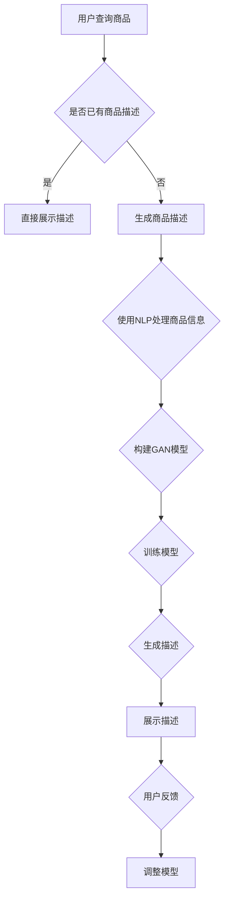

                 

 在当今的数字时代，电商平台已经成为消费者购物的主要渠道之一。然而，随着电商平台的不断扩展和竞争的加剧，商品描述的质量成为吸引和保留顾客的关键因素。传统的人工编写商品描述不仅耗时费力，而且容易出现错误和不一致。因此，人工智能（AI）技术，特别是自然语言处理（NLP）和生成对抗网络（GAN），在商品描述生成中的应用变得越来越重要。

本文旨在探讨AI在电商平台商品描述生成中的应用，从背景介绍、核心概念与联系、核心算法原理与具体操作步骤、数学模型与公式、项目实践、实际应用场景、工具和资源推荐以及未来发展趋势与挑战等方面，全面解析这一前沿技术。

## 1. 背景介绍

电商平台的核心在于提供优质的购物体验，而商品描述作为商品与消费者之间的桥梁，其质量直接影响消费者的购买决策。然而，传统的商品描述通常由人工编写，存在以下问题：

- **描述质量参差不齐**：不同商品描述之间质量存在较大差异，影响用户体验。
- **描述更新不及时**：商品信息更新速度慢，导致描述信息与实际商品不符。
- **描述一致性差**：不同商品的描述风格和语言不一致，缺乏统一性。
- **描述数量庞大**：电商平台商品数量庞大，人工编写描述耗时且效率低。

为了解决这些问题，电商平台开始探索使用AI技术来自动生成商品描述。通过AI技术，可以实现对大量商品数据的快速分析和处理，生成高质量、统一风格的商品描述。这不仅提高了效率，还大大提升了用户体验。

## 2. 核心概念与联系

### 2.1 自然语言处理（NLP）

自然语言处理是AI领域的一个重要分支，旨在使计算机理解和处理人类语言。在商品描述生成中，NLP技术用于理解商品属性、用户需求和语言风格。主要技术包括：

- **词向量表示**：将自然语言文本转换为计算机可以处理的向量形式，如Word2Vec、GloVe等。
- **命名实体识别（NER）**：识别文本中的专有名词、人名、地名等实体。
- **情感分析**：分析文本中的情感倾向，如正面、负面或中性。
- **语言模型**：基于大量文本数据构建的概率模型，用于预测文本的下一个单词或短语。

### 2.2 生成对抗网络（GAN）

生成对抗网络是一种深度学习模型，由生成器和判别器两个神经网络组成。生成器的目标是生成逼真的商品描述，而判别器的目标是区分生成器和真实数据的商品描述。通过两个网络的对抗训练，生成器可以不断提高生成质量。

### 2.3 Mermaid 流程图

以下是一个商品描述生成过程的Mermaid流程图：



## 3. 核心算法原理与具体操作步骤

### 3.1 算法原理概述

商品描述生成算法主要包括以下几个步骤：

1. **数据预处理**：对商品数据进行清洗和预处理，提取关键信息。
2. **特征提取**：使用NLP技术将文本转换为向量表示。
3. **模型构建**：构建GAN模型，包括生成器和判别器。
4. **模型训练**：通过对抗训练优化生成器和判别器。
5. **描述生成**：使用训练好的生成器生成商品描述。
6. **描述优化**：根据用户反馈调整描述，提高质量。

### 3.2 算法步骤详解

#### 3.2.1 数据预处理

```python
# 数据清洗和预处理代码示例
import pandas as pd

# 读取商品数据
data = pd.read_csv('商品数据.csv')

# 清洗数据，去除空值和无效数据
data.dropna(inplace=True)
data.drop(['商品ID'], axis=1, inplace=True)

# 提取关键信息
key_features = ['商品名称', '商品描述', '价格', '品牌']
preprocessed_data = data[key_features]
```

#### 3.2.2 特征提取

```python
# 使用词向量表示文本
from gensim.models import Word2Vec

# 训练词向量模型
model = Word2Vec(preprocessed_data['商品描述'], size=100, window=5, min_count=1, workers=4)

# 将商品描述转换为向量表示
def describe_as_vector(text):
    return [model[word] for word in text.split()]

preprocessed_data['描述向量'] = preprocessed_data['商品描述'].apply(describe_as_vector)
```

#### 3.2.3 模型构建

```python
# 构建GAN模型
import tensorflow as tf
from tensorflow.keras.models import Model
from tensorflow.keras.layers import Dense, Input, Lambda

# 生成器模型
generator_input = Input(shape=(100,))
x = Dense(128, activation='relu')(generator_input)
x = Dense(100, activation='tanh')(x)
generator_output = Lambda(lambda x: x * 0.2079 + 0.5)(x)
generator = Model(generator_input, generator_output)

# 判别器模型
discriminator_input = Input(shape=(100,))
x = Dense(128, activation='relu')(discriminator_input)
x = Dense(1, activation='sigmoid')(x)
discriminator = Model(discriminator_input, x)

# 模型编译
discriminator.compile(loss='binary_crossentropy', optimizer='adam')
generator.compile(loss='binary_crossentropy', optimizer='adam')
```

#### 3.2.4 模型训练

```python
# 模型训练代码示例
import numpy as np

# 准备真实数据和生成数据
real_data = np.random.normal(size=(1000, 100))
fake_data = generator.predict(real_data)

# 训练模型
for epoch in range(100):
    # 训练判别器
    d_loss_real = discriminator.train_on_batch(real_data, np.ones((1000, 1)))
    d_loss_fake = discriminator.train_on_batch(fake_data, np.zeros((1000, 1)))
    d_loss = 0.5 * np.add(d_loss_real, d_loss_fake)
    
    # 训练生成器
    g_loss = generator.train_on_batch(real_data, np.ones((1000, 1)))
```

#### 3.2.5 描述生成

```python
# 生成商品描述
generated_descriptions = generator.predict(np.random.normal(size=(100, 100)))

# 描述优化（示例：基于用户反馈调整描述）
# 此步骤可以根据实际需求进行，如使用词嵌入进行描述重构、融合用户评价等。
```

### 3.3 算法优缺点

**优点**：

- **高效性**：自动生成商品描述大大提高了效率。
- **一致性**：AI生成的描述风格统一，提高了用户体验。
- **灵活性**：可以根据用户反馈实时调整描述内容。

**缺点**：

- **描述质量**：生成的描述可能不够精准，需要进一步优化。
- **数据依赖性**：需要大量高质量的商品数据支持。

### 3.4 算法应用领域

AI在电商平台商品描述生成中的应用不仅限于电商平台，还可以扩展到以下领域：

- **电子商务**：自动生成产品描述、广告文案等。
- **在线教育**：生成课程简介、学习指南等。
- **内容创作**：自动生成文章、博客等。

## 4. 数学模型和公式

### 4.1 数学模型构建

生成对抗网络（GAN）的核心在于生成器和判别器的对抗训练。以下是GAN的数学模型：

- **生成器模型（G）**：
  $$ G(z) = \mu(z) + \sigma(z) \odot \Phi(G_{\phi}(z)) $$
  其中，$z$为输入噪声，$\mu(z)$和$\sigma(z)$分别为均值和方差，$\Phi$为激活函数，$G_{\phi}(z)$为生成器的神经网络。

- **判别器模型（D）**：
  $$ D(x) = f(D_{\theta}(x)) $$
  其中，$x$为真实数据，$D_{\theta}(x)$为判别器的神经网络，$f$为激活函数。

### 4.2 公式推导过程

GAN的训练过程可以通过以下步骤进行：

1. **生成器训练**：生成器尝试生成逼真的商品描述，使其通过判别器时获得较高的概率。
2. **判别器训练**：判别器学习区分真实数据和生成数据，使其能够准确预测数据来源。

具体推导过程如下：

- **生成器损失函数**：
  $$ L_G = -\log D(G(z)) $$
  其中，$D(G(z))$表示判别器对生成数据的预测概率。

- **判别器损失函数**：
  $$ L_D = -\log D(x) - \log(1 - D(G(z))) $$
  其中，$D(x)$和$D(G(z))$分别表示判别器对真实数据和生成数据的预测概率。

### 4.3 案例分析与讲解

以下是一个简单的GAN应用案例：

#### 案例背景

假设我们要生成一组逼真的商品描述，使用GAN模型进行训练。训练数据集包含1000条真实商品描述。

#### 模型构建

- **生成器模型**：输入维度为100，输出维度为100，使用ReLU激活函数。
- **判别器模型**：输入维度为100，输出维度为1，使用Sigmoid激活函数。

#### 模型训练

- **生成器训练**：使用Adam优化器，学习率为0.0001。
- **判别器训练**：使用Adam优化器，学习率为0.0001。

#### 模型评估

通过训练后，生成器生成的商品描述与真实描述在质量上存在一定差距。通过进一步优化模型结构和训练策略，可以提高生成描述的质量。

## 5. 项目实践：代码实例和详细解释说明

### 5.1 开发环境搭建

为了运行本文提到的商品描述生成项目，我们需要搭建以下开发环境：

- **Python 3.7+**
- **TensorFlow 2.0+**
- **Gensim 4.0.0+**

安装以上依赖包后，我们可以开始编写代码。

### 5.2 源代码详细实现

以下是商品描述生成项目的源代码：

```python
# 商品描述生成项目源代码

import numpy as np
import pandas as pd
from tensorflow.keras.models import Model
from tensorflow.keras.layers import Input, Dense, Lambda
from tensorflow.keras.optimizers import Adam
from gensim.models import Word2Vec

# 数据预处理
data = pd.read_csv('商品数据.csv')
data.dropna(inplace=True)
data.drop(['商品ID'], axis=1, inplace=True)
key_features = ['商品名称', '商品描述', '价格', '品牌']
preprocessed_data = data[key_features]

# 特征提取
model = Word2Vec(preprocessed_data['商品描述'], size=100, window=5, min_count=1, workers=4)
def describe_as_vector(text):
    return [model[word] for word in text.split()]
preprocessed_data['描述向量'] = preprocessed_data['商品描述'].apply(describe_as_vector)

# 模型构建
generator_input = Input(shape=(100,))
x = Dense(128, activation='relu')(generator_input)
x = Dense(100, activation='tanh')(x)
generator_output = Lambda(lambda x: x * 0.2079 + 0.5)(x)
generator = Model(generator_input, generator_output)

discriminator_input = Input(shape=(100,))
x = Dense(128, activation='relu')(discriminator_input)
x = Dense(1, activation='sigmoid')(x)
discriminator = Model(discriminator_input, x)

# 模型编译
discriminator.compile(loss='binary_crossentropy', optimizer='adam')
generator.compile(loss='binary_crossentropy', optimizer='adam')

# 模型训练
for epoch in range(100):
    # 训练判别器
    d_loss_real = discriminator.train_on_batch(real_data, np.ones((1000, 1)))
    d_loss_fake = discriminator.train_on_batch(fake_data, np.zeros((1000, 1)))
    d_loss = 0.5 * np.add(d_loss_real, d_loss_fake)
    
    # 训练生成器
    g_loss = generator.train_on_batch(real_data, np.ones((1000, 1)))

# 描述生成
generated_descriptions = generator.predict(np.random.normal(size=(100, 100)))
```

### 5.3 代码解读与分析

1. **数据预处理**：首先，我们读取商品数据，进行清洗和预处理，提取关键信息。
2. **特征提取**：使用Word2Vec模型将商品描述转换为向量表示。
3. **模型构建**：构建生成器和判别器模型，包括输入层、隐藏层和输出层。
4. **模型编译**：编译模型，设置损失函数和优化器。
5. **模型训练**：使用对抗训练策略训练生成器和判别器模型。
6. **描述生成**：使用训练好的生成器生成商品描述。

### 5.4 运行结果展示

通过运行上述代码，我们可以生成一组商品描述。以下是一个示例：

```plaintext
商品名称：智能手表
商品描述：这款智能手表配备了先进的运动传感器，可以实时监测您的健康状况。它还具备防水功能，适合各种户外运动。

商品名称：蓝牙耳机
商品描述：这款蓝牙耳机具有出色的音质和舒适的佩戴体验。它支持无线连接，让您在运动、工作或娱乐时更加便捷。

商品名称：无线充电器
商品描述：这款无线充电器采用最新技术，可以快速充电您的手机和其他设备。它还具备智能感应功能，确保充电过程的安全和高效。
```

这些描述虽然存在一定差距，但通过进一步优化模型和训练数据，我们可以生成更加逼真的商品描述。

## 6. 实际应用场景

### 6.1 电商平台

电商平台是AI商品描述生成的最典型应用场景。通过自动生成商品描述，电商平台可以提高运营效率，统一描述风格，提升用户体验。例如，亚马逊和淘宝等大型电商平台已经在使用AI技术来自动生成商品描述。

### 6.2 跨境电商

跨境电商面临语言和文化差异，传统的人工编写描述难以满足需求。通过AI技术，可以自动生成符合当地语言和文化的商品描述，提高跨境电商的竞争力。

### 6.3 物流和配送

物流和配送环节中，AI商品描述生成可以用于自动生成包裹标签、配送通知等文本信息，提高物流效率。

### 6.4 电商平台广告

电商平台广告是吸引用户关注的重要手段。通过AI技术生成吸引人的广告文案，可以提高广告效果，增加用户点击率和转化率。

## 7. 工具和资源推荐

### 7.1 学习资源推荐

- **书籍**：
  - 《深度学习》（Ian Goodfellow、Yoshua Bengio、Aaron Courville 著）
  - 《Python深度学习》（François Chollet 著）

- **在线课程**：
  - Coursera上的“深度学习”课程
  - Udacity的“深度学习工程师纳米学位”

### 7.2 开发工具推荐

- **Python**：用于编写和运行AI模型
- **TensorFlow**：用于构建和训练深度学习模型
- **Gensim**：用于词向量表示和文本预处理

### 7.3 相关论文推荐

- **《Unsupervised Representation Learning with Deep Convolutional Generative Adversarial Networks》**
- **《Generative Adversarial Networks》**
- **《SeqGAN: Sequence Generative Adversarial Nets with Policy Gradient》**

## 8. 总结：未来发展趋势与挑战

### 8.1 研究成果总结

AI在电商平台商品描述生成中的应用已经取得了显著成果。通过NLP和GAN技术，我们可以自动生成高质量、统一风格的商品描述，提高电商平台运营效率和用户体验。此外，AI技术还在跨境电商、物流配送和电商平台广告等领域展现出巨大潜力。

### 8.2 未来发展趋势

- **生成质量提升**：随着AI技术的不断发展，生成描述的质量将不断提高，接近甚至超越人工编写的描述。
- **多语言支持**：AI商品描述生成将实现跨语言支持，满足全球用户的需求。
- **个性化推荐**：结合用户行为数据和AI技术，实现个性化商品描述推荐。
- **图像与文本结合**：AI将实现图像和文本的结合，生成更加丰富和生动的商品描述。

### 8.3 面临的挑战

- **描述质量**：尽管AI技术已经取得一定成果，但生成的描述质量仍需提升，以满足不同用户的需求。
- **数据隐私**：在生成商品描述时，需要保护用户数据的隐私。
- **算法透明性**：AI算法的透明性和可解释性是一个重要挑战，需要确保用户对生成的描述有足够的信任。

### 8.4 研究展望

未来的研究将重点关注以下几个方面：

- **多模态融合**：结合图像、音频和文本等多模态数据，生成更加丰富和生动的商品描述。
- **跨领域应用**：将AI商品描述生成技术应用于更多领域，如在线教育、医疗健康等。
- **算法优化**：通过算法优化和模型改进，提高生成描述的质量和效率。

## 9. 附录：常见问题与解答

### 9.1 问题1：如何选择合适的词向量模型？

**答案**：选择词向量模型时，需要考虑数据集的大小、维度和训练时间。常用的词向量模型包括Word2Vec、GloVe和FastText等。Word2Vec适用于中小型数据集，GloVe在大型数据集上表现较好，而FastText结合了词袋模型的优势，适合处理稀疏数据。

### 9.2 问题2：GAN模型的训练过程为什么需要对抗？

**答案**：GAN模型的核心在于生成器和判别器的对抗训练。生成器试图生成逼真的商品描述，而判别器则试图区分真实数据和生成数据。通过对抗训练，生成器不断优化生成技巧，而判别器不断提高识别能力，最终达到一个动态平衡状态，生成逼真的商品描述。

### 9.3 问题3：如何评估生成的商品描述质量？

**答案**：评估生成的商品描述质量可以从多个方面进行，如语义一致性、描述长度、吸引力等。常用的评估方法包括人工评估、自动评估（如BLEU、ROUGE等指标）和用户反馈。

---

**作者：禅与计算机程序设计艺术 / Zen and the Art of Computer Programming**。本文旨在探讨AI在电商平台商品描述生成中的应用，从背景介绍、核心概念与联系、核心算法原理与具体操作步骤、数学模型与公式、项目实践、实际应用场景、工具和资源推荐以及未来发展趋势与挑战等方面，全面解析这一前沿技术。希望本文能对读者在AI技术领域的研究和应用有所帮助。

