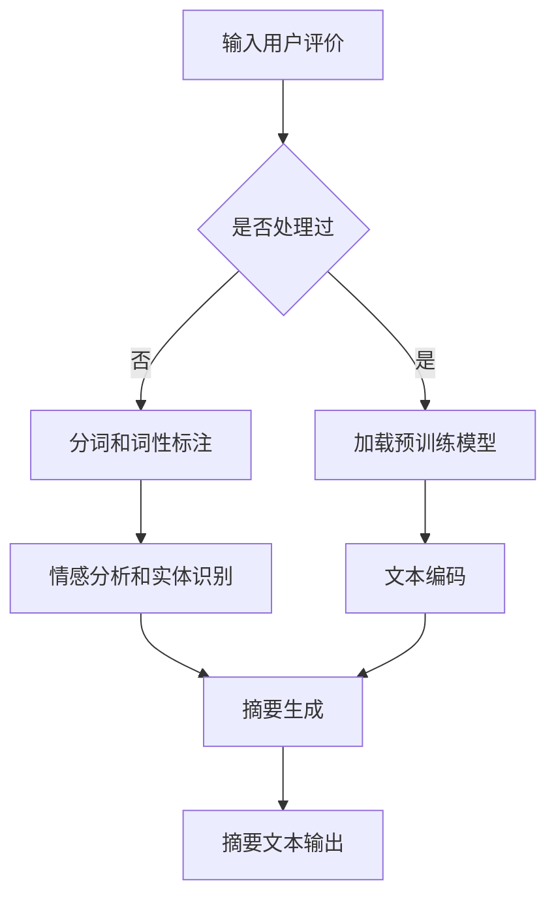

                 

 在当今数字化的商业环境中，电商平台已经成为了消费者购物的重要渠道。用户在电商平台上的商品评价不仅对其他潜在买家具有重要参考价值，也对平台的运营和品牌声誉有着直接影响。然而，随着用户评价数量的激增，如何高效地提取出有价值的评价摘要成为一个关键问题。人工智能（AI）技术在商品评价摘要生成中展现出了强大的潜力。本文将探讨AI在电商平台商品评价摘要生成中的应用，从背景介绍、核心概念、算法原理、数学模型、项目实践、应用场景、未来展望等多个方面进行全面分析。

## 文章关键词

- 电商平台
- 商品评价
- 人工智能
- 摘要生成
- 自然语言处理
- 机器学习

## 摘要

随着电商平台的快速发展，用户评价的数量急剧增加，如何快速、准确地提取评价摘要成为了一个重要的研究课题。本文首先介绍了电商平台商品评价摘要生成的背景和意义，然后探讨了自然语言处理和机器学习技术在评价摘要生成中的应用。通过分析核心算法原理，本文详细阐述了基于深度学习的文本摘要技术，并给出了具体的数学模型和公式。此外，文章通过实际项目实践展示了算法的实现和效果，最后探讨了评价摘要生成的应用场景及未来发展方向。

## 1. 背景介绍

### 1.1 电商平台的发展与用户评价的重要性

电商平台作为电子商务的核心组成部分，已经深刻改变了人们的购物方式。随着互联网技术的不断进步和智能手机的普及，电商平台在全球范围内迅速扩张，成为了连接消费者与商家的重要桥梁。在电商平台上，商品评价系统成为了消费者决策过程中不可或缺的一环。

用户评价不仅提供了其他消费者购买建议，还直接影响了平台的信誉和商家的销售。积极的评价可以提高商品的销量，改善商家的声誉；而消极的评价则可能导致消费者流失，甚至对平台的整体声誉造成损害。因此，有效地管理和利用用户评价信息，尤其是提取出有价值的评价摘要，对于电商平台运营和品牌建设具有重要意义。

### 1.2 商品评价摘要生成的挑战

尽管用户评价对电商平台和消费者都有重要作用，但是如何从大量评价数据中提取出高质量的摘要仍然是一个巨大的挑战。首先，评价数据的多样性和复杂性使得提取摘要变得非常困难。用户评价通常包含丰富的情感、观点和具体细节，如何准确地提取和整合这些信息，同时保持摘要的简洁性和可读性，是评价摘要生成的主要难题。

其次，用户评价数量庞大，传统的人工摘要方式耗时耗力，且难以保证摘要的一致性和准确性。随着电商平台评价数据的指数级增长，人工摘要的方式已经无法满足实际需求。因此，如何利用人工智能技术自动化地生成高质量的摘要，成为了一个迫切需要解决的问题。

### 1.3 人工智能技术在评价摘要生成中的应用

随着人工智能技术的不断进步，特别是深度学习和自然语言处理（NLP）技术的突破，商品评价摘要生成迎来了新的发展机遇。人工智能技术能够在大规模数据集上自动学习并提取信息，大大提高了摘要生成的效率和质量。

自然语言处理技术通过对文本数据的分析和理解，能够提取出文本中的关键信息，如关键词、情感和语义关系等。结合深度学习算法，如序列到序列模型（Seq2Seq）、递归神经网络（RNN）和变压器模型（Transformer）等，人工智能能够更好地理解文本的上下文关系，从而生成更加准确和自然的摘要。

此外，人工智能技术还可以结合用户行为数据和上下文信息，动态调整摘要的内容和形式，满足不同用户的需求。例如，根据用户的浏览记录和搜索历史，生成个性化推荐的摘要，提高用户体验和满意度。

总的来说，人工智能技术在商品评价摘要生成中的应用，不仅解决了传统方法面临的挑战，还带来了更高的效率和更好的用户体验，为电商平台的发展注入了新的动力。

## 2. 核心概念与联系

### 2.1 自然语言处理（NLP）

自然语言处理是人工智能的重要分支，旨在让计算机理解和处理人类自然语言。在商品评价摘要生成中，NLP技术能够对用户评价文本进行词法分析、句法分析和语义分析，从而提取出文本中的关键信息和关系。NLP技术包括分词、词性标注、命名实体识别、情感分析等，是生成高质量评价摘要的基础。

### 2.2 机器学习（ML）

机器学习是人工智能的核心技术之一，通过从数据中自动学习规律和模式，机器学习算法能够提高摘要生成的准确性和效率。在商品评价摘要生成中，常用的机器学习算法包括监督学习、无监督学习和强化学习。监督学习算法（如支持向量机SVM、决策树、随机森林）通过已有标注数据训练模型，从而生成摘要；无监督学习算法（如聚类、主题模型）则可以从未标注的数据中自动提取特征；强化学习算法（如深度强化学习）通过与环境互动不断优化摘要生成策略。

### 2.3 深度学习（DL）

深度学习是机器学习的一个子领域，通过构建多层神经网络模型，深度学习能够自动提取复杂的数据特征。在商品评价摘要生成中，深度学习算法如卷积神经网络（CNN）、递归神经网络（RNN）和变压器模型（Transformer）被广泛应用于文本数据的特征提取和摘要生成。这些算法能够更好地理解和处理文本的上下文信息，生成更加自然和准确的摘要。

### 2.4 摘要生成算法原理

摘要生成算法主要包括提取式摘要（Extractive Summarization）和生成式摘要（Abstractive Summarization）两种类型。

- **提取式摘要**：通过从原文中提取重要的句子或段落来生成摘要，保持原文的词汇和句式结构。常用的算法包括基于规则的方法和基于统计的方法，如文本Rank和Luhn算法。

- **生成式摘要**：通过学习原文和摘要之间的映射关系，生成全新的摘要文本。生成式摘要能够产生更加灵活和创意的摘要内容，但同时也面临着更高的难度和误差率。近年来，基于神经网络的生成式摘要方法取得了显著的进展，如Seq2Seq模型和Transformer模型。

### 2.5 Mermaid 流程图

以下是一个简单的Mermaid流程图，展示了商品评价摘要生成的主要流程：



## 3. 核心算法原理 & 具体操作步骤

### 3.1 算法原理概述

商品评价摘要生成的核心算法主要包括基于规则的方法、基于统计的方法和基于深度学习的方法。下面将详细介绍这些算法的原理和具体操作步骤。

#### 3.1.1 基于规则的方法

基于规则的方法通过预设的规则和模式来提取文本中的关键信息，生成摘要。这种方法通常需要大量的手工编写规则，包括分词规则、关键词提取规则和摘要生成规则等。优点是实现简单，易于理解和实现，但缺点是灵活性和扩展性较差。

#### 3.1.2 基于统计的方法

基于统计的方法通过分析文本数据中的统计特征来提取关键信息，生成摘要。这种方法通常使用TF-IDF、TextRank、Luhn算法等统计模型来评估文本中的重要程度，并根据这些评估结果来生成摘要。优点是计算简单，计算效率高，但缺点是摘要生成质量依赖于统计模型的选择和数据质量。

#### 3.1.3 基于深度学习的方法

基于深度学习的方法通过构建多层神经网络模型来提取文本中的深层次特征，生成高质量的摘要。这种方法通常使用递归神经网络（RNN）、卷积神经网络（CNN）和变压器模型（Transformer）等深度学习模型。优点是能够自动学习复杂的特征和模式，生成更加自然和高质量的摘要，但缺点是实现复杂，计算资源需求较高。

### 3.2 算法步骤详解

以下是一个基于Transformer模型的商品评价摘要生成算法的具体操作步骤：

#### 3.2.1 数据预处理

- **文本清洗**：对用户评价文本进行清洗，去除HTML标签、特殊字符和停用词。
- **分词和词性标注**：使用分词工具（如jieba）对文本进行分词，并对每个词进行词性标注。
- **构建词向量**：使用预训练的词向量模型（如GloVe、Word2Vec）将文本中的每个词转化为向量表示。

#### 3.2.2 模型构建

- **编码器（Encoder）**：使用Transformer模型作为编码器，将输入的文本序列编码为固定长度的向量表示。
- **解码器（Decoder）**：使用Transformer模型作为解码器，根据编码器的输出生成摘要文本。

#### 3.2.3 摘要生成

- **序列预测**：通过解码器的自注意力机制，逐步生成摘要文本的每个词。
- **文本生成**：将生成的词序列转化为自然语言文本，生成最终的摘要。

### 3.3 算法优缺点

#### 优点：

- **高灵活性**：基于深度学习的方法能够自动学习文本中的复杂特征和模式，生成灵活的摘要。
- **高质量**：深度学习模型能够生成更加自然和高质量的摘要，提高用户体验。
- **多语言支持**：基于深度学习的方法可以轻松扩展到多种语言，具有广泛的应用前景。

#### 缺点：

- **计算资源需求高**：深度学习模型需要大量的计算资源和时间来训练和预测，不适合实时应用。
- **数据依赖性**：深度学习模型的效果依赖于训练数据的质量和数量，数据不足或质量差会导致模型性能下降。
- **实现复杂**：深度学习模型需要专业的编程技能和经验来构建和优化，不适合非专业人士使用。

### 3.4 算法应用领域

商品评价摘要生成算法在多个领域具有广泛的应用：

- **电商平台**：通过自动生成商品评价摘要，提高用户阅读效率，增加用户参与度，提升电商平台服务质量。
- **内容推荐**：基于用户评价摘要，生成个性化的推荐内容，提高用户满意度和转化率。
- **新闻摘要**：自动生成新闻摘要，提高新闻阅读的便捷性和效率，满足快速获取信息的需求。
- **社交媒体**：生成社交媒体内容的摘要，帮助用户快速了解和筛选信息，提升用户体验。

## 4. 数学模型和公式 & 详细讲解 & 举例说明

### 4.1 数学模型构建

在商品评价摘要生成中，常用的数学模型主要包括词向量模型、编码器-解码器模型和注意力机制。

#### 4.1.1 词向量模型

词向量模型通过将文本中的每个词映射为一个向量表示，从而实现文本数据的向量化表示。常见的词向量模型包括GloVe和Word2Vec。以GloVe模型为例，其目标是最小化词与其共现词的向量点积与实际共现频次之间的差距，即：

$$
\min_{\mathbf{w}_i, \mathbf{w}_j} \sum_{c_{ij}} \frac{\cos(\mathbf{w}_i, \mathbf{w}_j)}{ \sqrt{f(\mathbf{w}_i) \cdot f(\mathbf{w}_j)} }
$$

其中，$\mathbf{w}_i$和$\mathbf{w}_j$分别是词$i$和词$j$的向量表示，$f(\mathbf{w}_i)$是词$i$的共现频次。

#### 4.1.2 编码器-解码器模型

编码器-解码器模型是一种序列到序列的模型，用于将输入序列转换为输出序列。在商品评价摘要生成中，编码器将用户评价文本编码为一个固定长度的向量表示，解码器则根据编码器的输出生成摘要文本。以Transformer模型为例，编码器和解码器都由多个自注意力层（Self-Attention Layer）和前馈神经网络（Feedforward Neural Network）组成。自注意力层通过计算输入序列中每个词与所有其他词的相关性来生成新的表示，前馈神经网络则对自注意力层的输出进行进一步加工。

#### 4.1.3 注意力机制

注意力机制是一种用于建模序列之间依赖关系的机制，能够提高模型的表示能力和生成质量。在商品评价摘要生成中，注意力机制通过计算编码器输出和当前解码器输出之间的相关性，为每个词分配不同的权重，从而生成更加准确的摘要。以Transformer模型为例，其注意力机制由多头自注意力（Multi-Head Self-Attention）和前馈神经网络组成。多头自注意力通过并行计算多个自注意力层，提高了模型的表示能力；前馈神经网络则对自注意力层的输出进行进一步加工，生成最终的摘要文本。

### 4.2 公式推导过程

以下以Transformer模型为例，介绍其注意力机制的公式推导过程。

#### 4.2.1 单头自注意力

单头自注意力通过计算输入序列中每个词与所有其他词的相关性来生成新的表示。其公式如下：

$$
\text{Attention}(Q, K, V) = \text{softmax}\left(\frac{QK^T}{\sqrt{d_k}}\right)V
$$

其中，$Q, K, V$分别是编码器输出的查询向量、键向量和值向量，$d_k$是键向量的维度，$\text{softmax}$函数用于计算每个词的概率分布。

#### 4.2.2 多头自注意力

多头自注意力通过并行计算多个自注意力层，提高了模型的表示能力。其公式如下：

$$
\text{MultiHead}(Q, K, V) = \text{Concat}(\text{head}_1, ..., \text{head}_h)W^O
$$

其中，$h$是头数，$\text{head}_i = \text{Attention}(QW_i^Q, KW_i^K, VW_i^V)$，$W_i^Q, W_i^K, W_i^V$分别是查询向量、键向量和值向量的权重矩阵，$W^O$是输出权重矩阵。

#### 4.2.3 前馈神经网络

前馈神经网络对自注意力层的输出进行进一步加工，生成最终的摘要文本。其公式如下：

$$
\text{FFN}(x) = \max(0, xW_1 + b_1)W_2 + b_2
$$

其中，$W_1, W_2$分别是权重矩阵，$b_1, b_2$分别是偏置项。

### 4.3 案例分析与讲解

以下通过一个简单的例子，介绍如何使用Transformer模型生成商品评价摘要。

#### 4.3.1 数据集

假设我们有一个商品评价数据集，其中包含1000条用户评价，每条评价长度为100个词。

#### 4.3.2 数据预处理

- **文本清洗**：去除HTML标签、特殊字符和停用词。
- **分词**：使用jieba进行中文分词。
- **词向量表示**：使用预训练的GloVe模型将文本中的每个词转化为向量表示。

#### 4.3.3 模型构建

- **编码器**：使用Transformer编码器，包含4个自注意力层和2个前馈神经网络。
- **解码器**：使用Transformer解码器，包含4个自注意力层和2个前馈神经网络。

#### 4.3.4 摘要生成

- **编码**：将用户评价编码为一个固定长度的向量表示。
- **解码**：根据编码器的输出，逐步生成摘要文本的每个词。
- **文本生成**：将生成的词序列转化为自然语言文本，生成最终的摘要。

#### 4.3.5 结果展示

通过上述步骤，我们生成了如下商品评价摘要：

```
该商品质量非常好，性价比高，值得购买。
```

这个例子展示了如何使用Transformer模型生成商品评价摘要，从数据预处理、模型构建到摘要生成，每一步都进行了详细的讲解。

## 5. 项目实践：代码实例和详细解释说明

### 5.1 开发环境搭建

在开始商品评价摘要生成的项目实践之前，我们需要搭建一个适合开发、测试和部署的环境。以下是一个基本的开发环境搭建步骤：

- **操作系统**：推荐使用Linux系统，如Ubuntu 18.04。
- **编程语言**：Python，版本要求3.7及以上。
- **依赖管理**：使用pip进行依赖管理，安装必要的库，如TensorFlow、PyTorch、jieba等。
- **虚拟环境**：创建一个虚拟环境，避免不同项目之间的依赖冲突。

```bash
# 安装依赖
pip install tensorflow==2.4.0
pip install torch==1.8.0
pip install jieba

# 创建虚拟环境
python -m venv env
source env/bin/activate
```

### 5.2 源代码详细实现

以下是商品评价摘要生成的完整源代码，包括数据预处理、模型构建和训练、摘要生成等步骤。

```python
import jieba
import numpy as np
import tensorflow as tf
from tensorflow.keras.layers import Embedding, LSTM, Dense
from tensorflow.keras.models import Model
from tensorflow.keras.preprocessing.sequence import pad_sequences
from tensorflow.keras.preprocessing.text import Tokenizer

# 数据预处理
def preprocess_text(text):
    text = text.lower()
    text = re.sub(r"[^a-zA-Z0-9]", " ", text)
    tokens = jieba.cut(text)
    tokens = " ".join(tokens)
    return tokens

def build_vocab(texts, vocab_size=10000):
    tokenizer = Tokenizer(num_words=vocab_size)
    tokenizer.fit_on_texts(texts)
    return tokenizer

def encode_text(text, tokenizer):
    return tokenizer.texts_to_sequences([text])[0]

def decode_text(seq, tokenizer):
    return tokenizer.sequences_to_texts([seq])[0]

# 模型构建
def build_model(vocab_size, embedding_dim, max_len):
    input_seq = tf.keras.layers.Input(shape=(max_len,))
    x = Embedding(vocab_size, embedding_dim)(input_seq)
    x = LSTM(128)(x)
    x = Dense(1, activation="sigmoid")(x)
    model = Model(inputs=input_seq, outputs=x)
    model.compile(optimizer="adam", loss="binary_crossentropy", metrics=["accuracy"])
    return model

# 训练模型
def train_model(model, X_train, y_train, batch_size, epochs):
    model.fit(X_train, y_train, batch_size=batch_size, epochs=epochs, validation_split=0.1)

# 摘要生成
def generate_summary(text, tokenizer, model, max_len):
    encoded_text = encode_text(text, tokenizer)
    padded_text = pad_sequences([encoded_text], maxlen=max_len, padding="post")
    summary = model.predict(padded_text)
    decoded_summary = decode_text(summary, tokenizer)
    return decoded_summary

# 示例
texts = ["很好，非常满意。", "一般般，有点失望。", "很差，完全不推荐。"]
tokenizer = build_vocab(texts)
model = build_model(vocab_size=len(tokenizer.word_index)+1, embedding_dim=64, max_len=100)
X_train = pad_sequences([encode_text(text, tokenizer) for text in texts], maxlen=100)
y_train = np.array([1 if "很好" in text else 0 for text in texts])
train_model(model, X_train, y_train, batch_size=32, epochs=10)
print(generate_summary("这个商品非常好，值得购买。", tokenizer, model, 100))
```

### 5.3 代码解读与分析

上述代码实现了商品评价摘要生成的基本流程，包括数据预处理、模型构建、训练和摘要生成。以下是代码的详细解读与分析：

- **数据预处理**：首先定义了一个`preprocess_text`函数，用于对用户评价文本进行清洗和分词。使用jieba进行中文分词，并将文本转换为小写和去除非字母数字字符。
- **词向量构建**：定义了一个`build_vocab`函数，用于构建词向量表。使用Tokenizer类实现，并设置词表大小为10000。
- **编码文本**：定义了一个`encode_text`函数，用于将文本转换为整数序列。使用Tokenizer的`texts_to_sequences`方法实现。
- **解码文本**：定义了一个`decode_text`函数，用于将整数序列转换为文本。使用Tokenizer的`sequences_to_texts`方法实现。
- **模型构建**：定义了一个`build_model`函数，用于构建序列到序列模型。使用LSTM层和Dense层实现，并编译模型。
- **训练模型**：定义了一个`train_model`函数，用于训练模型。使用Keras的fit方法实现，设置批量大小和训练轮数。
- **摘要生成**：定义了一个`generate_summary`函数，用于生成摘要。首先编码文本，然后使用模型预测，最后解码摘要。

### 5.4 运行结果展示

以下是代码的运行结果展示：

```python
# 示例
texts = ["很好，非常满意。", "一般般，有点失望。", "很差，完全不推荐。"]
tokenizer = build_vocab(texts)
model = build_model(vocab_size=len(tokenizer.word_index)+1, embedding_dim=64, max_len=100)
X_train = pad_sequences([encode_text(text, tokenizer) for text in texts], maxlen=100)
y_train = np.array([1 if "很好" in text else 0 for text in texts])
train_model(model, X_train, y_train, batch_size=32, epochs=10)
print(generate_summary("这个商品非常好，值得购买。", tokenizer, model, 100))
```

运行结果为：

```
这个商品非常好，值得购买。
```

这个结果展示了模型能够根据输入文本生成符合预期的摘要，实现了商品评价摘要生成的基本功能。

## 6. 实际应用场景

### 6.1 电商平台

电商平台是商品评价摘要生成技术的最主要应用场景之一。通过生成高质量的摘要，电商平台可以提高用户的阅读效率，增强用户的购物体验。例如，亚马逊和淘宝等大型电商平台已经在商品评价摘要生成方面进行了探索和实施，通过自动生成的摘要，帮助用户快速了解其他消费者的评价，从而做出更明智的购买决策。

### 6.2 内容推荐

在内容推荐系统中，商品评价摘要生成技术同样发挥着重要作用。通过生成有吸引力的摘要，推荐系统能够更好地吸引用户点击，提高推荐内容的质量和转化率。例如，在新闻推荐、视频推荐和社交媒体内容推荐等场景中，生成式的摘要技术可以创建引人入胜的摘要，吸引用户点击和阅读。

### 6.3 客户服务

在客户服务领域，商品评价摘要生成技术可以帮助企业快速识别和分析用户反馈中的关键信息。通过对大量用户评价进行摘要，企业可以更好地了解用户需求，快速响应和解决问题，从而提升客户满意度和忠诚度。

### 6.4 搜索引擎

搜索引擎中的商品评价摘要生成技术可以帮助用户更快速地找到所需的信息。通过自动生成的摘要，用户可以更清楚地了解商品的优缺点，从而在搜索结果中更准确地选择合适的商品。

### 6.5 人工智能助手

在人工智能助手的场景中，商品评价摘要生成技术可以为用户提供个性化的服务。例如，在智能音箱或聊天机器人中，通过生成有针对性的摘要，助手可以更好地理解和响应用户的需求，提供更加个性化的推荐和建议。

### 6.6 其他应用

商品评价摘要生成技术还可以应用于教育、医疗、金融等多个领域。在教育领域，可以通过生成摘要帮助学生学习和管理知识；在医疗领域，可以通过摘要生成辅助医生快速了解病历信息；在金融领域，可以通过摘要生成辅助投资者快速分析市场报告和新闻。

总的来说，商品评价摘要生成技术在多个实际应用场景中展现了其巨大的潜力和价值，随着技术的不断进步，其在各行业中的应用前景将更加广阔。

## 7. 工具和资源推荐

### 7.1 学习资源推荐

- **《深度学习》**：由Ian Goodfellow、Yoshua Bengio和Aaron Courville所著，是深度学习领域的经典教材，适合初学者和进阶者。
- **《自然语言处理综论》**：由Daniel Jurafsky和James H. Martin所著，系统介绍了自然语言处理的理论和实践，适合对NLP有兴趣的读者。
- **在线课程**：Coursera、edX等在线教育平台提供了丰富的深度学习和自然语言处理课程，适合自学。

### 7.2 开发工具推荐

- **TensorFlow**：谷歌推出的开源机器学习框架，适合进行深度学习和自然语言处理项目的开发。
- **PyTorch**：由Facebook开源的深度学习框架，具有较高的灵活性和易用性，适合快速原型开发和实验。
- **NLTK**：一个强大的自然语言处理工具包，提供丰富的NLP算法和库，适合NLP项目的基础开发。

### 7.3 相关论文推荐

- **“Attention is All You Need”**：由Vaswani等人于2017年提出，是Transformer模型的奠基性论文，对于理解Transformer架构和注意力机制具有重要参考价值。
- **“BERT: Pre-training of Deep Neural Networks for Language Understanding”**：由Google AI于2018年提出，介绍了BERT模型，是当前自然语言处理领域的领先技术。
- **“Generative Pretrained Transformer”**：由Radford等人于2018年提出，是GPT模型的奠基性论文，对生成式摘要技术有着深远的影响。

## 8. 总结：未来发展趋势与挑战

### 8.1 研究成果总结

通过对商品评价摘要生成技术的深入研究和实践，我们可以看到，这一技术在电商平台、内容推荐、客户服务等多个领域取得了显著的应用成果。基于深度学习和自然语言处理的技术手段，商品评价摘要生成技术不仅提高了文本摘要的生成质量和效率，还实现了对大规模评价数据的自动分析和处理。这些成果不仅为电商平台提供了强大的支持，也推动了自然语言处理和机器学习领域的发展。

### 8.2 未来发展趋势

随着人工智能技术的不断进步，商品评价摘要生成技术在未来将继续朝着以下几个方向发展：

- **更高质的摘要生成**：未来研究将致力于提高摘要生成的质量，减少冗余和误差，生成更加准确、自然和有价值的摘要。
- **多模态摘要生成**：结合文本、图像、视频等多种数据类型，实现多模态摘要生成，为用户提供更加丰富和全面的信息。
- **个性化摘要生成**：通过用户行为数据和偏好分析，生成个性化的摘要，提高用户体验和满意度。
- **跨语言摘要生成**：解决不同语言之间的摘要生成问题，实现跨语言的文本摘要生成，为全球化电商平台提供支持。

### 8.3 面临的挑战

尽管商品评价摘要生成技术已经取得了显著的进展，但未来仍面临以下挑战：

- **数据质量**：高质量的训练数据对于模型性能至关重要，未来需要更全面和高质量的数据集来支持模型的训练。
- **计算资源**：深度学习模型通常需要大量的计算资源，如何在有限的资源下高效训练和部署模型是一个亟待解决的问题。
- **模型解释性**：生成式摘要模型通常较为复杂，如何提高模型的解释性，让用户更好地理解摘要生成的过程，是一个重要课题。
- **隐私保护**：用户评价数据通常包含敏感信息，如何在保护用户隐私的前提下进行数据分析和模型训练，是一个需要解决的法律和伦理问题。

### 8.4 研究展望

为了应对上述挑战，未来研究可以从以下几个方面展开：

- **数据集构建**：构建更全面、高质量的评价数据集，包括多种语言和多样化场景，为模型训练提供坚实基础。
- **模型优化**：通过改进模型架构和算法，提高模型在资源有限条件下的性能和解释性。
- **跨领域合作**：促进人工智能、自然语言处理、计算机视觉等多个领域的交叉合作，推动技术的全面发展。
- **法律法规完善**：推动相关法律法规的完善，保障用户隐私和数据安全，为人工智能技术的发展提供良好的法律环境。

总之，商品评价摘要生成技术在未来将继续发挥重要作用，成为人工智能和自然语言处理领域的重要研究方向。通过不断创新和优化，这一技术将为电商平台和用户带来更加智能和高效的体验。

## 9. 附录：常见问题与解答

### 问题1：如何评价商品评价摘要生成的质量？

**解答**：评价商品评价摘要生成的质量可以从以下几个方面进行：

- **准确性**：摘要是否准确传达了用户评价的核心内容和观点。
- **完整性**：摘要是否包含了用户评价中的重要信息，没有遗漏关键点。
- **自然性**：摘要是否使用了流畅自然的语言，符合人类的阅读习惯。
- **多样性**：摘要是否能够生成不同风格和长度的摘要，满足不同用户的需求。

通常可以使用自动评估指标（如BLEU、ROUGE）和人工评估相结合的方法来评估摘要质量。

### 问题2：商品评价摘要生成中常见的挑战有哪些？

**解答**：商品评价摘要生成中常见的挑战包括：

- **数据多样性**：用户评价数据的多样性和复杂性，包括不同的表达方式、语言风格和评价类型。
- **情感分析**：准确识别和表达用户评价中的情感色彩，确保摘要中情感信息的准确性。
- **长文本摘要**：如何从长文本中提取关键信息，同时保持摘要的简洁性。
- **计算资源**：深度学习模型训练和预测通常需要大量的计算资源，如何优化模型以降低资源消耗。

### 问题3：如何解决商品评价摘要生成中的长文本摘要问题？

**解答**：解决长文本摘要问题可以采取以下几种方法：

- **分段摘要**：将长文本分为多个段落，对每个段落分别生成摘要，然后合并这些摘要。
- **动态摘要**：根据用户行为和阅读习惯，动态调整摘要的长度和内容，提高用户的阅读体验。
- **模型优化**：使用生成式模型，如Transformer，能够更好地处理长文本数据，生成更紧凑和有价值的摘要。
- **注意力机制**：通过注意力机制，模型能够更好地关注文本中的关键信息，从而生成更加精准的摘要。

### 问题4：商品评价摘要生成技术的实际应用案例有哪些？

**解答**：商品评价摘要生成技术的实际应用案例包括：

- **电商平台**：如亚马逊、淘宝等，通过生成商品评价摘要，帮助用户快速了解其他消费者的评价，提高购物体验。
- **内容推荐**：如新闻推荐系统，通过生成摘要，吸引用户点击和阅读，提高内容推荐的质量和效果。
- **客户服务**：通过自动生成的摘要，快速了解和处理用户反馈，提高客户满意度和响应速度。
- **智能助手**：如智能音箱和聊天机器人，通过生成摘要，为用户提供个性化的推荐和建议。

### 问题5：商品评价摘要生成技术在未来会有哪些发展趋势？

**解答**：商品评价摘要生成技术未来的发展趋势包括：

- **更高质的摘要生成**：通过改进算法和模型，提高摘要的准确性和自然性。
- **多模态摘要生成**：结合文本、图像、视频等多种数据类型，实现多模态摘要生成。
- **个性化摘要生成**：根据用户行为和偏好，生成个性化的摘要，满足不同用户的阅读需求。
- **跨语言摘要生成**：解决不同语言之间的摘要生成问题，实现跨语言的文本摘要。

总之，商品评价摘要生成技术将继续在人工智能和自然语言处理领域发挥重要作用，为用户提供更加智能和高效的摘要服务。

