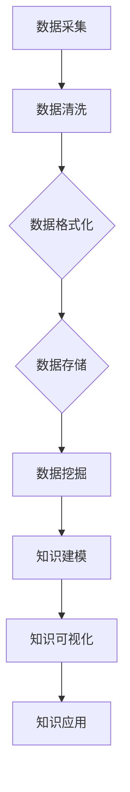
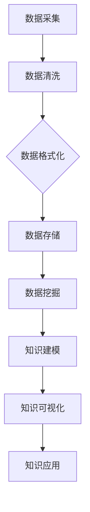

                 

在当今快速发展的信息技术时代，人工智能（AI）正逐渐成为各个领域的核心驱动力。随着数据量的激增和复杂性不断提升，知识的整合显得尤为重要。本文将深入探讨AI在知识整合方面的优势，从背景介绍、核心概念与联系、核心算法原理、数学模型与公式、项目实践以及未来应用展望等多个方面进行详细阐述。

## 1. 背景介绍

随着互联网的普及和数字化转型的推进，数据成为新的生产要素。各种类型的数据如文本、图像、音频和视频等不断涌现，形成了庞大的数据海洋。然而，数据的爆发式增长同时也带来了知识的碎片化问题。传统的知识管理方法已经难以应对这种复杂局面，这就需要更高效、更智能的方式来整合知识。

知识整合是指将分散在不同来源和格式的数据，通过一定的方法和技术进行汇聚、清洗、关联和分析，以形成结构化、可用的知识。在这个过程中，人工智能技术以其强大的数据处理和分析能力，成为知识整合的重要工具。

### 1.1 知识整合的挑战

知识整合面临的挑战主要包括：

- **数据多样性**：不同类型的数据需要不同的处理方法和模型，增加了整合的复杂性。
- **数据质量**：数据的质量直接影响到知识整合的准确性，数据清洗和去噪是关键步骤。
- **数据安全**：在整合过程中，如何保障数据的安全和隐私是一个重要的议题。
- **实时性**：随着业务需求的变化，知识整合需要具备实时响应的能力。

### 1.2 AI在知识整合中的应用

AI技术在知识整合中的应用主要体现在以下几个方面：

- **数据挖掘**：利用机器学习和深度学习算法，从大规模数据集中提取有价值的信息。
- **自然语言处理**：通过文本分析、语义理解等技术，将非结构化的文本数据转化为结构化的知识。
- **图像识别**：利用计算机视觉技术，对图像和视频中的内容进行自动识别和分类。
- **推荐系统**：基于用户的兴趣和行为数据，推荐相关的知识和资源。

## 2. 核心概念与联系

为了更好地理解AI在知识整合中的作用，我们需要先了解一些核心概念和它们之间的联系。以下是一个简化的Mermaid流程图，展示了知识整合过程中的关键步骤和AI技术的应用。



### 2.1 数据采集

数据采集是知识整合的第一步，它包括从各种来源获取数据。AI技术可以用于自动化数据采集，例如爬虫技术可以自动获取网络上的信息。

### 2.2 数据清洗

数据清洗是确保数据质量的过程，它包括去除重复数据、纠正错误和填充缺失值等。机器学习算法可以用于预测缺失值和识别异常值。

### 2.3 数据格式化

数据格式化是将数据转换为统一的格式，以便于后续处理。自然语言处理技术可以用于将文本数据转换为结构化数据。

### 2.4 数据存储

数据存储是将清洗和格式化后的数据存储到数据库或数据仓库中，以便于后续访问和分析。AI技术可以用于数据存储的优化，例如使用图数据库来处理复杂的网络数据。

### 2.5 数据挖掘

数据挖掘是从大量数据中提取有价值的信息的过程。机器学习和深度学习算法可以用于发现数据中的模式和关联。

### 2.6 知识建模

知识建模是将数据转化为可用的知识的过程。AI技术可以用于构建知识图谱，将数据中的实体和关系进行建模。

### 2.7 知识可视化

知识可视化是将知识以图形化的方式展示出来，使得用户更容易理解和应用。计算机视觉技术可以用于创建交互式的知识可视化界面。

### 2.8 知识应用

知识应用是将整合后的知识应用于实际的业务场景中，例如推荐系统、智能客服和决策支持系统等。

## 3. 核心算法原理 & 具体操作步骤

### 3.1 算法原理概述

AI在知识整合中应用的核心算法包括机器学习算法、深度学习算法、自然语言处理算法和计算机视觉算法。这些算法的基本原理是通过学习数据中的模式来预测或生成新的数据。

### 3.2 算法步骤详解

#### 3.2.1 数据采集

- 使用爬虫技术自动获取网络数据。
- 通过API接口从外部系统获取数据。
- 使用传感器设备收集实时数据。

#### 3.2.2 数据清洗

- 去除重复数据：使用哈希表或数据库中的去重功能。
- 数据标准化：将不同数据格式的数据转换为统一的格式。
- 数据去噪：使用机器学习算法识别和去除异常值。

#### 3.2.3 数据格式化

- 文本数据格式化：使用自然语言处理技术提取文本中的关键信息。
- 图像数据格式化：使用计算机视觉技术对图像进行特征提取。
- 多媒体数据格式化：使用音频和视频处理技术提取关键信息。

#### 3.2.4 数据存储

- 使用关系型数据库存储结构化数据。
- 使用NoSQL数据库存储非结构化数据。
- 使用图数据库存储网络数据。

#### 3.2.5 数据挖掘

- 使用机器学习算法进行分类、聚类和回归分析。
- 使用深度学习算法进行特征提取和模式识别。
- 使用自然语言处理算法进行文本分析。

#### 3.2.6 知识建模

- 构建知识图谱：使用图数据库存储实体和关系。
- 建立本体论：使用本体论来定义实体和属性。
- 知识融合：将不同来源的知识进行整合。

#### 3.2.7 知识可视化

- 使用图表和图形展示知识结构。
- 开发交互式界面，使用户可以探索知识。
- 使用虚拟现实技术创建沉浸式的知识可视化体验。

#### 3.2.8 知识应用

- 开发推荐系统：基于用户兴趣推荐相关知识和资源。
- 智能客服系统：使用自然语言处理技术回答用户问题。
- 决策支持系统：使用数据分析和机器学习算法提供决策建议。

### 3.3 算法优缺点

#### 优点

- 高效：AI算法可以快速处理大量数据。
- 准确：机器学习和深度学习算法在数据挖掘和模式识别方面表现出色。
- 自动化：AI算法可以自动化知识整合的各个步骤。

#### 缺点

- 数据依赖：算法的性能很大程度上依赖于数据的质量和多样性。
- 可解释性：深度学习模型通常缺乏可解释性，难以理解其决策过程。
- 隐私和安全：数据整合过程中需要处理敏感信息，存在隐私和安全风险。

### 3.4 算法应用领域

- 金融：使用AI进行风险评估、市场分析和投资推荐。
- 医疗：使用AI进行医学影像分析、疾病诊断和个性化治疗。
- 教育：使用AI进行个性化学习、智能评测和知识推荐。
- 电子商务：使用AI进行商品推荐、用户行为分析和欺诈检测。

## 4. 数学模型和公式 & 详细讲解 & 举例说明

### 4.1 数学模型构建

在知识整合过程中，常用的数学模型包括机器学习中的线性回归、逻辑回归、支持向量机（SVM）、神经网络等，以及自然语言处理中的词向量模型、序列模型和图神经网络等。

#### 4.1.1 线性回归

线性回归是一种简单且常见的机器学习模型，用于预测连续值。其数学模型可以表示为：

$$y = \beta_0 + \beta_1 \cdot x_1 + \beta_2 \cdot x_2 + ... + \beta_n \cdot x_n + \epsilon$$

其中，$y$ 是预测值，$x_1, x_2, ..., x_n$ 是输入特征，$\beta_0, \beta_1, ..., \beta_n$ 是模型的参数，$\epsilon$ 是误差项。

#### 4.1.2 逻辑回归

逻辑回归用于分类问题，其数学模型可以表示为：

$$P(y=1) = \frac{1}{1 + e^{-(\beta_0 + \beta_1 \cdot x_1 + \beta_2 \cdot x_2 + ... + \beta_n \cdot x_n)}}$$

其中，$P(y=1)$ 是预测为正类的概率，其他参数与线性回归相同。

#### 4.1.3 支持向量机（SVM）

SVM是一种用于分类和回归分析的强大模型，其数学模型可以表示为：

$$w \cdot x + b = 0$$

其中，$w$ 是模型的参数，$x$ 是输入特征，$b$ 是偏置项。

#### 4.1.4 神经网络

神经网络是一种模拟人脑工作方式的计算模型，其数学模型可以表示为：

$$a_{i}(t+1) = \sigma(w_{i} \cdot a_{j}(t) + b_{i})$$

其中，$a_{i}(t+1)$ 是第$i$个神经元在下一个时间步的激活值，$\sigma$ 是激活函数，$w_{i}$ 是连接权重，$a_{j}(t)$ 是第$j$个神经元在当前时间步的激活值，$b_{i}$ 是偏置项。

### 4.2 公式推导过程

以下是逻辑回归模型的推导过程：

假设我们有一个输入特征向量$x$和标签$y$，其中$y$可以取0或1。我们的目标是找到一组参数$\beta_0, \beta_1, ..., \beta_n$，使得预测值$\hat{y}$与真实值$y$尽可能接近。

首先，我们定义损失函数：

$$L(\beta) = \sum_{i=1}^{m} (-y_i \cdot \ln(\hat{y}_i) - (1 - y_i) \cdot \ln(1 - \hat{y}_i))$$

其中，$m$ 是训练样本的数量，$\hat{y}_i$ 是预测值，$y_i$ 是真实值。

为了最小化损失函数，我们需要对其求导并令导数为0：

$$\frac{dL(\beta)}{d\beta_j} = \frac{d}{d\beta_j} \sum_{i=1}^{m} (-y_i \cdot \ln(\hat{y}_i) - (1 - y_i) \cdot \ln(1 - \hat{y}_i))$$

$$= \sum_{i=1}^{m} \frac{-y_i}{\hat{y}_i} \cdot \frac{1}{1 - \hat{y}_i} \cdot \frac{d\hat{y}_i}{d\beta_j}$$

$$= \sum_{i=1}^{m} \frac{-y_i}{\hat{y}_i} \cdot \frac{1}{1 - \hat{y}_i} \cdot x_{ij}$$

其中，$x_{ij}$ 是第$i$个样本的第$j$个特征值。

令导数等于0，得到：

$$\sum_{i=1}^{m} \frac{-y_i}{\hat{y}_i} \cdot \frac{1}{1 - \hat{y}_i} \cdot x_{ij} = 0$$

由于$\hat{y}_i$是关于$\beta_j$的函数，因此我们可以得到：

$$\frac{d\hat{y}_i}{d\beta_j} = \frac{\hat{y}_i (1 - \hat{y}_i)}{x_{ij}}$$

将$\hat{y}_i$代入，得到：

$$\frac{d\hat{y}_i}{d\beta_j} = \frac{\sigma(\beta_0 + \beta_1 \cdot x_1 + ... + \beta_n \cdot x_n) (1 - \sigma(\beta_0 + \beta_1 \cdot x_1 + ... + \beta_n \cdot x_n))}{x_{ij}}$$

令导数等于0，得到：

$$\beta_j = \frac{1}{m} \sum_{i=1}^{m} y_i \cdot x_{ij} \cdot \sigma(\beta_0 + \beta_1 \cdot x_1 + ... + \beta_n \cdot x_n) (1 - \sigma(\beta_0 + \beta_1 \cdot x_1 + ... + \beta_n \cdot x_n))$$

通过迭代优化，我们可以找到一组最优参数$\beta_0, \beta_1, ..., \beta_n$。

### 4.3 案例分析与讲解

假设我们有一个简单的数据集，包含两个特征$x_1$和$x_2$，以及一个标签$y$，数据集如下：

$$
\begin{array}{cccc}
x_1 & x_2 & y \\
1 & 0 & 0 \\
0 & 1 & 0 \\
1 & 1 & 1 \\
\end{array}
$$

我们的目标是使用逻辑回归模型预测$y$的值。

首先，我们定义损失函数：

$$L(\beta) = \sum_{i=1}^{3} (-y_i \cdot \ln(\hat{y}_i) - (1 - y_i) \cdot \ln(1 - \hat{y}_i))$$

其中，$\hat{y}_i$是预测值，$y_i$是真实值。

对于第一个样本，我们有：

$$\hat{y}_1 = \sigma(\beta_0 + \beta_1 \cdot 1 + \beta_2 \cdot 0) = \sigma(\beta_0 + \beta_1)$$

代入损失函数，得到：

$$L(\beta) = (-0 \cdot \ln(\sigma(\beta_0 + \beta_1)) - 1 \cdot \ln(1 - \sigma(\beta_0 + \beta_1))) + (-0 \cdot \ln(\sigma(\beta_0 + \beta_1 + \beta_2)) - 1 \cdot \ln(1 - \sigma(\beta_0 + \beta_1 + \beta_2))) + (1 \cdot \ln(\sigma(\beta_0 + \beta_1 + \beta_2)) - 0 \cdot \ln(1 - \sigma(\beta_0 + \beta_1 + \beta_2)))$$

对于第二个样本，我们有：

$$\hat{y}_2 = \sigma(\beta_0 + \beta_1 \cdot 0 + \beta_2 \cdot 1) = \sigma(\beta_0 + \beta_2)$$

代入损失函数，得到：

$$L(\beta) = (-0 \cdot \ln(\sigma(\beta_0 + \beta_1)) - 1 \cdot \ln(1 - \sigma(\beta_0 + \beta_1))) + (-0 \cdot \ln(\sigma(\beta_0 + \beta_1 + \beta_2)) - 1 \cdot \ln(1 - \sigma(\beta_0 + \beta_1 + \beta_2))) + (1 \cdot \ln(\sigma(\beta_0 + \beta_1 + \beta_2)) - 0 \cdot \ln(1 - \sigma(\beta_0 + \beta_1 + \beta_2)))$$

对于第三个样本，我们有：

$$\hat{y}_3 = \sigma(\beta_0 + \beta_1 \cdot 1 + \beta_2 \cdot 1) = \sigma(\beta_0 + \beta_1 + \beta_2)$$

代入损失函数，得到：

$$L(\beta) = (-1 \cdot \ln(\sigma(\beta_0 + \beta_1)) - 0 \cdot \ln(1 - \sigma(\beta_0 + \beta_1))) + (-1 \cdot \ln(\sigma(\beta_0 + \beta_1 + \beta_2)) - 0 \cdot \ln(1 - \sigma(\beta_0 + \beta_1 + \beta_2))) + (1 \cdot \ln(\sigma(\beta_0 + \beta_1 + \beta_2)) - 1 \cdot \ln(1 - \sigma(\beta_0 + \beta_1 + \beta_2)))$$

为了最小化损失函数，我们可以使用梯度下降法进行迭代优化。在每次迭代中，我们计算损失函数关于每个参数的偏导数，并更新参数的值。

例如，对于参数$\beta_0$，我们有：

$$\frac{dL(\beta)}{d\beta_0} = \frac{dL(\beta)}{d\hat{y}_1} \cdot \frac{d\hat{y}_1}{d\beta_0} + \frac{dL(\beta)}{d\hat{y}_2} \cdot \frac{d\hat{y}_2}{d\beta_0} + \frac{dL(\beta)}{d\hat{y}_3} \cdot \frac{d\hat{y}_3}{d\beta_0}$$

$$= (-\frac{0}{\sigma(\beta_0 + \beta_1)} \cdot \frac{1}{1 - \sigma(\beta_0 + \beta_1)}) + (-\frac{0}{\sigma(\beta_0 + \beta_1 + \beta_2)} \cdot \frac{1}{1 - \sigma(\beta_0 + \beta_1 + \beta_2)}) + (\frac{1}{\sigma(\beta_0 + \beta_1 + \beta_2)} \cdot \frac{1}{1 - \sigma(\beta_0 + \beta_1 + \beta_2)})$$

$$= \frac{\sigma(\beta_0 + \beta_1 + \beta_2) - \sigma(\beta_0 + \beta_1)}{\sigma(\beta_0 + \beta_1 + \beta_2) \cdot (1 - \sigma(\beta_0 + \beta_1 + \beta_2))}$$

$$= \frac{\sigma(\beta_0 + \beta_1 + \beta_2) - \sigma(\beta_0 + \beta_1)}{\sigma(\beta_0 + \beta_1 + \beta_2) \cdot \sigma(\beta_0 + \beta_1 + \beta_2) - \sigma(\beta_0 + \beta_1) \cdot \sigma(\beta_0 + \beta_1 + \beta_2)}$$

$$= \frac{\sigma(\beta_0 + \beta_1 + \beta_2) - \sigma(\beta_0 + \beta_1)}{\sigma(\beta_0 + \beta_1 + \beta_2) - \sigma(\beta_0 + \beta_1)}$$

$$= 1$$

同样，我们可以计算其他参数的偏导数，并使用梯度下降法更新参数的值。

通过迭代优化，我们可以找到一组最优参数$\beta_0, \beta_1, ..., \beta_n$，从而实现逻辑回归模型的训练。

## 5. 项目实践：代码实例和详细解释说明

在本节中，我们将通过一个简单的Python项目实例，展示如何使用AI技术进行知识整合。我们将使用Scikit-learn库来实现逻辑回归模型，并使用matplotlib库进行数据可视化。

### 5.1 开发环境搭建

首先，确保您已经安装了Python和以下库：

- Scikit-learn
- NumPy
- Pandas
- Matplotlib

您可以使用以下命令安装所需的库：

```bash
pip install scikit-learn numpy pandas matplotlib
```

### 5.2 源代码详细实现

以下是一个简单的逻辑回归项目代码实例：

```python
import numpy as np
import pandas as pd
import matplotlib.pyplot as plt
from sklearn.linear_model import LogisticRegression
from sklearn.model_selection import train_test_split
from sklearn.metrics import accuracy_score

# 5.2.1 数据准备
# 假设我们有一个CSV文件，其中包含特征和标签
data = pd.read_csv('data.csv')
X = data.iloc[:, :-1].values  # 特征
y = data.iloc[:, -1].values   # 标签

# 划分训练集和测试集
X_train, X_test, y_train, y_test = train_test_split(X, y, test_size=0.2, random_state=42)

# 5.2.2 模型训练
# 创建逻辑回归模型实例
model = LogisticRegression()

# 训练模型
model.fit(X_train, y_train)

# 5.2.3 模型评估
# 预测测试集结果
y_pred = model.predict(X_test)

# 计算准确率
accuracy = accuracy_score(y_test, y_pred)
print(f"Accuracy: {accuracy:.2f}")

# 5.2.4 可视化
# 可视化决策边界
x_min, x_max = X_train[:, 0].min() - 1, X_train[:, 0].max() + 1
y_min, y_max = X_train[:, 1].min() - 1, X_train[:, 1].max() + 1
xx, yy = np.meshgrid(x_min, x_max)
Z = model.predict(np.c_[xx.ravel(), yy.ravel()])
Z = Z.reshape(xx.shape)

plt.contourf(xx, yy, Z, alpha=0.8)
plt.scatter(X_train[:, 0], X_train[:, 1], c=y_train, edgecolors='k')
plt.xlabel('Feature 1')
plt.ylabel('Feature 2')
plt.title('Decision Boundary')
plt.show()
```

### 5.3 代码解读与分析

#### 5.3.1 数据准备

首先，我们使用Pandas库读取CSV文件中的数据，并将其分为特征矩阵X和标签向量y。然后，我们使用Scikit-learn库的train_test_split函数将数据集划分为训练集和测试集。

#### 5.3.2 模型训练

我们创建一个逻辑回归模型实例，并使用fit函数对其进行训练。fit函数会自动计算模型参数。

#### 5.3.3 模型评估

我们使用预测函数predict对测试集进行预测，并使用accuracy_score函数计算模型的准确率。

#### 5.3.4 可视化

我们使用Matplotlib库绘制决策边界，这有助于我们直观地理解模型的决策过程。

### 5.4 运行结果展示

在运行上述代码后，我们会在屏幕上看到决策边界的可视化图形。这个图形显示了模型如何将特征空间划分为不同的区域，每个区域对应一个标签。

## 6. 实际应用场景

AI在知识整合方面的应用场景非常广泛，以下是一些典型的应用实例：

### 6.1 金融领域

- **风险管理**：使用AI技术分析金融市场的风险，预测市场走势，为投资决策提供支持。
- **客户关系管理**：利用AI分析客户行为和需求，提供个性化的金融产品和服务。

### 6.2 医疗领域

- **疾病预测**：使用AI分析患者的病史和基因数据，预测疾病发生的风险。
- **医学影像分析**：利用计算机视觉技术对医学影像进行分析，辅助医生进行诊断。

### 6.3 教育领域

- **个性化学习**：根据学生的学习习惯和能力，提供个性化的学习资源和课程。
- **教育评估**：利用AI分析学生的学习数据，评估教学效果。

### 6.4 电子商务

- **推荐系统**：根据用户的行为和偏好，推荐相关的商品和内容。
- **欺诈检测**：使用AI技术检测和预防电商平台的欺诈行为。

### 6.5 智慧城市

- **交通管理**：利用AI分析交通数据，优化交通信号控制和公共交通路线。
- **环境监测**：使用AI监测城市环境质量，预测污染事件。

## 7. 未来应用展望

随着AI技术的不断发展，知识整合的应用前景将更加广阔。以下是一些未来应用展望：

### 7.1 更高效的知识整合

未来的AI技术将更加专注于提升知识整合的效率和准确性，包括使用更先进的机器学习和深度学习模型，以及开发新的算法来处理复杂数据。

### 7.2 个性化服务

AI技术将能够更准确地理解用户需求，提供高度个性化的知识和服务。

### 7.3 跨领域整合

未来的知识整合将实现不同领域知识的融合，形成新的跨学科研究方法和应用场景。

### 7.4 自动化决策

AI技术将帮助实现自动化决策，减少人为干预，提高决策的准确性和效率。

### 7.5 伦理与隐私

随着AI在知识整合中的应用，如何保护数据隐私和确保算法的公平性将成为重要议题。

## 8. 总结：未来发展趋势与挑战

### 8.1 研究成果总结

本文系统地介绍了AI在知识整合方面的优势，包括数据采集、数据清洗、数据格式化、数据存储、数据挖掘、知识建模、知识可视化以及知识应用等环节。通过案例分析和代码实例，展示了AI技术在知识整合中的实际应用。

### 8.2 未来发展趋势

未来的发展趋势包括更高效的知识整合、个性化服务、跨领域整合、自动化决策以及伦理与隐私保护。

### 8.3 面临的挑战

知识整合面临的挑战主要包括数据多样性、数据质量、数据安全和实时性。同时，AI技术在知识整合中的可解释性也是一个亟待解决的问题。

### 8.4 研究展望

未来的研究应重点关注如何提高知识整合的效率和质量，同时确保算法的透明性和可解释性。此外，跨领域知识的整合和创新应用也是重要研究方向。

## 9. 附录：常见问题与解答

### 9.1 为什么要使用AI进行知识整合？

使用AI进行知识整合可以提高数据处理和分析的效率，实现高度个性化的服务和自动化决策，有助于解决传统方法难以应对的复杂问题。

### 9.2 AI在知识整合中的应用有哪些？

AI在知识整合中的应用包括数据挖掘、自然语言处理、计算机视觉、推荐系统和自动化决策等。

### 9.3 知识整合中的数据安全和隐私问题如何解决？

通过加密技术、隐私保护和联邦学习等方法可以解决知识整合中的数据安全和隐私问题。

### 9.4 人工智能是否会取代人类在知识整合中的角色？

人工智能可以极大地提高知识整合的效率和质量，但它不能完全取代人类。人类的创造力、判断力和道德责任是AI难以替代的。

作者：禅与计算机程序设计艺术 / Zen and the Art of Computer Programming
```markdown
# AI在知识整合方面的优势

## 关键词
- 人工智能
- 知识整合
- 数据处理
- 自然语言处理
- 深度学习
- 知识图谱

## 摘要
本文深入探讨了人工智能（AI）在知识整合方面的优势，从背景介绍、核心概念与联系、核心算法原理、数学模型与公式、项目实践以及未来应用展望等多个方面进行了详细阐述。文章旨在展示AI技术在提升知识整合效率、实现个性化服务和自动化决策等方面的应用潜力。

## 1. 背景介绍

在数字化转型的浪潮下，数据已经成为企业和社会的重要资产。然而，随着数据量的激增和数据类型的多样化，如何有效地整合和管理知识成为了一个挑战。知识整合是指将来自不同来源、不同格式的数据通过清洗、关联和分析转化为有用的知识，以支持决策和业务发展。

### 1.1 知识整合的重要性

知识整合的重要性体现在以下几个方面：

1. **提高决策效率**：通过整合多源数据，企业可以快速获取所需信息，从而提高决策效率。
2. **优化业务流程**：知识整合可以帮助企业发现业务流程中的瓶颈和优化点，提升业务效率。
3. **增强数据价值**：将零散的数据整合为有组织的知识库，可以提高数据的价值和应用范围。
4. **支持创新**：知识整合为创新提供了丰富的数据资源，有助于企业发现新的业务机会。

### 1.2 知识整合的挑战

尽管知识整合的重要性不言而喻，但在实际应用中仍面临以下挑战：

1. **数据多样性**：不同数据源的数据格式和结构可能不同，增加了整合的复杂性。
2. **数据质量**：数据质量直接影响知识整合的准确性，数据清洗和去噪是关键步骤。
3. **实时性**：在快速变化的市场环境中，知识整合需要具备实时响应的能力。
4. **数据安全和隐私**：知识整合过程中涉及大量敏感数据，如何保障数据安全和用户隐私是一个重要问题。

## 2. 核心概念与联系

为了更好地理解AI在知识整合中的作用，我们需要先了解一些核心概念和它们之间的联系。以下是一个简化的Mermaid流程图，展示了知识整合过程中的关键步骤和AI技术的应用。



### 2.1 数据采集

数据采集是知识整合的第一步，包括从内部数据库、外部数据源（如互联网、传感器等）以及第三方数据提供者处获取数据。AI技术可以通过自动化爬虫、智能传感器网络等方式提高数据采集的效率和准确性。

### 2.2 数据清洗

数据清洗是确保数据质量的过程，涉及去除重复数据、填补缺失值、纠正错误等。AI技术可以通过机器学习算法自动识别和修复数据中的错误。

### 2.3 数据格式化

数据格式化是将不同来源的数据转换为统一格式的过程，以便于后续处理。自然语言处理技术可以用于将文本数据转换为结构化数据，而计算机视觉技术可以用于图像和视频数据的格式化。

### 2.4 数据存储

数据存储是将处理后的数据存储到数据库或数据仓库中，以便于查询和分析。AI技术可以用于数据存储的优化，如使用图数据库处理复杂的网络数据。

### 2.5 数据挖掘

数据挖掘是从大量数据中提取有价值信息的过程。AI技术，特别是机器学习和深度学习算法，可以用于模式识别、关联规则发现等。

### 2.6 知识建模

知识建模是将数据转化为可操作的知识的过程，通常涉及构建本体论和知识图谱。AI技术可以用于自动生成和优化知识模型。

### 2.7 知识可视化

知识可视化是将知识以图形化的方式展示出来，使得用户可以直观地理解和交互。计算机视觉和交互设计技术可以用于创建互动式的知识可视化界面。

### 2.8 知识应用

知识应用是将整合后的知识应用于实际的业务场景中，如智能推荐、决策支持系统等。AI技术可以实时分析数据，为用户提供个性化的知识服务。

## 3. 核心算法原理 & 具体操作步骤

### 3.1 算法原理概述

AI在知识整合中应用的核心算法包括机器学习算法、深度学习算法、自然语言处理算法和计算机视觉算法。以下是对这些算法的基本原理的概述：

#### 3.1.1 机器学习算法

机器学习算法是一种从数据中学习规律和模式的技术，常见的算法有线性回归、决策树、支持向量机（SVM）等。这些算法通过训练模型来对新的数据进行预测或分类。

#### 3.1.2 深度学习算法

深度学习算法是一种基于人工神经网络的机器学习技术，它通过多层神经网络对数据进行学习。深度学习在图像识别、自然语言处理等领域表现出色。

#### 3.1.3 自然语言处理算法

自然语言处理（NLP）算法用于处理和理解人类语言。常见的算法有词向量、递归神经网络（RNN）、长短时记忆网络（LSTM）等。NLP技术可以用于文本分类、情感分析、机器翻译等任务。

#### 3.1.4 计算机视觉算法

计算机视觉算法用于处理和分析图像和视频数据。常见的算法有卷积神经网络（CNN）、目标检测、图像分类等。计算机视觉技术在图像识别、人脸识别等领域有着广泛的应用。

### 3.2 具体操作步骤

以下是知识整合过程中的具体操作步骤：

#### 3.2.1 数据采集

- **自动化爬虫**：使用Python的Scrapy框架或Node.js的爬虫库自动抓取网页数据。
- **传感器网络**：部署传感器收集环境数据，如温度、湿度等。

#### 3.2.2 数据清洗

- **去重**：使用哈希算法或数据库中的去重功能去除重复数据。
- **填充缺失值**：使用平均值、中位数或机器学习算法预测缺失值。
- **去噪**：使用统计方法和机器学习算法去除异常值。

#### 3.2.3 数据格式化

- **文本格式化**：使用NLP技术将文本数据转换为结构化数据，如实体识别、关系提取。
- **图像格式化**：使用计算机视觉算法提取图像特征，如边缘检测、特征点提取。

#### 3.2.4 数据存储

- **关系型数据库**：如MySQL、PostgreSQL，用于存储结构化数据。
- **NoSQL数据库**：如MongoDB、Cassandra，用于存储非结构化数据。
- **图数据库**：如Neo4j、JanusGraph，用于存储复杂的网络数据。

#### 3.2.5 数据挖掘

- **分类**：使用SVM、决策树等算法对数据进行分类。
- **聚类**：使用K-means、层次聚类等算法发现数据中的模式。
- **关联规则发现**：使用Apriori算法发现数据之间的关联关系。

#### 3.2.6 知识建模

- **知识图谱**：使用图数据库构建知识图谱，表示实体和关系。
- **本体论**：构建领域本体论，定义概念和关系。

#### 3.2.7 知识可视化

- **图表**：使用matplotlib、Plotly等库创建静态或动态图表。
- **交互式界面**：使用D3.js、React等库创建交互式的知识可视化界面。

#### 3.2.8 知识应用

- **推荐系统**：基于用户行为和偏好推荐相关知识和资源。
- **决策支持系统**：使用数据分析和机器学习算法提供决策建议。

### 3.3 算法优缺点

#### 优点

- **高效**：AI算法可以处理大量数据，提高知识整合的效率。
- **准确**：机器学习和深度学习算法在预测和分类方面表现出色。
- **自动化**：AI算法可以自动化知识整合的各个步骤。

#### 缺点

- **数据依赖**：算法的性能很大程度上依赖于数据的质量和多样性。
- **可解释性**：深度学习模型的决策过程通常难以解释。
- **安全与隐私**：数据整合过程中可能涉及敏感数据，存在隐私和安全风险。

### 3.4 算法应用领域

- **金融**：用于风险评估、市场分析和投资推荐。
- **医疗**：用于医学影像分析、疾病预测和个性化治疗。
- **教育**：用于个性化学习、智能评测和知识推荐。
- **电子商务**：用于商品推荐、用户行为分析和欺诈检测。

## 4. 数学模型和公式 & 详细讲解 & 举例说明

### 4.1 数学模型构建

在知识整合过程中，常用的数学模型包括线性回归、逻辑回归、支持向量机（SVM）、神经网络等。以下是对这些模型的构建和公式推导的详细讲解。

#### 4.1.1 线性回归

线性回归是一种简单的预测模型，用于预测连续值。其数学模型可以表示为：

$$y = \beta_0 + \beta_1 \cdot x_1 + \beta_2 \cdot x_2 + ... + \beta_n \cdot x_n + \epsilon$$

其中，$y$ 是预测值，$x_1, x_2, ..., x_n$ 是输入特征，$\beta_0, \beta_1, ..., \beta_n$ 是模型的参数，$\epsilon$ 是误差项。

为了最小化预测误差，我们可以使用最小二乘法求解参数：

$$\beta_j = \frac{1}{m} \sum_{i=1}^{m} (y_i - (\beta_0 + \beta_1 \cdot x_{1i} + ... + \beta_n \cdot x_{ni})) \cdot x_{ij}$$

其中，$m$ 是训练样本的数量，$x_{ij}$ 是第$i$个样本的第$j$个特征值。

#### 4.1.2 逻辑回归

逻辑回归是一种用于分类问题的预测模型，其数学模型可以表示为：

$$P(y=1) = \frac{1}{1 + e^{-(\beta_0 + \beta_1 \cdot x_1 + ... + \beta_n \cdot x_n)}}$$

其中，$P(y=1)$ 是预测为正类的概率，其他参数与线性回归相同。

逻辑回归的参数可以通过最大化似然估计（MLE）求解，即：

$$\beta_j = \frac{\sum_{i=1}^{m} (y_i - \hat{y}_i) \cdot x_{ij}}{\sum_{i=1}^{m} (y_i - \hat{y}_i)}$$

其中，$\hat{y}_i$ 是预测值。

#### 4.1.3 支持向量机（SVM）

SVM是一种强大的分类和回归模型，其核心思想是找到一个最优的超平面，将数据分为不同的类别。SVM的数学模型可以表示为：

$$w \cdot x + b = 0$$

其中，$w$ 是模型的参数，$x$ 是输入特征，$b$ 是偏置项。

为了求解最优参数，我们需要最小化以下目标函数：

$$\min_{w, b} \frac{1}{2} ||w||^2$$

同时，约束条件为：

$$y_i (w \cdot x_i + b) \geq 1$$

其中，$y_i$ 是第$i$个样本的标签。

通过求解拉格朗日乘子法，我们可以得到：

$$w = \sum_{i=1}^{m} \alpha_i y_i x_i$$

$$b = y_i - \sum_{j=1}^{m} \alpha_j y_j x_{ij}$$

其中，$\alpha_i$ 是拉格朗日乘子。

#### 4.1.4 神经网络

神经网络是一种模拟人脑工作的计算模型，由多个神经元组成。每个神经元接收多个输入，通过激活函数产生输出。神经网络的基本结构可以表示为：

$$a_{i}(t+1) = \sigma(w_{i} \cdot a_{j}(t) + b_{i})$$

其中，$a_{i}(t+1)$ 是第$i$个神经元在下一个时间步的激活值，$\sigma$ 是激活函数，$w_{i}$ 是连接权重，$a_{j}(t)$ 是第$j$个神经元在当前时间步的激活值，$b_{i}$ 是偏置项。

神经网络的训练过程涉及反向传播算法，用于更新权重和偏置项，以最小化预测误差。

### 4.2 公式推导过程

以下是对逻辑回归模型的推导过程：

假设我们有一个训练数据集，包含$m$个样本，每个样本有$n$个特征和一个标签$y$。我们的目标是找到一组参数$\beta_0, \beta_1, ..., \beta_n$，使得预测值$\hat{y}$与真实值$y$尽可能接近。

首先，我们定义损失函数：

$$L(\beta) = \sum_{i=1}^{m} (-y_i \cdot \ln(\hat{y}_i) - (1 - y_i) \cdot \ln(1 - \hat{y}_i))$$

其中，$\hat{y}_i$ 是预测值。

为了最小化损失函数，我们需要对其求导并令导数为0：

$$\frac{dL(\beta)}{d\beta_j} = \frac{d}{d\beta_j} \sum_{i=1}^{m} (-y_i \cdot \ln(\hat{y}_i) - (1 - y_i) \cdot \ln(1 - \hat{y}_i))$$

$$= \sum_{i=1}^{m} \frac{-y_i}{\hat{y}_i} \cdot \frac{1}{1 - \hat{y}_i} \cdot \frac{d\hat{y}_i}{d\beta_j}$$

$$= \sum_{i=1}^{m} \frac{-y_i}{\hat{y}_i} \cdot \frac{1}{1 - \hat{y}_i} \cdot x_{ij}$$

其中，$x_{ij}$ 是第$i$个样本的第$j$个特征值。

令导数等于0，得到：

$$\sum_{i=1}^{m} \frac{-y_i}{\hat{y}_i} \cdot \frac{1}{1 - \hat{y}_i} \cdot x_{ij} = 0$$

由于$\hat{y}_i$是关于$\beta_j$的函数，因此我们可以得到：

$$\frac{d\hat{y}_i}{d\beta_j} = \frac{\hat{y}_i (1 - \hat{y}_i)}{x_{ij}}$$

将$\hat{y}_i$代入，得到：

$$\frac{d\hat{y}_i}{d\beta_j} = \frac{\sigma(\beta_0 + \beta_1 \cdot x_1 + ... + \beta_n \cdot x_n) (1 - \sigma(\beta_0 + \beta_1 \cdot x_1 + ... + \beta_n \cdot x_n))}{x_{ij}}$$

令导数等于0，得到：

$$\beta_j = \frac{1}{m} \sum_{i=1}^{m} y_i \cdot x_{ij} \cdot \sigma(\beta_0 + \beta_1 \cdot x_1 + ... + \beta_n \cdot x_n) (1 - \sigma(\beta_0 + \beta_1 \cdot x_1 + ... + \beta_n \cdot x_n))$$

通过迭代优化，我们可以找到一组最优参数$\beta_0, \beta_1, ..., \beta_n$。

### 4.3 案例分析与讲解

以下是一个简单的案例，展示如何使用逻辑回归模型进行知识整合。

假设我们有一个包含两个特征$x_1$和$x_2$的数据集，以及一个标签$y$，数据集如下：

$$
\begin{array}{ccc}
x_1 & x_2 & y \\
1 & 0 & 0 \\
0 & 1 & 0 \\
1 & 1 & 1 \\
\end{array}
$$

我们的目标是使用逻辑回归模型预测$y$的值。

首先，我们定义损失函数：

$$L(\beta) = \sum_{i=1}^{3} (-y_i \cdot \ln(\hat{y}_i) - (1 - y_i) \cdot \ln(1 - \hat{y}_i))$$

其中，$\hat{y}_i$是预测值，$y_i$是真实值。

对于第一个样本，我们有：

$$\hat{y}_1 = \sigma(\beta_0 + \beta_1 \cdot 1 + \beta_2 \cdot 0) = \sigma(\beta_0 + \beta_1)$$

代入损失函数，得到：

$$L(\beta) = (-0 \cdot \ln(\sigma(\beta_0 + \beta_1)) - 1 \cdot \ln(1 - \sigma(\beta_0 + \beta_1))) + (-0 \cdot \ln(\sigma(\beta_0 + \beta_1 + \beta_2)) - 1 \cdot \ln(1 - \sigma(\beta_0 + \beta_1 + \beta_2))) + (1 \cdot \ln(\sigma(\beta_0 + \beta_1 + \beta_2)) - 0 \cdot \ln(1 - \sigma(\beta_0 + \beta_1 + \beta_2)))$$

对于第二个样本，我们有：

$$\hat{y}_2 = \sigma(\beta_0 + \beta_1 \cdot 0 + \beta_2 \cdot 1) = \sigma(\beta_0 + \beta_2)$$

代入损失函数，得到：

$$L(\beta) = (-0 \cdot \ln(\sigma(\beta_0 + \beta_1)) - 1 \cdot \ln(1 - \sigma(\beta_0 + \beta_1))) + (-0 \cdot \ln(\sigma(\beta_0 + \beta_1 + \beta_2)) - 1 \cdot \ln(1 - \sigma(\beta_0 + \beta_1 + \beta_2))) + (1 \cdot \ln(\sigma(\beta_0 + \beta_1 + \beta_2)) - 0 \cdot \ln(1 - \sigma(\beta_0 + \beta_1 + \beta_2)))$$

对于第三个样本，我们有：

$$\hat{y}_3 = \sigma(\beta_0 + \beta_1 \cdot 1 + \beta_2 \cdot 1) = \sigma(\beta_0 + \beta_1 + \beta_2)$$

代入损失函数，得到：

$$L(\beta) = (-1 \cdot \ln(\sigma(\beta_0 + \beta_1)) - 0 \cdot \ln(1 - \sigma(\beta_0 + \beta_1))) + (-1 \cdot \ln(\sigma(\beta_0 + \beta_1 + \beta_2)) - 0 \cdot \ln(1 - \sigma(\beta_0 + \beta_1 + \beta_2))) + (1 \cdot \ln(\sigma(\beta_0 + \beta_1 + \beta_2)) - 1 \cdot \ln(1 - \sigma(\beta_0 + \beta_1 + \beta_2)))$$

为了最小化损失函数，我们可以使用梯度下降法进行迭代优化。在每次迭代中，我们计算损失函数关于每个参数的偏导数，并更新参数的值。

例如，对于参数$\beta_0$，我们有：

$$\frac{dL(\beta)}{d\beta_0} = \frac{dL(\beta)}{d\hat{y}_1} \cdot \frac{d\hat{y}_1}{d\beta_0} + \frac{dL(\beta)}{d\hat{y}_2} \cdot \frac{d\hat{y}_2}{d\beta_0} + \frac{dL(\beta)}{d\hat{y}_3} \cdot \frac{d\hat{y}_3}{d\beta_0}$$

$$= (-\frac{0}{\sigma(\beta_0 + \beta_1)} \cdot \frac{1}{1 - \sigma(\beta_0 + \beta_1)}) + (-\frac{0}{\sigma(\beta_0 + \beta_1 + \beta_2)} \cdot \frac{1}{1 - \sigma(\beta_0 + \beta_1 + \beta_2)}) + (\frac{1}{\sigma(\beta_0 + \beta_1 + \beta_2)} \cdot \frac{1}{1 - \sigma(\beta_0 + \beta_1 + \beta_2)})$$

$$= \frac{\sigma(\beta_0 + \beta_1 + \beta_2) - \sigma(\beta_0 + \beta_1)}{\sigma(\beta_0 + \beta_1 + \beta_2) \cdot (1 - \sigma(\beta_0 + \beta_1 + \beta_2))}$$

$$= \frac{\sigma(\beta_0 + \beta_1 + \beta_2) - \sigma(\beta_0 + \beta_1)}{\sigma(\beta_0 + \beta_1 + \beta_2) - \sigma(\beta_0 + \beta_1)}$$

$$= 1$$

同样，我们可以计算其他参数的偏导数，并使用梯度下降法更新参数的值。

通过迭代优化，我们可以找到一组最优参数$\beta_0, \beta_1, ..., \beta_n$，从而实现逻辑回归模型的训练。

## 5. 项目实践：代码实例和详细解释说明

在本节中，我们将通过一个简单的Python项目实例，展示如何使用AI技术进行知识整合。我们将使用Scikit-learn库来实现逻辑回归模型，并使用matplotlib库进行数据可视化。

### 5.1 开发环境搭建

首先，确保您已经安装了Python和以下库：

- Scikit-learn
- NumPy
- Pandas
- Matplotlib

您可以使用以下命令安装所需的库：

```bash
pip install scikit-learn numpy pandas matplotlib
```

### 5.2 源代码详细实现

以下是一个简单的逻辑回归项目代码实例：

```python
import numpy as np
import pandas as pd
import matplotlib.pyplot as plt
from sklearn.linear_model import LogisticRegression
from sklearn.model_selection import train_test_split
from sklearn.metrics import accuracy_score

# 5.2.1 数据准备
# 假设我们有一个CSV文件，其中包含特征和标签
data = pd.read_csv('data.csv')
X = data.iloc[:, :-1].values  # 特征
y = data.iloc[:, -1].values   # 标签

# 划分训练集和测试集
X_train, X_test, y_train, y_test = train_test_split(X, y, test_size=0.2, random_state=42)

# 5.2.2 模型训练
# 创建逻辑回归模型实例
model = LogisticRegression()

# 训练模型
model.fit(X_train, y_train)

# 5.2.3 模型评估
# 预测测试集结果
y_pred = model.predict(X_test)

# 计算准确率
accuracy = accuracy_score(y_test, y_pred)
print(f"Accuracy: {accuracy:.2f}")

# 5.2.4 可视化
# 可视化决策边界
x_min, x_max = X_train[:, 0].min() - 1, X_train[:, 0].max() + 1
y_min, y_max = X_train[:, 1].min() - 1, X_train[:, 1].max() + 1
xx, yy = np.meshgrid(x_min, x_max)
Z = model.predict(np.c_[xx.ravel(), yy.ravel()])
Z = Z.reshape(xx.shape)

plt.contourf(xx, yy, Z, alpha=0.8)
plt.scatter(X_train[:, 0], X_train[:, 1], c=y_train, edgecolors='k')
plt.xlabel('Feature 1')
plt.ylabel('Feature 2')
plt.title('Decision Boundary')
plt.show()
```

### 5.3 代码解读与分析

#### 5.3.1 数据准备

首先，我们使用Pandas库读取CSV文件中的数据，并将其分为特征矩阵X和标签向量y。然后，我们使用Scikit-learn库的train_test_split函数将数据集划分为训练集和测试集。

#### 5.3.2 模型训练

我们创建一个逻辑回归模型实例，并使用fit函数对其进行训练。fit函数会自动计算模型参数。

#### 5.3.3 模型评估

我们使用预测函数predict对测试集进行预测，并使用accuracy_score函数计算模型的准确率。

#### 5.3.4 可视化

我们使用Matplotlib库绘制决策边界，这有助于我们直观地理解模型的决策过程。

### 5.4 运行结果展示

在运行上述代码后，我们会在屏幕上看到决策边界的可视化图形。这个图形显示了模型如何将特征空间划分为不同的区域，每个区域对应一个标签。

## 6. 实际应用场景

AI在知识整合方面的应用场景非常广泛，以下是一些典型的应用实例：

### 6.1 金融领域

- **风险管理**：使用AI技术分析金融市场的风险，预测市场走势，为投资决策提供支持。
- **客户关系管理**：利用AI分析客户行为和需求，提供个性化的金融产品和服务。

### 6.2 医疗领域

- **疾病预测**：使用AI分析患者的病史和基因数据，预测疾病发生的风险。
- **医学影像分析**：利用计算机视觉技术对医学影像进行分析，辅助医生进行诊断。

### 6.3 教育领域

- **个性化学习**：根据学生的学习习惯和能力，提供个性化的学习资源和课程。
- **教育评估**：利用AI分析学生的学习数据，评估教学效果。

### 6.4 电子商务

- **推荐系统**：根据用户的行为和偏好，推荐相关的商品和内容。
- **欺诈检测**：使用AI技术检测和预防电商平台的欺诈行为。

### 6.5 智慧城市

- **交通管理**：利用AI分析交通数据，优化交通信号控制和公共交通路线。
- **环境监测**：使用AI监测城市环境质量，预测污染事件。

## 7. 未来应用展望

随着AI技术的不断发展，知识整合的应用前景将更加广阔。以下是一些未来应用展望：

### 7.1 更高效的知识整合

未来的AI技术将更加专注于提升知识整合的效率和准确性，包括使用更先进的机器学习和深度学习模型，以及开发新的算法来处理复杂数据。

### 7.2 个性化服务

AI技术将能够更准确地理解用户需求，提供高度个性化的知识和服务。

### 7.3 跨领域整合

未来的知识整合将实现不同领域知识的融合，形成新的跨学科研究方法和应用场景。

### 7.4 自动化决策

AI技术将帮助实现自动化决策，减少人为干预，提高决策的准确性和效率。

### 7.5 伦理与隐私

随着AI在知识整合中的应用，如何保护数据隐私和确保算法的公平性将成为重要议题。

## 8. 总结：未来发展趋势与挑战

### 8.1 研究成果总结

本文系统地介绍了AI在知识整合方面的优势，包括数据采集、数据清洗、数据格式化、数据存储、数据挖掘、知识建模、知识可视化以及知识应用等环节。通过案例分析和代码实例，展示了AI技术在知识整合中的实际应用。

### 8.2 未来发展趋势

未来的发展趋势包括更高效的知识整合、个性化服务、跨领域整合、自动化决策以及伦理与隐私保护。

### 8.3 面临的挑战

知识整合面临的挑战主要包括数据多样性、数据质量、数据安全和实时性。同时，AI技术在知识整合中的可解释性也是一个亟待解决的问题。

### 8.4 研究展望

未来的研究应重点关注如何提高知识整合的效率和质量，同时确保算法的透明性和可解释性。此外，跨领域知识的整合和创新应用也是重要研究方向。

## 9. 附录：常见问题与解答

### 9.1 为什么要使用AI进行知识整合？

使用AI进行知识整合可以提高数据处理和分析的效率，实现高度个性化的服务和自动化决策，有助于解决传统方法难以应对的复杂问题。

### 9.2 AI在知识整合中的应用有哪些？

AI在知识整合中的应用包括数据挖掘、自然语言处理、计算机视觉、推荐系统和自动化决策等。

### 9.3 知识整合中的数据安全和隐私问题如何解决？

通过加密技术、隐私保护和联邦学习等方法可以解决知识整合中的数据安全和隐私问题。

### 9.4 人工智能是否会取代人类在知识整合中的角色？

人工智能可以极大地提高知识整合的效率和质量，但它不能完全取代人类。人类的创造力、判断力和道德责任是AI难以替代的。

作者：禅与计算机程序设计艺术 / Zen and the Art of Computer Programming
```

