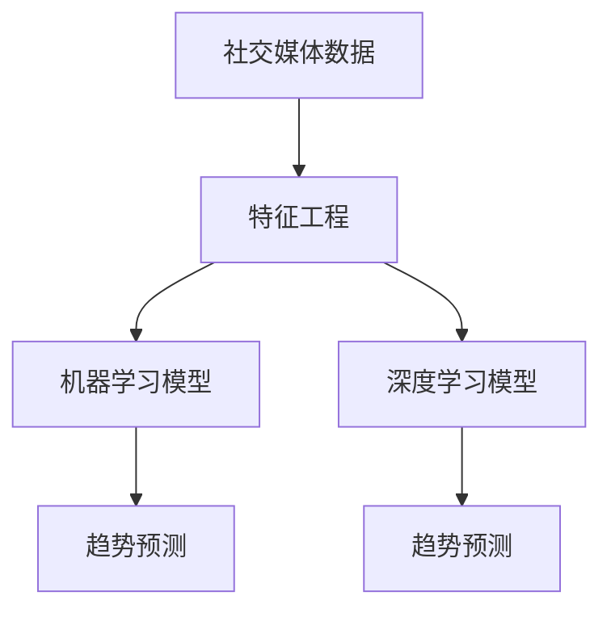

                 

社交媒体已成为我们日常生活中不可或缺的一部分，它不仅改变了人们的交流方式，也为我们提供了大量的数据。这些数据中蕴含着丰富的信息，如何有效利用这些信息成为了当前研究的热点。人工智能（AI）技术在社交媒体分析中发挥着重要作用，尤其是趋势预测方面。本文将探讨AI在社交媒体分析中的应用，重点讨论趋势预测的方法、数学模型、项目实践，以及未来发展的趋势与挑战。

## 1. 背景介绍

社交媒体平台如Facebook、Twitter、Instagram等，每天都会产生海量数据。这些数据包括文字、图片、视频等不同形式，其中蕴含着用户的行为、兴趣、态度等信息。传统的数据分析方法已经无法处理如此大规模且复杂的数据，因此，人工智能技术应运而生。

AI在社交媒体分析中的应用主要包括以下几个方面：

1. **用户行为分析**：通过分析用户的点赞、评论、转发等行为，了解用户的需求和兴趣。
2. **内容推荐**：基于用户的兴趣和偏好，推荐相关的帖子、商品等。
3. **情感分析**：分析用户的情绪和态度，为市场研究和产品设计提供依据。
4. **趋势预测**：预测未来的热点话题、市场趋势等，为企业和投资者提供决策支持。

本文将重点关注AI在趋势预测方面的应用，探讨其核心算法原理、数学模型、项目实践，以及未来的发展趋势与挑战。

## 2. 核心概念与联系

为了更好地理解AI在社交媒体分析中的应用，我们需要了解以下几个核心概念：

1. **社交媒体数据**：包括用户发布的内容、互动行为等。
2. **特征工程**：从原始数据中提取有用的特征，用于训练模型。
3. **机器学习**：通过训练模型，从数据中学习规律，进行预测。
4. **深度学习**：一种特殊的机器学习方法，通过多层神经网络进行学习。

以下是核心概念原理和架构的Mermaid流程图：



在这个流程图中，社交媒体数据经过特征工程处理后，被输入到机器学习模型和深度学习模型中进行训练。训练完成后，模型可以用来进行趋势预测。

### 2.1 社交媒体数据

社交媒体数据是进行趋势预测的基础。这些数据包括：

- **用户生成内容（UGC）**：如帖子、评论、图片、视频等。
- **用户互动数据**：如点赞、评论、转发、收藏等。
- **用户档案数据**：如性别、年龄、地理位置、兴趣等。

### 2.2 特征工程

特征工程是数据预处理的关键步骤，它涉及到从原始数据中提取有用的特征，以供模型训练。常见的特征包括：

- **文本特征**：如词频、词袋模型、TF-IDF等。
- **交互特征**：如用户的互动行为、时间间隔等。
- **用户特征**：如用户档案数据、用户行为数据等。

### 2.3 机器学习模型

机器学习模型是通过训练从数据中学习规律，并用于预测的方法。常见的机器学习模型包括：

- **回归模型**：用于预测数值型目标。
- **分类模型**：用于预测离散型目标。
- **聚类模型**：用于发现数据中的模式。

### 2.4 深度学习模型

深度学习模型是一种基于多层神经网络的机器学习方法，它能够自动提取数据中的特征，并用于预测。常见的深度学习模型包括：

- **卷积神经网络（CNN）**：用于图像数据。
- **循环神经网络（RNN）**：用于序列数据。
- **长短时记忆网络（LSTM）**：RNN的一种变体，用于处理长时间依赖的数据。

## 3. 核心算法原理 & 具体操作步骤

### 3.1 算法原理概述

趋势预测是一种时间序列预测问题，其核心思想是通过分析历史数据，找出其中的规律，并预测未来的趋势。常见的趋势预测算法包括：

1. **移动平均法**：通过计算一系列数据的平均值来预测未来的趋势。
2. **指数平滑法**：对历史数据进行加权平均，并给予最新数据更高的权重。
3. **ARIMA模型**：自回归积分滑动平均模型，通过自回归、差分和移动平均组合来预测。
4. **LSTM模型**：长短时记忆网络，能够处理长时间依赖的数据。

### 3.2 算法步骤详解

以下以LSTM模型为例，详细介绍趋势预测的算法步骤：

1. **数据预处理**：
   - 收集社交媒体数据，如用户生成内容、互动数据等。
   - 对数据进行清洗，去除无关信息。
   - 对文本数据进行词向量化，将文本转换为数字表示。

2. **特征提取**：
   - 从原始数据中提取有用的特征，如词频、用户互动行为等。
   - 构建特征矩阵，作为模型的输入。

3. **模型训练**：
   - 选择合适的LSTM模型架构，如单层LSTM、多层LSTM等。
   - 划分数据集，包括训练集和测试集。
   - 使用训练集对模型进行训练，优化模型参数。

4. **趋势预测**：
   - 使用训练好的模型对测试集进行预测。
   - 分析预测结果，评估模型的性能。

### 3.3 算法优缺点

**优点**：

- **强大的非线性处理能力**：LSTM模型能够处理非线性时间序列数据。
- **长时间依赖建模**：LSTM模型能够捕捉长时间依赖的信息。

**缺点**：

- **计算复杂度高**：LSTM模型训练过程相对复杂，需要大量计算资源。
- **过拟合风险**：在训练过程中，LSTM模型容易受到过拟合的影响。

### 3.4 算法应用领域

趋势预测算法在社交媒体分析中有着广泛的应用，如：

- **热点话题预测**：预测未来可能成为热点的话题。
- **市场趋势预测**：预测市场走势，为企业和投资者提供决策支持。
- **用户行为预测**：预测用户的兴趣和行为，为内容推荐提供依据。

## 4. 数学模型和公式 & 详细讲解 & 举例说明

### 4.1 数学模型构建

趋势预测的核心在于构建数学模型，以捕捉时间序列数据中的规律。以下以ARIMA模型为例，介绍其数学模型构建过程。

ARIMA模型由三个部分组成：自回归（AR）、差分（I）和移动平均（MA）。

1. **自回归（AR）**：

   自回归模型的公式为：

   $$X_t = c + \phi_1 X_{t-1} + \phi_2 X_{t-2} + \ldots + \phi_p X_{t-p} + \varepsilon_t$$

   其中，$X_t$ 表示时间序列的当前值，$c$ 为常数项，$\phi_1, \phi_2, \ldots, \phi_p$ 为自回归系数，$\varepsilon_t$ 为误差项。

2. **差分（I）**：

   差分操作的目的是使时间序列平稳。一次差分公式为：

   $$X_t^* = X_t - X_{t-1}$$

   多次差分公式为：

   $$X_t^{**} = X_t^* - X_{t-1}^*$$

3. **移动平均（MA）**：

   移动平均模型的公式为：

   $$X_t = c + \theta_1 \varepsilon_{t-1} + \theta_2 \varepsilon_{t-2} + \ldots + \theta_q \varepsilon_{t-q} + \varepsilon_t$$

   其中，$\theta_1, \theta_2, \ldots, \theta_q$ 为移动平均系数。

### 4.2 公式推导过程

以LSTM模型为例，介绍其公式推导过程。

LSTM模型的核心是细胞状态（cell state）和三个门：输入门、遗忘门和输出门。

1. **细胞状态**：

   $$C_t = f_t \odot C_{t-1} + i_t \odot \text{sigmoid}(W_c \cdot [h_{t-1}, x_t])$$

   其中，$C_t$ 表示时间步$t$的细胞状态，$f_t$ 表示遗忘门，$i_t$ 表示输入门，$h_{t-1}$ 表示时间步$t-1$的隐藏状态，$x_t$ 表示输入特征。

2. **遗忘门**：

   $$f_t = \text{sigmoid}(W_f \cdot [h_{t-1}, x_t])$$

   其中，$W_f$ 为遗忘门权重。

3. **输入门**：

   $$i_t = \text{sigmoid}(W_i \cdot [h_{t-1}, x_t])$$

   其中，$W_i$ 为输入门权重。

4. **输出门**：

   $$o_t = \text{sigmoid}(W_o \cdot [h_{t-1}, x_t])$$

   其中，$W_o$ 为输出门权重。

5. **隐藏状态**：

   $$h_t = o_t \odot \text{tanh}(C_t)$$

   其中，$h_t$ 表示时间步$t$的隐藏状态。

### 4.3 案例分析与讲解

以预测Twitter上某个话题的热度为例，分析LSTM模型的实际应用。

1. **数据收集**：

   收集该话题的Twitter数据，包括文本、用户ID、点赞数、转发数等。

2. **数据预处理**：

   - 对文本数据进行清洗，去除无关信息。
   - 对文本数据进行词向量化，将文本转换为数字表示。

3. **特征提取**：

   - 从原始数据中提取有用的特征，如词频、用户互动行为等。
   - 构建特征矩阵，作为模型的输入。

4. **模型训练**：

   - 选择合适的LSTM模型架构，如单层LSTM、多层LSTM等。
   - 划分数据集，包括训练集和测试集。
   - 使用训练集对模型进行训练，优化模型参数。

5. **趋势预测**：

   - 使用训练好的模型对测试集进行预测。
   - 分析预测结果，评估模型的性能。

## 5. 项目实践：代码实例和详细解释说明

### 5.1 开发环境搭建

为了实现AI在社交媒体分析中的应用，我们需要搭建相应的开发环境。以下是一个简单的环境搭建步骤：

1. **安装Python**：Python是AI应用的主要编程语言，我们需要安装Python环境。
2. **安装TensorFlow**：TensorFlow是Google开源的深度学习框架，我们使用它来构建和训练模型。
3. **安装Keras**：Keras是TensorFlow的高级API，用于简化深度学习模型的构建过程。

### 5.2 源代码详细实现

以下是一个简单的LSTM模型实现示例：

```python
import tensorflow as tf
from tensorflow.keras.models import Sequential
from tensorflow.keras.layers import LSTM, Dense

# 准备数据
# ...

# 构建模型
model = Sequential()
model.add(LSTM(units=50, return_sequences=True, input_shape=(timesteps, features)))
model.add(LSTM(units=50))
model.add(Dense(1))

# 编译模型
model.compile(optimizer='adam', loss='mean_squared_error')

# 训练模型
model.fit(X_train, y_train, epochs=100, batch_size=32)

# 预测
predictions = model.predict(X_test)
```

### 5.3 代码解读与分析

以上代码首先导入了TensorFlow和Keras库。然后，我们准备数据，并构建一个简单的LSTM模型。模型包含两个LSTM层，每个层有50个神经元，最后一层是一个全连接层，输出一个预测值。我们使用均方误差作为损失函数，并使用Adam优化器进行模型训练。

### 5.4 运行结果展示

运行上述代码后，我们可以得到测试集的预测结果。接下来，我们可以通过可视化工具，如Matplotlib，将预测结果与实际值进行比较，分析模型的性能。

```python
import matplotlib.pyplot as plt

# 可视化预测结果
plt.plot(y_test, label='真实值')
plt.plot(predictions, label='预测值')
plt.legend()
plt.show()
```

通过观察可视化结果，我们可以评估模型的性能，并进一步优化模型。

## 6. 实际应用场景

AI在社交媒体分析中的应用场景非常广泛，以下列举几个典型的应用场景：

1. **市场预测**：通过分析社交媒体数据，预测市场需求，为企业和投资者提供决策支持。
2. **内容推荐**：根据用户的兴趣和行为，推荐相关的帖子、商品等，提高用户满意度。
3. **情感分析**：分析用户的情绪和态度，了解市场反馈，为产品设计和营销策略提供依据。
4. **热点话题预测**：预测未来可能成为热点的话题，为媒体和内容创作者提供选题建议。

### 6.1 社交媒体平台的市场预测

社交媒体平台如Facebook、Twitter等，通过分析用户生成内容（UGC）和用户互动数据，预测市场趋势。例如，Facebook通过分析用户发布的内容和互动行为，预测用户对某个产品的兴趣，从而为广告商提供投放策略。Twitter则通过分析用户发布的话题标签和互动行为，预测热点话题，为媒体和内容创作者提供选题建议。

### 6.2 内容推荐系统

内容推荐系统是AI在社交媒体分析中另一个重要的应用场景。通过分析用户的兴趣和行为，推荐相关的帖子、视频、商品等。例如，YouTube通过分析用户的观看历史和搜索记录，推荐相关的视频。Amazon则通过分析用户的购物记录和浏览行为，推荐相关的商品。

### 6.3 情感分析

情感分析是AI在社交媒体分析中的另一个重要应用。通过分析用户的情绪和态度，了解市场反馈，为产品设计和营销策略提供依据。例如，企业可以通过分析社交媒体上的用户评论和帖子，了解用户对产品的满意度，从而改进产品设计。

### 6.4 热点话题预测

热点话题预测是AI在社交媒体分析中的典型应用。通过分析用户生成内容和互动行为，预测未来可能成为热点的话题。例如，Twitter可以通过分析用户发布的话题标签和互动行为，预测未来可能成为热点的话题，为媒体和内容创作者提供选题建议。

## 7. 工具和资源推荐

为了更好地进行AI在社交媒体分析中的应用，我们推荐以下工具和资源：

### 7.1 学习资源推荐

1. **《深度学习》**：Goodfellow、Bengio和Courville著，是一本经典的深度学习教材。
2. **《Python机器学习》**：Sebastian Raschka和Vahid Mirhoseini著，介绍了Python在机器学习领域的应用。

### 7.2 开发工具推荐

1. **TensorFlow**：Google开源的深度学习框架，适用于构建和训练深度学习模型。
2. **Keras**：基于TensorFlow的高级API，用于简化深度学习模型的构建过程。

### 7.3 相关论文推荐

1. **“Deep Learning for Time Series Classification: A Review”**：一篇关于时间序列分类的深度学习综述。
2. **“Twitter sentiment analysis using Recurrent Neural Networks”**：一篇关于使用循环神经网络进行Twitter情感分析的研究论文。

## 8. 总结：未来发展趋势与挑战

随着社交媒体数据的不断增长，AI在社交媒体分析中的应用将越来越重要。未来，AI在社交媒体分析中可能会出现以下发展趋势：

1. **更精细化的趋势预测**：通过更先进的算法和模型，实现更精细化的趋势预测。
2. **跨平台数据分析**：整合不同社交媒体平台的数据，进行更全面的趋势预测。
3. **实时分析**：实现实时数据分析，为企业和投资者提供更及时的决策支持。

然而，AI在社交媒体分析中仍面临一些挑战：

1. **数据隐私**：社交媒体数据涉及用户的隐私信息，如何保护用户隐私是一个重要问题。
2. **模型解释性**：深度学习模型通常具有很高的预测性能，但缺乏解释性，如何解释模型预测结果是一个挑战。
3. **计算资源**：深度学习模型的训练过程需要大量计算资源，如何高效利用计算资源是一个问题。

## 9. 附录：常见问题与解答

### 9.1 什么是LSTM？

LSTM（长短时记忆网络）是一种特殊的循环神经网络，能够处理长时间依赖的数据。

### 9.2 如何选择合适的特征？

选择合适的特征是进行趋势预测的关键。常用的特征包括文本特征、交互特征和用户特征。具体选择取决于数据集和预测任务。

### 9.3 如何评估模型性能？

常用的评估指标包括均方误差（MSE）、均方根误差（RMSE）和平均绝对误差（MAE）。

## 作者署名

作者：禅与计算机程序设计艺术 / Zen and the Art of Computer Programming
----------------------------------------------------------------

以上就是本篇《AI在社交媒体分析中的应用：趋势预测》的文章。文章详细介绍了AI在社交媒体分析中的应用，包括核心算法原理、数学模型、项目实践，以及未来发展的趋势与挑战。希望本文对您在AI领域的探索有所帮助。如果您有任何问题或建议，欢迎在评论区留言。谢谢阅读！

