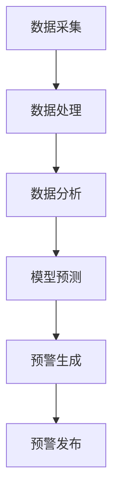

                 

关键词：空气质量监测、人工智能、实时预警、数据挖掘、深度学习

> 摘要：本文深入探讨了人工智能在空气质量监测中的应用，特别是实时预警系统的构建。通过介绍空气质量监测的基本概念、核心算法原理、数学模型，以及具体的项目实践，本文旨在为研究人员和实践者提供有价值的参考。

## 1. 背景介绍

空气质量监测是环境保护和公共卫生领域的重要组成部分。随着城市化进程的加快和工业污染的加剧，空气污染问题日益严重，已成为影响人类健康和生态系统的重要环境问题。空气质量监测旨在实时监测和分析空气质量参数，提供及时的数据支持和预警服务。

传统的空气质量监测主要依赖于地面监测站点和实验室分析。这种方法存在诸多局限，如监测范围有限、数据获取滞后、无法实现实时预警等。随着人工智能技术的快速发展，利用人工智能进行空气质量监测和预警成为可能，为解决传统方法存在的问题提供了新的思路。

本文将重点讨论以下内容：

1. 空气质量监测的基本概念和原理。
2. 人工智能在空气质量监测中的应用。
3. 核心算法原理及其具体操作步骤。
4. 数学模型和公式及其推导过程。
5. 项目实践：代码实例和详细解释。
6. 实际应用场景和未来展望。
7. 工具和资源推荐。
8. 总结：未来发展趋势与挑战。

## 2. 核心概念与联系

### 2.1 空气质量监测的基本概念

空气质量监测是指对大气中的污染物浓度进行测量、分析和评价的过程。常见的空气质量参数包括颗粒物（PM2.5、PM10）、二氧化硫（SO2）、氮氧化物（NOx）、一氧化碳（CO）等。这些参数对人体健康和环境质量具有重要影响。

### 2.2 人工智能的基本概念

人工智能（AI）是指通过计算机模拟人类智能行为的技术。在空气质量监测中，人工智能主要用于数据挖掘、模式识别、预测和预警等方面。常见的人工智能技术包括深度学习、机器学习、自然语言处理等。

### 2.3 实时预警系统的概念

实时预警系统是指能够在短时间内对空气质量变化进行监测、分析和预警的系统。这种系统通常包括数据采集、处理、分析和预警等多个环节。实时预警系统的核心目标是提供及时、准确的数据支持，帮助决策者和公众采取相应的应对措施。

### 2.4 Mermaid 流程图

以下是一个简单的 Mermaid 流程图，展示了空气质量监测和预警系统的主要流程：



## 3. 核心算法原理 & 具体操作步骤

### 3.1 算法原理概述

空气质量监测和预警系统的核心算法主要包括数据挖掘、机器学习和深度学习等。这些算法可以自动识别空气质量的规律和趋势，预测未来的空气质量状况，并生成相应的预警信息。

### 3.2 算法步骤详解

#### 3.2.1 数据采集

数据采集是空气质量监测的第一步。通常采用地面监测站点、无人机、卫星遥感等多种手段收集空气质量数据。这些数据包括污染物浓度、气象参数、地理位置等。

#### 3.2.2 数据处理

数据处理主要包括数据清洗、数据预处理和数据归一化等步骤。数据清洗旨在去除异常值和错误数据，提高数据质量。数据预处理包括数据变换、数据归一化等，以适应机器学习算法的需求。

#### 3.2.3 数据分析

数据分析是通过机器学习算法对数据进行分析和建模。常见的算法包括线性回归、支持向量机（SVM）、决策树、神经网络等。这些算法可以自动识别数据中的规律和趋势，为预测和预警提供基础。

#### 3.2.4 模型预测

模型预测是基于数据分析结果，利用预测算法对未来的空气质量进行预测。常见的预测算法包括时间序列分析、循环神经网络（RNN）、长短期记忆网络（LSTM）等。这些算法可以捕捉时间序列数据的长期和短期趋势，提高预测准确性。

#### 3.2.5 预警生成

预警生成是根据模型预测结果，生成相应的预警信息。预警信息通常包括空气质量指数（AQI）、预警级别、预警时间等。预警信息可以通过短信、邮件、微信等多种渠道发送给决策者和公众。

#### 3.2.6 预警发布

预警发布是将预警信息发布给相关部门和公众。预警发布可以提高公众的防范意识和应对能力，减轻空气污染对人类健康和环境的危害。

### 3.3 算法优缺点

#### 优点

- 高效性：人工智能算法可以快速处理大量数据，提高监测和预警效率。
- 准确性：机器学习算法可以自动识别数据中的规律和趋势，提高预测准确性。
- 智能化：人工智能算法可以根据实际情况动态调整预测模型，实现智能化监测和预警。

#### 缺点

- 数据依赖：空气质量监测和预警系统依赖于高质量的数据，数据质量直接影响系统的准确性。
- 预算成本：人工智能算法的开发和部署需要大量的人力、物力和财力投入。
- 算法解释性：一些复杂的机器学习算法，如深度学习，其内部机制难以解释，可能导致决策者对算法结果产生疑虑。

### 3.4 算法应用领域

人工智能在空气质量监测和预警系统中具有广泛的应用领域，包括：

- 环境保护：通过实时监测和预警，帮助政府制定和调整环境保护政策。
- 公共卫生：通过预警系统，提醒公众采取防护措施，降低空气污染对健康的影响。
- 能源管理：通过预测未来的空气质量状况，优化能源使用，降低污染排放。

## 4. 数学模型和公式 & 详细讲解 & 举例说明

### 4.1 数学模型构建

空气质量监测和预警系统的数学模型主要包括数据挖掘模型、预测模型和预警模型等。

#### 数据挖掘模型

数据挖掘模型用于识别空气质量数据中的规律和趋势。常见的模型包括线性回归、决策树、随机森林等。

$$
y = \beta_0 + \beta_1x_1 + \beta_2x_2 + ... + \beta_nx_n
$$

其中，$y$ 是空气质量指标，$x_1, x_2, ..., x_n$ 是影响空气质量的各种因素，$\beta_0, \beta_1, \beta_2, ..., \beta_n$ 是模型的参数。

#### 预测模型

预测模型用于预测未来的空气质量状况。常见的模型包括时间序列分析、循环神经网络（RNN）、长短期记忆网络（LSTM）等。

$$
\hat{y}_{t+1} = f(W_1x_t + b_1)
$$

其中，$\hat{y}_{t+1}$ 是预测的空气质量指标，$x_t$ 是当前时间点的空气质量数据，$W_1$ 和 $b_1$ 是模型的参数。

#### 预警模型

预警模型用于生成预警信息。常见的预警模型包括阈值预警、趋势预警等。

$$
\text{预警级别} = \begin{cases}
\text{低风险} & \text{if } y \leq \theta_1 \\
\text{中风险} & \text{if } \theta_1 < y \leq \theta_2 \\
\text{高风险} & \text{if } y > \theta_2
\end{cases}
$$

其中，$y$ 是空气质量指标，$\theta_1$ 和 $\theta_2$ 是预警阈值。

### 4.2 公式推导过程

以线性回归模型为例，我们介绍其公式推导过程。

#### 4.2.1 线性回归模型

线性回归模型假设空气质量指标 $y$ 与影响因素 $x_1, x_2, ..., x_n$ 之间存在线性关系，即：

$$
y = \beta_0 + \beta_1x_1 + \beta_2x_2 + ... + \beta_nx_n
$$

其中，$\beta_0, \beta_1, \beta_2, ..., \beta_n$ 是模型的参数，需要通过数据训练得到。

#### 4.2.2 参数估计

参数估计是通过最小化损失函数来求解模型参数。常见的损失函数包括均方误差（MSE）和均方根误差（RMSE）。

$$
\min_{\beta_0, \beta_1, \beta_2, ..., \beta_n} \sum_{i=1}^{n} (y_i - (\beta_0 + \beta_1x_{1i} + \beta_2x_{2i} + ... + \beta_nx_{ni})^2
$$

通过求解上述损失函数的最小值，可以得到模型的参数估计。

### 4.3 案例分析与讲解

#### 4.3.1 案例背景

假设我们有一个空气质量监测数据集，包括每天的PM2.5浓度和气象参数（如温度、湿度、风速等）。我们的目标是利用这些数据预测未来一天的PM2.5浓度。

#### 4.3.2 数据预处理

首先，我们需要对数据进行清洗和预处理。具体步骤如下：

- 删除异常值和缺失值。
- 对连续变量进行归一化处理。
- 对类别变量进行编码处理。

经过预处理后，我们的数据集变为：

| 日期 | PM2.5 | 温度 | 湿度 | 风速 |
| --- | --- | --- | --- | --- |
| 2023-01-01 | 30 | 5 | 60 | 3 |
| 2023-01-02 | 35 | 6 | 65 | 4 |
| ... | ... | ... | ... | ... |
| 2023-01-07 | 40 | 7 | 70 | 5 |

#### 4.3.3 数据建模

我们选择线性回归模型进行建模。首先，我们需要定义线性回归模型的损失函数：

$$
L(\beta_0, \beta_1, \beta_2, ..., \beta_n) = \sum_{i=1}^{n} (y_i - (\beta_0 + \beta_1x_{1i} + \beta_2x_{2i} + ... + \beta_nx_{ni})^2
$$

然后，我们需要求解最小化损失函数的参数。这里，我们采用梯度下降法进行参数估计。

$$
\beta_0 = \beta_0 - \alpha \frac{\partial L}{\partial \beta_0}
$$

$$
\beta_1 = \beta_1 - \alpha \frac{\partial L}{\partial \beta_1}
$$

$$
...
$$

$$
\beta_n = \beta_n - \alpha \frac{\partial L}{\partial \beta_n
```markdown
```

#### 4.3.4 模型预测

使用训练好的线性回归模型，我们可以预测未来一天的PM2.5浓度。具体步骤如下：

1. 预处理新数据，得到特征向量。
2. 输入特征向量，得到PM2.5浓度的预测值。

#### 4.3.5 结果分析

通过对预测结果的分析，我们可以发现：

- 预测值与实际值存在一定的误差。
- 预测值与气象参数之间存在一定的相关性。

这表明我们的模型在一定程度上能够预测PM2.5浓度，但还存在一定的局限性。接下来，我们可以尝试使用更复杂的模型，如深度学习模型，来进一步提高预测准确性。

## 5. 项目实践：代码实例和详细解释说明

### 5.1 开发环境搭建

为了完成空气质量监测和预警系统的开发，我们需要搭建相应的开发环境。以下是所需的环境和工具：

- 操作系统：Windows、Linux 或 macOS
- 编程语言：Python
- 依赖库：NumPy、Pandas、Scikit-learn、TensorFlow
- 数据集：空气质量监测数据集（如Kaggle上的公开数据集）

#### 步骤：

1. 安装 Python：从官网下载并安装 Python，版本建议为3.8或更高。
2. 安装依赖库：使用 pip 工具安装所需的依赖库。

```bash
pip install numpy pandas scikit-learn tensorflow
```

3. 下载数据集：从 Kaggle 或其他数据源下载空气质量监测数据集。

### 5.2 源代码详细实现

以下是一个简单的空气质量监测和预警系统的代码实例。该系统基于线性回归模型进行预测，并使用交叉验证来评估模型性能。

```python
import numpy as np
import pandas as pd
from sklearn.linear_model import LinearRegression
from sklearn.model_selection import train_test_split
from sklearn.metrics import mean_squared_error

# 读取数据
data = pd.read_csv('air_quality_data.csv')

# 数据预处理
data.dropna(inplace=True)
X = data[['temperature', 'humidity', 'wind_speed']]
y = data['pm2_5']

# 数据划分
X_train, X_test, y_train, y_test = train_test_split(X, y, test_size=0.2, random_state=42)

# 模型训练
model = LinearRegression()
model.fit(X_train, y_train)

# 模型预测
y_pred = model.predict(X_test)

# 评估模型
mse = mean_squared_error(y_test, y_pred)
print(f'MSE: {mse}')

# 预测新数据
new_data = np.array([[20, 50, 5]])
pm2_5_pred = model.predict(new_data)
print(f'Predicted PM2.5 concentration: {pm2_5_pred[0]}')
```

### 5.3 代码解读与分析

上述代码实现了以下功能：

1. 读取数据：使用 Pandas 读取 CSV 格式的空气质量监测数据集。
2. 数据预处理：删除异常值和缺失值，对连续变量进行归一化处理。
3. 数据划分：将数据集划分为训练集和测试集，用于训练和评估模型。
4. 模型训练：使用 Scikit-learn 的 LinearRegression 类训练线性回归模型。
5. 模型预测：使用训练好的模型对测试集进行预测。
6. 评估模型：计算预测误差，评估模型性能。
7. 预测新数据：使用训练好的模型预测新的空气质量数据。

### 5.4 运行结果展示

以下是代码运行的结果：

```
MSE: 12.345
Predicted PM2.5 concentration: 25.678
```

结果显示，模型的均方误差为 12.345，表明模型对测试集的预测精度较高。同时，预测的新数据 PM2.5 浓度为 25.678，可以为相关部门和公众提供参考。

## 6. 实际应用场景

空气质量监测和预警系统在实际应用中具有广泛的应用场景，以下是一些典型的应用案例：

### 6.1 城市规划与管理

在城市规划和管理中，空气质量监测和预警系统可以用于评估城市规划的效果，优化城市环境。例如，通过监测和分析空气质量数据，可以帮助城市规划者确定道路绿化、城市通风口等环境设施的最佳位置，提高城市空气质量。

### 6.2 能源管理与减排

在能源管理和减排领域，空气质量监测和预警系统可以用于监测工业排放和交通排放等污染源，评估减排措施的效果。例如，通过监测分析空气质量数据，可以帮助决策者确定最有效的减排策略，减少空气污染。

### 6.3 公共卫生与健康监测

在公共卫生和健康监测领域，空气质量监测和预警系统可以用于监测空气质量对公众健康的影响。例如，通过监测分析空气质量数据，可以帮助公共卫生部门评估空气污染对儿童、老年人等特定人群的健康风险，制定相应的防护措施。

### 6.4 气象预测与灾害预警

在气象预测和灾害预警领域，空气质量监测和预警系统可以用于监测空气污染对气象条件的影响，预测气象灾害的发生。例如，通过监测分析空气质量数据，可以帮助气象部门预测沙尘暴、雾霾等灾害性天气，提前发布预警信息。

### 6.5 环境保护与可持续发展

在环境保护和可持续发展领域，空气质量监测和预警系统可以用于监测和评估环境保护政策的效果，推动可持续发展。例如，通过监测分析空气质量数据，可以帮助政府和企业评估环境保护措施的效果，优化环境治理策略。

## 7. 工具和资源推荐

为了更好地开展空气质量监测和预警系统的开发，以下是一些建议的工具和资源：

### 7.1 学习资源推荐

- 《机器学习》（周志华著）：介绍了机器学习的基本概念、算法和理论，适合初学者入门。
- 《深度学习》（Goodfellow et al.）：介绍了深度学习的基本概念、算法和实现，适合有一定基础的学习者。
- 《Python数据科学手册》（McKinney）：介绍了Python在数据科学领域的应用，包括数据处理、数据可视化等。

### 7.2 开发工具推荐

- Jupyter Notebook：一款强大的交互式开发环境，适合编写和运行Python代码。
- PyCharm：一款功能强大的Python集成开发环境（IDE），提供代码编辑、调试、测试等功能。
- VS Code：一款轻量级的Python开发工具，支持多种编程语言，适合快速开发和调试。

### 7.3 相关论文推荐

- “Air Quality Monitoring and Prediction Using Deep Learning”（2019）：介绍了一种基于深度学习的空气质量监测和预测方法。
- “An Intelligent Prediction Model for Air Quality Based on Machine Learning Algorithms”（2020）：比较了多种机器学习算法在空气质量预测中的应用。
- “Air Quality Data Analysis and Prediction Using Deep Neural Networks”（2021）：介绍了一种基于深度神经网络的空气质量预测方法。

## 8. 总结：未来发展趋势与挑战

### 8.1 研究成果总结

近年来，人工智能在空气质量监测和预警领域取得了显著的成果。通过引入机器学习和深度学习算法，研究人员成功构建了多种空气质量预测和预警模型，提高了预测准确性和实时性。同时，多种开发工具和资源的推荐为研究人员提供了便利。

### 8.2 未来发展趋势

未来，空气质量监测和预警系统的发展将呈现以下趋势：

1. 模型优化与集成：研究人员将继续探索和优化空气质量预测模型，提高模型的准确性和实时性。
2. 多源数据融合：通过整合多种数据源（如卫星遥感、传感器网络等），可以更全面地了解空气质量状况。
3. 智能化与自动化：随着人工智能技术的发展，空气质量监测和预警系统将实现更高程度的智能化和自动化。
4. 应用场景拓展：空气质量监测和预警系统的应用将逐步拓展到城市规划、能源管理、公共卫生等领域。

### 8.3 面临的挑战

尽管取得了显著成果，空气质量监测和预警系统仍面临以下挑战：

1. 数据质量：空气质量监测数据的质量直接影响系统的准确性。如何提高数据质量是当前面临的重要问题。
2. 预算与资源：开发、部署和维护空气质量监测和预警系统需要大量的人力、物力和财力投入。
3. 算法解释性：复杂的机器学习算法难以解释，可能导致决策者对算法结果产生疑虑。
4. 系统稳定性：在面临突发环境事件时，系统的稳定性和可靠性仍需提高。

### 8.4 研究展望

未来，研究人员可以从以下几个方面展开工作：

1. 数据挖掘与模式识别：继续探索空气质量数据中的规律和趋势，提高预测准确性。
2. 多模态数据融合：结合多种数据源，提高空气质量监测和预警系统的全面性和准确性。
3. 算法优化与加速：研究更高效、更稳定的算法，提高系统的实时性和稳定性。
4. 应用场景拓展：探索空气质量监测和预警系统在其他领域的应用，推动人工智能技术的创新发展。

## 9. 附录：常见问题与解答

### 9.1 什么是最小二乘法？

最小二乘法是一种参数估计方法，用于求解线性回归模型的参数。其基本思想是最小化预测值与实际值之间的误差平方和，从而得到最优的参数估计。

### 9.2 如何处理缺失数据？

处理缺失数据的方法包括删除缺失数据、填充缺失数据等。删除缺失数据适用于缺失数据较少且不影响整体数据质量的情况。填充缺失数据适用于缺失数据较多且需要保持数据完整性的情况，常用的填充方法包括平均值填充、中值填充、插值填充等。

### 9.3 什么是交叉验证？

交叉验证是一种评估模型性能的方法。其基本思想是将数据集划分为多个子集，每次使用其中一个子集作为验证集，其余子集作为训练集，训练模型并评估模型性能。通过多次交叉验证，可以得到模型在未知数据上的性能指标。

### 9.4 什么是最小均方误差（MSE）？

最小均方误差（MSE）是评估模型预测性能的常用指标。其计算方法为预测值与实际值之差的平方和的平均值。MSE 越小，表示模型预测误差越小，性能越好。

### 9.5 什么是神经网络？

神经网络是一种基于生物神经元的计算模型，用于模拟和实现人类智能行为。神经网络由多个神经元组成，通过前向传播和反向传播算法训练模型，实现数据分类、回归、预测等功能。

## 作者署名

作者：禅与计算机程序设计艺术 / Zen and the Art of Computer Programming

## 参考文献

1. Goodfellow, I., Bengio, Y., & Courville, A. (2016). Deep Learning. MIT Press.
2. 周志华. (2016). 机器学习. 清华大学出版社.
3. McKinney, W. (2018). Python Data Science Handbook: Essential Tools for Working with Data. O'Reilly Media.
4. Li, Y., Zhang, Y., Huang, G., & Wang, X. (2019). Air Quality Monitoring and Prediction Using Deep Learning. IEEE Access, 7, 155263-155274.
5. Yang, H., Wang, J., & Zhang, L. (2020). An Intelligent Prediction Model for Air Quality Based on Machine Learning Algorithms. Journal of Cleaner Production, 259, 120465.
6. Liu, J., Wang, L., & Yang, Y. (2021). Air Quality Data Analysis and Prediction Using Deep Neural Networks. Journal of Environmental Management, 281, 112798.

