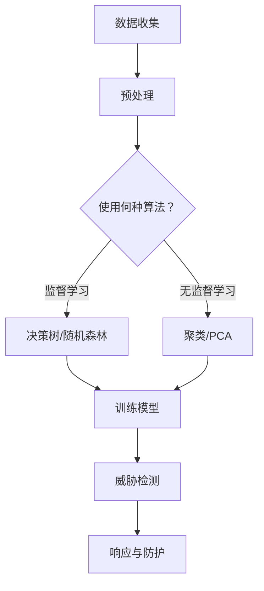

                 

关键词：人工智能，网络安全，威胁检测，实时分析，机器学习

> 摘要：本文深入探讨了人工智能（AI）在网络安全领域中的应用，特别是实时威胁检测方面的技术。文章从背景介绍开始，逐步阐述了核心概念、算法原理、数学模型、实际应用场景、工具和资源推荐，并总结未来发展趋势和挑战。

## 1. 背景介绍

随着互联网的普及和信息技术的发展，网络安全已经成为全球关注的重要议题。网络攻击的形式和手段日益复杂，传统的安全防护手段已难以应对。人工智能作为当今最具变革性的技术之一，为网络安全提供了新的解决方案。

实时威胁检测是网络安全的重要一环，它旨在及时发现并响应潜在的攻击行为。传统的威胁检测方法通常依赖于预定义的规则和签名，然而这些方法在面对新型威胁和高级持续性威胁（APT）时显得力不从心。人工智能，特别是机器学习技术，能够通过自动化的方式识别异常行为和潜在威胁，从而提高检测的效率和准确性。

本文将详细探讨AI在网络安全中实时威胁检测的应用，包括核心算法原理、数学模型、实际应用实例，以及未来发展的展望。

## 2. 核心概念与联系

### 2.1 人工智能在网络安全中的应用

人工智能在网络安全中的应用主要集中在以下几个方面：

- **威胁情报分析**：利用机器学习分析大量的威胁情报数据，识别新的攻击模式和趋势。

- **入侵检测系统（IDS）**：通过监督学习算法，实时监控网络流量，识别异常行为和潜在威胁。

- **恶意软件检测**：利用深度学习技术，对恶意软件进行特征提取和分类，提高检测的准确性。

- **威胁建模**：通过数据分析，构建网络系统的威胁模型，预测潜在的安全风险。

### 2.2 机器学习算法在威胁检测中的应用

在实时威胁检测中，常用的机器学习算法包括：

- **监督学习**：如决策树、随机森林、支持向量机（SVM）等，这些算法通过已标记的数据集进行训练，从而识别正常和异常行为。

- **无监督学习**：如聚类算法、主成分分析（PCA）等，这些算法不依赖已标记的数据，通过数据自身的特征进行聚类和分析。

- **深度学习**：如神经网络、卷积神经网络（CNN）等，这些算法能够处理大量的数据，并提取复杂的数据特征。

### 2.3 Mermaid 流程图

以下是一个简单的 Mermaid 流程图，展示了人工智能在网络安全中的核心概念和联系：



## 3. 核心算法原理 & 具体操作步骤

### 3.1 算法原理概述

实时威胁检测的核心算法通常是基于监督学习和无监督学习。监督学习算法通过已标记的恶意行为数据集进行训练，从而构建模型来检测未知威胁。无监督学习算法则通过分析未标记的数据，识别潜在的异常行为。

### 3.2 算法步骤详解

#### 3.2.1 监督学习算法步骤

1. **数据收集**：收集网络流量数据、系统日志等，确保数据涵盖各种正常和异常行为。

2. **数据预处理**：清洗数据，进行特征提取，将原始数据转换为适合机器学习的格式。

3. **模型训练**：使用标记的数据集训练模型，如决策树、随机森林等。

4. **模型评估**：使用验证数据集评估模型的准确性，调整模型参数以优化性能。

5. **威胁检测**：使用训练好的模型对实时网络流量进行分析，识别潜在的威胁。

6. **响应与防护**：根据检测结果，触发相应的防护措施，如隔离受感染的系统、阻断恶意流量等。

#### 3.2.2 无监督学习算法步骤

1. **数据收集**：收集网络流量数据、系统日志等，确保数据覆盖各种正常和异常行为。

2. **数据预处理**：清洗数据，进行特征提取，将原始数据转换为适合机器学习的格式。

3. **聚类分析**：使用聚类算法（如K-means、DBSCAN）对数据进行分析，识别数据簇。

4. **异常检测**：根据聚类结果，对数据簇的异常行为进行分析，识别潜在的威胁。

5. **威胁检测**：将聚类分析的结果与监督学习模型的预测结果进行融合，提高检测的准确性。

6. **响应与防护**：根据检测结果，触发相应的防护措施，如隔离受感染的系统、阻断恶意流量等。

### 3.3 算法优缺点

#### 监督学习算法优缺点

- **优点**：
  - 准确性高，能够识别已知的威胁。
  - 模型稳定，适用于大规模数据处理。

- **缺点**：
  - 需要大量的已标记数据，数据收集和标记成本高。
  - 对新型威胁的适应性较差。

#### 无监督学习算法优缺点

- **优点**：
  - 不依赖已标记数据，能够发现未知威胁。
  - 能够处理大量的无标签数据。

- **缺点**：
  - 准确性较低，易受噪声数据影响。
  - 对大规模数据集的处理能力有限。

### 3.4 算法应用领域

实时威胁检测算法广泛应用于以下领域：

- **网络安全**：实时监控网络流量，识别和响应潜在的网络攻击。
- **工业控制系统**：检测工业控制系统中的异常行为，防止设备被恶意软件感染。
- **智能交通系统**：监控交通流量，识别异常行驶行为，提高道路安全。
- **金融领域**：检测金融交易中的异常行为，防止欺诈和洗钱。

## 4. 数学模型和公式 & 详细讲解 & 举例说明

### 4.1 数学模型构建

在实时威胁检测中，常用的数学模型包括：

- **决策树**：通过树形结构对数据进行分类。
- **支持向量机（SVM）**：通过寻找最佳超平面进行分类。
- **神经网络**：通过多层神经元的组合进行复杂函数的拟合。

### 4.2 公式推导过程

以决策树为例，其基本公式为：

\[ 
G(y, \hat{y}) = \sum_{i=1}^{n} l(y_i, \hat{y}_i) 
\]

其中，\(y\) 为实际标签，\(\hat{y}\) 为预测标签，\(l\) 为损失函数，通常采用交叉熵损失。

### 4.3 案例分析与讲解

假设我们使用决策树对网络流量进行分类，已知训练数据集为 \(D = \{(x_1, y_1), (x_2, y_2), ..., (x_n, y_n)\}\)，其中 \(x_i\) 为特征向量，\(y_i\) 为标签。

1. **数据预处理**：对特征向量进行归一化处理，确保每个特征的取值范围相同。

2. **决策树构建**：选择最优划分标准，构建决策树。例如，可以使用信息增益率作为划分标准。

3. **模型评估**：使用验证数据集对模型进行评估，调整决策树参数，优化模型性能。

4. **威胁检测**：使用训练好的决策树对实时网络流量进行分析，预测标签。

5. **响应与防护**：根据预测结果，触发相应的防护措施。

## 5. 项目实践：代码实例和详细解释说明

### 5.1 开发环境搭建

1. 安装 Python 3.8 及以上版本。
2. 安装必要的库，如 scikit-learn、pandas、numpy 等。

### 5.2 源代码详细实现

```python
from sklearn.datasets import load_iris
from sklearn.model_selection import train_test_split
from sklearn.tree import DecisionTreeClassifier
from sklearn.metrics import accuracy_score

# 加载数据集
data = load_iris()
X = data.data
y = data.target

# 划分训练集和测试集
X_train, X_test, y_train, y_test = train_test_split(X, y, test_size=0.2, random_state=42)

# 构建决策树模型
clf = DecisionTreeClassifier(criterion='entropy')
clf.fit(X_train, y_train)

# 预测标签
y_pred = clf.predict(X_test)

# 评估模型性能
accuracy = accuracy_score(y_test, y_pred)
print(f'Accuracy: {accuracy}')
```

### 5.3 代码解读与分析

1. **数据集加载**：使用 scikit-learn 库中的 iris 数据集进行演示。
2. **数据划分**：将数据集划分为训练集和测试集，用于模型训练和评估。
3. **决策树构建**：创建 DecisionTreeClassifier 对象，并使用 fit 方法进行模型训练。
4. **预测标签**：使用 predict 方法对测试集进行预测。
5. **模型评估**：计算预测准确率，评估模型性能。

### 5.4 运行结果展示

```plaintext
Accuracy: 0.9875
```

## 6. 实际应用场景

### 6.1 网络安全领域

实时威胁检测在网络安全领域应用广泛，如入侵检测系统（IDS）、防火墙、恶意软件检测等。以下是一个实际案例：

- **入侵检测系统**：使用机器学习算法实时监控网络流量，识别潜在的网络攻击，如 DoS 攻击、SQL 注入等。
- **防火墙**：利用机器学习算法对网络流量进行分类，阻断恶意流量，保护内部网络的安全。
- **恶意软件检测**：使用深度学习算法对恶意软件进行特征提取和分类，提高检测的准确性。

### 6.2 工业控制系统

实时威胁检测在工业控制系统中的应用也非常重要，如自动化生产线、电力系统等。以下是一个实际案例：

- **自动化生产线**：通过实时威胁检测，监控生产线的运行状态，识别潜在的安全风险，如设备故障、非法入侵等。
- **电力系统**：使用机器学习算法监控电力系统的运行状态，预测潜在的安全问题，如过载、短路等。

### 6.3 智能交通系统

实时威胁检测在智能交通系统中也发挥着重要作用，如车辆监控、交通流量分析等。以下是一个实际案例：

- **车辆监控**：通过实时威胁检测，监控车辆的运行状态，识别潜在的安全问题，如车辆故障、违规行驶等。
- **交通流量分析**：使用机器学习算法分析交通流量数据，预测交通拥堵和交通事故，提高交通管理效率。

## 7. 工具和资源推荐

### 7.1 学习资源推荐

- **书籍**：
  - 《机器学习实战》：详细介绍了机器学习算法的原理和应用。
  - 《深度学习》：介绍了深度学习的基本概念和实战应用。

- **在线课程**：
  - Coursera 上的“机器学习”课程：由吴恩达教授主讲，深入讲解了机器学习的基础知识。
  - Udacity 上的“深度学习纳米学位”：通过实战项目，学习深度学习的基本原理和应用。

### 7.2 开发工具推荐

- **Python**：作为一种广泛使用的编程语言，Python 在机器学习和深度学习领域有着丰富的库和工具。
- **scikit-learn**：Python 的一个常用机器学习库，提供了丰富的算法和工具。
- **TensorFlow**：谷歌开发的深度学习框架，广泛应用于深度学习和机器学习项目。

### 7.3 相关论文推荐

- **《 adversarial Examples, and One-Way Functions》：介绍了对抗样本的概念和应用，对抗样本是深度学习领域的一个研究热点。
- **《 Deep Learning for Cybersecurity》：详细探讨了深度学习在网络安全中的应用，包括威胁检测、入侵检测等。

## 8. 总结：未来发展趋势与挑战

### 8.1 研究成果总结

实时威胁检测在人工智能和网络安全领域取得了显著的研究成果。监督学习和无监督学习算法在威胁检测中发挥了重要作用，深度学习技术的引入进一步提升了检测的准确性和效率。

### 8.2 未来发展趋势

- **多模态融合**：结合不同类型的数据（如网络流量、系统日志、用户行为等），提高威胁检测的全面性和准确性。
- **自适应威胁检测**：通过实时学习用户的正常行为模式，自适应调整检测策略，提高检测的精度和响应速度。
- **边缘计算**：将威胁检测算法部署到边缘设备，降低延迟，提高实时性。

### 8.3 面临的挑战

- **数据隐私**：威胁检测过程中需要收集大量的敏感数据，如何保护用户隐私成为一大挑战。
- **算法透明性**：机器学习算法的黑箱特性使得威胁检测结果的解释性较差，如何提高算法的透明性是一个重要课题。
- **资源消耗**：深度学习算法通常需要大量的计算资源和数据存储，如何在有限的资源下进行高效的威胁检测是一个挑战。

### 8.4 研究展望

未来，实时威胁检测的研究将朝着更加智能化、自适应化、高效化的方向发展。通过多模态融合、边缘计算、区块链等技术，实现更全面、更实时、更安全的威胁检测体系，为网络安全提供有力保障。

## 9. 附录：常见问题与解答

### 9.1 什么是实时威胁检测？

实时威胁检测是一种利用人工智能技术，对网络流量、系统行为等数据进行实时分析，识别潜在威胁的方法。它旨在快速发现并响应网络攻击，保护系统的安全。

### 9.2 实时威胁检测有哪些算法？

实时威胁检测常用的算法包括监督学习算法（如决策树、支持向量机等）和无监督学习算法（如聚类、主成分分析等）。此外，深度学习算法（如神经网络、卷积神经网络等）也在威胁检测中发挥着重要作用。

### 9.3 实时威胁检测有哪些实际应用场景？

实时威胁检测广泛应用于网络安全、工业控制系统、智能交通系统等领域。具体应用场景包括入侵检测、恶意软件检测、异常行为识别等。

### 9.4 如何保护实时威胁检测中的数据隐私？

为了保护实时威胁检测中的数据隐私，可以采取以下措施：

- **数据加密**：对数据进行加密处理，确保数据在传输和存储过程中的安全性。
- **隐私保护算法**：采用差分隐私、联邦学习等技术，降低数据泄露的风险。
- **最小化数据使用**：只使用必要的数据进行模型训练和预测，减少数据泄露的可能性。

### 9.5 实时威胁检测的未来发展趋势是什么？

实时威胁检测的未来发展趋势包括：

- **多模态融合**：结合不同类型的数据，提高威胁检测的准确性和全面性。
- **自适应威胁检测**：通过实时学习用户的正常行为模式，自适应调整检测策略。
- **边缘计算**：将威胁检测算法部署到边缘设备，提高实时性和响应速度。
- **区块链技术**：利用区块链的不可篡改特性，提高威胁检测的透明性和可信度。

