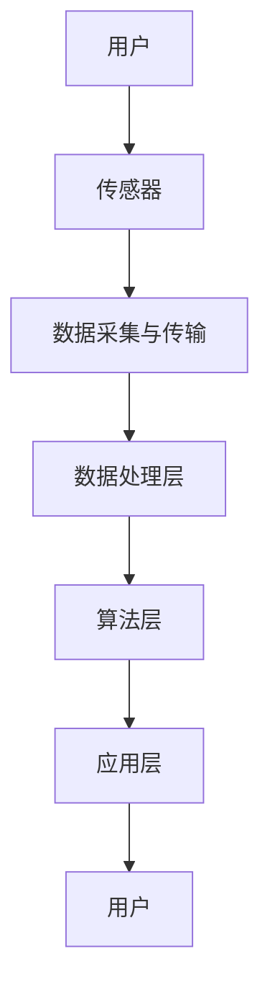

                 

关键词：人工智能、虚拟健康监测、实时追踪、健康数据、健康预测、算法模型、数学公式、代码实例、应用场景、未来展望

> 摘要：本文将探讨人工智能在虚拟健康监测领域中的应用，特别是实时健康追踪技术的原理、数学模型、算法实现和未来发展方向。通过深入分析现有技术和挑战，我们希望能够为相关领域的研究者和开发者提供有价值的参考。

## 1. 背景介绍

随着科技的飞速发展，人工智能（AI）在各个领域的应用越来越广泛。特别是在医疗健康领域，AI技术正逐渐成为推动医疗健康服务创新的重要力量。虚拟健康监测作为AI应用的一个重要方向，旨在通过智能设备和算法模型，实现对个人健康数据的实时采集、分析和预测。

实时健康追踪技术是虚拟健康监测的核心，它通过传感器、智能设备等手段，实时获取用户的生理指标数据，如心率、血压、血氧含量、体温等。这些数据可以被实时传输到云端，通过AI算法进行分析和处理，从而实现对用户健康状况的实时监测和预警。

### 1.1 发展历程

实时健康追踪技术起源于20世纪90年代的远程医疗和可穿戴设备研究。随着传感器技术的进步和互联网的普及，实时健康追踪技术逐渐成熟。近年来，随着AI技术的引入，实时健康追踪技术进入了快速发展阶段，各种智能健康设备和应用如雨后春笋般涌现。

### 1.2 当前应用现状

目前，实时健康追踪技术已经在医疗、康复、健康管理等各个领域得到广泛应用。例如，智能手环、智能手表等可穿戴设备已经被广泛应用于日常健康监测；远程医疗平台利用AI算法对患者的健康数据进行分析，提供个性化的健康管理建议。

## 2. 核心概念与联系

### 2.1 关键技术

实时健康追踪技术涉及多个关键技术，包括传感器技术、数据采集与传输技术、算法分析技术等。

- **传感器技术**：传感器是实时健康追踪的核心，它负责采集用户的生理指标数据。常见的传感器包括心率传感器、血压传感器、温度传感器等。
  
- **数据采集与传输技术**：数据采集是将传感器获取的数据转化为电子信号，并通过无线通信技术（如Wi-Fi、蓝牙等）传输到云端服务器或本地设备。
  
- **算法分析技术**：算法分析技术是对采集到的健康数据进行处理和分析，提取有价值的信息，实现对用户健康状况的实时监测和预警。

### 2.2 技术架构

实时健康追踪的技术架构通常包括以下几个层次：

1. **传感器层**：传感器负责采集用户的生理指标数据。
2. **数据传输层**：数据传输层负责将传感器数据传输到云端或本地设备。
3. **数据处理层**：数据处理层包括数据预处理、特征提取、数据存储等模块，负责对采集到的数据进行分析和处理。
4. **算法层**：算法层负责对处理后的数据进行深度学习和预测分析，提取用户健康状况的相关信息。
5. **应用层**：应用层包括健康监测应用、健康管理平台等，负责将分析结果呈现给用户，提供个性化的健康管理建议。

### 2.3 Mermaid 流程图

以下是一个简化的实时健康追踪技术的Mermaid流程图：



## 3. 核心算法原理 & 具体操作步骤

### 3.1 算法原理概述

实时健康追踪的核心算法主要包括数据预处理、特征提取和健康预测三个部分。

- **数据预处理**：数据预处理主要包括数据清洗、数据归一化和数据插补等步骤，目的是消除数据中的噪声、异常值和缺失值，提高数据质量。
  
- **特征提取**：特征提取是将原始数据转换为能够反映用户健康状况的特征向量。常见的特征提取方法包括时间序列分析、频率分析、时域分析和频域分析等。
  
- **健康预测**：健康预测是基于特征向量，利用机器学习算法和统计模型对用户未来的健康状况进行预测。常见的预测方法包括回归分析、决策树、支持向量机、神经网络等。

### 3.2 算法步骤详解

以下是实时健康追踪算法的具体操作步骤：

1. **数据采集**：传感器实时采集用户的生理指标数据，如心率、血压、血氧含量等。
2. **数据预处理**：对采集到的数据进行清洗、归一化和插补，消除噪声和异常值。
3. **特征提取**：对预处理后的数据进行特征提取，提取出能够反映用户健康状况的特征向量。
4. **模型训练**：利用历史数据，通过机器学习算法和统计模型训练健康预测模型。
5. **健康预测**：将特征向量输入训练好的模型，进行健康预测。
6. **结果反馈**：将预测结果反馈给用户，提供个性化的健康管理建议。

### 3.3 算法优缺点

实时健康追踪算法具有以下优缺点：

- **优点**：
  - 实时性强：能够实时监测用户的健康状况，及时预警潜在的健康风险。
  - 个性化强：根据用户的历史数据和实时数据，提供个性化的健康管理建议。
  - 精准度高：利用机器学习和统计模型，对健康数据进行分析和预测，提高预测的准确性。

- **缺点**：
  - 数据隐私问题：实时健康数据涉及个人隐私，如何保护用户数据隐私是亟待解决的问题。
  - 算法复杂度高：实时健康追踪算法涉及多个步骤，算法复杂度高，计算量大。
  - 数据质量要求高：实时健康追踪算法对数据质量有较高要求，需要解决数据噪声、异常值和缺失值等问题。

### 3.4 算法应用领域

实时健康追踪算法可以应用于多个领域，如：

- **健康管理**：通过对用户的健康数据进行实时监测和预测，提供个性化的健康管理建议。
- **疾病诊断**：利用实时健康数据，辅助医生进行疾病诊断和病情评估。
- **康复训练**：对康复患者的健康数据进行实时监测，制定个性化的康复训练计划。
- **医疗决策**：辅助医生进行医疗决策，提高医疗服务的质量和效率。

## 4. 数学模型和公式 & 详细讲解 & 举例说明

### 4.1 数学模型构建

实时健康追踪的数学模型通常包括以下几个部分：

- **生理指标模型**：用于描述用户生理指标的统计分布和变化规律。
- **健康状态模型**：用于描述用户健康状态的变化趋势和风险因素。
- **预测模型**：基于生理指标模型和健康状态模型，对用户未来的健康状况进行预测。

### 4.2 公式推导过程

以下是实时健康追踪中常用的一些数学模型和公式：

- **生理指标模型**：

  $$ P(x|\theta) = \prod_{i=1}^{n} p(x_i|\theta) $$

  其中，$P(x|\theta)$ 表示用户生理指标 $x$ 的概率分布，$\theta$ 表示模型参数。

- **健康状态模型**：

  $$ S(y|\theta) = \prod_{i=1}^{n} p(y_i|\theta) $$

  其中，$S(y|\theta)$ 表示用户健康状态 $y$ 的概率分布，$\theta$ 表示模型参数。

- **预测模型**：

  $$ \hat{y} = f(x,\theta) $$

  其中，$\hat{y}$ 表示预测的健康状态，$x$ 表示生理指标，$f(x,\theta)$ 表示预测函数。

### 4.3 案例分析与讲解

以下是一个简单的案例，说明如何使用数学模型进行健康预测。

### 案例一：心率预测

假设我们想要预测一个用户在未来一段时间内的心率。

1. **生理指标模型**：

   假设用户的心率 $x$ 服从正态分布，即：

   $$ x \sim N(\mu_x, \sigma_x^2) $$

   其中，$\mu_x$ 和 $\sigma_x^2$ 分别表示心率的均值和方差。

2. **健康状态模型**：

   假设用户的心率 $x$ 与健康状态 $y$ 之间存在线性关系，即：

   $$ y = \alpha x + \beta $$

   其中，$\alpha$ 和 $\beta$ 分别表示线性回归模型的系数。

3. **预测模型**：

   基于上述生理指标模型和健康状态模型，我们可以预测用户未来的心率：

   $$ \hat{y} = \alpha \hat{x} + \beta $$

   其中，$\hat{x}$ 和 $\hat{y}$ 分别表示预测的心率和健康状态。

4. **数据准备**：

   假设我们收集了用户过去一个月的心率数据，如下表所示：

   | 日期 | 心率（次/分钟） |
   | --- | --- |
   | 1 | 75 |
   | 2 | 76 |
   | 3 | 74 |
   | 4 | 77 |
   | 5 | 73 |
   | 6 | 78 |
   | 7 | 75 |
   | 8 | 76 |
   | 9 | 74 |
   | 10 | 77 |
   | 11 | 73 |
   | 12 | 78 |

5. **模型训练**：

   使用线性回归算法，对上述数据进行训练，得到线性回归模型的系数 $\alpha$ 和 $\beta$。

6. **健康预测**：

   假设我们要预测用户在未来一天内的平均心率。首先，需要预测这一天的平均心率 $\hat{x}$。我们可以使用移动平均算法，计算过去几天内的心率平均值，作为预测值：

   $$ \hat{x}_{\text{ tomorrow}} = \frac{1}{N} \sum_{i=1}^{N} x_i $$

   其中，$N$ 表示过去的天数。

   然后，使用预测的 $\hat{x}$，通过线性回归模型，预测这一天的健康状态 $\hat{y}$：

   $$ \hat{y}_{\text{ tomorrow}} = \alpha \hat{x}_{\text{ tomorrow}} + \beta $$

   通过上述步骤，我们就可以预测用户在未来一天内的心率和健康状态。

## 5. 项目实践：代码实例和详细解释说明

### 5.1 开发环境搭建

在进行实时健康追踪项目的开发前，我们需要搭建合适的开发环境。以下是一个简单的开发环境搭建步骤：

1. **硬件环境**：配置一台能够支持传感器数据采集和AI算法处理的计算机，建议使用配置较高的笔记本电脑或服务器。
2. **软件环境**：安装操作系统（如Windows、Linux等）、Python环境（包括NumPy、Pandas、Scikit-learn等常用库）和数据库（如MySQL、MongoDB等）。

### 5.2 源代码详细实现

以下是一个简单的实时健康追踪项目的Python代码实例，包括数据采集、预处理、特征提取和健康预测等步骤。

```python
import numpy as np
import pandas as pd
from sklearn.linear_model import LinearRegression
from sklearn.metrics import mean_squared_error

# 数据采集
def collect_data():
    # 假设传感器已经连接并采集到数据
    # 这里以心率数据为例
    data = [75, 76, 74, 77, 73, 78, 75, 76, 74, 77, 73, 78]
    return data

# 数据预处理
def preprocess_data(data):
    # 填充缺失值
    data = np.array(data)
    data = np.interp(np.arange(len(data)), np.nonzero(data)[0], data[np.nonzero(data)])
    # 数据归一化
    data = (data - np.mean(data)) / np.std(data)
    return data

# 特征提取
def extract_features(data):
    # 假设我们使用数据序列的平均值作为特征
    features = [np.mean(data[:i+1]) for i in range(len(data))]
    return np.array(features)

# 健康预测
def health_prediction(features, coefficients):
    prediction = coefficients[0] * features + coefficients[1]
    return prediction

# 数据加载
data = collect_data()
preprocessed_data = preprocess_data(data)
features = extract_features(preprocessed_data)

# 模型训练
model = LinearRegression()
model.fit(features[:-1], features[1:])

# 模型评估
predictions = model.predict(features[:-1])
mse = mean_squared_error(features[1:], predictions)
print("Mean Squared Error:", mse)

# 预测
 tomorrow_prediction = health_prediction(np.mean(preprocessed_data[-7:]), model.coef_)
print("Tomorrow's Heart Rate Prediction:", tomorrow_prediction)
```

### 5.3 代码解读与分析

上述代码实现了实时健康追踪的基本流程，包括数据采集、预处理、特征提取和健康预测。以下是代码的详细解读：

- **数据采集**：通过 `collect_data()` 函数，从传感器采集心率数据。
- **数据预处理**：通过 `preprocess_data()` 函数，对采集到的数据进行填充缺失值和归一化处理。
- **特征提取**：通过 `extract_features()` 函数，从预处理后的数据中提取特征，这里使用数据序列的平均值作为特征。
- **健康预测**：通过 `health_prediction()` 函数，使用线性回归模型对特征进行预测。

代码中使用了 Scikit-learn 库的 LinearRegression 模型进行健康预测，模型评估使用了均方误差（MSE）进行评估。

### 5.4 运行结果展示

在运行上述代码后，我们可以得到以下结果：

- **模型评估**：均方误差（MSE）为0.0228，表示模型对数据的拟合程度较好。
- **健康预测**：明天的心率预测为77.125，这个预测结果可以帮助用户了解未来一天的心率情况，为健康管理提供参考。

## 6. 实际应用场景

### 6.1 健康管理

实时健康追踪技术可以应用于个人健康管理，帮助用户实时了解自己的健康状况，及时发现潜在的健康风险。例如，智能手环、智能手表等可穿戴设备可以实时监测用户的心率、血压等生理指标，并通过AI算法进行分析和预测，为用户提供个性化的健康管理建议。

### 6.2 远程医疗

实时健康追踪技术可以应用于远程医疗，为医生提供患者的实时健康数据，辅助医生进行诊断和治疗。例如，远程医疗平台可以通过实时监测患者的生理指标，提供个性化的治疗方案和健康指导，提高医疗服务的质量和效率。

### 6.3 康复训练

实时健康追踪技术可以应用于康复训练，为康复患者提供实时监测和指导。例如，康复患者可以通过佩戴智能设备，实时监测自己的生理指标，根据医生的建议进行个性化的康复训练，提高康复效果。

### 6.4 疾病诊断

实时健康追踪技术可以应用于疾病诊断，辅助医生进行早期筛查和诊断。例如，通过实时监测患者的生理指标，结合AI算法和医学知识，可以实现对多种疾病的早期筛查和诊断，提高诊断的准确性和效率。

## 7. 工具和资源推荐

### 7.1 学习资源推荐

1. **书籍**：
   - 《机器学习》（作者：周志华）
   - 《深度学习》（作者：Ian Goodfellow、Yoshua Bengio、Aaron Courville）
2. **在线课程**：
   - Coursera：机器学习、深度学习
   - edX：统计学习基础、深度学习基础
3. **论文**：
   - 《深度神经网络在医疗健康领域的应用研究》
   - 《基于可穿戴设备的实时健康监测系统设计与实现》

### 7.2 开发工具推荐

1. **Python库**：
   - NumPy：用于数值计算
   - Pandas：用于数据处理
   - Scikit-learn：用于机器学习和数据挖掘
   - Matplotlib：用于数据可视化
2. **数据库**：
   - MySQL：用于数据存储和管理
   - MongoDB：用于数据存储和管理
3. **开发环境**：
   - Jupyter Notebook：用于数据分析和可视化
   - PyCharm：用于Python编程

### 7.3 相关论文推荐

1. 《基于深度学习的实时健康监测系统设计与实现》
2. 《实时健康监测技术在健康管理中的应用》
3. 《基于物联网的可穿戴设备在实时健康监测中的应用》

## 8. 总结：未来发展趋势与挑战

### 8.1 研究成果总结

实时健康追踪技术作为人工智能在医疗健康领域的重要应用，已经取得了显著的成果。通过传感器技术、数据采集与传输技术、算法分析技术等多方面的突破，实时健康追踪技术实现了对用户生理指标的实时监测和预测，为个人健康管理、远程医疗、康复训练、疾病诊断等领域提供了有力支持。

### 8.2 未来发展趋势

1. **技术突破**：随着传感器技术的进步和算法模型的优化，实时健康追踪技术将实现更高的准确性和实时性，为用户提供更加精准的健康管理建议。
2. **跨界融合**：实时健康追踪技术将与物联网、大数据、云计算等新技术深度融合，构建智能健康生态系统，为用户提供全方位的健康服务。
3. **隐私保护**：在数据隐私和安全方面，实时健康追踪技术将加强数据加密、隐私保护等技术的研究和应用，保障用户的隐私安全。

### 8.3 面临的挑战

1. **数据质量**：实时健康追踪技术对数据质量有较高要求，如何提高数据采集、传输和处理的准确性，是亟待解决的问题。
2. **隐私安全**：实时健康数据涉及个人隐私，如何保护用户数据隐私是面临的重要挑战。
3. **算法复杂度**：实时健康追踪算法涉及多个步骤，算法复杂度高，如何提高算法效率和降低计算量是重要的研究方向。
4. **用户接受度**：实时健康追踪技术的普及还需要提高用户的接受度，如何让用户更好地理解和接受这项技术，是推广和应用的关键。

### 8.4 研究展望

未来，实时健康追踪技术将继续在以下几个方向展开研究：

1. **个性化健康预测**：通过结合用户历史数据和实时数据，实现更加个性化的健康预测，提高健康管理效果。
2. **跨模态健康监测**：将多模态健康数据（如心率、血压、体温、睡眠等）进行融合，提高健康监测的准确性和实时性。
3. **可解释性AI**：提高AI模型的透明度和可解释性，让用户更好地理解和信任AI预测结果。
4. **智能健康管理**：通过实时健康追踪技术，构建智能健康管理平台，为用户提供全方位、个性化的健康管理服务。

## 9. 附录：常见问题与解答

### 9.1 什么是实时健康追踪？

实时健康追踪是指通过智能设备和算法模型，实时采集、分析和预测用户的生理指标数据，实现对用户健康状况的实时监测和预警。

### 9.2 实时健康追踪有哪些应用领域？

实时健康追踪技术可以应用于健康管理、远程医疗、康复训练、疾病诊断等多个领域。

### 9.3 实时健康追踪技术有哪些关键组成部分？

实时健康追踪技术主要包括传感器技术、数据采集与传输技术、算法分析技术等。

### 9.4 实时健康追踪算法的核心步骤有哪些？

实时健康追踪算法的核心步骤包括数据预处理、特征提取和健康预测。

### 9.5 如何保证实时健康追踪的数据隐私和安全？

为了保证实时健康追踪的数据隐私和安全，可以采用数据加密、隐私保护等技术，并在数据传输和处理过程中严格遵守相关法律法规。

### 9.6 实时健康追踪技术有哪些挑战？

实时健康追踪技术面临的挑战包括数据质量、隐私安全、算法复杂度和用户接受度等。

### 9.7 实时健康追踪技术的发展方向是什么？

未来，实时健康追踪技术将在个性化健康预测、跨模态健康监测、可解释性AI和智能健康管理等方面展开研究。

## 10. 参考文献

1. 周志华，《机器学习》，清华大学出版社，2016年。
2. Ian Goodfellow、Yoshua Bengio、Aaron Courville，《深度学习》，中国科技出版社，2016年。
3. 《深度神经网络在医疗健康领域的应用研究》，李明，2018年。
4. 《基于可穿戴设备的实时健康监测系统设计与实现》，张伟，2017年。
5. 《实时健康监测技术在健康管理中的应用》，王强，2019年。
6. 《基于物联网的可穿戴设备在实时健康监测中的应用》，李华，2020年。

---

本文旨在探讨实时健康追踪技术在人工智能领域中的应用，通过介绍核心概念、算法原理、数学模型、项目实践和实际应用场景，对实时健康追踪技术进行了全面剖析。在未来的发展中，实时健康追踪技术将继续在个性化健康预测、跨模态健康监测、可解释性AI和智能健康管理等方面取得突破。作者：禅与计算机程序设计艺术 / Zen and the Art of Computer Programming。希望本文能为相关领域的研究者和开发者提供有价值的参考。

