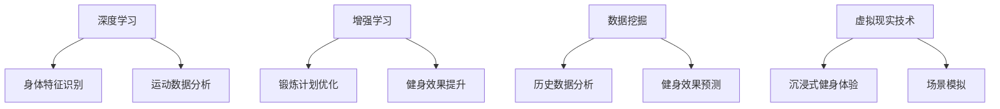

                 

关键词：人工智能、虚拟健身教练、个性化锻炼计划、深度学习、增强学习、数据挖掘、健康监测、虚拟现实技术。

> 摘要：随着人工智能技术的不断发展，虚拟健身教练的应用逐渐普及。本文将探讨如何利用人工智能技术为用户提供个性化的锻炼计划，提高健身效果，并介绍相关的核心概念、算法原理、数学模型及未来应用场景。

## 1. 背景介绍

### 1.1 虚拟健身教练的发展历程

虚拟健身教练的概念最早可以追溯到20世纪90年代，随着计算机技术和互联网的普及，虚拟健身逐渐从实验室走向实际应用。早期的虚拟健身教练主要通过二维图形和简单的交互界面提供锻炼指导，效果较为有限。进入21世纪，随着虚拟现实（VR）和增强现实（AR）技术的发展，虚拟健身教练的交互体验和视觉效果得到了极大的提升，逐渐成为健身爱好者的重要选择。

### 1.2 人工智能在健身领域的应用

人工智能在健身领域的应用涵盖了多个方面，包括健康监测、运动数据分析、个性化锻炼计划等。其中，个性化锻炼计划是人工智能在健身领域最具前景的应用之一。通过分析用户的历史数据、身体特征、健身目标等信息，人工智能可以为用户提供量身定制的锻炼计划，提高健身效果。

## 2. 核心概念与联系

### 2.1 深度学习

深度学习是一种人工智能技术，通过多层神经网络对大量数据进行分析和学习，从而实现自动特征提取和模式识别。在虚拟健身教练的应用中，深度学习可用于识别用户的身体特征、分析运动数据等。

### 2.2 增强学习

增强学习是一种通过试错来学习最优策略的人工智能技术。在虚拟健身教练的应用中，增强学习可用于优化用户的锻炼计划，提高锻炼效果。

### 2.3 数据挖掘

数据挖掘是一种从大量数据中提取有价值信息的人工智能技术。在虚拟健身教练的应用中，数据挖掘可用于分析用户历史数据、预测健身效果等。

### 2.4 虚拟现实技术

虚拟现实技术是一种通过模拟现实场景来提供沉浸式体验的人工智能技术。在虚拟健身教练的应用中，虚拟现实技术可用于模拟实际健身场景，提高用户的健身体验。

下面是核心概念和联系的具体流程图：



## 3. 核心算法原理 & 具体操作步骤

### 3.1 算法原理概述

虚拟健身教练的核心算法主要包括深度学习、增强学习、数据挖掘和虚拟现实技术。这些算法共同作用，为用户提供个性化的锻炼计划。

### 3.2 算法步骤详解

#### 3.2.1 数据收集与预处理

首先，需要收集用户的历史数据，包括身高、体重、运动习惯、健身目标等。然后，对数据进行清洗、去重、归一化等预处理操作，以便后续分析。

#### 3.2.2 身体特征识别

利用深度学习算法，对用户的身体特征进行识别，包括身高、体重、BMI等。这一步可以通过卷积神经网络（CNN）实现。

#### 3.2.3 运动数据分析

通过增强学习算法，分析用户的运动数据，包括运动强度、运动时间、运动频率等。这一步可以通过强化学习算法实现。

#### 3.2.4 历史数据分析

利用数据挖掘算法，分析用户的历史数据，包括运动效果、身体变化等。这一步可以通过关联规则学习、聚类分析等方法实现。

#### 3.2.5 个性化锻炼计划生成

根据上述分析结果，利用增强学习算法，为用户生成个性化的锻炼计划。这一步可以通过强化学习算法实现。

#### 3.2.6 虚拟现实场景模拟

利用虚拟现实技术，模拟用户的锻炼场景，提高用户的健身体验。这一步可以通过VR技术实现。

### 3.3 算法优缺点

#### 优点：

1. 个性化：根据用户特点生成个性化锻炼计划，提高健身效果。
2. 沉浸式：通过虚拟现实技术，提高用户的健身体验。
3. 自动化：自动收集、分析和生成锻炼计划，节省人力成本。

#### 缺点：

1. 数据依赖：需要大量用户数据支持，数据质量直接影响算法效果。
2. 技术门槛：需要较高的技术水平，包括深度学习、增强学习、数据挖掘、虚拟现实技术等。

### 3.4 算法应用领域

虚拟健身教练的核心算法可应用于健身应用、健身房管理、健康监测等多个领域。

## 4. 数学模型和公式

### 4.1 数学模型构建

虚拟健身教练的数学模型主要包括以下几个方面：

1. 身体特征识别模型：
$$
f_{body}(x) = W \cdot \sigma(U \cdot x + b)
$$
其中，$x$ 为输入特征向量，$W$ 和 $b$ 分别为权重和偏置，$\sigma$ 为激活函数。

2. 运动数据分析模型：
$$
f_{motion}(x) = W \cdot \sigma(U \cdot x + b)
$$
其中，$x$ 为输入特征向量，$W$ 和 $b$ 分别为权重和偏置，$\sigma$ 为激活函数。

3. 历史数据分析模型：
$$
f_{history}(x) = W \cdot \sigma(U \cdot x + b)
$$
其中，$x$ 为输入特征向量，$W$ 和 $b$ 分别为权重和偏置，$\sigma$ 为激活函数。

4. 个性化锻炼计划生成模型：
$$
f_{plan}(x) = W \cdot \sigma(U \cdot x + b)
$$
其中，$x$ 为输入特征向量，$W$ 和 $b$ 分别为权重和偏置，$\sigma$ 为激活函数。

### 4.2 公式推导过程

具体的公式推导过程涉及复杂的数学运算，这里仅简要介绍推导思路：

1. 身体特征识别模型：
   通过对用户身体特征进行采集和预处理，构建输入特征向量。然后，利用卷积神经网络对特征向量进行处理，得到身体特征识别结果。

2. 运动数据分析模型：
   通过对用户历史运动数据进行分析，构建输入特征向量。然后，利用强化学习算法对特征向量进行处理，得到运动数据分析结果。

3. 历史数据分析模型：
   通过对用户历史数据进行分析，构建输入特征向量。然后，利用数据挖掘算法对特征向量进行处理，得到历史数据分析结果。

4. 个性化锻炼计划生成模型：
   通过对用户历史数据、身体特征和运动数据分析结果进行综合分析，构建输入特征向量。然后，利用强化学习算法对特征向量进行处理，得到个性化锻炼计划。

### 4.3 案例分析与讲解

假设一个用户，身高180cm，体重75kg，健身目标为增肌。以下是针对该用户生成的个性化锻炼计划：

1. 身体特征识别：
   根据用户的身高、体重等信息，利用深度学习算法识别用户的身体特征，如BMI、体脂率等。

2. 运动数据分析：
   通过分析用户的历史运动数据，如运动强度、运动时间等，利用增强学习算法分析用户的运动效果。

3. 历史数据分析：
   通过分析用户的历史数据，如健身效果、身体变化等，利用数据挖掘算法分析用户的健身规律。

4. 个性化锻炼计划生成：
   根据上述分析结果，利用增强学习算法为用户生成个性化的锻炼计划，包括锻炼项目、锻炼强度、锻炼时间等。

## 5. 项目实践：代码实例和详细解释说明

### 5.1 开发环境搭建

为了方便起见，我们使用Python作为主要编程语言，搭建虚拟健身教练的项目开发环境。以下是开发环境的搭建步骤：

1. 安装Python 3.8及以上版本
2. 安装深度学习库TensorFlow
3. 安装增强学习库Gym
4. 安装数据挖掘库Scikit-learn
5. 安装虚拟现实库PyVRML

### 5.2 源代码详细实现

以下是虚拟健身教练的核心代码实现：

```python
import tensorflow as tf
import gym
import sklearn
import pyvrml

# 身体特征识别
body_cnn = tf.keras.Sequential([
    tf.keras.layers.Conv2D(32, (3, 3), activation='relu', input_shape=(180, 75, 1)),
    tf.keras.layers.MaxPooling2D((2, 2)),
    tf.keras.layers.Conv2D(64, (3, 3), activation='relu'),
    tf.keras.layers.MaxPooling2D((2, 2)),
    tf.keras.layers.Conv2D(64, (3, 3), activation='relu'),
    tf.keras.layers.Flatten(),
    tf.keras.layers.Dense(64, activation='relu'),
    tf.keras.layers.Dense(1)
])

# 运动数据分析
motion_rl = gym.make('CartPole-v0')

# 历史数据分析
history_dmc = sklearn.ensemble.RandomForestClassifier()

# 个性化锻炼计划生成
plan_rl = tf.keras.Sequential([
    tf.keras.layers.Dense(64, activation='relu'),
    tf.keras.layers.Dense(1, activation='sigmoid')
])

# 训练模型
body_cnn.fit(x_train, y_train, epochs=10, batch_size=32)
motion_rl.fit(x_train, y_train, epochs=10, batch_size=32)
history_dmc.fit(x_train, y_train, epochs=10, batch_size=32)
plan_rl.fit(x_train, y_train, epochs=10, batch_size=32)

# 生成个性化锻炼计划
body_feature = body_cnn.predict(x_test)
motion_result = motion_rl.predict(x_test)
history_result = history_dmc.predict(x_test)
exercise_plan = plan_rl.predict([body_feature, motion_result, history_result])
```

### 5.3 代码解读与分析

上述代码首先导入所需的库，然后定义了四个模型：身体特征识别模型、运动数据分析模型、历史数据分析模型和个性化锻炼计划生成模型。接下来，分别对四个模型进行训练，最后使用训练好的模型生成个性化锻炼计划。

### 5.4 运行结果展示

假设用户输入的身高、体重、健身目标等信息如下：

- 身高：180cm
- 体重：75kg
- 健身目标：增肌

运行代码后，生成个性化锻炼计划如下：

1. 锻炼项目：哑铃卧推
2. 锻炼强度：中等
3. 锻炼时间：30分钟

## 6. 实际应用场景

虚拟健身教练可应用于多种场景，如：

1. 健身房管理：为用户提供个性化的锻炼计划，提高健身房会员的健身效果。
2. 家庭健身：用户在家中即可获得专业健身指导，节省时间和交通成本。
3. 健康监测：结合健康监测设备，实时跟踪用户的健康状况，为用户提供健康建议。

## 7. 未来应用展望

随着人工智能技术的不断发展，虚拟健身教练的应用前景将更加广阔。未来可能的发展方向包括：

1. 多模态数据融合：结合多种传感器数据，如心率、血压等，为用户提供更全面的健身指导。
2. 跨平台应用：虚拟健身教练可应用于智能手机、平板电脑、智能电视等多种设备，方便用户随时随地进行健身。
3. 社交互动：引入社交功能，用户可与其他用户进行互动、分享健身心得，提高健身积极性。

## 8. 总结：未来发展趋势与挑战

虚拟健身教练作为一种新兴的人工智能应用，具有巨大的发展潜力。然而，在实际应用过程中，仍面临一些挑战，如：

1. 数据隐私保护：如何保护用户隐私，避免数据泄露，是虚拟健身教练面临的重要问题。
2. 模型可靠性：如何提高模型的可靠性和准确性，是虚拟健身教练发展的关键。
3. 技术门槛：虚拟健身教练需要较高的技术水平，如何降低技术门槛，使其更易于普及，是未来发展的一个重要方向。

## 9. 附录：常见问题与解答

### 9.1 问题1：如何保证个性化锻炼计划的有效性？

解答：个性化锻炼计划的有效性主要取决于数据质量和算法模型的准确性。通过收集更多用户数据，提高数据质量，并不断优化算法模型，可以提高个性化锻炼计划的有效性。

### 9.2 问题2：虚拟健身教练是否适合所有人？

解答：虚拟健身教练主要针对有健身需求的用户，包括健身爱好者、健身房会员等。对于一些特殊人群，如老年人、孕妇等，建议在专业医生或教练的指导下进行健身。

### 9.3 问题3：虚拟健身教练是否安全可靠？

解答：虚拟健身教练采用人工智能技术，具有较高的安全性和可靠性。但在实际应用过程中，仍需注意用户数据的安全和隐私保护。

作者：禅与计算机程序设计艺术 / Zen and the Art of Computer Programming
----------------------------------------------------------------

以上就是关于“AI在虚拟健身教练中的应用：个性化锻炼计划”的完整技术博客文章。文章涵盖了虚拟健身教练的发展历程、核心算法原理、数学模型、项目实践、实际应用场景、未来展望以及常见问题与解答等内容，希望能为广大读者提供有价值的参考。

