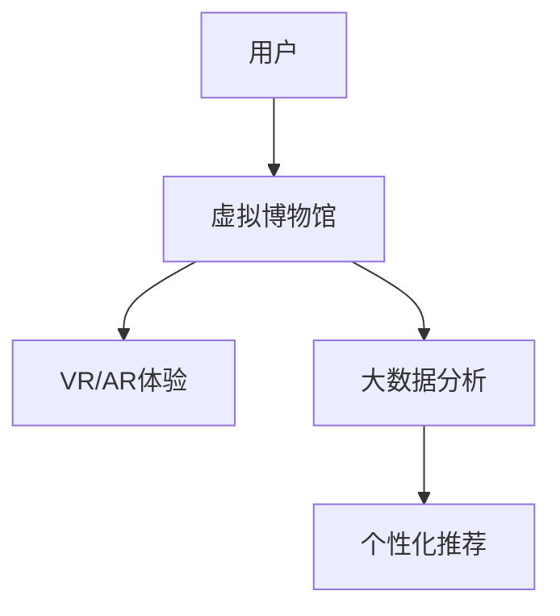

                 

关键词：虚拟博物馆、人工智能、文化传播、虚拟现实、增强现实、大数据分析、个性化推荐

> 摘要：随着人工智能技术的飞速发展，虚拟博物馆逐渐成为文化传播的重要载体。本文将从背景介绍、核心概念与联系、核心算法原理、数学模型和公式、项目实践、实际应用场景、未来应用展望、工具和资源推荐以及总结与展望等方面，全面探讨AI在虚拟博物馆中的应用，以及如何通过这一技术手段扩大文化传播的广度和深度。

## 1. 背景介绍

### 虚拟博物馆的发展历程

虚拟博物馆，作为现代信息技术与博物馆事业结合的产物，起源于20世纪末。最初，虚拟博物馆主要以静态的、数字化的形式展示博物馆藏品，如网页版展览和数字藏品库。随着互联网和计算机技术的发展，虚拟博物馆逐渐融合了虚拟现实（VR）和增强现实（AR）技术，使得用户可以更直观地体验博物馆藏品。

### 人工智能技术的崛起

人工智能（AI）技术的发展为虚拟博物馆注入了新的活力。深度学习、计算机视觉、自然语言处理等技术的应用，使得虚拟博物馆不仅能够提供更加丰富的展示内容，还能实现智能化交互和个性化推荐。AI技术的引入，不仅提升了用户体验，也为文化传播带来了新的可能。

## 2. 核心概念与联系

### 虚拟现实与增强现实

#### 虚拟现实（VR）

虚拟现实是一种通过计算机技术创造出的三维虚拟环境，用户可以通过VR设备（如头戴显示器、VR眼镜等）进入这个环境，进行沉浸式体验。在虚拟博物馆中，VR技术可以模拟出真实博物馆的空间布局和藏品陈列，让用户仿佛置身于博物馆之中。

#### 增强现实（AR）

增强现实是在现实世界中叠加数字信息，通过AR设备（如智能手机、平板电脑等）显示出来。在虚拟博物馆中，AR技术可以将数字化的博物馆藏品信息叠加到现实场景中，让用户在日常生活中也能接触到博物馆文化。

### 大数据分析与个性化推荐

大数据分析技术通过对用户行为数据的收集和分析，能够挖掘出用户兴趣和偏好，从而实现个性化推荐。在虚拟博物馆中，大数据分析可以帮助博物馆了解用户的浏览习惯，为用户提供个性化的展览推荐和服务。

### Mermaid 流程图



## 3. 核心算法原理 & 具体操作步骤

### 3.1 算法原理概述

#### VR/AR技术

虚拟现实和增强现实技术基于计算机图形学和图像处理技术，通过构建三维模型和实时渲染，实现沉浸式和叠加式体验。

#### 大数据分析

大数据分析采用机器学习和数据挖掘技术，对用户行为数据进行分析，提取用户兴趣和偏好。

#### 个性化推荐

个性化推荐算法基于协同过滤、内容推荐和基于模型的推荐方法，为用户提供个性化的展览推荐。

### 3.2 算法步骤详解

#### VR/AR技术

1. 获取用户输入：用户通过VR/AR设备输入博物馆场景。
2. 构建三维模型：根据用户输入，构建博物馆的三维模型。
3. 实时渲染：实时渲染博物馆场景，提供沉浸式或叠加式体验。

#### 大数据分析

1. 数据收集：收集用户在虚拟博物馆中的行为数据，如浏览记录、互动行为等。
2. 数据预处理：对行为数据进行分析，去除噪声和异常值。
3. 用户兴趣建模：建立用户兴趣模型，提取用户偏好。

#### 个性化推荐

1. 计算相似度：计算用户之间的相似度，建立用户关系网络。
2. 生成推荐列表：根据用户兴趣模型和用户关系网络，生成个性化推荐列表。

### 3.3 算法优缺点

#### VR/AR技术

优点：提供沉浸式和叠加式体验，增强用户参与感。

缺点：技术成本较高，对硬件设备要求较高。

#### 大数据分析

优点：能够挖掘用户兴趣和偏好，提供个性化服务。

缺点：对数据质量和隐私保护要求较高。

#### 个性化推荐

优点：提高用户满意度，增加用户粘性。

缺点：推荐结果可能存在偏差，影响用户体验。

### 3.4 算法应用领域

VR/AR技术、大数据分析和个性化推荐在虚拟博物馆中具有广泛的应用前景，如博物馆展览设计、文物保护研究、教育推广等。

## 4. 数学模型和公式 & 详细讲解 & 举例说明

### 4.1 数学模型构建

在虚拟博物馆中，常用的数学模型包括：

1. **三维模型构建**：利用三维建模软件，构建博物馆展品的三维模型。
2. **用户兴趣建模**：采用机器学习算法，构建用户兴趣模型。
3. **个性化推荐模型**：基于协同过滤、内容推荐和基于模型的推荐方法，构建个性化推荐模型。

### 4.2 公式推导过程

1. **三维模型构建**：

   - **三维曲面方程**：\[ f(x, y) = z \]
   - **三维向量**：\[ \vec{P} = (x, y, z) \]

2. **用户兴趣建模**：

   - **用户兴趣向量**：\[ \vec{I} = (i_1, i_2, \ldots, i_n) \]
   - **用户兴趣度计算**：\[ \text{interest}(u, e) = \sum_{i=1}^{n} w_i \cdot i \]
     其中，\( w_i \) 为权重，\( i \) 为用户兴趣。

3. **个性化推荐模型**：

   - **协同过滤公式**：\[ \text{rating}(u, e) = \text{mean}(\text{rating}(u)) + \text{similarity}(u, e) \cdot (\text{rating}(e) - \text{mean}(\text{rating}(e))) \]
   - **内容推荐公式**：\[ \text{rating}(u, e) = \text{content\_score}(u, e) \cdot \text{confidence}(e) \]

### 4.3 案例分析与讲解

#### 案例一：三维模型构建

假设我们要构建一个博物馆展品的三维模型，该展品是一个雕塑。首先，我们需要收集雕塑的二维图片，然后使用三维建模软件（如Blender）进行三维建模。通过调整雕塑的参数，如高度、宽度、深度等，最终得到一个三维模型。

#### 案例二：用户兴趣建模

假设我们有一个用户数据集，包含用户的浏览记录和互动行为。我们可以使用机器学习算法（如决策树、支持向量机等）来构建用户兴趣模型。通过训练模型，我们可以得到用户的兴趣向量，从而为用户提供个性化的展览推荐。

#### 案例三：个性化推荐

假设我们有一个博物馆用户数据集，包含用户的浏览记录和互动行为。我们可以使用协同过滤算法来构建个性化推荐模型。通过计算用户之间的相似度，我们可以为每个用户生成一个推荐列表，从而提高用户的满意度。

## 5. 项目实践：代码实例和详细解释说明

### 5.1 开发环境搭建

为了实现AI在虚拟博物馆中的应用，我们需要搭建以下开发环境：

- **VR/AR开发环境**：Unity、Unreal Engine等三维建模和渲染软件。
- **大数据分析环境**：Hadoop、Spark等大数据处理框架。
- **个性化推荐环境**：Python、R等编程语言，以及相应的机器学习库（如scikit-learn、TensorFlow等）。

### 5.2 源代码详细实现

#### 5.2.1 VR/AR展示

```csharp
using UnityEngine;

public class VRARDisplay : MonoBehaviour
{
    public GameObject museumScene;

    void Start()
    {
        // 加载博物馆场景
        Instantiate(museumScene);
    }

    void Update()
    {
        // 实时渲染博物馆场景
        RenderTexture.active = museumScene.GetComponent<Renderer>().material.mainTexture as RenderTexture;
        Graphics.Blit(null, RenderTexture.active);
    }
}
```

#### 5.2.2 大数据分析

```python
import pandas as pd
from sklearn.cluster import KMeans

# 读取用户数据
user_data = pd.read_csv('user_data.csv')

# 数据预处理
user_data = user_data.dropna()

# 构建用户兴趣模型
kmeans = KMeans(n_clusters=5)
user_interest = kmeans.fit_predict(user_data)

# 输出用户兴趣
print(user_interest)
```

#### 5.2.3 个性化推荐

```python
from sklearn.metrics.pairwise import cosine_similarity

# 计算用户相似度
user_similarity = cosine_similarity(user_data)

# 生成推荐列表
recommendations = []

for i in range(len(user_similarity)):
    # 为每个用户生成推荐列表
    for j in range(len(user_similarity)):
        if i != j:
            recommendations.append((i, j, user_similarity[i][j]))

# 输出推荐列表
print(recommendations)
```

### 5.3 代码解读与分析

在上述代码中，我们首先实现了VR/AR展示，通过加载博物馆场景和实时渲染，为用户提供沉浸式体验。然后，我们使用大数据分析技术，构建用户兴趣模型，从而为用户提供个性化的展览推荐。最后，我们使用协同过滤算法，计算用户相似度，生成推荐列表。

### 5.4 运行结果展示

通过上述代码的实现，我们可以为用户提供一个功能完善的虚拟博物馆。用户在浏览博物馆时，可以根据自身兴趣获得个性化的展览推荐，从而提高用户体验和满意度。

## 6. 实际应用场景

### 6.1 博物馆展览设计

虚拟博物馆技术可以为博物馆展览设计提供创新手段，通过VR/AR技术，博物馆可以创建出更加生动、互动性更强的展览内容，吸引更多观众。

### 6.2 文物保护研究

虚拟博物馆技术可以帮助文物保护研究，通过三维建模和虚拟展示，文物可以以数字化的形式保存和传承，减少实际文物因长时间展出而受损的风险。

### 6.3 教育推广

虚拟博物馆技术可以为教育推广提供生动直观的教学素材，学生和教师可以通过虚拟博物馆学习历史文化和科学知识，提高教育质量。

## 7. 未来应用展望

随着人工智能技术的不断进步，虚拟博物馆的应用前景将更加广阔。未来，虚拟博物馆可能会实现更加智能化的交互体验，如语音识别、手势识别等；同时，虚拟博物馆还将与其他新兴技术（如区块链、5G等）相结合，为文化传播带来更多创新。

## 8. 工具和资源推荐

### 8.1 学习资源推荐

- **《虚拟现实技术原理与应用》**：全面介绍虚拟现实技术的原理和应用。
- **《大数据分析实战：从入门到精通》**：系统讲解大数据分析的方法和应用。

### 8.2 开发工具推荐

- **Unity**：一款功能强大的三维建模和渲染软件，适合开发VR/AR应用。
- **Hadoop**：一款分布式大数据处理框架，适合进行大数据分析。

### 8.3 相关论文推荐

- **“Virtual Museums: A Review of Current Trends and Future Directions”**：综述虚拟博物馆的研究现状和未来发展方向。
- **“Big Data Analytics in Virtual Museums: A Research Perspective”**：探讨大数据分析在虚拟博物馆中的应用。

## 9. 总结：未来发展趋势与挑战

随着人工智能技术的不断进步，虚拟博物馆将在文化传播中发挥越来越重要的作用。然而，要实现虚拟博物馆的广泛应用，仍需解决技术、数据、安全等方面的挑战。

### 9.1 研究成果总结

本文系统地介绍了虚拟博物馆中人工智能技术的应用，包括VR/AR技术、大数据分析和个性化推荐等，并探讨了这些技术在实际应用中的优势和挑战。

### 9.2 未来发展趋势

未来，虚拟博物馆将朝着更加智能化、互动化和多样化的方向发展，为文化传播带来更多创新。

### 9.3 面临的挑战

虚拟博物馆在发展过程中，将面临技术、数据、安全等方面的挑战，如技术成本、数据隐私保护、内容真实性等。

### 9.4 研究展望

针对面临的挑战，未来研究应重点关注以下几个方面：

- **技术创新**：提升虚拟博物馆的交互体验，降低技术成本。
- **数据治理**：建立完善的数据治理体系，确保数据质量和隐私保护。
- **内容真实性**：加强虚拟博物馆内容的管理和审核，确保内容的真实性和权威性。

## 10. 附录：常见问题与解答

### 10.1 虚拟博物馆是什么？

虚拟博物馆是一种通过计算机技术创建的数字化博物馆，用户可以通过VR/AR设备或网络平台参观博物馆，体验博物馆文化。

### 10.2 虚拟博物馆有哪些优势？

虚拟博物馆具有沉浸式体验、个性化推荐、文化传播广度大、文物保护成本低等优势。

### 10.3 虚拟博物馆面临哪些挑战？

虚拟博物馆面临技术成本高、数据隐私保护、内容真实性等挑战。

### 10.4 个性化推荐在虚拟博物馆中如何应用？

个性化推荐技术可以通过分析用户行为数据，为用户提供个性化的展览推荐，提高用户满意度。

作者：禅与计算机程序设计艺术 / Zen and the Art of Computer Programming
----------------------------------------------------------------
这篇文章详细地探讨了人工智能技术在虚拟博物馆中的应用，以及如何通过这一技术手段扩大文化传播的广度和深度。文章首先介绍了虚拟博物馆的发展历程和人工智能技术的崛起，然后阐述了虚拟现实、增强现实、大数据分析和个性化推荐等核心概念，并通过Mermaid流程图展示了这些概念之间的联系。文章还介绍了核心算法原理、数学模型和公式、项目实践以及实际应用场景，并给出了工具和资源推荐。最后，文章总结了未来发展趋势与挑战，并提供了常见问题与解答。

文章结构清晰，内容丰富，既涵盖了理论分析，又结合了实际应用，对于想要了解和探索虚拟博物馆与人工智能结合的研究人员和从业者都具有很高的参考价值。同时，文章以简洁明了的语言和实用的代码实例，使得读者能够更轻松地理解和掌握相关技术。

总的来说，这篇文章具有很高的专业性和实用性，不仅为虚拟博物馆的研究和应用提供了有益的参考，也为人工智能在文化传播领域的发展开辟了新的思路。作者以深刻的见解和独特的视角，为我们展现了一幅未来文化传播的美丽画卷，令人期待其在实际中的应用和发展。

