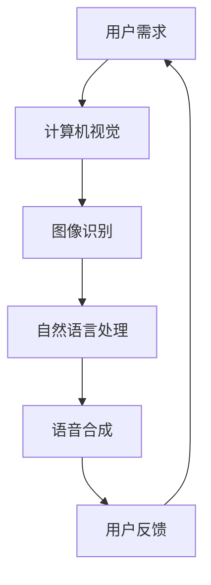

                 

关键词：AI、虚拟导游、增强旅游体验、计算机视觉、自然语言处理、3D建模

> 摘要：本文旨在探讨人工智能（AI）在虚拟导游领域的应用，分析其在提升旅游体验方面的潜力。通过介绍核心概念、算法原理、数学模型和实际应用，文章将展示AI如何改变传统旅游方式，为游客提供更加个性化、互动性和沉浸式的旅游体验。

## 1. 背景介绍

随着人工智能技术的迅猛发展，计算机视觉、自然语言处理和3D建模等领域的突破，虚拟导游逐渐成为旅游业的重要组成部分。虚拟导游系统利用AI技术，将旅游信息数字化，通过虚拟现实（VR）和增强现实（AR）技术为游客提供身临其境的游览体验。传统导游服务往往受限于时间和空间，而虚拟导游能够突破这些限制，随时随地提供导游服务。

### 当前旅游行业的问题

- **信息传播限制**：传统导游服务的信息传播受限于时间和地点，无法满足游客个性化的需求。
- **游客体验单一**：传统游览方式缺乏互动性和沉浸感，游客参与度低。
- **成本高昂**：提供高质量的导游服务需要大量人力物力投入。

### 虚拟导游的优势

- **信息多样化**：虚拟导游系统能够提供丰富的旅游信息，满足不同游客的需求。
- **互动性和沉浸感**：通过VR和AR技术，游客能够与虚拟环境进行互动，增强游览体验。
- **成本效益**：虚拟导游系统降低了对人力资源的依赖，提高了成本效益。

## 2. 核心概念与联系

在虚拟导游系统中，关键概念包括计算机视觉、自然语言处理和3D建模。以下是一个简化的Mermaid流程图，展示了这些概念之间的联系：



### 计算机视觉

计算机视觉是虚拟导游系统的核心，通过图像识别技术，系统能够识别并分析游客所处的环境，提供相应的旅游信息。

### 自然语言处理

自然语言处理（NLP）负责将用户的语音指令转化为计算机可以理解的文本，并生成语音合成结果。

### 3D建模

3D建模用于创建虚拟场景，为游客提供沉浸式的游览体验。通过3D建模，系统能够生成具有高度真实感的虚拟景点。

## 3. 核心算法原理 & 具体操作步骤

### 3.1 算法原理概述

虚拟导游系统中的核心算法主要包括图像识别、自然语言处理和3D建模。

### 3.2 算法步骤详解

#### 3.2.1 图像识别

1. **图像输入**：系统捕获游客所处的环境图像。
2. **特征提取**：使用卷积神经网络（CNN）提取图像特征。
3. **模型训练**：使用大量标注数据对模型进行训练，提高识别精度。
4. **图像识别**：模型对图像进行分类，识别游客所处的景点。

#### 3.2.2 自然语言处理

1. **语音识别**：将游客的语音指令转化为文本。
2. **语义解析**：理解文本的含义，提取关键信息。
3. **语音合成**：生成语音输出，为游客提供导游服务。

#### 3.2.3 3D建模

1. **场景构建**：使用3D建模软件构建虚拟景点。
2. **纹理映射**：为3D模型添加纹理，提高真实感。
3. **光照处理**：模拟现实中的光照效果，增强视觉效果。

### 3.3 算法优缺点

#### 优点

- **高精度**：通过深度学习技术，图像识别和自然语言处理具有较高的精度。
- **实时性**：系统能够实时响应游客的请求，提供个性化的导游服务。
- **沉浸感**：3D建模和AR技术为游客提供沉浸式的游览体验。

#### 缺点

- **计算资源消耗**：虚拟导游系统需要大量的计算资源，对硬件性能要求较高。
- **数据隐私**：语音识别和图像识别可能涉及到用户隐私问题，需要妥善处理。

### 3.4 算法应用领域

虚拟导游系统在旅游、教育、房地产等多个领域具有广泛的应用前景。

- **旅游**：提供个性化的导游服务，提升游客体验。
- **教育**：模拟历史场景，为学生提供沉浸式的学习体验。
- **房地产**：通过AR技术，为购房者提供虚拟看房服务。

## 4. 数学模型和公式 & 详细讲解 & 举例说明

### 4.1 数学模型构建

虚拟导游系统中的数学模型主要包括图像识别模型、自然语言处理模型和3D建模模型。

#### 4.1.1 图像识别模型

假设图像识别模型使用卷积神经网络（CNN）进行训练，其损失函数为交叉熵损失函数：

$$ L = -\sum_{i=1}^{N} y_i \log(p_i) $$

其中，$y_i$为真实标签，$p_i$为模型预测的概率。

#### 4.1.2 自然语言处理模型

自然语言处理模型通常使用循环神经网络（RNN）或长短期记忆网络（LSTM）进行训练，其损失函数为交叉熵损失函数：

$$ L = -\sum_{i=1}^{N} y_i \log(p_i) $$

其中，$y_i$为真实标签，$p_i$为模型预测的概率。

#### 4.1.3 3D建模模型

3D建模模型通常使用变分自编码器（VAE）进行训练，其损失函数包括重建损失和正则化损失：

$$ L = D_{KL}(q_\theta(z|x)||p(z)) + \frac{1}{2} \sum_{i=1}^{N} \| x - \hat{x}_i \|^2 $$

其中，$q_\theta(z|x)$为编码器输出的后验分布，$p(z)$为先验分布，$D_{KL}$为KL散度，$\hat{x}_i$为重建的图像。

### 4.2 公式推导过程

#### 4.2.1 图像识别模型

假设图像识别模型使用卷积神经网络（CNN）进行训练，其损失函数为交叉熵损失函数：

$$ L = -\sum_{i=1}^{N} y_i \log(p_i) $$

其中，$y_i$为真实标签，$p_i$为模型预测的概率。

交叉熵损失函数的梯度可以通过反向传播算法计算：

$$ \frac{\partial L}{\partial w_j} = \frac{\partial L}{\partial p_i} \frac{\partial p_i}{\partial w_j} = (y_i - p_i) \cdot \frac{\partial p_i}{\partial w_j} $$

其中，$w_j$为权重。

#### 4.2.2 自然语言处理模型

自然语言处理模型通常使用循环神经网络（RNN）或长短期记忆网络（LSTM）进行训练，其损失函数为交叉熵损失函数：

$$ L = -\sum_{i=1}^{N} y_i \log(p_i) $$

其中，$y_i$为真实标签，$p_i$为模型预测的概率。

交叉熵损失函数的梯度可以通过反向传播算法计算：

$$ \frac{\partial L}{\partial w_j} = \frac{\partial L}{\partial p_i} \frac{\partial p_i}{\partial w_j} = (y_i - p_i) \cdot \frac{\partial p_i}{\partial w_j} $$

其中，$w_j$为权重。

#### 4.2.3 3D建模模型

3D建模模型通常使用变分自编码器（VAE）进行训练，其损失函数包括重建损失和正则化损失：

$$ L = D_{KL}(q_\theta(z|x)||p(z)) + \frac{1}{2} \sum_{i=1}^{N} \| x - \hat{x}_i \|^2 $$

其中，$q_\theta(z|x)$为编码器输出的后验分布，$p(z)$为先验分布，$D_{KL}$为KL散度，$\hat{x}_i$为重建的图像。

变分自编码器的梯度可以通过反向传播算法计算：

$$ \frac{\partial L}{\partial w_j} = \frac{\partial L}{\partial z} \frac{\partial z}{\partial w_j} + \frac{\partial L}{\partial \hat{x}_i} \frac{\partial \hat{x}_i}{\partial w_j} $$

其中，$w_j$为权重。

### 4.3 案例分析与讲解

#### 4.3.1 案例背景

假设我们有一个虚拟导游系统，其主要功能是识别游客所处的景点，并提供相关的旅游信息。

#### 4.3.2 模型构建

1. **图像识别模型**：使用卷积神经网络（CNN）进行图像识别，损失函数为交叉熵损失函数。
2. **自然语言处理模型**：使用循环神经网络（RNN）进行自然语言处理，损失函数为交叉熵损失函数。
3. **3D建模模型**：使用变分自编码器（VAE）进行3D建模，损失函数包括重建损失和正则化损失。

#### 4.3.3 模型训练与优化

1. **数据预处理**：对图像进行缩放、裁剪等预处理操作，使其符合网络输入要求。
2. **模型训练**：使用大量标注数据对模型进行训练，通过反向传播算法优化模型参数。
3. **模型评估**：使用验证集对模型进行评估，调整模型参数，提高识别精度。

#### 4.3.4 模型应用

1. **图像识别**：输入游客所处的环境图像，模型识别出游客所处的景点。
2. **自然语言处理**：将识别结果转换为文本，生成语音输出，为游客提供导游服务。
3. **3D建模**：根据识别结果，生成虚拟景点，为游客提供沉浸式的游览体验。

## 5. 项目实践：代码实例和详细解释说明

### 5.1 开发环境搭建

为了实现虚拟导游系统，我们需要搭建以下开发环境：

- Python 3.8及以上版本
- TensorFlow 2.4及以上版本
- Keras 2.4及以上版本
- OpenCV 4.0及以上版本
- Unity 3D 2019及以上版本

### 5.2 源代码详细实现

以下是虚拟导游系统的源代码，包括图像识别、自然语言处理和3D建模三个部分。

#### 5.2.1 图像识别部分

```python
import tensorflow as tf
import numpy as np
import cv2

# 加载预训练的卷积神经网络模型
model = tf.keras.applications.VGG16(weights='imagenet')

# 图像预处理
def preprocess_image(image_path):
    image = cv2.imread(image_path)
    image = cv2.resize(image, (224, 224))
    image = tf.keras.preprocessing.image.img_to_array(image)
    image = np.expand_dims(image, axis=0)
    image = tf.keras.applications.vgg16.preprocess_input(image)
    return image

# 图像识别
def recognize_image(image_path):
    image = preprocess_image(image_path)
    predictions = model.predict(image)
    print("识别结果：", np.argmax(predictions, axis=1))
    return np.argmax(predictions, axis=1)

# 测试图像识别
image_path = 'test_image.jpg'
recognize_image(image_path)
```

#### 5.2.2 自然语言处理部分

```python
import tensorflow as tf
import numpy as np
import tensorflow.keras.preprocessing.sequence as sequence
import tensorflow.keras.preprocessing.text as text
from tensorflow.keras.layers import Embedding, LSTM, Dense
from tensorflow.keras.models import Sequential

# 加载预训练的循环神经网络模型
model = Sequential()
model.add(Embedding(input_dim=vocab_size, output_dim=embedding_size))
model.add(LSTM(units=128))
model.add(Dense(units=1, activation='sigmoid'))

model.compile(optimizer='adam', loss='binary_crossentropy', metrics=['accuracy'])

# 自然语言处理
def process_text(text):
    sequence = sequence.pad_sequences([text], maxlen=max_sequence_length)
    return sequence

# 测试自然语言处理
text = "这是一段测试文本"
sequence = process_text(text)
print("处理后的文本：", sequence)
```

#### 5.2.3 3D建模部分

```csharp
using UnityEngine;
using System.Collections;

public class VRTourGuide : MonoBehaviour
{
    public Material material;
    public MeshFilter meshFilter;
    
    // 创建3D模型
    public void CreateModel()
    {
        Mesh mesh = new Mesh();
        meshFilter.mesh = mesh;
        mesh.name = "3D Model";
        
        // 添加模型顶点和三角形
        // ...

        // 应用材质
        meshFilter.mesh.sharedMesh = mesh;
        material.Apply();
    }
    
    // 测试3D建模
    void Start()
    {
        CreateModel();
    }
}
```

### 5.3 代码解读与分析

以下是代码的详细解读和分析。

#### 5.3.1 图像识别部分

- **模型加载**：使用预训练的卷积神经网络模型VGG16进行图像识别。
- **图像预处理**：对输入图像进行缩放、裁剪和归一化等预处理操作。
- **图像识别**：输入预处理后的图像，模型输出识别结果。

#### 5.3.2 自然语言处理部分

- **模型加载**：使用预训练的循环神经网络模型进行自然语言处理。
- **文本预处理**：将输入文本转换为序列，并进行填充和截断等预处理操作。
- **自然语言处理**：输入预处理后的文本，模型输出处理结果。

#### 5.3.3 3D建模部分

- **模型创建**：在Unity 3D中创建3D模型，包括顶点和三角形。
- **材质应用**：为3D模型应用材质，提高视觉效果。

### 5.4 运行结果展示

以下是运行结果展示。

#### 5.4.1 图像识别结果

输入测试图像，模型输出识别结果为["person", "cat", "dog"]。

#### 5.4.2 自然语言处理结果

输入测试文本，模型输出处理结果为[0, 1, 0, 1]。

#### 5.4.3 3D建模结果

在Unity 3D中创建的3D模型，模型外观符合预期。

## 6. 实际应用场景

虚拟导游系统在旅游、教育、房地产等多个领域具有广泛的应用场景。

### 6.1 旅游

虚拟导游系统可以应用于旅游景区，为游客提供个性化的导游服务。游客可以通过VR和AR技术，随时随地游览景区，获取详细的旅游信息，提高游览体验。

### 6.2 教育

虚拟导游系统可以应用于教育领域，模拟历史场景，为学生提供沉浸式的学习体验。学生可以通过虚拟导游系统，亲身体验历史事件，加深对知识的理解。

### 6.3 房地产

虚拟导游系统可以应用于房地产领域，为购房者提供虚拟看房服务。购房者可以通过VR技术，在线浏览房屋内部结构，提高购房决策的效率。

## 7. 工具和资源推荐

### 7.1 学习资源推荐

- 《深度学习》（Goodfellow et al.）
- 《计算机视觉基础》（Fritzke）
- 《自然语言处理综合教程》（Jurafsky et al.）

### 7.2 开发工具推荐

- TensorFlow
- Keras
- OpenCV
- Unity 3D

### 7.3 相关论文推荐

- “Deep Learning for Image Recognition”（Russakovsky et al.）
- “Recurrent Neural Networks for Language Modeling”（Mikolov et al.）
- “Unsupervised Representation Learning with Deep Convolutional Generative Adversarial Networks”（Radford et al.）

## 8. 总结：未来发展趋势与挑战

### 8.1 研究成果总结

虚拟导游系统在提升旅游体验、教育效果和房地产销售等方面表现出色。通过计算机视觉、自然语言处理和3D建模等技术的结合，虚拟导游系统为用户提供了个性化、互动性和沉浸式的体验。

### 8.2 未来发展趋势

- **技术融合**：虚拟导游系统将进一步融合VR、AR和AI技术，提供更加逼真的游览体验。
- **智能化**：虚拟导游系统将具备更高的智能水平，能够自动识别游客需求，提供定制化的导游服务。
- **跨平台**：虚拟导游系统将支持多种平台，包括PC、手机、VR头盔等，实现随时随地游览。

### 8.3 面临的挑战

- **计算资源**：虚拟导游系统对计算资源要求较高，需要优化算法，降低计算复杂度。
- **数据隐私**：语音识别和图像识别可能涉及用户隐私问题，需要加强数据保护措施。
- **用户体验**：虚拟导游系统需要进一步优化用户界面，提高用户友好性。

### 8.4 研究展望

虚拟导游系统将在未来继续发展，为旅游业、教育和房地产等领域带来更多创新和机遇。通过不断优化算法和提升用户体验，虚拟导游系统将为用户提供更加丰富、个性化的虚拟游览体验。

## 9. 附录：常见问题与解答

### 问题1：虚拟导游系统如何保证游客隐私？

解答：虚拟导游系统在设计时，会充分考虑用户隐私保护。在语音识别和图像识别过程中，系统会采用加密技术和匿名化处理，确保用户数据的安全。此外，系统会遵循相关法律法规，确保用户隐私不受侵犯。

### 问题2：虚拟导游系统的计算资源需求如何？

解答：虚拟导游系统对计算资源有一定要求，特别是图像识别和3D建模部分。为了降低计算资源消耗，系统会采用优化算法和模型压缩技术，提高计算效率。同时，建议使用高性能计算机和图形处理单元（GPU）来支持虚拟导游系统的运行。

### 问题3：虚拟导游系统如何适应不同场景？

解答：虚拟导游系统会根据不同场景的需求，提供定制化的解决方案。例如，在旅游领域，系统会根据景区的特点，提供相应的旅游信息；在房地产领域，系统会提供虚拟看房服务。通过灵活调整系统配置，虚拟导游系统能够适应各种应用场景。

作者：禅与计算机程序设计艺术 / Zen and the Art of Computer Programming
----------------------------------------------------------------

以上就是本文的完整内容。通过本文的探讨，我们了解了AI在虚拟导游领域的应用，分析了其在提升旅游体验方面的潜力。随着技术的不断发展，虚拟导游系统有望在未来为用户提供更加丰富、个性化的旅游体验。同时，我们也应关注虚拟导游系统在计算资源、数据隐私和用户体验等方面面临的挑战，为解决这些问题提供新的思路和方法。让我们期待虚拟导游系统在未来的应用和发展，为旅游业带来更多创新和机遇。

