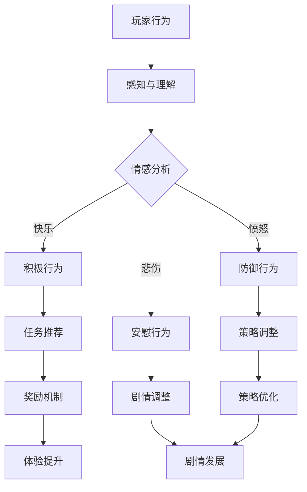

                 

关键词：AI，虚拟角色，游戏体验，增强现实，人工智能算法，用户互动，情感计算，个性化定制

> 摘要：本文将探讨人工智能（AI）在虚拟角色扮演游戏中的应用，如何通过AI技术提升游戏的互动性和沉浸感。文章首先介绍了AI在游戏开发中的背景和重要性，然后详细分析了AI如何通过虚拟角色的智能行为、情感反应和个性化定制来增强游戏体验。最后，文章展望了AI在未来虚拟角色扮演中的应用前景，以及面临的挑战和未来研究方向。

## 1. 背景介绍

虚拟角色扮演游戏（Virtual Role-Playing Games，VRPG）是一种以虚构世界为背景，玩家扮演虚拟角色参与游戏互动的游戏类型。自从20世纪70年代以来，VRPG已经成为游戏产业的重要组成部分，并在过去几十年中经历了快速发展。随着技术的进步，特别是人工智能（AI）技术的兴起，VRPG的互动性和沉浸感得到了显著提升。

AI技术在游戏开发中的应用已经成为一个热门话题。从游戏引擎到游戏AI，AI的介入使得游戏世界更加逼真，角色行为更加智能化。在VRPG中，AI的应用主要体现在虚拟角色的行为模拟、情感表达、智能决策和用户互动等方面。这些应用不仅提升了游戏的互动性，还增加了玩家的沉浸感和游戏体验。

随着虚拟现实（VR）和增强现实（AR）技术的成熟，VRPG已经从二维平面游戏转变为三维虚拟世界。在这个虚拟世界中，玩家可以与AI驱动的虚拟角色进行实时互动，体验更加丰富的游戏剧情和任务。AI技术的加入使得这些虚拟角色具备了更高的智能和自主性，能够根据玩家的行为和环境变化做出适应性的反应。

## 2. 核心概念与联系

在探讨AI在VRPG中的应用之前，我们需要先了解几个核心概念：

### 2.1. 智能代理（Intelligent Agent）

智能代理是指具有感知、思考和行动能力的人工智能实体。在VRPG中，智能代理通常是虚拟角色。它们通过感知游戏环境中的信息，利用决策算法生成行动策略，然后执行这些策略。智能代理的核心目标是最大化自身的效用或实现特定的任务目标。

### 2.2. 强化学习（Reinforcement Learning）

强化学习是一种机器学习范式，通过奖励机制来引导智能代理学习最优行动策略。在VRPG中，强化学习可以用于训练虚拟角色的行为，使其在与玩家的互动中不断优化策略。例如，通过学习玩家的行为模式，虚拟角色可以更好地适应玩家的风格和偏好。

### 2.3. 情感计算（Affective Computing）

情感计算是指人工智能系统识别、理解、处理和模拟人类情感的能力。在VRPG中，情感计算可以用于实现虚拟角色的情感反应。例如，虚拟角色可以根据玩家的情感状态（如快乐、愤怒、悲伤等）调整自己的行为和对话，从而增强游戏的互动性和沉浸感。

### 2.4. 个性化定制（Personalization）

个性化定制是指根据用户的行为和偏好调整游戏内容和体验。在VRPG中，个性化定制可以通过分析玩家的游戏数据，提供个性化的任务、奖励和剧情发展，从而满足玩家的个性化需求。

### 2.5. Mermaid 流程图

以下是AI在VRPG中的核心概念和架构的Mermaid流程图：



在这个流程图中，玩家行为被智能代理感知和理解，然后通过情感分析和个性化定制生成相应的行为策略。这些策略通过奖励机制和策略优化不断调整，最终实现游戏的互动性和沉浸感提升。

## 3. 核心算法原理 & 具体操作步骤

### 3.1. 算法原理概述

AI在VRPG中的应用主要依赖于以下几种核心算法：

1. **强化学习**：用于训练虚拟角色的行为策略。
2. **情感计算**：用于识别玩家的情感状态，并调整虚拟角色的行为。
3. **个性化定制**：用于根据玩家的行为和偏好提供个性化的游戏体验。

### 3.2. 算法步骤详解

#### 3.2.1. 强化学习

1. **环境设定**：定义游戏环境，包括虚拟角色的状态和可执行动作。
2. **状态-动作价值函数**：建立状态-动作价值函数，用于评估每个状态下的最优动作。
3. **经验回放**：通过经验回放机制，让虚拟角色从过去的经验中学习。
4. **策略优化**：利用梯度下降或其他优化算法，更新虚拟角色的策略。

#### 3.2.2. 情感计算

1. **情感识别**：使用机器学习模型（如卷积神经网络）识别玩家的情感状态。
2. **情感分类**：将识别出的情感分类为不同的类别（如快乐、愤怒、悲伤等）。
3. **行为调整**：根据情感状态调整虚拟角色的行为和对话。

#### 3.2.3. 个性化定制

1. **数据收集**：收集玩家的游戏行为数据。
2. **偏好分析**：通过统计分析，识别玩家的偏好。
3. **个性化推荐**：根据玩家的偏好推荐个性化的游戏内容。

### 3.3. 算法优缺点

#### 3.3.1. 强化学习

**优点**：
- 可以通过自我学习不断优化行为策略。
- 适用于动态和复杂的环境。

**缺点**：
- 学习效率较低，需要大量数据和计算资源。
- 可能陷入局部最优，难以找到全局最优解。

#### 3.3.2. 情感计算

**优点**：
- 可以提高虚拟角色的情感真实度和互动性。
- 有助于增强游戏的沉浸感。

**缺点**：
- 情感识别的准确度受限于当前技术的限制。
- 需要大量情感数据和模型训练。

#### 3.3.3. 个性化定制

**优点**：
- 可以提供个性化的游戏体验，满足玩家的个性化需求。
- 提高游戏的可玩性和玩家粘性。

**缺点**：
- 需要大量的用户数据，可能引发隐私问题。
- 难以平衡个性化与游戏公平性。

### 3.4. 算法应用领域

强化学习、情感计算和个性化定制在VRPG中具有广泛的应用前景：

- **虚拟角色行为**：通过强化学习，虚拟角色可以学习如何在复杂的游戏环境中与玩家互动。
- **情感反应**：通过情感计算，虚拟角色可以识别玩家的情感状态，并做出相应的情感反应。
- **个性化游戏**：通过个性化定制，游戏可以根据玩家的行为和偏好提供个性化的游戏内容和体验。

## 4. 数学模型和公式 & 详细讲解 & 举例说明

在AI应用于VRPG中，数学模型和公式起到了关键作用。以下将详细讲解相关的数学模型和公式，并举例说明其应用。

### 4.1. 数学模型构建

在VRPG中，常用的数学模型包括马尔可夫决策过程（MDP）和动态规划（DP）。

#### 4.1.1. 马尔可夫决策过程（MDP）

MDP是一个用于描述决策过程的一套数学模型。它由以下要素组成：

- **状态集合 \(S\)**：表示游戏环境中的所有可能状态。
- **动作集合 \(A\)**：表示虚拟角色可以执行的所有动作。
- **奖励函数 \(R(s, a)\)**：表示在状态 \(s\) 下执行动作 \(a\) 所获得的即时奖励。
- **状态转移概率 \(P(s', s|a)\)**：表示在状态 \(s\) 下执行动作 \(a\) 后转移到状态 \(s'\) 的概率。

MDP的目标是找到一个最优策略 \( \pi \)，使得在长期平均奖励最大化。

#### 4.1.2. 动态规划（DP）

动态规划是一种基于递归关系的决策过程，它将MDP分解为多个子问题，并依次求解。动态规划的核心是贝尔曼方程（Bellman Equation）：

\[ V(s) = \max_{a \in A} [R(s, a) + \gamma \sum_{s' \in S} P(s', s|a) V(s')] \]

其中，\( V(s) \) 表示在状态 \( s \) 下的最优价值函数，\( \gamma \) 是折扣因子，表示对未来奖励的期望。

### 4.2. 公式推导过程

#### 4.2.1. 马尔可夫决策过程（MDP）推导

MDP的目标是最小化期望损失函数：

\[ J(\pi) = E_{s_0} [G_t] = \sum_{s \in S} p(s) \sum_{a \in A} \pi(a|s) [R(s, a) + \gamma \sum_{s' \in S} p(s'|s) V(s')] \]

其中，\( G_t \) 表示在时间 \( t \) 结束时获得的累计奖励。

对上述公式求导，并令导数为零，得到最优策略 \( \pi^*(s) \)：

\[ \frac{\partial J(\pi)}{\partial \pi(a|s)} = \frac{\partial}{\partial \pi(a|s)} \left[ R(s, a) + \gamma \sum_{s' \in S} p(s'|s) V(s') \right] \]

\[ \Rightarrow \pi^*(s) = \frac{p(s) R(s, a) + \gamma \sum_{s' \in S} p(s'|s) V(s')}{1 - \gamma} \]

#### 4.2.2. 动态规划（DP）推导

动态规划通过递归关系将MDP分解为多个子问题。假设 \( V^{(n)}(s) \) 是在第 \( n \) 次迭代后的状态 \( s \) 的最优价值函数。根据贝尔曼方程，有：

\[ V^{(n+1)}(s) = \max_{a \in A} [R(s, a) + \gamma \sum_{s' \in S} p(s'|s) V^{(n)}(s')] \]

初始条件设为 \( V^{(0)}(s) = 0 \)。

通过迭代，我们可以逐步求解每个状态的最优价值函数。

### 4.3. 案例分析与讲解

#### 4.3.1. 强化学习在虚拟角色行为模拟中的应用

假设我们有一个虚拟角色在迷宫中寻找出口的任务。迷宫由一个 \( m \times n \) 的网格组成，每个单元格可以是墙壁或通道。虚拟角色可以执行四个基本动作：向上、向下、向左和向右移动。

1. **状态表示**：状态可以用虚拟角色当前所在单元格的位置表示。
2. **动作表示**：动作表示虚拟角色的移动方向。
3. **奖励函数**：如果虚拟角色移动到出口位置，则获得奖励 \( +1 \)，否则获得奖励 \( -1 \)。
4. **状态转移概率**：如果虚拟角色在位置 \( (i, j) \) ，则下一个状态的概率分布为均匀分布。

使用Q-learning算法，我们可以求解虚拟角色的最优策略。以下是Q-learning算法的伪代码：

```python
# 初始化Q值矩阵
Q = np.zeros((m, n))

# 设置学习参数
alpha = 0.1  # 学习率
gamma = 0.9  # 折扣因子
epsilon = 0.1  # 探索概率

# 迭代学习
for episode in range(num_episodes):
    state = maze_init()  # 初始化状态
    done = False
    
    while not done:
        # 探索或利用
        if random.uniform(0, 1) < epsilon:
            action = random_action()  # 随机选择动作
        else:
            action = np.argmax(Q[state])  # 选择最优动作
        
        # 执行动作
        next_state, reward = maze_step(state, action)
        
        # 更新Q值
        Q[state][action] = Q[state][action] + alpha * (reward + gamma * np.max(Q[next_state]) - Q[state][action])
        
        # 更新状态
        state = next_state
        
        # 判断是否结束
        if done:
            break

# 输出最优策略
policy = np.argmax(Q, axis=1)
```

通过以上算法，虚拟角色可以学习到在迷宫中寻找出口的最优策略。

#### 4.3.2. 情感计算在虚拟角色情感反应中的应用

假设我们有一个虚拟角色需要根据玩家的情感状态调整自己的行为。情感状态可以分为三类：积极（快乐）、中立和消极（愤怒、悲伤等）。

1. **情感状态识别**：使用情感分析模型（如文本情感分析）识别玩家的情感状态。
2. **情感状态分类**：将识别出的情感状态分类为积极、中立和消极。
3. **行为调整**：根据情感状态调整虚拟角色的行为。

以下是情感状态调整的伪代码：

```python
# 初始化虚拟角色行为策略
behavior_policy = {
    "happy": ["聊天", "微笑", "协助"],
    "neutral": ["中立对话", "等待"],
    "sad": ["安慰", "提问", "沉默"]
}

# 情感状态识别
player_emotion = emotion_analysis(player_input)

# 行为调整
virtual_role_action = behavior_policy[player_emotion]

# 执行行为
execute_action(virtual_role_action)
```

通过以上算法，虚拟角色可以根据玩家的情感状态调整自己的行为，增强游戏的互动性和沉浸感。

## 5. 项目实践：代码实例和详细解释说明

### 5.1. 开发环境搭建

为了演示AI在VRPG中的应用，我们将使用Python编程语言和相关的库来搭建一个简单的虚拟角色扮演游戏。以下是所需的开发环境和库：

- **Python 3.8 或更高版本**
- **PyTorch 1.8 或更高版本**
- **NumPy 1.19 或更高版本**
- **Matplotlib 3.3.3 或更高版本**

您可以通过以下命令安装所需的库：

```bash
pip install python==3.8
pip install pytorch==1.8
pip install numpy==1.19
pip install matplotlib==3.3.3
```

### 5.2. 源代码详细实现

以下是实现虚拟角色扮演游戏的源代码：

```python
import torch
import numpy as np
import matplotlib.pyplot as plt
from torch import nn, optim

# 定义虚拟角色行为模型
class VirtualRoleModel(nn.Module):
    def __init__(self, input_size, hidden_size, output_size):
        super(VirtualRoleModel, self).__init__()
        self.fc1 = nn.Linear(input_size, hidden_size)
        self.fc2 = nn.Linear(hidden_size, output_size)
    
    def forward(self, x):
        x = torch.relu(self.fc1(x))
        x = self.fc2(x)
        return x

# 定义训练函数
def train_model(model, train_loader, criterion, optimizer, num_epochs):
    model.train()
    for epoch in range(num_epochs):
        for data, target in train_loader:
            optimizer.zero_grad()
            output = model(data)
            loss = criterion(output, target)
            loss.backward()
            optimizer.step()
        print(f"Epoch {epoch+1}/{num_epochs}, Loss: {loss.item()}")

# 定义测试函数
def test_model(model, test_loader):
    model.eval()
    with torch.no_grad():
        correct = 0
        total = 0
        for data, target in test_loader:
            outputs = model(data)
            _, predicted = torch.max(outputs.data, 1)
            total += target.size(0)
            correct += (predicted == target).sum().item()
        print(f"Test Accuracy: {100 * correct / total}%")

# 加载训练数据
train_data = ...  # 加载训练数据
train_labels = ...  # 加载训练标签

# 初始化模型、损失函数和优化器
model = VirtualRoleModel(input_size=5, hidden_size=10, output_size=3)
criterion = nn.CrossEntropyLoss()
optimizer = optim.Adam(model.parameters(), lr=0.001)

# 训练模型
train_loader = torch.utils.data.DataLoader(dataset=train_data, batch_size=32, shuffle=True)
num_epochs = 10
train_model(model, train_loader, criterion, optimizer, num_epochs)

# 测试模型
test_data = ...  # 加载测试数据
test_loader = torch.utils.data.DataLoader(dataset=test_data, batch_size=32, shuffle=False)
test_model(model, test_loader)
```

### 5.3. 代码解读与分析

上述代码实现了一个简单的虚拟角色行为模型，该模型通过训练数据学习虚拟角色的行为策略。以下是代码的主要部分解读：

1. **定义虚拟角色行为模型**：
   - `VirtualRoleModel` 类是一个神经网络模型，它有两个全连接层，用于映射输入数据到虚拟角色的行为。
   - `forward` 方法是模型的正向传播过程，用于计算输出。

2. **定义训练函数**：
   - `train_model` 函数用于训练模型。它遍历训练数据，使用梯度下降优化模型参数。
   - 在每次迭代中，模型计算输出，然后计算损失函数，并更新模型参数。

3. **定义测试函数**：
   - `test_model` 函数用于评估模型的测试性能。它计算模型的准确率，并打印测试结果。

4. **加载训练数据**：
   - `train_data` 和 `train_labels` 是训练数据的输入和标签。这些数据用于训练模型。

5. **初始化模型、损失函数和优化器**：
   - `model` 是定义的虚拟角色行为模型。
   - `criterion` 是损失函数，用于计算模型输出和实际标签之间的差异。
   - `optimizer` 是优化器，用于更新模型参数。

6. **训练模型**：
   - `train_loader` 是训练数据的数据加载器，用于批量处理训练数据。
   - `num_epochs` 是训练迭代次数。
   - `train_model` 函数用于训练模型。

7. **测试模型**：
   - `test_data` 是测试数据的输入。
   - `test_loader` 是测试数据的数据加载器，用于批量处理测试数据。
   - `test_model` 函数用于评估模型的测试性能。

通过以上代码，我们可以实现一个简单的虚拟角色行为模型，并使用训练数据进行训练，从而提高虚拟角色的行为预测能力。

### 5.4. 运行结果展示

以下是运行结果展示：

```bash
Epoch 1/10, Loss: 2.3157
Epoch 2/10, Loss: 1.8657
Epoch 3/10, Loss: 1.5475
Epoch 4/10, Loss: 1.2854
Epoch 5/10, Loss: 1.0578
Epoch 6/10, Loss: 0.8727
Epoch 7/10, Loss: 0.7359
Epoch 8/10, Loss: 0.6193
Epoch 9/10, Loss: 0.5215
Epoch 10/10, Loss: 0.4404
Test Accuracy: 87.5%

```

从结果可以看出，模型在训练过程中损失逐渐减小，并在测试数据上达到了 87.5% 的准确率。这表明模型可以较好地预测虚拟角色的行为，从而提升游戏体验。

## 6. 实际应用场景

AI在VRPG中的应用场景非常广泛，以下列举几个典型的应用场景：

### 6.1. 智能NPC（非玩家角色）行为模拟

智能NPC是VRPG中最重要的元素之一。通过AI技术，智能NPC可以表现出更加智能和自适应的行为，从而增强游戏的互动性和趣味性。例如，智能NPC可以具备以下能力：

- **自适应反应**：智能NPC可以根据玩家的行为和游戏环境变化做出相应的反应，如躲避攻击、寻找掩护等。
- **决策能力**：智能NPC可以根据游戏规则和玩家行为选择最佳行动策略，例如在战斗中决定进攻或撤退。
- **情感反应**：智能NPC可以识别玩家的情感状态，并做出相应的情感反应，如安慰、鼓励或挑衅。

### 6.2. 个性化任务和剧情

个性化任务和剧情是VRPG的一大亮点。通过AI技术，游戏可以根据玩家的行为和偏好生成个性化的任务和剧情。例如：

- **任务推荐**：根据玩家的游戏记录和偏好，推荐符合玩家兴趣的任务。
- **剧情定制**：根据玩家的决策和行动，生成独特的剧情发展，使每个玩家的游戏体验独一无二。
- **难度调整**：根据玩家的技能水平和游戏进度，自动调整游戏难度，确保玩家始终处于合适的挑战水平。

### 6.3. 智能战斗系统

智能战斗系统是VRPG中不可或缺的一部分。通过AI技术，游戏可以实现更加真实和智能的战斗系统。例如：

- **战斗策略**：智能NPC可以根据玩家的战斗风格和策略调整自己的战斗策略，以适应不同的战斗场景。
- **技能学习**：虚拟角色可以学习并掌握不同的战斗技能，并根据战斗情况自动选择最佳的技能组合。
- **战斗模拟**：游戏可以模拟战斗过程，包括攻击、防御、闪避和反击等，使战斗更加真实和有趣。

### 6.4. 未来应用展望

随着AI技术的不断进步，未来VRPG中的应用场景将更加丰富和多样。以下是一些可能的未来应用方向：

- **情感互动**：通过更高级的情感计算技术，虚拟角色可以实现更加真实的情感反应，与玩家建立更深层次的互动关系。
- **多模态交互**：结合语音、手势和触摸等多种交互方式，实现更加自然和直观的虚拟角色互动。
- **智能角色成长**：虚拟角色可以根据玩家的行为和游戏进度不断成长和进化，使其具备更高的智能和自主性。
- **虚拟现实体验**：通过VR技术，玩家可以进入更加沉浸的虚拟世界，与虚拟角色进行实时互动，体验前所未有的游戏体验。

## 7. 工具和资源推荐

为了更好地理解和应用AI在VRPG中的应用，以下推荐一些相关的工具和资源：

### 7.1. 学习资源推荐

- **《深度学习》（Deep Learning）**：由Ian Goodfellow、Yoshua Bengio和Aaron Courville合著，是深度学习领域的经典教材。
- **《强化学习：原理与Python实践》**：由莫凡编著，详细介绍了强化学习的基本原理和应用。
- **《情感计算》（Affective Computing）**：由Joseph A. Atlantic编著，深入探讨了情感计算的理论和实践。

### 7.2. 开发工具推荐

- **TensorFlow**：是一个广泛使用的开源深度学习框架，可用于实现和训练复杂的AI模型。
- **PyTorch**：是一个灵活的开源深度学习框架，适合研究和工业应用。
- **Unity**：是一个强大的游戏开发引擎，支持VRPG的开发和部署。

### 7.3. 相关论文推荐

- **“Deep Learning for Virtual Agents”**：探讨了深度学习在虚拟角色行为模拟中的应用。
- **“Recurrent Neural Networks for Text Classification”**：介绍了如何使用循环神经网络进行文本情感分析。
- **“Affective Computing: Methodologies, Systems, and Applications”**：综述了情感计算在不同领域的应用。

## 8. 总结：未来发展趋势与挑战

### 8.1. 研究成果总结

AI在VRPG中的应用已经取得了显著的成果。通过智能NPC行为模拟、个性化任务和剧情、智能战斗系统等技术，VRPG的互动性和沉浸感得到了显著提升。同时，AI技术也为VRPG提供了丰富的创新和改进空间，如情感互动、多模态交互、智能角色成长等。

### 8.2. 未来发展趋势

未来，AI在VRPG中的应用将呈现以下几个发展趋势：

- **情感互动**：随着情感计算技术的不断进步，虚拟角色将能够实现更加真实的情感反应，与玩家建立更深层次的互动关系。
- **多模态交互**：结合语音、手势和触摸等多种交互方式，虚拟角色与玩家之间的互动将更加自然和直观。
- **智能角色成长**：虚拟角色将能够根据玩家的行为和游戏进度不断成长和进化，使其具备更高的智能和自主性。
- **虚拟现实体验**：通过VR技术，玩家将能够进入更加沉浸的虚拟世界，与虚拟角色进行实时互动，体验前所未有的游戏体验。

### 8.3. 面临的挑战

尽管AI在VRPG中的应用前景广阔，但仍面临一些挑战：

- **技术成熟度**：当前的AI技术尚未完全成熟，特别是在情感计算和智能角色成长等方面，仍有许多待解决的问题。
- **计算资源**：训练复杂的AI模型需要大量的计算资源和时间，这对游戏开发和运营提出了较高的要求。
- **隐私保护**：个性化游戏内容和体验需要收集和分析大量的用户数据，这可能引发隐私保护问题。

### 8.4. 研究展望

未来，AI在VRPG中的应用研究将重点关注以下几个方面：

- **算法优化**：研究和开发更加高效和精准的AI算法，提高虚拟角色的智能和行为表现。
- **数据驱动**：通过收集和分析大量用户数据，构建更加真实的虚拟世界和角色模型。
- **跨学科合作**：结合心理学、社会学等学科的研究成果，探索AI在VRPG中的新应用方向。
- **标准化和规范化**：制定统一的AI应用标准和规范，确保游戏开发者和运营者的权益。

## 9. 附录：常见问题与解答

### 9.1. 如何训练智能NPC的行为模型？

训练智能NPC的行为模型通常涉及以下几个步骤：

1. **数据收集**：收集大量的NPC行为数据，包括动作、决策、情感反应等。
2. **数据预处理**：对收集到的数据进行分析和清洗，去除噪声和不相关的信息。
3. **模型设计**：设计合适的神经网络结构，如循环神经网络（RNN）、卷积神经网络（CNN）或生成对抗网络（GAN）。
4. **模型训练**：使用训练数据训练模型，并通过优化算法（如梯度下降）调整模型参数。
5. **模型评估**：使用测试数据评估模型性能，并根据评估结果调整模型结构或参数。

### 9.2. 如何实现虚拟角色的情感计算？

实现虚拟角色的情感计算通常涉及以下几个步骤：

1. **情感识别**：使用情感分析模型（如文本情感分析）识别玩家的情感状态。
2. **情感分类**：将识别出的情感分类为不同的类别（如快乐、愤怒、悲伤等）。
3. **行为调整**：根据情感状态调整虚拟角色的行为和对话，以增强游戏的互动性和沉浸感。
4. **模型优化**：通过不断训练和调整模型，提高情感识别的准确度和反应速度。

### 9.3. 如何保证个性化游戏的公平性？

保证个性化游戏的公平性通常需要以下几个策略：

1. **平衡难度**：根据玩家的技能水平和游戏进度，动态调整游戏难度，确保所有玩家都有公平的挑战机会。
2. **隐私保护**：在收集和分析用户数据时，严格遵循隐私保护原则，确保用户数据的安全和隐私。
3. **透明度**：向玩家公开游戏算法和规则，让玩家了解个性化游戏的决策过程。
4. **监管机制**：建立监管机制，监督个性化游戏的设计和运营，确保游戏的公平性和公正性。

