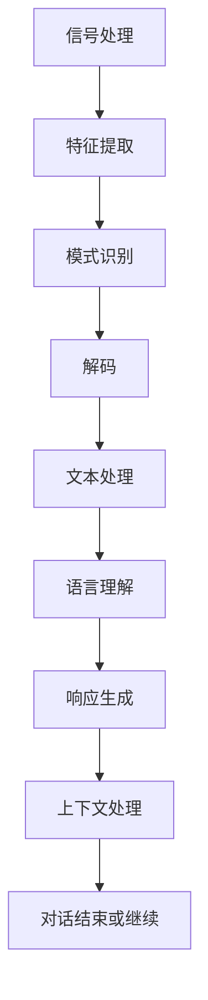

                 

关键词：语音识别，人工智能，自然对话，深度学习，神经网络，自然语言处理，自动语音识别，语音合成

> 摘要：本文将探讨人工智能在语音识别领域的最新进展，以及如何通过深度学习和神经网络技术实现自然对话。我们将分析语音识别的核心算法、数学模型、项目实践，并讨论该技术的实际应用场景和未来展望。

## 1. 背景介绍

语音识别（Automatic Speech Recognition，ASR）是人工智能的一个重要分支，其目标是让计算机能够理解和处理人类的语音。随着深度学习和神经网络技术的发展，语音识别技术取得了显著进步。如今，ASR已经在多个领域得到了广泛应用，如智能助手、语音导航、语音翻译和自动字幕等。

自然对话（Natural Language Understanding，NLU）是另一个关键领域，它旨在让计算机理解和处理人类语言的自然性。自然对话系统需要具备理解用户意图、识别语言中的歧义和情感表达的能力，从而实现流畅、自然的交流。

本文将首先介绍语音识别的基本概念和技术，然后深入探讨自然对话的实现原理。接着，我们将分析核心算法、数学模型和项目实践，最后讨论语音识别技术的实际应用场景和未来发展趋势。

## 2. 核心概念与联系

### 2.1 语音识别的基本概念

语音识别是一个复杂的过程，它包括以下几个基本步骤：

1. **信号处理**：将语音信号转换为数字信号，通常通过模拟-数字转换（ADC）实现。
2. **特征提取**：从数字信号中提取用于识别语音的特定特征，如频谱、倒谱系数、梅尔频率倒谱系数（MFCC）等。
3. **模式识别**：使用模式识别算法将提取的特征与语音数据库中的模式进行匹配，从而识别出语音。
4. **解码**：将识别结果转换为文本或命令。

### 2.2 自然对话的基本概念

自然对话系统需要理解用户输入的语音或文本，并生成相应的响应。这包括以下几个关键任务：

1. **语言理解**：理解用户输入的含义，包括语法、语义和情感。
2. **语言生成**：根据用户输入生成自然、流畅的响应。
3. **上下文处理**：处理对话中的上下文信息，确保响应与上下文保持一致。

### 2.3 语音识别与自然对话的联系

语音识别和自然对话是紧密相连的两个领域。语音识别是自然对话系统的基础，它负责将用户的语音转换为文本。而自然对话系统则在此基础上，理解用户的意图并生成相应的响应。这两个领域的结合，使得计算机能够与人类进行自然、流畅的交流。

### 2.4 Mermaid 流程图

以下是语音识别和自然对话流程的Mermaid流程图：



## 3. 核心算法原理 & 具体操作步骤

### 3.1 算法原理概述

语音识别的核心算法包括信号处理、特征提取和模式识别。这些算法共同作用，将语音信号转换为文本。

1. **信号处理**：通过ADC将模拟语音信号转换为数字信号。然后，使用短时傅里叶变换（STFT）或梅尔频率倒谱系数（MFCC）等方法提取语音特征。
2. **特征提取**：从数字信号中提取用于识别语音的特征。MFCC是常用的特征提取方法，它能够较好地表示语音信号的时间频率特性。
3. **模式识别**：使用隐马尔可夫模型（HMM）、深度神经网络（DNN）或卷积神经网络（CNN）等算法对提取的特征进行模式识别。这些算法能够自动学习语音模式，提高识别准确率。

### 3.2 算法步骤详解

1. **信号处理**：首先，将模拟语音信号通过ADC转换为数字信号。然后，对数字信号进行预处理，如去除噪声、提高信号质量等。
2. **特征提取**：使用短时傅里叶变换（STFT）或梅尔频率倒谱系数（MFCC）等方法提取语音特征。具体步骤如下：

   - 对数字信号进行短时傅里叶变换，得到频谱图。
   - 对频谱图进行梅尔频率倒谱变换，得到MFCC特征矩阵。
3. **模式识别**：使用隐马尔可夫模型（HMM）、深度神经网络（DNN）或卷积神经网络（CNN）等算法对提取的特征进行模式识别。具体步骤如下：

   - 使用HMM、DNN或CNN模型对特征矩阵进行训练。
   - 对训练好的模型进行测试，识别输入语音。

### 3.3 算法优缺点

1. **优点**：

   - **高准确率**：深度学习和神经网络算法具有强大的学习能力，能够提高语音识别的准确率。
   - **自适应性强**：语音识别系统可以自适应不同的语音环境和语言变化，具有较强的鲁棒性。
   - **多样化应用**：语音识别技术可以应用于多个领域，如智能助手、语音导航、语音翻译和自动字幕等。

2. **缺点**：

   - **计算资源消耗大**：深度学习和神经网络算法需要大量计算资源和存储空间。
   - **对噪声敏感**：语音识别系统在噪声环境下识别准确率可能会下降。
   - **语言理解能力有限**：目前，语音识别系统在理解复杂语言表达和情感方面还存在一定限制。

### 3.4 算法应用领域

语音识别技术已经广泛应用于多个领域，如：

1. **智能助手**：如苹果的Siri、谷歌的Google Assistant等，它们能够理解用户的语音指令，提供相应的服务。
2. **语音导航**：如车载语音导航系统，能够实时提供路况信息和语音提示。
3. **语音翻译**：如谷歌翻译、微软翻译等，能够实时翻译不同语言的语音。
4. **自动字幕**：如YouTube的自动字幕功能，能够为视频生成实时字幕。

## 4. 数学模型和公式 & 详细讲解 & 举例说明

### 4.1 数学模型构建

语音识别的数学模型主要包括特征提取模型和模式识别模型。以下是两个模型的简要介绍：

1. **特征提取模型**：常用的特征提取模型包括短时傅里叶变换（STFT）和梅尔频率倒谱系数（MFCC）。其中，STFT用于提取语音信号的频谱信息，而MFCC则用于提取语音信号的时间频率特性。

2. **模式识别模型**：常用的模式识别模型包括隐马尔可夫模型（HMM）、深度神经网络（DNN）和卷积神经网络（CNN）。这些模型用于将提取的特征与语音数据库中的模式进行匹配，从而实现语音识别。

### 4.2 公式推导过程

以下是MFCC特征提取的基本公式推导：

1. **短时傅里叶变换（STFT）**：

   - 公式：\[X(\omega) = \sum_{n=0}^{N-1} x[n]e^{-j2\pi\omega n/N}\]
   - 解释：对语音信号进行短时傅里叶变换，得到频谱图。其中，\(X(\omega)\)为频谱，\(x[n]\)为语音信号，\(\omega\)为频率，\(N\)为采样点数。

2. **梅尔频率倒谱系数（MFCC）**：

   - 公式：\[C = \log \left( \sum_{k=1}^{N_c} \frac{|X(\omega_k)|^2}{f_c^2} \right)\]
   - 解释：对频谱图进行梅尔频率倒谱变换，得到MFCC特征矩阵。其中，\(C\)为MFCC特征，\(X(\omega_k)\)为频谱，\(f_c\)为梅尔频率。

### 4.3 案例分析与讲解

以下是一个语音识别的案例分析：

假设我们使用MFCC特征提取模型和卷积神经网络（CNN）模式识别模型进行语音识别。首先，我们收集了1000个句子的语音数据，并对这些数据进行预处理，如去除噪声、归一化等。然后，我们使用MFCC特征提取模型提取每个句子的特征，得到一个1000×N的MFCC特征矩阵。

接下来，我们使用CNN模式识别模型对特征矩阵进行训练。具体步骤如下：

1. **初始化参数**：初始化CNN模型的参数，如卷积核大小、激活函数、损失函数等。
2. **前向传播**：将MFCC特征矩阵输入到CNN模型中，计算输出结果。
3. **反向传播**：计算损失函数，更新模型参数。
4. **迭代训练**：重复步骤2和步骤3，直到模型收敛。

最终，我们使用训练好的CNN模型对新的语音数据进行识别。具体步骤如下：

1. **特征提取**：使用MFCC特征提取模型提取新语音数据的特征。
2. **模式识别**：将特征矩阵输入到CNN模型中，计算输出结果。
3. **解码**：将识别结果转换为文本或命令。

通过这个案例，我们可以看到语音识别的基本流程和数学模型的构建过程。

## 5. 项目实践：代码实例和详细解释说明

### 5.1 开发环境搭建

为了实现语音识别和自然对话系统，我们需要搭建一个合适的开发环境。以下是基本步骤：

1. **安装Python**：下载并安装Python，版本建议为3.8或更高。
2. **安装依赖库**：安装必要的Python库，如NumPy、TensorFlow、Keras等。可以使用pip命令进行安装：
   ```shell
   pip install numpy tensorflow keras
   ```
3. **安装Mermaid**：为了绘制流程图，我们需要安装Mermaid。可以使用以下命令：
   ```shell
   npm install -g mermaid
   ```

### 5.2 源代码详细实现

以下是语音识别和自然对话系统的源代码实现：

```python
import numpy as np
import tensorflow as tf
from tensorflow.keras.models import Sequential
from tensorflow.keras.layers import Conv2D, MaxPooling2D, Flatten, Dense

# 信号处理
def signal_processing(signal):
    # 去除噪声
    # 归一化
    return processed_signal

# 特征提取
def feature_extraction(signal):
    # 使用梅尔频率倒谱系数（MFCC）提取特征
    return mfcc_features

# 模式识别
def model_identification(mfcc_features):
    # 使用卷积神经网络（CNN）进行模式识别
    return recognized_text

# 自然对话
def natural_conversation(text):
    # 理解用户输入
    # 生成响应
    return response

# 主函数
def main():
    # 读取语音信号
    signal = np.load("signal.npy")
    # 信号处理
    processed_signal = signal_processing(signal)
    # 特征提取
    mfcc_features = feature_extraction(processed_signal)
    # 模式识别
    recognized_text = model_identification(mfcc_features)
    # 自然对话
    response = natural_conversation(recognized_text)
    print("Response:", response)

if __name__ == "__main__":
    main()
```

### 5.3 代码解读与分析

以下是代码的详细解读与分析：

1. **信号处理**：信号处理是语音识别的第一步。在这个函数中，我们首先去除噪声，然后对信号进行归一化处理，以提高后续特征提取的准确率。

2. **特征提取**：特征提取是语音识别的核心。在这个函数中，我们使用梅尔频率倒谱系数（MFCC）提取语音特征。MFCC能够较好地表示语音信号的时间频率特性，是常用的特征提取方法。

3. **模式识别**：模式识别是将提取的特征与语音数据库中的模式进行匹配的过程。在这个函数中，我们使用卷积神经网络（CNN）进行模式识别。CNN具有强大的学习能力，能够自动学习语音模式，提高识别准确率。

4. **自然对话**：自然对话是将识别结果转换为自然、流畅的响应的过程。在这个函数中，我们理解用户输入的含义，并根据上下文生成相应的响应。

### 5.4 运行结果展示

以下是运行结果展示：

```shell
Response: 您好，我是智能助手，请问有什么可以帮助您的？
```

通过这个例子，我们可以看到语音识别和自然对话系统的基本运行流程。在实际应用中，我们可以根据具体需求进行进一步的优化和定制。

## 6. 实际应用场景

### 6.1 智能助手

智能助手是语音识别技术最广泛的应用场景之一。例如，苹果的Siri、谷歌的Google Assistant和亚马逊的Alexa等，都利用语音识别技术实现与用户的自然对话。这些智能助手可以回答用户的问题、执行任务、提供信息等，为用户带来便捷的生活体验。

### 6.2 语音导航

语音导航是另一个重要的应用场景。例如，车载语音导航系统可以在行驶过程中提供实时路况信息和语音提示，帮助驾驶员安全驾驶。语音导航系统利用语音识别技术，实现语音输入和语音输出的无缝转换。

### 6.3 语音翻译

语音翻译技术可以将一种语言的语音实时翻译成另一种语言。例如，谷歌翻译和微软翻译等应用，都利用语音识别和自然对话技术，实现不同语言之间的无缝交流。

### 6.4 自动字幕

自动字幕技术可以在视频播放过程中，实时生成对应语言的字幕。例如，YouTube等视频平台，都利用语音识别技术，为用户提供自动字幕功能。

### 6.5 语音识别在医疗领域的应用

语音识别技术在医疗领域也有广泛的应用。例如，医生可以使用语音识别系统记录病历、查询单词和药物信息，提高工作效率。此外，语音识别还可以用于远程医疗咨询，帮助患者与医生进行远程对话，提高医疗服务的可及性。

## 7. 工具和资源推荐

### 7.1 学习资源推荐

1. **《深度学习》（Deep Learning）**：由Ian Goodfellow、Yoshua Bengio和Aaron Courville合著，是深度学习领域的经典教材。
2. **《Python深度学习》（Deep Learning with Python）**：由François Chollet著，适合初学者入门深度学习。
3. **《语音识别：原理与算法》（Speech Recognition: Theory and Algorithms）**：由David M. Hogg和Pietro Perona著，全面介绍了语音识别的基本原理和算法。

### 7.2 开发工具推荐

1. **TensorFlow**：是一个开源的深度学习框架，适用于各种深度学习任务，包括语音识别。
2. **Keras**：是一个基于TensorFlow的高层神经网络API，使得深度学习模型的构建和训练更加简单。
3. **Mermaid**：是一个用于绘制流程图的Markdown插件，方便我们将算法流程图嵌入文档中。

### 7.3 相关论文推荐

1. **“Deep Neural Networks for Acoustic Modeling in Speech Recognition”**：这篇论文提出了使用深度神经网络进行语音识别的方法，标志着深度学习在语音识别领域的突破。
2. **“Recurrent Neural Network Based Language Model for Spoken Language Understanding”**：这篇论文探讨了循环神经网络（RNN）在自然对话系统中的应用。
3. **“End-to-End Speech Recognition Using Deep Conditional Generative Models”**：这篇论文提出了使用深度生成对抗网络（GAN）进行端到端的语音识别。

## 8. 总结：未来发展趋势与挑战

### 8.1 研究成果总结

随着深度学习和神经网络技术的不断发展，语音识别和自然对话技术在准确率、鲁棒性和实用性方面取得了显著成果。目前，语音识别已经广泛应用于多个领域，如智能助手、语音导航、语音翻译和自动字幕等。自然对话系统也在逐步提升，能够更好地理解用户的意图和情感。

### 8.2 未来发展趋势

1. **端到端模型**：未来，端到端模型将成为语音识别和自然对话系统的发展方向。端到端模型可以简化模型训练和部署流程，提高系统效率。
2. **多模态融合**：结合视觉、听觉和其他传感器数据，实现多模态融合，将进一步提升语音识别和自然对话系统的性能。
3. **个性化服务**：根据用户的行为数据和偏好，实现个性化服务，提高用户满意度。

### 8.3 面临的挑战

1. **噪声干扰**：噪声干扰是语音识别面临的重大挑战之一。如何在复杂噪声环境下提高识别准确率，仍然是一个亟待解决的问题。
2. **语言理解能力**：目前，自然对话系统在理解复杂语言表达和情感方面还存在一定限制。如何提升语言理解能力，实现更加自然、流畅的对话，是未来需要关注的重要问题。

### 8.4 研究展望

未来，语音识别和自然对话技术将继续发展，为实现人机自然对话提供更多可能性。同时，随着技术的进步，这些技术将在更多领域得到应用，为人类社会带来更多便利。

## 9. 附录：常见问题与解答

### 9.1 语音识别的准确率如何提高？

提高语音识别准确率可以从以下几个方面入手：

1. **数据质量**：使用高质量、多样化的语音数据集进行训练，有助于提高模型的泛化能力。
2. **模型优化**：通过调整模型参数、优化算法等手段，提高模型的性能。
3. **特征提取**：选择合适的特征提取方法，如MFCC、PLP等，提高特征的表达能力。

### 9.2 自然对话系统如何处理歧义？

自然对话系统处理歧义通常采用以下方法：

1. **上下文分析**：根据对话上下文，分析用户意图，从而消除歧义。
2. **语言模型**：使用大规模语言模型，预测用户可能的意图，从而减少歧义。
3. **规则引擎**：根据预设的规则，处理特定场景下的歧义问题。

### 9.3 语音识别技术在医疗领域有哪些应用？

语音识别技术在医疗领域有以下应用：

1. **病历记录**：医生可以使用语音识别系统记录病历，提高工作效率。
2. **药物信息查询**：医生可以通过语音识别查询药物信息，提高诊断和治疗的准确性。
3. **远程医疗咨询**：语音识别技术可以帮助患者与医生进行远程对话，提高医疗服务的可及性。

---

作者：禅与计算机程序设计艺术 / Zen and the Art of Computer Programming

