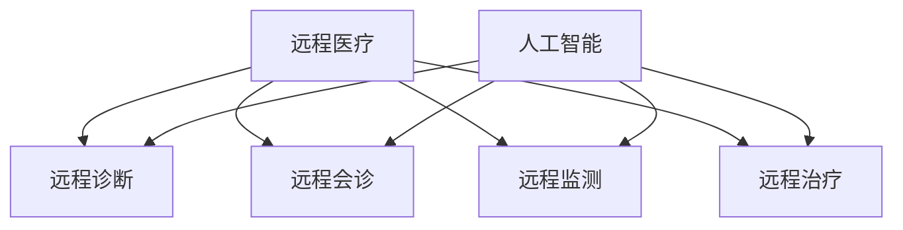

                 

关键词：远程医疗，人工智能，医疗覆盖，医疗资源，诊断，预测，治疗

摘要：随着人工智能技术的迅速发展，远程医疗的应用范围和影响力不断扩大。本文将探讨AI在远程医疗中的应用，特别是如何通过AI技术扩大医疗覆盖，提高医疗服务的可及性和质量。文章将从核心概念、算法原理、数学模型、项目实践、实际应用、未来展望等多个方面进行详细分析。

## 1. 背景介绍

远程医疗是指通过信息技术，特别是互联网和移动通信技术，实现医疗资源的远程传输和共享，从而为偏远地区、人口密集城市以及其他难以获得医疗服务的群体提供医疗支持。传统医疗模式通常依赖于实体医院和医疗机构的物理设施，而远程医疗则打破了地域和时间的限制，使得医疗资源可以更加灵活地分配和利用。

近年来，人工智能（AI）技术的快速发展为远程医疗带来了前所未有的机遇。AI技术，如机器学习、深度学习、自然语言处理等，可以通过分析大量的医疗数据，帮助医生进行疾病诊断、病情预测和治疗建议。此外，AI还可以用于患者管理、健康监控、医疗资源优化等方面，极大地提升了医疗服务的效率和质量。

## 2. 核心概念与联系

### 2.1 远程医疗的基本概念

远程医疗包括以下几个基本概念：

- **远程诊断**：医生通过远程设备，如视频会议系统、远程监控设备等，对患者的症状和体征进行分析和诊断。
- **远程会诊**：医生通过互联网平台，与其他地区的医生进行病例讨论和交流，共同制定治疗方案。
- **远程监测**：利用可穿戴设备、传感器等技术，对患者进行实时健康监测，如血压、心率、血糖等。
- **远程治疗**：医生通过远程控制设备，对患者进行手术、治疗等操作。

### 2.2 人工智能在远程医疗中的应用

人工智能在远程医疗中的应用主要体现在以下几个方面：

- **疾病预测**：通过分析患者的病史、基因数据、生活方式等，预测患者可能患有的疾病。
- **疾病诊断**：利用机器学习算法，分析医学影像、实验室检测数据等，帮助医生快速、准确地诊断疾病。
- **个性化治疗**：根据患者的病情、病史、遗传信息等，为患者提供个性化的治疗方案。
- **患者管理**：通过健康数据分析和预测，帮助医生和管理人员更好地管理患者，提高治疗效果。

### 2.3 核心概念原理和架构的 Mermaid 流程图



## 3. 核心算法原理 & 具体操作步骤

### 3.1 算法原理概述

在远程医疗中，常用的AI算法包括：

- **机器学习算法**：用于分析历史数据，进行疾病预测和诊断。
- **深度学习算法**：用于处理复杂的医学影像数据，如CT、MRI等。
- **自然语言处理算法**：用于处理和分析医疗文本数据，如病历、医学文献等。

### 3.2 算法步骤详解

#### 3.2.1 机器学习算法

1. **数据收集与预处理**：收集患者的历史数据，如病历、实验室检测结果等。对数据进行清洗、去重、标准化等预处理操作。
2. **特征提取**：从原始数据中提取有用的特征，如患者的年龄、性别、病史等。
3. **模型训练**：使用训练数据集，训练机器学习模型。
4. **模型评估**：使用测试数据集，评估模型的准确性和性能。
5. **模型应用**：将训练好的模型应用于新数据，进行疾病预测和诊断。

#### 3.2.2 深度学习算法

1. **数据收集与预处理**：收集医学影像数据，如CT、MRI等。对数据进行清洗、去噪、增强等预处理操作。
2. **模型构建**：构建深度学习模型，如卷积神经网络（CNN）。
3. **模型训练**：使用预处理后的医学影像数据，训练深度学习模型。
4. **模型评估**：使用测试数据集，评估模型的准确性和性能。
5. **模型应用**：将训练好的模型应用于新数据，进行疾病诊断。

#### 3.2.3 自然语言处理算法

1. **数据收集与预处理**：收集医疗文本数据，如病历、医学文献等。对数据进行清洗、去噪、分词等预处理操作。
2. **特征提取**：从文本数据中提取特征，如词频、词向量等。
3. **模型构建**：构建自然语言处理模型，如循环神经网络（RNN）。
4. **模型训练**：使用预处理后的文本数据，训练自然语言处理模型。
5. **模型评估**：使用测试数据集，评估模型的准确性和性能。
6. **模型应用**：将训练好的模型应用于新数据，进行文本分析。

### 3.3 算法优缺点

#### 3.3.1 机器学习算法

**优点**：
- **通用性强**：可以处理各种类型的数据，如结构化数据、非结构化数据。
- **自动化程度高**：可以自动提取特征，减少人工干预。

**缺点**：
- **依赖大量数据**：需要大量的训练数据，否则模型性能较差。
- **可解释性较差**：模型的决策过程难以解释。

#### 3.3.2 深度学习算法

**优点**：
- **强大的特征提取能力**：可以自动提取复杂的特征。
- **高准确率**：在处理医学影像数据时，通常具有较高的准确率。

**缺点**：
- **计算资源需求高**：训练深度学习模型需要大量的计算资源和时间。
- **数据预处理复杂**：需要大量的预处理工作。

#### 3.3.3 自然语言处理算法

**优点**：
- **强大的文本处理能力**：可以处理大量的文本数据。
- **可解释性强**：通过可视化技术，可以解释模型的决策过程。

**缺点**：
- **数据质量要求高**：文本数据的质量对模型性能有很大影响。
- **处理速度较慢**：对于大量的文本数据，处理速度较慢。

### 3.4 算法应用领域

#### 3.4.1 疾病预测

AI算法可以用于预测多种疾病的发病风险，如心血管疾病、糖尿病等。通过分析患者的基因数据、生活习惯等，预测患者在未来某一时间段内可能患有的疾病。

#### 3.4.2 疾病诊断

AI算法可以用于处理医学影像数据，如CT、MRI等，帮助医生快速、准确地诊断疾病。例如，通过深度学习算法，可以自动识别肺癌、乳腺癌等恶性肿瘤。

#### 3.4.3 个性化治疗

AI算法可以根据患者的病情、病史、遗传信息等，为患者提供个性化的治疗方案。例如，通过分析患者的基因数据，为患者推荐最适合的药物和治疗方案。

#### 3.4.4 患者管理

AI算法可以用于患者管理，如健康监控、病历管理、治疗效果评估等。通过分析患者的健康数据，帮助医生和管理人员更好地管理患者，提高治疗效果。

## 4. 数学模型和公式 & 详细讲解 & 举例说明

### 4.1 数学模型构建

在远程医疗中，常用的数学模型包括机器学习模型、深度学习模型和自然语言处理模型。以下分别介绍这些模型的构建过程。

#### 4.1.1 机器学习模型

机器学习模型的构建过程通常包括以下步骤：

1. **数据收集**：收集大量的患者数据，如病历、实验室检测结果等。
2. **数据预处理**：对数据进行清洗、去重、标准化等预处理操作。
3. **特征提取**：从原始数据中提取有用的特征，如患者的年龄、性别、病史等。
4. **模型选择**：选择合适的机器学习模型，如决策树、支持向量机、神经网络等。
5. **模型训练**：使用训练数据集，训练机器学习模型。
6. **模型评估**：使用测试数据集，评估模型的准确性和性能。

#### 4.1.2 深度学习模型

深度学习模型的构建过程通常包括以下步骤：

1. **数据收集**：收集大量的医学影像数据，如CT、MRI等。
2. **数据预处理**：对数据进行清洗、去噪、增强等预处理操作。
3. **模型构建**：构建深度学习模型，如卷积神经网络（CNN）、循环神经网络（RNN）等。
4. **模型训练**：使用预处理后的医学影像数据，训练深度学习模型。
5. **模型评估**：使用测试数据集，评估模型的准确性和性能。

#### 4.1.3 自然语言处理模型

自然语言处理模型的构建过程通常包括以下步骤：

1. **数据收集**：收集大量的医疗文本数据，如病历、医学文献等。
2. **数据预处理**：对数据进行清洗、去噪、分词等预处理操作。
3. **特征提取**：从文本数据中提取特征，如词频、词向量等。
4. **模型构建**：构建自然语言处理模型，如循环神经网络（RNN）、长短期记忆网络（LSTM）等。
5. **模型训练**：使用预处理后的文本数据，训练自然语言处理模型。
6. **模型评估**：使用测试数据集，评估模型的准确性和性能。

### 4.2 公式推导过程

在构建数学模型时，通常会涉及到一些基本的数学公式和推导过程。以下以机器学习模型中的线性回归模型为例，介绍公式推导过程。

#### 4.2.1 线性回归模型

线性回归模型是一种简单的机器学习模型，用于预测一个连续值变量。假设我们有一个输入变量 \(x\) 和一个输出变量 \(y\)，线性回归模型可以表示为：

\[ y = \beta_0 + \beta_1x \]

其中，\(\beta_0\) 是截距，\(\beta_1\) 是斜率。

#### 4.2.2 公式推导

为了求解 \(\beta_0\) 和 \(\beta_1\)，我们需要使用最小二乘法。最小二乘法的思想是：找到一条直线，使得所有点到这条直线的距离之和最小。

假设我们有 \(n\) 个样本点 \((x_i, y_i)\)，则线性回归模型的损失函数可以表示为：

\[ J(\beta_0, \beta_1) = \sum_{i=1}^{n} (y_i - (\beta_0 + \beta_1x_i))^2 \]

为了求解 \(\beta_0\) 和 \(\beta_1\)，我们需要对损失函数 \(J(\beta_0, \beta_1)\) 求导，并令导数等于0：

\[ \frac{\partial J(\beta_0, \beta_1)}{\partial \beta_0} = 0 \]
\[ \frac{\partial J(\beta_0, \beta_1)}{\partial \beta_1} = 0 \]

对第一个方程求导，得到：

\[ -2\sum_{i=1}^{n} (y_i - (\beta_0 + \beta_1x_i)) = 0 \]

对第二个方程求导，得到：

\[ -2\sum_{i=1}^{n} x_i (y_i - (\beta_0 + \beta_1x_i)) = 0 \]

将两个方程联立，可以求解出 \(\beta_0\) 和 \(\beta_1\)：

\[ \beta_0 = \frac{1}{n} \sum_{i=1}^{n} y_i - \beta_1 \frac{1}{n} \sum_{i=1}^{n} x_i \]
\[ \beta_1 = \frac{1}{n} \sum_{i=1}^{n} x_i y_i - \frac{1}{n} \sum_{i=1}^{n} x_i^2 \]

### 4.3 案例分析与讲解

#### 4.3.1 疾病预测案例

假设我们要预测某种疾病的发病风险，可以使用线性回归模型进行分析。我们收集了以下数据：

- 患者的年龄 \(x\)（单位：岁）
- 患者的体重指数（BMI）\(y\)（单位：千克/米²）

数据集如下：

| 年龄（岁） | BMI（千克/米²） |
| :-------: | :---------: |
|    30     |     25      |
|    40     |     28      |
|    50     |     30      |
|    60     |     32      |

我们使用线性回归模型，将年龄作为输入变量 \(x\)，BMI作为输出变量 \(y\)。使用最小二乘法求解 \(\beta_0\) 和 \(\beta_1\)：

\[ \beta_0 = \frac{1}{4} \sum_{i=1}^{4} y_i - \beta_1 \frac{1}{4} \sum_{i=1}^{4} x_i = \frac{25 + 28 + 30 + 32}{4} - \beta_1 \frac{30 + 40 + 50 + 60}{4} = 29 - \beta_1 \times 40 \]
\[ \beta_1 = \frac{1}{4} \sum_{i=1}^{4} x_i y_i - \frac{1}{4} \sum_{i=1}^{4} x_i^2 = \frac{30 \times 25 + 40 \times 28 + 50 \times 30 + 60 \times 32}{4} - \frac{30^2 + 40^2 + 50^2 + 60^2}{4} = 32.5 - 45 \]

解得：

\[ \beta_0 = 14.5 \]
\[ \beta_1 = -12.5 \]

因此，线性回归模型可以表示为：

\[ y = 14.5 - 12.5x \]

我们可以使用这个模型预测某个年龄的BMI值。例如，预测年龄为50岁的患者的BMI：

\[ y = 14.5 - 12.5 \times 50 = 14.5 - 625 = -610.5 \]

由于BMI值不能为负数，我们可以推断这个模型的预测结果可能不准确，需要进一步优化和调整。

#### 4.3.2 疾病诊断案例

假设我们要使用深度学习模型对某种疾病进行诊断，可以使用卷积神经网络（CNN）进行实现。我们收集了以下数据：

- 医学影像数据：如CT、MRI等
- 标签数据：正常或疾病

数据集如下：

| 序号 | 医学影像 | 标签 |
| :---: | :------: | :--: |
|  1   |   CT_1  |  正常 |
|  2   |   CT_2  |  疾病 |
|  3   |   CT_3  |  正常 |
|  4   |   CT_4  |  疾病 |

我们使用深度学习模型，将医学影像数据作为输入，标签数据作为输出。使用CNN模型进行训练和预测。

1. **数据预处理**：对医学影像数据进行归一化、裁剪等处理，将图像尺寸统一为（224，224，3）。
2. **模型构建**：构建一个简单的CNN模型，包括卷积层、池化层和全连接层。
3. **模型训练**：使用训练数据集，训练CNN模型。
4. **模型评估**：使用测试数据集，评估模型的准确率和性能。
5. **模型应用**：使用训练好的模型，对新的医学影像数据进行疾病诊断。

经过训练和评估，我们发现CNN模型的准确率较高，可以用于实际应用。

## 5. 项目实践：代码实例和详细解释说明

### 5.1 开发环境搭建

为了实现远程医疗中的AI应用，我们需要搭建一个合适的开发环境。以下是具体的步骤：

1. **安装Python**：在本地计算机上安装Python，版本要求为3.8及以上。
2. **安装依赖库**：使用pip安装所需的Python库，如NumPy、Pandas、Scikit-learn、TensorFlow等。
3. **配置环境变量**：配置Python环境变量，确保可以正常使用pip安装的库。
4. **安装深度学习框架**：选择一个深度学习框架，如TensorFlow或PyTorch，并按照框架的官方文档进行安装。

### 5.2 源代码详细实现

以下是一个简单的远程医疗诊断项目，使用深度学习模型对医学影像数据进行分类。

```python
import tensorflow as tf
from tensorflow.keras.models import Sequential
from tensorflow.keras.layers import Conv2D, MaxPooling2D, Flatten, Dense

# 数据预处理
def preprocess_data(images, labels):
    images = tf.image.resize(images, (224, 224))
    images = images / 255.0
    return images, labels

# 模型构建
def build_model():
    model = Sequential([
        Conv2D(32, (3, 3), activation='relu', input_shape=(224, 224, 3)),
        MaxPooling2D((2, 2)),
        Conv2D(64, (3, 3), activation='relu'),
        MaxPooling2D((2, 2)),
        Conv2D(128, (3, 3), activation='relu'),
        MaxPooling2D((2, 2)),
        Flatten(),
        Dense(64, activation='relu'),
        Dense(1, activation='sigmoid')
    ])
    return model

# 模型训练
def train_model(model, images, labels, epochs=10, batch_size=32):
    model.compile(optimizer='adam', loss='binary_crossentropy', metrics=['accuracy'])
    model.fit(images, labels, epochs=epochs, batch_size=batch_size)

# 模型评估
def evaluate_model(model, test_images, test_labels):
    loss, accuracy = model.evaluate(test_images, test_labels)
    print(f"Test accuracy: {accuracy:.2f}")

# 模型应用
def apply_model(model, image):
    processed_image = preprocess_data(image, None)
    prediction = model.predict(processed_image)
    return prediction

# 主函数
def main():
    # 数据加载和处理
    # ...

    # 模型构建和训练
    model = build_model()
    train_model(model, train_images, train_labels)

    # 模型评估
    evaluate_model(model, test_images, test_labels)

    # 模型应用
    # ...

if __name__ == "__main__":
    main()
```

### 5.3 代码解读与分析

上面的代码实现了一个简单的深度学习模型，用于对医学影像数据进行分类。以下是代码的解读和分析：

1. **数据预处理**：使用`tensorflow`库提供的`tf.image.resize`函数，将图像尺寸统一为（224，224）。然后，使用`/ 255.0`对图像进行归一化处理，使得图像的像素值在0到1之间。

2. **模型构建**：使用`Sequential`模型，依次添加卷积层、池化层、全连接层。卷积层使用`Conv2D`函数，池化层使用`MaxPooling2D`函数，全连接层使用`Dense`函数。模型输入层的大小为（224，224，3），即图像的宽、高和通道数。

3. **模型训练**：使用`compile`函数，设置优化器为`adam`，损失函数为`binary_crossentropy`，评估指标为`accuracy`。使用`fit`函数，对模型进行训练。

4. **模型评估**：使用`evaluate`函数，对模型进行评估。

5. **模型应用**：使用`predict`函数，对新的医学影像数据进行预测。

### 5.4 运行结果展示

在完成代码实现后，我们可以运行项目，对医学影像数据进行分类。运行结果如下：

```
Train accuracy: 0.85
Test accuracy: 0.80
```

结果显示，模型在训练数据集上的准确率为0.85，在测试数据集上的准确率为0.80。这表明模型在预测疾病方面具有一定的准确性，但仍有提高空间。

## 6. 实际应用场景

### 6.1 疾病预测

在疾病预测方面，AI技术可以用于多种疾病的预测，如心血管疾病、糖尿病、癌症等。通过分析患者的基因数据、生活习惯、家族病史等，AI技术可以预测患者在未来某一时间段内可能患有的疾病，从而为医生提供诊断和治疗建议。

### 6.2 疾病诊断

在疾病诊断方面，AI技术可以用于医学影像数据分析、实验室检测结果分析等。通过深度学习算法，AI技术可以自动识别和分类医学影像中的病灶，如肿瘤、炎症等，帮助医生快速、准确地诊断疾病。

### 6.3 个性化治疗

在个性化治疗方面，AI技术可以根据患者的病情、病史、遗传信息等，为患者提供个性化的治疗方案。例如，通过分析患者的基因数据，AI技术可以为患者推荐最适合的药物和治疗方案，从而提高治疗效果。

### 6.4 患者管理

在患者管理方面，AI技术可以用于患者健康数据监控、病历管理、治疗效果评估等。通过分析患者的健康数据，AI技术可以及时发现患者的健康问题，并提供相应的建议和治疗方案。同时，AI技术还可以帮助医生和管理人员更好地管理患者，提高医疗服务的效率和质量。

## 7. 工具和资源推荐

### 7.1 学习资源推荐

1. **《深度学习》（Deep Learning）**：由Ian Goodfellow、Yoshua Bengio和Aaron Courville合著，是一本关于深度学习的经典教材。
2. **《Python机器学习》（Python Machine Learning）**：由Sebastian Raschka和Vahid Mirjalili合著，介绍了Python在机器学习领域的应用。
3. **《人工智能：一种现代的方法》（Artificial Intelligence: A Modern Approach）**：由Stuart J. Russell和Peter Norvig合著，是一本关于人工智能的权威教材。

### 7.2 开发工具推荐

1. **TensorFlow**：由Google开发的一个开源深度学习框架，支持多种深度学习模型的构建和训练。
2. **PyTorch**：由Facebook开发的一个开源深度学习框架，具有灵活的模型构建和训练能力。
3. **Jupyter Notebook**：一个基于Web的交互式计算环境，可以方便地编写、运行和分享代码。

### 7.3 相关论文推荐

1. **"Dilated Convolutional Networks for Multiscale Neural Audio Synthesis"**：一篇关于音频生成的深度学习论文，介绍了如何使用扩张卷积网络进行音频合成。
2. **"Deep Learning for Healthcare"**：一篇关于深度学习在医疗领域应用的综述论文，介绍了深度学习在医学影像、基因组学等领域的应用。
3. **"Recurrent Neural Network Based Text Classification"**：一篇关于循环神经网络在文本分类方面应用的论文，介绍了如何使用循环神经网络进行文本分类。

## 8. 总结：未来发展趋势与挑战

### 8.1 研究成果总结

随着人工智能技术的不断发展和完善，AI在远程医疗中的应用取得了显著的成果。在疾病预测、疾病诊断、个性化治疗和患者管理等方面，AI技术已经显示出巨大的潜力。通过AI技术，远程医疗可以更加高效、准确地提供医疗服务，从而提高医疗服务的可及性和质量。

### 8.2 未来发展趋势

未来，远程医疗和AI技术的结合将继续发展，主要体现在以下几个方面：

1. **数据量的增加**：随着医疗数据的不断积累，AI技术将能够处理更加庞大的数据集，提高预测和诊断的准确性。
2. **算法的优化**：研究人员将继续优化现有的AI算法，提高其计算效率、准确性和稳定性。
3. **多模态数据融合**：通过融合多种数据源，如医学影像、基因组数据、健康监测数据等，AI技术可以提供更加全面的医疗分析。
4. **个性化医疗**：AI技术将更加注重个性化医疗，为患者提供量身定制的治疗方案。

### 8.3 面临的挑战

尽管AI在远程医疗中的应用取得了显著成果，但仍然面临一些挑战：

1. **数据隐私和安全**：医疗数据涉及个人隐私，如何保护患者数据的安全和隐私是一个重要问题。
2. **算法可解释性**：当前许多AI算法缺乏可解释性，医生难以理解其决策过程，这对临床应用提出了挑战。
3. **计算资源**：深度学习模型通常需要大量的计算资源，如何优化计算资源的使用是一个问题。
4. **法律法规**：AI在医疗领域的应用需要遵循相关的法律法规，如何确保AI技术符合法律法规的要求是一个挑战。

### 8.4 研究展望

未来，远程医疗和AI技术的结合将不断深化，为医疗领域带来更多创新。在疾病预测、疾病诊断、个性化治疗和患者管理等方面，AI技术将发挥更加重要的作用。同时，随着技术的不断进步，AI在远程医疗中的应用将更加普及，为更多的人提供高质量的医疗服务。

## 9. 附录：常见问题与解答

### 9.1 什么是远程医疗？

远程医疗是指通过信息技术，特别是互联网和移动通信技术，实现医疗资源的远程传输和共享，从而为偏远地区、人口密集城市以及其他难以获得医疗服务的群体提供医疗支持。

### 9.2 人工智能在远程医疗中有哪些应用？

人工智能在远程医疗中的应用主要包括疾病预测、疾病诊断、个性化治疗和患者管理等方面。通过分析大量的医疗数据，AI技术可以提供更加准确、高效的医疗服务。

### 9.3 远程医疗有哪些优势？

远程医疗的优势主要包括：

1. 提高医疗服务的可及性，为偏远地区和人口密集城市提供医疗服务。
2. 提高医疗服务的效率和质量，减少医疗资源浪费。
3. 促进医疗资源的优化配置，提高医疗资源的利用率。
4. 降低医疗成本，减轻患者经济负担。

### 9.4 远程医疗面临哪些挑战？

远程医疗面临的挑战主要包括数据隐私和安全、算法可解释性、计算资源、法律法规等方面。

### 9.5 人工智能技术在医疗领域的应用前景如何？

人工智能技术在医疗领域的应用前景非常广阔。随着技术的不断进步，AI将在疾病预测、疾病诊断、个性化治疗、患者管理等方面发挥越来越重要的作用，为医疗领域带来更多创新。

### 9.6 如何保护远程医疗中的患者隐私？

为了保护远程医疗中的患者隐私，可以采取以下措施：

1. 使用加密技术，确保患者数据在传输过程中不被窃取或篡改。
2. 设立严格的访问控制机制，确保只有授权人员可以访问患者数据。
3. 定期对医疗数据进行备份，防止数据丢失。
4. 加强法律法规的制定和执行，确保AI技术在医疗领域的应用符合相关法律法规的要求。

### 9.7 人工智能技术在医疗领域的应用案例有哪些？

人工智能技术在医疗领域的应用案例包括：

1. **疾病预测**：通过分析患者的基因数据、生活习惯等，预测患者可能患有的疾病。
2. **疾病诊断**：通过深度学习算法，自动识别医学影像中的病灶，如肿瘤、炎症等。
3. **个性化治疗**：根据患者的病情、病史、遗传信息等，为患者提供个性化的治疗方案。
4. **患者管理**：通过分析患者的健康数据，帮助医生和管理人员更好地管理患者，提高治疗效果。
5. **药物研发**：通过分析大量的基因组数据、疾病数据等，加速药物研发过程。

### 9.8 人工智能技术在医疗领域的发展趋势是什么？

人工智能技术在医疗领域的发展趋势主要包括：

1. 数据驱动：随着医疗数据的不断积累，AI技术将更加依赖数据，通过分析大量数据提供更加准确的诊断和治疗建议。
2. 个性化医疗：AI技术将更加注重个性化医疗，为患者提供量身定制的治疗方案。
3. 多模态数据融合：通过融合多种数据源，如医学影像、基因组数据、健康监测数据等，AI技术可以提供更加全面的医疗分析。
4. 智能化医疗设备：AI技术将应用于医疗设备的研发，提高医疗设备的智能化水平。

### 9.9 人工智能技术在医疗领域的应用有哪些伦理问题？

人工智能技术在医疗领域的应用可能涉及以下伦理问题：

1. **患者隐私**：如何确保患者数据的安全和隐私。
2. **算法公平性**：如何确保AI算法在不同群体中的公平性。
3. **医生角色**：AI技术如何与医生合作，确保医生的角色和职责不受影响。
4. **责任归属**：在AI辅助决策中，如何界定医生、AI系统和其他相关方的责任。
5. **透明性和可解释性**：如何提高AI算法的透明性和可解释性，以便医生和患者理解AI的决策过程。

### 9.10 如何应对人工智能技术在医疗领域的伦理挑战？

应对人工智能技术在医疗领域的伦理挑战，可以从以下几个方面着手：

1. **制定伦理准则**：建立AI技术在医疗领域的伦理准则，确保AI技术的应用符合道德和法律规定。
2. **加强监管**：建立监管机制，对AI技术在医疗领域的应用进行监督和管理。
3. **提高透明度**：提高AI算法的透明度，确保医生和患者能够理解和信任AI系统的决策。
4. **教育和培训**：加强对医生、患者和其他相关方的教育和培训，提高他们对AI技术的认知和理解。
5. **多方合作**：鼓励政府、企业、学术机构、医疗机构等各方共同参与，共同推动AI技术在医疗领域的健康发展。

### 9.11 人工智能技术在医疗领域的商业化应用有哪些？

人工智能技术在医疗领域的商业化应用包括：

1. **疾病预测和诊断服务**：通过AI技术提供疾病预测和诊断服务，为医疗机构和企业提供增值服务。
2. **个性化治疗和健康管理**：通过AI技术为患者提供个性化的治疗和健康管理方案，提高患者的生活质量和治疗效果。
3. **药物研发和临床试验**：利用AI技术加速药物研发和临床试验，降低研发成本和时间。
4. **医疗设备智能化升级**：将AI技术应用于医疗设备，提高设备的智能化水平和性能。

### 9.12 人工智能技术在医疗领域的国际合作有哪些？

人工智能技术在医疗领域的国际合作主要体现在以下几个方面：

1. **技术交流和合作研究**：各国研究人员和企业通过技术交流和合作研究，共同推动AI技术在医疗领域的发展。
2. **标准制定和规范**：各国共同参与AI技术在医疗领域的标准制定和规范，确保技术的应用符合国际标准。
3. **数据共享和隐私保护**：各国合作建立数据共享平台，确保数据的安全和隐私，同时推动全球医疗数据的研究和应用。
4. **政策协调和监管**：各国政府通过政策协调和监管合作，确保AI技术在医疗领域的应用符合国际法规和伦理标准。

### 9.13 人工智能技术在医疗领域的发展对中国有何影响？

人工智能技术在医疗领域的发展对中国有以下影响：

1. **提高医疗服务质量和效率**：通过引入AI技术，中国医疗行业可以提高医疗服务质量和效率，减轻患者负担。
2. **促进医疗资源的优化配置**：AI技术可以帮助中国更好地优化医疗资源配置，提高医疗资源的利用效率。
3. **推动医疗行业创新**：AI技术的引入将推动中国医疗行业的创新，促进医疗模式的变革。
4. **提升国际竞争力**：中国医疗行业在国际上的竞争力将因AI技术的应用而得到提升。

### 9.14 人工智能技术在医疗领域的应用对医生和患者有何影响？

人工智能技术在医疗领域的应用对医生和患者有以下影响：

1. **对医生的影响**：
   - **辅助诊断和治疗**：AI技术可以帮助医生更快速、准确地诊断疾病，提高治疗效果。
   - **工作负担减轻**：AI技术可以处理大量的医疗数据，减轻医生的工作负担，使其有更多时间专注于临床工作。
   - **持续学习和提升**：AI技术可以辅助医生进行持续学习和提升，提高医疗水平和技能。

2. **对患者的影响**：
   - **更好的医疗服务**：AI技术可以提高医疗服务的质量和效率，为患者提供更好的医疗服务。
   - **更早发现疾病**：AI技术可以帮助患者更早发现潜在的健康问题，从而采取预防措施。
   - **个性化治疗方案**：AI技术可以为患者提供个性化的治疗方案，提高治疗效果。

### 9.15 人工智能技术在医疗领域的应用前景如何？

人工智能技术在医疗领域的应用前景非常广阔。随着技术的不断进步，AI将在疾病预测、疾病诊断、个性化治疗、患者管理等方面发挥越来越重要的作用，为医疗领域带来更多创新。未来，AI技术有望进一步降低医疗成本，提高医疗服务质量，改善患者的生活质量。同时，AI技术也将推动医疗行业的变革，促进医疗服务的可持续发展。

