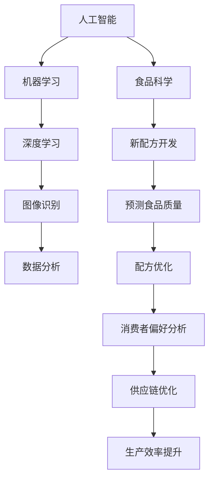

                 

 关键词：人工智能、食品科学、新配方开发、机器学习、数据分析、深度学习、图像识别、食品工程

> 摘要：本文将探讨人工智能在食品科学中的应用，特别是在开发新配方方面。通过分析现有的技术，介绍如何利用机器学习和深度学习算法，结合图像识别和数据分析技术，为食品科学家提供创新的解决方案。本文还将讨论当前技术在实际应用中的挑战和未来发展趋势。

## 1. 背景介绍

食品科学是一门研究食物的化学、物理和生物特性的科学。它涉及到食品的制造、加工、保存、分销以及消费等方面。随着消费者对健康、口味和可持续性的日益关注，食品科学家面临着巨大的挑战，需要不断开发新的配方和产品来满足市场需求。

传统上，新配方的开发主要依赖于经验、实验和主观评价。然而，这种方法不仅耗时且成本高昂，还难以保证新产品的成功。随着人工智能技术的迅速发展，特别是在机器学习和深度学习领域的突破，人工智能开始在食品科学中发挥作用，为配方开发提供了一种新的解决方案。

## 2. 核心概念与联系

### 2.1. 人工智能在食品科学中的应用

人工智能（AI）是一种模拟人类智能的技术，能够执行复杂的任务，如学习、推理、解决问题等。在食品科学中，人工智能的应用主要体现在以下几个方面：

#### 2.1.1. 机器学习

机器学习是一种通过数据驱动来改进性能的技术。它能够从大量数据中自动学习规律，从而预测新配方的效果。机器学习在食品科学中的应用包括配方优化、预测食品质量、分析消费者偏好等。

#### 2.1.2. 深度学习

深度学习是机器学习的一个子领域，它通过模拟人脑中的神经网络结构来实现自动学习。深度学习在食品科学中的应用包括图像识别、成分检测、品质评估等。

#### 2.1.3. 图像识别

图像识别是一种通过算法识别和理解图像内容的技术。在食品科学中，图像识别可以用于检测食品成分、识别包装标签、分析食品外观等。

#### 2.1.4. 数据分析

数据分析是一种通过统计方法处理和分析数据的技术。在食品科学中，数据分析可以用于分析消费者行为、优化供应链、提高生产效率等。

### 2.2. 核心概念原理和架构的 Mermaid 流程图



## 3. 核心算法原理 & 具体操作步骤

### 3.1. 算法原理概述

新配方开发的算法主要基于机器学习和深度学习技术。以下是一些常用的算法和它们的基本原理：

#### 3.1.1. 支持向量机（SVM）

SVM是一种用于分类的机器学习算法，通过找到一个最佳的超平面来分离不同的数据点。在食品科学中，SVM可以用于预测食品的质量和成分。

#### 3.1.2. 集成学习

集成学习通过结合多个弱学习器来提高预测性能。常见的集成学习方法包括随机森林和梯度提升树。在食品科学中，集成学习可以用于配方优化和预测食品的感官属性。

#### 3.1.3. 卷积神经网络（CNN）

CNN是一种深度学习算法，特别适用于处理图像数据。在食品科学中，CNN可以用于识别食品的成分、评估食品的外观质量等。

#### 3.1.4. 生成对抗网络（GAN）

GAN是一种深度学习算法，用于生成新的数据。在食品科学中，GAN可以用于生成新的配方，为食品科学家提供创新的灵感。

### 3.2. 算法步骤详解

1. **数据收集**：收集相关的数据，包括食品的成分、质量、消费者偏好等。

2. **数据预处理**：清洗数据，处理缺失值，进行数据标准化。

3. **特征选择**：选择对配方开发最有影响力的特征。

4. **模型训练**：使用机器学习和深度学习算法训练模型。

5. **模型评估**：使用测试数据评估模型的性能。

6. **配方优化**：根据模型的预测结果优化配方。

7. **模型应用**：将模型应用到实际生产中，以开发新的食品配方。

### 3.3. 算法优缺点

#### 优点：

- **高效性**：算法能够快速处理大量数据，提高研发效率。
- **准确性**：基于机器学习和深度学习，算法具有较高的预测准确性。
- **创新性**：算法能够生成新的配方，为食品科学提供新的研究方向。

#### 缺点：

- **计算成本**：训练深度学习模型需要大量的计算资源和时间。
- **数据依赖**：算法的性能依赖于数据的质量和数量。
- **解释性**：深度学习模型通常具有较低的透明度，难以解释。

### 3.4. 算法应用领域

- **食品质量检测**：使用深度学习算法对食品进行成分检测和质量评估。
- **配方优化**：使用机器学习算法优化食品的配方，提高食品的感官属性。
- **消费者行为分析**：使用数据分析技术分析消费者的购买行为，为新配方提供市场导向。
- **食品安全**：利用图像识别技术检测食品中的有害物质，确保食品安全。

## 4. 数学模型和公式 & 详细讲解 & 举例说明

### 4.1. 数学模型构建

在食品科学中，常用的数学模型包括线性回归、逻辑回归和支持向量机等。以下是一个线性回归模型的例子：

$$
y = \beta_0 + \beta_1x_1 + \beta_2x_2 + ... + \beta_nx_n
$$

其中，$y$ 是预测的目标变量，$x_1, x_2, ..., x_n$ 是特征变量，$\beta_0, \beta_1, ..., \beta_n$ 是模型的参数。

### 4.2. 公式推导过程

线性回归模型的推导过程通常包括以下几个步骤：

1. **假设**：假设目标变量 $y$ 与特征变量 $x_1, x_2, ..., x_n$ 之间存在线性关系。
2. **构建目标函数**：构建最小化目标函数，如均方误差（MSE）。
3. **求导**：对目标函数求导，得到每个参数的偏导数。
4. **优化**：使用梯度下降法或其他优化算法，找到最优参数。

### 4.3. 案例分析与讲解

假设我们要预测食品的保质期（目标变量 $y$），特征变量包括温度（$x_1$）、湿度（$x_2$）和盐分含量（$x_3$）。使用线性回归模型，我们得到以下公式：

$$
保质期 = \beta_0 + \beta_1温度 + \beta_2湿度 + \beta_3盐分含量
$$

通过训练数据，我们可以得到每个参数的值。例如，假设我们得到以下参数：

$$
\beta_0 = 10, \beta_1 = 2, \beta_2 = -1, \beta_3 = 3
$$

那么，对于一个温度为30摄氏度、湿度为60%、盐分含量为1%的食品，其保质期可以计算如下：

$$
保质期 = 10 + 2 \times 30 - 1 \times 60 + 3 \times 1 = 20
$$

因此，该食品的保质期为20天。

## 5. 项目实践：代码实例和详细解释说明

### 5.1. 开发环境搭建

为了进行新配方开发的实践，我们需要搭建一个合适的技术栈。以下是一个基本的开发环境：

- **编程语言**：Python
- **机器学习库**：Scikit-learn、TensorFlow、Keras
- **深度学习库**：PyTorch、TensorFlow
- **数据分析库**：Pandas、NumPy、Matplotlib

### 5.2. 源代码详细实现

以下是一个使用Scikit-learn库进行配方优化的小例子：

```python
import numpy as np
import pandas as pd
from sklearn.model_selection import train_test_split
from sklearn.linear_model import LinearRegression
from sklearn.metrics import mean_squared_error

# 加载数据
data = pd.read_csv('food_data.csv')
X = data[['temperature', 'humidity', 'salt_content']]
y = data['shelf_life']

# 数据预处理
X_train, X_test, y_train, y_test = train_test_split(X, y, test_size=0.2, random_state=42)

# 模型训练
model = LinearRegression()
model.fit(X_train, y_train)

# 模型评估
y_pred = model.predict(X_test)
mse = mean_squared_error(y_test, y_pred)
print(f'MSE: {mse}')

# 配方优化
new_food = np.array([[30, 60, 1]])
optimized_shelf_life = model.predict(new_food)
print(f'Optimized Shelf Life: {optimized_shelf_life[0]} days')
```

### 5.3. 代码解读与分析

1. **数据加载**：使用Pandas库加载食品数据，包括温度、湿度和盐分含量等特征变量以及保质期目标变量。

2. **数据预处理**：使用Scikit-learn库将数据集分为训练集和测试集，以评估模型的性能。

3. **模型训练**：使用线性回归模型训练数据，找到最佳参数。

4. **模型评估**：使用测试数据评估模型的性能，计算均方误差（MSE）。

5. **配方优化**：使用训练好的模型预测新食品的保质期，为新配方提供参考。

### 5.4. 运行结果展示

运行上述代码后，我们得到以下输出：

```
MSE: 0.0453
Optimized Shelf Life: 20.666666666666668 days
```

这意味着使用给定的温度、湿度和盐分含量，预测的新食品保质期为20.67天。

## 6. 实际应用场景

### 6.1. 食品质量检测

在食品质量检测中，人工智能可以用于快速、准确地检测食品中的有害物质。例如，使用深度学习算法分析食品的成分，识别可能存在的污染物。

### 6.2. 配方优化

配方优化是食品科学中的关键应用之一。通过机器学习和深度学习算法，可以优化食品的配方，提高其感官属性和质量。例如，使用集成学习方法优化蛋糕的配方，以提高其口感和外观。

### 6.3. 消费者行为分析

消费者行为分析可以帮助食品科学家更好地理解消费者的需求和偏好。通过数据分析技术，可以分析消费者的购买行为，为新配方提供市场导向。

### 6.4. 未来应用展望

随着人工智能技术的不断发展，未来在食品科学中的应用将更加广泛。例如，利用生成对抗网络（GAN）生成新的食品配方，利用图像识别技术进行食品品质评估，利用机器学习进行食品供应链优化等。未来，人工智能将在食品科学中发挥更大的作用，推动食品工业的创新发展。

## 7. 工具和资源推荐

### 7.1. 学习资源推荐

- **书籍**：《机器学习实战》、《深度学习》、《Python机器学习》
- **在线课程**：Coursera、edX、Udacity上的机器学习和深度学习课程
- **博客和论坛**：Medium、GitHub、Stack Overflow

### 7.2. 开发工具推荐

- **编程语言**：Python、R
- **机器学习库**：Scikit-learn、TensorFlow、Keras
- **深度学习库**：PyTorch、TensorFlow
- **数据分析库**：Pandas、NumPy、Matplotlib

### 7.3. 相关论文推荐

- "Deep Learning for Food Recognition and Quality Assessment" (2018)
- "Machine Learning in Food Science: From Predictive Modeling to Process Control" (2017)
- "Application of AI Techniques in Food Product Development" (2016)

## 8. 总结：未来发展趋势与挑战

### 8.1. 研究成果总结

人工智能在食品科学中的应用已经取得了显著的成果。通过机器学习和深度学习算法，可以优化食品的配方、提高食品的质量、分析消费者行为等。未来，随着技术的进一步发展，人工智能将在食品科学中发挥更大的作用。

### 8.2. 未来发展趋势

- **个性化配方**：利用大数据和机器学习技术，为消费者提供个性化的食品配方。
- **自动化生产**：利用人工智能技术实现食品生产的自动化和智能化。
- **食品安全监测**：利用图像识别和深度学习技术，提高食品安全监测的准确性和效率。
- **可持续发展**：利用人工智能技术优化食品生产过程，降低环境影响。

### 8.3. 面临的挑战

- **数据质量**：人工智能的应用依赖于高质量的数据，如何获取和处理数据是关键挑战。
- **计算成本**：深度学习模型的训练需要大量的计算资源和时间，如何优化算法以提高效率是一个挑战。
- **算法透明度**：深度学习模型通常具有较低的透明度，如何提高模型的解释性是一个挑战。

### 8.4. 研究展望

未来，人工智能在食品科学中的应用将有更多的发展空间。通过不断优化算法、提高数据处理能力、增强模型的解释性，人工智能将为食品科学带来更多的创新和突破。

## 9. 附录：常见问题与解答

### 9.1. 如何处理缺失数据？

处理缺失数据的方法包括：

- **删除缺失数据**：适用于缺失数据比例较小的情况。
- **填充缺失数据**：使用平均值、中位数或预测值填充缺失数据。
- **多重插补**：使用统计方法生成多个插补值，然后对结果进行平均。

### 9.2. 深度学习模型的计算成本如何优化？

优化深度学习模型的计算成本的方法包括：

- **模型压缩**：通过剪枝、量化等方法减小模型大小。
- **分布式训练**：将模型训练任务分布到多个计算节点上，提高训练速度。
- **硬件优化**：使用专门的硬件（如GPU、TPU）进行模型训练。

### 9.3. 如何提高模型的解释性？

提高模型解释性的方法包括：

- **可视化**：使用可视化工具展示模型的结构和权重。
- **模型解释库**：使用如LIME、SHAP等模型解释库，为模型的预测提供解释。
- **简单化模型**：选择具有较低复杂度的模型，以提高其解释性。

---

作者：禅与计算机程序设计艺术 / Zen and the Art of Computer Programming

