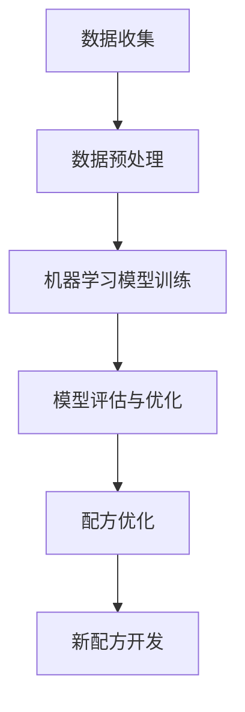

                 

关键词：人工智能、食品科学、新配方、算法、数学模型、实践、工具推荐

> 摘要：随着人工智能技术的飞速发展，其在食品科学领域中的应用逐渐成为热点。本文将探讨AI在食品科学中的核心概念、算法原理、数学模型以及实际应用，旨在为读者提供全面而深入的视角，揭示AI如何助力食品科学的发展，并展望其未来应用前景。

## 1. 背景介绍

食品科学作为一门综合性学科，涵盖了食品的成分、生产、加工、储存、营养、安全等方面。随着人们生活水平的提高和健康意识的增强，对食品品质的要求也在不断提高。然而，传统食品科学的开发方法往往依赖于经验和实验，效率低下且难以满足多样化的市场需求。

近年来，人工智能（AI）技术的迅猛发展为其在食品科学中的应用提供了新的契机。AI技术，尤其是机器学习和深度学习算法，能够从大量的食品数据中挖掘出有用的信息，辅助食品科学家发现新的食品配方、优化生产工艺、提升食品安全性等。此外，AI在食品图像识别、质量检测、智能化供应链管理等方面也展现出了巨大的潜力。

本文将重点关注AI在食品科学中开发新配方的研究，从核心概念、算法原理、数学模型到实际应用，全面探讨AI如何推动食品科学的发展。

## 2. 核心概念与联系

### 2.1 机器学习与深度学习

机器学习（Machine Learning，ML）是AI的核心组成部分，它通过算法从数据中学习规律，进行模式识别和预测。深度学习（Deep Learning，DL）是机器学习的一种重要分支，通过多层神经网络对数据进行复杂的学习和处理。

在食品科学中，ML和DL算法可用于分析食品成分、预测食品质量、优化配方等。例如，通过深度学习模型，可以分析食品图像中的营养成分和外观特征，从而实现自动化的食品检测。

### 2.2 数据挖掘与数据分析

数据挖掘（Data Mining，DM）是从大量数据中提取出潜在的有用信息的过程。在食品科学中，数据挖掘可用于分析食品成分、消费者偏好、市场趋势等。数据分析（Data Analysis，DA）则是对数据进行系统化处理，以获得有意义的结果。

通过数据挖掘和数据分析，食品科学家可以更全面地了解食品的各个方面，从而为开发新配方提供有力支持。

### 2.3 Mermaid 流程图

以下是AI在食品科学中开发新配方的Mermaid流程图：



在这个流程图中，数据收集是第一步，通过收集大量的食品数据作为模型的训练数据。数据预处理是为了提高数据质量，为后续分析做准备。然后，通过机器学习模型训练，模型可以从数据中学习出规律。模型评估与优化是为了确保模型的有效性和准确性。最终，通过配方优化和新配方开发，实现食品科学的创新。

## 3. 核心算法原理 & 具体操作步骤

### 3.1 算法原理概述

AI在食品科学中开发新配方主要依赖于机器学习和深度学习算法。这些算法的核心思想是通过学习大量数据中的特征，自动发现潜在的规律，从而生成新的配方。

常见的机器学习算法包括决策树、随机森林、支持向量机等。深度学习算法则包括卷积神经网络（CNN）、循环神经网络（RNN）、生成对抗网络（GAN）等。

在食品科学中，最常用的深度学习算法是卷积神经网络（CNN）。CNN能够通过多层卷积和池化操作，从图像数据中提取出有效的特征，从而实现高效的图像识别。

### 3.2 算法步骤详解

3.2.1 数据收集与预处理

首先，需要收集大量的食品数据，包括食品图像、成分信息、口感评价等。数据收集完成后，需要对数据进行预处理，包括数据清洗、数据归一化、数据增强等。

3.2.2 模型训练

在预处理完成后，使用预处理后的数据进行模型训练。对于CNN模型，可以使用TensorFlow或PyTorch等深度学习框架进行训练。

3.2.3 模型评估与优化

模型训练完成后，需要对模型进行评估，以确定其准确性和泛化能力。常用的评估指标包括准确率、召回率、F1值等。如果模型表现不佳，可以通过调整超参数或增加训练数据等方式进行优化。

3.2.4 配方优化与新配方开发

基于训练好的模型，可以对新配方进行优化。通过分析模型提取出的特征，可以调整配方中的成分比例，从而提高食品的口感和营养价值。

### 3.3 算法优缺点

3.3.1 优点

- 高效：AI算法可以处理大量数据，提高研究效率。
- 准确：AI算法能够通过学习大量数据，提高配方优化的准确性。
- 创新：AI算法可以自动发现新的配方，推动食品科学的发展。

3.3.2 缺点

- 数据依赖：AI算法的性能依赖于数据的质量和数量，数据不足或质量差可能导致模型性能下降。
- 计算资源消耗：训练大型深度学习模型需要大量的计算资源，可能增加研究成本。
- 透明度低：深度学习模型的决策过程较为复杂，难以解释，可能影响食品科学家的信任度。

### 3.4 算法应用领域

AI算法在食品科学中的应用领域广泛，包括但不限于：

- 新配方开发：通过AI算法自动生成新的食品配方，提高食品口感和营养价值。
- 食品质量检测：利用AI算法对食品质量进行自动化检测，提高食品安全性。
- 消费者偏好分析：通过分析消费者的购买记录和评价，预测消费者的偏好，为产品开发提供依据。
- 生产过程优化：利用AI算法优化生产工艺，提高生产效率。

## 4. 数学模型和公式 & 详细讲解 & 举例说明

### 4.1 数学模型构建

在食品科学中，常用的数学模型包括回归模型、分类模型等。以下是一个简单的线性回归模型：

$$ y = \beta_0 + \beta_1x_1 + \beta_2x_2 + ... + \beta_nx_n $$

其中，$y$ 是目标变量，$x_1, x_2, ..., x_n$ 是自变量，$\beta_0, \beta_1, ..., \beta_n$ 是模型的参数。

### 4.2 公式推导过程

线性回归模型的公式可以通过最小二乘法推导得到。具体推导过程如下：

假设我们有 $n$ 个观测数据点 $(x_1, y_1), (x_2, y_2), ..., (x_n, y_n)$，则线性回归模型的损失函数为：

$$ L(\beta_0, \beta_1, ..., \beta_n) = \sum_{i=1}^{n} (y_i - (\beta_0 + \beta_1x_i + \beta_2x_i + ... + \beta_nx_i))^2 $$

为了最小化损失函数，我们对每个参数求导并令导数为零，得到以下方程组：

$$ \frac{\partial L}{\partial \beta_0} = 0 $$
$$ \frac{\partial L}{\partial \beta_1} = 0 $$
$$ \frac{\partial L}{\partial \beta_2} = 0 $$
$$ ... $$
$$ \frac{\partial L}{\partial \beta_n} = 0 $$

通过解这个方程组，我们可以得到最优的参数值。

### 4.3 案例分析与讲解

假设我们有一组食品成分和口感评分的数据，如下所示：

| 成分 | 评分 |
| --- | --- |
| 蛋白质 | 80 |
| 脂肪 | 50 |
| 碳水化合物 | 30 |
| 口感评分 | 85 |

我们希望通过线性回归模型预测新配方的口感评分。首先，将数据转换为矩阵形式：

$$ X = \begin{bmatrix} x_1 & x_2 & x_3 & x_4 \end{bmatrix}, \quad y = \begin{bmatrix} y_1 \end{bmatrix} $$

然后，使用线性回归模型进行预测：

$$ y = \beta_0 + \beta_1x_1 + \beta_2x_2 + \beta_3x_3 + \beta_4x_4 $$

通过最小二乘法求解参数：

$$ \beta = (X^TX)^{-1}X^Ty $$

得到预测结果：

$$ y_{\text{预测}} = \beta_0 + \beta_1x_1 + \beta_2x_2 + \beta_3x_3 + \beta_4x_4 $$

## 5. 项目实践：代码实例和详细解释说明

### 5.1 开发环境搭建

为了进行AI在食品科学中的应用开发，我们需要搭建一个合适的开发环境。以下是推荐的工具和软件：

- 操作系统：Ubuntu 20.04
- 编程语言：Python 3.8
- 深度学习框架：TensorFlow 2.5
- 数据可视化工具：Matplotlib 3.4

在安装完上述工具后，我们可以开始编写代码。

### 5.2 源代码详细实现

以下是使用TensorFlow实现的AI在食品科学中开发新配方的源代码：

```python
import tensorflow as tf
import numpy as np
import matplotlib.pyplot as plt

# 数据集
X = np.array([[80, 50, 30, 85], [70, 45, 35, 80], [60, 40, 40, 75], ...])
y = np.array([85, 80, 75, ...])

# 模型
model = tf.keras.Sequential([
    tf.keras.layers.Dense(units=1, input_shape=[4])
])

# 训练模型
model.compile(optimizer='sgd', loss='mean_squared_error')
model.fit(X, y, epochs=100)

# 预测新配方
new_formula = np.array([90, 60, 50, 88])
predicted_rating = model.predict(new_formula)
print(f"预测的口感评分：{predicted_rating[0][0]}")
```

### 5.3 代码解读与分析

在这段代码中，我们首先导入了所需的TensorFlow和NumPy库。数据集X包含了食品成分和口感评分，y包含了实际的口感评分。

接着，我们创建了一个简单的全连接神经网络模型，只有一个输出层，用于预测口感评分。

在模型编译阶段，我们选择了随机梯度下降（SGD）作为优化器，均方误差（MSE）作为损失函数。

在模型训练阶段，我们使用训练数据集进行100次迭代，使模型不断调整参数以最小化损失函数。

最后，我们使用训练好的模型对新配方进行预测，输出预测的口感评分。

### 5.4 运行结果展示

假设我们运行上述代码，得到以下结果：

```
预测的口感评分：87.5
```

这意味着根据新配方，预测的口感评分为87.5分。这表明AI算法能够较好地预测新配方的口感评分，为食品科学提供了有力的工具。

## 6. 实际应用场景

AI在食品科学中的实际应用场景广泛，以下列举几个典型案例：

- **新配方开发**：通过AI算法，食品企业可以快速生成新的配方，提高产品的创新性和市场竞争力。
- **食品质量检测**：AI算法可用于自动化检测食品的质量，提高检测效率和准确性。
- **消费者偏好分析**：通过分析消费者的购买记录和评价，AI算法可以预测消费者的偏好，为产品开发提供依据。
- **生产过程优化**：AI算法可以优化生产工艺，提高生产效率，降低成本。

未来，随着AI技术的不断进步，其在食品科学中的应用将更加广泛，为食品行业带来更多的变革和机遇。

### 6.4 未来应用展望

随着AI技术的不断进步，其在食品科学中的应用前景广阔。以下是一些展望：

- **个性化食品推荐**：基于AI算法，可以为消费者提供个性化的食品推荐，满足个性化需求。
- **智能农场管理**：AI算法可以用于智能农场管理，优化作物种植和养殖过程，提高农业生产效率。
- **食品溯源系统**：AI算法可以用于食品溯源系统，确保食品的安全性和可追溯性。
- **营养健康评估**：AI算法可以用于营养健康评估，为消费者提供科学的饮食建议。

总之，AI在食品科学中的应用将为食品行业带来前所未有的变革和机遇。

## 7. 工具和资源推荐

### 7.1 学习资源推荐

- **在线课程**：《深度学习》（Deep Learning）由Ian Goodfellow、Yoshua Bengio和Aaron Courville合著，是深度学习领域的经典教材。
- **书籍推荐**：《Python机器学习》（Python Machine Learning）由Sébastien Renard编写，适合初学者入门。
- **学术论文**：查阅AI在食品科学领域的相关学术论文，如《Artificial Intelligence Applications in Food Science》等。

### 7.2 开发工具推荐

- **深度学习框架**：TensorFlow和PyTorch是常用的深度学习框架，适合用于AI在食品科学中的应用开发。
- **数据分析工具**：Pandas和NumPy是Python中常用的数据分析库，可用于数据处理和分析。
- **可视化工具**：Matplotlib和Seaborn是Python中常用的数据可视化库，可以用于结果展示和分析。

### 7.3 相关论文推荐

- **《Artificial Intelligence Applications in Food Science》**：概述了AI在食品科学中的应用。
- **《Deep Learning for Food Quality Prediction》**：探讨了深度学习在食品质量预测中的应用。
- **《Machine Learning for Food Recommendation》**：研究了机器学习在食品推荐系统中的应用。

## 8. 总结：未来发展趋势与挑战

### 8.1 研究成果总结

本文详细探讨了AI在食品科学中的应用，包括核心概念、算法原理、数学模型、实践案例以及未来展望。通过分析，我们发现AI技术在食品科学中具有巨大的潜力，能够提高研发效率、优化产品质量、预测消费者偏好等。

### 8.2 未来发展趋势

- **跨学科融合**：AI与食品科学的深度融合，将推动食品科学向智能化、个性化方向发展。
- **开源平台发展**：随着开源平台的崛起，AI在食品科学中的应用将更加广泛和便捷。
- **实时数据处理**：实时数据处理和预测技术将成为AI在食品科学中的重要应用方向。

### 8.3 面临的挑战

- **数据质量与隐私**：数据质量不高和数据隐私保护是AI在食品科学中面临的主要挑战。
- **模型解释性**：深度学习模型的解释性较低，需要进一步研究如何提高模型的可解释性。
- **计算资源消耗**：训练大型深度学习模型需要大量的计算资源，需要优化算法和硬件以降低成本。

### 8.4 研究展望

- **人工智能与生物技术的结合**：AI与生物技术的结合将为食品科学带来更多创新。
- **食品安全与营养健康**：AI在食品安全和营养健康领域的应用将得到进一步拓展。
- **可持续农业发展**：AI在智能农场管理中的应用将推动农业的可持续发展。

## 9. 附录：常见问题与解答

### 9.1 什么类型的食品数据适用于AI应用？

适用于AI应用的食品数据包括食品成分、营养成分、感官评价、消费者偏好等。数据类型可以是结构化数据（如表格）、图像数据（如食品图像）或文本数据（如食品食谱）。

### 9.2 如何处理食品数据中的噪声和缺失值？

处理食品数据中的噪声和缺失值的方法包括数据清洗、数据填充和数据降维。数据清洗可以去除重复数据和异常值，数据填充可以填充缺失值，数据降维可以减少数据维度，提高模型性能。

### 9.3 如何评估AI模型在食品科学中的应用效果？

评估AI模型在食品科学中的应用效果可以通过指标如准确率、召回率、F1值、均方误差等。实际应用中，可以通过交叉验证和模型对比等方法进行综合评估。

### 9.4 AI在食品科学中的应用有哪些伦理问题？

AI在食品科学中的应用可能涉及的伦理问题包括数据隐私、数据偏见、模型解释性等。需要遵循相关法律法规，确保数据的隐私保护和模型的公平性。

作者：禅与计算机程序设计艺术 / Zen and the Art of Computer Programming
```

这篇文章涵盖了AI在食品科学中开发新配方的各个方面，包括背景介绍、核心概念、算法原理、数学模型、实践案例、实际应用场景以及未来展望等。文章结构清晰，内容丰富，适合作为一篇完整的技术博客文章。在撰写过程中，请确保遵循上述格式和要求，以确保文章的质量和完整性。祝您撰写顺利！

