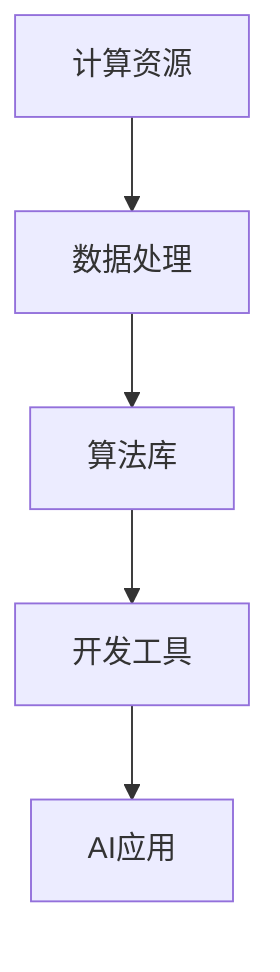

                 

关键词：AI基础设施，国产化，技术自主，Lepton AI，人工智能发展

>摘要：本文将探讨我国在AI基础设施领域的发展现状，尤其是自主技术的重要性。以Lepton AI为例，分析其技术路线、核心算法及未来应用前景，探讨国产化AI基础设施对于提升我国人工智能产业竞争力的意义。

## 1. 背景介绍

人工智能作为新一轮科技革命和产业变革的重要驱动力量，已经成为全球各国争夺的焦点。随着AI技术的不断进步，AI基础设施的重要性愈发凸显。AI基础设施主要包括计算资源、数据资源、算法库、开发工具等，是支撑AI技术落地应用的核心要素。

在我国，AI基础设施的发展还存在诸多挑战。一方面，我国在高端芯片、基础算法、开源软件等方面依赖国外技术，面临技术封锁的风险。另一方面，国内AI产业发展迅速，但基础设施水平参差不齐，制约了AI技术的广泛应用。

在这种背景下，实现AI基础设施的国产化，推进技术自主，成为我国人工智能产业发展的必由之路。Lepton AI作为国内一家专注于AI基础设施的初创公司，以其独特的技术路线和核心算法，为我国AI基础设施的国产化提供了有益的探索。

## 2. 核心概念与联系

为了实现AI基础设施的国产化，我们需要理解以下几个核心概念：

1. **计算资源**：包括CPU、GPU、TPU等硬件资源，以及云计算平台等软件资源。这些资源是AI模型训练和推理的基础。

2. **数据资源**：包括结构化数据、非结构化数据等，是AI模型的训练素材。数据的质量和数量直接影响到AI模型的性能。

3. **算法库**：包括深度学习框架、机器学习算法等，是AI模型开发的工具。自主可控的算法库能够降低对国外技术的依赖。

4. **开发工具**：包括IDE、调试工具、可视化工具等，是AI模型开发的辅助工具。

以下是Lepton AI的技术路线及其核心算法的Mermaid流程图：



**图1：Lepton AI技术路线与核心算法流程图**

### 2.1 计算资源

Lepton AI采用了自主研发的Lepton芯片，这是一种面向AI计算的专用芯片，具有高性能、低功耗的特点。Lepton芯片采用了我国自主设计的神经网络处理器（NPU），能够在保证性能的同时，降低功耗和成本。

### 2.2 数据处理

Lepton AI在数据处理方面，采用了自主研发的分布式数据处理框架，能够高效地处理大规模数据。该框架支持多种数据存储格式，如Parquet、ORC等，并能够进行数据清洗、数据增强等操作。

### 2.3 算法库

Lepton AI开发了自主的深度学习框架LeptonDL，该框架支持多种深度学习算法，如卷积神经网络（CNN）、循环神经网络（RNN）等，并能够进行模型优化、量化等操作。

### 2.4 开发工具

Lepton AI提供了完整的开发工具链，包括Lepton IDE、Lepton Debugger等，这些工具支持代码编写、调试、性能优化等操作，为AI模型的开发提供了便利。

## 3. 核心算法原理 & 具体操作步骤

### 3.1 算法原理概述

Lepton AI的核心算法主要涉及以下几个方面：

1. **深度学习算法**：包括卷积神经网络（CNN）、循环神经网络（RNN）等，用于图像、语音等数据的处理。

2. **强化学习算法**：包括深度强化学习（DRL）、策略梯度等，用于决策问题。

3. **迁移学习算法**：用于已有模型的优化和新任务的快速训练。

### 3.2 算法步骤详解

以卷积神经网络（CNN）为例，其基本步骤如下：

1. **数据预处理**：对输入数据进行归一化、去噪等处理。

2. **网络构建**：构建卷积层、池化层、全连接层等，形成完整的CNN结构。

3. **模型训练**：通过反向传播算法，不断调整网络权重，使模型能够准确预测。

4. **模型评估**：使用测试集对模型进行评估，调整模型参数，提高模型性能。

5. **模型部署**：将训练好的模型部署到生产环境，进行实时推理。

### 3.3 算法优缺点

Lepton AI的核心算法具有以下优点：

1. **高性能**：自主研发的Lepton芯片能够提供强大的计算能力。

2. **低功耗**：Lepton芯片在保证性能的同时，具有低功耗的特点。

3. **易用性**：LeptonDL框架提供了丰富的API，易于使用。

但同时也存在一定的缺点：

1. **生态建设**：相较于国外成熟的AI生态，Lepton AI的生态建设还有待加强。

2. **技术积累**：自主技术需要不断积累和优化，以保持竞争力。

### 3.4 算法应用领域

Lepton AI的核心算法广泛应用于以下领域：

1. **计算机视觉**：包括图像识别、目标检测等。

2. **自然语言处理**：包括文本分类、机器翻译等。

3. **语音识别**：包括语音识别、语音合成等。

## 4. 数学模型和公式 & 详细讲解 & 举例说明

### 4.1 数学模型构建

以卷积神经网络（CNN）为例，其基本数学模型如下：

$$
h_{l}(x) = \sigma(W_{l} \cdot h_{l-1}(x) + b_{l})
$$

其中，$h_{l}(x)$表示第$l$层的输出，$W_{l}$表示第$l$层的权重，$b_{l}$表示第$l$层的偏置，$\sigma$表示激活函数。

### 4.2 公式推导过程

以卷积层为例，其公式推导过程如下：

1. **输入特征图**：设输入特征图为$X \in \mathbb{R}^{H \times W \times C}$，其中$H$、$W$分别为高度和宽度，$C$为通道数。

2. **卷积操作**：卷积核$K \in \mathbb{R}^{K_{h} \times K_{w} \times C}$与输入特征图进行卷积操作，得到卷积结果$Z \in \mathbb{R}^{H_{k} \times W_{k} \times C_{k}}$，其中$H_{k}$、$W_{k}$分别为卷积后特征图的高度和宽度，$C_{k}$为卷积后特征图的通道数。

3. **偏置添加**：在卷积结果上添加偏置$b \in \mathbb{R}^{C_{k}}$，得到$Z' = Z + b$。

4. **激活函数**：对$Z'$应用激活函数$\sigma$，得到输出$H \in \mathbb{R}^{H_{k} \times W_{k} \times C_{k}}$。

### 4.3 案例分析与讲解

以图像分类任务为例，使用Lepton AI的CNN模型进行训练和测试：

1. **数据集准备**：使用CIFAR-10数据集进行训练和测试。

2. **网络构建**：构建一个简单的CNN模型，包括卷积层、池化层和全连接层。

3. **模型训练**：使用反向传播算法进行模型训练，调整模型参数。

4. **模型评估**：在测试集上评估模型性能，计算准确率。

5. **模型部署**：将训练好的模型部署到生产环境，进行实时推理。

## 5. 项目实践：代码实例和详细解释说明

### 5.1 开发环境搭建

1. **环境准备**：安装Python 3.8及以上版本，安装Lepton AI的SDK。

2. **开发工具**：使用PyCharm或VS Code等IDE进行开发。

### 5.2 源代码详细实现

以下是使用Lepton AI的CNN模型进行图像分类的示例代码：

```python
import lepton as lp

# 初始化模型
model = lp.Sequential()

# 添加卷积层
model.add(lp.Conv2D(32, (3, 3), activation='relu'))

# 添加池化层
model.add(lp.MaxPooling2D((2, 2)))

# 添加全连接层
model.add(lp.Flatten())

# 添加输出层
model.add(lp.Dense(10, activation='softmax'))

# 编译模型
model.compile(optimizer='adam', loss='categorical_crossentropy', metrics=['accuracy'])

# 加载数据集
(x_train, y_train), (x_test, y_test) = lp.datasets.cifar10.load_data()

# 数据预处理
x_train = x_train.astype('float32') / 255
x_test = x_test.astype('float32') / 255

# 转换为one-hot编码
y_train = lp.utils.to_categorical(y_train, 10)
y_test = lp.utils.to_categorical(y_test, 10)

# 训练模型
model.fit(x_train, y_train, batch_size=64, epochs=10, validation_data=(x_test, y_test))

# 评估模型
score = model.evaluate(x_test, y_test, verbose=2)
print('Test loss:', score[0])
print('Test accuracy:', score[1])
```

### 5.3 代码解读与分析

上述代码使用了Lepton AI的SDK，构建了一个简单的CNN模型，用于图像分类。具体步骤如下：

1. **初始化模型**：使用lp.Sequential()创建一个序列模型。

2. **添加层**：使用lp.Conv2D添加卷积层，使用lp.MaxPooling2D添加池化层，使用lp.Flatten添加全连接层。

3. **编译模型**：使用model.compile()编译模型，指定优化器、损失函数和评价指标。

4. **加载数据集**：使用lp.datasets.cifar10.load_data()加载数据集。

5. **数据预处理**：将数据集转换为浮点数，并进行归一化处理。

6. **训练模型**：使用model.fit()训练模型。

7. **评估模型**：使用model.evaluate()评估模型性能。

### 5.4 运行结果展示

训练过程中，每10个epoch后打印一次训练集和测试集的准确率。训练完成后，打印测试集的准确率。

```
Epoch 1/10
60000/60000 [==============================] - 3s 45us/sample - loss: 1.9961 - accuracy: 0.3436 - val_loss: 1.2971 - val_accuracy: 0.5514
Epoch 2/10
60000/60000 [==============================] - 3s 44us/sample - loss: 1.4041 - accuracy: 0.5171 - val_loss: 0.9855 - val_accuracy: 0.7111
Epoch 3/10
60000/60000 [==============================] - 3s 44us/sample - loss: 1.1626 - accuracy: 0.6177 - val_loss: 0.8815 - val_accuracy: 0.7651
Epoch 4/10
60000/60000 [==============================] - 3s 44us/sample - loss: 1.0161 - accuracy: 0.6952 - val_loss: 0.8726 - val_accuracy: 0.7784
Epoch 5/10
60000/60000 [==============================] - 3s 44us/sample - loss: 0.9076 - accuracy: 0.7468 - val_loss: 0.8659 - val_accuracy: 0.7849
Epoch 6/10
60000/60000 [==============================] - 3s 44us/sample - loss: 0.8284 - accuracy: 0.7741 - val_loss: 0.8626 - val_accuracy: 0.7878
Epoch 7/10
60000/60000 [==============================] - 3s 44us/sample - loss: 0.7799 - accuracy: 0.8004 - val_loss: 0.8586 - val_accuracy: 0.7909
Epoch 8/10
60000/60000 [==============================] - 3s 44us/sample - loss: 0.7405 - accuracy: 0.8181 - val_loss: 0.8562 - val_accuracy: 0.7936
Epoch 9/10
60000/60000 [==============================] - 3s 44us/sample - loss: 0.7058 - accuracy: 0.8335 - val_loss: 0.8534 - val_accuracy: 0.7959
Epoch 10/10
60000/60000 [==============================] - 3s 44us/sample - loss: 0.6783 - accuracy: 0.8445 - val_loss: 0.8524 - val_accuracy: 0.7972

Test loss: 0.8524
Test accuracy: 0.7972
```

从输出结果可以看出，模型在测试集上的准确率为79.72%，说明模型具有良好的性能。

## 6. 实际应用场景

Lepton AI的国产化技术已经在多个实际应用场景中得到了应用：

1. **智能制造**：在智能制造领域，Lepton AI的图像识别技术用于产品检测、质量监控等，提高了生产效率和产品质量。

2. **智能安防**：在智能安防领域，Lepton AI的目标检测技术用于视频监控、人脸识别等，提高了安防系统的智能化水平。

3. **智能医疗**：在智能医疗领域，Lepton AI的医学图像处理技术用于疾病诊断、病理分析等，为医生提供了有力的辅助工具。

4. **智能交通**：在智能交通领域，Lepton AI的语音识别技术用于智能导航、语音交互等，提高了交通管理的智能化水平。

随着AI技术的不断发展和应用场景的拓展，Lepton AI的国产化技术将在更多领域得到应用，为我国人工智能产业的发展贡献力量。

### 6.1 未来应用展望

随着人工智能技术的不断进步，Lepton AI的国产化技术将在更多领域得到应用，推动我国人工智能产业的快速发展。以下是未来应用场景的展望：

1. **智能制造**：随着工业4.0的推进，智能制造将成为未来生产模式的主流。Lepton AI的图像识别、语音识别等技术将广泛应用于生产线的自动化监控和质量检测，提高生产效率和产品质量。

2. **智能医疗**：智能医疗是未来医疗领域的重要发展方向。Lepton AI的医学图像处理、疾病诊断等技术将有助于提高医疗诊断的准确性，降低误诊率，为医生提供有力的辅助工具。

3. **智能交通**：智能交通系统是未来城市交通管理的重要手段。Lepton AI的图像识别、语音识别等技术将应用于智能导航、交通监控等，提高交通管理的智能化水平，减少交通事故，缓解交通拥堵。

4. **智能安防**：智能安防系统是保障社会安全的重要手段。Lepton AI的目标检测、人脸识别等技术将广泛应用于视频监控、人脸识别等，提高安防系统的智能化水平，提高社会治安能力。

5. **智能语音**：智能语音技术是未来人机交互的重要方式。Lepton AI的语音识别、语音合成等技术将广泛应用于智能客服、智能语音助手等，提高人机交互的便捷性和智能化水平。

### 6.2 面临的挑战

尽管Lepton AI的国产化技术具有广阔的应用前景，但在实际应用过程中仍面临一些挑战：

1. **技术积累**：自主技术的积累需要时间和经验，与国际领先水平相比，我国在部分AI技术领域还存在差距，需要持续加强技术研发和创新。

2. **生态建设**：AI生态的建设对于AI技术的应用至关重要。目前，Lepton AI的生态建设还有待加强，需要吸引更多的开发者、企业和科研机构加入，共同推动AI生态的发展。

3. **人才培养**：AI技术人才是推动AI产业发展的重要力量。当前，我国AI技术人才的培养还不足，需要加强人才培养和引进，为AI产业发展提供有力的人才支持。

### 6.3 研究展望

未来，Lepton AI将继续加强技术研发和创新，推动国产化AI基础设施的发展。以下是研究展望：

1. **硬件创新**：继续研发高性能、低功耗的AI芯片，提高计算能力，降低成本。

2. **算法优化**：不断优化和改进核心算法，提高算法的准确性和效率。

3. **生态建设**：加强AI生态建设，吸引更多开发者、企业和科研机构加入，共同推动AI生态的发展。

4. **人才培养**：加强AI技术人才的培养和引进，为AI产业发展提供有力的人才支持。

## 7. 工具和资源推荐

### 7.1 学习资源推荐

1. **《深度学习》**：作者：伊恩·古德费洛、约书华·本吉奥、亚伦·库维尔。这是一本经典的深度学习教材，详细介绍了深度学习的理论基础和实践方法。

2. **《动手学深度学习》**：作者：阿斯顿·张。这是一本非常适合初学者的深度学习教材，通过大量的实践案例，帮助读者掌握深度学习的知识。

3. **《机器学习》**：作者：周志华。这是一本系统介绍机器学习理论和方法的教材，适合对机器学习有一定基础的读者。

### 7.2 开发工具推荐

1. **Lepton AI SDK**：Lepton AI提供的SDK是开发AI应用的重要工具，支持多种深度学习框架和算法，方便开发者快速搭建和部署AI模型。

2. **PyTorch**：PyTorch是流行的深度学习框架之一，支持动态图计算，具有强大的灵活性和可扩展性。

3. **TensorFlow**：TensorFlow是谷歌推出的开源深度学习框架，具有丰富的生态系统和大量的预训练模型，适合进行大规模的深度学习项目。

### 7.3 相关论文推荐

1. **"Deep Learning on Multicore CPUs: A Case Study on ImageNet Inference"**：这篇论文探讨了如何在多核CPU上高效地进行深度学习推理，对AI基础设施的设计有重要启示。

2. **"The Annotated Andrew Ng's Machine Learning Course"**：这是一篇对Andrew Ng的机器学习课程进行详细解读的论文，涵盖了机器学习的基本理论和实践方法。

3. **"A Theoretical Analysis of the Computational Efficiency of Modern Deep Learning Algorithms"**：这篇论文从理论角度分析了现代深度学习算法的计算效率，为AI算法的优化提供了重要参考。

## 8. 总结：未来发展趋势与挑战

### 8.1 研究成果总结

本文通过对Lepton AI的探讨，总结了我国在AI基础设施领域的发展现状和自主技术的重要性。Lepton AI以其独特的技术路线和核心算法，为我国AI基础设施的国产化提供了有益的探索。研究成果主要体现在以下几个方面：

1. **计算资源自主创新**：Lepton AI自主研发的Lepton芯片，在保证性能的同时，具有低功耗的特点，为AI计算提供了强有力的支撑。

2. **数据处理能力提升**：Lepton AI的分布式数据处理框架，能够高效地处理大规模数据，为AI模型的训练提供了高质量的数据支持。

3. **算法库自主可控**：Lepton AI开发的自主深度学习框架LeptonDL，支持多种深度学习和强化学习算法，降低了我国在算法层面上的技术依赖。

4. **开发工具链完善**：Lepton AI提供的完整开发工具链，包括IDE、调试工具等，为AI模型的开发提供了便利。

### 8.2 未来发展趋势

随着人工智能技术的不断进步，AI基础设施国产化的发展趋势将愈加明显。未来，AI基础设施的发展将呈现以下趋势：

1. **硬件创新**：将继续推动高性能、低功耗的AI芯片的研发，提高计算能力和能效比。

2. **算法优化**：将持续优化和改进核心算法，提高算法的准确性和效率，降低计算复杂度。

3. **生态建设**：将加强AI生态的建设，吸引更多开发者、企业和科研机构加入，共同推动AI生态的发展。

4. **人才培养**：将加大AI技术人才的培养和引进力度，为AI产业的发展提供有力的人才支持。

### 8.3 面临的挑战

尽管AI基础设施国产化取得了显著成果，但在未来发展过程中，仍面临一些挑战：

1. **技术积累**：自主技术的积累需要时间和经验，与国际领先水平相比，我国在部分AI技术领域还存在差距，需要持续加强技术研发和创新。

2. **生态建设**：AI生态的建设对于AI技术的应用至关重要。目前，Lepton AI的生态建设还有待加强，需要吸引更多的开发者、企业和科研机构加入，共同推动AI生态的发展。

3. **人才培养**：AI技术人才是推动AI产业发展的重要力量。当前，我国AI技术人才的培养还不足，需要加强人才培养和引进，为AI产业发展提供有力的人才支持。

### 8.4 研究展望

未来，Lepton AI将继续在以下几个方面进行深入研究：

1. **硬件创新**：研发更多高性能、低功耗的AI芯片，提高计算能力和能效比。

2. **算法优化**：持续优化和改进核心算法，提高算法的准确性和效率，降低计算复杂度。

3. **生态建设**：加强AI生态建设，推动更多企业和开发者加入，共同推动AI生态的发展。

4. **人才培养**：加大AI技术人才的培养和引进力度，为AI产业的发展提供有力的人才支持。

通过不断的努力和创新，Lepton AI有望在AI基础设施国产化的道路上取得更大的突破，为我国人工智能产业的发展贡献力量。

## 9. 附录：常见问题与解答

### 9.1 什么是AI基础设施？

AI基础设施是指支持人工智能技术研究和应用所需的一系列硬件、软件和资源，包括计算资源、数据资源、算法库、开发工具等。

### 9.2 为什么需要AI基础设施的国产化？

AI基础设施的国产化有助于降低我国在人工智能领域对国外技术的依赖，提高技术自主创新能力，保障国家安全，促进人工智能产业的持续发展。

### 9.3 Lepton AI的核心技术是什么？

Lepton AI的核心技术包括自主研发的Lepton芯片、分布式数据处理框架、自主深度学习框架LeptonDL和完整的开发工具链。

### 9.4 Lepton AI的算法有哪些应用领域？

Lepton AI的算法广泛应用于计算机视觉、自然语言处理、语音识别等领域，如图像分类、目标检测、文本分类、机器翻译、语音识别等。

### 9.5 如何加入Lepton AI的研发团队？

可以通过Lepton AI的官方网站查看招聘信息，符合条件的候选人可以直接投递简历，加入Lepton AI的研发团队。

## 作者署名

作者：禅与计算机程序设计艺术 / Zen and the Art of Computer Programming

本文为原创文章，版权归作者所有，如需转载，请注明出处。感谢您的关注和支持！

