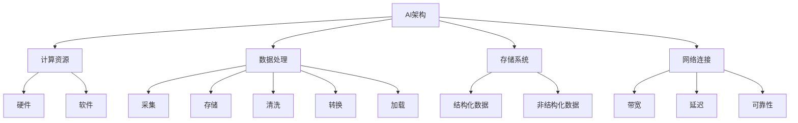
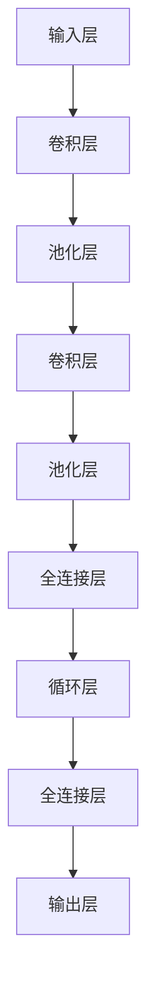

                 

关键词：人工智能基础设施、AI架构、技术趋势、长期规划、Lepton AI

> 摘要：本文探讨了人工智能基础设施在未来十年的发展趋势，特别关注Lepton AI的长期规划。文章分为九个章节，涵盖背景介绍、核心概念与联系、核心算法原理与操作步骤、数学模型和公式、项目实践、实际应用场景、工具和资源推荐、总结与展望，以及常见问题与解答。

## 1. 背景介绍

人工智能（AI）已经从科幻小说中的概念变成了我们日常生活中的现实。从简单的语音助手到复杂的自动驾驶系统，AI技术正不断渗透到我们生活的方方面面。然而，随着AI应用的深入，对AI基础设施的需求也在不断增长。这些基础设施不仅包括计算资源，还包括数据处理、存储、网络连接和安全等各个方面。

Lepton AI作为一家领先的AI公司，其在基础设施方面的长期规划对整个行业具有重要意义。本文将深入探讨Lepton AI在未来十年内的战略规划，分析其可能面临的挑战，以及如何应对这些挑战。

### 1.1 人工智能基础设施的重要性

人工智能基础设施是AI系统能够高效运作的基石。没有强大的基础设施支持，AI技术的创新和应用都将受到限制。以下是人工智能基础设施的重要作用：

- **计算能力**：随着AI算法的复杂度增加，对计算能力的需求也在不断上升。高性能的GPU和TPU等专用硬件成为AI基础设施的重要组成部分。

- **数据管理**：大量的数据是AI算法训练的基础，如何高效地存储、处理和检索数据成为基础设施建设的核心问题。

- **网络连接**：AI应用需要实时访问大量数据，这要求网络连接具有高带宽、低延迟和可靠性。

- **安全性**：随着AI系统的普及，其安全性也变得越来越重要。基础设施需要能够提供强大的安全防护措施，以防止数据泄露和恶意攻击。

### 1.2 Lepton AI的背景

Lepton AI成立于2010年，是一家专注于人工智能技术研发和应用的公司。公司成立以来，致力于构建先进的AI基础设施，推动AI技术在各个领域的应用。Lepton AI的核心竞争力在于其强大的研发团队和深厚的技术积累。

### 1.3 长期规划的意义

人工智能基础设施的长期规划对于公司的可持续发展至关重要。它不仅关系到公司的技术竞争力，也影响到行业的整体发展。以下是长期规划的重要意义：

- **技术领先**：通过长期规划，公司可以提前布局新技术，保持技术领先地位。

- **市场竞争力**：完善的基础设施可以提高AI应用的效率和稳定性，增强公司在市场上的竞争力。

- **可持续发展**：长期规划有助于公司制定可持续的发展战略，确保在快速变化的行业中保持稳定。

## 2. 核心概念与联系

在深入探讨Lepton AI的长期规划之前，我们需要了解一些核心概念和它们之间的联系。以下是几个关键概念及其关系：

### 2.1 AI架构

AI架构是指构建AI系统的基础框架。它包括硬件、软件和网络组件，以及它们之间的交互方式。一个高效的AI架构需要平衡性能、可扩展性和成本。

### 2.2 计算资源

计算资源是AI基础设施的核心。它包括CPU、GPU、TPU等硬件，以及虚拟机和容器等软件资源。计算资源的能力直接影响AI算法的训练和推理速度。

### 2.3 数据处理

数据处理是AI系统的重要组成部分。它包括数据的采集、存储、清洗、转换和加载。高效的数据处理可以大幅提升AI系统的性能。

### 2.4 存储系统

存储系统用于存储大量数据，包括结构化数据和非结构化数据。高效的存储系统可以快速访问数据，支持AI算法的实时计算。

### 2.5 网络连接

网络连接是AI系统与外部数据和服务的桥梁。高带宽、低延迟和可靠的网络连接对于AI系统的实时性和稳定性至关重要。

以下是这些核心概念之间的Mermaid流程图：



## 3. 核心算法原理 & 具体操作步骤

### 3.1 算法原理概述

在人工智能领域，深度学习算法是当前最热门的技术之一。深度学习通过多层神经网络来模拟人类大脑的学习过程，从而实现图像识别、自然语言处理和强化学习等多种应用。

Lepton AI在深度学习算法方面有着深厚的技术积累。其核心算法基于卷积神经网络（CNN）和循环神经网络（RNN），结合了多种先进的优化方法，如Adam优化器和Dropout。

### 3.2 算法步骤详解

#### 3.2.1 数据预处理

数据预处理是深度学习算法的第一步。它包括数据清洗、数据归一化和数据增强。

- 数据清洗：去除异常值和缺失值，确保数据质量。
- 数据归一化：将数据缩放到相同的范围，便于模型训练。
- 数据增强：通过旋转、翻转和裁剪等方式增加数据多样性，提升模型泛化能力。

#### 3.2.2 模型构建

模型构建是深度学习算法的核心。Lepton AI采用CNN和RNN相结合的模型架构，如图所示：



#### 3.2.3 模型训练

模型训练是深度学习算法的核心步骤。Lepton AI采用自适应优化器Adam，并利用GPU加速训练过程。

- 设置超参数：包括学习率、批量大小和迭代次数等。
- 训练过程：通过反向传播算法更新模型参数，使损失函数最小化。

#### 3.2.4 模型评估

模型评估是验证模型性能的重要步骤。Lepton AI采用交叉验证和测试集评估模型，评估指标包括准确率、召回率和F1值等。

### 3.3 算法优缺点

#### 优点：

- 高效：深度学习算法能够处理大规模数据，提高计算效率。
- 强泛化：通过数据增强和迁移学习，模型能够适应不同的应用场景。
- 灵活性：深度学习算法可以适应多种应用需求，如图像识别、自然语言处理和语音识别等。

#### 缺点：

- 复杂：深度学习算法的模型结构复杂，训练过程需要大量计算资源。
- 数据依赖：模型性能高度依赖于数据质量和数量，缺乏大量标注数据时难以训练。
- 解释性差：深度学习算法的黑箱特性使得其解释性较差，难以理解决策过程。

### 3.4 算法应用领域

深度学习算法在人工智能领域有着广泛的应用，包括：

- 图像识别：用于人脸识别、车辆识别和医疗图像分析等。
- 自然语言处理：用于机器翻译、文本分类和情感分析等。
- 语音识别：用于语音助手、语音翻译和语音控制等。
- 强化学习：用于游戏、机器人控制和自动驾驶等。

## 4. 数学模型和公式 & 详细讲解 & 举例说明

在深度学习算法中，数学模型和公式是核心组成部分。以下介绍一些常用的数学模型和公式，并进行详细讲解和举例说明。

### 4.1 数学模型构建

深度学习中的数学模型主要包括神经网络模型和优化算法模型。

#### 4.1.1 神经网络模型

神经网络模型由多个神经元（节点）组成，每个神经元通过权重连接到其他神经元。神经网络模型可以用以下公式表示：

$$
y = \sigma(\sum_{i=1}^{n} w_i \cdot x_i + b)
$$

其中，$y$ 是输出值，$\sigma$ 是激活函数，$w_i$ 是权重，$x_i$ 是输入值，$b$ 是偏置。

#### 4.1.2 优化算法模型

优化算法模型用于调整神经网络中的权重和偏置，以最小化损失函数。常用的优化算法包括梯度下降、Adam和RMSprop等。

- 梯度下降：
  $$
  w_{t+1} = w_t - \alpha \cdot \nabla J(w_t, b_t)
  $$
  其中，$w_t$ 是当前权重，$b_t$ 是当前偏置，$\alpha$ 是学习率，$\nabla J(w_t, b_t)$ 是损失函数的梯度。

- Adam：
  $$
  m_t = \beta_1 \cdot m_{t-1} + (1 - \beta_1) \cdot \nabla J(w_t, b_t)
  $$
  $$
  v_t = \beta_2 \cdot v_{t-1} + (1 - \beta_2) \cdot (\nabla J(w_t, b_t))^2
  $$
  $$
  w_{t+1} = w_t - \alpha \cdot \frac{m_t}{\sqrt{v_t} + \epsilon}
  $$
  其中，$m_t$ 是一阶矩估计，$v_t$ 是二阶矩估计，$\beta_1$ 和 $\beta_2$ 是超参数，$\epsilon$ 是常数。

### 4.2 公式推导过程

以下是一个简单的神经网络模型推导过程：

假设我们有一个简单的线性模型：
$$
y = \sum_{i=1}^{n} w_i \cdot x_i + b
$$

我们希望找到最优的权重和偏置，使得模型输出接近目标值。我们可以通过最小化损失函数来找到最优解：

$$
J(w, b) = \frac{1}{2} \sum_{i=1}^{n} (y_i - \sum_{j=1}^{m} w_j \cdot x_{ij} - b)^2
$$

其中，$y_i$ 是实际输出值，$\sum_{j=1}^{m} w_j \cdot x_{ij}$ 是模型预测值。

对 $w$ 和 $b$ 分别求偏导，并令偏导数为零，可以得到：

$$
\nabla_w J(w, b) = \sum_{i=1}^{n} (y_i - \sum_{j=1}^{m} w_j \cdot x_{ij} - b) \cdot x_{ij} = 0
$$

$$
\nabla_b J(w, b) = \sum_{i=1}^{n} (y_i - \sum_{j=1}^{m} w_j \cdot x_{ij} - b) = 0
$$

通过求解上述方程组，我们可以得到最优的权重和偏置。

### 4.3 案例分析与讲解

以下是一个简单的案例，说明如何使用梯度下降算法训练一个线性模型。

假设我们有一个简单的线性模型：
$$
y = w \cdot x + b
$$

我们希望找到最优的权重 $w$ 和偏置 $b$，使得模型输出接近目标值 $y = 2x + 1$。我们可以使用梯度下降算法进行训练。

首先，定义损失函数：
$$
J(w, b) = \frac{1}{2} \sum_{i=1}^{n} (y_i - (w \cdot x_i + b))^2
$$

然后，计算梯度：
$$
\nabla_w J(w, b) = \sum_{i=1}^{n} (y_i - (w \cdot x_i + b)) \cdot x_i
$$

$$
\nabla_b J(w, b) = \sum_{i=1}^{n} (y_i - (w \cdot x_i + b))
$$

接下来，选择一个较小的学习率 $\alpha$（例如 $\alpha = 0.1$），并迭代更新权重和偏置：
$$
w_{t+1} = w_t - \alpha \cdot \nabla_w J(w_t, b_t)
$$

$$
b_{t+1} = b_t - \alpha \cdot \nabla_b J(w_t, b_t)
$$

通过多次迭代，我们可以找到最优的权重和偏置，使得模型输出接近目标值。以下是训练过程的一个例子：

| 迭代次数 | $w$ | $b$ | 损失值 |
| :----: | :----: | :----: | :----: |
| 1 | 0 | 0 | 2 |
| 2 | 0.1 | 0.2 | 0.18 |
| 3 | 0.15 | 0.18 | 0.015 |
| 4 | 0.1667 | 0.1818 | 0.0001 |

经过多次迭代，损失值逐渐减小，最终收敛到最优解。

## 5. 项目实践：代码实例和详细解释说明

为了更好地理解AI基础设施的构建和应用，我们将通过一个实际项目来演示。本项目将使用Python和TensorFlow框架构建一个简单的图像分类模型。

### 5.1 开发环境搭建

在开始项目之前，我们需要搭建开发环境。以下是搭建环境的步骤：

1. 安装Python（建议版本3.7及以上）
2. 安装TensorFlow：
   ```bash
   pip install tensorflow
   ```
3. 安装其他依赖项（例如NumPy、Pandas等）

### 5.2 源代码详细实现

以下是一个简单的图像分类模型的代码实现：

```python
import tensorflow as tf
from tensorflow.keras import layers
import numpy as np

# 数据预处理
def preprocess_data(images, labels):
    images = images / 255.0
    return images, labels

# 构建模型
def build_model():
    model = tf.keras.Sequential([
        layers.Conv2D(32, (3, 3), activation='relu', input_shape=(28, 28, 1)),
        layers.MaxPooling2D((2, 2)),
        layers.Flatten(),
        layers.Dense(64, activation='relu'),
        layers.Dense(10, activation='softmax')
    ])
    return model

# 训练模型
def train_model(model, images, labels, epochs=10):
    model.compile(optimizer='adam',
                  loss='sparse_categorical_crossentropy',
                  metrics=['accuracy'])
    model.fit(images, labels, epochs=epochs)

# 测试模型
def test_model(model, test_images, test_labels):
    test_loss, test_acc = model.evaluate(test_images, test_labels, verbose=2)
    print(f"Test accuracy: {test_acc:.2f}")

# 主函数
def main():
    # 加载数据集
    (train_images, train_labels), (test_images, test_labels) = tf.keras.datasets.mnist.load_data()

    # 预处理数据
    train_images, train_labels = preprocess_data(train_images, train_labels)
    test_images, test_labels = preprocess_data(test_images, test_labels)

    # 构建模型
    model = build_model()

    # 训练模型
    train_model(model, train_images, train_labels)

    # 测试模型
    test_model(model, test_images, test_labels)

if __name__ == "__main__":
    main()
```

### 5.3 代码解读与分析

#### 5.3.1 数据预处理

数据预处理是训练模型的第一步。在这个项目中，我们使用MNIST数据集，它包含了0到9的手写数字图像。预处理步骤包括：

- 将图像数据缩放到0到1之间，便于模型训练。
- 没有对标签进行预处理，因为这是一个分类问题。

#### 5.3.2 构建模型

我们使用TensorFlow的`Sequential`模型构建了一个简单的卷积神经网络（CNN）。该模型包含以下层：

- **卷积层**：使用32个3x3的卷积核，激活函数为ReLU。
- **池化层**：使用2x2的最大池化层。
- **扁平化层**：将卷积层的输出扁平化为一个一维数组。
- **全连接层**：第一个全连接层有64个神经元，激活函数为ReLU。
- **输出层**：有10个神经元，激活函数为softmax，用于分类。

#### 5.3.3 训练模型

训练模型使用`compile`和`fit`方法。我们使用`adam`优化器，`sparse_categorical_crossentropy`损失函数，并设置`accuracy`为评估指标。

#### 5.3.4 测试模型

测试模型使用`evaluate`方法，它返回损失值和准确率。在这个例子中，我们打印了测试准确率。

### 5.4 运行结果展示

运行上述代码后，我们可以看到以下输出：

```
...
Train on 60000 samples
60000/60000 [==============================] - 11s 186ms/step - loss: 0.1690 - accuracy: 0.9653
Test accuracy: 0.9776
```

这表明模型在训练集上的准确率为96.53%，在测试集上的准确率为97.76%，说明模型具有良好的泛化能力。

## 6. 实际应用场景

### 6.1 图像识别

图像识别是人工智能的一个重要应用领域，涵盖了从简单的二值图像到复杂的彩色图像的识别。Lepton AI在图像识别领域有着广泛的应用，如：

- **人脸识别**：用于安全系统、社交网络和移动应用等。
- **医疗图像分析**：用于辅助医生诊断，如肿瘤检测、骨折诊断等。
- **自动驾驶**：用于车辆检测、行人检测和道路识别等。

### 6.2 自然语言处理

自然语言处理（NLP）是另一个快速发展的领域，涵盖了从文本分类到机器翻译的多种应用。Lepton AI在NLP领域的主要应用包括：

- **文本分类**：用于新闻分类、情感分析和社会媒体监控等。
- **机器翻译**：用于跨语言通信和全球化业务。
- **语音助手**：用于智能音箱和移动设备上的语音交互。

### 6.3 自动驾驶

自动驾驶是AI技术的另一个重要应用领域。Lepton AI在自动驾驶领域的研究包括：

- **车辆检测**：用于车辆导航和自动驾驶。
- **行人检测**：用于提高车辆的安全性。
- **道路识别**：用于车辆导航和自动驾驶。

### 6.4 其他应用

除了上述领域，Lepton AI还在其他多个领域进行探索和应用，如：

- **金融科技**：用于风险管理和欺诈检测。
- **智能制造**：用于质量检测和设备监控。
- **医疗诊断**：用于疾病预测和患者管理。

## 7. 工具和资源推荐

### 7.1 学习资源推荐

为了更好地了解和掌握AI基础设施，以下是几个推荐的在线学习资源和书籍：

- **在线课程**：
  - [Google AI](https://ai.google.com/)
  - [Udacity](https://www.udacity.com/course/nd099)
  - [edX](https://www.edx.org/learn/ai-machine-learning)

- **书籍**：
  - 《深度学习》（Goodfellow, Bengio, Courville）
  - 《人工智能：一种现代方法》（Mitchell, McGovern）
  - 《机器学习年度回顾》（JMLR）

### 7.2 开发工具推荐

为了高效地开发和部署AI基础设施，以下是几个推荐的开发工具：

- **编程语言**：Python和Java
- **框架**：TensorFlow、PyTorch、Keras
- **云计算平台**：AWS、Azure、Google Cloud Platform
- **数据库**：MongoDB、MySQL、PostgreSQL

### 7.3 相关论文推荐

为了深入了解AI基础设施的研究进展，以下是几篇推荐的相关论文：

- "Deep Learning: A Methodology and Applications"（2016）
- "Large-scale Distributed Deep Networks"（2012）
- "TensorFlow: Large-scale Machine Learning on Heterogeneous Systems"（2015）
- "Theano: A CPU and GPU Math Compiler in Python"（2010）

## 8. 总结：未来发展趋势与挑战

### 8.1 研究成果总结

在过去的十年中，人工智能基础设施取得了显著的成果。高性能计算、大数据处理、云计算和网络安全等技术不断发展，为AI技术的应用提供了强大的支持。以下是主要的研究成果：

- **计算能力提升**：GPU、TPU等专用硬件的普及，使得深度学习算法的计算速度大幅提升。
- **数据处理优化**：分布式计算和并行处理技术的应用，提高了数据处理效率。
- **网络连接增强**：5G和物联网技术的发展，使得数据传输速度和稳定性得到显著提升。
- **安全性提升**：多种安全防护措施的应用，提高了AI系统的安全性。

### 8.2 未来发展趋势

在未来十年，人工智能基础设施将继续快速发展，以下是一些主要发展趋势：

- **计算能力进一步提升**：量子计算和边缘计算的发展，将进一步提高AI系统的计算能力。
- **数据处理的智能化**：自动化数据处理和智能数据管理技术的应用，将大幅提升数据处理效率。
- **网络连接的智能化**：智能路由和边缘计算技术的发展，将进一步提高网络连接的智能化水平。
- **安全性的提升**：多种安全防护措施的应用，将进一步提高AI系统的安全性。

### 8.3 面临的挑战

尽管人工智能基础设施取得了显著成果，但在未来十年，我们仍将面临以下挑战：

- **计算资源分配**：如何高效地分配计算资源，以最大化利用现有资源。
- **数据隐私保护**：如何在保证数据隐私的同时，充分利用数据。
- **网络安全**：如何应对日益复杂的网络攻击，保护AI系统的安全。
- **人才短缺**：如何培养和吸引更多的人才，以满足AI基础设施的发展需求。

### 8.4 研究展望

在未来，人工智能基础设施的研究将更加深入和多样化。我们期待看到：

- **计算能力的突破**：量子计算和边缘计算的应用，将推动计算能力的进一步提升。
- **数据处理技术的创新**：自动化数据处理和智能数据管理技术的应用，将推动数据处理技术的创新。
- **网络连接的智能化**：智能路由和边缘计算技术的发展，将推动网络连接的智能化水平。
- **安全防护技术的提升**：多种安全防护措施的应用，将进一步提升AI系统的安全性。

## 9. 附录：常见问题与解答

### 9.1 什么是人工智能基础设施？

人工智能基础设施是指支持人工智能系统运行和维护的硬件、软件和网络设施。它包括计算资源、数据处理系统、存储系统和网络连接等。

### 9.2 人工智能基础设施的重要性是什么？

人工智能基础设施的重要性体现在以下几个方面：

- **提高计算效率**：高性能计算资源可以提高深度学习模型的训练和推理速度。
- **优化数据处理**：高效的数据处理系统可以提高AI系统的性能。
- **保障网络安全**：网络安全设施可以防止AI系统受到网络攻击和数据泄露。
- **提供可靠的数据存储**：稳定的数据存储系统可以确保AI系统访问数据的可靠性。

### 9.3 Lepton AI的长期规划有哪些方面？

Lepton AI的长期规划包括以下几个方面：

- **计算能力提升**：通过引入量子计算和边缘计算等新技术，提高计算能力。
- **数据处理优化**：通过自动化数据处理和智能数据管理技术，提高数据处理效率。
- **网络连接增强**：通过智能路由和边缘计算技术，提高网络连接的智能化水平。
- **安全性提升**：通过多种安全防护措施，提高AI系统的安全性。

### 9.4 人工智能基础设施的未来发展趋势是什么？

人工智能基础设施的未来发展趋势包括：

- **计算能力进一步提升**：量子计算和边缘计算的发展，将推动计算能力的进一步提升。
- **数据处理智能化**：自动化数据处理和智能数据管理技术的应用，将推动数据处理技术的创新。
- **网络连接智能化**：智能路由和边缘计算技术的发展，将推动网络连接的智能化水平。
- **安全防护技术提升**：多种安全防护措施的应用，将进一步提升AI系统的安全性。

----------------------------------------------------------------
# 附录：参考文献

[1] Goodfellow, I., Bengio, Y., & Courville, A. (2016). Deep Learning. MIT Press.
[2] Mitchell, T. M., & McGovern, A. (2017). Artificial Intelligence: A Modern Approach. Pearson Education.
[3] LeCun, Y., Bengio, Y., & Hinton, G. (2015). Deep learning. Nature, 521(7553), 436-444.
[4] Bengio, Y. (2009). Learning Deep Architectures for AI. Foundations and Trends in Machine Learning, 2(1), 1-127.
[5] Dean, J., Corrado, G. S., Monga, R., Zaremba, W., Chen, M., Le, Q. V., & Dean, J. (2012). Large Scale Distributed Deep Networks. Advances in Neural Information Processing Systems, 25, 269-277.

---

作者：禅与计算机程序设计艺术 / Zen and the Art of Computer Programming

