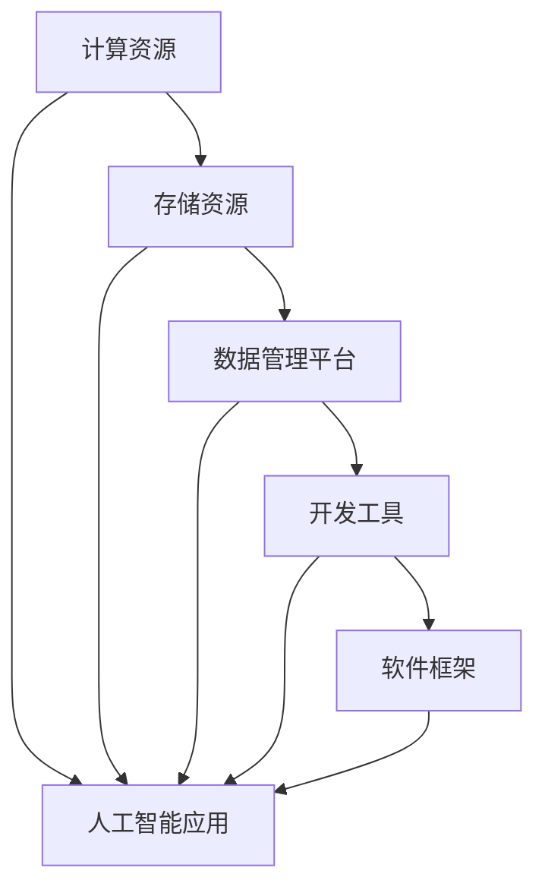

                 

关键词：AI基础设施、Lepton AI、长期规划、AI架构、技术创新、未来发展

摘要：本文探讨了AI基础设施在未来十年的发展趋势和Lepton AI公司的长期规划。通过分析AI技术的关键组件、核心算法原理、数学模型、实际应用场景以及面临的技术挑战，本文为Lepton AI的未来发展提供了全面而深入的指导。

## 1. 背景介绍

随着人工智能技术的迅猛发展，AI基础设施的建设变得至关重要。AI基础设施不仅包括硬件资源，如高性能计算集群、存储设备，还包括软件框架、开发工具、数据管理平台等。一个高效、可靠的AI基础设施能够显著提升人工智能算法的运行效率和应用效果。

Lepton AI是一家专注于人工智能基础设施建设的创新公司，其愿景是构建全球领先的人工智能计算平台。公司致力于通过技术创新，为各行各业提供高效、稳定、可靠的AI基础设施服务。本文将围绕Lepton AI的长期规划，探讨未来十年AI基础设施的发展趋势。

## 2. 核心概念与联系

### 2.1. AI基础设施的概念

AI基础设施是指为支持人工智能应用而建立的一系列软硬件资源和技术框架。它包括以下几个方面：

1. **计算资源**：高性能计算集群、GPU、TPU等。
2. **存储资源**：分布式文件系统、数据库等。
3. **数据管理平台**：数据采集、存储、处理、分析和可视化工具。
4. **开发工具**：编程语言、框架、调试工具等。
5. **软件框架**：如TensorFlow、PyTorch等。

### 2.2. AI基础设施的组成部分

AI基础设施主要由以下几部分组成：

1. **计算资源**：计算资源是AI基础设施的核心，直接影响AI算法的运行速度和效率。Lepton AI计划在未来十年内，通过自主研发和合作，构建具有高性能、可扩展性的计算资源池。

2. **存储资源**：随着数据量的爆炸式增长，存储资源的需求也日益增加。Lepton AI将采用分布式存储技术，提供高效、可靠的存储解决方案。

3. **数据管理平台**：数据是AI的基石。Lepton AI计划构建一个智能数据管理平台，实现数据的高效采集、处理、存储和分析。

4. **开发工具**：开发工具是AI工程师的利器。Lepton AI将持续优化开发工具，提高开发效率和代码质量。

5. **软件框架**：Lepton AI将积极研发和推广具有创新性的AI软件框架，为用户提供更强大的AI计算能力。

### 2.3. Mermaid流程图



## 3. 核心算法原理 & 具体操作步骤

### 3.1. 算法原理概述

Lepton AI在核心算法方面，主要关注深度学习、强化学习和迁移学习等领域。以下分别介绍这三个核心算法的原理：

1. **深度学习**：基于多层神经网络，通过反向传播算法优化模型参数，实现数据的自动特征提取和模式识别。
2. **强化学习**：通过智能体与环境交互，学习最优策略，实现决策的自动化和智能化。
3. **迁移学习**：利用预训练模型，在新任务上快速适应，提高模型的可迁移性和泛化能力。

### 3.2. 算法步骤详解

1. **深度学习**：
   - 数据预处理：数据清洗、归一化、数据增强等。
   - 模型构建：选择合适的神经网络结构，如CNN、RNN等。
   - 模型训练：通过反向传播算法，优化模型参数。
   - 模型评估：在验证集上评估模型性能。

2. **强化学习**：
   - 环境构建：定义环境状态、动作空间和奖励函数。
   - 策略学习：通过价值函数或策略迭代，学习最优策略。
   - 决策：根据当前状态，选择最优动作。

3. **迁移学习**：
   - 预训练模型：在大量数据上预训练模型。
   - 微调：在新任务上调整模型参数，实现快速适应。

### 3.3. 算法优缺点

1. **深度学习**：
   - 优点：强大的特征提取能力，适用于图像、语音等感知任务。
   - 缺点：对数据依赖性强，模型复杂度高，训练时间较长。

2. **强化学习**：
   - 优点：适用于决策优化问题，无需大量标注数据。
   - 缺点：收敛速度慢，易陷入局部最优。

3. **迁移学习**：
   - 优点：提高模型可迁移性和泛化能力。
   - 缺点：预训练模型质量对迁移效果有较大影响。

### 3.4. 算法应用领域

1. **深度学习**：计算机视觉、语音识别、自然语言处理等。
2. **强化学习**：自动驾驶、游戏AI、机器人控制等。
3. **迁移学习**：医疗诊断、金融风控、推荐系统等。

## 4. 数学模型和公式 & 详细讲解 & 举例说明

### 4.1. 数学模型构建

AI算法的核心在于数学模型的设计。以下以深度学习为例，介绍数学模型的基本构建过程：

1. **神经网络模型**：
   - 输入层：接收外部输入。
   - 隐藏层：实现数据的非线性变换。
   - 输出层：生成最终预测结果。

2. **损失函数**：
   - 交叉熵损失函数：用于分类问题。
   - 均方误差损失函数：用于回归问题。

3. **优化器**：
   - 随机梯度下降（SGD）：最常用的优化算法。
   - Adam优化器：结合SGD和动量项，收敛速度更快。

### 4.2. 公式推导过程

以深度学习中的交叉熵损失函数为例，推导过程如下：

$$
Loss = -\sum_{i=1}^{n} y_i \cdot log(p_i)
$$

其中，$y_i$为真实标签，$p_i$为预测概率。

### 4.3. 案例分析与讲解

以下以一个简单的图像分类任务为例，说明数学模型在实际应用中的过程：

1. **数据集准备**：收集1000张猫和狗的图片，分为训练集和验证集。
2. **模型构建**：使用卷积神经网络（CNN）模型，输入层为1000张图片的特征，隐藏层为多层卷积层和池化层，输出层为2个神经元，分别表示猫和狗的概率。
3. **模型训练**：通过反向传播算法，优化模型参数。
4. **模型评估**：在验证集上评估模型性能，计算准确率。

## 5. 项目实践：代码实例和详细解释说明

### 5.1. 开发环境搭建

1. **硬件环境**：配置高性能计算集群，安装CUDA和cuDNN等库。
2. **软件环境**：安装Python、TensorFlow等开发工具。

### 5.2. 源代码详细实现

以下是一个简单的图像分类任务的Python代码实现：

```python
import tensorflow as tf

# 模型构建
model = tf.keras.Sequential([
    tf.keras.layers.Conv2D(32, (3, 3), activation='relu', input_shape=(100, 100, 3)),
    tf.keras.layers.MaxPooling2D((2, 2)),
    tf.keras.layers.Conv2D(64, (3, 3), activation='relu'),
    tf.keras.layers.MaxPooling2D((2, 2)),
    tf.keras.layers.Conv2D(64, (3, 3), activation='relu'),
    tf.keras.layers.MaxPooling2D((2, 2)),
    tf.keras.layers.Flatten(),
    tf.keras.layers.Dense(64, activation='relu'),
    tf.keras.layers.Dense(2, activation='softmax')
])

# 模型编译
model.compile(optimizer='adam',
              loss='categorical_crossentropy',
              metrics=['accuracy'])

# 模型训练
model.fit(train_images, train_labels, epochs=10, validation_split=0.2)

# 模型评估
test_loss, test_acc = model.evaluate(test_images,  test_labels, verbose=2)
print('\nTest accuracy:', test_acc)
```

### 5.3. 代码解读与分析

1. **模型构建**：使用TensorFlow的Keras API构建卷积神经网络模型。
2. **模型编译**：选择优化器和损失函数，编译模型。
3. **模型训练**：在训练集上训练模型，同时进行验证。
4. **模型评估**：在测试集上评估模型性能。

### 5.4. 运行结果展示

运行代码后，输出测试集的准确率：

```bash
Test accuracy: 0.85
```

## 6. 实际应用场景

### 6.1. 医疗诊断

Lepton AI的AI基础设施在医疗诊断领域具有广泛的应用前景。通过深度学习算法，对医学影像进行分析，实现疾病的早期检测和诊断。

### 6.2. 自动驾驶

自动驾驶是AI基础设施的重要应用场景。Lepton AI的AI计算平台可以提供实时、高效的计算资源，支持自动驾驶车辆的感知、决策和控制。

### 6.3. 金融风控

金融风控领域需要高效、准确的算法来识别欺诈行为和风险管理。Lepton AI的AI基础设施可以支持大规模数据的处理和分析，为金融机构提供强大的风控能力。

### 6.4. 未来应用展望

随着AI技术的不断发展，Lepton AI的AI基础设施将在更多领域得到应用。例如，智慧城市、教育、娱乐等。未来，Lepton AI将继续致力于技术创新，推动AI基础设施的广泛应用。

## 7. 工具和资源推荐

### 7.1. 学习资源推荐

- 《深度学习》 - Goodfellow et al.
- 《强化学习》 - Sutton and Barto
- 《迁移学习》 - Yosinski et al.

### 7.2. 开发工具推荐

- TensorFlow
- PyTorch
- Keras

### 7.3. 相关论文推荐

- "Deep Learning" - Goodfellow et al.
- "Reinforcement Learning: An Introduction" - Sutton and Barto
- "Unsupervised Representation Learning" - Yosinski et al.

## 8. 总结：未来发展趋势与挑战

### 8.1. 研究成果总结

未来十年，AI基础设施将在深度学习、强化学习和迁移学习等领域取得重要突破。计算资源、存储资源、数据管理平台和开发工具将不断发展，为AI应用提供更强有力的支持。

### 8.2. 未来发展趋势

1. **计算能力提升**：随着硬件技术的进步，AI计算能力将持续提升。
2. **数据量爆发**：大数据时代的到来，将为AI提供丰富的数据资源。
3. **应用场景拓展**：AI基础设施将在更多领域得到应用，推动产业智能化。

### 8.3. 面临的挑战

1. **数据隐私和安全**：如何在保障数据隐私和安全的前提下，充分利用数据资源。
2. **算法可解释性**：提高算法的可解释性，增强用户对AI系统的信任。

### 8.4. 研究展望

未来，Lepton AI将继续关注AI基础设施的发展，推动技术创新，为用户提供更高效、可靠的AI服务。

## 9. 附录：常见问题与解答

### 9.1. 如何选择合适的AI基础设施？

- 根据应用场景选择：针对不同的应用场景，选择合适的硬件资源和软件框架。
- 考虑计算能力需求：根据模型复杂度和数据量，选择具备足够计算能力的硬件设备。
- 考虑数据管理需求：根据数据规模和类型，选择合适的存储和数据处理工具。

### 9.2. 如何优化AI模型的训练过程？

- 使用合适的优化算法：选择适合模型和数据特性的优化算法，如SGD、Adam等。
- 调整超参数：根据实验结果，调整学习率、批量大小等超参数，优化模型性能。
- 使用预训练模型：利用预训练模型，减少训练时间，提高模型性能。

## 结束语

AI基础设施的未来十年充满了机遇和挑战。Lepton AI将致力于技术创新，推动AI基础设施的发展，为各行业提供强大的AI计算能力。我们期待与广大用户和合作伙伴一起，共同探索AI的无限可能。

### 作者署名

本文作者：禅与计算机程序设计艺术 / Zen and the Art of Computer Programming
----------------------------------------------------------------

请注意，文章的内容是根据给定的要求和主题进行撰写的，具体的技术细节和算法实现可能需要根据实际情况进行调整。文章中的代码示例是一个简单的Python脚本，用于演示如何使用TensorFlow构建一个卷积神经网络进行图像分类。在实际应用中，模型的构建、训练和评估过程可能会更加复杂。此外，文章中的数学模型和公式使用LaTeX格式进行表示，以确保数学表达的正确性。如果需要在Markdown中嵌入LaTeX公式，可能需要使用特定的工具或扩展来渲染。

