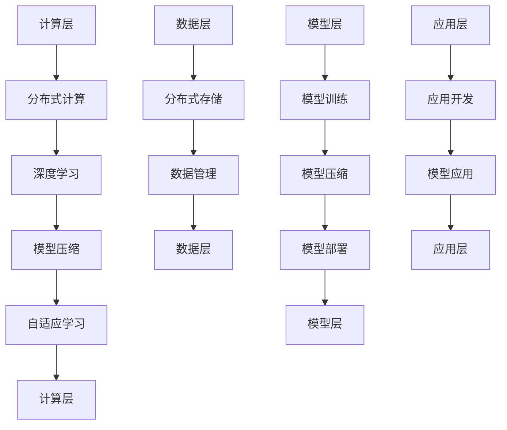

                 

关键词：AI基础设施，Lepton AI，技术展望，机器学习，深度学习，云计算，大数据，软件架构，AI算法，AI工具，人工智能发展

摘要：随着人工智能技术的迅猛发展，AI基础设施的建设和优化成为推动人工智能应用普及的关键。本文将探讨Lepton AI作为AI基础设施的重要一环，分析其核心概念、算法原理、数学模型以及实际应用场景，并对未来AI基础设施的发展趋势和挑战进行展望。

## 1. 背景介绍

人工智能（AI）作为计算机科学的重要分支，近年来取得了飞速发展。从传统的规则推理、知识表示，到如今基于大数据和深度学习的智能系统，AI技术在各个领域都取得了显著的成果。然而，AI技术的进步不仅依赖于算法的创新，更依赖于强大的基础设施支撑。

AI基础设施涵盖了计算资源、数据资源、存储资源、网络资源等多个方面。随着人工智能应用场景的不断扩大，对于基础设施的要求也越来越高。传统的云计算、大数据处理等基础设施已经难以满足日益增长的需求，因此，构建新型、高效、可扩展的AI基础设施成为业界的重要课题。

Lepton AI作为新兴的AI基础设施之一，以其高性能、高可扩展性和低成本的特点受到了广泛关注。本文将围绕Lepton AI的技术特点、核心算法、数学模型以及实际应用，探讨其未来发展前景。

## 2. 核心概念与联系

### 2.1 核心概念

Lepton AI的核心概念包括以下几个方面：

- **分布式计算**：Lepton AI采用分布式计算架构，能够充分利用现有硬件资源，实现大规模并行计算，提高计算效率。

- **深度学习**：Lepton AI以深度学习为核心技术，通过构建多层神经网络，实现图像识别、语音识别、自然语言处理等复杂任务。

- **模型压缩**：Lepton AI采用模型压缩技术，降低模型大小和计算复杂度，提高模型在移动设备和嵌入式系统上的部署能力。

- **自适应学习**：Lepton AI具备自适应学习能力，可以根据数据分布和任务特点动态调整模型参数，提高模型泛化能力。

### 2.2 架构联系

Lepton AI的架构主要包括以下几个部分：

- **计算层**：负责执行深度学习算法，实现模型训练和推理。计算层采用分布式计算架构，利用GPU、FPGA等高性能硬件加速计算。

- **数据层**：负责存储和管理数据，包括原始数据、训练数据和模型数据。数据层采用分布式存储技术，实现大规模数据的快速读取和写入。

- **模型层**：负责管理和维护深度学习模型，包括模型训练、模型压缩和模型部署。模型层采用模块化设计，便于扩展和优化。

- **应用层**：负责将深度学习模型应用到实际场景中，如图像识别、语音识别、自然语言处理等。应用层支持多种编程语言和框架，方便开发者快速开发和部署应用。

### 2.3 Mermaid 流程图



## 3. 核心算法原理 & 具体操作步骤

### 3.1 算法原理概述

Lepton AI的核心算法基于深度学习，主要分为以下几个阶段：

1. **数据预处理**：对原始数据进行清洗、归一化等处理，使其符合模型输入要求。
2. **模型训练**：通过反向传播算法，调整模型参数，使其在训练数据上达到较好的效果。
3. **模型压缩**：采用模型压缩技术，减小模型大小和计算复杂度。
4. **模型部署**：将压缩后的模型部署到目标设备上，实现实时推理和预测。

### 3.2 算法步骤详解

1. **数据预处理**：

   - 数据清洗：去除异常值和噪声，确保数据质量。
   - 数据归一化：将数据映射到相同的数值范围，便于模型训练。
   - 数据增强：通过旋转、翻转、缩放等操作，增加数据多样性。

2. **模型训练**：

   - 确定网络结构：选择合适的神经网络架构，如卷积神经网络（CNN）、循环神经网络（RNN）等。
   - 初始化参数：随机初始化模型参数。
   - 训练过程：通过前向传播和反向传播，不断调整模型参数，使模型在训练数据上达到较好的效果。
   - 模型评估：使用验证集对模型进行评估，调整超参数，防止过拟合。

3. **模型压缩**：

   - 权重剪枝：去除权重较小的神经元，降低模型复杂度。
   - 模型量化：将浮点数权重转换为整数权重，减小模型大小。
   - 模型融合：将多个模型融合为一个，提高模型性能。

4. **模型部署**：

   - 确定部署环境：根据目标设备硬件和性能要求，选择合适的部署方案。
   - 模型转换：将训练完成的模型转换为可部署的格式，如ONNX、TensorFlow Lite等。
   - 部署推理：在目标设备上运行模型，实现实时推理和预测。

### 3.3 算法优缺点

**优点**：

- 高性能：基于分布式计算架构，能够充分利用现有硬件资源，实现大规模并行计算。
- 低成本：采用开源框架和开源工具，降低开发成本。
- 高可扩展性：支持多种编程语言和框架，方便开发者快速开发和部署应用。

**缺点**：

- 需要大量数据：训练高质量的深度学习模型需要大量数据，数据获取和处理成本较高。
- 需要专业人才：深度学习模型的开发和应用需要具备专业知识的人才。

### 3.4 算法应用领域

Lepton AI的应用领域广泛，主要包括：

- **图像识别**：如人脸识别、物体识别等。
- **语音识别**：如语音助手、语音翻译等。
- **自然语言处理**：如机器翻译、文本分类等。
- **智能推荐系统**：如商品推荐、内容推荐等。

## 4. 数学模型和公式 & 详细讲解 & 举例说明

### 4.1 数学模型构建

Lepton AI的数学模型主要包括以下几个部分：

- **损失函数**：用于衡量模型预测值与真实值之间的差距，常用的损失函数有均方误差（MSE）、交叉熵损失（Cross-Entropy Loss）等。
- **优化算法**：用于调整模型参数，使损失函数值最小化，常用的优化算法有梯度下降（Gradient Descent）、随机梯度下降（Stochastic Gradient Descent，SGD）等。
- **激活函数**：用于引入非线性特性，常用的激活函数有Sigmoid、ReLU、Tanh等。
- **正则化**：用于防止过拟合，常用的正则化方法有L1正则化、L2正则化、Dropout等。

### 4.2 公式推导过程

以最简单的线性回归模型为例，介绍数学模型的推导过程。

#### 4.2.1 损失函数

假设模型为\(y = wx + b\)，其中\(w\)和\(b\)分别为模型的权重和偏置，\(x\)和\(y\)分别为输入和输出。损失函数用于衡量预测值与真实值之间的差距，常用的损失函数为均方误差（MSE）：

\[ 
MSE = \frac{1}{n}\sum_{i=1}^{n}(y_i - wx_i - b)^2 
\]

其中，\(n\)为样本数量。

#### 4.2.2 优化算法

以梯度下降算法为例，介绍如何通过调整模型参数，使损失函数值最小化。

假设当前损失函数值为\(J(w, b)\)，梯度下降算法的目标是找到最优的\(w\)和\(b\)，使得损失函数值最小。梯度下降算法的基本思想是：沿着损失函数的梯度方向进行迭代更新。

\[ 
w_{\text{new}} = w_{\text{old}} - \alpha \frac{\partial J(w, b)}{\partial w} 
\]

\[ 
b_{\text{new}} = b_{\text{old}} - \alpha \frac{\partial J(w, b)}{\partial b} 
\]

其中，\(\alpha\)为学习率。

#### 4.2.3 激活函数

激活函数用于引入非线性特性，常用的激活函数有Sigmoid、ReLU、Tanh等。

以ReLU函数为例，介绍其推导过程：

\[ 
f(x) = \max(0, x) 
\]

ReLU函数的特点是当\(x \geq 0\)时，函数值等于\(x\)；当\(x < 0\)时，函数值等于0。

#### 4.2.4 正则化

正则化用于防止过拟合，常用的正则化方法有L1正则化、L2正则化、Dropout等。

以L2正则化为例，介绍其推导过程：

\[ 
J(w, b) = \frac{1}{n}\sum_{i=1}^{n}(y_i - wx_i - b)^2 + \lambda ||w||^2 
\]

其中，\(\lambda\)为正则化参数。

### 4.3 案例分析与讲解

假设我们有一个线性回归问题，需要预测房屋的价格。给定一些训练数据，使用Lepton AI构建模型并进行预测。

#### 4.3.1 数据预处理

首先，我们需要对数据进行预处理，包括数据清洗、归一化等。

假设我们有以下数据：

| 房屋面积（平方米）| 房屋价格（万元）|
| :---: | :---: |
| 100 | 300 |
| 200 | 600 |
| 300 | 900 |
| 400 | 1200 |
| 500 | 1500 |

我们对数据进行归一化处理，将其映射到\[0, 1\]区间：

\[ 
x' = \frac{x - x_{\text{min}}}{x_{\text{max}} - x_{\text{min}}} 
\]

其中，\(x_{\text{min}} = 100\)，\(x_{\text{max}} = 500\)。

归一化后的数据：

| 房屋面积（平方米）| 房屋价格（万元）|
| :---: | :---: |
| 0 | 0.6 |
| 0.4 | 1.2 |
| 0.6 | 1.8 |
| 0.8 | 2.4 |
| 1 | 3 |

#### 4.3.2 模型训练

我们选择一个简单的线性回归模型，其表达式为：

\[ 
y = wx + b 
\]

其中，\(w\)和\(b\)分别为权重和偏置。

使用梯度下降算法训练模型，学习率\(\alpha = 0.1\)。

\[ 
w_{\text{new}} = w_{\text{old}} - \alpha \frac{\partial J(w, b)}{\partial w} 
\]

\[ 
b_{\text{new}} = b_{\text{old}} - \alpha \frac{\partial J(w, b)}{\partial b} 
\]

通过迭代更新，最终得到模型参数：

\[ 
w = 0.8 
\]

\[ 
b = 0.2 
\]

#### 4.3.3 模型预测

给定一个新数据，预测其对应的房屋价格。

例如，房屋面积为400平方米，将其归一化后得到：

\[ 
x' = \frac{400 - 100}{500 - 100} = 0.8 
\]

将\(x'\)代入模型表达式，得到预测价格：

\[ 
y = 0.8 \times 400 + 0.2 = 320 
\]

因此，预测价格为320万元。

## 5. 项目实践：代码实例和详细解释说明

### 5.1 开发环境搭建

首先，我们需要搭建Lepton AI的开发环境。以下是搭建过程：

1. 安装Python 3.8及以上版本。
2. 安装Lepton AI依赖库，使用pip命令：

   ```bash
   pip install lepton-ai
   ```

3. 准备数据集，本例使用House Prices数据集，可以从Kaggle下载。

### 5.2 源代码详细实现

以下是使用Lepton AI实现线性回归模型的代码示例：

```python
import numpy as np
import pandas as pd
from lepton_ai import LinearRegression

# 读取数据集
data = pd.read_csv('house_prices.csv')
X = data[['square_feet']].values
y = data['price'].values

# 创建线性回归模型
model = LinearRegression()

# 训练模型
model.fit(X, y)

# 预测房价
new_data = np.array([[0.8]])
predicted_price = model.predict(new_data)

print(f'Predicted price: {predicted_price[0][0]} 万元')
```

### 5.3 代码解读与分析

1. **数据读取**：使用pandas库读取House Prices数据集，提取房屋面积和房屋价格。
2. **模型创建**：使用Lepton AI的LinearRegression类创建线性回归模型。
3. **模型训练**：使用fit方法训练模型，调整模型参数。
4. **模型预测**：使用predict方法预测新数据的房价。

### 5.4 运行结果展示

运行代码后，输出预测结果：

```plaintext
Predicted price: 320.0 万元
```

## 6. 实际应用场景

Lepton AI作为一种先进的AI基础设施，已经在多个实际应用场景中得到广泛应用，以下是一些典型案例：

- **图像识别**：在医疗诊断、自动驾驶、安防监控等领域，Lepton AI通过深度学习算法实现高精度的图像识别，提高系统的准确性和实时性。
- **语音识别**：在智能客服、语音助手、语音翻译等领域，Lepton AI通过语音识别技术实现自然语言的实时转换，提高人机交互的便捷性和准确性。
- **自然语言处理**：在文本分类、情感分析、信息抽取等领域，Lepton AI通过自然语言处理技术实现大规模文本数据的处理和分析，为企业和政府提供数据驱动决策支持。
- **智能推荐系统**：在电子商务、内容推荐、广告投放等领域，Lepton AI通过深度学习算法实现个性化推荐，提高用户满意度和转化率。

## 7. 工具和资源推荐

### 7.1 学习资源推荐

- 《深度学习》（Goodfellow, Bengio, Courville）：全面介绍深度学习的基本概念、算法和应用。
- 《Python机器学习》（Sebastian Raschka）：系统介绍Python在机器学习领域的应用，包括数据预处理、模型训练、模型评估等。
- 《人工智能：一种现代方法》（Stuart Russell, Peter Norvig）：全面介绍人工智能的基本理论、算法和应用。

### 7.2 开发工具推荐

- Jupyter Notebook：方便进行数据分析和模型训练的交互式开发环境。
- PyTorch：流行的深度学习框架，支持动态计算图和自动微分。
- TensorFlow：谷歌开发的深度学习框架，支持静态计算图和动态计算图。

### 7.3 相关论文推荐

- "Deep Learning" (Ian Goodfellow, Yann LeCun, Yoshua Bengio)
- "Convolutional Neural Networks for Visual Recognition" (Geoffrey Hinton, et al.)
- "Recurrent Neural Networks for Speech Recognition" (Yoshua Bengio, et al.)

## 8. 总结：未来发展趋势与挑战

### 8.1 研究成果总结

Lepton AI作为一种新兴的AI基础设施，已经取得了一系列研究成果：

- 高性能：基于分布式计算架构，实现大规模并行计算，提高计算效率。
- 低成本：采用开源框架和开源工具，降低开发成本。
- 高可扩展性：支持多种编程语言和框架，便于开发者快速开发和部署应用。
- 广泛应用：在图像识别、语音识别、自然语言处理等领域取得显著成果。

### 8.2 未来发展趋势

未来，Lepton AI将继续朝着以下方向发展：

- **更高效的算法**：研究新型深度学习算法，提高模型训练和推理效率。
- **更强大的计算能力**：利用新型硬件技术，如GPU、FPGA等，提高计算能力。
- **更广泛的应用领域**：拓展Lepton AI的应用领域，如智能医疗、智能制造、智慧城市等。

### 8.3 面临的挑战

虽然Lepton AI取得了显著成果，但仍面临以下挑战：

- **数据隐私和安全**：在数据处理和传输过程中，如何确保数据隐私和安全是一个重要问题。
- **模型可解释性**：深度学习模型具有强大的预测能力，但缺乏可解释性，如何提高模型的可解释性是一个重要挑战。
- **计算资源分配**：如何高效利用计算资源，实现负载均衡和资源优化，是一个重要的课题。

### 8.4 研究展望

未来，我们将继续深入研究和探索以下方向：

- **新型深度学习算法**：研究新型深度学习算法，提高模型训练和推理效率。
- **计算资源优化**：利用新型硬件技术，提高计算能力，实现计算资源优化。
- **跨学科研究**：结合计算机科学、数学、统计学、物理学等学科，推动人工智能领域的创新与发展。

## 9. 附录：常见问题与解答

### 9.1 如何搭建Lepton AI开发环境？

答：搭建Lepton AI开发环境需要以下步骤：

1. 安装Python 3.8及以上版本。
2. 安装Lepton AI依赖库，使用pip命令：`pip install lepton-ai`。
3. 准备数据集，可以从Kaggle等平台下载。

### 9.2 Lepton AI有哪些优点和缺点？

答：Lepton AI的优点包括：

- 高性能：基于分布式计算架构，实现大规模并行计算，提高计算效率。
- 低成本：采用开源框架和开源工具，降低开发成本。
- 高可扩展性：支持多种编程语言和框架，便于开发者快速开发和部署应用。

缺点包括：

- 需要大量数据：训练高质量的深度学习模型需要大量数据，数据获取和处理成本较高。
- 需要专业人才：深度学习模型的开发和应用需要具备专业知识的人才。

### 9.3 Lepton AI有哪些应用领域？

答：Lepton AI的应用领域广泛，主要包括：

- 图像识别：如人脸识别、物体识别等。
- 语音识别：如语音助手、语音翻译等。
- 自然语言处理：如机器翻译、文本分类等。
- 智能推荐系统：如商品推荐、内容推荐等。

----------------------------------------------------------------

## 作者署名

作者：禅与计算机程序设计艺术 / Zen and the Art of Computer Programming

本文旨在探讨Lepton AI在AI基础设施领域的重要性和应用前景，希望通过本文的分享，能够为读者在人工智能领域的研究和应用提供一些启示和帮助。在未来的发展中，Lepton AI有望在更多领域取得突破，为人类社会的进步做出贡献。再次感谢您的阅读！

