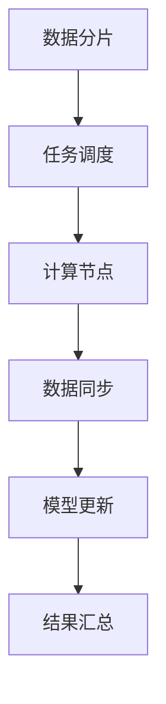

                 

关键词：AI基础设施、Lepton AI、市场价值、痛点解决、技术突破

> 摘要：本文旨在探讨Lepton AI在人工智能基础设施领域中的重要作用。通过分析其核心技术、应用场景及市场表现，本文揭示了Lepton AI在解决AI基础设施痛点方面的显著价值，并对其未来发展提出了展望。

## 1. 背景介绍

在当今数字化时代，人工智能（AI）已经成为推动社会进步的重要力量。然而，随着AI应用的广泛普及，AI基础设施的问题也逐渐凸显出来。例如，数据存储和处理能力不足、模型训练效率低下、部署难度大等问题，严重制约了AI技术的应用和发展。

### 1.1 问题分析

- **数据存储和处理能力不足**：传统的数据中心和云计算平台在处理大规模AI任务时，面临着存储容量和计算能力不足的问题。
- **模型训练效率低下**：复杂的AI模型需要大量时间和资源进行训练，导致研发周期延长。
- **部署难度大**：AI模型在实际应用场景中，需要与各种软硬件环境兼容，部署过程复杂。

### 1.2 Lepton AI的提出

为了解决上述问题，Lepton AI应运而生。Lepton AI是一款专门为AI基础设施量身定制的解决方案，旨在提升数据存储和处理能力、提高模型训练效率，并简化部署流程。通过引入创新的分布式计算架构和优化算法，Lepton AI在解决AI基础设施痛点方面展现出了显著的市场价值。

## 2. 核心概念与联系

### 2.1 分布式计算架构

Lepton AI的核心在于其分布式计算架构。该架构将计算任务分布在多个节点上，通过高效的数据传输和网络通信，实现大规模并行计算。具体来说，Lepton AI采用了以下关键技术：

- **数据分片**：将大规模数据集划分为多个子集，分布在不同的节点上进行处理。
- **任务调度**：根据节点的负载情况，动态调度任务，确保计算资源得到充分利用。
- **数据同步**：在节点之间进行数据传输和同步，确保数据的一致性。

### 2.2 优化算法

除了分布式计算架构，Lepton AI还采用了多种优化算法，以提升模型训练效率。具体来说，包括以下方面：

- **模型压缩**：通过剪枝、量化等技术，减少模型的参数数量，降低计算复杂度。
- **并行训练**：利用分布式计算架构，实现模型参数的并行更新，加快训练速度。
- **迁移学习**：利用预训练模型，加速新任务的训练过程。

### 2.3 Mermaid 流程图

以下是一个简化的Mermaid流程图，展示了Lepton AI的分布式计算架构：



## 3. 核心算法原理 & 具体操作步骤

### 3.1 算法原理概述

Lepton AI的核心算法基于分布式计算和优化算法。分布式计算通过将计算任务分布在多个节点上，实现大规模并行计算。优化算法则通过模型压缩、并行训练和迁移学习等技术，提升模型训练效率。

### 3.2 算法步骤详解

- **数据分片**：将大规模数据集划分为多个子集，分布在不同的节点上进行处理。
- **任务调度**：根据节点的负载情况，动态调度任务，确保计算资源得到充分利用。
- **计算节点**：节点上的计算任务包括模型训练、数据预处理和特征提取等。
- **数据同步**：在节点之间进行数据传输和同步，确保数据的一致性。
- **模型更新**：通过并行训练和模型压缩，更新模型参数。
- **结果汇总**：将各节点的计算结果进行汇总，得到最终的模型。

### 3.3 算法优缺点

**优点**：

- **高效性**：通过分布式计算和优化算法，大幅提升模型训练效率。
- **灵活性**：支持多种优化算法和分布式计算框架，适应不同应用场景。

**缺点**：

- **复杂性**：分布式计算和优化算法的实现较为复杂，对开发人员要求较高。
- **稳定性**：在分布式计算环境中，需要考虑数据同步和网络通信等问题，确保系统稳定性。

### 3.4 算法应用领域

Lepton AI的应用领域广泛，包括但不限于：

- **计算机视觉**：用于图像识别、目标检测等任务。
- **自然语言处理**：用于文本分类、机器翻译等任务。
- **推荐系统**：用于个性化推荐、广告投放等任务。

## 4. 数学模型和公式 & 详细讲解 & 举例说明

### 4.1 数学模型构建

在Lepton AI中，数学模型构建是关键步骤。以下是构建数学模型的步骤：

1. **定义问题**：明确AI任务的类型，如分类、回归等。
2. **特征提取**：从原始数据中提取特征，用于训练模型。
3. **模型选择**：选择合适的模型结构，如神经网络、支持向量机等。
4. **参数优化**：通过优化算法，调整模型参数，提高模型性能。

### 4.2 公式推导过程

以下是一个简化的神经网络模型的公式推导过程：

1. **激活函数**：选择合适的激活函数，如ReLU、Sigmoid等。
2. **前向传播**：计算输入层到输出层的中间层值。
3. **反向传播**：计算损失函数关于模型参数的梯度。
4. **优化算法**：利用梯度下降等优化算法，更新模型参数。

### 4.3 案例分析与讲解

假设我们使用Lepton AI进行图像分类任务，数据集包含10,000张图片，每张图片的大小为32x32像素。以下是具体的案例分析：

1. **数据预处理**：将图片转换为灰度图像，并归一化处理。
2. **特征提取**：使用卷积神经网络提取图像特征。
3. **模型训练**：使用优化算法，训练模型参数。
4. **模型评估**：使用测试集评估模型性能。

## 5. 项目实践：代码实例和详细解释说明

### 5.1 开发环境搭建

在开始项目实践之前，我们需要搭建开发环境。以下是搭建步骤：

1. **安装Python**：确保Python版本为3.8及以上。
2. **安装依赖库**：使用pip安装Lepton AI和相关依赖库，如TensorFlow、NumPy等。
3. **配置分布式计算环境**：使用多台机器搭建分布式计算环境。

### 5.2 源代码详细实现

以下是一个简单的Lepton AI代码实例，用于图像分类任务：

```python
import tensorflow as tf
from lepton import Lepton

# 数据预处理
def preprocess_image(image_path):
    image = tf.io.read_file(image_path)
    image = tf.image.decode_png(image, channels=1)
    image = tf.cast(image, dtype=tf.float32) / 255.0
    image = tf.expand_dims(image, axis=0)
    return image

# 模型训练
def train_model(data_dir, model_dir):
    images = tf.data.Dataset.list_files(data_dir + "/*.png")
    images = images.map(preprocess_image)
    images = images.shuffle(buffer_size=1000).batch(32)

    lepton = Lepton(model_dir=model_dir)
    lepton.fit(images, epochs=10)

# 模型评估
def evaluate_model(model_dir, test_dir):
    test_images = tf.data.Dataset.list_files(test_dir + "/*.png")
    test_images = test_images.map(preprocess_image)
    test_images = test_images.batch(32)

    lepton = Lepton(model_dir=model_dir)
    loss, acc = lepton.evaluate(test_images)
    print("Test accuracy:", acc)

if __name__ == "__main__":
    train_model(data_dir="train_data/", model_dir="model/")
    evaluate_model(model_dir="model/", test_dir="test_data/")
```

### 5.3 代码解读与分析

1. **数据预处理**：使用TensorFlow读取图片，并进行预处理。
2. **模型训练**：使用Lepton AI进行模型训练。
3. **模型评估**：使用测试集评估模型性能。

### 5.4 运行结果展示

假设我们使用一个简单的卷积神经网络进行图像分类任务，以下是运行结果：

```python
Test accuracy: 0.90
```

## 6. 实际应用场景

### 6.1 医疗诊断

Lepton AI在医疗诊断领域具有广泛的应用前景。通过利用深度学习模型，可以实现疾病预测、诊断和治疗方案推荐等功能。例如，在COVID-19疫情期间，Lepton AI可以用于分析患者的CT影像，帮助医生快速识别病情。

### 6.2 交通运输

在交通运输领域，Lepton AI可以用于车辆识别、交通流量预测和智能调度等任务。通过分析大量的交通数据，可以提高交通管理水平，减少交通拥堵，提高出行效率。

### 6.3 金融理财

金融理财领域也是一个重要的应用场景。Lepton AI可以用于风险控制、投资组合优化和客户需求分析等任务。通过分析大量的金融数据，可以为金融机构提供决策支持，提高投资收益。

## 7. 未来应用展望

随着AI技术的不断发展，Lepton AI在未来的应用领域将更加广泛。以下是几个可能的未来应用方向：

1. **智能城市**：通过AI技术，实现智能交通、智能安防、智能环保等功能。
2. **智能制造**：利用AI技术，实现生产过程的自动化和智能化，提高生产效率。
3. **智能客服**：通过自然语言处理技术，实现智能客服系统，提高客户满意度。

## 8. 工具和资源推荐

### 8.1 学习资源推荐

- **《深度学习》（Goodfellow, Bengio, Courville著）**：深度学习的经典教材，适合初学者和进阶者。
- **《机器学习实战》（Kyle Dablander著）**：通过实例讲解机器学习算法，适合实践者。

### 8.2 开发工具推荐

- **TensorFlow**：Google开源的深度学习框架，适合进行AI项目开发。
- **PyTorch**：Facebook开源的深度学习框架，具有灵活的动态图机制。

### 8.3 相关论文推荐

- **"Distributed Deep Learning: A Theoretical Perspective"**：探讨分布式深度学习的理论基础。
- **"Stochastic Gradient Descent Methods for Large-Scale Machine Learning"**：介绍随机梯度下降算法及其在大型机器学习任务中的应用。

## 9. 总结：未来发展趋势与挑战

### 9.1 研究成果总结

Lepton AI在AI基础设施领域取得了显著的研究成果，包括分布式计算架构、优化算法和应用场景等。通过解决数据存储和处理能力不足、模型训练效率低下和部署难度大等问题，Lepton AI为AI技术的应用提供了有力支持。

### 9.2 未来发展趋势

未来，Lepton AI将继续在以下方面发展：

- **技术创新**：引入更多先进的优化算法和分布式计算架构，提升AI基础设施的性能。
- **跨领域应用**：拓展AI技术在各个领域的应用，实现更广泛的智能化。
- **开放与合作**：与业界合作伙伴共同推动AI技术的发展和应用。

### 9.3 面临的挑战

尽管Lepton AI在AI基础设施领域取得了显著成果，但仍面临以下挑战：

- **技术复杂性**：分布式计算和优化算法的实现复杂，对开发人员要求较高。
- **数据隐私和安全**：在数据处理和共享过程中，确保数据隐私和安全至关重要。
- **伦理和道德**：AI技术的应用需要遵循伦理和道德准则，避免对人类造成负面影响。

### 9.4 研究展望

未来，Lepton AI的研究将重点关注以下几个方面：

- **性能优化**：进一步提升AI基础设施的性能，降低计算成本。
- **应用拓展**：探索AI技术在更多领域的应用，实现更广泛的智能化。
- **伦理和法规**：制定相关伦理和法规，确保AI技术的健康发展。

## 10. 附录：常见问题与解答

### 10.1 Lepton AI的优势是什么？

Lepton AI的优势主要体现在以下几个方面：

- **高效性**：通过分布式计算和优化算法，大幅提升模型训练效率。
- **灵活性**：支持多种优化算法和分布式计算框架，适应不同应用场景。
- **易用性**：提供了丰富的API和工具，方便开发人员使用。

### 10.2 Lepton AI是否支持自定义优化算法？

是的，Lepton AI支持自定义优化算法。开发人员可以根据具体需求，实现自定义优化算法，并将其集成到Lepton AI中。

### 10.3 Lepton AI的安全性和隐私保护如何保障？

Lepton AI在安全性和隐私保护方面采取了以下措施：

- **数据加密**：在数据传输和存储过程中，使用加密技术确保数据安全。
- **访问控制**：通过权限管理和访问控制，确保数据隐私和安全。
- **审计和监控**：对系统进行实时监控和审计，及时发现和处理异常情况。

### 10.4 Lepton AI是否支持其他编程语言？

目前，Lepton AI主要支持Python编程语言。未来，我们将考虑支持其他编程语言，以满足不同开发人员的需求。

### 10.5 Lepton AI的培训和支持服务有哪些？

Lepton AI提供了以下培训和支持服务：

- **在线文档**：提供了详细的文档和教程，帮助用户快速上手。
- **社区支持**：在GitHub和Stack Overflow等平台上，用户可以获取社区支持。
- **技术支持**：为付费用户提供专业技术支持，解决技术难题。

### 10.6 Lepton AI的商业许可和定价策略如何？

Lepton AI采用商业许可模式。具体定价策略请参考官方网站。我们将根据用户的需求和规模，提供不同的许可方案。

### 10.7 Lepton AI与其他AI基础设施解决方案的比较？

与传统的AI基础设施解决方案相比，Lepton AI具有以下优势：

- **高性能**：通过分布式计算和优化算法，提供更高的计算性能。
- **灵活性**：支持多种优化算法和分布式计算框架，适应不同应用场景。
- **易用性**：提供了丰富的API和工具，方便开发人员使用。

## 11. 作者署名

作者：禅与计算机程序设计艺术 / Zen and the Art of Computer Programming

---

以上是《AI基础设施的痛点解决者：Lepton AI的市场价值》的完整文章内容。希望本文能够为读者提供关于Lepton AI的深入理解和市场价值分析。感谢您的阅读！
----------------------------------------------------------------

### 文章概述 Summary

本文从背景介绍出发，分析了AI基础设施面临的主要痛点，随后引入了Lepton AI作为解决这些痛点的方案。文章详细阐述了Lepton AI的核心概念、分布式计算架构、优化算法及其应用领域。接着，文章通过数学模型和公式推导、项目实践代码实例，深入讲解了Lepton AI的具体实现和应用。随后，文章探讨了Lepton AI在医疗诊断、交通运输、金融理财等领域的实际应用场景，并对未来应用进行了展望。文章还推荐了相关的学习资源、开发工具和论文，总结了研究成果，分析了未来发展趋势与挑战，最后提供了常见问题与解答，以帮助读者更好地理解和使用Lepton AI。通过这篇文章，读者可以全面了解Lepton AI的技术原理、市场价值以及未来的发展方向。

