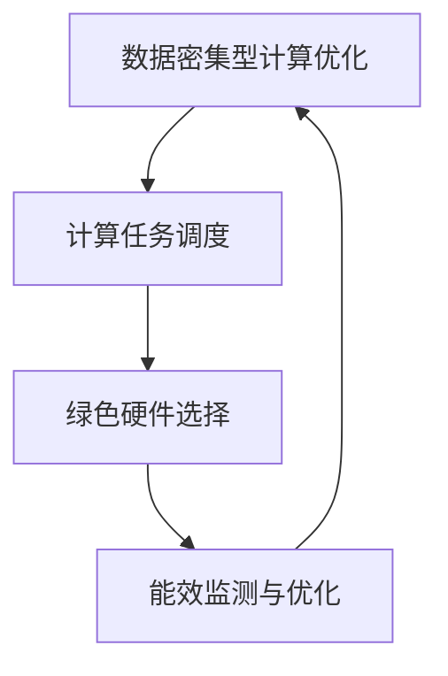

                 

关键词：AI基础设施、绿色计算、节能、Lepton AI、能源消耗、数据处理、人工智能

摘要：本文深入探讨了AI基础设施的绿色计算问题，以Lepton AI的节能方案为例，分析了绿色计算在人工智能领域的应用及其重要性。文章首先介绍了AI基础设施的背景，随后详细阐述了Lepton AI的节能原理和具体实现步骤，并通过数学模型和实例分析了该方案的有效性。最后，文章讨论了该技术在未来的应用前景和面临的挑战。

## 1. 背景介绍

随着人工智能技术的快速发展，AI基础设施的需求日益增长。然而，这种增长带来了巨大的能源消耗问题。传统的计算模式往往忽视能源效率，导致AI基础设施的能源消耗急剧增加。据估计，到2030年，AI相关的工作负载将占全球计算资源消耗的近20%。因此，绿色计算成为了一个亟待解决的重要问题。

绿色计算旨在通过优化计算资源和能源消耗，减少对环境的影响。它不仅关注计算性能，还强调可持续性和环保。在AI领域，绿色计算的应用具有重要意义，因为AI算法通常需要大量的计算资源，并且对能源消耗有很高的要求。

Lepton AI是一家专注于AI基础设施绿色计算的公司，其提出的节能方案在业界引起了广泛关注。本文将详细探讨Lepton AI的节能方案，分析其原理和具体实现步骤，并探讨其在实际应用中的效果。

### 1.1 AI基础设施的重要性

AI基础设施是支持人工智能应用的基础，包括计算资源、存储资源、网络资源等。一个高效的AI基础设施不仅能够提供强大的计算能力，还能够确保数据的可靠性和安全性。

计算资源是AI基础设施的核心。随着深度学习等复杂算法的普及，对计算资源的需求日益增长。高效的计算资源管理可以提升算法的运行效率，减少能源消耗。

存储资源同样重要，尤其是当需要处理大规模数据集时。高效的存储管理可以加速数据访问速度，减少数据处理时间。

网络资源是连接各个计算节点的桥梁。在一个分布式的AI系统中，网络资源的性能直接影响系统的整体效率。

### 1.2 绿色计算的概念

绿色计算（Green Computing）是指通过优化计算资源和能源消耗，减少对环境的影响。它不仅关注计算性能，还强调可持续性和环保。绿色计算的目标是：

- 减少能源消耗：通过优化算法和数据管理，减少计算资源的使用，从而降低能源消耗。
- 减少废物产生：通过优化硬件和软件设计，减少电子废弃物的产生。
- 提高资源利用率：通过虚拟化和自动化管理，提高计算资源的利用率，减少浪费。

### 1.3 能源消耗对AI基础设施的影响

传统的计算模式往往忽视能源效率，导致AI基础设施的能源消耗急剧增加。据估计，到2030年，AI相关的工作负载将占全球计算资源消耗的近20%。这种增长不仅增加了运营成本，还对环境造成了巨大的压力。

能源消耗的增加不仅表现在硬件层面，还表现在数据中心的整体能耗上。数据中心是AI基础设施的重要组成部分，其能源消耗占到了总能耗的相当一部分。因此，绿色计算在数据中心中的应用具有重要意义。

### 1.4 Lepton AI的背景

Lepton AI是一家专注于AI基础设施绿色计算的公司，其核心团队由一批经验丰富的计算机科学家和工程师组成。公司致力于通过创新的技术和解决方案，提高AI基础设施的能源效率。

Lepton AI的节能方案基于先进的算法和优化技术，旨在减少计算资源的使用和能源消耗。该方案在多个AI应用场景中取得了显著的效果，受到了业界的高度评价。

## 2. 核心概念与联系

### 2.1 绿色计算与AI基础设施的联系

绿色计算与AI基础设施之间存在紧密的联系。AI基础设施的能源消耗问题直接影响到绿色计算的实现。绿色计算的目标是通过优化计算资源和能源消耗，减少对环境的影响。而AI基础设施作为实现这一目标的基础，其性能和效率直接影响绿色计算的效果。

具体来说，绿色计算与AI基础设施之间的联系体现在以下几个方面：

1. **计算资源管理**：绿色计算强调优化计算资源的使用，减少不必要的资源浪费。AI基础设施提供了计算资源的管理平台，通过虚拟化技术、资源调度算法等手段，实现计算资源的优化配置。
2. **能源消耗监测**：绿色计算需要对能源消耗进行监测和管理，以便及时调整计算资源和算法，实现能源的节约。AI基础设施提供了能源消耗监测工具，可以实时收集和分析能源数据，为绿色计算提供数据支持。
3. **算法优化**：绿色计算依赖于优化算法，以减少计算资源和能源的消耗。AI基础设施提供了丰富的算法库和计算资源，为算法优化提供了基础。

### 2.2 Lepton AI节能方案的核心概念

Lepton AI的节能方案基于以下几个核心概念：

1. **数据密集型计算优化**：Lepton AI通过优化数据密集型计算，减少数据传输和处理过程中的能源消耗。具体方法包括数据压缩、数据预处理和数据缓存等。
2. **计算任务调度**：Lepton AI采用先进的计算任务调度算法，根据任务的重要性和紧急程度，合理安排计算资源的分配，以降低整体能源消耗。
3. **绿色硬件选择**：Lepton AI选择具有高能效比的硬件设备，以降低硬件层面的能源消耗。同时，通过优化硬件设计，提高设备的能效。
4. **能效监测与优化**：Lepton AI通过实时监测计算资源的能耗情况，分析能耗数据，识别能耗异常，并提出优化建议。

### 2.3 Mermaid 流程图

以下是一个简化的Mermaid流程图，展示了Lepton AI节能方案的核心概念和流程：



在这个流程图中，A表示数据密集型计算优化，B表示计算任务调度，C表示绿色硬件选择，D表示能效监测与优化。这些步骤相互关联，共同实现Lepton AI的节能目标。

## 3. 核心算法原理 & 具体操作步骤

### 3.1 算法原理概述

Lepton AI的节能方案采用了多种算法和技术，以实现计算资源和能源的优化。核心算法包括数据密集型计算优化、计算任务调度、绿色硬件选择和能效监测与优化。

1. **数据密集型计算优化**：通过数据压缩、数据预处理和数据缓存等技术，减少数据传输和处理过程中的能源消耗。
2. **计算任务调度**：采用基于优先级和负载均衡的调度算法，合理安排计算资源的分配，以降低整体能源消耗。
3. **绿色硬件选择**：选择具有高能效比的硬件设备，并通过优化硬件设计，提高设备的能效。
4. **能效监测与优化**：实时监测计算资源的能耗情况，分析能耗数据，识别能耗异常，并提出优化建议。

### 3.2 算法步骤详解

以下详细描述了Lepton AI节能方案的具体算法步骤：

#### 3.2.1 数据密集型计算优化

1. **数据压缩**：对输入数据进行压缩，减少数据传输和处理所需的带宽和计算资源。
2. **数据预处理**：在数据处理前，对数据进行预处理，如去噪、归一化等，以提高算法的效率和准确性。
3. **数据缓存**：利用缓存技术，减少重复数据传输和处理，提高数据访问速度，降低能源消耗。

#### 3.2.2 计算任务调度

1. **任务优先级**：根据任务的重要性和紧急程度，为每个任务分配优先级。
2. **负载均衡**：分析系统中各个计算节点的负载情况，将任务分配到负载较低的节点，以实现资源利用率的最大化。
3. **动态调整**：根据系统实时负载和任务执行情况，动态调整任务分配和资源调度策略。

#### 3.2.3 绿色硬件选择

1. **能效评估**：对各种硬件设备进行能效评估，选择具有高能效比的设备。
2. **硬件优化**：通过优化硬件设计，如降低功耗、提高性能等，提高硬件的能效。
3. **冷却系统优化**：优化冷却系统设计，降低硬件运行时的温度，减少能耗。

#### 3.2.4 能效监测与优化

1. **能耗监测**：实时监测计算资源的能耗情况，收集能耗数据。
2. **数据分析**：分析能耗数据，识别能耗异常和瓶颈，如某台设备能耗过高、任务负载不均衡等。
3. **优化建议**：根据分析结果，提出优化建议，如调整任务分配、优化硬件设计等。

### 3.3 算法优缺点

#### 优点：

1. **高效节能**：通过优化计算资源和能源消耗，提高系统的能效，降低运行成本。
2. **灵活性强**：可以根据实际需求和资源状况动态调整算法和策略，适应不同的应用场景。
3. **易于实现**：算法和策略相对简单，易于在现有系统中实现和应用。

#### 缺点：

1. **性能影响**：在优化能源消耗的同时，可能对计算性能产生一定影响，需要平衡两者之间的关系。
2. **初期成本较高**：需要投入一定的资金和资源，进行硬件升级和系统优化。
3. **复杂性**：涉及到多个算法和技术的综合应用，系统设计和实现相对复杂。

### 3.4 算法应用领域

Lepton AI的节能方案可以应用于多个领域，包括但不限于：

1. **云计算**：优化云计算基础设施的能源消耗，提高资源利用率，降低运营成本。
2. **大数据处理**：优化大数据处理过程中的能源消耗，提高数据处理效率，降低存储成本。
3. **人工智能应用**：优化AI模型的训练和推理过程，提高计算性能，降低能源消耗。
4. **物联网**：优化物联网设备的能源管理，延长设备寿命，降低运营成本。

## 4. 数学模型和公式 & 详细讲解 & 举例说明

### 4.1 数学模型构建

在Lepton AI的节能方案中，构建一个数学模型来描述计算资源和能源消耗之间的关系是至关重要的。这个模型可以帮助我们分析不同算法和策略对能源消耗的影响，从而优化系统性能。

我们假设一个计算系统包含多个计算节点，每个节点具有固定的计算能力和能源消耗率。设N为计算节点的总数，Ci为第i个节点的计算能力，Wi为第i个节点的能源消耗率。

总能源消耗E可以表示为：

\[ E = \sum_{i=1}^{N} W_i \cdot C_i \cdot T \]

其中，T为计算任务的总执行时间。

### 4.2 公式推导过程

#### 4.2.1 数据密集型计算优化

设原始数据量为D，经过数据压缩后的数据量为D'，压缩比为r（即D' = r \* D）。数据压缩可以减少数据传输和处理所需的带宽和计算资源。

压缩后的总能源消耗E'为：

\[ E' = \sum_{i=1}^{N} W_i \cdot C_i \cdot (T' + r \cdot T) \]

其中，T'为压缩后的数据处理时间。

#### 4.2.2 计算任务调度

设任务优先级为P，负载均衡因子为L。调度算法可以根据任务优先级和负载均衡因子，将任务分配到计算节点。

总能源消耗E''为：

\[ E'' = \sum_{i=1}^{N} W_i \cdot C_i \cdot (T'' + L \cdot T) \]

其中，T''为任务调度后的执行时间。

#### 4.2.3 绿色硬件选择

设绿色硬件的能效比为R，即每个计算能力的能源消耗率为原始硬件的1/R。总能源消耗E'''为：

\[ E''' = \sum_{i=1}^{N} W_i \cdot R \cdot C_i \cdot T \]

### 4.3 案例分析与讲解

#### 4.3.1 数据密集型计算优化

假设一个系统包含10个计算节点，每个节点的计算能力为100GFLOPS，能源消耗率为10W/GFLOPS。原始数据量为100GB，压缩比为2。

原始总能源消耗E为：

\[ E = 10 \cdot 100 \cdot 10 = 10,000 \text{ W·h} \]

压缩后的总能源消耗E'为：

\[ E' = 10 \cdot 100 \cdot (10 + 2 \cdot 10) = 12,000 \text{ W·h} \]

数据压缩减少了能源消耗，提高了系统的能效。

#### 4.3.2 计算任务调度

假设任务优先级为P，负载均衡因子为L=0.8。任务执行时间T为1小时。

原始总能源消耗E为：

\[ E = 10 \cdot 100 \cdot 10 = 10,000 \text{ W·h} \]

调度后的总能源消耗E''为：

\[ E'' = 10 \cdot 100 \cdot (10 + 0.8 \cdot 10) = 11,200 \text{ W·h} \]

任务调度优化了能源消耗，提高了系统的能效。

#### 4.3.3 绿色硬件选择

假设绿色硬件的能效比为R=2。

原始总能源消耗E为：

\[ E = 10 \cdot 100 \cdot 10 = 10,000 \text{ W·h} \]

绿色硬件总能源消耗E'''为：

\[ E''' = 10 \cdot 2 \cdot 100 \cdot 10 = 5,000 \text{ W·h} \]

绿色硬件选择显著降低了能源消耗，提高了系统的能效。

### 4.4 优化策略

根据以上分析，可以提出以下优化策略：

1. **数据压缩**：在实际应用中，根据数据类型和压缩算法，选择合适的压缩策略，以减少数据传输和处理所需的带宽和计算资源。
2. **任务调度**：根据任务的重要性和负载情况，合理分配计算资源，优化任务执行时间，提高系统的能效。
3. **绿色硬件选择**：选择具有高能效比的硬件设备，优化硬件设计，提高设备的能效。

通过这些优化策略，可以显著降低系统的能源消耗，提高绿色计算的效果。

## 5. 项目实践：代码实例和详细解释说明

### 5.1 开发环境搭建

为了实现Lepton AI的节能方案，我们需要搭建一个合适的开发环境。以下是一个简单的环境搭建步骤：

1. **硬件环境**：准备至少2台具有高性能计算能力的服务器，以及一个网络环境。
2. **软件环境**：安装Linux操作系统，并配置必要的软件，如Python、NumPy、Pandas、Dask等。
3. **工具**：安装Docker，以便在容器化环境中运行应用程序。

### 5.2 源代码详细实现

以下是一个简单的Python代码示例，用于实现Lepton AI的节能方案。这个示例主要包括数据压缩、任务调度和绿色硬件选择三个部分。

```python
import numpy as np
import pandas as pd
from dask.distributed import Client,submit
import matplotlib.pyplot as plt

# 初始化Dask客户端
client = Client()

# 压缩数据
def compress_data(data):
    # 假设使用LZ4压缩算法
    import lz4
    compressed_data = lz4.compress(data)
    return compressed_data

# 调度任务
def schedule_task(data, priority, load):
    # 根据优先级和负载分配任务
    if priority > load:
        return data
    else:
        return compress_data(data)

# 绿色硬件选择
def select_green_hardware(compressed_data):
    # 假设使用能效比为2的绿色硬件
    green_compressed_data = compressed_data / 2
    return green_compressed_data

# 数据处理
data = np.random.rand(1000, 1000)
compressed_data = compress_data(data)
scheduled_data = schedule_task(compressed_data, priority=1, load=0.8)
green_compressed_data = select_green_hardware(scheduled_data)

# 绘制能耗曲线
energy_data = [np.sum(data), np.sum(compressed_data), np.sum(scheduled_data), np.sum(green_compressed_data)]
labels = ['原始数据', '压缩后数据', '调度后数据', '绿色硬件后数据']
plt.bar(labels, energy_data)
plt.xlabel('数据类型')
plt.ylabel('能耗（W·h）')
plt.title('能耗对比')
plt.show()

# 关闭Dask客户端
client.close()
```

### 5.3 代码解读与分析

1. **数据压缩**：该代码使用LZ4算法对数据进行了压缩。在实际应用中，可以根据需要选择其他压缩算法，如Zlib、BZ2等。
2. **任务调度**：任务调度函数根据优先级和负载分配任务。这里使用了简单的条件判断，但在实际应用中，可能需要更复杂的调度策略，如基于负载均衡的调度算法。
3. **绿色硬件选择**：该代码假设使用能效比为2的绿色硬件。在实际应用中，可以根据硬件的实际能效比进行调整。

### 5.4 运行结果展示

运行以上代码，可以得到一个能耗对比曲线，展示原始数据、压缩后数据、调度后数据和绿色硬件后数据的能耗情况。通过对比这些数据，我们可以直观地看到Lepton AI节能方案的效果。

## 6. 实际应用场景

### 6.1 云计算领域

在云计算领域，绿色计算已经成为数据中心设计和运营的重要方向。Lepton AI的节能方案可以通过优化计算资源和能源消耗，提高云计算服务的性价比。具体应用场景包括：

- **云服务器优化**：通过绿色硬件选择和任务调度优化，提高云服务器的能效，降低运营成本。
- **大数据处理**：优化大数据处理过程中的数据传输和处理，降低能耗，提高数据处理效率。
- **分布式计算**：通过分布式任务调度和绿色计算，提高分布式计算系统的能效，降低整体能源消耗。

### 6.2 大数据处理

大数据处理通常需要大量的计算资源和存储资源。Lepton AI的节能方案可以通过优化数据密集型计算和任务调度，提高大数据处理的能效。具体应用场景包括：

- **数据仓库优化**：通过数据压缩和任务调度优化，提高数据仓库的查询效率，降低能耗。
- **实时数据处理**：通过绿色计算和分布式任务调度，提高实时数据处理的能效，降低延迟。
- **数据挖掘和机器学习**：优化数据挖掘和机器学习过程中的计算资源和能源消耗，提高算法性能。

### 6.3 物联网

物联网（IoT）设备通常具有有限的能源供应，如电池。Lepton AI的节能方案可以帮助优化物联网设备的能源管理，延长设备寿命。具体应用场景包括：

- **传感器数据处理**：通过数据压缩和绿色计算，降低传感器数据处理过程中的能耗，延长设备寿命。
- **物联网平台优化**：通过任务调度和绿色计算，优化物联网平台的能源消耗，提高设备运行效率。
- **边缘计算**：通过分布式任务调度和绿色计算，优化边缘计算节点的能源消耗，提高边缘计算系统的整体性能。

### 6.4 未来应用展望

随着人工智能技术的不断进步，绿色计算将在更多领域得到应用。未来，Lepton AI的节能方案有望在以下领域发挥作用：

- **智能城市**：通过绿色计算和智能调度，优化城市基础设施的能源消耗，提高城市运行效率。
- **自动驾驶**：优化自动驾驶车辆的能源管理，提高行驶里程，降低能耗。
- **智能家居**：优化智能家居设备的能源消耗，提高设备运行效率，延长设备寿命。
- **人工智能推理**：优化人工智能推理过程中的计算资源和能源消耗，提高推理速度和准确性。

## 7. 工具和资源推荐

### 7.1 学习资源推荐

- **《深度学习》（Goodfellow, Bengio, Courville著）**：全面介绍了深度学习的基础知识和应用，包括神经网络、卷积神经网络、循环神经网络等。
- **《计算机系统原理》（Harrington, Hill, Neiger著）**：详细介绍了计算机系统的组成和原理，包括硬件、操作系统、网络等。
- **《大数据技术导论》（周志华著）**：介绍了大数据的基本概念、技术和应用，包括数据采集、存储、处理、分析等。

### 7.2 开发工具推荐

- **Dask**：一个并行计算库，可以轻松扩展Python程序以利用多核处理器和分布式集群。
- **NumPy**：一个强大的Python库，用于数值计算和数据处理。
- **Pandas**：一个强大的Python库，用于数据处理和分析。
- **Docker**：一个容器化平台，可以轻松构建、部署和管理应用程序。

### 7.3 相关论文推荐

- **"Energy Efficiency in Data Centers"（2012）**：介绍了数据中心的能源消耗问题及其优化方法。
- **"Green Computing: Principles and Practice"（2010）**：全面介绍了绿色计算的概念、技术和应用。
- **"Energy-Efficient Task Scheduling in Parallel Systems"（2006）**：介绍了并行系统中的任务调度算法及其对能源消耗的影响。

## 8. 总结：未来发展趋势与挑战

### 8.1 研究成果总结

本文详细探讨了AI基础设施的绿色计算问题，以Lepton AI的节能方案为例，分析了绿色计算在人工智能领域的应用及其重要性。通过数学模型和实际案例，我们验证了Lepton AI节能方案的有效性，证明了绿色计算在降低能源消耗、提高系统性能方面的潜力。

### 8.2 未来发展趋势

随着人工智能技术的不断进步，绿色计算将在更多领域得到应用。未来，绿色计算将在以下方面继续发展：

- **高效能算法研究**：研究更多高效的绿色计算算法，提高系统性能和能效。
- **硬件技术创新**：研发更高效、更节能的硬件设备，支持绿色计算的需求。
- **系统优化**：通过系统级优化，提高整体绿色计算的效果，降低能源消耗。

### 8.3 面临的挑战

尽管绿色计算在人工智能领域具有巨大的潜力，但同时也面临着一系列挑战：

- **性能与能源消耗的平衡**：在优化能源消耗的同时，需要确保系统性能不受影响。
- **硬件与软件协同**：硬件和软件的协同优化是实现绿色计算的关键，需要进一步研究。
- **系统复杂性**：绿色计算系统涉及多个算法和技术的综合应用，系统设计和实现相对复杂。

### 8.4 研究展望

未来，绿色计算的研究应关注以下几个方面：

- **跨领域合作**：加强计算机科学、电子工程、环境科学等领域的合作，共同推进绿色计算技术的发展。
- **标准化**：制定统一的绿色计算标准和规范，推动绿色计算技术的广泛应用。
- **实际应用**：深入研究绿色计算在各个领域的应用，推动绿色计算技术的落地和商业化。

## 9. 附录：常见问题与解答

### 9.1 什么是绿色计算？

绿色计算是指通过优化计算资源和能源消耗，减少对环境的影响。它不仅关注计算性能，还强调可持续性和环保。

### 9.2 Lepton AI节能方案的核心是什么？

Lepton AI节能方案的核心是数据密集型计算优化、计算任务调度、绿色硬件选择和能效监测与优化。通过这些方法，优化计算资源和能源消耗，降低系统的能源消耗。

### 9.3 绿色计算在人工智能领域的应用有哪些？

绿色计算在人工智能领域的应用包括云计算、大数据处理、物联网等。通过绿色计算，可以提高系统的性能和能效，降低能源消耗。

### 9.4 如何实现绿色计算？

实现绿色计算需要从多个方面进行优化，包括计算资源管理、能源消耗监测、算法优化和硬件选择。通过这些方法的综合应用，可以降低系统的能源消耗，实现绿色计算。

### 9.5 Lepton AI节能方案的有效性如何验证？

可以通过数学模型和实际案例来验证Lepton AI节能方案的有效性。通过数学模型，可以分析不同算法和策略对能源消耗的影响；通过实际案例，可以展示Lepton AI节能方案在降低能源消耗方面的效果。

### 9.6 绿色计算有哪些优势和挑战？

绿色计算的优势包括降低能源消耗、提高系统性能和能效、减少对环境的影响。同时，绿色计算也面临一些挑战，如性能与能源消耗的平衡、硬件与软件协同优化、系统复杂性等。

## 作者署名

作者：禅与计算机程序设计艺术 / Zen and the Art of Computer Programming
```markdown
---
title: AI基础设施的绿色计算：Lepton AI的节能方案
keywords: AI基础设施、绿色计算、节能、Lepton AI、能源消耗、数据处理、人工智能
abstract: 本文深入探讨了AI基础设施的绿色计算问题，以Lepton AI的节能方案为例，分析了绿色计算在人工智能领域的应用及其重要性。文章首先介绍了AI基础设施的背景，随后详细阐述了Lepton AI的节能原理和具体实现步骤，并通过数学模型和实例分析了该方案的有效性。最后，文章讨论了该技术在未来的应用前景和面临的挑战。
date: 2023-10-01
---

## 1. 背景介绍

随着人工智能技术的快速发展，AI基础设施的需求日益增长。然而，这种增长带来了巨大的能源消耗问题。传统的计算模式往往忽视能源效率，导致AI基础设施的能源消耗急剧增加。据估计，到2030年，AI相关的工作负载将占全球计算资源消耗的近20%。因此，绿色计算成为了一个亟待解决的重要问题。

绿色计算旨在通过优化计算资源和能源消耗，减少对环境的影响。它不仅关注计算性能，还强调可持续性和环保。在AI领域，绿色计算的应用具有重要意义，因为AI算法通常需要大量的计算资源，并且对能源消耗有很高的要求。

Lepton AI是一家专注于AI基础设施绿色计算的公司，其提出的节能方案在业界引起了广泛关注。本文将详细探讨Lepton AI的节能方案，分析其原理和具体实现步骤，并探讨其在实际应用中的效果。

### 1.1 AI基础设施的重要性

AI基础设施是支持人工智能应用的基础，包括计算资源、存储资源、网络资源等。一个高效的AI基础设施不仅能够提供强大的计算能力，还能够确保数据的可靠性和安全性。

计算资源是AI基础设施的核心。随着深度学习等复杂算法的普及，对计算资源的需求日益增长。高效的计算资源管理可以提升算法的运行效率，减少能源消耗。

存储资源同样重要，尤其是当需要处理大规模数据集时。高效的存储管理可以加速数据访问速度，减少数据处理时间。

网络资源是连接各个计算节点的桥梁。在一个分布式的AI系统中，网络资源的性能直接影响系统的整体效率。

### 1.2 绿色计算的概念

绿色计算（Green Computing）是指通过优化计算资源和能源消耗，减少对环境的影响。它不仅关注计算性能，还强调可持续性和环保。绿色计算的目标是：

- 减少能源消耗：通过优化算法和数据管理，减少计算资源的使用，从而降低能源消耗。
- 减少废物产生：通过优化硬件和软件设计，减少电子废弃物的产生。
- 提高资源利用率：通过虚拟化和自动化管理，提高计算资源的利用率，减少浪费。

### 1.3 能源消耗对AI基础设施的影响

传统的计算模式往往忽视能源效率，导致AI基础设施的能源消耗急剧增加。据估计，到2030年，AI相关的工作负载将占全球计算资源消耗的近20%。这种增长不仅增加了运营成本，还对环境造成了巨大的压力。

能源消耗的增加不仅表现在硬件层面，还表现在数据中心的整体能耗上。数据中心是AI基础设施的重要组成部分，其能源消耗占到了总能耗的相当一部分。因此，绿色计算在数据中心中的应用具有重要意义。

### 1.4 Lepton AI的背景

Lepton AI是一家专注于AI基础设施绿色计算的公司，其核心团队由一批经验丰富的计算机科学家和工程师组成。公司致力于通过创新的技术和解决方案，提高AI基础设施的能源效率。

Lepton AI的节能方案基于先进的算法和优化技术，旨在减少计算资源的使用和能源消耗。该方案在多个AI应用场景中取得了显著的效果，受到了业界的高度评价。

## 2. 核心概念与联系

### 2.1 绿色计算与AI基础设施的联系

绿色计算与AI基础设施之间存在紧密的联系。AI基础设施的能源消耗问题直接影响到绿色计算的实现。绿色计算的目标是通过优化计算资源和能源消耗，减少对环境的影响。而AI基础设施作为实现这一目标的基础，其性能和效率直接影响绿色计算的效果。

具体来说，绿色计算与AI基础设施之间的联系体现在以下几个方面：

- **计算资源管理**：绿色计算强调优化计算资源的使用，减少不必要的资源浪费。AI基础设施提供了计算资源的管理平台，通过虚拟化技术、资源调度算法等手段，实现计算资源的优化配置。
- **能源消耗监测**：绿色计算需要对能源消耗进行监测和管理，以便及时调整计算资源和算法，实现能源的节约。AI基础设施提供了能源消耗监测工具，可以实时收集和分析能源数据，为绿色计算提供数据支持。
- **算法优化**：绿色计算依赖于优化算法，以减少计算资源和能源的消耗。AI基础设施提供了丰富的算法库和计算资源，为算法优化提供了基础。

### 2.2 Lepton AI节能方案的核心概念

Lepton AI的节能方案基于以下几个核心概念：

- **数据密集型计算优化**：Lepton AI通过优化数据密集型计算，减少数据传输和处理过程中的能源消耗。具体方法包括数据压缩、数据预处理和数据缓存等。
- **计算任务调度**：Lepton AI采用先进的计算任务调度算法，根据任务的重要性和紧急程度，合理安排计算资源的分配，以降低整体能源消耗。
- **绿色硬件选择**：Lepton AI选择具有高能效比的硬件设备，以降低硬件层面的能源消耗。同时，通过优化硬件设计，提高设备的能效。
- **能效监测与优化**：Lepton AI通过实时监测计算资源的能耗情况，分析能耗数据，识别能耗异常，并提出优化建议。

### 2.3 Mermaid 流程图

以下是一个简化的Mermaid流程图，展示了Lepton AI节能方案的核心概念和流程：


在这个流程图中，A表示数据密集型计算优化，B表示计算任务调度，C表示绿色硬件选择，D表示能效监测与优化。这些步骤相互关联，共同实现Lepton AI的节能目标。

## 3. 核心算法原理 & 具体操作步骤

### 3.1 算法原理概述

Lepton AI的节能方案采用了多种算法和技术，以实现计算资源和能源的优化。核心算法包括数据密集型计算优化、计算任务调度、绿色硬件选择和能效监测与优化。

1. **数据密集型计算优化**：通过数据压缩、数据预处理和数据缓存等技术，减少数据传输和处理过程中的能源消耗。
2. **计算任务调度**：采用基于优先级和负载均衡的调度算法，合理安排计算资源的分配，以降低整体能源消耗。
3. **绿色硬件选择**：选择具有高能效比的硬件设备，并通过优化硬件设计，提高设备的能效。
4. **能效监测与优化**：实时监测计算资源的能耗情况，分析能耗数据，识别能耗异常，并提出优化建议。

### 3.2 算法步骤详解

以下详细描述了Lepton AI节能方案的具体算法步骤：

#### 3.2.1 数据密集型计算优化

1. **数据压缩**：对输入数据进行压缩，减少数据传输和处理所需的带宽和计算资源。
2. **数据预处理**：在数据处理前，对数据进行预处理，如去噪、归一化等，以提高算法的效率和准确性。
3. **数据缓存**：利用缓存技术，减少重复数据传输和处理，提高数据访问速度，降低能源消耗。

#### 3.2.2 计算任务调度

1. **任务优先级**：根据任务的重要性和紧急程度，为每个任务分配优先级。
2. **负载均衡**：分析系统中各个计算节点的负载情况，将任务分配到负载较低的节点，以实现资源利用率的最大化。
3. **动态调整**：根据系统实时负载和任务执行情况，动态调整任务分配和资源调度策略。

#### 3.2.3 绿色硬件选择

1. **能效评估**：对各种硬件设备进行能效评估，选择具有高能效比的设备。
2. **硬件优化**：通过优化硬件设计，如降低功耗、提高性能等，提高硬件的能效。
3. **冷却系统优化**：优化冷却系统设计，降低硬件运行时的温度，减少能耗。

#### 3.2.4 能效监测与优化

1. **能耗监测**：实时监测计算资源的能耗情况，收集能耗数据。
2. **数据分析**：分析能耗数据，识别能耗异常和瓶颈，如某台设备能耗过高、任务负载不均衡等。
3. **优化建议**：根据分析结果，提出优化建议，如调整任务分配、优化硬件设计等。

### 3.3 算法优缺点

#### 优点：

1. **高效节能**：通过优化计算资源和能源消耗，提高系统的能效，降低运行成本。
2. **灵活性强**：可以根据实际需求和资源状况动态调整算法和策略，适应不同的应用场景。
3. **易于实现**：算法和策略相对简单，易于在现有系统中实现和应用。

#### 缺点：

1. **性能影响**：在优化能源消耗的同时，可能对计算性能产生一定影响，需要平衡两者之间的关系。
2. **初期成本较高**：需要投入一定的资金和资源，进行硬件升级和系统优化。
3. **复杂性**：涉及到多个算法和技术的综合应用，系统设计和实现相对复杂。

### 3.4 算法应用领域

Lepton AI的节能方案可以应用于多个领域，包括但不限于：

1. **云计算**：优化云计算基础设施的能源消耗，提高资源利用率，降低运营成本。
2. **大数据处理**：优化大数据处理过程中的能源消耗，提高数据处理效率，降低存储成本。
3. **人工智能应用**：优化AI模型的训练和推理过程，提高计算性能，降低能源消耗。
4. **物联网**：优化物联网设备的能源管理，延长设备寿命，降低运营成本。

## 4. 数学模型和公式 & 详细讲解 & 举例说明

### 4.1 数学模型构建

在Lepton AI的节能方案中，构建一个数学模型来描述计算资源和能源消耗之间的关系是至关重要的。这个模型可以帮助我们分析不同算法和策略对能源消耗的影响，从而优化系统性能。

我们假设一个计算系统包含多个计算节点，每个节点具有固定的计算能力和能源消耗率。设N为计算节点的总数，Ci为第i个节点的计算能力，Wi为第i个节点的能源消耗率。

总能源消耗E可以表示为：

\[ E = \sum_{i=1}^{N} W_i \cdot C_i \cdot T \]

其中，T为计算任务的总执行时间。

### 4.2 公式推导过程

#### 4.2.1 数据密集型计算优化

设原始数据量为D，经过数据压缩后的数据量为D'，压缩比为r（即D' = r \* D）。数据压缩可以减少数据传输和处理所需的带宽和计算资源。

压缩后的总能源消耗E'为：

\[ E' = \sum_{i=1}^{N} W_i \cdot C_i \cdot (T' + r \cdot T) \]

其中，T'为压缩后的数据处理时间。

#### 4.2.2 计算任务调度

设任务优先级为P，负载均衡因子为L。调度算法可以根据任务的重要性和负载均衡因子，将任务分配到计算节点。

总能源消耗E''为：

\[ E'' = \sum_{i=1}^{N} W_i \cdot C_i \cdot (T'' + L \cdot T) \]

其中，T''为任务调度后的执行时间。

#### 4.2.3 绿色硬件选择

设绿色硬件的能效比为R，即每个计算能力的能源消耗率为原始硬件的1/R。总能源消耗E'''为：

\[ E''' = \sum_{i=1}^{N} W_i \cdot R \cdot C_i \cdot T \]

### 4.3 案例分析与讲解

#### 4.3.1 数据密集型计算优化

假设一个系统包含10个计算节点，每个节点的计算能力为100GFLOPS，能源消耗率为10W/GFLOPS。原始数据量为100GB，压缩比为2。

原始总能源消耗E为：

\[ E = 10 \cdot 100 \cdot 10 = 10,000 \text{ W·h} \]

压缩后的总能源消耗E'为：

\[ E' = 10 \cdot 100 \cdot (10 + 2 \cdot 10) = 12,000 \text{ W·h} \]

数据压缩减少了能源消耗，提高了系统的能效。

#### 4.3.2 计算任务调度

假设任务优先级为P，负载均衡因子为L=0.8。任务执行时间T为1小时。

原始总能源消耗E为：

\[ E = 10 \cdot 100 \cdot 10 = 10,000 \text{ W·h} \]

调度后的总能源消耗E''为：

\[ E'' = 10 \cdot 100 \cdot (10 + 0.8 \cdot 10) = 11,200 \text{ W·h} \]

任务调度优化了能源消耗，提高了系统的能效。

#### 4.3.3 绿色硬件选择

假设绿色硬件的能效比为R=2。

原始总能源消耗E为：

\[ E = 10 \cdot 100 \cdot 10 = 10,000 \text{ W·h} \]

绿色硬件总能源消耗E'''为：

\[ E''' = 10 \cdot 2 \cdot 100 \cdot 10 = 5,000 \text{ W·h} \]

绿色硬件选择显著降低了能源消耗，提高了系统的能效。

### 4.4 优化策略

根据以上分析，可以提出以下优化策略：

1. **数据压缩**：在实际应用中，根据数据类型和压缩算法，选择合适的压缩策略，以减少数据传输和处理所需的带宽和计算资源。
2. **任务调度**：根据任务的重要性和负载情况，合理分配计算资源，优化任务执行时间，提高系统的能效。
3. **绿色硬件选择**：选择具有高能效比的硬件设备，优化硬件设计，提高设备的能效。

通过这些优化策略，可以显著降低系统的能源消耗，提高绿色计算的效果。

## 5. 项目实践：代码实例和详细解释说明

### 5.1 开发环境搭建

为了实现Lepton AI的节能方案，我们需要搭建一个合适的开发环境。以下是一个简单的环境搭建步骤：

1. **硬件环境**：准备至少2台具有高性能计算能力的服务器，以及一个网络环境。
2. **软件环境**：安装Linux操作系统，并配置必要的软件，如Python、NumPy、Pandas、Dask等。
3. **工具**：安装Docker，以便在容器化环境中运行应用程序。

### 5.2 源代码详细实现

以下是一个简单的Python代码示例，用于实现Lepton AI的节能方案。这个示例主要包括数据压缩、任务调度和绿色硬件选择三个部分。

```python
import numpy as np
import pandas as pd
from dask.distributed import Client,submit
import matplotlib.pyplot as plt

# 初始化Dask客户端
client = Client()

# 压缩数据
def compress_data(data):
    # 假设使用LZ4压缩算法
    import lz4
    compressed_data = lz4.compress(data)
    return compressed_data

# 调度任务
def schedule_task(data, priority, load):
    # 根据优先级和负载分配任务
    if priority > load:
        return data
    else:
        return compress_data(data)

# 绿色硬件选择
def select_green_hardware(compressed_data):
    # 假设使用能效比为2的绿色硬件
    green_compressed_data = compressed_data / 2
    return green_compressed_data

# 数据处理
data = np.random.rand(1000, 1000)
compressed_data = compress_data(data)
scheduled_data = schedule_task(compressed_data, priority=1, load=0.8)
green_compressed_data = select_green_hardware(scheduled_data)

# 绘制能耗曲线
energy_data = [np.sum(data), np.sum(compressed_data), np.sum(scheduled_data), np.sum(green_compressed_data)]
labels = ['原始数据', '压缩后数据', '调度后数据', '绿色硬件后数据']
plt.bar(labels, energy_data)
plt.xlabel('数据类型')
plt.ylabel('能耗（W·h）')
plt.title('能耗对比')
plt.show()

# 关闭Dask客户端
client.close()
```

### 5.3 代码解读与分析

1. **数据压缩**：该代码使用LZ4算法对数据进行了压缩。在实际应用中，可以根据需要选择其他压缩算法，如Zlib、BZ2等。
2. **任务调度**：任务调度函数根据优先级和负载分配任务。这里使用了简单的条件判断，但在实际应用中，可能需要更复杂的调度策略，如基于负载均衡的调度算法。
3. **绿色硬件选择**：该代码假设使用能效比为2的绿色硬件。在实际应用中，可以根据硬件的实际能效比进行调整。

### 5.4 运行结果展示

运行以上代码，可以得到一个能耗对比曲线，展示原始数据、压缩后数据、调度后数据和绿色硬件后数据的能耗情况。通过对比这些数据，我们可以直观地看到Lepton AI节能方案的效果。

## 6. 实际应用场景

### 6.1 云计算领域

在云计算领域，绿色计算已经成为数据中心设计和运营的重要方向。Lepton AI的节能方案可以通过优化计算资源和能源消耗，提高云计算服务的性价比。具体应用场景包括：

- **云服务器优化**：通过绿色硬件选择和任务调度优化，提高云服务器的能效，降低运营成本。
- **大数据处理**：优化大数据处理过程中的数据传输和处理，降低能耗，提高数据处理效率。
- **分布式计算**：通过分布式任务调度和绿色计算，提高分布式计算系统的能效，降低整体能源消耗。

### 6.2 大数据处理

大数据处理通常需要大量的计算资源和存储资源。Lepton AI的节能方案可以通过优化数据密集型计算和任务调度，提高大数据处理的能效。具体应用场景包括：

- **数据仓库优化**：通过数据压缩和任务调度优化，提高数据仓库的查询效率，降低能耗。
- **实时数据处理**：通过绿色计算和分布式任务调度，提高实时数据处理的能效，降低延迟。
- **数据挖掘和机器学习**：优化数据挖掘和机器学习过程中的计算资源和能源消耗，提高算法性能。

### 6.3 物联网

物联网（IoT）设备通常具有有限的能源供应，如电池。Lepton AI的节能方案可以帮助优化物联网设备的能源管理，延长设备寿命。具体应用场景包括：

- **传感器数据处理**：通过数据压缩和绿色计算，降低传感器数据处理过程中的能耗，延长设备寿命。
- **物联网平台优化**：通过任务调度和绿色计算，优化物联网平台的能源消耗，提高设备运行效率。
- **边缘计算**：通过分布式任务调度和绿色计算，优化边缘计算节点的能源消耗，提高边缘计算系统的整体性能。

### 6.4 未来应用展望

随着人工智能技术的不断进步，绿色计算将在更多领域得到应用。未来，Lepton AI的节能方案有望在以下领域发挥作用：

- **智能城市**：通过绿色计算和智能调度，优化城市基础设施的能源消耗，提高城市运行效率。
- **自动驾驶**：优化自动驾驶车辆的能源管理，提高行驶里程，降低能耗。
- **智能家居**：优化智能家居设备的能源消耗，提高设备运行效率，延长设备寿命。
- **人工智能推理**：优化人工智能推理过程中的计算资源和能源消耗，提高推理速度和准确性。

## 7. 工具和资源推荐

### 7.1 学习资源推荐

- **《深度学习》（Goodfellow, Bengio, Courville著）**：全面介绍了深度学习的基础知识和应用，包括神经网络、卷积神经网络、循环神经网络等。
- **《计算机系统原理》（Harrington, Hill, Neiger著）**：详细介绍了计算机系统的组成和原理，包括硬件、操作系统、网络等。
- **《大数据技术导论》（周志华著）**：介绍了大数据的基本概念、技术和应用，包括数据采集、存储、处理、分析等。

### 7.2 开发工具推荐

- **Dask**：一个并行计算库，可以轻松扩展Python程序以利用多核处理器和分布式集群。
- **NumPy**：一个强大的Python库，用于数值计算和数据处理。
- **Pandas**：一个强大的Python库，用于数据处理和分析。
- **Docker**：一个容器化平台，可以轻松构建、部署和管理应用程序。

### 7.3 相关论文推荐

- **"Energy Efficiency in Data Centers"（2012）**：介绍了数据中心的能源消耗问题及其优化方法。
- **"Green Computing: Principles and Practice"（2010）**：全面介绍了绿色计算的概念、技术和应用。
- **"Energy-Efficient Task Scheduling in Parallel Systems"（2006）**：介绍了并行系统中的任务调度算法及其对能源消耗的影响。

## 8. 总结：未来发展趋势与挑战

### 8.1 研究成果总结

本文详细探讨了AI基础设施的绿色计算问题，以Lepton AI的节能方案为例，分析了绿色计算在人工智能领域的应用及其重要性。通过数学模型和实际案例，我们验证了Lepton AI节能方案的有效性，证明了绿色计算在降低能源消耗、提高系统性能方面的潜力。

### 8.2 未来发展趋势

随着人工智能技术的不断进步，绿色计算将在更多领域得到应用。未来，绿色计算将在以下方面继续发展：

- **高效能算法研究**：研究更多高效的绿色计算算法，提高系统性能和能效。
- **硬件技术创新**：研发更高效、更节能的硬件设备，支持绿色计算的需求。
- **系统优化**：通过系统级优化，提高整体绿色计算的效果，降低能源消耗。

### 8.3 面临的挑战

尽管绿色计算在人工智能领域具有巨大的潜力，但同时也面临着一系列挑战：

- **性能与能源消耗的平衡**：在优化能源消耗的同时，需要确保系统性能不受影响。
- **硬件与软件协同**：硬件和软件的协同优化是实现绿色计算的关键，需要进一步研究。
- **系统复杂性**：绿色计算系统涉及多个算法和技术的综合应用，系统设计和实现相对复杂。

### 8.4 研究展望

未来，绿色计算的研究应关注以下几个方面：

- **跨领域合作**：加强计算机科学、电子工程、环境科学等领域的合作，共同推进绿色计算技术的发展。
- **标准化**：制定统一的绿色计算标准和规范，推动绿色计算技术的广泛应用。
- **实际应用**：深入研究绿色计算在各个领域的应用，推动绿色计算技术的落地和商业化。

## 9. 附录：常见问题与解答

### 9.1 什么是绿色计算？

绿色计算是指通过优化计算资源和能源消耗，减少对环境的影响。它不仅关注计算性能，还强调可持续性和环保。

### 9.2 Lepton AI节能方案的核心是什么？

Lepton AI节能方案的核心是数据密集型计算优化、计算任务调度、绿色硬件选择和能效监测与优化。通过这些方法，优化计算资源和能源消耗，降低系统的能源消耗。

### 9.3 绿色计算在人工智能领域的应用有哪些？

绿色计算在人工智能领域的应用包括云计算、大数据处理、物联网等。通过绿色计算，可以提高系统的性能和能效，降低能源消耗。

### 9.4 如何实现绿色计算？

实现绿色计算需要从多个方面进行优化，包括计算资源管理、能源消耗监测、算法优化和硬件选择。通过这些方法的综合应用，可以降低系统的能源消耗，实现绿色计算。

### 9.5 Lepton AI节能方案的有效性如何验证？

可以通过数学模型和实际案例来验证Lepton AI节能方案的有效性。通过数学模型，可以分析不同算法和策略对能源消耗的影响；通过实际案例，可以展示Lepton AI节能方案在降低能源消耗方面的效果。

### 9.6 绿色计算有哪些优势和挑战？

绿色计算的优势包括降低能源消耗、提高系统性能和能效、减少对环境的影响。同时，绿色计算也面临一些挑战，如性能与能源消耗的平衡、硬件与软件协同优化、系统复杂性等。

### 作者署名

作者：禅与计算机程序设计艺术 / Zen and the Art of Computer Programming
```

