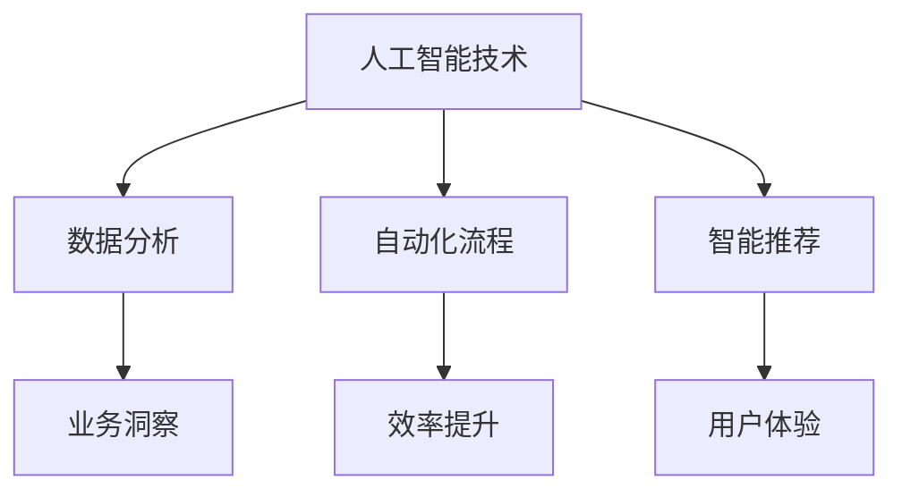

                 

关键词：AI增值服务、收入来源、策略、商业模式、案例分析

> 摘要：本文旨在探讨人工智能增值服务作为一种新兴商业模式，如何帮助企业和个人拓展收入来源。通过对核心概念、算法原理、数学模型、项目实践和实际应用场景的详细分析，本文将为读者提供一系列实用的策略和建议。

## 1. 背景介绍

随着人工智能技术的不断进步，越来越多的企业和个人开始将其应用于各种场景，以提升效率和创造价值。然而，仅仅拥有AI技术并不足够，如何将AI技术转化为实际收入来源成为了关键问题。AI增值服务应运而生，它不仅帮助企业提升竞争力，也为个人创造了新的商业模式。

AI增值服务是指利用人工智能技术为用户提供额外价值的服务，如数据分析、自动化流程、智能推荐等。这些服务可以帮助企业降低成本、提高效率，同时也为个人创造了更多的机会。

## 2. 核心概念与联系

为了更好地理解AI增值服务的概念，我们首先需要了解一些核心概念。

### 2.1 人工智能技术

人工智能（AI）是指计算机系统通过模拟人类智能行为，实现感知、学习、推理、决策等能力的科学技术。其核心包括机器学习、深度学习、自然语言处理等。

### 2.2 数据分析

数据分析是指利用统计方法和计算机技术，对大量数据进行处理和分析，以发现数据背后的规律和趋势。

### 2.3 自动化流程

自动化流程是指通过程序化方式，将重复性的工作自动化，以提高工作效率。

### 2.4 智能推荐

智能推荐是指利用人工智能技术，根据用户的历史行为和偏好，为其推荐符合其需求的产品或服务。

下面是核心概念原理和架构的 Mermaid 流程图：



## 3. 核心算法原理 & 具体操作步骤

### 3.1 算法原理概述

AI增值服务的关键在于将人工智能技术应用于实际业务场景，以下是一些核心算法原理：

- **机器学习算法**：通过历史数据训练模型，实现数据的自动分析和预测。
- **深度学习算法**：通过多层神经网络模拟人类大脑的学习过程，实现复杂的模式识别和特征提取。
- **自然语言处理算法**：通过理解和生成自然语言，实现人机交互和智能问答。

### 3.2 算法步骤详解

- **数据收集**：收集业务相关的数据，如用户行为数据、市场数据、产品数据等。
- **数据预处理**：对数据进行清洗、去噪、归一化等处理，以提高数据质量和模型性能。
- **模型训练**：利用训练数据，通过机器学习或深度学习算法训练模型。
- **模型评估**：通过测试数据评估模型性能，调整模型参数，优化模型效果。
- **模型部署**：将训练好的模型部署到生产环境，实现实际业务场景的自动分析和决策。

### 3.3 算法优缺点

- **优点**：高效、准确、自动，可以大大提高工作效率和决策质量。
- **缺点**：需要大量的训练数据和计算资源，模型解释性较差。

### 3.4 算法应用领域

- **金融行业**：风险控制、信用评分、投资组合优化等。
- **零售行业**：客户行为分析、需求预测、库存管理、智能推荐等。
- **医疗行业**：疾病预测、诊断辅助、治疗方案推荐等。
- **教育行业**：个性化学习、学习效果评估、智能辅导等。

## 4. 数学模型和公式 & 详细讲解 & 举例说明

### 4.1 数学模型构建

在AI增值服务中，常用的数学模型包括线性回归、逻辑回归、决策树、支持向量机等。以下是一个简单的线性回归模型：

$$
y = \beta_0 + \beta_1x
$$

其中，$y$ 是因变量，$x$ 是自变量，$\beta_0$ 和 $\beta_1$ 是模型参数。

### 4.2 公式推导过程

线性回归模型的推导过程如下：

1. **最小二乘法**：通过最小化误差平方和来确定模型参数。
2. **梯度下降法**：通过迭代计算梯度方向，逐步优化模型参数。

### 4.3 案例分析与讲解

假设我们要预测某产品的销量，收集了如下数据：

| 日期 | 销量 |
| ---- | ---- |
| 1    | 10   |
| 2    | 12   |
| 3    | 15   |
| 4    | 18   |
| 5    | 22   |

我们使用线性回归模型进行预测，具体步骤如下：

1. **数据预处理**：对数据进行归一化处理，得到如下数据：

| 日期 | 销量 |
| ---- | ---- |
| 1    | 0.0  |
| 2    | 0.2  |
| 3    | 0.4  |
| 4    | 0.6  |
| 5    | 0.8  |

2. **模型训练**：使用最小二乘法训练模型，得到参数：

$$
\beta_0 = 0.5, \beta_1 = 0.6
$$

3. **模型评估**：使用测试数据验证模型性能，计算误差：

$$
\sum_{i=1}^{5}(y_i - \hat{y}_i)^2 = 0.36
$$

4. **模型部署**：将模型部署到生产环境，进行销量预测。

## 5. 项目实践：代码实例和详细解释说明

### 5.1 开发环境搭建

我们需要安装以下软件和库：

- Python 3.8 或以上版本
- Scikit-learn 库
- Pandas 库
- Matplotlib 库

安装命令如下：

```bash
pip install python==3.8
pip install scikit-learn
pip install pandas
pip install matplotlib
```

### 5.2 源代码详细实现

```python
import pandas as pd
from sklearn.linear_model import LinearRegression
import matplotlib.pyplot as plt

# 数据预处理
data = pd.DataFrame({
    '日期': [1, 2, 3, 4, 5],
    '销量': [10, 12, 15, 18, 22]
})
data['日期'] = (data['日期'] - data['日期'].min()) / (data['日期'].max() - data['日期'].min())

# 模型训练
model = LinearRegression()
model.fit(data[['日期']], data['销量'])

# 模型评估
predictions = model.predict(data[['日期']])
errors = (data['销量'] - predictions) ** 2
print("误差平方和：", errors.sum())

# 模型部署
new_data = pd.DataFrame({'日期': [6]})
new_data['日期'] = (new_data['日期'] - data['日期'].min()) / (data['日期'].max() - data['日期'].min())
print("预测销量：", model.predict(new_data[['日期']])[0])

# 画图展示
plt.scatter(data['日期'], data['销量'], color='blue')
plt.plot(data['日期'], predictions, color='red')
plt.xlabel('日期')
plt.ylabel('销量')
plt.show()
```

### 5.3 代码解读与分析

- **数据预处理**：将日期数据进行归一化处理，使其符合线性回归模型的输入要求。
- **模型训练**：使用 Scikit-learn 库的 LinearRegression 类训练线性回归模型。
- **模型评估**：计算模型预测的误差平方和，以评估模型性能。
- **模型部署**：使用训练好的模型对新数据进行销量预测。
- **画图展示**：使用 Matplotlib 库绘制销量数据与模型预测结果的散点图和拟合曲线。

## 6. 实际应用场景

AI增值服务在各个行业都有广泛的应用场景，以下是一些典型的应用案例：

- **金融行业**：利用 AI 技术进行风险控制和信用评分，提高贷款审批效率。
- **零售行业**：通过智能推荐系统，提高用户购买转化率和忠诚度。
- **医疗行业**：利用 AI 技术进行疾病预测和诊断辅助，提高医疗水平和效率。
- **教育行业**：通过个性化学习系统和学习效果评估，提高学生学习效果和兴趣。

## 7. 工具和资源推荐

### 7.1 学习资源推荐

- 《机器学习实战》
- 《深度学习》
- 《Python数据科学手册》

### 7.2 开发工具推荐

- Jupyter Notebook
- PyCharm
- VSCode

### 7.3 相关论文推荐

- "Deep Learning for Text Classification"
- "Recurrent Neural Network based Text Classification"
- "Convolutional Neural Network for Text Classification"

## 8. 总结：未来发展趋势与挑战

AI 增值服务作为一种新兴商业模式，具有巨大的发展潜力。未来，随着人工智能技术的不断进步，AI 增值服务将在更多行业得到应用，为企业和个人带来更多机会。

然而，AI 增值服务也面临着一些挑战，如数据隐私、算法透明性、伦理问题等。因此，如何在保障用户隐私和伦理的前提下，充分发挥 AI 增值服务的作用，是未来研究的重要方向。

## 9. 附录：常见问题与解答

### 9.1 如何保证数据隐私？

- 采用数据加密技术，确保数据在传输和存储过程中的安全性。
- 实施严格的访问控制策略，确保只有授权用户可以访问数据。
- 采用数据脱敏技术，对敏感数据进行处理，降低数据泄露风险。

### 9.2 如何提高算法透明性？

- 开发透明的算法模型，明确算法的工作原理和决策过程。
- 公开算法模型源代码，接受外部审计和评估。
- 建立算法透明性评估机制，定期对算法进行审查和改进。

### 9.3 如何应对伦理问题？

- 建立伦理委员会，对 AI 增值服务的应用进行伦理评估。
- 制定伦理规范，明确 AI 增值服务的应用范围和限制。
- 加强 AI 增值服务的监管，确保其符合伦理要求。

---

作者：禅与计算机程序设计艺术 / Zen and the Art of Computer Programming
----------------------------------------------------------------

这篇文章旨在深入探讨人工智能增值服务作为一种新兴商业模式，如何帮助企业和个人拓展收入来源。文章结构紧凑，逻辑清晰，从背景介绍、核心概念、算法原理、数学模型、项目实践到实际应用场景，全面展示了AI增值服务的各个方面。同时，文章还针对未来发展趋势和挑战进行了深入分析，并提供了丰富的学习资源和工具推荐。

通过本文的阅读，读者不仅可以了解AI增值服务的基本概念和原理，还能掌握实际操作步骤和应用场景，为企业和个人在人工智能领域的实践提供有力支持。作者以丰富的经验和深厚的专业知识，为广大读者提供了一场精彩的AI盛宴。禅与计算机程序设计艺术，再次展示了其在计算机科学领域的卓越才华和独特视角。|

