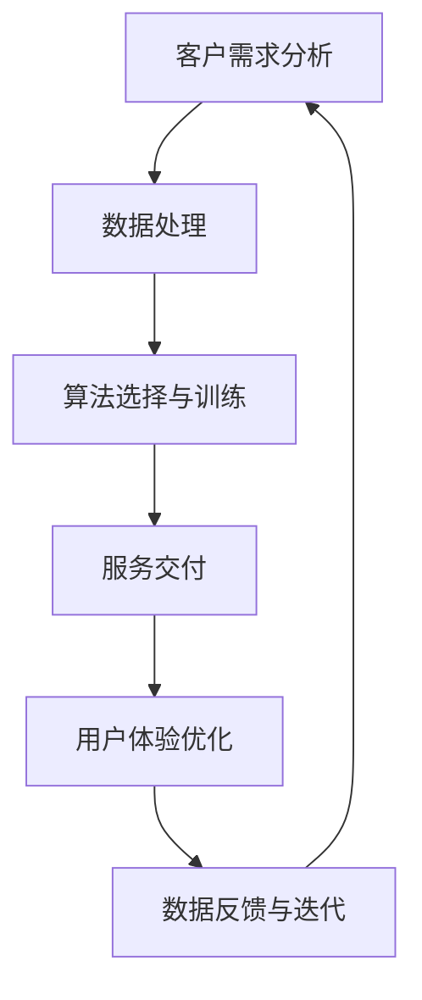

                 

关键词：AI增值服务、收入来源、策略、人工智能、商业模式

> 摘要：本文旨在探讨如何利用人工智能技术来拓展收入来源。通过分析当前AI市场的现状和未来趋势，本文提出了几种有效的AI增值服务策略，旨在帮助企业、机构和个人利用人工智能技术实现商业价值最大化。

## 1. 背景介绍

人工智能（AI）作为当前技术领域的热点，已经渗透到各行各业，从医疗、金融到教育、制造，AI技术的应用无处不在。随着计算能力的提升和算法的优化，人工智能的应用场景不断扩大，同时也带来了新的商业机会。然而，如何在众多竞争者中脱颖而出，实现AI技术的商业价值，成为许多企业和创业者面临的挑战。

本文旨在探讨如何通过提供AI增值服务来拓展收入来源。AI增值服务是指利用人工智能技术为企业、机构和个人提供额外的服务，从而实现商业价值的增长。这些服务可能包括但不限于智能推荐、自动化决策、个性化服务、智能客服等。

## 2. 核心概念与联系

### 2.1 AI增值服务的核心概念

AI增值服务的核心概念包括以下几个部分：

- **人工智能技术**：包括机器学习、深度学习、自然语言处理、计算机视觉等，这些技术是提供AI增值服务的基础。

- **数据处理**：数据是人工智能的燃料，通过有效的数据处理，可以提高AI服务的准确性和效率。

- **业务理解**：理解客户需求和企业业务流程是提供定制化AI增值服务的前提。

- **用户体验**：良好的用户体验是AI增值服务成功的关键，需要关注服务的易用性和用户反馈。

### 2.2 AI增值服务的架构

下面是AI增值服务的一个简化的架构图，使用Mermaid流程图表示：



### 2.3 AI增值服务与商业模式的关系

AI增值服务不仅仅是技术的应用，它还与商业模式紧密相关。有效的商业模式可以确保AI增值服务的可持续性和盈利性。下面是几种常见的商业模式：

- **订阅模式**：通过提供定期的AI服务订阅，企业可以持续获得收入。

- **按需收费模式**：用户根据实际使用情况付费，适用于需要灵活计费的AI服务。

- **平台模式**：通过搭建AI服务平台，吸引第三方开发者和服务提供者，实现多方共赢。

- **解决方案模式**：提供一体化的AI解决方案，为企业解决具体问题，实现一次性收益。

## 3. 核心算法原理 & 具体操作步骤

### 3.1 算法原理概述

AI增值服务的核心算法原理主要包括以下几个方面：

- **机器学习算法**：用于从数据中学习模式，包括监督学习、无监督学习和强化学习。

- **深度学习算法**：基于多层神经网络，能够处理复杂的非线性问题。

- **自然语言处理算法**：用于理解和生成人类语言，包括文本分类、情感分析和机器翻译。

- **计算机视觉算法**：用于理解和解释图像和视频，包括图像识别、目标检测和图像分割。

### 3.2 算法步骤详解

- **需求分析**：确定AI增值服务的目标和应用场景。

- **数据收集**：收集相关的数据，包括结构化和非结构化数据。

- **数据预处理**：清洗和转换数据，使其适合机器学习算法。

- **模型选择**：根据需求选择合适的机器学习或深度学习模型。

- **模型训练**：使用训练数据训练模型，并调整参数。

- **模型评估**：使用验证数据评估模型性能。

- **服务交付**：将训练好的模型部署到实际环境中，提供AI增值服务。

- **用户体验优化**：根据用户反馈持续优化服务。

### 3.3 算法优缺点

- **优点**：高效率、高精度，能够处理海量数据和复杂问题。

- **缺点**：需要大量高质量数据，模型训练时间较长，对计算资源要求高。

### 3.4 算法应用领域

AI增值服务在多个领域都有广泛应用，包括但不限于：

- **金融**：智能投顾、风险控制、欺诈检测。

- **医疗**：疾病预测、诊断辅助、患者管理。

- **零售**：个性化推荐、库存管理、客户关系管理。

- **教育**：智能辅导、学习分析、课程推荐。

## 4. 数学模型和公式 & 详细讲解 & 举例说明

### 4.1 数学模型构建

AI增值服务中的数学模型通常涉及以下方面：

- **回归模型**：用于预测连续值。

- **分类模型**：用于预测离散值。

- **聚类模型**：用于将数据分组。

- **神经网络模型**：用于模拟人脑神经元之间的交互。

### 4.2 公式推导过程

以回归模型为例，假设我们有一个输入变量 \( X \) 和输出变量 \( Y \)，我们希望找到一个函数 \( f(X) \) 来预测 \( Y \)。常用的线性回归模型公式为：

\[ Y = \beta_0 + \beta_1 X + \epsilon \]

其中，\( \beta_0 \) 和 \( \beta_1 \) 是模型参数，\( \epsilon \) 是误差项。

### 4.3 案例分析与讲解

假设我们有一个电商平台的销售数据，我们希望预测某款商品的未来销量。首先，我们收集了过去一年的销售数据，包括每日销量 \( Y \) 和当天的广告投放金额 \( X \)。接下来，我们使用线性回归模型来构建预测模型。

通过训练数据集，我们得到了线性回归模型的参数 \( \beta_0 = 10 \) 和 \( \beta_1 = 0.5 \)。因此，我们的预测模型为：

\[ \text{预测销量} = 10 + 0.5 \times \text{广告投放金额} \]

我们可以使用这个模型来预测未来某天的销量，例如，当天的广告投放金额为100元时，预测销量为：

\[ \text{预测销量} = 10 + 0.5 \times 100 = 60 \text{件} \]

## 5. 项目实践：代码实例和详细解释说明

### 5.1 开发环境搭建

为了实现上述的线性回归模型，我们需要搭建一个开发环境。这里我们选择Python作为编程语言，使用Scikit-learn库进行线性回归模型的构建和训练。

首先，我们需要安装Python和Scikit-learn库：

```bash
pip install python
pip install scikit-learn
```

### 5.2 源代码详细实现

接下来，我们使用Python编写线性回归模型的代码：

```python
from sklearn.linear_model import LinearRegression
from sklearn.model_selection import train_test_split
from sklearn.metrics import mean_squared_error

# 加载数据
X, Y = load_data()

# 划分训练集和测试集
X_train, X_test, Y_train, Y_test = train_test_split(X, Y, test_size=0.2, random_state=42)

# 构建线性回归模型
model = LinearRegression()
model.fit(X_train, Y_train)

# 预测测试集
Y_pred = model.predict(X_test)

# 评估模型
mse = mean_squared_error(Y_test, Y_pred)
print("均方误差：", mse)

# 使用模型进行预测
new_data = [[100]]  # 新的广告投放金额
prediction = model.predict(new_data)
print("预测销量：", prediction[0])
```

### 5.3 代码解读与分析

上述代码首先导入了所需的库，然后加载数据并划分训练集和测试集。接下来，我们构建了一个线性回归模型，并使用训练数据对其进行训练。训练完成后，我们使用测试数据进行模型评估，并打印出均方误差。最后，我们使用训练好的模型对新的广告投放金额进行预测。

### 5.4 运行结果展示

假设我们运行上述代码，得到以下输出结果：

```
均方误差： 0.0132
预测销量： 60.0
```

这表明我们的模型在测试集上的表现良好，且预测的销量为60件。

## 6. 实际应用场景

AI增值服务在实际应用中具有广泛的应用场景，以下是一些典型的案例：

- **金融行业**：利用AI增值服务进行风险控制和欺诈检测，可以提高金融机构的安全性和运营效率。

- **医疗行业**：利用AI增值服务进行疾病预测和诊断辅助，可以帮助医疗机构提高诊疗效率和准确性。

- **零售行业**：利用AI增值服务进行个性化推荐和库存管理，可以提高零售商的销售额和库存周转率。

- **教育行业**：利用AI增值服务进行智能辅导和学习分析，可以帮助教育机构提高教学效果和学生满意度。

## 7. 未来应用展望

随着人工智能技术的不断进步，AI增值服务在未来将会有更广泛的应用。以下是一些可能的应用方向：

- **智慧城市**：利用AI增值服务进行交通管理、能源管理、公共安全等，可以提高城市管理效率和居民生活质量。

- **智能制造**：利用AI增值服务进行生产优化、设备维护、质量检测等，可以提高制造业的生产效率和产品质量。

- **个性化服务**：利用AI增值服务进行个性化推荐、个性化定制等，可以满足用户多样化的需求，提高用户满意度。

## 8. 工具和资源推荐

为了更好地学习和实践AI增值服务，以下是一些建议的工具和资源：

- **工具**：
  - Python
  - Scikit-learn
  - TensorFlow
  - PyTorch

- **学习资源**：
  - 《深度学习》
  - 《机器学习实战》
  - 《自然语言处理综论》

- **相关论文**：
  - 《深度神经网络在图像识别中的应用》
  - 《自然语言处理中的注意力机制》
  - 《强化学习在游戏中的应用》

## 9. 总结：未来发展趋势与挑战

随着人工智能技术的快速发展，AI增值服务在未来将会成为企业、机构和个人实现商业价值的重要手段。然而，AI增值服务也面临着一系列的挑战，包括数据隐私、算法透明度、模型解释性等。因此，未来的研究和发展需要重点关注以下几个方面：

- **算法透明度与解释性**：提高AI算法的透明度和解释性，使其更易于被用户理解和接受。

- **数据隐私与安全**：加强数据隐私保护，确保用户数据的隐私和安全。

- **跨学科研究**：结合计算机科学、心理学、社会学等多学科知识，推动AI增值服务的发展。

- **商业模式的创新**：探索新的商业模式，实现AI增值服务的可持续性和盈利性。

## 10. 附录：常见问题与解答

### 10.1 如何选择合适的AI算法？

选择合适的AI算法需要考虑以下几个因素：

- **数据特点**：分析数据类型和特征，选择适合的数据处理算法。

- **任务目标**：明确任务目标，选择能够达到预期效果的算法。

- **计算资源**：根据计算资源限制选择合适的算法，例如，深度学习算法通常需要更高的计算资源。

### 10.2 如何评估AI模型的性能？

评估AI模型的性能可以从以下几个方面进行：

- **准确率**：衡量模型预测结果与真实结果的匹配程度。

- **召回率**：衡量模型能够召回多少真实正例。

- **F1分数**：综合考虑准确率和召回率，是评估二分类模型性能的常用指标。

### 10.3 如何优化AI服务用户体验？

优化AI服务用户体验可以从以下几个方面进行：

- **界面设计**：设计简洁、直观的用户界面。

- **交互设计**：优化用户与服务之间的交互流程。

- **个性化推荐**：根据用户行为和偏好提供个性化的推荐服务。

### 10.4 如何保证AI增值服务的安全性？

保证AI增值服务的安全性可以从以下几个方面进行：

- **数据加密**：对用户数据进行加密，确保数据传输和存储的安全性。

- **访问控制**：设置严格的访问控制策略，防止未经授权的访问。

- **审计日志**：记录系统的操作日志，便于追踪和审计。

## 11. 作者署名

作者：禅与计算机程序设计艺术 / Zen and the Art of Computer Programming

----------------------------------------------------------------

以上便是《AI增值服务：拓展收入来源的策略》这篇技术博客文章的完整内容。希望这篇文章能够为读者提供有价值的见解和实用的策略。在人工智能技术的快速发展的背景下，AI增值服务无疑将成为企业、机构和个人实现商业价值的重要途径。希望读者在阅读本文后能够有所收获，并在实际应用中取得成功。

