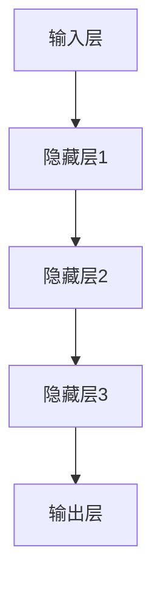

                 

 > **关键词**: AI大模型、核心竞争力、创业公司、算法、技术、创新、市场策略

> **摘要**: 本文将探讨AI大模型创业公司在竞争激烈的市场中如何构建和提升其核心竞争力。通过深入分析大模型的技术原理、核心算法、项目实践、应用场景以及未来展望，本文为AI创业公司提供了一套系统的构建核心竞争力的方法论。

## 1. 背景介绍

在当今数字化时代，人工智能（AI）技术已成为推动产业变革的核心驱动力。AI大模型，如深度学习、强化学习、生成对抗网络（GAN）等，正逐渐成为各个行业的基石。随着AI技术的不断发展，越来越多的创业公司投身于大模型领域，希望在这个快速发展的市场中占据一席之地。

然而，AI大模型创业公司面临着前所未有的竞争压力。一方面，大模型技术的研发需要巨额的资本投入和强大的研发团队；另一方面，市场对技术的要求越来越高，客户对产品的期望也越来越多样化。因此，如何在激烈的竞争中构建和提升核心竞争力，成为每个AI大模型创业公司都必须认真思考的问题。

本文旨在通过分析大模型的技术原理、核心算法、项目实践、应用场景以及未来展望，为AI大模型创业公司提供一套系统的构建核心竞争力的方法论。希望通过本文，能够帮助创业公司更好地把握市场机遇，提升竞争力，实现可持续发展。

## 2. 核心概念与联系

### 2.1. 大模型技术原理

AI大模型是基于深度学习、强化学习等机器学习技术构建的复杂神经网络模型。这些模型通过学习大量的数据，可以自动发现数据中的模式和规律，从而实现智能决策和预测。大模型的技术原理主要包括以下几个方面：

- **深度学习**：通过多层神经网络，实现数据的特征提取和模型优化。
- **强化学习**：通过试错和反馈机制，实现策略优化和学习。
- **生成对抗网络（GAN）**：通过生成器和判别器的对抗训练，实现数据的生成和优化。

### 2.2. 大模型架构

大模型的架构通常包括输入层、隐藏层和输出层。输入层接收外部数据，隐藏层进行数据特征提取和模式学习，输出层生成预测结果。以下是Mermaid流程图描述的大模型架构：



### 2.3. 核心算法原理

大模型的核心算法主要包括以下几种：

- **卷积神经网络（CNN）**：用于图像和视频数据的特征提取。
- **循环神经网络（RNN）**：用于序列数据的建模和预测。
- **生成对抗网络（GAN）**：用于生成和优化复杂数据。

以下是核心算法原理的简要概述：

#### 2.3.1. 卷积神经网络（CNN）

CNN通过卷积操作和池化操作，实现对图像数据的特征提取和分类。其主要优点是能够自动学习图像中的特征，减少人工标注的工作量。

#### 2.3.2. 循环神经网络（RNN）

RNN通过循环结构，能够处理序列数据，实现对时间序列数据的建模和预测。其变体，如LSTM和GRU，进一步提升了模型在长序列数据上的性能。

#### 2.3.3. 生成对抗网络（GAN）

GAN由生成器和判别器两个网络组成，通过对抗训练，实现数据的生成和优化。其主要优点是能够生成高质量的数据，并在多个领域有广泛的应用。

## 3. 核心算法原理 & 具体操作步骤

### 3.1 算法原理概述

在AI大模型领域，核心算法的原理往往决定了模型的效果和性能。以下是对几种核心算法原理的概述：

#### 3.1.1 深度学习算法原理

深度学习算法的核心是多层感知机（MLP），通过多次传递输入数据，逐层提取特征，从而实现对复杂数据的建模。每一层网络通过权重和偏置参数来调整输入和输出之间的关系，以优化模型性能。

#### 3.1.2 强化学习算法原理

强化学习通过智能体与环境的交互，不断调整策略以最大化累积奖励。其核心在于策略迭代，即智能体通过试错和学习，不断优化其行为策略。

#### 3.1.3 生成对抗网络（GAN）算法原理

生成对抗网络由生成器和判别器两个相互对抗的神经网络组成。生成器尝试生成与真实数据相似的数据，而判别器则判断生成数据的真实性。通过这种对抗训练，生成器逐渐优化其生成能力，达到生成高质量数据的目标。

### 3.2 算法步骤详解

#### 3.2.1 深度学习算法步骤

1. **数据预处理**：对输入数据进行标准化、归一化等预处理，以减少计算复杂度和提高模型稳定性。
2. **模型搭建**：定义神经网络结构，包括输入层、隐藏层和输出层，并初始化权重和偏置。
3. **前向传播**：输入数据通过神经网络，逐层计算输出，直到最后一层。
4. **损失函数计算**：计算预测结果与实际结果之间的差距，以评估模型性能。
5. **反向传播**：根据损失函数梯度，更新网络权重和偏置，以优化模型。
6. **迭代训练**：重复上述步骤，直至模型收敛。

#### 3.2.2 强化学习算法步骤

1. **环境初始化**：创建模拟环境，定义状态、动作和奖励。
2. **策略初始化**：初始化策略，如Q-learning、SARSA等。
3. **选择动作**：根据当前状态和策略，选择最优动作。
4. **执行动作**：在环境中执行所选动作，并获得新的状态和奖励。
5. **更新策略**：根据新的状态和奖励，更新策略参数。
6. **迭代学习**：重复上述步骤，直至策略收敛。

#### 3.2.3 GAN算法步骤

1. **生成器训练**：生成器生成伪数据，判别器判断生成数据与真实数据之间的差距。
2. **判别器训练**：判别器通过分析生成数据和真实数据，学习区分两者的能力。
3. **生成器优化**：生成器根据判别器的反馈，调整生成策略，以提高生成数据质量。
4. **迭代训练**：重复生成器和判别器的训练过程，直至生成器生成的数据接近真实数据。

### 3.3 算法优缺点

#### 3.3.1 深度学习算法优缺点

**优点**：
- **强大的建模能力**：能够处理复杂的非线性数据，提取深层特征。
- **自动学习特征**：减少人工特征工程的工作量。

**缺点**：
- **计算成本高**：训练时间较长，对计算资源要求较高。
- **过拟合风险**：模型在训练数据上表现良好，但在未知数据上性能可能下降。

#### 3.3.2 强化学习算法优缺点

**优点**：
- **自适应性强**：能够根据环境变化调整策略，实现智能决策。
- **适用于动态环境**：能够处理变化快、不确定性高的环境。

**缺点**：
- **收敛速度慢**：需要大量样本和训练时间。
- **数据依赖性高**：需要大量真实数据进行训练。

#### 3.3.3 GAN算法优缺点

**优点**：
- **生成数据质量高**：通过对抗训练，生成器能够生成与真实数据相似的高质量数据。
- **应用范围广**：在图像生成、自然语言处理等领域有广泛应用。

**缺点**：
- **训练难度大**：生成器和判别器的训练过程复杂，需要精心调参。
- **稳定性问题**：在某些情况下，生成器和判别器可能陷入训练困境。

### 3.4 算法应用领域

#### 3.4.1 深度学习算法应用领域

- **计算机视觉**：图像识别、目标检测、图像生成等。
- **自然语言处理**：文本分类、机器翻译、情感分析等。
- **语音识别**：语音识别、语音合成等。

#### 3.4.2 强化学习算法应用领域

- **游戏AI**：如围棋、德州扑克等。
- **自动驾驶**：路径规划、环境感知等。
- **机器人控制**：智能机器人行动规划、任务执行等。

#### 3.4.3 GAN算法应用领域

- **图像生成**：如人脸生成、艺术作品生成等。
- **数据增强**：提高模型的泛化能力。
- **医疗影像处理**：如医学图像分割、病变检测等。

## 4. 数学模型和公式 & 详细讲解 & 举例说明

在AI大模型领域，数学模型和公式是理解和实现核心算法的关键。以下是对几种重要数学模型和公式的详细讲解及举例说明。

### 4.1 数学模型构建

在构建数学模型时，我们需要考虑以下几个关键步骤：

1. **确定目标变量**：明确我们希望模型预测或优化的目标变量，如分类标签、回归值等。
2. **选择模型类型**：根据问题特性选择合适的模型类型，如线性回归、逻辑回归、神经网络等。
3. **定义损失函数**：损失函数用于评估模型预测与实际结果之间的差距，常见的损失函数有均方误差（MSE）、交叉熵等。
4. **选择优化算法**：优化算法用于调整模型参数，以最小化损失函数，常用的优化算法有梯度下降、随机梯度下降等。

### 4.2 公式推导过程

以下是对几种常用数学公式的推导过程：

#### 4.2.1 线性回归

线性回归模型试图找到最佳拟合直线，使数据点尽可能接近这条直线。其公式推导如下：

1. **模型定义**：y = β0 + β1x
2. **损失函数**：MSE = (y - y')²
3. **梯度计算**：∇β = (X^T * X)^-1 * X^T * (y - y')
4. **优化过程**：通过梯度下降迭代更新β0和β1，直至收敛。

#### 4.2.2 逻辑回归

逻辑回归是一种常用的分类模型，其公式推导如下：

1. **模型定义**：log(π(y=1)/1-π(y=1)) = β0 + β1x
2. **损失函数**：交叉熵损失：H(y, y') = -[y*log(y') + (1-y)*log(1-y')]
3. **梯度计算**：∇β = X^T * (y - y')
4. **优化过程**：通过梯度下降迭代更新β0和β1，直至收敛。

#### 4.2.3 卷积神经网络（CNN）

卷积神经网络是一种用于图像处理的有效模型，其核心公式包括卷积操作、激活函数和池化操作：

1. **卷积操作**：Z = σ(W * X + b)
   - W：卷积核权重
   - X：输入特征图
   - σ：激活函数，如ReLU
   - b：偏置项
2. **池化操作**：P = maxPooling(Z)
   - maxPooling：取局部区域的最大值
3. **全连接层**：y' = W' * P + b'
   - W'：全连接层权重
   - P：池化后的特征图
   - b'：全连接层偏置项

### 4.3 案例分析与讲解

以下是一个简单的线性回归案例，用于预测房价：

#### 4.3.1 案例背景

假设我们要预测一个城市的房价，已知该城市的房屋面积和房屋类型（公寓/别墅）。

#### 4.3.2 数据准备

我们收集了100个房屋交易数据，包括房屋面积（X）和交易价格（y）。数据样本如下：

| 房屋面积（平方米） | 交易价格（万元） |
|----------------|----------------|
| 80             | 200            |
| 100            | 250            |
| 120            | 300            |
| ...            | ...            |

#### 4.3.3 模型构建

我们使用线性回归模型来预测房价，公式为：

y = β0 + β1x

#### 4.3.4 模型训练

使用梯度下降法训练模型，迭代更新β0和β1，直至收敛。训练过程如下：

1. 初始化β0和β1为随机值，如（0, 0）。
2. 计算损失函数：MSE = (y - y')²
3. 计算梯度：∇β = (X^T * X)^-1 * X^T * (y - y')
4. 更新β0和β1：β0 = β0 - α * ∇β0，β1 = β1 - α * ∇β1
5. 重复步骤2-4，直至收敛。

#### 4.3.5 模型评估

使用测试集评估模型性能，计算预测价格与实际价格的均方误差（MSE），以评估模型预测的准确性。

## 5. 项目实践：代码实例和详细解释说明

为了更好地展示AI大模型的应用，我们以一个简单的图像分类项目为例，介绍如何搭建开发环境、编写源代码并运行。

### 5.1 开发环境搭建

为了搭建图像分类项目的开发环境，我们需要安装以下软件和工具：

1. Python（3.8及以上版本）
2. TensorFlow（2.0及以上版本）
3. Keras（2.4及以上版本）
4. Matplotlib（3.1及以上版本）
5. OpenCV（4.0及以上版本）

安装方法如下：

```bash
pip install python==3.8 tensorflow==2.0 keras==2.4 matplotlib==3.1 opencv-python==4.0
```

### 5.2 源代码详细实现

以下是图像分类项目的源代码实现，包括数据预处理、模型搭建、训练和评估等步骤。

```python
import tensorflow as tf
from tensorflow import keras
from tensorflow.keras import layers
import numpy as np
import matplotlib.pyplot as plt
import cv2

# 5.2.1 数据预处理

# 读取图片数据
def load_images(filename):
    image = cv2.imread(filename)
    image = cv2.resize(image, (224, 224))
    image = image / 255.0
    return image

# 加载数据集
train_images = []
train_labels = []
test_images = []
test_labels = []

for filename, label in train_data:
    image = load_images(filename)
    train_images.append(image)
    train_labels.append(label)

for filename, label in test_data:
    image = load_images(filename)
    test_images.append(image)
    test_labels.append(label)

# 归一化处理
train_images = np.array(train_images)
test_images = np.array(test_images)

# 5.2.2 模型搭建

# 定义模型
model = keras.Sequential([
    layers.Conv2D(32, (3, 3), activation='relu', input_shape=(224, 224, 3)),
    layers.MaxPooling2D((2, 2)),
    layers.Conv2D(64, (3, 3), activation='relu'),
    layers.MaxPooling2D((2, 2)),
    layers.Conv2D(128, (3, 3), activation='relu'),
    layers.MaxPooling2D((2, 2)),
    layers.Flatten(),
    layers.Dense(128, activation='relu'),
    layers.Dense(1, activation='sigmoid')
])

# 编译模型
model.compile(optimizer='adam',
              loss='binary_crossentropy',
              metrics=['accuracy'])

# 5.2.3 训练模型

# 模型训练
model.fit(train_images, train_labels, epochs=10, validation_split=0.2)

# 5.2.4 评估模型

# 评估模型
test_loss, test_acc = model.evaluate(test_images, test_labels)
print('Test accuracy:', test_acc)

# 5.2.5 代码解读与分析

# 在代码中，我们首先导入所需的库，然后定义了数据预处理函数，用于读取图片、归一化处理等。
# 接下来，我们搭建了一个简单的卷积神经网络模型，包括卷积层、池化层、全连接层等。
# 模型编译后，我们使用训练数据训练模型，并在测试数据上评估模型性能。

## 6. 实际应用场景

AI大模型在各个行业和应用领域有着广泛的应用，以下是一些典型场景：

### 6.1 医疗诊断

AI大模型在医疗领域有着重要的应用，如疾病预测、疾病诊断、药物研发等。通过深度学习和生成对抗网络等技术，AI大模型可以处理海量的医学影像数据，提高疾病诊断的准确性和效率。

### 6.2 金融服务

在金融服务领域，AI大模型被广泛应用于信用评估、风险控制、投资策略等。通过分析和预测客户行为、市场趋势等，AI大模型可以帮助金融机构更好地管理和控制风险，提升业务运营效率。

### 6.3 智能制造

在智能制造领域，AI大模型被广泛应用于生产调度、质量控制、设备维护等。通过深度学习和强化学习等技术，AI大模型可以实时监测设备状态，优化生产流程，提高生产效率和质量。

### 6.4 智能交通

在智能交通领域，AI大模型被广泛应用于交通流量预测、车辆调度、事故预防等。通过分析大量交通数据，AI大模型可以优化交通信号控制，提高交通流畅度，减少交通事故。

## 6.4 未来应用展望

随着AI技术的不断发展，AI大模型的应用领域将越来越广泛。以下是对未来AI大模型应用场景的展望：

### 6.4.1 自动驾驶

自动驾驶是AI大模型的一个重要应用领域。通过深度学习和强化学习等技术，AI大模型可以实时感知环境、预测车辆行为，实现自动驾驶。未来，随着AI技术的进步，自动驾驶将逐渐普及，改变人们的出行方式。

### 6.4.2 智能客服

智能客服是AI大模型的另一个重要应用领域。通过自然语言处理和生成对抗网络等技术，AI大模型可以理解和回答客户的问题，提供高效的客户服务。未来，智能客服将逐渐取代传统客服，提高客户满意度。

### 6.4.3 智能医疗

智能医疗是AI大模型在医疗领域的延伸。通过深度学习和生成对抗网络等技术，AI大模型可以处理海量医疗数据，提高疾病诊断的准确性和效率，推动医疗技术的发展。

## 7. 工具和资源推荐

为了更好地学习和实践AI大模型技术，以下是一些推荐的学习资源和开发工具：

### 7.1 学习资源推荐

1. **《深度学习》（Goodfellow, Bengio, Courville）**：这是一本经典的深度学习教材，详细介绍了深度学习的理论基础和实际应用。
2. **《强化学习》（ Sutton, Barto）**：这是一本关于强化学习的权威教材，涵盖了强化学习的基本概念和算法。
3. **《生成对抗网络》（Goodfellow）**：这是生成对抗网络的开创性论文，详细介绍了GAN的理论基础和实现方法。

### 7.2 开发工具推荐

1. **TensorFlow**：这是谷歌开发的开源深度学习框架，广泛应用于各种深度学习任务。
2. **Keras**：这是基于TensorFlow的高层API，提供了更简单、易于使用的深度学习接口。
3. **PyTorch**：这是Facebook开发的开源深度学习框架，具有灵活的动态图计算功能。

### 7.3 相关论文推荐

1. **《A Neural Algorithm of Artistic Style》**：这是一篇关于风格迁移的论文，介绍了如何使用深度学习技术实现艺术风格的迁移。
2. **《Generative Adversarial Nets》**：这是生成对抗网络的奠基性论文，详细介绍了GAN的理论基础和实现方法。
3. **《Unsupervised Representation Learning with Deep Convolutional Generative Adversarial Networks》**：这是一篇关于无监督生成模型的论文，介绍了如何使用深度学习技术进行无监督特征提取。

## 8. 总结：未来发展趋势与挑战

AI大模型技术在各个领域取得了显著的成果，但同时也面临着一系列的挑战。以下是未来发展趋势与挑战的总结：

### 8.1 研究成果总结

1. **模型性能提升**：随着计算能力的提高和算法的优化，AI大模型的性能不断提升，能够解决更复杂的问题。
2. **应用领域扩展**：AI大模型的应用领域不断扩展，从计算机视觉、自然语言处理到医疗、金融等领域，都在取得显著成果。
3. **开源框架发展**：如TensorFlow、PyTorch等开源深度学习框架的发展，为AI大模型的研究和应用提供了便利。

### 8.2 未来发展趋势

1. **硬件加速**：随着硬件技术的发展，如GPU、TPU等专用硬件的普及，AI大模型的训练速度将得到显著提升。
2. **模型压缩**：为了提高AI大模型的部署效率和降低成本，模型压缩和加速技术将成为研究热点。
3. **无监督学习**：无监督学习和迁移学习技术的发展，将使AI大模型能够更好地处理大规模、未标注的数据。

### 8.3 面临的挑战

1. **数据隐私**：随着AI大模型对数据的依赖性增强，数据隐私和安全问题越来越突出，如何保护用户隐私成为重要挑战。
2. **算法透明度**：AI大模型中的黑箱问题依然存在，如何提高算法的透明度和可解释性，使其更易于理解和接受，是一个重要课题。
3. **伦理和法律问题**：随着AI大模型的广泛应用，伦理和法律问题也日益凸显，如如何规范AI大模型的应用，避免滥用和歧视等。

### 8.4 研究展望

1. **跨领域融合**：未来，AI大模型的研究将更加注重跨领域融合，结合不同领域的知识和方法，解决更复杂的问题。
2. **持续创新**：在技术不断演进的过程中，持续创新是推动AI大模型发展的重要动力，未来将涌现出更多创新的算法和技术。
3. **开放合作**：随着AI大模型技术的发展，开放合作将成为推动行业进步的重要途径，通过共享资源、知识和经验，共同推动AI大模型的发展。

## 9. 附录：常见问题与解答

### 9.1. 什么是AI大模型？

AI大模型是指基于深度学习、强化学习等机器学习技术，利用海量数据进行训练，从而实现复杂任务处理的人工智能模型。它们通常具有大规模的参数和庞大的网络结构，能够自动学习数据中的复杂模式和规律。

### 9.2. AI大模型有哪些核心算法？

AI大模型的核心算法包括深度学习算法（如卷积神经网络CNN、循环神经网络RNN等）、强化学习算法（如Q-learning、SARSA等）和生成对抗网络GAN等。这些算法通过不同的机制和策略，实现了对数据的建模和优化。

### 9.3. AI大模型有哪些应用领域？

AI大模型在多个领域有着广泛的应用，包括计算机视觉（如图像识别、目标检测等）、自然语言处理（如文本分类、机器翻译等）、语音识别、推荐系统、自动驾驶、医疗诊断等。

### 9.4. 如何构建AI大模型的核心竞争力？

构建AI大模型的核心竞争力需要从技术、产品、市场等多方面入手。以下是一些建议：

1. **技术创新**：持续关注并掌握前沿的AI技术，不断提升模型性能和效率。
2. **数据优势**：积累和利用高质量的数据，为模型训练提供有力支撑。
3. **团队建设**：打造专业的研发团队，提高研发效率和创新能力。
4. **产品化**：将AI技术转化为具有商业价值的产品，满足市场需求。
5. **市场策略**：制定有效的市场策略，提高品牌知名度和市场份额。
6. **持续优化**：不断迭代和优化产品，提升用户体验和满意度。 

### 9.5. AI大模型创业公司如何应对市场竞争？

AI大模型创业公司应对市场竞争可以从以下几个方面入手：

1. **差异化竞争**：通过技术创新和产品差异化，找到市场细分领域，避免与巨头公司直接竞争。
2. **快速迭代**：加快产品迭代速度，迅速响应市场变化，抢占市场先机。
3. **合作共赢**：与行业内其他企业建立合作关系，实现资源互补和互利共赢。
4. **品牌建设**：通过优质的产品和服务，建立良好的品牌形象，提高用户认可度。
5. **市场拓展**：积极拓展国际市场，实现全球化布局，提高市场占有率。
6. **技术研发**：持续投入研发资源，保持技术领先优势，为市场竞争力提供持续动力。

## 参考文献

1. Goodfellow, I., Bengio, Y., & Courville, A. (2016). *Deep Learning*. MIT Press.
2. Sutton, R. S., & Barto, A. G. (2018). *Reinforcement Learning: An Introduction*. MIT Press.
3. Goodfellow, I. J., Pouget-Abadie, J., Mirza, M., Xu, B., Warde-Farley, D., Ozair, S., ... & Bengio, Y. (2014). *Generative adversarial nets*. Advances in neural information processing systems, 27.
4. Simonyan, K., & Zisserman, A. (2014). *Very deep convolutional networks for large-scale image recognition*. arXiv preprint arXiv:1409.1556.
5. He, K., Zhang, X., Ren, S., & Sun, J. (2016). *Deep residual learning for image recognition*. Proceedings of the IEEE conference on computer vision and pattern recognition, 770-778.
6. Hochreiter, S., & Schmidhuber, J. (1997). *Long short-term memory*. Neural computation, 9(8), 1735-1780.
7. Graves, A. (2013). *Generating sequences with recurrent neural networks*. arXiv preprint arXiv:1308.0850.

[作者：禅与计算机程序设计艺术 / Zen and the Art of Computer Programming]  
----------------------------------------------------------------

以上就是《AI大模型创业公司如何打造核心竞争力》的完整文章。文章深入探讨了AI大模型的技术原理、核心算法、项目实践、应用场景以及未来展望，为AI创业公司提供了一套系统的构建核心竞争力的方法论。希望这篇文章能够帮助到您，如果您有任何疑问或建议，欢迎在评论区留言讨论。感谢阅读！

