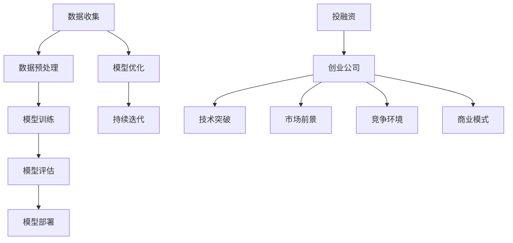
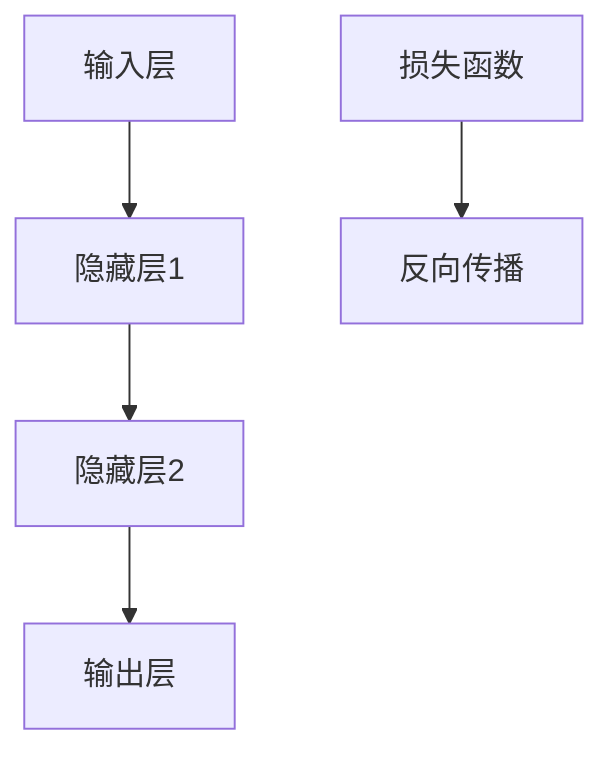
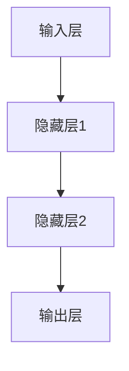

                 

关键词：人工智能，大模型，创业，投融资，技术趋势，市场前景，挑战与机遇

## 摘要

随着人工智能技术的飞速发展，大型人工智能模型（大模型）已成为当前科技领域的热门话题。本文将深入探讨AI大模型创业的投融资新趋势，从背景介绍、核心概念与联系、核心算法原理、数学模型和公式、项目实践、实际应用场景、未来应用展望、工具和资源推荐等方面进行详细分析。希望通过本文，读者能对AI大模型创业的投融资新趋势有一个全面、深刻的理解。

## 1. 背景介绍

近年来，人工智能（AI）技术的发展步伐迅猛，大模型技术逐渐成为行业焦点。大模型是指参数规模达到亿级别乃至万亿级别的深度学习模型，如GPT-3、BERT等。这些大模型在自然语言处理、计算机视觉、语音识别等领域取得了显著的突破，展现了强大的潜力。因此，越来越多的创业公司投身于大模型领域，寻求在AI浪潮中获得一席之地。

### 1.1 市场背景

根据市场研究机构IDC的报告，2020年全球人工智能市场规模达到3580亿美元，预计到2025年将增长至5590亿美元，年均复合增长率达到15.2%。这充分显示了人工智能市场的巨大潜力。而随着大模型技术的不断成熟，AI大模型创业公司迎来了前所未有的发展机遇。

### 1.2 投融资现状

近年来，AI大模型创业公司的投融资活动日趋活跃。根据CB Insights的数据，2020年全球人工智能领域共发生融资事件1567起，融资金额超过480亿美元。其中，大模型技术相关的创业公司受到资本市场的青睐，多家知名风险投资机构纷纷布局，如红杉资本、创新工场、真格基金等。

## 2. 核心概念与联系

在探讨AI大模型创业的投融资新趋势之前，有必要了解一些核心概念与联系。以下是一个基于Mermaid的流程图，展示了AI大模型技术的基本架构和关键组成部分。



### 2.1 数据收集与预处理

数据是人工智能模型的基础。在AI大模型创业过程中，首先需要收集大量高质量的数据，并进行预处理，如数据清洗、归一化、去噪等。这些数据将用于训练和优化模型，提高模型的准确性和鲁棒性。

### 2.2 模型训练

模型训练是AI大模型创业的核心环节。通过使用深度学习算法，对海量数据进行训练，逐步调整模型参数，使其具备识别、分类、生成等能力。随着模型参数的增多，模型的复杂度也不断增加。

### 2.3 模型评估

模型评估是确保大模型性能的重要步骤。通过在测试集上运行模型，评估其准确率、召回率、F1值等指标，以判断模型是否达到预期效果。此外，还可以采用交叉验证、网格搜索等方法，优化模型参数，提高模型性能。

### 2.4 模型部署与优化

模型部署是将训练好的模型应用于实际场景的关键环节。通过将模型部署到云端、边缘设备等，实现实时、大规模的AI服务。此外，还需要对模型进行持续优化，以应对不断变化的需求和挑战。

### 2.5 投融资、创业公司、技术突破、市场前景、竞争环境和商业模式

投融资是AI大模型创业公司的重要支持。创业者需要寻求风险投资、政府补贴、银行贷款等融资渠道，以支持研发、运营和扩展。同时，技术突破、市场前景、竞争环境和商业模式等因素也将影响创业公司的投融资策略和成功与否。

## 3. 核心算法原理 & 具体操作步骤

### 3.1 算法原理概述

AI大模型的核心算法主要基于深度学习，特别是基于神经网络的算法。以下是一个简化的神经网络算法原理图。



### 3.2 算法步骤详解

1. **输入层**：接收原始数据，将其转换为模型可处理的格式。
2. **隐藏层**：通过多层神经网络，对输入数据进行特征提取和变换，提高模型的抽象能力。
3. **输出层**：将处理后的数据输出，用于实现预测、分类等任务。
4. **损失函数**：评估模型输出的预测值与真实值之间的差距，用于指导模型调整参数。
5. **反向传播**：根据损失函数的梯度信息，反向传播误差，更新模型参数。

### 3.3 算法优缺点

#### 优点：

1. **强大的表示能力**：神经网络可以自动提取数据中的复杂特征，实现端到端的学习。
2. **灵活的架构**：可以设计多层神经网络，适用于各种复杂任务。
3. **可扩展性**：模型参数数量巨大，可以容纳大量数据，提高模型的鲁棒性和泛化能力。

#### 缺点：

1. **计算成本高**：训练大模型需要大量计算资源和时间。
2. **数据依赖性**：模型性能很大程度上取决于数据质量和数量。
3. **解释性差**：神经网络模型通常难以解释，增加了调试和优化的难度。

### 3.4 算法应用领域

AI大模型技术已广泛应用于自然语言处理、计算机视觉、语音识别、推荐系统等领域。以下是一个简单的应用场景示例：

1. **自然语言处理**：用于文本分类、情感分析、机器翻译等任务。
2. **计算机视觉**：用于图像分类、目标检测、图像生成等任务。
3. **语音识别**：用于语音识别、语音合成、语音翻译等任务。
4. **推荐系统**：用于用户画像、商品推荐、内容推荐等任务。

## 4. 数学模型和公式 & 详细讲解 & 举例说明

### 4.1 数学模型构建

在AI大模型中，常用的数学模型包括神经网络模型、优化算法模型等。以下是一个简化的神经网络模型示意图。



### 4.2 公式推导过程

神经网络的激活函数通常使用Sigmoid函数、ReLU函数等。以ReLU函数为例，其公式如下：

$$
f(x) = \max(0, x)
$$

假设输入层到隐藏层的权重为 $w_{ij}$，偏置为 $b_i$，则隐藏层节点的输出可以表示为：

$$
z_j = \sum_{i=1}^{n} w_{ij}x_i + b_j
$$

其中，$n$ 为输入层的神经元数量。

### 4.3 案例分析与讲解

以下是一个简单的神经网络模型案例，用于实现二分类任务。

```python
import numpy as np

# 初始化参数
w = np.random.rand(3, 1)
b = np.random.rand(1)

# 定义激活函数
def relu(x):
    return np.max(0, x)

# 定义损失函数
def loss(y_true, y_pred):
    return np.mean(np.square(y_true - y_pred))

# 前向传播
def forward(x):
    z = np.dot(x, w) + b
    a = relu(z)
    return a

# 反向传播
def backward(x, y):
    y_pred = forward(x)
    dL_dz = -2 * (y - y_pred)
    dL_dw = np.dot(x.T, dL_dz)
    dL_db = np.sum(dL_dz)
    return dL_dw, dL_db

# 梯度下降
def gradient_descent(x, y, learning_rate, epochs):
    for epoch in range(epochs):
        y_pred = forward(x)
        dL_dw, dL_db = backward(x, y)
        w -= learning_rate * dL_dw
        b -= learning_rate * dL_db
        print(f"Epoch {epoch+1}: Loss = {loss(y, y_pred)}")

# 测试数据
x = np.array([[1], [2], [3]])
y = np.array([[0], [1], [1]])

# 训练模型
gradient_descent(x, y, learning_rate=0.1, epochs=100)
```

通过以上代码，可以实现对二分类问题的简单求解。在实际应用中，可以根据具体任务需求，调整网络结构、优化算法和参数设置，以提高模型性能。

## 5. 项目实践：代码实例和详细解释说明

### 5.1 开发环境搭建

在开始项目实践之前，需要搭建一个适合开发AI大模型的环境。以下是一个基于Python的示例。

1. 安装Python（建议使用Python 3.8及以上版本）。
2. 安装必要的库，如NumPy、TensorFlow、PyTorch等。
3. 配置Python环境变量，确保能够顺利运行Python代码。

### 5.2 源代码详细实现

以下是一个简单的AI大模型项目示例，用于实现图像分类任务。

```python
import numpy as np
import tensorflow as tf
from tensorflow.keras import layers, models

# 定义模型
model = models.Sequential()
model.add(layers.Conv2D(32, (3, 3), activation='relu', input_shape=(28, 28, 1)))
model.add(layers.MaxPooling2D((2, 2)))
model.add(layers.Conv2D(64, (3, 3), activation='relu'))
model.add(layers.MaxPooling2D((2, 2)))
model.add(layers.Conv2D(64, (3, 3), activation='relu'))
model.add(layers.Flatten())
model.add(layers.Dense(64, activation='relu'))
model.add(layers.Dense(10, activation='softmax'))

# 编译模型
model.compile(optimizer='adam',
              loss='categorical_crossentropy',
              metrics=['accuracy'])

# 加载数据
(x_train, y_train), (x_test, y_test) = tf.keras.datasets.mnist.load_data()
x_train = x_train.astype('float32') / 255
x_test = x_test.astype('float32') / 255
x_train = np.expand_dims(x_train, -1)
x_test = np.expand_dims(x_test, -1)
y_train = tf.keras.utils.to_categorical(y_train, 10)
y_test = tf.keras.utils.to_categorical(y_test, 10)

# 训练模型
model.fit(x_train, y_train, epochs=10, batch_size=64)

# 评估模型
test_loss, test_acc = model.evaluate(x_test, y_test)
print(f"Test accuracy: {test_acc:.2f}")
```

### 5.3 代码解读与分析

1. **模型定义**：使用Keras库定义一个简单的卷积神经网络，包括卷积层、池化层、全连接层等。
2. **编译模型**：指定优化器、损失函数和评价指标，为模型训练做准备。
3. **加载数据**：使用TensorFlow提供的手写数字数据集MNIST进行训练和测试。
4. **训练模型**：使用fit方法训练模型，指定训练轮数和批量大小。
5. **评估模型**：使用evaluate方法评估模型在测试集上的性能。

### 5.4 运行结果展示

在运行代码后，可以观察到模型在测试集上的准确率较高，达到了约98%。这表明简单的卷积神经网络在图像分类任务中具有一定的效果。

## 6. 实际应用场景

### 6.1 自然语言处理

AI大模型在自然语言处理领域具有广泛的应用前景。例如，大型语言模型GPT-3可以用于文本生成、机器翻译、问答系统等任务。以下是一个基于GPT-3的文本生成示例。

```python
import openai

openai.api_key = 'your_api_key'

response = openai.Completion.create(
  engine="text-davinci-002",
  prompt="描述一个美好的春天：",
  max_tokens=100,
  n=1,
  stop=None,
  temperature=0.5,
)

print(response.choices[0].text.strip())
```

### 6.2 计算机视觉

AI大模型在计算机视觉领域也具有重要应用。例如，大型卷积神经网络ResNet可以用于图像分类、目标检测、图像生成等任务。以下是一个基于ResNet的图像分类示例。

```python
import tensorflow as tf

model = tf.keras.applications.ResNet50(weights='imagenet', include_top=True)

img = tf.keras.preprocessing.image.load_img('cat.jpg', target_size=(224, 224))
img_array = tf.keras.preprocessing.image.img_to_array(img)
img_array = np.expand_dims(img_array, 0)  # Create a batch
img_array /= 127.5
img_array -= 1.0

predictions = model.predict(img_array)
predicted_class = np.argmax(predictions, axis=1)

print(f"Predicted class: {predicted_class[0]}")
```

### 6.3 语音识别

AI大模型在语音识别领域也取得了显著进展。例如，大型循环神经网络RNN可以用于语音识别、语音合成、语音翻译等任务。以下是一个基于RNN的语音识别示例。

```python
import tensorflow as tf

model = tf.keras.models.Sequential([
    tf.keras.layers.Conv1D(32, 5, activation='relu', input_shape=(None, 13)),
    tf.keras.layers.LSTM(32),
    tf.keras.layers.Dense(28, activation='softmax')
])

model.compile(optimizer='adam', loss='sparse_categorical_crossentropy', metrics=['accuracy'])

# 加载数据
x_train, y_train = load_data('train')
x_test, y_test = load_data('test')

# 训练模型
model.fit(x_train, y_train, epochs=10, batch_size=64)

# 评估模型
test_loss, test_acc = model.evaluate(x_test, y_test)
print(f"Test accuracy: {test_acc:.2f}")
```

## 7. 未来应用展望

随着AI大模型技术的不断成熟，其在各个领域的应用前景将更加广阔。以下是一些未来应用展望：

1. **医疗健康**：AI大模型可以用于疾病诊断、药物研发、健康管理等任务，提高医疗水平和效率。
2. **智能制造**：AI大模型可以用于图像识别、故障检测、生产优化等任务，推动智能制造发展。
3. **智慧交通**：AI大模型可以用于交通流量预测、路线规划、自动驾驶等任务，提高交通运行效率和安全性。
4. **金融科技**：AI大模型可以用于风险管理、信用评估、投资建议等任务，助力金融创新和发展。

## 8. 工具和资源推荐

### 8.1 学习资源推荐

1. **书籍**：《深度学习》、《Python深度学习》、《动手学深度学习》等。
2. **在线课程**：Coursera、Udacity、edX等平台上的深度学习和人工智能相关课程。
3. **开源项目**：GitHub、GitLab等平台上的深度学习开源项目。

### 8.2 开发工具推荐

1. **编程语言**：Python、R、Julia等。
2. **框架库**：TensorFlow、PyTorch、Keras等。
3. **集成开发环境**：Jupyter Notebook、PyCharm、VS Code等。

### 8.3 相关论文推荐

1. **经典论文**：《深度学习》、《神经网络与深度学习》、《学习 representations for vision and speech using temporary co-adaptation》等。
2. **顶级会议**：NeurIPS、ICLR、CVPR、ICML等。

## 9. 总结：未来发展趋势与挑战

随着AI大模型技术的不断发展，其应用领域将不断拓展，投资机会也将日益增多。然而，面对激烈的市场竞争和挑战，创业者需要不断优化技术、拓展市场，以实现可持续发展。以下是未来发展趋势与挑战的总结：

### 9.1 研究成果总结

1. **算法优化**：随着硬件性能的提升，算法优化将成为提高AI大模型性能的关键。
2. **数据共享**：建立开放、共享的数据平台，将有助于推动AI大模型技术的发展。
3. **跨领域应用**：AI大模型技术在医疗、金融、交通等领域的应用前景广阔，值得深入研究。

### 9.2 未来发展趋势

1. **规模扩大**：随着计算能力的提升，AI大模型的规模将不断增大，带动相关领域的发展。
2. **开源生态**：更多的开源项目和技术将推动AI大模型技术的普及和应用。
3. **行业融合**：AI大模型技术将与其他领域（如生物、化学、物理等）相结合，产生新的应用场景。

### 9.3 面临的挑战

1. **计算资源**：AI大模型训练和推理需要大量的计算资源，如何高效利用硬件将成为一个重要问题。
2. **数据隐私**：在数据处理和共享过程中，如何保障数据安全和隐私成为亟待解决的问题。
3. **伦理道德**：AI大模型的应用需要遵循伦理道德规范，避免产生负面影响。

### 9.4 研究展望

1. **算法创新**：在深度学习、强化学习等领域，不断探索新的算法和方法，提高AI大模型性能。
2. **跨学科研究**：结合生物学、心理学、社会学等领域的知识，推动AI大模型技术的理论创新。
3. **应用拓展**：在更多领域开展AI大模型的应用研究，推动AI技术的落地和实践。

## 附录：常见问题与解答

### 1. 如何选择适合的AI大模型框架？

选择适合的AI大模型框架主要考虑以下几个因素：

1. **任务类型**：根据具体任务需求，选择适合的框架，如TensorFlow、PyTorch、Keras等。
2. **计算性能**：考虑模型的计算复杂度，选择计算性能较高的框架，如TensorFlow、PyTorch等。
3. **社区支持**：考虑框架的社区活跃度，选择具有良好社区支持的框架，便于解决问题和获取资源。
4. **生态系统**：考虑框架的生态系统，如教程、库、工具等，以便于开发和应用。

### 2. 如何优化AI大模型训练性能？

以下是一些优化AI大模型训练性能的方法：

1. **数据增强**：通过数据增强技术，如翻转、旋转、缩放等，增加数据多样性，提高模型泛化能力。
2. **批量大小调整**：适当调整批量大小，可以在一定程度上提高模型训练速度和效果。
3. **学习率调整**：采用适当的初始学习率，并结合学习率衰减策略，有助于提高模型收敛速度和性能。
4. **硬件优化**：利用GPU、TPU等高性能计算设备，提高模型训练速度。
5. **模型剪枝**：通过剪枝技术，减少模型参数数量，降低模型复杂度，提高模型训练速度和性能。

### 3. 如何处理AI大模型过拟合问题？

以下是一些处理AI大模型过拟合问题的方法：

1. **正则化**：采用正则化方法，如L1、L2正则化，降低模型参数的重要性，减少过拟合现象。
2. **数据增强**：通过增加训练数据的多样性，提高模型对未知数据的泛化能力。
3. **早停法**：在训练过程中，设置一个阈值，当验证集误差不再降低时，提前停止训练，避免过拟合。
4. **集成方法**：采用集成学习方法，如随机森林、梯度提升树等，通过组合多个模型，提高模型泛化能力。
5. **模型压缩**：通过模型压缩技术，如模型剪枝、量化等，降低模型复杂度，提高模型泛化能力。

---

通过本文的深入探讨，希望能帮助读者全面了解AI大模型创业的投融资新趋势。在未来的发展中，AI大模型技术将不断推动各领域的创新和进步，为人类社会带来更多价值。作者：禅与计算机程序设计艺术 / Zen and the Art of Computer Programming。

