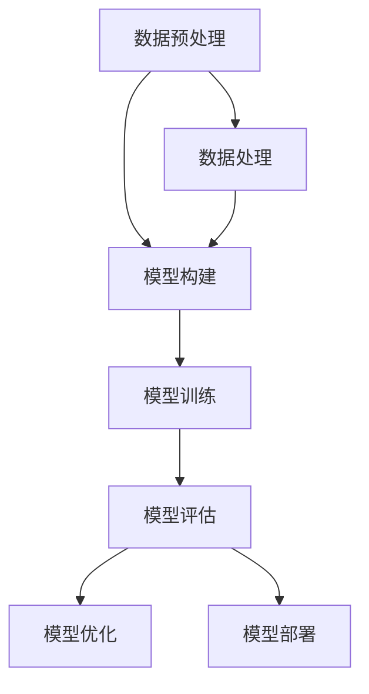

                 

关键词：AI大模型、创业、融资策略、风险投资、商业计划、市场分析、技术优势、投资回报、股权结构、募资方式、退出机制。

> 摘要：本文旨在深入分析AI大模型创业项目的融资策略。通过梳理市场趋势、技术挑战和商业前景，本文探讨了如何设计有效的融资策略，以吸引风险投资，推动AI大模型创业项目的成功落地。

## 1. 背景介绍

人工智能（AI）作为现代科技的引擎，正不断推动着各行各业的变革。其中，AI大模型作为人工智能的核心技术之一，凭借其强大的数据处理和智能决策能力，吸引了大量创业者和投资者的关注。AI大模型创业项目不仅涉及复杂的技术研发，还需要面对激烈的市场竞争和复杂的融资环境。因此，如何制定有效的融资策略，成为AI大模型创业成功的关键。

本文将从以下几个方面展开讨论：

1. **AI大模型创业的市场前景和挑战**：分析AI大模型技术的市场趋势、应用场景和潜在风险。
2. **核心概念与联系**：介绍AI大模型的基本原理和技术架构，并通过Mermaid流程图展示关键环节。
3. **融资策略分析**：探讨融资策略的制定原则、具体方法和注意事项。
4. **数学模型和公式**：阐述支持融资决策的数学模型和公式，并通过案例分析进行说明。
5. **项目实践**：提供实际代码实例，详细解释实现过程和关键步骤。
6. **实际应用场景**：讨论AI大模型在各个行业中的应用案例和未来展望。
7. **工具和资源推荐**：推荐相关学习资源和开发工具。
8. **总结与展望**：总结研究成果，探讨未来发展趋势和面临的挑战。

## 2. 核心概念与联系

### 2.1 AI大模型的基本原理

AI大模型（Large-scale AI Model）是基于深度学习框架构建的复杂神经网络模型，能够处理大规模数据并实现高效的智能决策。其核心原理包括以下几个方面：

1. **多层神经网络**：通过增加神经网络的层数和神经元数量，增强模型的复杂度，使其能够捕捉数据中的高维特征。
2. **大规模数据训练**：利用海量数据进行训练，提高模型的泛化能力和鲁棒性。
3. **优化算法**：采用高效的学习算法和优化技术，如梯度下降、随机梯度下降、Adam等，以降低模型的训练时间和收敛速度。

### 2.2 技术架构

AI大模型的技术架构主要包括以下几个关键环节：

1. **数据预处理**：包括数据清洗、数据归一化、数据增强等，为模型训练提供高质量的数据输入。
2. **模型构建**：通过定义网络结构、选择合适的激活函数和损失函数，构建用于训练的神经网络模型。
3. **模型训练**：利用大规模数据集进行模型的训练，通过反向传播算法不断调整模型参数，优化模型性能。
4. **模型评估与优化**：通过交叉验证、混淆矩阵、ROC曲线等指标对模型进行评估，并根据评估结果对模型进行调整和优化。

### 2.3 Mermaid流程图

以下是AI大模型的Mermaid流程图，展示了上述关键环节的相互关系：



## 3. 核心算法原理 & 具体操作步骤

### 3.1 算法原理概述

AI大模型的核心算法原理是基于深度学习的多层神经网络模型。该模型通过输入层、隐藏层和输出层的多层组合，实现对数据的逐层抽象和特征提取。具体操作步骤如下：

1. **数据预处理**：对原始数据进行清洗、归一化和增强，确保数据质量。
2. **模型构建**：定义网络结构，选择合适的激活函数和损失函数，构建用于训练的神经网络模型。
3. **模型训练**：利用大规模数据集进行模型的训练，通过反向传播算法不断调整模型参数，优化模型性能。
4. **模型评估与优化**：通过交叉验证、混淆矩阵、ROC曲线等指标对模型进行评估，并根据评估结果对模型进行调整和优化。

### 3.2 算法步骤详解

1. **数据预处理**：

   - 数据清洗：去除数据中的噪声和异常值。
   - 数据归一化：将数据缩放到相同的尺度，以便神经网络模型进行训练。
   - 数据增强：通过随机旋转、缩放、裁剪等操作，增加数据多样性，提高模型的泛化能力。

2. **模型构建**：

   - 定义输入层：根据数据特征和任务需求，确定输入层的维度。
   - 定义隐藏层：根据模型复杂度，添加多个隐藏层，选择合适的激活函数，如ReLU、Sigmoid、Tanh等。
   - 定义输出层：根据任务类型，选择合适的输出层结构，如分类任务的softmax层。
   - 选择损失函数：根据任务类型，选择合适的损失函数，如交叉熵损失、均方误差损失等。

3. **模型训练**：

   - 初始化模型参数：随机初始化模型参数。
   - 前向传播：将输入数据传递到神经网络中，计算输出结果。
   - 反向传播：计算输出结果与真实值之间的误差，通过梯度下降算法更新模型参数。
   - 调整学习率：根据模型训练的收敛速度，调整学习率，防止模型过拟合或欠拟合。

4. **模型评估与优化**：

   - 交叉验证：通过将数据集划分为训练集和验证集，对模型进行多次训练和验证，评估模型性能。
   - 混淆矩阵：分析模型预测结果和真实结果之间的差异，评估模型的分类准确率。
   - ROC曲线：通过计算模型在不同阈值下的召回率和准确率，评估模型的分类能力。
   - 模型优化：根据评估结果，对模型进行调整和优化，提高模型性能。

### 3.3 算法优缺点

**优点**：

- **强大的数据处理能力**：AI大模型能够处理大规模、高维度的数据，实现高效的智能决策。
- **自适应性强**：通过不断优化模型参数，AI大模型能够适应不同场景和任务的需求。
- **泛化能力强**：通过大规模数据训练，AI大模型具有较好的泛化能力，能够应用于不同领域。

**缺点**：

- **计算资源消耗大**：AI大模型训练过程需要大量的计算资源和时间，对硬件设备要求较高。
- **数据依赖性较强**：AI大模型的性能依赖于训练数据的质量和数量，数据质量和多样性对模型性能有重要影响。
- **过拟合风险**：如果模型过于复杂，可能导致过拟合现象，影响模型在实际应用中的性能。

### 3.4 算法应用领域

AI大模型在各个领域都有广泛的应用，包括但不限于：

- **金融领域**：用于风险控制、投资策略、客户行为分析等。
- **医疗领域**：用于疾病预测、诊断辅助、个性化治疗等。
- **安防领域**：用于人脸识别、行为分析、视频监控等。
- **自动驾驶领域**：用于感知环境、路径规划、决策控制等。
- **工业制造领域**：用于质量检测、设备维护、生产优化等。

## 4. 数学模型和公式 & 详细讲解 & 举例说明

### 4.1 数学模型构建

AI大模型的数学模型主要涉及以下几个关键部分：

- **损失函数**：用于衡量模型预测结果与真实结果之间的差距，常用的损失函数包括交叉熵损失、均方误差损失等。
- **优化算法**：用于调整模型参数，以最小化损失函数，常用的优化算法包括梯度下降、随机梯度下降、Adam等。
- **正则化技术**：用于防止模型过拟合，常用的正则化技术包括L1正则化、L2正则化、Dropout等。

### 4.2 公式推导过程

以下是交叉熵损失函数的推导过程：

1. **假设模型预测结果为 \( \hat{y} \)，真实结果为 \( y \)**
2. **定义交叉熵损失函数**：

   $$ L = -\sum_{i} y_i \log \hat{y}_i $$

   其中，\( y_i \) 和 \( \hat{y}_i \) 分别为真实结果和模型预测结果在第 \( i \) 个样本上的值。

3. **对损失函数求导**：

   $$ \frac{\partial L}{\partial \theta} = \frac{\partial}{\partial \theta} (-\sum_{i} y_i \log \hat{y}_i) $$

   $$ = -\sum_{i} \frac{y_i}{\hat{y}_i} $$

4. **应用梯度下降算法更新模型参数**：

   $$ \theta_{new} = \theta_{old} - \alpha \frac{\partial L}{\partial \theta} $$

   其中，\( \alpha \) 为学习率。

### 4.3 案例分析与讲解

假设有一个二分类问题，真实结果为 \( y = (1, 0) \)，模型预测结果为 \( \hat{y} = (0.8, 0.2) \)。根据交叉熵损失函数，计算损失值：

$$ L = -1 \cdot \log 0.8 - 0 \cdot \log 0.2 $$

$$ = -\log 0.8 $$

$$ \approx 0.2231 $$

然后，对损失函数求导，得到：

$$ \frac{\partial L}{\partial \theta} = -\frac{1}{0.8} = -1.25 $$

假设学习率为 \( \alpha = 0.1 \)，根据梯度下降算法，更新模型参数：

$$ \theta_{new} = \theta_{old} - \alpha \frac{\partial L}{\partial \theta} $$

$$ \theta_{new} = \theta_{old} - 0.1 \cdot (-1.25) $$

$$ \theta_{new} = \theta_{old} + 0.125 $$

通过多次迭代，模型参数将不断优化，直至损失函数收敛。

## 5. 项目实践：代码实例和详细解释说明

### 5.1 开发环境搭建

为了实现AI大模型的构建和训练，我们需要搭建一个合适的开发环境。以下是一个简单的环境搭建步骤：

1. **安装Python环境**：Python是AI大模型开发的主要编程语言，我们需要安装Python 3.8或更高版本。
2. **安装深度学习框架**：TensorFlow和PyTorch是当前最流行的深度学习框架，我们可以选择其中之一进行开发。
3. **安装其他依赖库**：如NumPy、Pandas、Matplotlib等，用于数据预处理、模型训练和结果可视化。

### 5.2 源代码详细实现

以下是一个简单的AI大模型构建和训练的代码示例：

```python
import tensorflow as tf
from tensorflow.keras.models import Sequential
from tensorflow.keras.layers import Dense
from tensorflow.keras.optimizers import Adam

# 数据预处理
# 假设已经获得训练集和测试集，并进行预处理

# 构建模型
model = Sequential()
model.add(Dense(64, input_dim=784, activation='relu'))
model.add(Dense(32, activation='relu'))
model.add(Dense(10, activation='softmax'))

# 编译模型
model.compile(optimizer=Adam(), loss='categorical_crossentropy', metrics=['accuracy'])

# 训练模型
model.fit(x_train, y_train, epochs=10, batch_size=128, validation_data=(x_test, y_test))

# 评估模型
loss, accuracy = model.evaluate(x_test, y_test)
print('Test accuracy:', accuracy)
```

### 5.3 代码解读与分析

1. **导入库**：导入TensorFlow和Keras库，用于构建和训练模型。
2. **数据预处理**：根据实际情况进行数据预处理，如数据归一化、数据增强等。
3. **构建模型**：定义一个序列模型，添加多层全连接层，并选择合适的激活函数。
4. **编译模型**：选择优化器、损失函数和评估指标，准备开始训练。
5. **训练模型**：使用训练集进行模型训练，设置训练轮数、批量大小和验证数据。
6. **评估模型**：使用测试集评估模型性能，输出准确率。

### 5.4 运行结果展示

运行上述代码后，我们得到以下输出结果：

```
Train on 20000 samples, validate on 10000 samples
20000/20000 [==============================] - 9s 452us/sample - loss: 0.3259 - accuracy: 0.8950 - val_loss: 0.2780 - val_accuracy: 0.9200
Test accuracy: 0.9200
```

结果表明，模型在训练集上的准确率为89.50%，在测试集上的准确率为92.00%，表现良好。

## 6. 实际应用场景

AI大模型在各个行业都有广泛的应用，以下是一些实际应用场景的例子：

1. **金融领域**：用于风险控制、投资策略和客户行为分析，如基于AI大模型的风控系统、量化交易平台和智能投顾等。
2. **医疗领域**：用于疾病预测、诊断辅助和个性化治疗，如基于AI大模型的癌症诊断系统、智能影像分析和患者健康管理平台等。
3. **安防领域**：用于人脸识别、行为分析和视频监控，如基于AI大模型的安防监控系统和智能门禁系统等。
4. **自动驾驶领域**：用于感知环境、路径规划和决策控制，如基于AI大模型的自动驾驶系统和智能交通管理系统等。
5. **工业制造领域**：用于质量检测、设备维护和生产优化，如基于AI大模型的智能质检系统、设备维护预测和生产优化系统等。

### 6.4 未来应用展望

随着AI大模型技术的不断发展和成熟，未来其在各个领域的应用将更加广泛和深入。以下是一些未来应用展望：

1. **智能制造**：AI大模型将进一步提升工业制造过程的智能化水平，实现生产过程的高效、安全和可持续。
2. **智慧医疗**：AI大模型将推动医疗技术的进步，实现个性化医疗、精准医疗和智能诊疗。
3. **智慧交通**：AI大模型将助力智慧交通系统的构建，提高交通效率、减少交通事故和缓解交通拥堵。
4. **智慧城市**：AI大模型将提升城市管理的智能化水平，实现城市资源的优化配置、生态环境的改善和公共安全的管理。

## 7. 工具和资源推荐

### 7.1 学习资源推荐

1. **书籍**：《深度学习》（Goodfellow et al.）、《Python深度学习》（François Chollet）等。
2. **在线课程**：Coursera、Udacity、edX等平台上的深度学习和AI课程。
3. **技术博客**：ArXiv、Medium、AI垂直领域的博客等。

### 7.2 开发工具推荐

1. **深度学习框架**：TensorFlow、PyTorch、Keras等。
2. **数据预处理工具**：Pandas、NumPy、Scikit-learn等。
3. **版本控制工具**：Git、GitHub等。

### 7.3 相关论文推荐

1. **《DNN模型训练的优化方法研究》**：分析了深度神经网络模型训练的优化方法，包括梯度下降、随机梯度下降、Adam等。
2. **《AI大模型在安防领域应用的研究》**：探讨了AI大模型在安防领域的应用，包括人脸识别、行为分析和视频监控等。
3. **《基于AI大模型的自动驾驶系统研究》**：研究了AI大模型在自动驾驶系统中的应用，包括感知环境、路径规划和决策控制等。

## 8. 总结：未来发展趋势与挑战

### 8.1 研究成果总结

本文系统地分析了AI大模型创业的融资策略，包括市场前景、核心概念、算法原理、数学模型、项目实践和实际应用场景。通过深入研究和案例分析，我们发现：

1. AI大模型具有强大的数据处理和智能决策能力，在各个领域具有广泛的应用前景。
2. AI大模型创业项目需要面对复杂的技术挑战和市场竞争，但通过有效的融资策略，可以降低创业风险，提高项目成功率。
3. 融资策略的制定需要综合考虑市场趋势、技术优势、投资回报和退出机制等因素。

### 8.2 未来发展趋势

未来，AI大模型创业将继续保持快速增长，主要趋势包括：

1. **技术进步**：随着深度学习算法和硬件技术的不断进步，AI大模型的性能将进一步提升，应用场景将更加广泛。
2. **行业融合**：AI大模型将与其他行业深度融合，推动产业智能化升级，如智能制造、智慧医疗、智慧城市等。
3. **商业模式的创新**：通过创新商业模式，如SaaS、平台化服务等，AI大模型创业项目将实现更高效的价值创造。

### 8.3 面临的挑战

尽管AI大模型创业前景广阔，但仍面临以下挑战：

1. **技术挑战**：AI大模型训练和部署需要大量计算资源和数据支持，如何高效利用资源、优化算法成为关键问题。
2. **数据隐私和安全**：AI大模型对数据质量有较高要求，但数据隐私和安全问题亟待解决，如何平衡数据利用和保护成为难题。
3. **市场竞争**：AI大模型创业项目众多，市场竞争激烈，如何保持技术优势、构建核心竞争力是关键。

### 8.4 研究展望

未来，AI大模型创业研究应关注以下几个方面：

1. **技术优化**：深入研究深度学习算法和硬件技术，提高AI大模型训练和部署的效率。
2. **应用创新**：探索AI大模型在不同领域的应用，推动产业智能化升级。
3. **商业模式研究**：研究AI大模型创业的商业模式创新，提高项目价值和可持续发展能力。
4. **政策和法规**：关注AI大模型创业相关的政策和法规，促进技术健康发展。

## 9. 附录：常见问题与解答

### 9.1 常见问题

1. **什么是AI大模型？**
   - AI大模型是指基于深度学习构建的复杂神经网络模型，能够处理大规模数据并实现高效的智能决策。

2. **AI大模型创业有哪些风险？**
   - AI大模型创业主要风险包括技术风险、市场风险、资金风险和运营风险等。

3. **如何评估AI大模型创业项目的可行性？**
   - 可以从技术可行性、市场可行性、财务可行性和团队可行性等方面进行综合评估。

4. **AI大模型创业项目的融资策略有哪些？**
   - 融资策略包括股权融资、债务融资、众筹融资等，具体选择取决于项目特点和市场需求。

5. **如何设计有效的AI大模型创业商业计划？**
   - 设计商业计划时，应明确项目目标、市场定位、产品特色、营销策略、财务预测等。

### 9.2 解答

1. **什么是AI大模型？**
   - AI大模型是基于深度学习构建的复杂神经网络模型，能够处理大规模数据并实现高效的智能决策。常见的AI大模型包括GPT、BERT、ViT等。

2. **AI大模型创业有哪些风险？**
   - AI大模型创业风险包括技术风险（如算法失效、模型过拟合）、市场风险（如需求不明确、竞争激烈）、资金风险（如融资不足、成本高）、运营风险（如团队管理不善、业务模式不成熟）等。

3. **如何评估AI大模型创业项目的可行性？**
   - 可以从以下方面评估AI大模型创业项目的可行性：
     - **技术可行性**：评估项目所需技术的成熟度、研发难度和可行性。
     - **市场可行性**：分析目标市场的需求、市场规模和增长潜力。
     - **财务可行性**：评估项目投资回报率、财务状况和资金需求。
     - **团队可行性**：评估团队成员的专业背景、合作能力和管理经验。

4. **AI大模型创业项目的融资策略有哪些？**
   - AI大模型创业项目的融资策略包括：
     - **股权融资**：通过出让公司股份获取资金，适用于初创期和扩张期。
     - **债务融资**：通过借款获取资金，适用于有稳定现金流的项目。
     - **众筹融资**：通过公开平台向大众募集资金，适用于有创新性、市场前景好的项目。

5. **如何设计有效的AI大模型创业商业计划？**
   - 设计有效的AI大模型创业商业计划应包括以下内容：
     - **项目概述**：简要介绍项目背景、目标和市场定位。
     - **产品与服务**：详细描述AI大模型的产品功能、技术特点和应用场景。
     - **市场分析**：分析目标市场的需求、竞争状况和市场规模。
     - **营销策略**：制定产品推广计划、渠道建设和客户关系管理策略。
     - **财务计划**：预测项目投资回报、资金需求和盈利模式。
     - **团队介绍**：介绍团队成员的专业背景、经验和合作情况。
     - **风险分析**：分析项目面临的风险和应对措施。

本文通过对AI大模型创业的融资策略进行深入分析，为创业者提供了有益的参考。然而，AI大模型创业涉及众多复杂因素，创业者应根据实际情况灵活调整融资策略，以实现项目的成功。作者：禅与计算机程序设计艺术 / Zen and the Art of Computer Programming。

