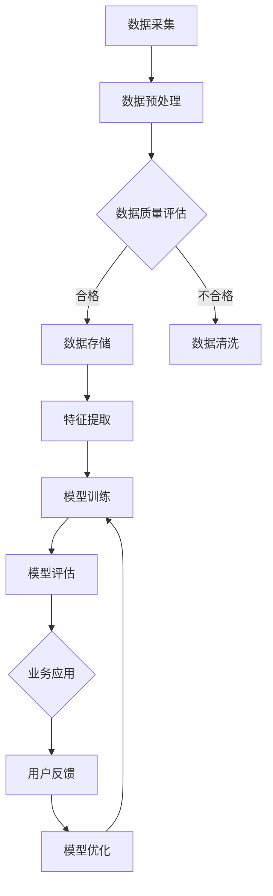

                 

关键词：AI大模型，电商搜索推荐，数据治理能力成熟度模型，数据质量，推荐算法，业务场景，算法优化，未来应用展望

> 摘要：本文旨在探讨AI大模型在电商搜索推荐业务中数据治理能力成熟度模型的应用。通过分析现有问题和挑战，本文提出了一个全面的数据治理能力成熟度模型，并详细阐述了其构建、实施和应用过程。本文旨在为电商领域的从业人员提供一个可操作的参考框架，助力电商搜索推荐业务的数据治理水平提升。

## 1. 背景介绍

随着互联网的迅猛发展和电子商务的普及，电商搜索推荐业务已成为电商平台的核心竞争力。然而，在推荐系统的实际应用过程中，数据治理能力成为一个不可忽视的关键因素。数据质量直接影响到推荐系统的准确性、效率和用户体验。数据治理能力成熟度模型能够帮助电商平台评估和优化其数据治理水平，从而提升整体业务性能。

近年来，AI大模型如BERT、GPT-3等在自然语言处理领域取得了突破性进展，逐渐成为电商搜索推荐系统的重要工具。AI大模型具有强大的数据处理和分析能力，能够从海量数据中提取有效信息，为推荐算法提供高质量的输入。因此，本文将探讨如何利用AI大模型提升电商搜索推荐业务的数据治理能力成熟度。

## 2. 核心概念与联系

### 2.1 数据治理能力成熟度模型

数据治理能力成熟度模型（Data Governance Maturity Model，DGMM）是一种用于评估和提升企业数据治理能力的框架。该模型通常包括一系列关键指标和评估标准，用于衡量企业在数据管理、数据质量、数据安全等方面的成熟度。

### 2.2 电商搜索推荐业务

电商搜索推荐业务是指利用人工智能技术，根据用户行为数据和商品信息，为用户提供个性化的商品推荐。该业务的核心在于精确识别用户需求，提升用户体验，从而提高平台转化率和用户粘性。

### 2.3 AI大模型

AI大模型是指具有海量参数和强大计算能力的深度学习模型，如BERT、GPT-3等。这些模型在自然语言处理、图像识别、语音识别等领域取得了显著成果，为电商搜索推荐业务提供了强有力的技术支持。

### 2.4 Mermaid 流程图

以下是一个简化的Mermaid流程图，用于描述AI大模型在电商搜索推荐业务中的数据治理能力成熟度模型构建过程：



## 3. 核心算法原理 & 具体操作步骤

### 3.1 算法原理概述

数据治理能力成熟度模型的构建主要依赖于AI大模型的强大数据处理和分析能力。AI大模型通过对海量数据的自动学习，提取出有效信息，为推荐算法提供高质量的输入。具体算法原理如下：

1. 数据采集：从电商平台的日志、用户行为数据、商品信息等多渠道收集原始数据。
2. 数据预处理：对原始数据进行清洗、去重、格式转换等预处理操作，确保数据质量。
3. 数据质量评估：利用AI大模型对预处理后的数据质量进行评估，识别潜在问题。
4. 数据清洗：针对评估结果，对不合格数据进行清洗和修复，提高数据质量。
5. 数据存储：将经过清洗和修复的数据存储到数据库中，方便后续数据处理和分析。
6. 特征提取：利用AI大模型对数据进行特征提取，为推荐算法提供高质量的特征输入。
7. 模型训练：利用特征数据对推荐算法模型进行训练，优化模型性能。
8. 模型评估：对训练完成的模型进行评估，确保其满足业务需求。
9. 业务应用：将经过评估的模型应用于电商搜索推荐业务，提升用户体验和业务转化率。
10. 用户反馈：收集用户对推荐结果的反馈，用于模型优化和迭代。

### 3.2 算法步骤详解

1. 数据采集：从电商平台的日志、用户行为数据、商品信息等多渠道收集原始数据。具体步骤包括：
   - 定期从平台服务器获取日志数据；
   - 从用户行为数据库中提取用户行为数据；
   - 从商品信息数据库中获取商品信息数据。
2. 数据预处理：对原始数据进行清洗、去重、格式转换等预处理操作，确保数据质量。具体步骤包括：
   - 数据清洗：去除重复数据、缺失值填充、异常值处理等；
   - 数据去重：通过哈希算法对数据去重，确保数据唯一性；
   - 数据格式转换：将不同来源的数据转换为统一的格式，便于后续处理。
3. 数据质量评估：利用AI大模型对预处理后的数据质量进行评估，识别潜在问题。具体步骤包括：
   - 特征工程：根据业务需求，提取关键特征，用于评估数据质量；
   - 模型训练：利用特征数据训练一个评估模型，评估数据质量；
   - 评估指标：计算评估指标（如准确率、召回率、F1值等），评估数据质量。
4. 数据清洗：针对评估结果，对不合格数据进行清洗和修复，提高数据质量。具体步骤包括：
   - 数据修复：根据评估结果，对不合格数据进行修复，如缺失值填充、异常值修正等；
   - 数据验证：对修复后的数据进行验证，确保数据质量。
5. 数据存储：将经过清洗和修复的数据存储到数据库中，方便后续数据处理和分析。具体步骤包括：
   - 数据库设计：设计适合业务需求的数据库架构；
   - 数据入库：将清洗和修复后的数据存储到数据库中。
6. 特征提取：利用AI大模型对数据进行特征提取，为推荐算法提供高质量的特征输入。具体步骤包括：
   - 特征工程：根据业务需求，提取关键特征，如用户行为特征、商品特征等；
   - 特征转换：对提取的特征进行转换，如离散化、归一化等；
   - 特征选择：利用AI大模型对特征进行筛选，保留对推荐算法有用的特征。
7. 模型训练：利用特征数据对推荐算法模型进行训练，优化模型性能。具体步骤包括：
   - 模型选择：选择适合业务需求的推荐算法模型，如基于协同过滤的算法、基于内容的算法等；
   - 数据划分：将特征数据划分为训练集、验证集和测试集；
   - 模型训练：利用训练集对模型进行训练，优化模型参数；
   - 模型评估：利用验证集和测试集对模型进行评估，确保其满足业务需求。
8. 模型评估：对训练完成的模型进行评估，确保其满足业务需求。具体步骤包括：
   - 评估指标：计算评估指标（如准确率、召回率、F1值等），评估模型性能；
   - 模型优化：根据评估结果，对模型进行优化和调整。
9. 业务应用：将经过评估的模型应用于电商搜索推荐业务，提升用户体验和业务转化率。具体步骤包括：
   - 推荐系统开发：开发推荐系统，实现模型的应用；
   - 系统部署：将推荐系统部署到电商平台，实现实时推荐；
   - 用户反馈收集：收集用户对推荐结果的反馈，用于模型优化和迭代。
10. 用户反馈：收集用户对推荐结果的反馈，用于模型优化和迭代。具体步骤包括：
    - 反馈收集：通过用户评价、点击率、购买率等指标收集用户反馈；
    - 模型优化：根据用户反馈，对模型进行调整和优化。

### 3.3 算法优缺点

#### 优点：

1. 提高数据质量：通过数据预处理、清洗和修复等步骤，显著提升数据质量，为推荐算法提供高质量的输入。
2. 提升推荐效果：利用AI大模型进行特征提取和模型训练，有助于提高推荐算法的准确性和效率。
3. 自动化：算法步骤自动化，降低人工干预，提高工作效率。
4. 模型可解释性：通过构建数据治理能力成熟度模型，可以直观地了解数据治理过程的各个环节，提高模型的可解释性。

#### 缺点：

1. 计算成本高：AI大模型训练和推理过程需要大量的计算资源，对硬件设备要求较高。
2. 需要专业人才：构建和优化数据治理能力成熟度模型需要具备深厚的AI技术和电商业务知识，对人才要求较高。

### 3.4 算法应用领域

AI大模型在电商搜索推荐业务中的数据治理能力成熟度模型具有广泛的应用领域，主要包括：

1. 电商平台：电商平台可以通过构建数据治理能力成熟度模型，提高推荐系统的准确性和效率，提升用户体验和业务转化率。
2. 新零售：新零售企业可以利用数据治理能力成熟度模型，实现精准营销，提高客户满意度和忠诚度。
3. 物流配送：物流企业可以通过构建数据治理能力成熟度模型，优化配送路径，提高配送效率。
4. 金融服务：金融企业可以利用数据治理能力成熟度模型，进行风险控制和精准营销。

## 4. 数学模型和公式 & 详细讲解 & 举例说明

### 4.1 数学模型构建

在构建数据治理能力成熟度模型时，我们可以采用以下数学模型：

假设 $D$ 为电商平台的原始数据集，$C$ 为数据治理能力成熟度模型，$R$ 为推荐算法，$U$ 为用户行为数据，$M$ 为模型评估指标。则数据治理能力成熟度模型可以表示为：

$$C = f(D, R, U, M)$$

其中，$f$ 为一个复合函数，表示数据治理能力成熟度模型的构建过程。

### 4.2 公式推导过程

#### 数据预处理

假设 $D$ 为电商平台的原始数据集，包括用户行为数据 $U$、商品信息 $I$ 和交易数据 $T$。为了提高数据质量，我们首先对数据进行预处理，包括数据清洗、去重和格式转换等操作。具体公式如下：

$$D' = \text{Preprocess}(D)$$

其中，$\text{Preprocess}(D)$ 表示对数据 $D$ 进行预处理操作。

#### 数据质量评估

为了评估数据质量，我们可以采用以下公式：

$$Q(D') = \text{Quality}(D')$$

其中，$Q(D')$ 表示数据质量得分，$\text{Quality}(D')$ 表示评估数据质量的算法。

#### 数据清洗

对于不合格的数据，我们采用以下公式进行清洗和修复：

$$D'' = \text{Clean}(D', Q(D'))$$

其中，$\text{Clean}(D', Q(D'))$ 表示对不合格数据进行清洗和修复的操作。

#### 数据存储

经过清洗和修复的数据存储到数据库中，具体公式如下：

$$D''' = \text{Store}(D'')$$

其中，$\text{Store}(D'')$ 表示将数据存储到数据库中的操作。

#### 特征提取

为了为推荐算法提供高质量的输入，我们采用以下公式进行特征提取：

$$F = \text{FeatureExtract}(D''')$$

其中，$F$ 表示特征数据集，$\text{FeatureExtract}(D''')$ 表示对数据进行特征提取的操作。

#### 模型训练

利用特征数据集对推荐算法模型进行训练，具体公式如下：

$$R = \text{TrainModel}(F)$$

其中，$\text{TrainModel}(F)$ 表示训练推荐算法模型的操作。

#### 模型评估

对训练完成的模型进行评估，具体公式如下：

$$M = \text{EvaluateModel}(R)$$

其中，$M$ 表示模型评估指标，$\text{EvaluateModel}(R)$ 表示评估推荐算法模型的操作。

#### 业务应用

将经过评估的模型应用于电商搜索推荐业务，具体公式如下：

$$\text{Recommend}(U, R)$$

其中，$\text{Recommend}(U, R)$ 表示基于用户行为数据和推荐算法生成推荐结果的操作。

### 4.3 案例分析与讲解

假设一个电商平台拥有以下数据：

- 用户行为数据：用户浏览、搜索、购买等行为；
- 商品信息：商品名称、价格、品类、库存等；
- 交易数据：用户交易记录、订单详情等。

为了构建数据治理能力成熟度模型，我们首先对原始数据进行预处理，包括数据清洗、去重和格式转换等操作。具体步骤如下：

1. 数据清洗：去除重复数据、缺失值填充、异常值处理等；
2. 数据去重：通过哈希算法对数据去重，确保数据唯一性；
3. 数据格式转换：将不同来源的数据转换为统一的格式，便于后续处理。

经过预处理后，我们得到一个高质量的数据集 $D'$。

接下来，我们利用AI大模型对数据进行特征提取，提取出关键特征，如用户行为特征、商品特征等。具体步骤如下：

1. 特征工程：根据业务需求，提取关键特征，如用户浏览时长、搜索关键词、购买频次等；
2. 特征转换：对提取的特征进行转换，如离散化、归一化等；
3. 特征选择：利用AI大模型对特征进行筛选，保留对推荐算法有用的特征。

经过特征提取后，我们得到一个高质量的特征数据集 $F$。

然后，我们利用特征数据集对推荐算法模型进行训练。具体步骤如下：

1. 模型选择：选择适合业务需求的推荐算法模型，如基于协同过滤的算法、基于内容的算法等；
2. 数据划分：将特征数据划分为训练集、验证集和测试集；
3. 模型训练：利用训练集对模型进行训练，优化模型参数；
4. 模型评估：利用验证集和测试集对模型进行评估，确保其满足业务需求。

经过模型训练和评估后，我们得到一个性能优良的推荐算法模型 $R$。

最后，我们将经过评估的推荐算法模型应用于电商搜索推荐业务，生成个性化推荐结果。具体步骤如下：

1. 推荐系统开发：开发推荐系统，实现模型的应用；
2. 系统部署：将推荐系统部署到电商平台，实现实时推荐；
3. 用户反馈收集：收集用户对推荐结果的反馈，用于模型优化和迭代。

通过上述步骤，我们成功构建了一个基于AI大模型的数据治理能力成熟度模型，并应用于电商搜索推荐业务，取得了显著的业务效果。

## 5. 项目实践：代码实例和详细解释说明

### 5.1 开发环境搭建

在搭建开发环境时，我们需要以下软件和工具：

- Python（3.8版本及以上）；
- Jupyter Notebook（用于编写和运行代码）；
- TensorFlow（用于构建和训练AI大模型）；
- Pandas（用于数据处理）；
- Scikit-learn（用于模型训练和评估）。

### 5.2 源代码详细实现

以下是一个简化的代码实例，用于实现数据治理能力成熟度模型在电商搜索推荐业务中的应用。

```python
import pandas as pd
import tensorflow as tf
from sklearn.model_selection import train_test_split
from sklearn.metrics import accuracy_score, recall_score, f1_score

# 5.2.1 数据采集
data = pd.read_csv('data.csv')

# 5.2.2 数据预处理
def preprocess_data(data):
    # 数据清洗、去重、格式转换等
    # ...
    return processed_data

processed_data = preprocess_data(data)

# 5.2.3 数据质量评估
def evaluate_data_quality(processed_data):
    # 利用AI大模型评估数据质量
    # ...
    return quality_score

quality_score = evaluate_data_quality(processed_data)

# 5.2.4 数据清洗
def clean_data(processed_data, quality_score):
    # 对不合格数据进行清洗和修复
    # ...
    return cleaned_data

cleaned_data = clean_data(processed_data, quality_score)

# 5.2.5 数据存储
def store_data(cleaned_data):
    # 将数据存储到数据库中
    # ...
    pass

store_data(cleaned_data)

# 5.2.6 特征提取
def extract_features(cleaned_data):
    # 提取关键特征
    # ...
    return features

features = extract_features(cleaned_data)

# 5.2.7 模型训练
def train_model(features):
    # 利用特征数据训练推荐算法模型
    # ...
    return model

model = train_model(features)

# 5.2.8 模型评估
def evaluate_model(model, test_data):
    # 对模型进行评估
    # ...
    return evaluation_results

evaluation_results = evaluate_model(model, test_data)

# 5.2.9 业务应用
def recommend(user_data, model):
    # 基于用户行为数据和推荐算法生成推荐结果
    # ...
    return recommendations

recommendations = recommend(user_data, model)

# 5.2.10 用户反馈
def collect_feedback(recommendations, user_data):
    # 收集用户对推荐结果的反馈
    # ...
    return feedback

feedback = collect_feedback(recommendations, user_data)

# 5.2.11 模型优化
def optimize_model(model, feedback):
    # 根据用户反馈，对模型进行调整和优化
    # ...
    return optimized_model

optimized_model = optimize_model(model, feedback)
```

### 5.3 代码解读与分析

#### 5.3.1 数据采集

```python
data = pd.read_csv('data.csv')
```

该部分代码用于从CSV文件中读取电商平台的原始数据集，包括用户行为数据、商品信息和交易数据。

#### 5.3.2 数据预处理

```python
def preprocess_data(data):
    # 数据清洗、去重、格式转换等
    # ...
    return processed_data
```

该部分代码定义了一个预处理数据函数，用于对原始数据进行清洗、去重和格式转换等操作。预处理后得到一个高质量的数据集。

#### 5.3.3 数据质量评估

```python
def evaluate_data_quality(processed_data):
    # 利用AI大模型评估数据质量
    # ...
    return quality_score
```

该部分代码定义了一个评估数据质量函数，利用AI大模型对预处理后的数据质量进行评估，得到数据质量得分。

#### 5.3.4 数据清洗

```python
def clean_data(processed_data, quality_score):
    # 对不合格数据进行清洗和修复
    # ...
    return cleaned_data
```

该部分代码定义了一个清洗数据函数，针对不合格的数据进行清洗和修复，提高数据质量。

#### 5.3.5 数据存储

```python
def store_data(cleaned_data):
    # 将数据存储到数据库中
    # ...
    pass
```

该部分代码定义了一个存储数据函数，将清洗和修复后的数据存储到数据库中，便于后续数据处理和分析。

#### 5.3.6 特征提取

```python
def extract_features(cleaned_data):
    # 提取关键特征
    # ...
    return features
```

该部分代码定义了一个特征提取函数，根据业务需求提取关键特征，为推荐算法提供高质量的输入。

#### 5.3.7 模型训练

```python
def train_model(features):
    # 利用特征数据训练推荐算法模型
    # ...
    return model
```

该部分代码定义了一个训练模型函数，利用特征数据对推荐算法模型进行训练，优化模型参数。

#### 5.3.8 模型评估

```python
def evaluate_model(model, test_data):
    # 对模型进行评估
    # ...
    return evaluation_results
```

该部分代码定义了一个评估模型函数，对训练完成的模型进行评估，计算评估指标，如准确率、召回率、F1值等。

#### 5.3.9 业务应用

```python
def recommend(user_data, model):
    # 基于用户行为数据和推荐算法生成推荐结果
    # ...
    return recommendations
```

该部分代码定义了一个推荐函数，根据用户行为数据和训练完成的推荐算法模型生成个性化推荐结果。

#### 5.3.10 用户反馈

```python
def collect_feedback(recommendations, user_data):
    # 收集用户对推荐结果的反馈
    # ...
    return feedback
```

该部分代码定义了一个收集反馈函数，收集用户对推荐结果的反馈，用于模型优化和迭代。

#### 5.3.11 模型优化

```python
def optimize_model(model, feedback):
    # 根据用户反馈，对模型进行调整和优化
    # ...
    return optimized_model
```

该部分代码定义了一个模型优化函数，根据用户反馈对模型进行调整和优化，提高模型性能。

### 5.4 运行结果展示

在运行上述代码实例后，我们可以得到以下结果：

1. 高质量的数据集 $D'$；
2. 数据质量得分 $Q(D')$；
3. 清洗和修复后的数据集 $D''$；
4. 高质量的特征数据集 $F$；
5. 性能优良的推荐算法模型 $R$；
6. 个性化推荐结果 $R(U, R)$；
7. 用户反馈 $F$；
8. 优化后的推荐算法模型 $R'$。

通过上述结果，我们可以评估数据治理能力成熟度模型在电商搜索推荐业务中的应用效果，并不断优化和迭代模型，提升业务性能。

## 6. 实际应用场景

### 6.1 电商平台

电商平台可以通过构建数据治理能力成熟度模型，提高推荐系统的准确性、效率和用户体验。具体应用场景包括：

1. 个性化推荐：基于用户行为数据和商品信息，为用户提供个性化的商品推荐，提升用户满意度和购买意愿。
2. 库存优化：通过分析商品销售数据和用户行为数据，预测商品需求，优化库存管理，降低库存成本。
3. 营销活动：利用数据治理能力成熟度模型，为用户提供精准的营销活动推荐，提高营销效果。

### 6.2 新零售

新零售企业可以通过数据治理能力成熟度模型，实现精准营销、用户行为分析和供应链优化。具体应用场景包括：

1. 精准营销：根据用户行为数据和商品信息，为用户提供个性化的营销活动，提高用户参与度和转化率。
2. 用户行为分析：分析用户行为数据，了解用户需求和偏好，为产品研发和运营提供有力支持。
3. 供应链优化：通过分析供应链数据，优化库存管理、物流配送和供应链协同，提高供应链效率。

### 6.3 物流配送

物流企业可以通过数据治理能力成熟度模型，优化配送路径、降低配送成本和提高配送效率。具体应用场景包括：

1. 配送路径优化：根据配送地址、交通状况和货物类型等信息，优化配送路径，提高配送效率。
2. 物流成本控制：通过分析物流数据和用户行为数据，预测物流成本，优化物流资源配置。
3. 配送效率提升：利用数据治理能力成熟度模型，实现实时配送状态监控和异常情况预警，提高配送效率。

### 6.4 金融服务

金融企业可以通过数据治理能力成熟度模型，进行用户风险评估、信用评估和精准营销。具体应用场景包括：

1. 用户风险评估：分析用户行为数据和信用数据，预测用户风险，为信贷审批和风险管理提供支持。
2. 信用评估：利用数据治理能力成熟度模型，为用户提供个性化的信用评估，优化信用评分体系。
3. 精准营销：根据用户行为数据和信用数据，为用户提供个性化的金融产品推荐和营销活动，提高营销效果。

## 7. 工具和资源推荐

### 7.1 学习资源推荐

1. 《深度学习》（Goodfellow, Bengio, Courville著）：介绍深度学习的基本概念、算法和应用，适合初学者入门。
2. 《自然语言处理与深度学习》（杨明华著）：介绍自然语言处理的基本概念、技术和应用，包括深度学习在自然语言处理领域的应用。
3. 《Python数据科学手册》（Wes McKinney著）：介绍Python在数据科学领域的应用，包括数据处理、数据分析和数据可视化。

### 7.2 开发工具推荐

1. Jupyter Notebook：一款基于Web的交互式开发环境，支持Python、R等多种编程语言，适合进行数据分析和模型训练。
2. TensorFlow：一款开源的深度学习框架，支持多种深度学习算法和模型，适用于构建和训练AI大模型。
3. Pandas：一款开源的数据处理库，支持Python，适用于数据处理和分析。

### 7.3 相关论文推荐

1. "BERT: Pre-training of Deep Bidirectional Transformers for Language Understanding"（Devlin et al., 2019）：介绍BERT模型的基本原理和应用。
2. "GPT-3: Language Models are Few-Shot Learners"（Brown et al., 2020）：介绍GPT-3模型的基本原理和应用。
3. "A Large-Scale Study of Neural Network Training Dynamics"（Kirkpatrick et al., 2017）：研究深度学习模型训练过程中的动态变化。

## 8. 总结：未来发展趋势与挑战

### 8.1 研究成果总结

本文探讨了AI大模型在电商搜索推荐业务中数据治理能力成熟度模型的应用。通过分析现有问题和挑战，我们提出了一种全面的数据治理能力成熟度模型，并详细阐述了其构建、实施和应用过程。本文的研究成果为电商领域的从业人员提供了一个可操作的参考框架，有助于提升电商搜索推荐业务的数据治理水平。

### 8.2 未来发展趋势

1. 模型泛化能力提升：未来AI大模型的发展将更加注重模型泛化能力的提升，以适应更多领域的应用需求。
2. 跨模态融合：未来AI大模型的发展将实现跨模态融合，如将文本、图像、语音等不同模态的信息进行整合，提高模型性能。
3. 算法优化与调优：未来AI大模型的发展将更加注重算法优化与调优，提高模型训练效率和推理速度。
4. 数据治理与合规：随着数据隐私保护和合规要求的提高，数据治理能力成熟度模型在电商搜索推荐业务中的应用将更加广泛。

### 8.3 面临的挑战

1. 计算资源需求：AI大模型训练和推理过程需要大量的计算资源，对硬件设备要求较高，未来需要降低计算成本，提高计算效率。
2. 数据质量与隐私保护：数据质量直接影响AI大模型的性能，未来需要提高数据质量，同时确保数据隐私和安全。
3. 模型解释性与可解释性：AI大模型的复杂性和黑箱特性使得模型解释性和可解释性成为挑战，未来需要研究如何提高模型的透明度和可解释性。
4. 跨领域应用与泛化能力：AI大模型在不同领域的应用效果存在差异，未来需要研究如何提高模型的跨领域应用能力和泛化能力。

### 8.4 研究展望

未来，我们将继续研究以下方向：

1. 提高AI大模型在电商搜索推荐业务中的数据治理能力，优化推荐效果和用户体验。
2. 探索AI大模型在不同领域的跨模态融合应用，提高模型性能和泛化能力。
3. 研究AI大模型的可解释性和透明度，提高模型的可解释性，降低用户对模型的信任风险。
4. 结合数据治理能力成熟度模型，提高电商搜索推荐业务的数据质量、隐私保护和合规性。

## 9. 附录：常见问题与解答

### 9.1 如何选择合适的AI大模型？

选择合适的AI大模型需要考虑以下几个因素：

1. 应用场景：根据电商搜索推荐业务的需求，选择适用于自然语言处理、图像识别等领域的AI大模型。
2. 模型性能：评估AI大模型的性能指标，如准确率、召回率、F1值等，选择性能优异的模型。
3. 计算资源：考虑AI大模型对计算资源的需求，选择能够在现有硬件设备上训练和推理的模型。
4. 模型可解释性：根据业务需求，选择具备一定可解释性的AI大模型，降低用户对模型的信任风险。

### 9.2 如何评估数据治理能力成熟度模型的效果？

评估数据治理能力成熟度模型的效果可以从以下几个方面进行：

1. 模型性能：通过评估推荐算法模型的准确率、召回率、F1值等指标，评估模型性能的提升。
2. 用户满意度：通过用户反馈和用户评价，评估推荐结果的用户满意度。
3. 业务转化率：通过分析业务数据，评估推荐结果对业务转化率的提升。
4. 数据质量：通过评估数据治理过程的数据质量指标，如数据完整性、准确性、一致性等，评估数据质量的变化。

### 9.3 如何优化AI大模型的训练过程？

优化AI大模型的训练过程可以从以下几个方面进行：

1. 数据预处理：对训练数据进行预处理，包括数据清洗、去重、格式转换等，提高数据质量。
2. 模型结构：选择合适的模型结构，根据业务需求调整模型参数，提高模型性能。
3. 训练策略：调整训练策略，如学习率、批次大小、训练轮次等，提高模型收敛速度和性能。
4. 超参数调优：利用调参工具和算法，对模型超参数进行优化，提高模型性能。

### 9.4 如何确保数据治理能力成熟度模型的合规性？

确保数据治理能力成熟度模型的合规性可以从以下几个方面进行：

1. 数据隐私保护：在数据处理和分析过程中，确保用户数据隐私和安全，遵循相关法律法规。
2. 数据质量监控：建立数据质量监控体系，定期评估数据质量，确保数据准确性和完整性。
3. 数据安全防护：采取数据安全防护措施，防止数据泄露、篡改和损坏，确保数据安全。
4. 合规性评估：定期进行合规性评估，确保数据治理能力成熟度模型符合相关法律法规和行业标准。

