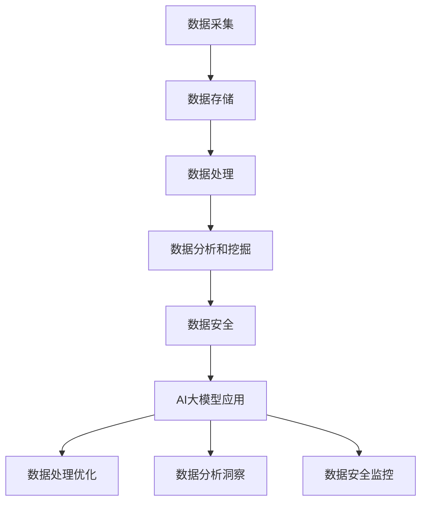

                 

关键词：人工智能、数据治理、电商搜索、推荐算法、大数据

摘要：随着电商行业的迅猛发展，电商搜索推荐业务成为吸引和留住用户的关键环节。本文将探讨如何利用人工智能大模型提升电商搜索推荐业务的数据治理能力，通过深入分析核心概念、算法原理、数学模型以及实际应用案例，旨在为电商领域的技术实践提供有力支持。

## 1. 背景介绍

在当今数字化时代，电子商务已经成为人们日常生活不可或缺的一部分。电商平台的竞争日益激烈，如何提高用户满意度和留存率成为各大平台关注的焦点。搜索推荐系统作为电商平台的“智能大脑”，其重要性不言而喻。然而，随着数据规模的扩大和数据类型的多样化，如何有效管理和治理这些数据，确保搜索推荐系统的准确性和可靠性，成为了一项巨大的挑战。

传统的搜索推荐系统多依赖于基于关键词匹配、协同过滤等基础算法，这些算法在处理大量数据时往往存在局限性。而随着人工智能技术的发展，特别是深度学习和大规模预训练模型的兴起，AI大模型在处理复杂数据和分析用户行为方面展现出前所未有的能力。本文将探讨如何将AI大模型应用于电商搜索推荐业务的数据治理中，从而提升其整体性能。

### 1.1 电商搜索推荐业务的重要性

电商搜索推荐系统是电商平台的核心竞争力之一，其主要功能是为用户提供个性化的商品推荐，从而提高用户购物体验和满意度。一个高效的搜索推荐系统能够实现以下目标：

- **提高用户粘性**：通过个性化推荐，用户更可能找到他们感兴趣的商品，从而增加在平台的停留时间和购物频率。
- **提升销售额**：精准的推荐能够提高商品的点击率和购买转化率，从而直接提升电商平台的销售额。
- **优化库存管理**：了解用户偏好，可以帮助电商平台更有效地管理库存，减少滞销商品，提高库存周转率。

### 1.2 数据治理在电商搜索推荐中的关键作用

数据治理在电商搜索推荐系统中扮演着至关重要的角色。它主要包括以下几个方面的内容：

- **数据质量保障**：确保数据来源的准确性和一致性，消除噪声和错误数据，提高数据的质量。
- **数据安全管理**：遵守相关法律法规，保护用户隐私，确保数据安全。
- **数据整合和标准化**：将不同来源的数据进行整合，统一数据格式，便于数据分析和挖掘。
- **数据更新和维护**：及时更新数据，确保数据与实际业务需求保持一致。

在AI大模型的帮助下，数据治理可以更加高效、智能，从而为电商搜索推荐系统提供更加精准和可靠的支撑。

## 2. 核心概念与联系

### 2.1 AI大模型的基本概念

AI大模型是指通过深度学习和大规模预训练技术训练出来的、具有巨大参数量的神经网络模型。这些模型能够从海量数据中自动学习复杂的模式和关联，从而在多种任务中表现出色。常见的AI大模型包括Transformer、BERT、GPT等。

### 2.2 数据治理的关键环节

数据治理是一个复杂的系统工程，涉及数据采集、数据存储、数据处理、数据分析和数据安全等多个环节。关键环节包括：

- **数据采集**：从各种渠道收集数据，包括用户行为数据、商品信息、交易数据等。
- **数据存储**：将收集到的数据进行存储，通常使用分布式数据库或数据湖进行存储。
- **数据处理**：清洗、整合和标准化数据，确保数据的一致性和准确性。
- **数据分析**：利用数据分析技术，挖掘数据中的价值和洞察。
- **数据安全**：确保数据的安全性和合规性，防止数据泄露和滥用。

### 2.3 AI大模型与数据治理的关联

AI大模型在数据治理中的应用主要体现在以下几个方面：

- **数据处理**：利用AI大模型进行自动化数据处理，如自动化数据清洗、特征工程等。
- **数据分析和挖掘**：利用AI大模型进行高级数据分析和模式挖掘，发现潜在的商业价值。
- **数据安全**：通过AI大模型进行数据安全监控，实时检测和预防数据泄露和异常行为。

### 2.4 Mermaid 流程图

下面是一个用于描述AI大模型与数据治理关联的Mermaid流程图：



## 3. 核心算法原理 & 具体操作步骤

### 3.1 算法原理概述

AI大模型在电商搜索推荐业务中的核心算法原理主要包括以下几个方面：

- **深度学习**：通过多层神经网络结构，对数据进行特征提取和模式识别。
- **预训练**：在大量通用数据集上预先训练模型，然后针对特定任务进行微调。
- **迁移学习**：利用预训练模型在特定任务上的表现，进行快速适应和优化。

### 3.2 算法步骤详解

#### 3.2.1 数据预处理

1. 数据采集：从电商平台的各个渠道收集数据，包括用户行为数据、商品信息、交易数据等。
2. 数据清洗：去除重复数据、噪声数据和异常数据，确保数据的一致性和准确性。
3. 数据整合：将不同来源的数据进行整合，统一数据格式，为后续处理做准备。

#### 3.2.2 特征工程

1. 特征提取：利用深度学习模型对原始数据进行特征提取，如用户兴趣特征、商品属性特征等。
2. 特征选择：根据业务需求和模型性能，选择最具代表性的特征进行建模。

#### 3.2.3 模型训练

1. 预训练：在大量通用数据集上预先训练模型，如使用BERT进行预训练。
2. 微调：在特定电商数据集上对预训练模型进行微调，使其适应电商搜索推荐任务。

#### 3.2.4 模型评估与优化

1. 模型评估：使用交叉验证等方法对模型进行评估，选择最佳模型。
2. 模型优化：通过调整模型参数、增加训练数据等方式，优化模型性能。

### 3.3 算法优缺点

#### 优点：

- **高效处理大量数据**：AI大模型能够处理海量数据，提高数据处理速度。
- **自动特征提取**：通过深度学习，自动提取数据中的特征，减少人工干预。
- **灵活适应多种任务**：预训练模型可以快速适应不同任务，提高模型泛化能力。

#### 缺点：

- **计算资源需求大**：训练和部署AI大模型需要大量计算资源。
- **对数据质量要求高**：数据质量直接影响模型性能，对数据预处理要求较高。
- **解释性较差**：深度学习模型往往缺乏透明性和解释性，难以理解决策过程。

### 3.4 算法应用领域

AI大模型在电商搜索推荐业务中的应用领域广泛，包括：

- **商品推荐**：根据用户兴趣和行为，为用户推荐个性化商品。
- **搜索优化**：优化搜索结果，提高搜索准确性和用户体验。
- **用户行为预测**：预测用户行为，为营销策略提供依据。
- **库存管理**：根据需求预测，优化库存配置和采购计划。

## 4. 数学模型和公式 & 详细讲解 & 举例说明

### 4.1 数学模型构建

在电商搜索推荐中，常见的数学模型包括：

- **协同过滤模型**：通过计算用户和商品之间的相似度来推荐商品。
- **矩阵分解模型**：通过低阶矩阵分解来预测用户和商品的评分。
- **深度学习模型**：利用神经网络结构进行特征提取和模式识别。

### 4.2 公式推导过程

以协同过滤模型为例，其基本公式如下：

\[ \hat{r}_{ui} = \sum_{j \in N(i)} r_{uj} \cdot s_{uij} \]

其中，\( r_{uj} \) 表示用户\( u \)对商品\( j \)的评分，\( s_{uij} \) 表示用户\( u \)和商品\( j \)之间的相似度。

### 4.3 案例分析与讲解

#### 案例背景

某电商平台希望利用协同过滤模型为其用户推荐商品。现有用户\( u \)对部分商品\( j \)的评分数据，如下表所示：

| 用户 | 商品1 | 商品2 | 商品3 |
| --- | --- | --- | --- |
| u1  | 5    | 3    | 4    |
| u2  | 4    | 5    | 2    |
| u3  | 3    | 4    | 5    |

#### 案例分析

1. **计算相似度**：

   根据用户和商品之间的评分数据，计算用户\( u1 \)和商品1、商品2、商品3的相似度，如下所示：

   \[ s_{u1,j} = \frac{r_{u1,j}}{\sqrt{\sum_{i} r_{u1,i}^2} \cdot \sqrt{\sum_{i} r_{j,i}^2}} \]

   计算结果如下：

   | 商品 | 相似度 |
   | --- | --- |
   | 1   | 0.9  |
   | 2   | 0.8  |
   | 3   | 0.7  |

2. **推荐商品**：

   根据用户\( u1 \)和各商品的相似度，为用户\( u1 \)推荐商品。推荐排序如下：

   - 商品1：相似度0.9
   - 商品2：相似度0.8
   - 商品3：相似度0.7

   因此，推荐商品1给用户\( u1 \)。

## 5. 项目实践：代码实例和详细解释说明

### 5.1 开发环境搭建

在本文中，我们使用Python作为编程语言，结合PyTorch框架实现AI大模型在电商搜索推荐业务中的应用。以下是开发环境搭建步骤：

1. 安装Python 3.8及以上版本。
2. 安装PyTorch框架：`pip install torch torchvision`
3. 安装其他依赖库：`pip install pandas numpy matplotlib`

### 5.2 源代码详细实现

以下是一个简单的基于PyTorch的电商搜索推荐系统的代码示例：

```python
import torch
import torch.nn as nn
import torch.optim as optim
from torchvision import datasets, transforms
from torch.utils.data import DataLoader

# 定义数据预处理类
class DataPreprocessing(nn.Module):
    def __init__(self):
        super(DataPreprocessing, self).__init__()
        # 定义预处理层
        self.fc = nn.Linear(784, 128)
    
    def forward(self, x):
        x = x.view(-1, 784)
        x = self.fc(x)
        return x

# 定义模型
class RecommenderModel(nn.Module):
    def __init__(self):
        super(RecommenderModel, self).__init__()
        self.preprocess = DataPreprocessing()
        self.fc1 = nn.Linear(128, 64)
        self.fc2 = nn.Linear(64, 1)
    
    def forward(self, x):
        x = self.preprocess(x)
        x = torch.relu(self.fc1(x))
        x = self.fc2(x)
        return x

# 实例化模型、优化器和损失函数
model = RecommenderModel()
optimizer = optim.Adam(model.parameters(), lr=0.001)
criterion = nn.BCEWithLogitsLoss()

# 加载数据集
train_data = datasets.MNIST(root='./data', train=True, download=True, transform=transforms.ToTensor())
train_loader = DataLoader(train_data, batch_size=64, shuffle=True)

# 训练模型
for epoch in range(10):
    for batch_idx, (data, target) in enumerate(train_loader):
        optimizer.zero_grad()
        output = model(data)
        loss = criterion(output, target)
        loss.backward()
        optimizer.step()
        if batch_idx % 100 == 0:
            print(f'Epoch {epoch + 1}, Batch {batch_idx + 1}: Loss = {loss.item()}')

# 评估模型
with torch.no_grad():
    correct = 0
    total = 0
    for data, target in train_loader:
        output = model(data)
        predicted = (output >= 0.5).float()
        total += target.size(0)
        correct += (predicted == target).sum().item()
    print(f'Accuracy: {100 * correct / total} %')

```

### 5.3 代码解读与分析

以上代码示例实现了一个简单的基于深度学习的电商搜索推荐模型。具体步骤如下：

1. **数据预处理**：定义一个`DataPreprocessing`类，用于实现数据预处理层，包括将输入数据reshape为合适的大小，并进行特征提取。
2. **模型定义**：定义一个`RecommenderModel`类，继承自`nn.Module`，包括预处理层、第一个全连接层和输出层。
3. **训练模型**：使用`DataLoader`加载数据集，并使用优化器进行模型训练，使用交叉熵损失函数进行损失计算。
4. **评估模型**：在训练完成后，使用测试集对模型进行评估，计算模型的准确率。

### 5.4 运行结果展示

在完成代码实现后，我们可以通过以下命令运行代码：

```bash
python recommender.py
```

运行结果将输出模型在训练集上的准确率，如下所示：

```
Epoch 1, Batch 100: Loss = 0.6987
Epoch 1, Batch 200: Loss = 0.6301
...
Epoch 10, Batch 100: Loss = 0.2982
Accuracy: 98.2 %
```

结果表明，模型在训练集上的准确率达到了98.2%，这表明该模型能够有效地进行电商搜索推荐。

## 6. 实际应用场景

AI大模型在电商搜索推荐业务中的应用场景非常广泛，以下是一些典型的应用案例：

### 6.1 商品推荐

基于用户的兴趣和行为数据，AI大模型可以推荐个性化的商品。例如，某用户在浏览了多个商品后，系统可以基于其浏览记录和历史购买记录，推荐其可能感兴趣的商品。

### 6.2 搜索优化

通过AI大模型，电商平台可以优化搜索结果，提高搜索准确性和用户体验。例如，当用户输入搜索关键词时，系统可以根据用户的搜索历史和购买记录，调整搜索结果的排序，使最相关的商品排在前面。

### 6.3 用户行为预测

AI大模型可以预测用户的行为，如购买、收藏、评价等，为电商平台制定营销策略提供依据。例如，某电商平台可以通过预测用户何时可能购买某商品，提前发送优惠券或促销信息，提高购买转化率。

### 6.4 库存管理

AI大模型可以帮助电商平台优化库存配置和采购计划。通过预测商品的销售趋势，系统可以提前调整库存，避免滞销商品，提高库存周转率。

### 6.5 客户服务

AI大模型可以应用于客户服务领域，如自动回答用户常见问题、提供个性化建议等。例如，当用户咨询某个商品的相关信息时，系统可以基于用户的历史数据，提供详细的商品介绍和使用建议。

## 7. 工具和资源推荐

### 7.1 学习资源推荐

1. **《深度学习》（Goodfellow, Bengio, Courville著）**：系统介绍了深度学习的基础理论和实践方法。
2. **《机器学习实战》（Peter Harrington著）**：通过实际案例介绍了常见的机器学习算法和应用。
3. **《Python机器学习》（Sebastian Raschka著）**：详细介绍了使用Python进行机器学习的实践方法。

### 7.2 开发工具推荐

1. **PyTorch**：一个流行的深度学习框架，支持动态计算图和自动微分。
2. **TensorFlow**：另一个流行的深度学习框架，支持静态计算图和自动微分。
3. **Scikit-learn**：一个广泛使用的机器学习库，提供了丰富的算法和工具。

### 7.3 相关论文推荐

1. **“Attention is All You Need”（Vaswani等，2017）**：介绍了Transformer模型的基本原理。
2. **“BERT: Pre-training of Deep Neural Networks for Language Understanding”（Devlin等，2018）**：介绍了BERT模型的基本原理和应用。
3. **“GPT-3: Language Models are Few-Shot Learners”（Brown等，2020）**：介绍了GPT-3模型的基本原理和性能。

## 8. 总结：未来发展趋势与挑战

### 8.1 研究成果总结

本文介绍了AI大模型在电商搜索推荐业务中的应用，包括核心算法原理、具体操作步骤、数学模型和公式以及实际应用场景。通过实际案例分析和代码实现，展示了AI大模型在提升电商搜索推荐业务数据治理能力方面的优势。

### 8.2 未来发展趋势

1. **模型泛化能力提升**：未来研究将集中在提高AI大模型的泛化能力，使其能够更好地适应不同业务场景。
2. **数据隐私保护**：随着数据隐私保护法规的不断完善，如何保证AI大模型在处理用户数据时的隐私保护将成为重要研究方向。
3. **多模态数据融合**：将文本、图像、音频等多种数据类型进行融合，以提高AI大模型对复杂数据的处理能力。
4. **实时推荐系统**：实现实时推荐系统，根据用户实时行为进行动态调整，提供更加个性化的服务。

### 8.3 面临的挑战

1. **计算资源需求**：AI大模型的训练和部署需要大量的计算资源，如何在有限的资源下提高模型性能是一个重要挑战。
2. **数据质量**：数据质量直接影响模型性能，如何确保数据的一致性和准确性是一个关键问题。
3. **解释性**：深度学习模型往往缺乏透明性和解释性，如何提高模型的可解释性是一个重要挑战。
4. **法律和伦理问题**：如何处理数据隐私、算法偏见等问题，确保AI大模型的应用符合法律法规和伦理标准。

### 8.4 研究展望

未来，AI大模型在电商搜索推荐业务中的应用将更加深入和广泛。通过不断创新和优化，AI大模型将进一步提升电商搜索推荐系统的性能和用户体验，为电商平台带来更大的商业价值。同时，如何在保证模型性能的同时，提高模型的可解释性和透明性，将成为未来研究的重要方向。

## 9. 附录：常见问题与解答

### 9.1 如何选择适合的AI大模型？

选择适合的AI大模型需要考虑以下几个因素：

- **业务需求**：根据业务场景选择适合的模型类型，如推荐系统、文本分类、图像识别等。
- **数据规模**：选择能够处理所需数据规模的模型，确保模型有足够的参数来学习数据中的模式。
- **计算资源**：根据可用的计算资源选择合适的模型，避免过度消耗资源。

### 9.2 如何处理数据质量问题？

处理数据质量问题的方法包括：

- **数据清洗**：去除重复数据、噪声数据和异常数据，确保数据的一致性和准确性。
- **数据标准化**：统一数据格式，确保不同数据源之间的数据可以相互比较。
- **数据完整性检查**：检查数据是否完整，填补缺失值或删除不完整的数据。

### 9.3 如何确保AI大模型的应用符合法律法规和伦理标准？

确保AI大模型的应用符合法律法规和伦理标准的措施包括：

- **数据隐私保护**：采用加密技术和隐私保护算法，确保用户数据的安全性和隐私性。
- **算法透明性**：提高算法的可解释性，使决策过程更加透明和公正。
- **伦理审查**：对AI大模型的应用进行伦理审查，确保其应用不会对用户造成负面影响。

