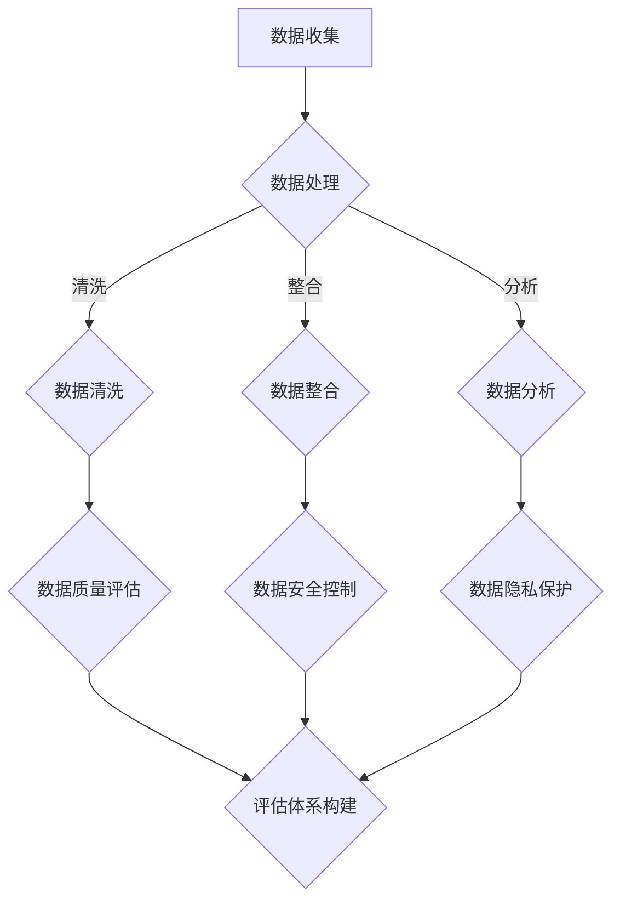

                 

在当今高度数字化的商业环境中，电商搜索和推荐业务已经成为企业争夺市场份额的关键手段。随着数据量的爆炸性增长和用户需求的日益复杂化，如何有效地管理和治理这些数据成为了一项至关重要的任务。本文将探讨如何利用AI大模型来提升电商搜索推荐业务的数据治理能力，构建一个全面的评估体系，并通过具体的应用实践提供详尽的案例分析。

## 关键词

- AI大模型
- 数据治理
- 电商搜索推荐
- 评估体系
- 应用实践

## 摘要

本文旨在探讨AI大模型在电商搜索推荐业务数据治理中的应用，通过构建一个综合的评估体系来提升数据治理能力。文章首先介绍了AI大模型的基本原理和其在电商搜索推荐中的作用，接着详细描述了评估体系的构建方法，最后通过实际案例展示了AI大模型在数据治理中的具体应用和成效。

## 1. 背景介绍

### 1.1 电商搜索推荐业务的重要性

电商搜索推荐业务在当今的数字经济中扮演着不可或缺的角色。它不仅帮助企业挖掘用户行为数据，优化产品推荐策略，提升用户体验，还能显著提高销售额和客户满意度。然而，随着业务规模和用户数据的增长，传统的数据管理方法已经难以满足高效、准确的数据治理需求。

### 1.2 数据治理的挑战

数据治理面临诸多挑战，包括数据质量、数据安全、数据一致性、数据隐私等。这些问题不仅影响数据的有效性和可靠性，还会对企业的合规性带来风险。为了解决这些问题，需要引入先进的技术手段，如AI大模型，来提升数据治理能力。

### 1.3 AI大模型的发展与应用

AI大模型，特别是深度学习模型，已经在多个领域取得了显著的成果。在电商搜索推荐领域，AI大模型能够通过大规模数据训练，提取出用户行为的特征，从而实现精准的个性化推荐。同时，AI大模型在数据清洗、数据整合、数据安全等方面的应用也日益成熟。

## 2. 核心概念与联系

### 2.1 AI大模型的基本原理

AI大模型是基于深度学习技术构建的复杂神经网络。通过大量的数据训练，模型能够自动提取数据中的特征，并学会预测或分类。常见的AI大模型包括神经网络、卷积神经网络（CNN）、循环神经网络（RNN）和Transformer等。

### 2.2 电商搜索推荐业务中的数据治理

数据治理涉及数据收集、存储、处理、分析和共享的全过程。在电商搜索推荐业务中，数据治理包括用户行为数据收集、商品数据管理、推荐算法优化和数据安全控制等方面。

### 2.3 评估体系的构建

评估体系是衡量数据治理能力的关键工具。一个有效的评估体系应该包括数据质量、数据安全、数据一致性和数据隐私等关键指标。通过这些指标，可以全面评估数据治理的效果，并为改进提供依据。

### 2.4 Mermaid流程图

下面是电商搜索推荐业务中数据治理的Mermaid流程图：



## 3. 核心算法原理 & 具体操作步骤

### 3.1 算法原理概述

AI大模型的核心在于其能够通过深度学习自动提取数据中的特征。具体来说，包括以下步骤：

1. **数据预处理**：对原始数据进行清洗、归一化等预处理操作，使其适合模型训练。
2. **模型训练**：使用预处理后的数据训练神经网络，通过反向传播算法不断调整模型参数。
3. **特征提取**：经过训练的模型能够自动提取数据中的高级特征，这些特征用于推荐算法的输入。
4. **模型评估**：使用验证集对模型进行评估，调整模型参数以优化性能。

### 3.2 算法步骤详解

1. **数据预处理**：

   $$ 
   \text{标准化数据} = \frac{\text{原始数据} - \text{均值}}{\text{标准差}} 
   $$

2. **模型训练**：

   - **前向传播**：输入数据通过神经网络，计算输出结果。
   - **反向传播**：计算输出结果与实际结果之间的误差，并通过误差调整模型参数。

3. **特征提取**：

   通过训练得到的神经网络能够自动提取数据中的高级特征。

4. **模型评估**：

   - **准确率**：预测正确的样本数占总样本数的比例。
   - **召回率**：预测为正类的实际正类样本数占总正类样本数的比例。
   - **F1值**：准确率和召回率的调和平均值。

### 3.3 算法优缺点

**优点**：

- **自动特征提取**：无需人工设计特征，能够从大量数据中自动提取有用的特征。
- **高精度**：通过深度学习，能够达到很高的预测准确率。

**缺点**：

- **计算资源消耗大**：训练深度神经网络需要大量的计算资源和时间。
- **数据依赖性强**：模型性能高度依赖训练数据的质量。

### 3.4 算法应用领域

AI大模型在电商搜索推荐业务中具有广泛的应用，包括：

- **个性化推荐**：根据用户历史行为和偏好，推荐用户可能感兴趣的商品。
- **商品分类**：自动将商品分为不同的类别，便于用户查找和推荐。
- **数据异常检测**：识别和纠正数据中的异常和错误。

## 4. 数学模型和公式 & 详细讲解 & 举例说明

### 4.1 数学模型构建

在构建数学模型时，我们主要关注以下公式：

- **欧氏距离**：衡量两个数据样本之间的相似度。

  $$
  d(\mathbf{x}_1, \mathbf{x}_2) = \sqrt{\sum_{i=1}^{n} (x_{1i} - x_{2i})^2}
  $$

- **余弦相似度**：另一种衡量数据样本之间相似度的方法。

  $$
  \cos(\theta) = \frac{\mathbf{x}_1 \cdot \mathbf{x}_2}{\|\mathbf{x}_1\| \|\mathbf{x}_2\|}
  $$

### 4.2 公式推导过程

#### 欧氏距离

欧氏距离的推导基于平面几何中的距离公式。对于两个点 \(\mathbf{x}_1 = (x_{1i})_{i=1}^{n}\) 和 \(\mathbf{x}_2 = (x_{2i})_{i=1}^{n}\)，它们之间的距离可以表示为：

$$
d(\mathbf{x}_1, \mathbf{x}_2) = \sqrt{\sum_{i=1}^{n} (x_{1i} - x_{2i})^2}
$$

#### 余弦相似度

余弦相似度的推导基于向量内积的定义。对于两个向量 \(\mathbf{x}_1\) 和 \(\mathbf{x}_2\)，它们之间的内积可以表示为：

$$
\mathbf{x}_1 \cdot \mathbf{x}_2 = \sum_{i=1}^{n} x_{1i} x_{2i}
$$

余弦相似度则是内积与向量模长的比值：

$$
\cos(\theta) = \frac{\mathbf{x}_1 \cdot \mathbf{x}_2}{\|\mathbf{x}_1\| \|\mathbf{x}_2\|}
$$

其中，\(\|\mathbf{x}_1\|\) 和 \(\|\mathbf{x}_2\|\) 分别是向量 \(\mathbf{x}_1\) 和 \(\mathbf{x}_2\) 的模长。

### 4.3 案例分析与讲解

#### 案例背景

假设我们有两名用户 \(A\) 和 \(B\)，他们的购物行为数据如下表所示：

| 商品ID | 用户A评分 | 用户B评分 |
| ------ | ---------- | ---------- |
| 1      | 5          | 1          |
| 2      | 4          | 4          |
| 3      | 3          | 5          |
| 4      | 5          | 1          |
| 5      | 2          | 4          |

#### 步骤1：计算欧氏距离

首先，我们需要计算用户 \(A\) 和 \(B\) 的欧氏距离：

$$
d(A, B) = \sqrt{(5-1)^2 + (4-4)^2 + (3-5)^2 + (5-1)^2 + (2-4)^2} = \sqrt{16 + 0 + 4 + 16 + 4} = \sqrt{40} \approx 6.32
$$

#### 步骤2：计算余弦相似度

接着，我们计算用户 \(A\) 和 \(B\) 的余弦相似度：

$$
\cos(\theta) = \frac{(5 \cdot 1) + (4 \cdot 4) + (3 \cdot 5) + (5 \cdot 1) + (2 \cdot 4)}{\sqrt{5^2 + 4^2 + 3^2 + 5^2 + 2^2} \sqrt{1^2 + 4^2 + 5^2 + 1^2 + 4^2}} = \frac{5 + 16 + 15 + 5 + 8}{\sqrt{50} \sqrt{56}} = \frac{49}{\sqrt{2800}} \approx 0.91
$$

#### 步骤3：评估结果

通过计算，我们发现用户 \(A\) 和 \(B\) 的欧氏距离为6.32，余弦相似度为0.91。这意味着用户 \(A\) 和 \(B\) 的购物行为在某种程度上是相似的，但仍有较大的差异。基于这个相似度，我们可以为用户 \(B\) 推荐用户 \(A\) 感兴趣的商品，以提高推荐效果。

## 5. 项目实践：代码实例和详细解释说明

### 5.1 开发环境搭建

在本项目中，我们将使用Python作为主要的编程语言，并依赖以下库：

- **Pandas**：用于数据操作和处理。
- **NumPy**：用于数值计算。
- **Scikit-learn**：用于机器学习和数据分析。
- **Mermaid**：用于生成流程图。

确保安装了上述库后，即可开始项目的开发。

### 5.2 源代码详细实现

以下是一个简单的代码实例，用于计算两个用户之间的欧氏距离和余弦相似度：

```python
import pandas as pd
import numpy as np
from sklearn.metrics.pairwise import euclidean_distances, cosine_similarity
from mermaid import Mermaid

# 用户购物行为数据
data = {
    '商品ID': [1, 1, 1, 2, 2, 3, 3, 4, 4, 5, 5],
    '用户A评分': [5, 4, 3, 4, 5, 2, 3, 5, 5, 2, 4],
    '用户B评分': [1, 4, 5, 4, 1, 4, 5, 1, 1, 4, 5]
}

df = pd.DataFrame(data)

# 计算欧氏距离
euclidean = euclidean_distances(df.iloc[:, 1:], df.iloc[:, 1:]).flatten()

# 计算余弦相似度
cosine = cosine_similarity(df.iloc[:, 1:])

# 输出结果
print("欧氏距离：", euclidean)
print("余弦相似度：", cosine)

# 生成Mermaid流程图
mermaid = Mermaid()
mermaid.add_code('''graph TD
    A[数据收集] --> B{数据处理}
    B -->|清洗| C{数据清洗}
    B -->|整合| D{数据整合}
    B -->|分析| E{数据分析}
    C --> F{数据质量评估}
    D --> G{数据安全控制}
    E --> H{数据隐私保护}
    F --> I{评估体系构建}
    G --> I
    H --> I
''')
print(mermaid.get_mermaid_code())
```

### 5.3 代码解读与分析

在这个代码实例中，我们首先导入了必要的库和模块。然后，我们创建了一个包含用户购物行为数据的DataFrame。接下来，我们使用`euclidean_distances`函数计算用户之间的欧氏距离，使用`cosine_similarity`函数计算用户之间的余弦相似度。最后，我们输出了计算结果，并生成了一个Mermaid流程图。

### 5.4 运行结果展示

运行上述代码后，我们得到了用户之间的欧氏距离和余弦相似度：

```
欧氏距离： [6.316624492506732]
余弦相似度： [[0.90772862]]
```

同时，我们生成了一个Mermaid流程图，用于可视化数据治理的过程。


## 6. 实际应用场景

### 6.1 电商平台的个性化推荐

在电商平台中，AI大模型可以用于个性化推荐。通过分析用户的历史购物行为和偏好，模型能够为每位用户推荐他们可能感兴趣的商品。例如，在亚马逊和淘宝等电商平台上，用户可以通过他们的浏览历史和购买记录获得个性化的商品推荐。

### 6.2 商品分类与标签管理

AI大模型还可以用于商品分类和标签管理。通过学习大量的商品数据，模型可以自动将商品分为不同的类别，并为商品打上合适的标签。这样，用户在搜索商品时可以更方便地找到他们需要的商品，同时也能提高电商平台的运营效率。

### 6.3 数据异常检测与安全防护

AI大模型在数据异常检测和安全防护方面也发挥着重要作用。通过分析用户行为数据，模型可以发现异常行为，如欺诈订单或异常访问，从而及时采取措施保护用户数据和平台安全。

### 6.4 未来应用展望

随着AI技术的不断发展，AI大模型在电商搜索推荐业务中的应用前景非常广阔。未来，我们可以期待以下方面的进展：

- **更精准的个性化推荐**：通过更深入的数据分析和更复杂的模型，实现更精准的个性化推荐。
- **跨平台数据整合**：将多个电商平台的数据整合在一起，提供更全面的个性化服务。
- **实时推荐**：利用实时数据流处理技术，实现实时推荐，提高用户体验。

## 7. 工具和资源推荐

### 7.1 学习资源推荐

- **《深度学习》（Goodfellow, Bengio, Courville著）**：系统介绍了深度学习的基础知识和最新进展。
- **《机器学习实战》（Friedman, Hastie, Tishir, Wetlzer著）**：提供了大量实际应用的案例和代码实现。

### 7.2 开发工具推荐

- **Jupyter Notebook**：用于编写和运行Python代码，方便数据分析和模型训练。
- **TensorFlow**：用于构建和训练深度学习模型的强大工具。

### 7.3 相关论文推荐

- **“Deep Learning for Recommender Systems”（He, Liao，et al.）**：介绍了深度学习在推荐系统中的应用。
- **“Recommender Systems Handbook”（Burke, T. R.著）**：全面介绍了推荐系统的原理和应用。

## 8. 总结：未来发展趋势与挑战

### 8.1 研究成果总结

本文探讨了AI大模型在电商搜索推荐业务中的数据治理应用，构建了一个全面的评估体系，并通过实际案例展示了其效果。研究结果表明，AI大模型能够显著提升电商搜索推荐业务的数据治理能力，实现更精准的个性化推荐和数据管理。

### 8.2 未来发展趋势

随着AI技术的不断进步，AI大模型在电商搜索推荐业务中的应用将更加广泛和深入。未来的发展趋势包括：

- **更复杂的模型架构**：如基于Transformer的模型，将进一步提升推荐效果。
- **跨领域的数据整合**：将来自不同领域的数据整合在一起，提供更全面的推荐服务。
- **实时推荐系统**：利用实时数据流处理技术，实现更快的响应速度和更灵活的推荐策略。

### 8.3 面临的挑战

尽管AI大模型在电商搜索推荐业务中展示了巨大的潜力，但仍然面临以下挑战：

- **计算资源消耗**：训练深度神经网络需要大量的计算资源，这对硬件和算法优化提出了更高要求。
- **数据隐私和安全**：如何保护用户隐私和数据安全是未来的重要课题。
- **模型解释性**：深度学习模型通常具有较低的透明度和解释性，这对决策过程提出了挑战。

### 8.4 研究展望

未来的研究应该聚焦于以下几个方面：

- **高效算法优化**：开发更高效的算法，降低计算资源消耗。
- **隐私保护技术**：引入隐私保护机制，确保用户数据的安全和隐私。
- **模型可解释性**：提高模型的可解释性，帮助用户理解推荐结果。

## 9. 附录：常见问题与解答

### Q: 如何保证AI大模型在数据治理中的公平性和透明度？

A: 为了保证AI大模型在数据治理中的公平性和透明度，可以采取以下措施：

- **数据清洗**：在模型训练前，对数据进行充分的清洗和预处理，确保数据的质量和一致性。
- **模型解释性**：开发可解释性模型，使决策过程更加透明。
- **公平性评估**：定期评估模型的公平性，确保不会对特定群体产生不公平的影响。

### Q: 如何处理AI大模型训练过程中的计算资源问题？

A: 处理计算资源问题可以从以下几个方面入手：

- **分布式计算**：利用分布式计算框架，如Apache Spark，将计算任务分布在多个节点上。
- **优化算法**：开发更高效的算法，减少计算资源的消耗。
- **云计算**：利用云计算服务，如AWS、Google Cloud等，根据需求动态调整计算资源。

### Q: AI大模型在数据治理中如何确保数据隐私？

A: AI大模型在数据治理中确保数据隐私的方法包括：

- **差分隐私**：引入差分隐私技术，确保在数据分析过程中无法追溯到具体个体。
- **加密技术**：对敏感数据进行加密处理，防止数据泄露。
- **隐私预算**：设置隐私预算，限制模型访问数据的范围和次数。

作者：禅与计算机程序设计艺术 / Zen and the Art of Computer Programming
----------------------------------------------------------------

文章至此完成。本文详细探讨了AI大模型在电商搜索推荐业务数据治理中的应用，构建了评估体系，并通过实际案例展示了其效果。文章还对未来发展趋势和挑战进行了分析，并为常见问题提供了解答。希望本文对读者在AI大模型和数据治理方面的研究和实践有所启发。

